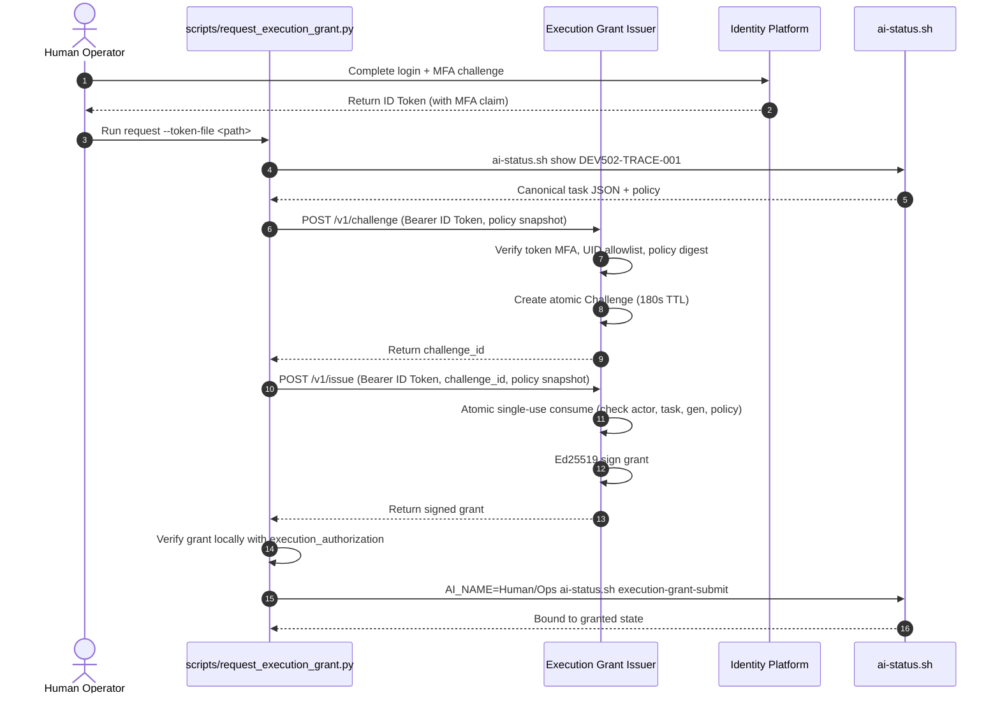

# Execution Grant Issuer Operations Guide

Task: `OPS-EXECUTION-MFA-ISSUER-001`  
Source of record: `/home/chloe_ong_dev_cctech_support_com/code/pantheon-artifacts/dev-diagnostics-20260907/ISSUER-SA-SD-20260908.md`  
Status: Active operational runbook  

---

## 1. Overview & Authority Boundaries

The **Execution Grant Issuer** is an isolated development-tooling authority service that bridges human multi-factor authentication (MFA) via Google Cloud Identity Platform to Pantheon's canonical execution authorization gate (`.orchestrator/execution_authorization.py`).

### Separation of Concerns
1. **Development Tooling vs. Product Runtime:**
   - The issuer is pure operational development tooling. It has **no** product BFF routes, **no** frontend dependencies in `execute-plans`, and introduces **no** new TaskStore writers.
   - It runs outside background auto-worker reach and signs execution grants only after verifying genuine operator identity and second-factor authentication.
2. **Canonical State Integrity:**
   - Challenge storage belongs exclusively to the issuer service; it is **not** canonical task state.
   - The issuer does not write to `.orchestrator/task-state-events-v2.jsonl`. Grant submission proceeds exclusively through the existing governed CLI:
     ```bash
     AI_NAME=Human/Ops EXECUTION_GRANT_JSON='<grant>' scripts/ai-status.sh execution-grant-submit <task-id>
     ```
3. **Step 5 Strict Pause:**
   - Per operator instructions and SA/SD specifications, Step 5 remains strictly paused. The issuer strictly rejects any request associated with S5 or step-5 tasks.

---

## 2. Authentication & Cryptographic Verification

### Identity Platform ID Token Verification
Cryptographic verification (signature, issuer, audience, expiry) and,
when `identity_platform.check_revocation` is enabled (default `true`),
revoked/disabled-account denial are delegated entirely to the pinned
`firebase-admin` SDK's `auth.verify_id_token(check_revoked=True)`,
authenticated with Application Default Credentials on the isolated issuer
host -- the issuer never re-implements token cryptography, never calls
Google endpoints directly, and never reads a downloadable service-account
key file. On top of the SDK's verified claims, the issuer additionally
enforces:
- **Project (`pantheon-dev-20260902`):** enforced by the SDK against `iss`/`aud` (rejects retired projects such as `pantheon-benjamin-20260528`).
- **Subject (`sub` / `uid`):** Must match an entry in the explicit `allowed_operator_uids` allowlist.
- **Email:** Non-empty and `email_verified == true`.
- **Freshness (`auth_time`):** Authentication timestamp must be within `max_auth_age_seconds` (default 3600s) and not in the future.
- **Multi-Factor Authentication (MFA):** Token must contain a completed second-factor claim (`sign_in_second_factor` in `totp`, `phone`, `sms`, `security_key`). Single-factor password-only tokens are rejected.
- **Forbidden Principals:** Anonymous tokens, service account / ADC tokens, and custom-provider claims are rejected.
- **Revoked / Disabled Accounts:** With `check_revocation: true`, the SDK's live revocation check denies revoked tokens and disabled accounts (`RevokedIdTokenError`, `UserDisabledError`); any SDK error (including a certificate-fetch outage) fails closed.

### Ed25519 Grant Signing
- Once verification and challenge consumption succeed, the service constructs a grant payload adhering strictly to `execution_authorization.py`:
  - `purpose`: `pantheon.execution.mfa`
  - `capability`: `assistant.canonical.execute`
  - `audience`: task ID
  - `mfa_verified`: `true`
  - `mfa_actor`: operator UID
  - `nonce`: cryptographically random hex string
  - `issued_at`: UTC ISO timestamp
  - `expires_at`: UTC ISO timestamp (bounded to $\le 300$ seconds freshness)
  - `run_ttl_seconds`: bounded integer (default 1800s)
- Grants are signed using a dedicated Ed25519 private key.

---

## 3. Ephemeral Challenge Protocol

The service implements an atomic two-step challenge-response issuance flow:



### Protection Guarantees
- **Atomic Single-Use:** Challenge consumption is protected by a mutex lock. Concurrent attempts fail immediately with HTTP 409.
- **Binding Invariance:** The policy snapshot sent at completion is compared canonical JSON byte-for-byte against the challenged policy. Any client-selected policy substitution fails with HTTP 400.
- **Actor Invariance:** Only the operator UID that requested the challenge can consume it.

---

## 4. Scoped TRACE Request CLI

The repository includes `scripts/request_execution_grant.py` for operators to interact with the service safely:

### Security Guard: No Tokens on `sys.argv`
Passing authentication tokens as command-line arguments is strictly prohibited to prevent credential disclosure in system process listings (`ps`). The script aborts with code 2 if `--token` or `--token=...` is present.

### Commands

#### 1. Prepare Request
```bash
python3 scripts/request_execution_grant.py prepare \
  --task DEV502-TRACE-001 \
  --out /tmp/trace-challenge-req.json
```

#### 2. Request & Verify Grant
```bash
python3 scripts/request_execution_grant.py request \
  --task DEV502-TRACE-001 \
  --issuer-url http://127.0.0.1:8090 \
  --token-file /path/to/operator-id-token.txt \
  --grant-out /tmp/trace-grant.json
```

#### 3. Request, Verify & Submit Immediately
```bash
python3 scripts/request_execution_grant.py request \
  --task DEV502-TRACE-001 \
  --issuer-url http://127.0.0.1:8090 \
  --token-file /path/to/operator-id-token.txt \
  --submit
```

---

## 5. Deployment & Systemd Configuration

### Service User & Directories
- **User:** `pantheon-issuer` (dedicated unprivileged system user without sudo access).
- **Config Directory:** `/etc/pantheon/execution-grant-issuer/` (mode `0750`, owned by `root:pantheon-issuer`).
- **Private Key:** `/etc/pantheon/execution-grant-issuer/ed25519-private.pem` (mode `0600`, owned by `pantheon-issuer:pantheon-issuer`).
- **Log Directory:** `/var/log/pantheon/` (mode `0755`).

### Systemd Unit File
Location: `/etc/systemd/system/pantheon-execution-grant-issuer.service`
```ini
[Unit]
Description=Pantheon Operational Execution Grant Issuer Service
After=network.target network-online.target

[Service]
Type=simple
User=pantheon-issuer
Group=pantheon-issuer
WorkingDirectory=/opt/pantheon
Environment=PYTHONUNBUFFERED=1
Environment=ISSUER_CONFIG_PATH=/etc/pantheon/execution-grant-issuer/config.json
ExecStart=/usr/bin/python3 /opt/pantheon/deploy/execution-grant-issuer/run_server.py --config /etc/pantheon/execution-grant-issuer/config.json
Restart=on-failure
RestartSec=5s

ProtectSystem=strict
ProtectHome=true
PrivateTmp=true
NoNewPrivileges=true
ReadOnlyPaths=/etc/pantheon/execution-grant-issuer /opt/pantheon
ReadWritePaths=/var/log/pantheon

[Install]
WantedBy=multi-user.target
```

---

## 6. Public Key Trust Promotion & Rollback Runbook

### Step 6.1: Key Generation
On the dedicated issuer server:
```bash
python3 deploy/execution-grant-issuer/run_server.py \
  --generate-key-pair /etc/pantheon/execution-grant-issuer/ed25519-private.pem \
  --key-id pantheon-mfa-issuer-dev-20260908
```

### Step 6.2: Trust Configuration in Pantheon
Record the public key in `.orchestrator/config.json`:
```json
{
  "execution_authorization": {
    "mfa_issuer_public_keys": {
      "pantheon-mfa-issuer-dev-20260908": "<base64url-public-key>"
    }
  }
}
```

### Step 6.3: Runtime Promotion
`scripts/promote_supervisor_runtime.py` replaces the running supervisor with
one exact authoritative-V2 runtime; it has no bare invocation and always
requires an explicit `--status-root`. Run it from the current-host qualified
source checkout (`$PANTHEON_DEPLOY_ROOT`), against the live status root
(`$PANTHEON_STATUS_ROOT`), and supply the public-trust-only verifier map via
`--authority-env-file` -- a mode-`0600` file containing only public verifier
material (e.g. the `mfa_issuer_public_keys` trust root above), never a
private signing key or bearer credential:

```bash
# 1. Discover-only: validate the candidate runtime and current live config
#    without stopping anything.
python3 -B "${PANTHEON_DEPLOY_ROOT:?}/scripts/promote_supervisor_runtime.py" \
  --repo "${PANTHEON_DEPLOY_ROOT:?}" \
  --status-root "${PANTHEON_STATUS_ROOT:?}" \
  --authority-env-file /etc/pantheon/execution-grant-issuer/public-trust-env.json \
  --discover-only --json

# 2. Promote: stop the incumbent supervisor and launch the validated
#    candidate. Only run this after step 1 reports every invariant passed.
python3 -B "${PANTHEON_DEPLOY_ROOT:?}/scripts/promote_supervisor_runtime.py" \
  --repo "${PANTHEON_DEPLOY_ROOT:?}" \
  --status-root "${PANTHEON_STATUS_ROOT:?}" \
  --authority-env-file /etc/pantheon/execution-grant-issuer/public-trust-env.json \
  --promote
```

`--repo` and `--status-root` must both resolve to the qualified, currently
deployed checkouts on this host -- never a retired or ad-hoc path. Omitting
`--promote`/`--discover-only` is not a safe default; run discovery first and
only pass `--promote` once its output confirms the candidate is eligible.

### Step 6.4: Rollback & Revocation Procedure
If an issuer key is compromised or needs to be revoked:
1. Revoke the outstanding grant immediately via CLI:
   ```bash
   AI_NAME=Human/Ops scripts/ai-status.sh execution-grant-revoke DEV502-TRACE-001 "Key compromised"
   ```
2. Remove the key ID from `execution_authorization.mfa_issuer_public_keys` in `.orchestrator/config.json`.
3. Promote the updated configuration using the qualified current-host invocation from Step 6.3 (`--repo`, `--status-root`, `--authority-env-file`, then `--discover-only` followed by `--promote`).
4. Stop the issuer service:
   ```bash
   sudo systemctl stop pantheon-execution-grant-issuer
   ```

---

## 7. Verified Worker sudo/key/unit/config Isolation

To ensure background auto-workers cannot forge or mint execution grants:
1. **Dedicated Service Identity:**
   - The issuer runs under dedicated system user `pantheon-issuer` (group `pantheon-issuer`).
   - Auto-workers run under unprivileged user accounts and MUST NOT possess `sudo` privileges over the `pantheon-issuer` service, systemd units, configuration files, or private keys.
2. **Filesystem Permissions & Host Isolation:**
   - Private key `/etc/pantheon/execution-grant-issuer/ed25519-private.pem` is strictly mode `0600`, owned by `pantheon-issuer:pantheon-issuer`.
   - The directory `/etc/pantheon/execution-grant-issuer/` is mode `0750`, owned by `root:pantheon-issuer`.
   - Ideal topology: deploy the issuer on a separate isolated VM / control host remote to the shared worker VM. If co-located, verify via `sudo -l -U <worker-user>` that workers cannot read `/etc/pantheon/execution-grant-issuer/` or restart `pantheon-execution-grant-issuer.service`.

---

## 8. Readiness & Liveness Failure Conditions

The `/healthz` and `/livez` endpoints expose service health. The service fails closed and marks itself unready under the following conditions:
1. **Application Default Credentials Unavailable (`identity_platform_credentials`):**
   - Readiness actually resolves the issuer host's Application Default Credentials (the same credential `firebase-admin`'s `auth.verify_id_token(check_revoked=True)` needs at request time); if ADC cannot be resolved, `/healthz` returns 503 even though `/livez` still reports the process is up.
2. **Signer Key Inaccessibility:**
   - Private key file cannot be loaded, has wrong permissions, or does not contain a valid Ed25519 private key.
3. **Insecure Network Binding:**
   - Service configured to bind to a non-loopback address (e.g. `0.0.0.0`) without TLS configuration (`service.tls.enabled = false`).
4. **Policy Misconfiguration:**
   - Missing or corrupted policy constraints in `config.json`.

---

## 9. Current-Project Human Reauthentication & Fresh MFA Token Acquisition

The execution grant issuer enforces current-project tokens from `pantheon-dev-20260902` and rejects tokens from retired projects (`pantheon-benjamin-20260528`) or single-factor authentication.

### Acquiring a Fresh MFA ID Token

**This is a distinct credential from `gcloud` / Application Default
Credentials.** `gcloud auth login --update-adc` authenticates the *operator's
workstation* to call Google Cloud APIs (and is what the issuer host itself
uses via ADC to call `firebase-admin`'s `auth.verify_id_token`) -- it does
**not** produce an Identity Platform *user* ID token, has no MFA claim, and
is never accepted by the issuer's token verifier (service-account/ADC
subjects are explicitly rejected). The only way to obtain a token this
service will accept is genuine Identity Platform end-user sign-in with a
completed second factor, below.

The tooling web interface (`index.html`) and CLI accept an already-obtained
fresh Identity Platform user ID token. To acquire one entirely on the
operator's own workstation, without ever putting a password, pending
credential, or the resulting `idToken` on the command line, in shell
history, or on stdout:

1. Sign in with password to initiate the MFA challenge. Provide the password
   over stdin (`--data @-`) instead of as a shell argument, and capture only
   the response body to a private file (`-o`, created with a restrictive
   umask) so a pending credential is never printed to the terminal:
   ```bash
   umask 0177
   curl -sS -X POST \
     "https://identitytoolkit.googleapis.com/v1/accounts:signInWithPassword?key=${IDENTITY_PLATFORM_API_KEY}" \
     -H "Content-Type: application/json" \
     --data @- -o /tmp/signin-step1.json <<'EOF'
   {"email":"operator-chloe@pantheon.trade","password":"REPLACE_INTERACTIVELY","returnSecureToken":true}
   EOF
   ```
   If MFA is enrolled, `/tmp/signin-step1.json` (mode `0600` from the
   `umask` above) contains `mfaPendingCredential` and the enrolled
   `mfaEnrollmentId`(s) under `mfaInfo`. Replace the literal password in the
   heredoc interactively; do not leave it in a saved script or shell history.
2. Finalize the second factor using the official **v2** endpoint (the v1
   path used previously does not exist for this operation). The request body
   is `mfaPendingCredential`, `mfaEnrollmentId`, and
   `totpVerificationInfo.verificationCode` -- not the v1-shaped
   `totpVerificationCode`:
   ```bash
   PENDING_CRED="$(python3 -c 'import json,sys; print(json.load(open(sys.argv[1]))["mfaPendingCredential"])' /tmp/signin-step1.json)"
   ENROLLMENT_ID="$(python3 -c 'import json,sys; print(json.load(open(sys.argv[1]))["mfaInfo"][0]["mfaEnrollmentId"])' /tmp/signin-step1.json)"
   umask 0177
   python3 -c '
   import json, sys
   print(json.dumps({
       "mfaPendingCredential": sys.argv[1],
       "mfaEnrollmentId": sys.argv[2],
       "totpVerificationInfo": {"verificationCode": sys.argv[3]},
   }))
   ' "$PENDING_CRED" "$ENROLLMENT_ID" "REPLACE_WITH_TOTP_CODE" \
     | curl -sS -X POST \
       "https://identitytoolkit.googleapis.com/v2/accounts/mfaSignIn:finalize?key=${IDENTITY_PLATFORM_API_KEY}" \
       -H "Content-Type: application/json" \
       --data @- -o /tmp/signin-step2.json
   shred -u /tmp/signin-step1.json
   ```
   The returned `idToken` in `/tmp/signin-step2.json` (mode `0600`) contains
   the verified `sign_in_second_factor` claim and `auth_time`. Neither the
   TOTP code nor the resulting `idToken` is ever printed to the terminal by
   this sequence.
3. **Feeding the Token to the CLI:**
   ```bash
   # Extract only the idToken into its own private 0600 file; the file is
   # created with the restrictive umask still in effect, so there is no
   # echo-then-chmod window during which the token is world/group readable.
   umask 0177
   python3 -c '
   import json, sys
   with open(sys.argv[2], "w") as f:
       f.write(json.load(open(sys.argv[1]))["idToken"])
   ' /tmp/signin-step2.json /tmp/operator-token.txt
   shred -u /tmp/signin-step2.json

   # Run the scoped TRACE client:
   python3 scripts/request_execution_grant.py request \
     --task DEV502-TRACE-001 \
     --token-file /tmp/operator-token.txt \
     --submit
   shred -u /tmp/operator-token.txt
   ```

---

## 10. Single-Process Deployment & Safe Restart Semantics

The in-memory `ChallengeStore` coordinates atomic single-use challenge consumption within a single process:
1. **Single-Process Enforcement:**
   - The issuer service runs as a single process (`Type=simple` in systemd with `Restart=on-failure`).
   - Do NOT run multi-worker prefork servers (such as gunicorn with multiple worker processes) without shared transactional persistence (e.g., PostgreSQL or Redis with atomic Lua scripts), as in-memory challenges are not shared across process boundaries.
2. **Safe Restart Semantics:**
   - Challenges are ephemeral with a default TTL of 180 seconds.
   - On service restart (`SIGTERM` / `SIGINT`), active pending challenges are discarded. Operators simply re-request a challenge with their fresh ID token; no orphan durable state or partial grants remain.

