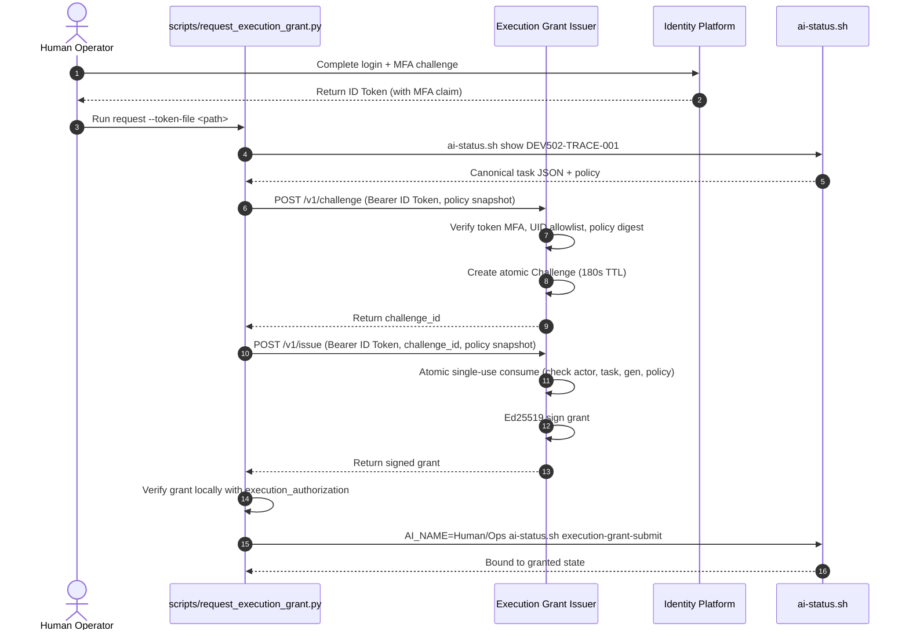

# Execution Grant Issuer Operations Guide

Task: `OPS-EXECUTION-MFA-ISSUER-001`  
Source of record: `/home/chloe_ong_dev_cctech_support_com/code/pantheon-artifacts/dev-diagnostics-20260907/ISSUER-SA-SD-20260908.md`  
Status: Active operational runbook  

---

## 1. Overview & Authority Boundaries

The **Execution Grant Issuer** is an isolated development-tooling authority service that bridges human multi-factor authentication (MFA) via Google Cloud Identity Platform to Pantheon's canonical execution authorization gate (`.orchestrator/execution_authorization.py`).

### Separation of Concerns
1. **Development Tooling vs. Product Runtime:**
   - The issuer is pure operational development tooling. It has **no** product BFF routes, **no** frontend dependencies in `execute-plans`, and introduces **no** new TaskStore writers.
   - It runs outside background auto-worker reach and signs execution grants only after verifying genuine operator identity and second-factor authentication.
2. **Canonical State Integrity:**
   - Challenge storage belongs exclusively to the issuer service; it is **not** canonical task state.
   - The issuer does not write to `.orchestrator/task-state-events-v2.jsonl`. Grant submission proceeds exclusively through the existing governed CLI:
     ```bash
     AI_NAME=Human/Ops EXECUTION_GRANT_JSON='<grant>' scripts/ai-status.sh execution-grant-submit <task-id>
     ```
3. **Step 5 Strict Pause:**
   - Per operator instructions and SA/SD specifications, Step 5 remains strictly paused. The issuer strictly rejects any request associated with S5 or step-5 tasks.

---

## 2. Authentication & Cryptographic Verification

### Identity Platform ID Token Verification
Cryptographic verification (signature, issuer, audience, expiry) and,
when `identity_platform.check_revocation` is enabled (default `true`),
revoked/disabled-account denial are delegated entirely to the pinned
`firebase-admin` SDK's `auth.verify_id_token(check_revoked=True)`,
authenticated with Application Default Credentials on the isolated issuer
host -- the issuer never re-implements token cryptography, never calls
Google endpoints directly, and never reads a downloadable service-account
key file. On top of the SDK's verified claims, the issuer additionally
enforces:
- **Project (`pantheon-dev-20260902`):** enforced by the SDK against `iss`/`aud` (rejects retired projects such as `pantheon-benjamin-20260528`).
- **Subject (`sub` / `uid`):** Must match an entry in the explicit `allowed_operator_uids` allowlist.
- **Email:** Non-empty and `email_verified == true`.
- **Freshness (`auth_time`):** Authentication timestamp must be within `max_auth_age_seconds` (default 3600s) and not in the future.
- **Multi-Factor Authentication (MFA):** Token must contain a completed second-factor claim (`sign_in_second_factor` in `totp`, `phone`, `sms`, `security_key`). Single-factor password-only tokens are rejected.
- **Forbidden Principals:** Anonymous tokens, service account / ADC tokens, and custom-provider claims are rejected.
- **Revoked / Disabled Accounts:** With `check_revocation: true`, the SDK's live revocation check denies revoked tokens and disabled accounts (`RevokedIdTokenError`, `UserDisabledError`); any SDK error (including a certificate-fetch outage) fails closed.

### Ed25519 Grant Signing
- Once verification and challenge consumption succeed, the service constructs a grant payload adhering strictly to `execution_authorization.py`:
  - `purpose`: `pantheon.execution.mfa`
  - `capability`: `assistant.canonical.execute`
  - `audience`: task ID
  - `mfa_verified`: `true`
  - `mfa_actor`: operator UID
  - `nonce`: cryptographically random hex string
  - `issued_at`: UTC ISO timestamp
  - `expires_at`: UTC ISO timestamp (bounded to $\le 300$ seconds freshness)
  - `run_ttl_seconds`: bounded integer (default 1800s)
- Grants are signed using a dedicated Ed25519 private key.

---

## 3. Ephemeral Challenge Protocol

The service implements an atomic two-step challenge-response issuance flow:



### Protection Guarantees
- **Atomic Single-Use:** Challenge consumption is protected by a mutex lock. Concurrent attempts fail immediately with HTTP 409.
- **Binding Invariance:** The policy snapshot sent at completion is compared canonical JSON byte-for-byte against the challenged policy. Any client-selected policy substitution fails with HTTP 400.
- **Actor Invariance:** Only the operator UID that requested the challenge can consume it.

---

## 4. Scoped TRACE Request CLI

The repository includes `scripts/request_execution_grant.py` for operators to interact with the service safely:

### Security Guard: No Tokens on `sys.argv`
Passing authentication tokens as command-line arguments is strictly prohibited to prevent credential disclosure in system process listings (`ps`). The script aborts with code 2 if `--token` or `--token=...` is present.

### Commands

#### 1. Prepare Request
```bash
python3 scripts/request_execution_grant.py prepare \
  --task DEV502-TRACE-001 \
  --out /tmp/trace-challenge-req.json
```

#### 2. Request & Verify Grant
```bash
python3 scripts/request_execution_grant.py request \
  --task DEV502-TRACE-001 \
  --issuer-url http://127.0.0.1:8090 \
  --token-file /path/to/operator-id-token.txt \
  --grant-out /tmp/trace-grant.json
```

#### 3. Request, Verify & Submit Immediately
```bash
python3 scripts/request_execution_grant.py request \
  --task DEV502-TRACE-001 \
  --issuer-url http://127.0.0.1:8090 \
  --token-file /path/to/operator-id-token.txt \
  --submit
```

---

## 5. Deployment & Systemd Configuration

### Service User & Directories
- **User:** `pantheon-issuer` (dedicated unprivileged system user without sudo access).
- **Config Directory:** `/etc/pantheon/execution-grant-issuer/` (mode `0750`, owned by `root:pantheon-issuer`).
- **Private Key:** `/etc/pantheon/execution-grant-issuer/ed25519-private.pem` (mode `0600`, owned by `pantheon-issuer:pantheon-issuer`).
- **Log Directory:** `/var/log/pantheon/` (mode `0755`).

### Systemd Unit File
Location: `/etc/systemd/system/pantheon-execution-grant-issuer.service`
```ini
[Unit]
Description=Pantheon Operational Execution Grant Issuer Service
After=network.target network-online.target

[Service]
Type=simple
User=pantheon-issuer
Group=pantheon-issuer
WorkingDirectory=/opt/pantheon
Environment=PYTHONUNBUFFERED=1
Environment=ISSUER_CONFIG_PATH=/etc/pantheon/execution-grant-issuer/config.json
ExecStart=/usr/bin/python3 /opt/pantheon/deploy/execution-grant-issuer/run_server.py --config /etc/pantheon/execution-grant-issuer/config.json
Restart=on-failure
RestartSec=5s

ProtectSystem=strict
ProtectHome=true
PrivateTmp=true
NoNewPrivileges=true
ReadOnlyPaths=/etc/pantheon/execution-grant-issuer /opt/pantheon
ReadWritePaths=/var/log/pantheon

[Install]
WantedBy=multi-user.target
```

---

## 6. Public Key Trust Promotion & Rollback Runbook

### Step 6.1: Key Generation
On the dedicated issuer server:
```bash
python3 deploy/execution-grant-issuer/run_server.py \
  --generate-key-pair /etc/pantheon/execution-grant-issuer/ed25519-private.pem \
  --key-id pantheon-mfa-issuer-dev-20260908
```

### Step 6.2: Trust Configuration in Pantheon
Record the public key in `.orchestrator/config.json`:
```json
{
  "execution_authorization": {
    "mfa_issuer_public_keys": {
      "pantheon-mfa-issuer-dev-20260908": "<base64url-public-key>"
    }
  }
}
```

### Step 6.3: Publishing The MFA Issuer's Public Trust Root & Command-Runtime Promotion

The supervisor and governed status commands (including `scripts/ai-status.sh execution-grant-submit`) execute from an immutable command runtime (`PANTHEON_COMMAND_ROOT`, pointing to `$DEPLOY_ROOT/command-runtimes/<HEAD>`).
`scripts/ai_status.py:311` binds its configuration from its own root:
```python
CONFIG_FILE = ROOT / ".orchestrator" / "config.json"
```
Because `ROOT` is the immutable runtime checkout, committing the public key to `.orchestrator/config.json` in the repository or dev branch does **not** take effect on the live supervisor or the pinned submit command until a new command runtime is materialized and promoted.

Therefore, publishing or rotating the MFA issuer's public trust root requires:
1. Committing the updated `execution_authorization.mfa_issuer_public_keys` map into `.orchestrator/config.json` and integrating it into `dev`.
2. Materializing a new immutable command runtime under `$DEPLOY_ROOT/command-runtimes/<TARGET_SHA>` (e.g. via `scripts/sync-dev-root.sh` or dedicated deployment automation).
3. Promoting the candidate runtime to update `PANTHEON_COMMAND_ROOT` and refresh the live supervisor configuration via `scripts/promote_supervisor_runtime.py`:

```bash
# 1. Discover-only: validate candidate runtime invariants, barrier preflights,
#    and live config without stopping anything.
python3 -B "${PANTHEON_DEPLOY_ROOT:?}/scripts/promote_supervisor_runtime.py" \
  --repo "${CANDIDATE_COMMAND_ROOT:?}" \
  --status-root "${PANTHEON_STATUS_ROOT:?}" \
  --authority-env-file /etc/pantheon/dev-bridge/bridge-signing-public-keys-env \
  --discover-only --json

# 2. Promote: stop the incumbent supervisor and atomically launch the candidate
#    runtime with the new configuration. Only run after step 1 passes all checks.
python3 -B "${PANTHEON_DEPLOY_ROOT:?}/scripts/promote_supervisor_runtime.py" \
  --repo "${CANDIDATE_COMMAND_ROOT:?}" \
  --status-root "${PANTHEON_STATUS_ROOT:?}" \
  --authority-env-file /etc/pantheon/dev-bridge/bridge-signing-public-keys-env \
  --promote
```

Note on `--authority-env-file`: This parameter sets `BRIDGE_SIGNING_PUBLIC_KEYS_JSON`, the trust root used for dev-bridge task packet verification. It must be carried forward during runtime promotion if dev bridge is active. The MFA issuer keys themselves reside in the promoted runtime's `.orchestrator/config.json`.

4. **Verify Both Key Fingerprints:**
   After promotion, verify that the active signer fingerprint matches the promoted runtime config fingerprint:
   - **Active Signer Fingerprint:** Inspect the active key directly via `--inspect-key` (which validates 0600 mode and ownership, and outputs public trust info without disclosing private key material) or read from the service startup log:
     ```bash
     # Option 1: Direct key inspection (scoped public-only output):
     python3 deploy/execution-grant-issuer/run_server.py --inspect-key /etc/pantheon/execution-grant-issuer/ed25519-private.pem

     # Option 2: Service startup log:
     journalctl -u pantheon-execution-grant-issuer.service -b | grep "Signer Key ID"
     ```
   - **Promoted Runtime Config Fingerprint:** Verify the fingerprint calculated from the promoted runtime's `.orchestrator/config.json`:
     ```bash
     python3 -c '
     import json, base64, hashlib
     cfg = json.load(open("'"${PANTHEON_COMMAND_ROOT}"'" + "/.orchestrator/config.json"))
     keys = cfg["execution_authorization"]["mfa_issuer_public_keys"]
     for kid, b64 in keys.items():
         raw = base64.urlsafe_b64decode(b64 + "==")
         fp = hashlib.sha256(raw).hexdigest()
         print(f"{kid}: {fp}")
     '
     ```
   Both fingerprints must match identically before submitting grants.

### Step 6.4: Rollback & Revocation Procedure

If an issuer key is compromised, superseded, or needs to be revoked:
1. **Revoke Outstanding Grants Immediately:**
   ```bash
   AI_NAME=Human/Ops scripts/ai-status.sh execution-grant-revoke DEV502-TRACE-001 "Key compromised or rotated"
   ```
2. **Stop The Issuer Service:**
   ```bash
   sudo systemctl stop pantheon-execution-grant-issuer
   ```
3. **Roll Back or Revoke via Runtime Promotion:**
   Remove the revoked key ID from `execution_authorization.mfa_issuer_public_keys` in `.orchestrator/config.json`.
   Materialize a new command runtime containing the updated config and promote it using `promote_supervisor_runtime.py` (or re-promote a known-good prior immutable command runtime from `$DEPLOY_ROOT/command-runtimes/<PRIOR_SHA>`).
   **CRITICAL:** Never attempt to patch files inside an immutable command runtime (`command-runtimes/<SHA>`) in place. Command runtimes are strictly immutable; rollback and revocation must always flow through runtime promotion.
4. **Verify Revocation:**
   Confirm that the revoked key ID no longer exists in `$PANTHEON_COMMAND_ROOT/.orchestrator/config.json` and that grants signed by that key fail verification with `Unknown key ID`.

---

## 7. Verified Worker sudo/key/unit/config Isolation

To ensure background auto-workers cannot forge or mint execution grants:
1. **Dedicated Service Identity:**
   - The issuer runs under dedicated system user `pantheon-issuer` (group `pantheon-issuer`).
   - Auto-workers run under unprivileged user accounts and MUST NOT possess `sudo` privileges over the `pantheon-issuer` service, systemd units, configuration files, or private keys.
2. **Filesystem Permissions & Host Isolation:**
   - Private key `/etc/pantheon/execution-grant-issuer/ed25519-private.pem` is strictly mode `0600`, owned by `pantheon-issuer:pantheon-issuer`.
   - The directory `/etc/pantheon/execution-grant-issuer/` is mode `0750`, owned by `root:pantheon-issuer`.
   - Ideal topology: deploy the issuer on a separate isolated VM / control host remote to the shared worker VM. If co-located, verify via `sudo -l -U <worker-user>` that workers cannot read `/etc/pantheon/execution-grant-issuer/` or restart `pantheon-execution-grant-issuer.service`.

---

## 8. Readiness & Liveness Failure Conditions

The `/healthz` and `/livez` endpoints expose service health. The service fails closed and marks itself unready under the following conditions:
1. **Application Default Credentials Unavailable (`identity_platform_credentials`):**
   - Readiness resolves the issuer host's Application Default Credentials and then performs one bounded, real refresh against Google's token endpoint (the same credential `firebase-admin`'s `auth.verify_id_token(check_revoked=True)` needs at request time). Obtaining the cached credential object alone does not prove it is still valid -- a process can hold a stale cached credential -- so refresh failure also fails closed. If ADC cannot be resolved or refreshed, `/healthz` returns 503 even though `/livez` still reports the process is up. Refresh failures are reported by exception type only, never by raw exception text, since transport errors can embed request URLs.
2. **Signer Key Inaccessibility:**
   - Private key file cannot be loaded, has wrong permissions, or does not contain a valid Ed25519 private key.
3. **Insecure Network Binding:**
   - Service configured to bind to a non-loopback address (e.g. `0.0.0.0`) without TLS configuration (`service.tls.enabled = false`).
4. **Policy Misconfiguration:**
   - Missing or corrupted policy constraints in `config.json`.

---

## 9. Current-Project Human Reauthentication & Fresh MFA Token Acquisition

The execution grant issuer enforces current-project tokens from `pantheon-dev-20260902` and rejects tokens from retired projects (`pantheon-benjamin-20260528`) or single-factor authentication.

### Acquiring a Fresh MFA ID Token

**This is a distinct credential from `gcloud` / Application Default
Credentials.** `gcloud auth login --update-adc` authenticates the *operator's
workstation* to call Google Cloud APIs (and is what the issuer host itself
uses via ADC to call `firebase-admin`'s `auth.verify_id_token`) -- it does
**not** produce an Identity Platform *user* ID token, has no MFA claim, and
is never accepted by the issuer's token verifier (service-account/ADC
subjects are explicitly rejected). The only way to obtain a token this
service will accept is genuine Identity Platform end-user sign-in with a
completed second factor, below.

The tooling web interface (`index.html`) and CLI accept an already-obtained
fresh Identity Platform user ID token. To acquire one entirely on the
operator's own workstation, without ever putting a password, pending
credential, or the resulting `idToken` on the command line, in shell
history, or on stdout, and ensuring all intermediate and output files are
exclusively private without symlink-following or reusing existing non-private paths:

### Initializing Private Working Directory & Bounded Cleanup Trap

Create a fresh private `0700` temporary directory owned strictly by the current user.
Set an exit trap to ensure sensitive credential files are securely shredded and removed
on normal exit or bounded error:

```bash
MFA_DIR="$(mktemp -d "${TMPDIR:-/tmp}/pantheon-mfa.XXXXXX")"
chmod 0700 "$MFA_DIR"
trap 'if [ -n "${MFA_DIR:-}" ] && [ -d "$MFA_DIR" ]; then shred -u "$MFA_DIR"/* 2>/dev/null || true; rm -rf "$MFA_DIR"; fi' EXIT INT TERM
```

1. **Sign in with password to initiate the MFA challenge.**
   The password is read interactively with the shell's non-echoing `read -s` and passed to Python
   strictly via the process environment (never typed into an interactive heredoc,
   which Bash history records despite stdin redirection), formatted to JSON, and
   piped directly into `curl --data @-` before unsetting the variable immediately.
   The response is captured exclusively via Python with `os.O_WRONLY | os.O_CREAT | os.O_EXCL | os.O_NOFOLLOW`
   and mode `0600` into `$MFA_DIR/signin-step1.json`. If the file already exists or is a symlink,
   it fails closed immediately rather than overwriting or retaining pre-existing permissions:
   ```bash
   read -r -s -p "Enter operator password: " OPERATOR_PASSWORD
   echo
   export OPERATOR_PASSWORD
   python3 -c '
   import json, os
   print(json.dumps({
       "email": "operator-chloe@pantheon.trade",
       "password": os.environ["OPERATOR_PASSWORD"],
       "returnSecureToken": True,
   }))
   ' | curl -sS -X POST \
     "https://identitytoolkit.googleapis.com/v1/accounts:signInWithPassword?key=${IDENTITY_PLATFORM_API_KEY}" \
     -H "Content-Type: application/json" \
     --data @- | python3 -c '
   import json, os, sys
   dest = sys.argv[1]
   data = sys.stdin.buffer.read()
   try:
       parsed = json.loads(data.decode("utf-8"))
   except Exception as e:
       sys.exit(f"Failed to parse Identity Platform response: {e}")
   if "error" in parsed:
       sys.exit(f"Identity Platform sign-in failed: {parsed['error'].get('message', 'Unknown error')}")
   if "mfaPendingCredential" not in parsed:
       sys.exit("Expected MFA challenge response (mfaPendingCredential), but not present")
   flags = os.O_WRONLY | os.O_CREAT | os.O_EXCL | getattr(os, "O_NOFOLLOW", 0)
   fd = os.open(dest, flags, 0o600)
   with open(fd, "wb") as f:
       f.write(data)
   ' "$MFA_DIR/signin-step1.json"
   unset OPERATOR_PASSWORD
   ```
   If MFA is enrolled, `$MFA_DIR/signin-step1.json` (exclusive mode `0600`) contains
   `mfaPendingCredential` and the enrolled `mfaEnrollmentId`(s) under `mfaInfo`.

2. **Finalize the second factor using the official v2 endpoint.**
   The request body is `mfaPendingCredential`, `mfaEnrollmentId`, and
   `totpVerificationInfo.verificationCode` -- not the legacy v1-shaped `totpVerificationCode`.
   None of `mfaPendingCredential`, the enrollment id, or the TOTP code are ever passed as
   command-line arguments (visible in `ps`); the TOTP code is read interactively with the shell's
   non-echoing `read -s` and handed to the child process only through its environment.
   `mfaPendingCredential` and the enrollment id are read directly from the private step-1 file
   inside Python. The response is verified and written exclusively to `$MFA_DIR/signin-step2.json`
   (mode `0600`, `O_CREAT | O_EXCL | O_NOFOLLOW`):
   ```bash
   read -r -s -p "Enter TOTP code: " TOTP_CODE
   echo
   export TOTP_CODE
   python3 - "$MFA_DIR/signin-step1.json" <<'PYEOF' \
     | curl -sS -X POST \
       "https://identitytoolkit.googleapis.com/v2/accounts/mfaSignIn:finalize?key=${IDENTITY_PLATFORM_API_KEY}" \
       -H "Content-Type: application/json" \
       --data @- | python3 -c '
   import json, os, sys
   dest = sys.argv[1]
   data = sys.stdin.buffer.read()
   try:
       parsed = json.loads(data.decode("utf-8"))
   except Exception as e:
       sys.exit(f"Failed to parse MFA finalize response: {e}")
   if "error" in parsed:
       sys.exit(f"MFA finalize failed: {parsed['error'].get('message', 'Unknown error')}")
   if "idToken" not in parsed:
       sys.exit("Expected idToken in finalize response, but not present")
   flags = os.O_WRONLY | os.O_CREAT | os.O_EXCL | getattr(os, "O_NOFOLLOW", 0)
   fd = os.open(dest, flags, 0o600)
   with open(fd, "wb") as f:
       f.write(data)
   ' "$MFA_DIR/signin-step2.json"
   import json, os, sys
   step1 = json.load(open(sys.argv[1]))
   print(json.dumps({
       "mfaPendingCredential": step1["mfaPendingCredential"],
       "mfaEnrollmentId": step1["mfaInfo"][0]["mfaEnrollmentId"],
       "totpVerificationInfo": {"verificationCode": os.environ["TOTP_CODE"]},
   }))
   PYEOF
   unset TOTP_CODE
   shred -u "$MFA_DIR/signin-step1.json"
   ```
   The returned `idToken` in `$MFA_DIR/signin-step2.json` (mode `0600`) contains
   the verified `sign_in_second_factor` claim and `auth_time`. Neither the
   TOTP code nor the resulting `idToken` is ever printed to the terminal.

3. **Extracting Token and Feeding to the Qualified Client:**
   Extract only the `idToken` into its own private `0600` file inside `$MFA_DIR`.
   The file is created with `O_CREAT | O_EXCL | O_NOFOLLOW` so no pre-existing file or symlink
   can be overwritten and there is no post-hoc chmod window:
   ```bash
   python3 -c '
   import json, os, sys
   src, dest = sys.argv[1], sys.argv[2]
   with open(src, "r", encoding="utf-8") as f:
       data = json.load(f)
   token = data.get("idToken")
   if not token:
       sys.exit("No idToken found in step 2 output")
   flags = os.O_WRONLY | os.O_CREAT | os.O_EXCL | getattr(os, "O_NOFOLLOW", 0)
   try:
       fd = os.open(dest, flags, 0o600)
   except FileExistsError:
       sys.exit(f"Security error: destination {dest} already exists or is a symlink")
   except OSError as exc:
       sys.exit(f"Security error creating exclusive file {dest}: {exc}")
   with open(fd, "w", encoding="utf-8") as f:
       f.write(token.strip())
   ' "$MFA_DIR/signin-step2.json" "$MFA_DIR/operator-token.txt"
   shred -u "$MFA_DIR/signin-step2.json"
   ```

   **Option A: Scoped TRACE Request + Automatic Submit via CLI (Recommended):**
   ```bash
   python3 scripts/request_execution_grant.py request \
     --task DEV502-TRACE-001 \
     --token-file "$MFA_DIR/operator-token.txt" \
     --submit
   shred -u "$MFA_DIR/operator-token.txt"
   rm -rf "$MFA_DIR"
   ```
   Alternatively, to save the signed grant to an exclusive private file without submitting:
   ```bash
   python3 scripts/request_execution_grant.py request \
     --task DEV502-TRACE-001 \
     --token-file "$MFA_DIR/operator-token.txt" \
     --grant-out "$MFA_DIR/grant-DEV502-TRACE-001.json"
   ```
   `request_execution_grant.py` uses `write_private_exclusive_json` (`O_CREAT | O_EXCL | O_NOFOLLOW`, mode `0600`),
   ensuring the grant file is created securely without exposure.

   **Option B: Submitting an Existing Private Grant File:**
   To submit a previously saved execution grant file via the qualified client
   (which performs local Ed25519 signature verification against `.orchestrator/config.json`,
   validates the task policy snapshot, checks CAS generation, and submits via the governed CLI):
   ```bash
   # Submit from private file (strictly enforces mode 0600, owner-only, non-symlink):
   python3 scripts/request_execution_grant.py submit \
     --task DEV502-TRACE-001 \
     --grant-file /path/to/private-grant-DEV502-TRACE-001.json

   # Or submit via stdin from private file without shell history:
   python3 scripts/request_execution_grant.py submit \
     --task DEV502-TRACE-001 \
     --grant-stdin < /path/to/private-grant-DEV502-TRACE-001.json
   ```

   **Security Notice Regarding Web UI Browser Downloads:**
   Standard browser downloads (`/tooling`) save to public browser download directories
   with default system umask (typically mode `0644`), making files group- or world-readable.
   Browsers cannot guarantee the mode-`0600` requirement of `request_execution_grant.py submit --grant-file`.
   Relying on `chmod 0600` after a browser download is unsafe because an exposure window exists
   between download and chmod. Therefore, operators should route bearer saving directly through
   the qualified CLI (`request_execution_grant.py request --grant-out <path>`) or ensure the browser
   downloads directly into a pre-configured private `0700` directory.

   **No Secrets in Command Arguments:** Never pass raw token or grant JSON directly as command-line arguments (such as `--token <secret>` or `--grant '<json>'`). The client strictly enforces `_check_no_secrets_in_argv` to prevent credential exposure in `ps`, system audit logs, or shell history.

---

## 10. Single-Process Deployment & Safe Restart Semantics

The in-memory `ChallengeStore` coordinates atomic single-use challenge consumption within a single process:
1. **Single-Process Enforcement:**
   - The issuer service runs as a single process (`Type=simple` in systemd with `Restart=on-failure`).
   - Do NOT run multi-worker prefork servers (such as gunicorn with multiple worker processes) without shared transactional persistence (e.g., PostgreSQL or Redis with atomic Lua scripts), as in-memory challenges are not shared across process boundaries.
2. **Safe Restart Semantics:**
   - Challenges are ephemeral with a default TTL of 180 seconds.
   - On service restart (`SIGTERM` / `SIGINT`), active pending challenges are discarded. Operators simply re-request a challenge with their fresh ID token; no orphan durable state or partial grants remain.

