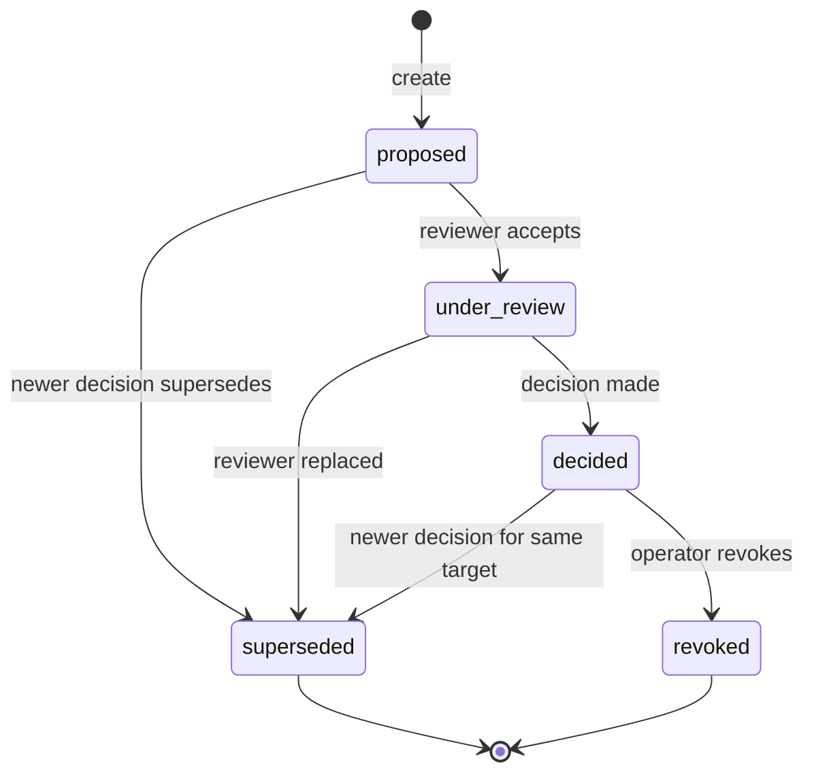

# ApprovalDecision Governance Contract

Last updated: 2026-04-10
Status: canonical approval authority contract
Tier: L1 Platform Architecture & Policy
Scope: ApprovalDecision lifecycle, write owner matrix, risk-level authorization, audit requirements, and integration with promotion/evolution planes
Conflict rule: this document is the single source of truth for approval authority; the legacy `approver` field in registry entries is a temporary compatibility hint that defers to this contract

## 1. 文件目的

本文件定義 Pantheon 的 `ApprovalDecision` 物件，它是：

- **唯一的正式批准權威來源**：promotion gate 和 evolution controller 都必須引用它
- **跨 plane 共享**：registry promotion 和 evolution plane 使用同一個批准物件
- **完整 audit trail**：每筆決定都記錄 actor、rationale、evidence refs

> 核心決議：**不再使用 registry entry 的 `approver` 欄位作為批准權威。**
> 批准必須走：
> `ApprovalDecision` → `registry_entry.approval_decision_id`（外鍵引用）

---

## 2. ApprovalDecision 物件

### 2.1 語意

`ApprovalDecision` 回答三個問題：

1. **Who** 批准了什麼（actor_role + actor_id）
2. **What** 被批准了（target_type + target_id + target_version）
3. **Why** 被批准（rationale + evidence_refs）

### 2.2 結構

| 欄位 | 型別 | 必要 | 說明 |
|---|---|---|---|
| `decision_id` | string | 是 | 唯一識別碼 |
| `target_type` | enum | 是 | 目標物件型別 |
| `target_id` | string | 是 | 目標物件 ID |
| `target_version` | semver | 是 | 目標版本 |
| `decision` | enum | `decided` 時必要 | `approved` / `rejected` / `approved_with_conditions` |
| `decision_state` | enum | 是 | 生命週期狀態 |
| `actor_role` | enum | `under_review` 起必要 | 決定者的角色 |
| `actor_id` | string | `under_review` 起必要 | 決定者識別碼 |
| `rationale` | string | `decided` 時必要 | 決定理由（audit trail） |
| `conditions` | string[] | 條件 | `approved_with_conditions` 時必要 |
| `risk_level` | enum | 否 | 風險等級（預設 `low`） |
| `evidence_refs` | object[] | 否 | 支援證據的引用 |
| `superseded_by` | string | 否 | 被哪個 decision 取代 |
| `created_at` | datetime | 是 | 建立時間 |
| `decided_at` | datetime | `decided` 時必要 | 決定時間 |
| `expires_at` | datetime | 否 | 過期時間 |
| `capital_pool_id` | string | 否 | 適用的 capital pool |
| `persona_id` | string | 否 | 適用的 persona |
| `metadata` | object | 否 | 下游消費者用 |

### 2.3 target_type 枚舉

| 值 | 說明 |
|---|---|
| `registry_entry` | 一般 registry artifact（strategy_spec、model_artifact 等） |
| `strategy_spec` | OC-003 StrategySpec |
| `model_artifact` | 訓練/優化後的模型 artifact |
| `allocation_policy` | 資金分配策略 |
| `persona_capital_binding` | PersonaCapitalBinding（binding 建立/修改批准） |
| `evolution_proposal` | EvolutionDecision 提案（evolution plane 用） |

---

## 3. 生命週期狀態機



### 3.1 狀態說明

| 狀態 | 說明 |
|---|---|
| `proposed` | 系統或規則引擎建立，尚未有 reviewer 受理 |
| `under_review` | reviewer 已受理，正在評估 |
| `decided` | 決定已做出（approved / rejected / approved_with_conditions） |
| `superseded` | 被更新的 decision 取代 |
| `revoked` | 由有權限的 operator 強制撤銷 |

### 3.3 Lifecycle invariant

- `proposed` 只表示案件存在，**不代表已做出批准結果**
- `decision`、`rationale`、`decided_at` 只有在 `decision_state = decided` 時才是正式欄位
- 合法路徑必須先 `accept review` 進入 `under_review`，再 `decide`

### 3.2 decision 枚舉

| 值 | 說明 |
|---|---|
| `approved` | 無條件批准，可進入下一步 |
| `approved_with_conditions` | 有條件批准，conditions 滿足後才可進入下一步 |
| `rejected` | 不批准，目標維持當前狀態 |

---

## 4. Write Owner Matrix

### 4.1 誰可以寫什麼

| 動作 | 誰可以執行 | 說明 |
|---|---|---|
| 建立（proposed） | Evolution Controller、Promotion Gate、Operator Console | 系統或操作者提出 |
| 受理 review（under_review） | authorized reviewer（見 4.2） | reviewer 接受案件 |
| 做出決定（decided） | authorized reviewer（見 4.2） | reviewer 批准/拒絕 |
| 取代（superseded） | 系統自動 | 新 decision 針對同一 target 時自動取代舊的 |
| 撤銷（revoked） | Risk Owner、Governance Committee | 緊急撤銷 |

### 4.2 風險等級 × 角色授權矩陣

| risk_level | 可決定的 actor_role | 說明 |
|---|---|---|
| `low` | `governance_reviewer`、`automated_gate` | 例行性批准 |
| `medium` | `governance_reviewer`、`risk_owner` | 需要資深 reviewer 或 risk owner |
| `high` | `risk_owner`、`governance_committee` | 需要 risk owner 或委員會 |
| `critical` | `governance_committee` | 必須走委員會流程 |

### 4.3 角色定義

| actor_role | 說明 |
|---|---|
| `governance_reviewer` | 一般治理審查者（有審查權限的 persona 或 operator） |
| `risk_owner` | 該 capital pool 或 strategy 的風險負責人 |
| `governance_committee` | 多人治理委員會（需多數決） |
| `automated_gate` | 自動化規則引擎（僅限 low risk） |

---

## 5. Audit 要求

### 5.1 每筆 ApprovalDecision 必須記錄

- `actor_id`：誰做的決定
- `actor_role`：以什麼角色做的決定
- `rationale`：為什麼做這個決定（不可為空）
- `evidence_refs`：支援決定的證據（建議有，low risk 且 automated_gate 時可為空）
- `created_at` / `decided_at`：時間戳記

### 5.2 Audit Log Integration

所有 ApprovalDecision 的建立、狀態變更、決定都必須寫入 governance audit log：

- audit event type: `approval_decision_created`
- audit event type: `approval_decision_state_changed`
- audit event type: `approval_decision_revoked`

audit payload 必須包含完整的 `decision_id`、`target_type`、`target_id`、`decision`、`actor_id`。

---

## 6. 與 Registry 的整合

### 6.1 Registry Entry 引用 ApprovalDecision

Registry entry 不再自行記錄 `approver`。改為：

```json
{
  "approval_decision_id": "approval-2026-0410-001",
  "approver": null
}
```

- `approval_decision_id`：指向正式的 ApprovalDecision
- `approver`：保留為 temporary compatibility hint，新寫入應為 `null` 或省略

### 6.2 Promotion Gate 使用 ApprovalDecision

Promotion gate（REG-002）在提升 artifact_state 前必須：

1. 確認 `approval_decision_id` 存在
2. 確認 ApprovalDecision 的 `decision_state == "decided"`
3. 確認 ApprovalDecision 的 `decision == "approved"` 或 `"approved_with_conditions"`（且 conditions 已滿足）
4. 確認 ApprovalDecision 的 `target_id` 與 registry entry 的 `registry_id` 一致
5. 確認 ApprovalDecision 未過期（`expires_at` 未過或不存在）

---

## 7. 與 Evolution Plane 的整合

### 7.1 EvolutionDecision 使用 ApprovalDecision

EvolutionDecision（EVOLUTION_REVIEW_AND_THRESHOLDS.md）在狀態轉換時：

- `proposed → reviewed`：建立 ApprovalDecision，`decision_state = "under_review"`
- `reviewed → approved`：更新 ApprovalDecision，`decision = "approved"`，`decision_state = "decided"`
- `reviewed → rejected`：更新 ApprovalDecision，`decision = "rejected"`，`decision_state = "decided"`

### 7.2 Evolution Proposal 的 ApprovalDecision

Evolution proposal 的 ApprovalDecision：
- `target_type = "evolution_proposal"`
- `target_id` = evolution_proposal_id
- `risk_level` 依 `EVOLUTION_REVIEW_AND_THRESHOLDS.md` 與 `evolution_decision.contract.md` 的 action matrix 決定
- 例：`retrain = low`、`freeze(canary) = medium`、`freeze(live) = high`

---

## 8. 與 DeploymentPlan 的整合

### 8.1 DeploymentPlan 依賴 ApprovalDecision

DEP-001（DeploymentPlan contract）在建立 deployment plan 前必須：

1. 確認 artifact 已有 approved 的 ApprovalDecision
2. 確認 ApprovalDecision 的 `target_id` / `target_version` 與 DeploymentPlan 所引用 artifact 一致
3. 確認 ApprovalDecision 的 `capital_pool_id`（如果指定）與 DeploymentPlan 的 `capital_pool_id` 一致
4. 如 ApprovalDecision 帶有 `persona_id`，DeploymentPlan 也必須由同一 persona sponsor

DEP-001 的正式 contract / schema / planner 位置：

- `services/control-plane/governance/deployment_plan.contract.md`
- `services/control-plane/governance/deployment_plan.schema.json`
- `services/control-plane/governance/deployment_plan.py`

---

## 9. Validation Rules

### 9.1 Schema Validation

所有 ApprovalDecision 必須通過 `approval_decision.schema.json` 驗證。

### 9.2 Business Rules

| 規則 | 說明 |
|---|---|
| version match | `target_version` 必須與實際目標物件版本一致（由 promotion / deployment caller enforced） |
| role authorization | `actor_role` 必須有權限對該 `risk_level` 做決定（見 4.2） |
| no self-approval | `actor_id` 不能是產生該 target 的 `producer_run_id`（需由持有 producer metadata 的 caller enforced） |
| conditions required | `approved_with_conditions` 必須有至少一筆 condition |
| decided_at required | `decision_state == "decided"` 必須有 `decided_at` |
| no re-decide | `decided` 狀態不可再改變 `decision`，只能先進入 `superseded` / `revoked` |

---

## 10. API 草案

### ApprovalDecision APIs

| Method | Path | 說明 |
|---|---|---|
| `POST` | `/api/governance/approval-decisions` | 建立新的 ApprovalDecision（proposed） |
| `GET` | `/api/governance/approval-decisions/{decision_id}` | 查詢單一決策 |
| `GET` | `/api/governance/approval-decisions?target_id=...` | 查詢目標相關的所有決策 |
| `PATCH` | `/api/governance/approval-decisions/{decision_id}/review` | 受理 review（→ under_review） |
| `POST` | `/api/governance/approval-decisions/{decision_id}/decide` | 做出決定（→ decided） |
| `POST` | `/api/governance/approval-decisions/{decision_id}/revoke` | 撤銷（→ revoked） |

---

## 11. 與 BINDING_AND_DEPLOYMENT_SEMANTICS.md 的關係

本文件是 `ApprovalDecision -> DeploymentPlan -> RuntimeBinding` 鏈中的第一環：

- **ApprovalDecision**：批准意圖（本文件）
- **DeploymentPlan**：如何部署（DEP-001）
- **RuntimeBinding**：實際執行狀態（Execution Plane）

本文件只定義「批准」的語意，不定義如何部署或如何執行。

---

## 12. 後續工作（non-blocking）

以下項目不在本 contract 範圍，但需要後續銜接：

- DEP-001：DeploymentPlan contract 應引用本文件的 ApprovalDecision
- CAP-001：PersonaCapitalBinding 的批准流程應使用 ApprovalDecision
- EVO-003：EvolutionDecision 應提升為 ApprovalDecision 的第一級使用者
- REG-002/REG-003：promotion gate 應改為檢查 ApprovalDecision 而非 `approver` 字串

---

## 13. 結論

`ApprovalDecision` 是 Pantheon 治理模型的核心物件。它把原本分散在 registry entry 的 `approver` 字串、promotion gate 的隱式批准、evolution plane 的審核流程，統一成一個正式的、可審計的、跨 plane 共享的批准物件。

所有下游物件（DeploymentPlan、RuntimeBinding、EvolutionDecision）都必須引用或建立 ApprovalDecision，而非自行定義批准語意。
