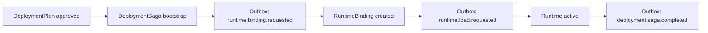

# Deployment Orchestration Saga Contract

Last updated: 2026-04-10  
Task: `DEP-002`  
Owner: Codex  
Reviewer: Claude  
Status: draft

---

## 1. Purpose

`DeploymentSaga` is the first-class orchestration aggregate that sits after
`DeploymentPlan` and before `RuntimeBinding` activation.

It exists to make Pantheon's deployment flow recoverable across service
boundaries without using distributed transactions.

This contract covers:

- the saga aggregate written by the orchestration owner
- the outbox event envelope emitted atomically with saga writes
- the inbox receipt model used by idempotent consumers
- the compensation matrix that binds failure points to owner-scoped writes

Canonical implementation:

- `services/control-plane/governance/deployment_saga.py`

Related upstream contracts:

- `services/control-plane/governance/deployment_plan.contract.md`
- `CROSS_SERVICE_CONSISTENCY_AND_SAGA_POLICY.md`
- `EVENT_ORDERING_AND_DELIVERY_GUARANTEES.md`
- `DATABASE_OWNERSHIP_AND_SHARED_CLUSTER_POLICY.md`
- `ROLLBACK_AND_POSITION_SEMANTICS.md`

---

## 2. Ownership Split

### 2.1 Write owners

| Object / Action | Write Owner |
|---|---|
| `DeploymentPlan` creation and status | `governance-svc` |
| `DeploymentSaga` state + saga outbox append | `deployment-orchestrator` |
| `RuntimeBinding` creation / status / activation | `runtime-manager-svc` |
| rollback command issue | `rollback-controller` |
| incident creation | incident / telemetry-evolution owner |

### 2.2 Non-owner rule

No non-owner service may directly mutate another owner's canonical object.

Examples:

- `governance-svc` must not write `RuntimeBinding`
- `runtime-manager-svc` must not rewrite `DeploymentPlan`
- consumers may read saga/outbox state but cannot bypass owner APIs to change it

This aligns with `DATABASE_OWNERSHIP_AND_SHARED_CLUSTER_POLICY.md`.

---

## 3. Canonical Objects

### 3.1 `DeploymentSaga`

Key fields:

- `saga_id`
- `plan_id`
- `approval_decision_id`
- `strategy_id`
- `artifact_id`
- `artifact_version`
- `capital_pool_id`
- `current_stage`
- `target_stage`
- `runtime_action`
- `rollback_action_type`
- `status`
- `current_step`
- `trace_id`
- `binding_id`
- `runtime_id`
- `last_sequence_no`
- `last_event_id`
- `compensation`

### 3.2 `SagaEventEnvelope`

Required event fields match the L1 event policy:

- `event_id`
- `event_type`
- `aggregate_type`
- `aggregate_id`
- `sequence_no`
- `causal_parent_id`
- `event_time`
- `emitted_at`
- `trace_id`
- `idempotency_key`
- `payload`

The aggregate for DEP-002 is:

- `aggregate_type = deployment_saga`
- `aggregate_id = saga_id`

### 3.3 `OutboxRecord`

`OutboxRecord` binds an event envelope to the owner service that emitted it.

Minimum fields:

- `owner_service`
- `event`
- `status`
- `delivery_attempts`

### 3.4 `InboxReceipt`

`InboxReceipt` is the durable dedupe / ordering proof written by the consumer.

Minimum fields:

- `consumer_name`
- `event_id`
- `idempotency_key`
- `aggregate_type`
- `aggregate_id`
- `sequence_no`
- `trace_id`
- `status`
- `processed_at`

---

## 4. Deploy Saga Flow

The DEP-002 implementation models the orchestration-first flow as:

### 4.1 Bootstrap rule

The first atomic write in DEP-002 is:

> create `DeploymentSaga` + append `runtime.binding.requested` outbox event

This is the "business write plus event outbox is atomic" acceptance check.

### 4.2 Sequence rule

Each emitted event increments `last_sequence_no` on the saga aggregate.

The first emitted event is always sequence `1`.

---

## 5. Atomicity Rule

DEP-002 does not use a distributed transaction.

Instead, the owner-scoped atomic unit is:

> local `DeploymentSaga` write + local outbox append in one transaction

The reference implementation persists the saga state, outbox, and inbox as one
JSON blob so tests can prove:

- if commit fails, neither saga state nor outbox append is made visible
- no partial write leaves a saga without its corresponding outbox event

This mirrors the intended production pattern:

- one local ACID transaction in the owner service
- one outbox append in the same transaction
- cross-service fanout happens after commit

---

## 6. Ordering and Idempotency

### 6.1 Ordering scope

DEP-002 enforces **per-saga ordering**, not global ordering.

Consumer rule:

- next event must have `sequence_no = last_applied_sequence + 1`
- higher sequence numbers are recorded as `out_of_order`
- already-applied or replayed deliveries are recorded as `duplicate`

### 6.2 Idempotency keys

Consumers must dedupe by:

- `event_id`
- `idempotency_key`
- per-aggregate `sequence_no`

This matches `EVENT_ORDERING_AND_DELIVERY_GUARANTEES.md`.

### 6.3 Replay behavior

Replayed events are allowed to be delivered again, but they must not re-run
side effects once the consumer has already applied the matching sequence.

---

## 7. Compensation Boundaries

DEP-002 must document compensation by failure boundary, not as one vague
"rollback" action.

| Failure point | Compensation command | Write owner | Resulting canonical change |
|---|---|---|---|
| binding was requested but never created | `abort_plan` | `governance-svc` | `DeploymentPlan.status = aborted`; no runtime rows created |
| binding exists but runtime load fails before activation | `mark_binding_failed_inactive` | `runtime-manager-svc` | `RuntimeBinding.status = failed_inactive`; saga records failure and retry path |
| runtime became active, then severe mismatch / policy breach is detected | `request_rollback` | `rollback-controller` issuing command, `runtime-manager-svc` applying it | replacement / pause / liquidation follows `rollback_action_type` from `DeploymentPlan.rollback.action_type` |
| compensation itself fails or rollback cannot converge | `enter_safe_mode_and_raise_incident` | `runtime-manager-svc` + incident owner | runtime enters safe mode or paused state, incident trail is opened, further deploys stop |

### 7.1 Rollback linkage source

DEP-002 does not invent a new rollback strategy field.

It must consume the already-approved linkage from `DeploymentPlan.rollback`,
including:

- `target_artifact_id`
- `target_version`
- `action_type`

### 7.2 Owner-scoped writes

Compensation commands may coordinate multiple services, but each resulting
write must still be performed by the canonical owner of that object.

---

## 8. Consumer Rules

Consumer responsibilities:

- write an `InboxReceipt` for every applied / duplicate / out-of-order delivery
- never apply side effects twice for the same `event_id` or `idempotency_key`
- never skip sequence gaps inside the same saga aggregate

The inbox is not the source of truth for deployment state.
It is the source of truth for:

- dedupe evidence
- ordering evidence
- replay evidence

---

## 9. Relationship to DEP-001

`DeploymentPlan` answers:

- what transition is intended
- what rollback target is allowed

`DeploymentSaga` answers:

- which orchestration step is currently in flight
- which event sequence has been emitted
- what compensation should happen if the current step fails

`RuntimeBinding` remains the source of truth for actual runtime state.

---

## 10. Review Focus

Reviewer should verify:

- bootstrap really couples saga creation with the first outbox event atomically
- inbox behavior rejects out-of-order sequence gaps and skips duplicates
- compensation decisions preserve write-owner boundaries from the database policy
- rollback compensation always uses `DeploymentPlan.rollback.action_type` instead of inventing a parallel rule
