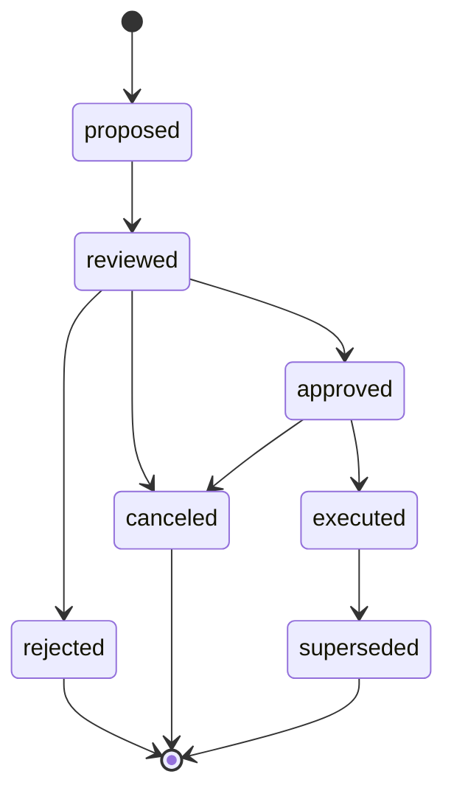

# EvolutionDecision Contract

Last updated: 2026-04-11
Status: canonical first-class evolution governance contract
Tier: L1-adjacent service contract derived from canonical evolution policy
Scope: EvolutionDecision object shape, lifecycle, actor roles, evidence links, ApprovalDecision linkage, cooldown / observation windows, and single-active enforcement
Conflict rule: this contract implements and normalizes `EVOLUTION_REVIEW_AND_THRESHOLDS.md` plus `EVOLUTION_COOLDOWN_AND_CONVERGENCE_POLICY.md`; if this file and those L1 policy docs conflict, the L1 docs win and this contract must be updated

## 1. Purpose

`EvolutionDecision` is the formal record produced by the Evolution Plane when telemetry, drift, incidents, or operator review trigger governed follow-up actions.

It exists to make five things first-class instead of implicit:

- the lifecycle `proposed -> reviewed -> approved -> executed|rejected|canceled -> superseded`
- who reviewed / approved / executed the decision
- which threshold or incident evidence triggered it
- which `ApprovalDecision` carries the review authority chain
- which cooldown / observation windows keep the target from infinite re-mutation

Without this object, BFF EV-01 / EV-02, lineage, incident follow-up, and loop concurrency rules all depend on unstated coupling.

## 2. Canonical Inputs

| Source | Why it matters |
|---|---|
| `EVOLUTION_REVIEW_AND_THRESHOLDS.md` | lifecycle, action classes, owner tiers, threshold defaults |
| `EVOLUTION_COOLDOWN_AND_CONVERGENCE_POLICY.md` | cooldown, observation window, single-active rule |
| `services/control-plane/governance/contract.md` | `ApprovalDecision` integration |
| `services/control-plane/governance/evolution_controller_contract.md` | normal-path execution plane routing and follow-through boundary |
| `services/registry/lineage/read_model_contract.md` | normalized edge `evolution_decision.postmortem` |
| `services/incident/contract.md` | reverse-link slot on `Postmortem` |
| `LOOP_TRIGGER_AND_CONCURRENCY_POLICY.md` | active-decision concurrency invariant |
| `services/control-plane/bff/BFF_SURFACE_INVENTORY.md` | EV-01 / EV-02 query expectations |

## 3. Canonical Object

### 3.1 Required fields

| Field | Type | Description |
|---|---|---|
| `decision_id` | string | Unique identifier for this evolution decision |
| `target_type` | enum | `strategy_spec` / `alpha_template` / `candidate_artifact` / `allocation_policy_artifact` / `persona` / `persona_capital_binding` / `capital_pool` |
| `target_id` | string | ID of the governed target |
| `target_version` | string | Version or immutable snapshot key of the governed target |
| `action_type` | enum | Normalized evolution action family |
| `decision_state` | enum | `proposed` / `reviewed` / `approved` / `executed` / `rejected` / `canceled` / `superseded` |
| `risk_level` | enum | `low` / `medium` / `high` |
| `created_at` | datetime | Proposal creation timestamp |
| `created_by_role` | enum | Usually `evolution_controller`; may also be `operator` |
| `created_by_id` | string | System component or operator ID |
| `rationale` | string | Why the decision exists |

### 3.2 Evidence + linkage fields

| Field | Type | Required | Description |
|---|---|---|---|
| `evidence_refs[]` | `EvidenceRef[]` | one evidence link required in aggregate | Explicit evidence objects (drift report, telemetry summary, review ticket, etc.) |
| `threshold_snapshots[]` | `ThresholdSnapshot[]` | conditional | Normalized threshold breaches that triggered this proposal |
| `linked_postmortem_id` | string | conditional | Formal lineage edge target for `evolution_decision.postmortem` |
| `linked_incident_id` | string | conditional | Incident context when the decision follows active incident handling |

Rule: every `EvolutionDecision` must carry at least one evidence link through `evidence_refs[]`, `threshold_snapshots[]`, `linked_postmortem_id`, or `linked_incident_id`.

### 3.3 Review + execution fields

| Field | Type | Required | Description |
|---|---|---|---|
| `approval_decision_id` | string | from `reviewed` onward | Formal `ApprovalDecision` backing the review / approval chain |
| `review_chain[]` | `ReviewStep[]` | conditional | Ordered review / approval / reject / cancel / execute history |
| `execution_result` | `ExecutionResult` | `executed` only | Downstream execution result envelope |
| `cooldown_started_at` | datetime | `executed` only | Beginning of cooldown |
| `cooldown_ends_at` | datetime | `executed` only | End of cooldown |
| `observation_window_started_at` | datetime | `executed` only | Beginning of post-execution observation |
| `observation_window_ends_at` | datetime | `executed` only | End of observation window |
| `superseded_by` | string | `superseded` only | Newer decision that replaced this one |

## 4. Normalized Action Catalog

The L1 policy documents describe some actions as fully scoped names (`freeze_live_strategy`, `retire_alpha_template`) and others as generic action families (`freeze`, `retire`, `mutate`).

This contract normalizes them as:

| L1 wording | `EvolutionDecision` representation |
|---|---|
| `freeze_paper` | `action_type = "freeze"`, `target_stage = "paper"`, `risk_level = "medium"` |
| `freeze_canary` | `action_type = "freeze"`, `target_stage = "canary"`, `risk_level = "medium"` |
| `freeze_live_strategy` | `action_type = "freeze"`, `target_stage = "live"`, `risk_level = "high"` |
| `retire_strategy` | `action_type = "retire"`, `target_type = "strategy_spec"` or artifact target |
| `retire_alpha_template` | `action_type = "retire"`, `target_type = "alpha_template"` |
| route / consult mutate | `mutate_persona_route_policy` / `mutate_consult_policy` |

The normalized `action_type` values are:

- `observe`
- `revalidate`
- `retrain`
- `require_more_data`
- `flag_for_review`
- `reduce_budget`
- `tighten_risk_policy`
- `mutate_persona_route_policy`
- `mutate_consult_policy`
- `freeze`
- `retire`
- `split_persona`
- `merge_persona`
- `remove_live_owner_role`
- `restrict_pool_eligibility`
- `force_risk_off`
- `revive`

## 5. Risk Mapping

Risk is derived from action semantics, not free-text judgment:

| Risk | Actions |
|---|---|
| `low` | `observe`, `revalidate`, `retrain`, `require_more_data`, `flag_for_review` |
| `medium` | `reduce_budget`, `tighten_risk_policy`, `mutate_persona_route_policy`, `mutate_consult_policy`, `freeze` on `paper` or `canary` |
| `high` | `freeze` on `live`, `retire`, `split_persona`, `merge_persona`, `remove_live_owner_role`, `restrict_pool_eligibility`, `force_risk_off`, `revive` |

## 6. Lifecycle

### 6.1 State invariants

| State | Required invariants |
|---|---|
| `proposed` | proposal metadata + at least one evidence link |
| `reviewed` | `approval_decision_id` present + `review_chain` contains `reviewed` |
| `approved` | `review_chain` contains `reviewed` + `approved` |
| `rejected` | `review_chain` contains `reviewed` + `rejected` |
| `executed` | `review_chain` contains `reviewed` + `approved` + `executed`; `execution_result` and all cooldown/observation timestamps present |
| `superseded` | `superseded_by` present |

### 6.2 `executed` semantics

`executed` means the approved decision has been accepted by the **authoritative downstream plane** and has an immutable execution reference.

`execution_result.plane` records the primary plane:

- `governance` for governance-side freeze / retire / eligibility state changes
- `research` for `retrain` / `revalidate` work items
- `deployment` for `freeze_stage` or `redeploy_followthrough` deployment commands
- `runtime` for rollback / risk-off mitigation requests

Companion follow-through objects remain separate:

- `DeploymentPlan` continues to own deployment-stage transitions
- `RollbackController` / `Runtime Manager` continue to own rollback request and `RuntimeBinding` mutation
- `EvolutionDecision` records refs and outcome only; it does not gain write authority over runtime or deployment objects

## 7. Actor Roles

### 7.1 Proposer roles

- `evolution_controller`
- `operator`

### 7.2 Review owner matrix

| risk_level | Allowed `reviewed` roles |
|---|---|
| `low` | `reviewer_on_duty`, `automated_gate` |
| `medium` | `reviewer`, `risk_owner` |
| `high` | `governance_committee` |

### 7.3 Approval owner matrix

| risk_level | Allowed `approved` roles |
|---|---|
| `low` | `reviewer_on_duty`, `automated_gate` |
| `medium` | `risk_owner`, `operator` |
| `high` | `governance_committee` |

### 7.4 Execution roles

Only these roles may move `approved -> executed`:

- `evolution_controller`
- `operator`

## 8. ApprovalDecision Integration

`EvolutionDecision` does not replace `ApprovalDecision`. It becomes one of its first-class callers.

Rules:

1. `proposed -> reviewed` must create an `ApprovalDecision` with `target_type = "evolution_proposal"` and `target_id = decision_id`.
2. `reviewed -> approved` must update that `ApprovalDecision` to `decision = "approved"` and `decision_state = "decided"`.
3. `reviewed -> rejected` must update that same `ApprovalDecision` to `decision = "rejected"` and `decision_state = "decided"`.
4. `approval_decision_id` is required from `reviewed` onward.

## 9. Lineage + Incident Integration

Formal lineage edge:

| Semantic edge id | From | To | Physical field |
|---|---|---|---|
| `evolution_decision.postmortem` | `EvolutionDecision` | `Postmortem` | `EvolutionDecision.linked_postmortem_id` |

When `linked_postmortem_id` is set, the store must also call `IncidentStore.link_evolution_decision()` to populate the reverse link `Postmortem.linked_evolution_decision_id`.

## 10. Cooldown + Observation Windows

`executed` does not mean the target is immediately eligible for another structural mutation.

Rules:

1. Every executed decision must carry both a cooldown window and an observation window anchored at the moment the authoritative downstream plane accepted the work item or state change.
2. A decision remains **active** while it is in `proposed`, `reviewed`, `approved`, or `executed` with an unfinished cooldown / observation window.
3. The active window for an executed decision ends at `max(cooldown_ends_at, observation_window_ends_at)`.
4. The same `(target_type, target_id)` may not have more than one active `EvolutionDecision`.
5. Companion rollback requests do not open an independent evolution window; they inherit the parent decision window.
6. Redeploy follow-through does not create a new `EvolutionDecision.action_type`; it must wait until the parent decision is in observation and the new artifact has its own `ApprovalDecision` + `DeploymentPlan`.

## 11. Store Rules

`EvolutionDecisionStore.put()` enforces:

- semantic validation before write
- single-active-rule per target
- reverse-link sync to `IncidentStore` when `linked_postmortem_id` is present
- JSON persistence compatibility for BFF / audit / replay tooling

## 12. Acceptance Coverage

- [x] decision lifecycle formalized as object state, not narrative prose only
- [x] actor roles formalized as review / approval / execution matrices
- [x] evidence links formalized through `EvidenceRef[]`, `ThresholdSnapshot[]`, and `linked_postmortem_id`
- [x] cooldown and observation fields formalized and validated
- [x] single-active-rule enforced at store layer
- [x] reverse-link into `Postmortem.linked_evolution_decision_id` wired through incident store integration
