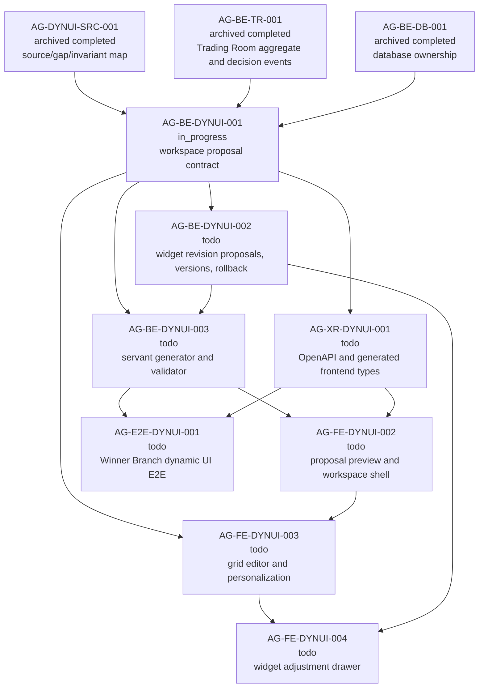

# AG-BE-DYNUI-001 Sidecar Acceptance Packet

**Sidecar task:** `AG-BE-DYNUI-001-SIDECAR-ACCEPTANCE`  
**Helper parent:** `AG-BE-DYNUI-001`  
**Helper kind:** `acceptance_packet`  
**Parent title:** Trading Room workspace proposal contract  
**Parent owner:** `Codex`  
**Parent reviewer:** `Claude2`  
**Parent status:** `in_progress` in central L0 state on 2026-06-29  
**Sidecar owner:** `Codex2`  
**Sidecar reviewer:** `Codex`  
**Date:** `2026-06-29`  
**Status:** `review approved; owner closeout`

> Scope constraint: support artifact only. This packet packages acceptance
> criteria, dependency routing, blocker triggers, and verification guidance for
> `AG-BE-DYNUI-001`. It does not edit canonical truth, schemas, OpenAPI, BFF
> routes, persistence, widget registry code, governance logic, frontend runtime
> code, or generated types.

---

## 1. Purpose

`AG-BE-DYNUI-001` owns the backend contract foundation for the V11 Trading Room
dynamic workspace. The parent must introduce the proposal and workspace resource
family that lets a trading servant generate a complete workspace proposal before
the trader enters the Trading Room.

This acceptance packet gives the parent owner and reviewer a narrow gate for the
first backend slice:

1. Define the `TradingRoomWorkspaceProposal`, `TradingRoomWorkspace`,
   `TradingRoomViewSpec`, `TradingRoomWidgetSpec`, placement, layout operation,
   and typed error-envelope contract.
2. Add proposal create/detail/accept routes under the strategy-scoped Trading
   Room namespace.
3. Add active workspace read, layout patch, view mutation, and widget mutation
   routes with user/strategy/version scoping.
4. Preserve the existing Agora decision-support/no-order boundary.
5. Leave widget revision proposals, workspace version history, rollback,
   generator internals, OpenAPI/type drift closure, and frontend runtime work to
   their explicitly assigned downstream tasks.

The packet does not approve or implement the parent. It is a reviewer checklist
and dependency map for parent absorption.

---

## 2. Sources Used

| Source | Role for this packet |
| --- | --- |
| `.orchestrator/task-briefs/ag_be_dynui_001_sidecar_acceptance.md` | Sidecar scope: acceptance packet and dependency map only; no canonical truth changes. |
| `AI_COLLABORATION_GUIDE.md` | L0/L1/L2 boundary rules; support packets cannot override canonical architecture truth. |
| `docs/04/agora_design_pack_dynui_2026-06-28/README.md` | Dynamic UI execution packet and task graph. |
| `docs/04/agora_design_pack_dynui_2026-06-28/source-map-and-gap-map.md` | Frozen V11 source/gap/invariant map. Routes missing workspace proposal/workspace contracts to `AG-BE-DYNUI-001`. |
| `docs/04/agora_design_pack_dynui_2026-06-28/closeout.md` | `AG-DYNUI-SRC-001` approval and publication evidence. |
| `/tmp/ai-trading-desk-design/uploads/Pathreon_Agora_ClaudeDesign_UI_Requirement_V11_WinnerBranch_TradingRoom_2026-06-19.md` | V11 proposal/workspace/view/widget TypeScript shapes and BFF route family. |
| `support/sidecars/AG-BE-DYNUI-001/AG-BE-DYNUI-001-SIDECAR-BFF-HANDOFF.md` | Baseline BFF/frontend handoff: current route gaps, journeys, safety invariants. |
| `support/sidecars/AG-BE-DYNUI-001/AG-BE-DYNUI-001-SIDECAR-BFF-HANDOFF-FOLLOWUP-2.md` | Absorption order: schema first, proposal lifecycle, workspace read/layout, view/widget mutation, OpenAPI/type sync. |
| `support/sidecars/AG-BE-DYNUI-001/AG-BE-DYNUI-001-SIDECAR-BFF-HANDOFF-FOLLOWUP-3.md` | Implementation handoff card and query-gap ledger for backend owner. |
| `services/control-plane/bff/agora/trading_room/router.py` | Current `agora.trading.v1` router: aggregate, strategy detail, decision events, SSE stub, governed-intent handoff/withdraw; no V11 workspace routes. |
| `services/control-plane/bff/agora/dashboard/router.py` | Dashboard recipe v2 reference for ETag, layout patch, rollback, widget validation patterns; not the V11 workspace resource. |
| `services/control-plane/openapi/agora_v1_2.openapi.yaml` | Existing dashboard recipe route family. Useful reference only. |
| `services/control-plane/openapi/agora_v1_3.openapi.yaml` | Existing Trading Room aggregate/decision-event route family. Missing V11 proposal/workspace routes. |
| `services/control-plane/specs/agora/v2/dashboard_recipe_v2.schema.json` | Existing recipe proposal/version schema; not sufficient for V11 workspace proposal. |
| `services/control-plane/specs/agora/v2/widget_spec_v2.schema.json` and `services/control-plane/specs/agora/widget_registry.v1.json` | Widget allowlist and safe widget/chart foundation for the parent to reuse. |
| `services/control-plane/specs/agora/v4/trading_room_aggregate.schema.json` | Existing read-only Trading Room aggregate with `dashboard_recipe_id` bridge; no workspace lifecycle schema. |

`current-work.md` and the full `ai-activity-log.jsonl` were not used as sources
for this packet.

---

## 3. Current Gap Snapshot

| Surface | Current observation | Parent implication |
| --- | --- | --- |
| `services/control-plane/specs/agora/trading_room_workspace.schema.json` | Not present. | Parent must add the V11 workspace proposal/workspace schema before claiming route completeness. |
| `services/control-plane/bff/agora/trading_room/router.py` | Implements aggregate, strategy detail, decision events, decisions, stream, and governed-intent handoff/withdraw. | Parent must add a distinct workspace proposal/workspace route family without weakening existing no-order routes. |
| `services/control-plane/openapi/agora_v1_3.openapi.yaml` | Lists `/bff/agora/trading-room`, strategy detail, decision events, decisions, and stream only. | OpenAPI drift remains open until parent routes and schema exist, then `AG-XR-DYNUI-001` owns generated type closure. |
| `services/control-plane/openapi/agora_v1_2.openapi.yaml` | Lists `/dashboard-recipes` proposal, accept, layout, rollback, feedback, versions, widget validate. | Parent may borrow patterns, but must not substitute `DashboardRecipeV2` for `TradingRoomWorkspaceProposal`. |
| `services/control-plane/specs/agora/v2/widget_spec_v2.schema.json` and registry | Safe widget/chart allowlist foundation exists. | Parent must still define V11 workspace-specific widget fields, placement bounds, and context rules. |
| V11 design source | Requires generated proposal before Trading Room entry, with views, thumbnail/previews, widget counts, rationale, data availability, warnings, personalization. | Parent acceptance fails if the trader lands in an empty dashboard or static fixture workspace. |

---

## 4. Parent Acceptance Checklist

| # | Criterion | Acceptance rule |
| --- | --- | --- |
| 1 | **Design source is cited** | Parent closeout evidence cites the frozen dynamic UI source map and V11 requirement source. If design archive/reference files are unreadable, parent opens a blocker instead of inventing fields. |
| 2 | **New schema is explicit and additive** | Add `services/control-plane/specs/agora/trading_room_workspace.schema.json` or an equivalently scoped additive schema file. It must define proposal, workspace, view, widget, placement, layout operation, and typed error-envelope shapes. It must not overwrite prior Agora bundles. |
| 3 | **Primary objects are strict** | Proposal, workspace, view, widget, placement, and layout operation objects use strict schemas, including `additionalProperties: false` or the repo-equivalent strictness pattern. Unknown fields fail validation. |
| 4 | **Proposal create route exists** | `POST /bff/agora/strategies/{strategy_id}/trading-room/proposals` creates or enqueues a user/strategy/version-scoped proposal and returns `proposal_id`, status, and polling or stream hints. |
| 5 | **Proposal detail route is complete** | `GET /bff/agora/strategies/{strategy_id}/trading-room/proposals/{proposal_id}` returns a complete `TradingRoomWorkspaceProposal`: strategy id/version, proposal id, generated timestamp, status, views, rationale, data availability, warnings, personalization applied. |
| 6 | **Proposal preview has all V11 view evidence** | Proposal detail includes all generated views, per-view thumbnail refs or equivalent previews, widget counts, view rationale, data completeness, inferred/unavailable-data warnings, and personalization notes. |
| 7 | **Winner Branch minimum views are enforced** | A Winner Branch proposal contains at least the seven V11 views: strategy overview; candidates/entry; winner branch intelligence; related-party/flow migration; event lead; positions/add/reduce/exit; evidence/monitoring rules. |
| 8 | **Accept requires preview state** | `POST /bff/agora/strategies/{strategy_id}/trading-room/proposals/{proposal_id}/accept` rejects incomplete/generating proposals and only materializes a workspace from a complete preview proposal. |
| 9 | **Accept returns active workspace state** | Accept returns at minimum `workspace_id`, active workspace state, status, active view, views/widgets, version or ETag metadata, and read/layout links. The trader must not enter an empty shell. |
| 10 | **Workspace read route is scoped** | `GET /bff/agora/trading-room/workspaces/{workspace_id}` returns only the authenticated user's workspace. Cross-user or cross-tenant reads return `403` and do not leak existence details beyond the repo's standard error posture. |
| 11 | **Layout patch uses optimistic concurrency** | `PATCH /bff/agora/trading-room/workspaces/{workspace_id}/layout` requires `If-Match` or equivalent ETag/version input. Stale writes return `412 Precondition Failed` or the repo-standard stale-write error with latest read link. |
| 12 | **Layout operations are controlled** | Accepted layout operations are limited to safe workspace edits such as move, resize, remove/hide, restore/add registered widget, replace chart spec, and update widget query. Arbitrary payload mutation fails validation. |
| 13 | **Removed widgets remain restorable** | A remove operation hides/removes the widget from current placement but preserves the widget spec/history needed for restore. Parent must not permanently delete the widget in this slice. |
| 14 | **View mutation routes are operator-scoped** | `POST/PATCH /bff/agora/trading-room/workspaces/{workspace_id}/views[/{view_id}]` create/update view specs only for the workspace owner and require schema validation plus concurrency protection on mutating calls. |
| 15 | **Widget mutation routes are operator-scoped** | `POST/PATCH /bff/agora/trading-room/workspaces/{workspace_id}/widgets[/{widget_id}]` add/update only registry-validated widget specs and only for operator-initiated direct edits. |
| 16 | **Servant direct mutation is rejected** | Servant-originated widget changes cannot use direct widget `PATCH`; they must wait for `AG-BE-DYNUI-002` revision proposal routes. |
| 17 | **Registry allowlist is enforced** | Widget type, chart kind, interaction set, data source, sensitivity, and placement fields are validated against the existing registry/schema substrate or a clearly named new validator layer. |
| 18 | **No code injection path exists** | Routes reject raw JavaScript, React, HTML, external scripts, unsupported renderers, raw prompts, arbitrary URLs, and any agent-generated executable UI code. |
| 19 | **No order/capital/runtime authority leaks** | New routes never create broker orders, bind capital, create or mutate `RuntimeBinding`, expose Management-plane actions, or use backend-internal terms as operator-facing workspace controls. |
| 20 | **Dashboard recipe is not a substitute** | Parent may reuse dashboard router patterns, but `DashboardRecipeV2` accept/layout/version routes are not presented as completion for V11 `TradingRoomWorkspaceProposal` or workspace CRUD. |
| 21 | **Capability-not-ready is honest** | If the generator or downstream validator is not ready, the route returns typed capability-not-ready/pending status rather than fixture data, a static workspace, or an empty dashboard success response. |
| 22 | **Persistence ownership is explicit** | Proposal and workspace records are scoped by authenticated user, strategy id, strategy version, and proposal/workspace id. Parent closeout states the storage owner and no cross-service write ambiguity remains. |
| 23 | **Focused tests exist** | Tests cover schema validation, proposal create/detail/accept, accept rejects generating proposal, workspace read, cross-user `403`, ETag stale layout write, registry rejection, no-order guard, and dashboard recipe non-substitution. |
| 24 | **Review evidence is attached** | Parent closeout includes exact commands and outputs sufficient for reviewer confidence: route tests, schema validation, targeted `rg` proof for route presence/forbidden surfaces, and any fixture/golden response samples used by tests. |

---

## 5. Dependency Map



### Dependency notes

| Task | State observed | Relevance |
| --- | --- | --- |
| `AG-DYNUI-SRC-001` | Archived with `terminal_outcome: completed`; closeout published PR #2538 and source/gap map. | Parent must use the frozen V11 source/gap/invariant map. |
| `AG-BE-TR-001` | Archived with `terminal_outcome: completed`. | Parent should compose with existing Trading Room aggregate/decision-event routes and preserve no-order semantics. |
| `AG-BE-DB-001` | Archived with `terminal_outcome: completed`. | Parent must state proposal/workspace persistence ownership and scope keys before claiming acceptance. |
| `AG-BE-DYNUI-001` | `in_progress`, owner `Codex`, reviewer `Claude2`. | Parent task receiving this packet. |
| `AG-BE-DYNUI-002` | `todo`, depends on `AG-BE-DYNUI-001`. | Owns widget revision proposals, workspace versions, change log, rollback. Parent must not absorb by default. |
| `AG-BE-DYNUI-003` | `todo`, depends on `AG-BE-DYNUI-001` and `AG-BE-DYNUI-002`. | Owns real servant workspace generator and safe widget/chart validator integration. Parent may expose pending/capability gates before generator readiness. |
| `AG-XR-DYNUI-001` | `todo`, depends on `AG-BE-DYNUI-001` and `AG-BE-DYNUI-002`. | Owns OpenAPI/generated frontend type drift closure after backend contract lands. |
| `AG-FE-DYNUI-002` | `todo`, depends on XR, generator, V10 workshop runtime, and FE Trading Room base. | Owns proposal preview and active workspace shell. |
| `AG-FE-DYNUI-003` | `todo`, depends on `AG-FE-DYNUI-002` and `AG-BE-DYNUI-001`. | Owns persisted grid editor and personalization events. |
| `AG-FE-DYNUI-004` | `todo`, depends on `AG-FE-DYNUI-003` and `AG-BE-DYNUI-002`. | Owns widget adjustment drawer and before/after revision flow. |
| `AG-E2E-DYNUI-001` | `todo`, depends on generator, XR, and later visual parity. | Final dynamic UI proof after the backend and frontend slices compose. |

---

## 6. Blocker Triggers For Parent Owner

The parent owner should stop and open a blocker if any of these are true:

1. The V11 design source or frozen source/gap map cannot be read.
2. The parent cannot identify the persistence owner for proposal/workspace rows
   without violating existing database ownership boundaries.
3. The parent would need to treat `DashboardRecipeV2` as the V11 workspace
   resource rather than introducing an explicit workspace proposal/workspace
   contract.
4. The generator is unavailable and the implementation would otherwise ship
   static fixture workspaces or empty dashboards as successful proposals.
5. The widget registry substrate cannot validate V11 widget fields without
   inventing unreviewed schema fields.
6. Cross-user scoping cannot be enforced from the existing Agora identity
   context.
7. Any implementation path requires Management-plane terms, `RuntimeBinding`,
   broker order controls, capital binding, raw HTML/JS/React injection, or
   arbitrary data-source URLs.
8. Mutating routes cannot support idempotency/concurrency semantics compatible
   with the existing BFF patterns.

---

## 7. Suggested Parent Verification Plan

Run focused backend validation after parent implementation. Exact test names may
change, but the evidence should cover these categories:

```bash
python3 -m pytest services/control-plane/bff/tests -k "trading_room and workspace"
```

```bash
python3 -m pytest services/control-plane/bff/tests -k "workspace proposal or workspace layout or widget registry"
```

```bash
rg -n "trading-room/proposals|trading-room/workspaces|TradingRoomWorkspaceProposal|TradingRoomWorkspace|TradingRoomViewSpec|TradingRoomWidgetSpec" \
  services/control-plane/bff services/control-plane/specs services/control-plane/openapi
```

```bash
rg -n "RuntimeBinding|place_order|enable_live|capital_binding|broker_order|dangerouslySetInnerHTML|eval\\(|new Function" \
  services/control-plane/bff/agora services/control-plane/specs/agora
```

Recommended assertions:

- JSON Schema validation passes for proposal, workspace, view, widget, and
  layout-operation examples.
- Proposal accept rejects `generating`/incomplete proposals.
- Proposal accept returns an active workspace with all proposal views/widgets.
- Cross-user proposal/workspace reads return `403`.
- Layout/view/widget mutations require ETag or equivalent version guard.
- Stale layout mutation returns `412` or the repo-standard stale-write error.
- Registry validation rejects unknown widget type, forbidden interaction, raw
  code renderer, arbitrary URL, and broker/capital/runtime actions.
- Dashboard recipe endpoints are not used as completion evidence for V11
  workspace proposals.

---

## 8. Reviewer Handoff Notes

**Reviewer:** `Codex`

### What to verify

1. The packet is support-only and does not redefine canonical contract truth.
2. The checklist is specific enough for `AG-BE-DYNUI-001` review without
   expanding into `AG-BE-DYNUI-002`, `AG-BE-DYNUI-003`, XR, or frontend scopes.
3. The current-gap snapshot matches the observed router/schema/OpenAPI state.
4. The dependency map reflects central L0 active tasks plus archived upstream
   completed dependencies.
5. The safety posture preserves no-order, no-capital, no-Management, no-runtime,
   and no arbitrary-code boundaries.

### Suggested reviewer command

```bash
AI_NAME=Codex REVIEW_FILE=support/sidecars/AG-BE-DYNUI-001/AG-BE-DYNUI-001-SIDECAR-ACCEPTANCE.md \
  ./scripts/ai-status.sh approve AG-BE-DYNUI-001-SIDECAR-ACCEPTANCE \
  "Acceptance packet approved; support artifact gives AG-BE-DYNUI-001 concrete V11 workspace proposal criteria, dependency routing, blocker triggers, and verification guidance without changing canonical truth."
```

If changes are required:

```bash
AI_NAME=Codex ./scripts/ai-status.sh reopen AG-BE-DYNUI-001-SIDECAR-ACCEPTANCE \
  "Describe the exact packet corrections needed."
```

---

## 9. Support-Only Boundary Confirmation

- No L1/L2 canonical policy or architecture document was edited.
- No schema, OpenAPI, BFF route, persistence layer, widget registry,
  governance logic, frontend runtime, or generated type file was changed.
- The only intended deliverables are this support packet and the task-scoped
  brief generated for the worker workspace.
- This sidecar does not approve the parent implementation. It gives the parent
  owner and reviewer a concrete acceptance surface.

*Prepared by Codex2 for the `AG-BE-DYNUI-001-SIDECAR-ACCEPTANCE` sidecar slice.*
