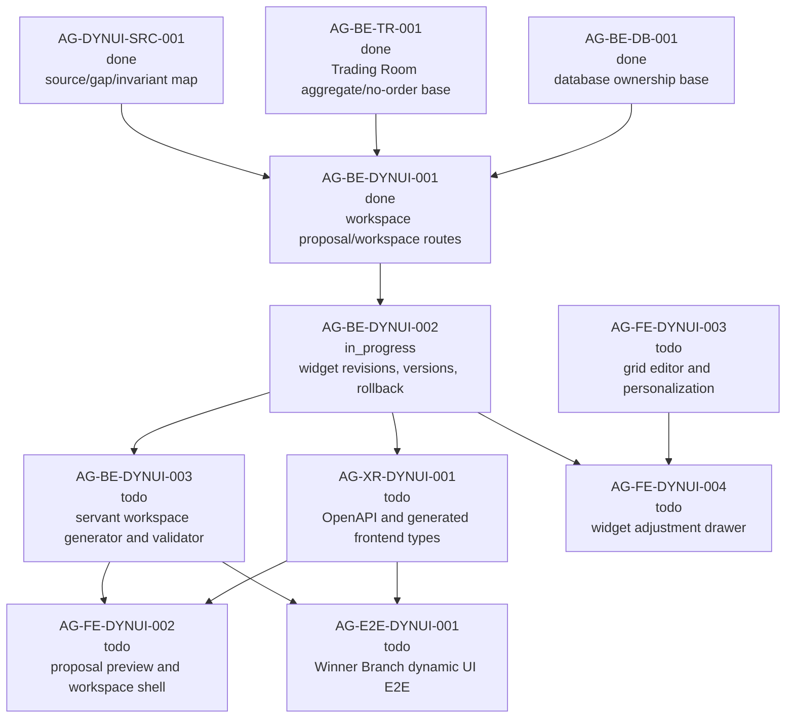

# AG-BE-DYNUI-002 Sidecar Acceptance Packet

**Sidecar task:** `AG-BE-DYNUI-002-SIDECAR-ACCEPTANCE`  
**Helper parent:** `AG-BE-DYNUI-002`  
**Helper kind:** `acceptance_packet`  
**Parent title:** Widget revision proposals and workspace versioning  
**Parent owner:** `Codex2`  
**Parent reviewer:** `Claude2`  
**Parent status at packet preparation:** `in_progress` in central L0 state on
2026-06-29  
**Sidecar owner:** `Codex`  
**Sidecar reviewer:** `Codex2`  
**Date:** `2026-06-29`  
**Status:** ready for sidecar review

> Scope constraint: support artifact only. This packet packages acceptance
> criteria, dependency routing, blocker triggers, and verification guidance for
> `AG-BE-DYNUI-002`. It does not edit canonical truth, schemas, OpenAPI, BFF
> routes, persistence, widget registry code, governance logic, frontend runtime
> code, or generated types.

---

## 1. Purpose

`AG-BE-DYNUI-002` owns the backend contract slice that turns a servant-suggested
widget adjustment into a reviewed `WidgetRevisionProposal`, applies accepted
revisions through controlled workspace versioning, supports keeping the original
widget while adding a modified copy, and exposes workspace version history plus
rollback.

This acceptance packet gives the parent owner and reviewer a narrow gate for the
second backend dynamic UI slice:

1. Define an explicit widget revision proposal contract that records
   `beforeSpec`, `proposedSpec`, rationale, warnings, data availability, status,
   and the workspace/view/widget scope.
2. Add revision proposal creation for widget-context servant adjustments without
   directly mutating the widget.
3. Add accept/apply, keep-original-and-add-copy, reject/cancel, version-history,
   and rollback semantics with optimistic concurrency and idempotency.
4. Preserve per-user/per-strategy/per-strategy-version isolation, existing
   no-order boundaries, and registry/schema safety.
5. Leave servant workspace generation to `AG-BE-DYNUI-003`, OpenAPI/generated
   type drift closure to `AG-XR-DYNUI-001`, and frontend drawer/runtime wiring
   to `AG-FE-DYNUI-004`.

The packet does not approve or implement the parent. It is a reviewer checklist
and dependency map for parent absorption.

---

## 2. Sources Used

| Source | Role for this packet |
| --- | --- |
| `.orchestrator/task-briefs/ag_be_dynui_002_sidecar_acceptance.md` | Sidecar scope: acceptance packet and dependency map only; no canonical truth changes. |
| `AI_COLLABORATION_GUIDE.md` | L0/L1/L2 boundary rules; support packets cannot override canonical architecture truth. |
| Central `/home/lupin/code/pantheon/ai-status.json` task entries | Current sidecar and parent state: sidecar `in_progress`, parent `AG-BE-DYNUI-002` `in_progress`, downstream tasks still `todo`. |
| `docs/04/agora_design_pack_dynui_2026-06-28/README.md` | Dynamic UI execution packet and task graph. |
| `docs/04/agora_design_pack_dynui_2026-06-28/source-map-and-gap-map.md` | Frozen V11 source/gap/invariant map. Routes missing widget revision proposals, versions, change log, and rollback to `AG-BE-DYNUI-002`. |
| `/tmp/ai-trading-desk-design/uploads/Pathreon_Agora_ClaudeDesign_UI_Requirement_V11_WinnerBranch_TradingRoom_2026-06-19.md` | V11 `WidgetRevisionProposal` shape and BFF route family for revision proposals, accept, versions, and rollback. |
| `support/sidecars/AG-BE-DYNUI-001/AG-BE-DYNUI-001-SIDECAR-ACCEPTANCE.md` | Upstream workspace proposal acceptance boundary and explicit handoff of servant-originated widget changes to `AG-BE-DYNUI-002`. |
| `ai-task-archive/tasks/AG-BE-DYNUI-001.json` in central Pantheon checkout | Upstream dependency archived as `done`, merged to `dev` at merge commit `eac485c90360a93545b5bf023e9324ca50c1b342`. |
| `services/control-plane/specs/agora/trading_room_workspace.schema.json` | Current `AG-BE-DYNUI-001` workspace/view/widget schema foundation. It does not define `WidgetRevisionProposal`. |
| `services/control-plane/bff/agora/trading_room/router.py` | Current workspace routes and guard that rejects servant direct widget patching with `servant_direct_widget_patch_not_allowed`. |
| `services/control-plane/bff/agora/trading_room/test_trading_room.py` | Current workspace proposal/layout/view/widget tests from upstream slice; useful composition baseline. |
| `services/control-plane/openapi/agora_v1_2.openapi.yaml` | Existing dashboard recipe version/rollback route family, reference only. It is not the V11 Trading Room workspace version contract. |

`current-work.md` and the full `ai-activity-log.jsonl` were not used as sources
for this packet.

---

## 3. Pre-Absorption Gap Snapshot

These observations were captured during sidecar packet preparation. They are
acceptance context for `AG-BE-DYNUI-002`, not canonical truth.

| Surface | Preparation observation | Parent implication |
| --- | --- | --- |
| `AG-BE-DYNUI-001` archive | Central archive reports `AG-BE-DYNUI-001` `done`, merged to `dev` at `eac485c90360a93545b5bf023e9324ca50c1b342`. | Parent can compose with the workspace proposal/workspace route foundation instead of recreating it. |
| `services/control-plane/specs/agora/trading_room_workspace.schema.json` | Defines proposal, workspace, view, widget, placement, and layout operation contracts. | Parent should add an additive widget revision proposal/version contract or equivalently scoped schema; do not widen the existing workspace schema casually. |
| `services/control-plane/bff/agora/trading_room/router.py` | Current direct widget patch rejects servant-originated changes and says they must use `WidgetRevisionProposal` routes. | Parent must implement the promised revision proposal route family instead of weakening this guard. |
| Current route search | No `revision-proposals`, `WidgetRevisionProposal`, Trading Room workspace `versions`, or Trading Room workspace `rollback` route was found. Dashboard recipe rollback exists separately. | Parent acceptance fails unless it adds the V11 revision/version/rollback surface or records a precise blocker. |
| V11 source | Requires `WidgetRevisionProposal`, accept, versions, rollback, and per-user/strategy scoping. | Parent must keep before/after specs and review status durable; a direct PATCH or dashboard recipe rollback is not enough. |
| Downstream tasks | `AG-XR-DYNUI-001`, `AG-BE-DYNUI-003`, `AG-FE-DYNUI-004`, and `AG-E2E-DYNUI-001` remain downstream. | Parent should leave generator integration, generated types, frontend drawer wiring, and E2E proof to their assigned owners. |

---

## 4. Parent Acceptance Checklist

| # | Criterion | Acceptance rule |
| --- | --- | --- |
| 1 | **Design source is cited** | Parent closeout evidence cites the frozen dynamic UI source map and the V11 requirement source. If the source cannot be read, parent opens a blocker instead of inventing revision fields. |
| 2 | **Upstream workspace contract is the base** | Parent composes with `AG-BE-DYNUI-001` workspace IDs, view IDs, widget IDs, ETags/versions, and user/strategy/version scope. It must not reimplement a parallel workspace resource. |
| 3 | **New contract is explicit and additive** | Add `services/control-plane/specs/agora/widget_revision_proposal.schema.json` or an equivalently scoped additive schema file. It must define revision proposal, revision action, workspace version, change-log entry, rollback request, and typed error-envelope shapes. |
| 4 | **Revision proposal shape is strict** | `WidgetRevisionProposal` includes at least `id`, `workspaceId`, `viewId`, `widgetId`, `instruction`, `beforeSpec`, `proposedSpec`, `rationale`, `warnings`, `dataAvailability`, `status`, timestamps, and requester/servant provenance. Unknown fields fail validation. |
| 5 | **Widget context is complete** | Create requests carry enough context for safe servant adjustment: strategy id/version, workspace id, view id, widget id, widget purpose, data source, fields, filters, time window, chart type, placement, evidence context, and user instruction. |
| 6 | **Create route exists** | `POST /bff/agora/trading-room/workspaces/{workspace_id}/widgets/{widget_id}/revision-proposals` or an equivalent repo-scoped route creates a preview proposal and returns the proposal, current workspace ETag/version, and polling or status links. |
| 7 | **Create does not mutate workspace** | Creating a revision proposal never changes the active workspace, widget, view, placement, or version history. It records a preview-only proposal. |
| 8 | **Before and proposed specs are immutable** | `beforeSpec` is copied from the active widget at proposal creation; `proposedSpec` is validated and persisted. Later workspace edits cannot silently rewrite either snapshot. |
| 9 | **Proposed spec is registry-validated** | `proposedSpec` must pass the Trading Room widget schema, chart spec schema, registry allowlist, interaction allowlist, data-source allowlist, sensitivity rules, and placement bounds. |
| 10 | **No code injection path exists** | Revision proposals reject raw JavaScript, React, HTML, external scripts, unsupported renderers, raw prompts, arbitrary URLs, and agent-generated executable UI code. |
| 11 | **Status lifecycle is enforced** | Allowed statuses include the V11 states `preview`, `accepted`, `rejected`, and `superseded`; cancel semantics must map to a reviewed terminal state and cannot leave a proposal reusable. |
| 12 | **Accept route exists** | `POST /bff/agora/trading-room/widget-revision-proposals/{proposal_id}/accept` or an equivalent repo-scoped route accepts a preview proposal with explicit action input. |
| 13 | **Accept requires active preview and concurrency guard** | Accept/apply requires a preview proposal, matching workspace/widget scope, authenticated owner, `If-Match` or equivalent version guard, and idempotency key. Stale writes return `412` or the repo-standard stale-write error. |
| 14 | **Apply updates workspace through versioning** | Applying a proposal updates only the target widget fields allowed by schema/registry, returns the updated workspace, new ETag/version, revision proposal status, and a new workspace version/change-log entry. |
| 15 | **Keep original plus modified copy is explicit** | The keep-original action preserves the original widget and adds a new modified widget with a unique ID, clear lineage to the proposal, safe placement handling, and a version/change-log entry. |
| 16 | **Reject/cancel does not mutate workspace** | Rejecting or cancelling a proposal marks it terminal, records rationale when provided, and leaves workspace state/version unchanged except for proposal metadata. |
| 17 | **Double-accept is impossible** | Accepted, rejected, cancelled, or superseded proposals cannot be accepted again. Idempotent retries of the same accepted request return the same result or a safe duplicate response without another version bump. |
| 18 | **Proposal supersession is deterministic** | If the target widget changes before proposal acceptance, the proposal is rejected as stale or superseded with a latest-workspace link; it is not applied to a mismatched widget shape. |
| 19 | **Versions route exists** | `GET /bff/agora/trading-room/workspaces/{workspace_id}/versions` returns workspace versions scoped to the authenticated user, strategy id, and strategy version, including version id, created timestamp, actor, reason/action, proposal id when applicable, and summary diff/change log. |
| 20 | **Rollback route exists** | `POST /bff/agora/trading-room/workspaces/{workspace_id}/versions/{version_id}/rollback` restores the selected snapshot by creating a new version. It never deletes or rewrites history. |
| 21 | **Rollback is guarded** | Rollback requires workspace ownership, `If-Match` or equivalent current-version guard, idempotency, and validation that the target version belongs to the same workspace/user/strategy/version. |
| 22 | **Change log is durable** | Apply, keep-copy, reject/cancel, supersede, and rollback operations record auditable change-log entries with actor/provenance and before/after or snapshot references. |
| 23 | **Cross-user isolation is fail-closed** | Cross-user, cross-tenant, cross-strategy, or cross-version proposal/version/rollback access returns `403` or the repo-standard equivalent without leaking unrelated workspace details. |
| 24 | **No order/capital/runtime authority leaks** | New routes never create broker orders, bind capital, create or mutate `RuntimeBinding`, expose Management-plane actions, or use backend-internal broker/runtime terms as operator-facing widget controls. |
| 25 | **Dashboard recipe is not a substitute** | Dashboard recipe version/rollback routes may be a pattern reference only. They cannot be presented as completion for Trading Room workspace versions or `WidgetRevisionProposal` lifecycle. |
| 26 | **Downstream boundaries are preserved** | Parent does not claim servant workspace generation (`AG-BE-DYNUI-003`), OpenAPI/generated type drift closure (`AG-XR-DYNUI-001`), frontend revision drawer wiring (`AG-FE-DYNUI-004`), or full E2E proof (`AG-E2E-DYNUI-001`). |
| 27 | **Focused tests exist** | Tests cover schema validation, proposal create, create-without-mutation, accept/apply, keep-original-add-copy, reject/cancel, double-accept prevention, stale proposal/workspace rejection, versions listing, rollback, cross-user isolation, registry rejection, code-injection rejection, and no-order guard. |
| 28 | **Review evidence is attached** | Parent closeout includes exact commands and outputs sufficient for reviewer confidence: route tests, schema validation, targeted route/schema searches, forbidden-surface searches, and sample/golden responses for proposal/version/rollback payloads. |

---

## 5. Dependency Map



### Dependency notes

| Task | State observed | Relevance |
| --- | --- | --- |
| `AG-DYNUI-SRC-001` | Archived `done` with `terminal_outcome: completed`; published source/gap map. | Parent must use the frozen V11 dynamic invariants and route family. |
| `AG-BE-TR-001` | Archived completed in prior sprint records. | Parent composes with existing Trading Room aggregate and no-order semantics. |
| `AG-BE-DB-001` | Archived completed in prior sprint records. | Parent must keep proposal/version persistence ownership and scope keys explicit. |
| `AG-BE-DYNUI-001` | Archived `done`; merged to `dev` at `eac485c90360a93545b5bf023e9324ca50c1b342`. | Upstream workspace proposal/workspace contract foundation. Parent should not duplicate it. |
| `AG-BE-DYNUI-002` | Central L0 state `in_progress`, owner `Codex2`, reviewer `Claude2`. | Parent task receiving this packet. |
| `AG-XR-DYNUI-001` | Central L0 state `todo`, depends on `AG-BE-DYNUI-001` and `AG-BE-DYNUI-002`. | Owns OpenAPI/generated frontend type drift closure after this parent lands. |
| `AG-BE-DYNUI-003` | Central L0 state `todo`, depends on `AG-BE-DYNUI-001` and `AG-BE-DYNUI-002`. | Owns real servant workspace generator and safe widget/chart validator integration. |
| `AG-FE-DYNUI-004` | Central L0 state `todo`, depends on `AG-FE-DYNUI-003` and `AG-BE-DYNUI-002`. | Owns frontend widget adjustment drawer, before/after review UX, and apply/keep/cancel wiring. |
| `AG-E2E-DYNUI-001` | Central L0 state `todo`, depends on generator, XR, and later visual parity. | Final proof after backend, generated types, and frontend runtime compose. |

---

## 6. Blocker Triggers For Parent Owner

The parent owner should stop and open a blocker if any of these are true:

1. The V11 design source or frozen source/gap map cannot be read.
2. The `AG-BE-DYNUI-001` workspace proposal/workspace contract is absent or
   incompatible with revision proposal scoping.
3. Proposal/version persistence ownership cannot be identified without violating
   database ownership boundaries.
4. The only available route is direct widget `PATCH`; servant-originated changes
   would bypass `WidgetRevisionProposal` preview.
5. Proposed widget specs cannot be validated by the existing schema/registry
   substrate without inventing unreviewed renderer, data-source, or interaction
   fields.
6. The parent cannot enforce cross-user, cross-tenant, cross-strategy, or
   cross-version isolation for proposal, version, and rollback resources.
7. The implementation would use dashboard recipe rollback as the Trading Room
   workspace version source of truth.
8. Any implementation path requires Management-plane terms, `RuntimeBinding`,
   broker order controls, capital binding, raw HTML/JS/React injection, or
   arbitrary data-source URLs.
9. Mutating routes cannot support idempotency and optimistic concurrency
   compatible with existing BFF patterns.

---

## 7. Suggested Parent Verification Plan

Run focused backend validation after parent implementation. Exact test names may
change, but the evidence should cover these categories:

```bash
python3 -m pytest services/control-plane/bff/agora/trading_room/test_trading_room.py -k "revision or version or rollback"
```

```bash
python3 -m pytest services/control-plane/bff/tests -k "trading_room and (revision or version or rollback)"
```

```bash
rg -n "WidgetRevisionProposal|revision-proposals|widget-revision-proposals|workspaces/.*/versions|rollback" \
  services/control-plane/bff services/control-plane/specs services/control-plane/openapi
```

```bash
rg -n "RuntimeBinding|place_order|enable_live|capital_binding|broker_order|dangerouslySetInnerHTML|eval\\(|new Function" \
  services/control-plane/bff/agora services/control-plane/specs/agora
```

Recommended assertions:

- JSON Schema validation passes for revision proposal, revision action,
  workspace version, change-log entry, and rollback payload examples.
- Creating a revision proposal records `beforeSpec` and `proposedSpec` but does
  not change workspace version or active widget state.
- Accept/apply requires preview status, correct owner/scope, idempotency, and
  ETag/version guard.
- Keep-original-and-add-copy preserves the original widget and creates one
  registry-valid copied widget with lineage to the accepted proposal.
- Reject/cancel leaves workspace state and version unchanged.
- Double-accept and stale proposal acceptance fail safely.
- Versions listing is scoped to the authenticated user and includes auditable
  change-log metadata.
- Rollback creates a new version from an older snapshot and does not rewrite
  history.
- Cross-user proposal, version, and rollback reads/mutations return `403`.
- Registry validation rejects unknown widget type, forbidden interaction, raw
  code renderer, arbitrary URL, and broker/capital/runtime actions.
- Dashboard recipe version/rollback endpoints are not used as completion
  evidence for V11 Trading Room workspace versions.

---

## 8. Reviewer Handoff Notes

**Reviewer:** `Codex2`

### What to verify

1. The packet is support-only and does not redefine canonical contract truth.
2. The checklist is specific enough for `AG-BE-DYNUI-002` review without
   expanding into `AG-BE-DYNUI-003`, XR, frontend drawer/runtime, or E2E scopes.
3. The pre-absorption gap snapshot matches the observed router/schema/OpenAPI
   state at preparation time.
4. The dependency map reflects central L0 active tasks plus archived upstream
   dependencies.
5. The safety posture preserves no direct servant mutation, no arbitrary code,
   no cross-user leakage, no order/capital authority, and no dashboard-recipe
   substitution.

### Suggested reviewer command

```bash
AI_NAME=Codex2 REVIEW_FILE=support/sidecars/AG-BE-DYNUI-002/AG-BE-DYNUI-002-SIDECAR-ACCEPTANCE.md \
  ./scripts/ai-status.sh approve AG-BE-DYNUI-002-SIDECAR-ACCEPTANCE \
  "Acceptance packet approved; support artifact gives AG-BE-DYNUI-002 concrete widget revision proposal, workspace version, rollback, dependency routing, blocker trigger, and verification guidance without changing canonical truth."
```

If changes are required:

```bash
AI_NAME=Codex2 ./scripts/ai-status.sh reopen AG-BE-DYNUI-002-SIDECAR-ACCEPTANCE \
  "Describe the exact packet corrections needed."
```

---

## 9. Support-Only Boundary Confirmation

- No L1/L2 canonical policy or architecture document was edited.
- No schema, OpenAPI, BFF route, persistence layer, widget registry,
  governance logic, frontend runtime, or generated type file was changed.
- The only intended deliverable is this support packet.
- This sidecar does not approve the parent implementation. It gives the parent
  owner and reviewer a concrete acceptance surface.

*Prepared by Codex for the `AG-BE-DYNUI-002-SIDECAR-ACCEPTANCE` sidecar slice.*
