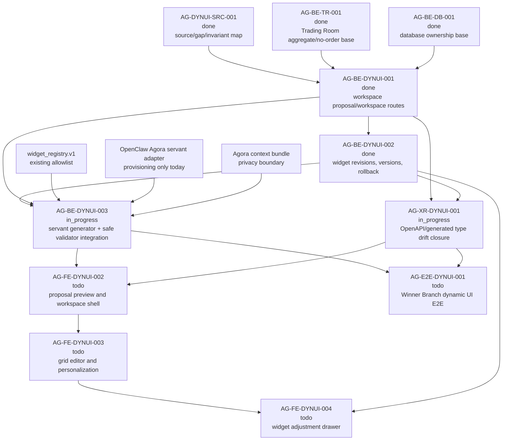

# AG-BE-DYNUI-003 Sidecar Acceptance Packet

**Sidecar task:** `AG-BE-DYNUI-003-SIDECAR-ACCEPTANCE`
**Helper parent:** `AG-BE-DYNUI-003`
**Helper kind:** `acceptance_packet`
**Parent title:** Servant workspace generator and safe widget validator
**Parent owner / reviewer:** `Codex2` / `Codex` in central L0 state on
2026-06-29
**Parent status at packet preparation:** `in_progress`
**Sidecar owner / reviewer:** `Codex2` / `Claude`
**Date:** `2026-06-29`
**Status:** ready for reviewer handoff

> Scope constraint: support artifact only. This packet packages acceptance
> criteria, dependency routing, blocker triggers, and verification guidance for
> `AG-BE-DYNUI-003`. It does not edit canonical truth, schemas, OpenAPI, BFF
> routes, persistence, widget registry code, OpenClaw runtime code, governance
> logic, frontend runtime code, or generated types.

---

## 1. Purpose

`AG-BE-DYNUI-003` owns the backend servant-generator slice for the V11 Trading
Room dynamic UI. The parent must turn a ready StrategySpec version into a
complete `TradingRoomWorkspaceProposal`, using the already landed workspace,
widget revision, version, and rollback contracts as its target surface.

This acceptance packet gives the parent owner and reviewer a narrow gate for the
third backend dynamic UI slice:

1. Connect the Trading Room proposal route or an equivalent service layer to a
   real trading servant workspace generator, rather than relying only on the
   contract-level deterministic proposal fixture.
2. Preserve `AG-BE-DYNUI-001` proposal/workspace contracts and
   `AG-BE-DYNUI-002` widget revision/version contracts without redefining them.
3. Ensure every generated view/widget/chart passes the existing schema and
   registry validator path before a proposal is returned.
4. Return typed capability fallback or component-task-request output when a
   renderer, data source, chart kind, or widget family is unsupported.
5. Preserve data availability, warnings, personalization, evidence/data cutoff
   context, privacy boundaries, user scope isolation, and the no-order/no-code
   safety posture.

This packet does not approve or implement the parent. It is a support-only
checklist and dependency map for parent absorption.

---

## 2. Sources Used

| Source | Role for this packet |
| --- | --- |
| `.orchestrator/task-briefs/ag_be_dynui_003_sidecar_acceptance.md` | Sidecar scope: acceptance packet and dependency map only; no canonical truth changes. |
| `AI_NAME=Codex2 ./scripts/ai-status.sh show AG-BE-DYNUI-003-SIDECAR-ACCEPTANCE` | Sidecar active state, owner, reviewer, helper parent, helper kind, artifact path, and support-only acceptance. |
| `AI_NAME=Codex2 ./scripts/ai-status.sh show AG-BE-DYNUI-003` | Parent active state and summary: servant generator must produce complete workspace proposals and enforce widget/chart allowlist validation. |
| `AI_NAME=Codex2 ./scripts/ai-status.sh show AG-BE-DYNUI-001` | Upstream dependency archived `done`; workspace proposal/workspace contract foundation merged to `dev`. |
| `AI_NAME=Codex2 ./scripts/ai-status.sh show AG-BE-DYNUI-002` | Upstream dependency archived `done`; widget revision proposal, versions, and rollback foundation merged to `dev`. |
| `AI_NAME=Codex2 ./scripts/ai-status.sh show AG-XR-DYNUI-001` | Downstream/generated-type dependency is active `in_progress`; parent must not claim generated frontend type closure. |
| `AI_NAME=Codex2 ./scripts/ai-status.sh show AG-FE-DYNUI-002` | Downstream frontend proposal preview/workspace shell remains `todo` and depends on this parent. |
| `AI_NAME=Codex2 ./scripts/ai-status.sh show AG-E2E-DYNUI-001` | End-to-end dynamic UI proof remains downstream and depends on this parent. |
| `AI_COLLABORATION_GUIDE.md` | L0/L1/L2 boundary rules; support packets cannot override canonical architecture truth. |
| `docs/04/agora_design_pack_dynui_2026-06-28/README.md` | Dynamic UI execution packet, source references, task graph, and non-static guard. |
| `docs/04/agora_design_pack_dynui_2026-06-28/source-map-and-gap-map.md` | Frozen source/gap map routes the missing servant generator and validator integration to `AG-BE-DYNUI-003`. |
| `docs/04/agora_design_pack_dynui_2026-06-28/closeout.md` | `AG-DYNUI-SRC-001` publication evidence and no-blocker intake result. |
| `support/sidecars/AG-BE-DYNUI-001/AG-BE-DYNUI-001-SIDECAR-ACCEPTANCE.md` | Upstream acceptance boundary for V11 workspace proposal/workspace routes. |
| `support/sidecars/AG-BE-DYNUI-001/AG-BE-DYNUI-001-IMPLEMENTATION-EVIDENCE.md` | Upstream implementation scope, validation commands, and explicit non-goals. |
| `support/sidecars/AG-BE-DYNUI-002/AG-BE-DYNUI-002-SIDECAR-ACCEPTANCE.md` | Upstream acceptance boundary for widget revision proposals, versions, rollback, and no direct servant mutation. |
| `services/control-plane/specs/agora/trading_room_workspace.schema.json` | Current target contract for `TradingRoomWorkspaceProposal`, `TradingRoomWorkspace`, `TradingRoomViewSpec`, `TradingRoomWidgetSpec`, `WidgetRevisionProposal`, and dashboard versions. |
| `services/control-plane/bff/agora/trading_room/router.py` | Current route and validator surface: proposal create/get/accept, workspace read/layout/views/widgets, revision proposals, versions, rollback, registry validation, and safety guards. |
| `services/control-plane/bff/agora/trading_room/store.py` | Current in-process persistence surface for proposals, workspaces, revision proposals, and workspace versions. |
| `services/control-plane/specs/agora/widget_registry.v1.json` | Allowlisted widget types and interactions, including `request_widget_revision`. |
| `integrations/openclaw/adapter/agora_servant.py` | Existing OpenClaw servant provisioning adapter; does not yet implement workspace generation. |
| `integrations/openclaw/adapter/agora_context_bundle.py` | Privacy-safe central persona context bundle; useful boundary for generator inputs. |
| `services/control-plane/bff/agora/trading_room/test_trading_room.py` | Current focused tests for workspace proposals, widget revision proposals, rollback, scoping, and safety guards. |

`current-work.md` and the full `ai-activity-log.jsonl` were not scanned.

---

## 3. Current Composition Snapshot

| Surface | Observed state | Meaning for `AG-BE-DYNUI-003` |
| --- | --- | --- |
| Upstream workspace contract | `AG-BE-DYNUI-001` is archived `done`; `trading_room_workspace.schema.json` defines proposals, workspaces, views, widgets, layout ops, revision proposals, and versions. | Parent should target the existing contract, not create a parallel proposal shape. |
| Upstream revision/version contract | `AG-BE-DYNUI-002` is archived `done`; router and store include widget revision proposal, accept/apply, keep-copy, versions, and rollback surfaces. | Parent generator must leave widget adjustment to revision proposals and must not directly mutate active widgets. |
| Proposal route | `POST /bff/agora/strategies/{strategy_id}/trading-room/proposals` returns a complete V11 Winner Branch proposal through `_build_workspace_proposal`. Its docstring says the real servant generator is owned by `AG-BE-DYNUI-003`. | This deterministic builder is a contract-level bridge, not sufficient parent completion by itself. Parent must add/route the real generator or a typed capability fallback. |
| Validator path | Router validates generated views/widgets through `_validate_view`, `_validate_widget`, placement/size checks, forbidden interaction checks, and registry validation via `_validate_registry_widget_spec`. | Parent should reuse this path as the acceptance gate for all generated output. |
| Widget registry | `widget_registry.v1.json` has active Winner Branch widgets and `request_widget_revision` interactions. | Parent should choose only registry-supported widgets/interactions or emit a component-task request/fallback for unsupported needs. |
| OpenClaw servant adapter | `agora_servant.py` provisions/updates an OpenClaw servant agent only. | Parent must add a generation interface or adapter call; provisioning success is not workspace-generation proof. |
| Context bundle privacy | `agora_context_bundle.py` rejects raw prompts, PII, private journals, session history, and capital binding fields. | Parent generator inputs must use references and redacted context, not raw private content. |
| Downstream XR/frontend | `AG-XR-DYNUI-001` is active; `AG-FE-DYNUI-002` and `AG-E2E-DYNUI-001` are not complete. | Parent should not claim OpenAPI/generated types, frontend preview/shell, or E2E proof. |

---

## 4. Parent Acceptance Checklist

| # | Criterion | Acceptance rule |
| --- | --- | --- |
| 1 | **Design source is cited** | Parent closeout evidence cites the frozen dynamic UI source map, V11 requirement source, and current upstream packets. If source material is unreadable or conflicts with committed contracts, parent opens a blocker. |
| 2 | **Upstream contracts are reused** | Parent composes with `AG-BE-DYNUI-001` proposal/workspace IDs, views/widgets, ETags, scope keys, and `AG-BE-DYNUI-002` revision/version routes. It does not redefine these contracts. |
| 3 | **Generator entrypoint exists** | Add a clearly named generator function/service/adapter path for producing `TradingRoomWorkspaceProposal` from a ready StrategySpec version, or route the existing proposal endpoint through that generator. |
| 4 | **Deterministic builder is not sole proof** | The existing `_build_workspace_proposal` helper can remain as a fallback or test fixture, but parent completion requires evidence of the trading servant generator path or a typed capability-not-ready response. |
| 5 | **Input readiness is enforced** | Generator requires a ready StrategySpec version, strategy id, strategy version, authenticated user/tenant scope, data cutoff, evidence refs or evidence bundle refs, and optional personalization hints. It rejects missing or stale readiness. |
| 6 | **Privacy boundary is respected** | Generator input uses references and redacted context. It must not pass raw private prompts, user PII, private journal content, session history, capital binding details, or broker/runtime state to central persona/OpenClaw calls. |
| 7 | **Output is schema-shaped proposal data** | Generator output is a `TradingRoomWorkspaceProposal` with required fields: `strategyId`, `strategyVersion`, `proposalId`, `generatedAt`, `status`, `views`, `rationale`, `dataAvailability`, `warnings`, and `personalizationApplied`. |
| 8 | **Full Winner Branch view set is present** | Generated proposals contain at least the seven V11 views: strategy overview, candidates/entry, winner branch intelligence, related-party/flow migration, event lead, positions/add/reduce/exit, and evidence/monitoring rules. |
| 9 | **Views are complete before preview** | Each generated view includes id, title, purpose, order, layout template, widget count, widgets, rationale or equivalent reason, data availability, and warnings when applicable. Empty or static dashboard success fails acceptance. |
| 10 | **Widgets explain why they exist** | Each widget includes title, purpose, `whyIncluded`, data source, query/filter/window, chart spec, interactions, placement, min/max size, sensitivity, and visibility. |
| 11 | **Data availability is truthful** | Generator preserves source-level `complete`, `partial`, or `unavailable` status. It must not mark unknown/stale sources as complete to satisfy UI shape. |
| 12 | **Warnings are preserved** | Proposal/view/widget warnings from the generator, data availability check, unsupported capability check, or validator are returned in the proposal rather than dropped. |
| 13 | **Personalization is explicit** | `personalizationApplied` truthfully distinguishes applied versus not applied hints and records only safe, non-secret personalization keys/values. |
| 14 | **Evidence and freshness are not lost** | Parent records how evidence refs and data cutoff/freshness are carried. If the current schema cannot carry required evidence/freshness fields without contract change, parent opens a blocker or XR/contract handoff instead of inventing fields ad hoc. |
| 15 | **All generated views pass validation** | Before storing or returning a preview, every generated view passes `_validate_view` or equivalent schema validation. |
| 16 | **All generated widgets pass registry validation** | Every generated widget passes `_validate_widget` and the registry-backed `_validate_registry_widget_spec` path. Unknown widget type, forbidden interaction, unsupported chart kind, bad placement, invalid sensitivity, or arbitrary data-source URL is rejected. |
| 17 | **Unsupported renderer has governed output** | If a required renderer/widget/chart is unsupported, parent returns a supported fallback or a typed component-task request. It must not emit raw React, JavaScript, HTML, iframe, external script, or arbitrary renderer code. |
| 18 | **Fallbacks are honest** | Capability-not-ready, missing generator, unsupported component, or unavailable data returns a typed pending/unavailable/fallback state. It must not silently return fixtures, static mock workspaces, or empty dashboards as successful generated proposals. |
| 19 | **Proposal persistence stays scoped** | Generated proposal records remain scoped to the authenticated user, tenant, strategy id, and strategy version. Cross-user proposal reads/mutations fail closed. |
| 20 | **Accept-to-workspace still works** | A generated preview proposal can be accepted through the existing accept route and materializes an active workspace with all generated views/widgets plus an initial version record. |
| 21 | **Revision flow boundary remains intact** | Servant-originated widget changes after workspace creation still go through `WidgetRevisionProposal`; parent does not weaken `servant_direct_widget_patch_not_allowed`. |
| 22 | **No order/capital/runtime authority leaks** | Generator and routes never create broker orders, bind capital, create/mutate `RuntimeBinding`, expose Management-plane actions, or surface broker/runtime wording as operator controls. |
| 23 | **No arbitrary code path exists** | Generated payloads and personalization hints reject `rawHtml`, JavaScript/React code, `eval`, `new Function`, `dangerouslySetInnerHTML`, iframes, external scripts, raw prompts, arbitrary URLs, and executable UI snippets. |
| 24 | **Idempotency and replay behavior are clear** | Proposal generation documents idempotency behavior. Replayed requests either return a safe duplicate/conflict per existing BFF posture or reuse a known proposal without creating multiple ambiguous workspaces. |
| 25 | **OpenAPI/generated types are not claimed** | Parent does not claim `AG-XR-DYNUI-001` completion unless that task separately lands generated OpenAPI/types and drift checks. |
| 26 | **Frontend preview/shell is not claimed** | Parent does not claim `AG-FE-DYNUI-002`, grid editor, widget drawer, visual parity, or full E2E scope. |
| 27 | **Focused tests exist** | Tests cover generator success, missing readiness, capability fallback, unsupported widget/chart/data source, registry rejection, privacy rejection, cross-user isolation, accept-to-workspace, revision-flow boundary, no-order guard, and no-code-injection guard. |
| 28 | **Review evidence is attached** | Parent closeout includes exact commands and outputs: focused tests, route/schema/adapter searches, forbidden-surface searches, sample generated proposal payload, and any mocked OpenClaw/generator call evidence. |

---

## 5. Dependency Map



### Dependency notes

| Task / surface | State observed | Relevance |
| --- | --- | --- |
| `AG-DYNUI-SRC-001` | Archived `done`; source/gap/invariant map published. | Parent must use the frozen V11 dynamic invariants and source references. |
| `AG-BE-DYNUI-001` | Archived `done`; closeout says workspace proposal/workspace schema, store, routes, and focused tests landed. | Parent target contract; do not duplicate proposal/workspace resources. |
| `AG-BE-DYNUI-002` | Archived `done`; closeout says revision proposals, keep-copy, versions, rollback, and focused tests landed. | Parent must route later servant widget changes through revision proposals. |
| `services/control-plane/bff/agora/trading_room/router.py` | Contains current proposal route and validator path. | Parent should replace or augment deterministic proposal construction with real servant generator integration. |
| `integrations/openclaw/adapter/agora_servant.py` | Provisions OpenClaw servant agents only. | Parent must add workspace-generation behavior or explicit adapter boundary. |
| `integrations/openclaw/adapter/agora_context_bundle.py` | Enforces redacted context for central persona calls. | Parent should reuse privacy rules for generator inputs. |
| `AG-XR-DYNUI-001` | Active `in_progress`. | OpenAPI/generated frontend type drift closure is downstream or parallel, not parent acceptance unless separately completed. |
| `AG-FE-DYNUI-002` | Active `todo`; depends on this parent. | Needs generated proposal preview and workspace shell after parent lands. |
| `AG-E2E-DYNUI-001` | Active `todo`; depends on generator, XR, and visual parity. | Final proof remains downstream. |

---

## 6. Blocker Triggers For Parent Owner

The parent owner should stop and open a blocker if any of these are true:

1. The V11 design source, frozen source/gap map, or upstream 001/002 packets
   cannot be read.
2. A ready StrategySpec version cannot be identified or its readiness semantics
   conflict with the existing Strategy Workshop readiness gate.
3. The real servant generator output requires fields not present in the current
   proposal/workspace schema and cannot be represented without contract change.
4. Evidence refs or data freshness are required for review but cannot be carried
   through the existing contract without inventing ad hoc fields.
5. OpenClaw servant provisioning succeeds, but there is no callable generator
   path that returns proposal-shaped output.
6. A generated widget/chart/data source/interaction is not in the registry or
   schema allowlist and no typed fallback/component-task request exists.
7. Generator integration would pass raw private prompts, PII, session history,
   private journals, capital binding details, or broker/runtime state outside
   the approved privacy boundary.
8. The implementation would weaken `servant_direct_widget_patch_not_allowed` or
   directly mutate active widgets instead of returning revision proposals.
9. Any path requires raw HTML/JS/React execution, external scripts, arbitrary
   URLs, Management-plane actions, `RuntimeBinding`, broker order controls, or
   capital binding.
10. Parent cannot produce focused, repeatable local validation for success,
    fallback, validator rejection, scoping, and safety guard cases.

---

## 7. Suggested Parent Verification Plan

Run focused backend validation after parent implementation. Exact test names may
change, but the evidence should cover these categories:

```bash
python3 -m pytest services/control-plane/bff/agora/trading_room/test_trading_room.py -k "workspace or proposal or revision or version or rollback" -q
```

```bash
python3 -m pytest integrations/openclaw/adapter/test_agora_context_bundle.py -q
```

```bash
rg -n "TradingRoomWorkspaceProposal|generate.*workspace|workspace.*generator|_validate_widget|_validate_view|widget_registry|capability.*not.*ready|component.*task|unsupported" \
  services/control-plane/bff/agora/trading_room integrations/openclaw/adapter services/control-plane/specs/agora
```

```bash
rg -n "RuntimeBinding|broker|capital_binding|place_order|enable_live|rawHtml|javascript|react|eval\\(|new Function|dangerouslySetInnerHTML|iframe|external script|raw_prompt|private_journal|conversation_history" \
  services/control-plane/bff/agora integrations/openclaw/adapter services/control-plane/specs/agora
```

Recommended assertions:

- Generator accepts a ready StrategySpec version and returns a complete
  `TradingRoomWorkspaceProposal`.
- Missing/stale readiness returns a typed validation or capability error.
- OpenClaw/generator unavailable returns capability-not-ready or fallback, not
  a fake successful workspace.
- Generated proposal contains all seven Winner Branch views.
- Every generated widget passes schema/registry validation.
- Unknown widget type, unsupported chart kind, forbidden interaction, arbitrary
  data source URL, and raw code fields are rejected.
- Data availability and warnings survive from generator output to proposal
  response.
- Personalization hints are safe and truthfully reflected.
- Cross-user proposal access returns `403`.
- Accepting a generated proposal materializes an active workspace and initial
  version.
- Servant-originated post-creation widget changes still require
  `WidgetRevisionProposal`.
- Forbidden-surface grep shows no order/capital/runtime/Management/code
  execution path introduced by this parent.

---

## 8. Reviewer Handoff Notes

**Reviewer:** `Claude`

### What to verify

1. The packet is support-only and does not redefine canonical contract truth.
2. The checklist is specific enough for `AG-BE-DYNUI-003` review without
   expanding into OpenAPI/generated types, frontend preview/shell, grid editor,
   widget drawer, visual parity, or E2E scope.
3. The current composition snapshot correctly distinguishes the existing
   deterministic proposal builder from the real servant generator gap.
4. The dependency map reflects central L0 state: `AG-BE-DYNUI-001/002` done,
   parent `AG-BE-DYNUI-003` in progress, XR in progress, FE/E2E downstream.
5. The safety posture preserves no direct order, no capital/runtime/Management,
   no arbitrary code, no raw private content, cross-user fail-closed behavior,
   and no direct servant widget mutation.

### Suggested reviewer command

```bash
AI_NAME=Claude REVIEW_FILE=support/sidecars/AG-BE-DYNUI-003/AG-BE-DYNUI-003-SIDECAR-ACCEPTANCE.md \
  ./scripts/ai-status.sh approve AG-BE-DYNUI-003-SIDECAR-ACCEPTANCE \
  "Acceptance packet approved; support artifact gives AG-BE-DYNUI-003 concrete servant workspace generator, validator integration, fallback, dependency routing, blocker trigger, and verification guidance without changing canonical truth."
```

If changes are required:

```bash
AI_NAME=Claude ./scripts/ai-status.sh reopen AG-BE-DYNUI-003-SIDECAR-ACCEPTANCE \
  "Describe the exact packet corrections needed."
```

---

## 9. Support-Only Boundary Confirmation

- No L1/L2 canonical policy or architecture document was edited.
- No schema, OpenAPI, BFF route, persistence layer, widget registry, OpenClaw
  runtime, governance logic, frontend runtime, or generated type file was
  changed.
- The only intended deliverable is this support packet:
  `support/sidecars/AG-BE-DYNUI-003/AG-BE-DYNUI-003-SIDECAR-ACCEPTANCE.md`.
- This sidecar does not approve the parent implementation. It gives the parent
  owner and reviewer a concrete acceptance surface.

*Prepared by Codex2 for the `AG-BE-DYNUI-003-SIDECAR-ACCEPTANCE` sidecar slice.*
