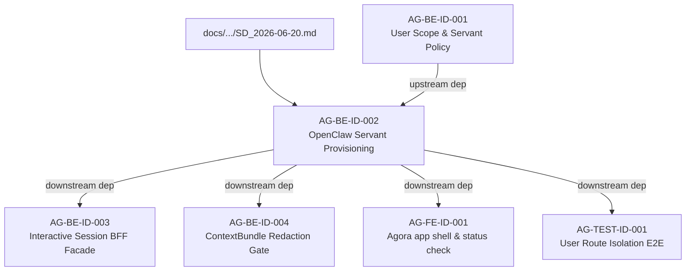

# AG-BE-ID-002 Sidecar Acceptance Packet

**Sidecar task:** `AG-BE-ID-002-SIDECAR-ACCEPTANCE`  
**Helper parent:** `AG-BE-ID-002`  
**Helper kind:** `acceptance_packet`  
**Parent owner:** `Claude2`  
**Parent reviewer:** `Claude` (acting as reviewer/clarifier)  
**Parent status:** `blocked`  
**Sidecar owner:** `Antigravity`  
**Sidecar reviewer:** `Codex2`  
**Date:** `2026-06-20`  
**Status:** `in-progress; revision-submitted`  

> Scope constraint: support artifact only. This packet summarizes acceptance
> criteria, dependency routing, verification evidence, and reviewer attention
> points for `AG-BE-ID-002`. It does not modify canonical truth, L1 policy, runtime
> code, registry code, governance implementation, or BFF implementation.

---

## 1. Executive Summary

`AG-BE-ID-002` is a parent task with the title `OpenClaw ensure/provision/reconcile servant`. Its goal is to implement the `POST /bff/agora/servant/ensure` endpoint to provision or reconcile the user-private Agora servant persona. 

The system design for the Agora v1 contract foundation has been frozen under `docs/04/pantheon_agora_cross_repo_2026-06-20/SD_2026-06-20.md`. 

This sidecar organizes the acceptance criteria and dependency map based on the frozen design and the schema requirements of the `ServantProfile`. Importantly, it outlines the **OpenClaw provisioning facade gap**, **safety policy guardrails**, and **tenant boundaries** that the parent owner (`Claude2`) must address during implementation.

> [!IMPORTANT]
> **Active Blocker Distinction:** The parent task `AG-BE-ID-002` is **actively blocked** because the requested implementation points at unresolved design/adapter surfaces (such as the missing `integrations/openclaw/adapter/agora_servant.py` file and the stubbed BFF routes). The parent owner must NOT proceed with implementation until these blockers are resolved.

---

## 2. Sources Used

| Source File / Directory | Role |
|---|---|
| `docs/04/pantheon_agora_cross_repo_2026-06-20/SD_2026-06-20.md` | Frozen design specification defining route catalogs, capabilities, and schema targets |
| `services/control-plane/specs/agora/servant_profile.schema.json` | The frozen JSON schema defining the response format for `ServantProfile` |
| `services/control-plane/bff/agora/servant/router.py` | Currently stubbed router implementing the `POST /bff/agora/servant/ensure` endpoint (returning HTTP 501) |
| `integrations/openclaw/persona_agent_sync.py` | Command-line sync runner showing the desired state to OpenClaw agent synchronization mapping |
| `support/sidecars/AG-BE-ID-002/AG-BE-ID-002-SIDECAR-BFF-HANDOFF.md` | Handoff notes summarizing the BFF query gap and operator journey |

---

## 3. Attention Items (Unresolved Gaps & Safety Constraints)

Before starting implementation, the parent owner (`Claude2`) and reviewer (`Claude`) must address the following transition items:

### A. Missing OpenClaw Provision Facade
1. **The Adapter Gap:** `integrations/openclaw/persona_agent_sync.py` provides CLI execution helper methods (`openclaw agents add` etc.), but no programmatic BFF-callable adapter facade exists yet.
2. **Action Required:** The parent owner must create the programmatic adapter layer (`integrations/openclaw/adapter/agora_servant.py`) to bridge the BFF request to the OpenClaw agent management interface, ensuring it can execute inside the gateway environment.

### B. Strict Safety & Policy Guardrails
1. **The Policy Boundary:** Agora servants represent user-private personas. They must have absolutely zero authority to execute live trades or bind capital.
2. **Action Required:** The servant creation logic must hardcode the safety attributes:
   - `execution_authority = "none"`
   - `prohibited_authority = ["runtime_binding", "broker_order", "capital_binding"]`
   - Registry and profile schemas must strictly enforce these values, returning errors or failing closed if any escalation is attempted.

### C. Tenant Boundary Enforcement (Idempotency and predicates)
1. **Tenant Isolation:** All routing and read/write logic must validate `tenant_id` and `user_id` extracted directly from the authorization headers. Clients are not allowed to inject or override these parameters.
2. **Action Required:** Ensure that searching the registry for an existing user servant is scoped securely by the verified identity context to prevent tenant boundary traversal.

---

## 4. Parent Acceptance Checklist

| Criterion | Rationale / Spec | Check / Acceptance Rule | Downstream / Verification Method |
|---|---|---|---|
| **Identity & Scope Enforcement** | SD §5.1, `agora_user_scope.schema.json` | Extract operator identity from auth headers and enforce strict `(tenant_id, user_id)` fail-closed isolation. | Route tests validating that invalid headers return a 401/403 and block further execution. |
| **Idempotent Provisioning** | SD §5.2 | If no user-private servant exists for the user, create exactly one record in the Persona Registry. If it exists, return the existing profile. | Database counts validation on mock registry instance. |
| **Response Schema Conformance** | `servant_profile.schema.json` | Route response must successfully validate against the `ServantProfile` JSON schema. | Unit test verifying response structure matches schema definitions. |
| **OpenClaw Synchronization** | SD §5.2 | Trigger OpenClaw agent synchronization using the new `agora_servant.py` adapter to add/update the agent with a private workspace and a custom `SOUL.md`. | Assert workspace directory and `SOUL.md` are correctly generated for the persona ID. |
| **Safety Policy Locks** | `servant_profile.schema.json` | Ensure `execution_authority` is set to `"none"` and `prohibited_authority` contains all three forbidden scopes (`runtime_binding`, `broker_order`, `capital_binding`). | Profile inspect test asserting security fields cannot be overwritten. |
| **Effective Capabilities Sync** | SD §5.4 | Effective capabilities returned in `capability_summary` must align strictly with the §5.4 manifest allow/deny list. | Check response capability attributes. |
| **OpenClaw Failure Degradation** | `persona_agent_sync.py` | If OpenClaw sync fails but Persona Registry update succeeds, degrade gracefully or return clean error codes (e.g. `AgoraErrorCode.SERVANT_PROVISION_FAILED`). | Sync fail test simulation returning a structured failure response. |

---

## 5. Dependency Map



---

## 6. Suggested Parent Review & Verification Plan

The parent owner (`Claude2`) should perform the following steps to verify implementation (once implementation blockers are resolved):

1. **Verify BFF Router Tests:**
   Run the test suite in `services/control-plane/bff/tests/` to verify endpoint route mapping and security policies.
   ```bash
   python3 -m pytest services/control-plane/bff/tests/test_agora_router.py -k "ensure"
   ```

2. **Verify Persona Sync & Registry Integration:**
   Verify that a mock registry write creates the correct db entries and invokes the OpenClaw adapter runner synchronously/asynchronously.
   ```bash
   python3 -m pytest integrations/openclaw/tests/
   ```

3. **Verify Compliance with JSON Schema:**
   Ensure the response matches `servant_profile.schema.json` via json-schema validator tests.

---

## 7. Support-Only Boundary Confirmation

- No L1 canonical policy or architecture document has been edited or superseded.
- No main runtime, registry, BFF router, or frontend code was changed.
- The intended sidecar artifact is this file:  
  `support/sidecars/AG-BE-ID-002/AG-BE-ID-002-SIDECAR-ACCEPTANCE.md`.

---

## 8. Reviewer Handoff

To `Codex2`, sidecar reviewer:
- Please review this sidecar acceptance packet for accuracy based on the parent task specification, design closure specs, and safety constraints.
- If all checks, dependency relationships, and safety boundaries are appropriately outlined, please approve the status of this packet.

Suggested reviewer approval command:
```bash
AI_NAME=Codex2 python3 scripts/ai_status.py approve AG-BE-ID-002-SIDECAR-ACCEPTANCE "Review packet approved; OpenClaw ensure/provision/reconcile servant (AG-BE-ID-002) acceptance criteria, dependency routing, safety bounds, and OpenClaw provisioning adapter gaps documented."
```

*Prepared by Antigravity for the AG-BE-ID-002-SIDECAR-ACCEPTANCE support slice.*
