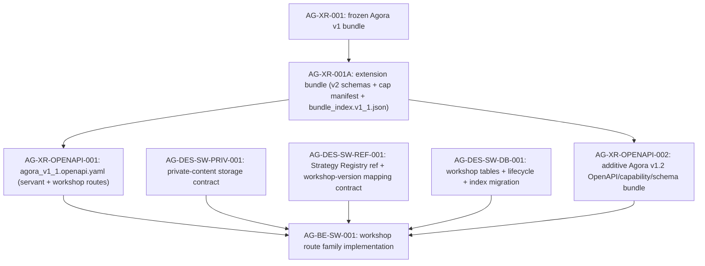

# AG-DES-SW-REF-001 Sidecar Acceptance Packet

- Parent task: `AG-DES-SW-REF-001` — Strategy Registry reference and workshop-version mapping contract
- Helper task: `AG-DES-SW-REF-001-SIDECAR-ACCEPTANCE`
- Helper kind: `acceptance_packet`
- Owner: `Claude`
- Reviewer: `Claude2`
- Prepared: `2026-06-21`
- Mutates canonical truth: `no`

This is a support artifact only. It does not implement the Strategy Registry
reference contract, modify frozen AG-XR-001 specs, write schema files, or
change runtime / registry / governance behavior.

## Purpose

`AG-DES-SW-REF-001` is a design/contract task that must produce a formal
document defining how the Agora Workshop layer references the Strategy
Registry. It is one of four prerequisites that must merge before
`AG-BE-SW-001` can begin implementation:

```text
AG-DES-SW-PRIV-001  private-content storage, encryption, retention and redaction contract
AG-DES-SW-REF-001   Strategy Registry reference and workshop-version mapping contract  ← this task
AG-DES-SW-DB-001    workshop tables, lifecycle alignment and exact index migration
AG-XR-OPENAPI-002   additive Agora v1.2 OpenAPI/capability/schema bundle
```

This packet gives the parent owner and reviewer an acceptance checklist,
a current-state gap analysis, and a dependency map so that the contract
document produced by `AG-DES-SW-REF-001` is self-consistent with:

- the frozen AG-XR-001/AG-XR-001A bundle and v1.1 OpenAPI seed;
- the persistence schema decided in `AG-BE-SW-001_deep_design_closure_2026-06-21.md §5–§7`;
- the Strategy Registry lifecycle already implemented in `services/registry/models.py`.

## Sources Read

| Source | Evidence used |
|---|---|
| `AI_COLLABORATION_GUIDE.md` | Sidecar lifecycle, status commands, support-only workflow rules. |
| `ai-status.json` | Confirms owner Claude, reviewer Claude2, status `in_progress`, sidecar kind `acceptance_packet`, `mutates_canonical: false`. |
| `.orchestrator/task-briefs/ag_des_sw_ref_001_sidecar_acceptance.md` | Confirms helper prepares acceptance packet + dependency map; does not change canonical truth. |
| `docs/04/pantheon_agora_cross_repo_2026-06-20/sw001-deep-closure/AG-BE-SW-001_deep_design_closure_2026-06-21.md` | Authority for all design decisions in this packet — §2 (architecture decisions), §5 (StrategySpec reference mapping), §7 (persistence schema), §10 (acceptance tests), §11 (required artifacts), §12 (task ownership). |
| `docs/04/pantheon_agora_cross_repo_2026-06-20/contract-closure/03_servant_and_workshop_contracts.md` | Workshop persistence field list (lines 88–128); confirms `strategy_id` and `active_strategy_spec_registry_id` on session; original `selected_version_id` ambiguity. |
| `docs/04/pantheon_agora_cross_repo_2026-06-20/contract-closure/agora_openapi_extension_v1_1.yaml` | Shows `WorkshopCreateRequest.strategy_spec_ref: {type: string}` (line 62) — the ambiguous field that §5.5 of the design closure must resolve. |
| `docs/04/pantheon_agora_cross_repo_2026-06-20/contract-closure/07_dispatch_unblock_matrix_v2.md` | Confirms `AG-BE-SW-001` is STOP until all four design/contract tasks merge; execution order. |
| `services/control-plane/specs/agora/strategy_workshop.schema.json` | Existing v1 schema; uses an opaque `subject.ref` string — does not yet capture `strategy_id` / `strategy_spec_registry_id` split; confirms §5 gap. |
| `services/control-plane/specs/agora/bundle_index.v1_1.json` | Extension bundle from AG-XR-001A; no v3 schema hashes yet; confirms additive path only. |
| `services/registry/models.py` | Canonical `ArtifactState` and `ArtifactType` enums; `STRATEGY_SPEC` artifact type present; confirms Registry lifecycle is separately governed. |
| `support/sidecars/AG-XR-OPENAPI-001/AG-XR-OPENAPI-001-SIDECAR-ACCEPTANCE.md` | Structural template; confirms AG-XR-001A is done and frozen. |

`current-work.md` and the full `ai-activity-log.jsonl` were not read.

## Current Repository Observation

### Already delivered (AG-XR-001 and AG-XR-001A — frozen)

| Artifact | Path | Status |
|---|---|---|
| V1 base schema bundle | `services/control-plane/specs/agora/*.schema.json` | Frozen ✓ |
| V1 bundle index | `services/control-plane/specs/agora/bundle_index.json` | Frozen ✓ |
| V1 OpenAPI | `services/control-plane/openapi/agora_v1.openapi.yaml` | Frozen ✓ |
| Extension bundle index | `services/control-plane/specs/agora/bundle_index.v1_1.json` | Frozen ✓ |
| Capability manifest v1.1 | `services/control-plane/specs/agora/v2/capability_manifest_v1_1.json` | Frozen ✓ |

### Gaps that AG-DES-SW-REF-001 must close

| Gap | Evidence | Responsible |
|---|---|---|
| `WorkshopCreateRequest.strategy_spec_ref` is an untyped string | v1.1 OpenAPI seed line 62 | AG-DES-SW-REF-001 must define canonical replacement (`strategy_ref` object with `strategy_id` + `strategy_spec_registry_id`); v1.2 OpenAPI must mark `strategy_spec_ref` deprecated |
| `strategy_workshop.schema.json` uses `subject.ref` — opaque, no Registry mapping | Existing schema | AG-DES-SW-REF-001 must define the canonical identity model and which fields map to what |
| `strategy_workshop_version_link` table and its semantics are not documented anywhere | Absence in all existing schemas and specs | AG-DES-SW-REF-001 must produce this mapping contract |
| Conclude semantics — whether it promotes StrategySpec lifecycle — is undocumented in any schema | Existing schemas | AG-DES-SW-REF-001 must state that conclude does NOT promote the Registry lifecycle |
| `selected_version_id` in `03_servant_and_workshop_contracts.md` line 102 conflicts with the deep closure definition of `active_workshop_version_id` | Line 102 vs §7.1 of closure doc | AG-DES-SW-REF-001 must resolve this field-name conflict |

## Contract Requirements Summary

The following requirements are derived from `§5` of the deep design closure
and are what `AG-DES-SW-REF-001` must formally document. The parent task
must not invent alternatives — any deviation requires a new design review.

### R1 — Canonical identity model

Three identifiers must be defined with distinct semantics:

```text
strategy_id
  Stable strategy identity. Does not change across draft revisions.
  May be NULL for a free-form workshop that has not yet created a strategy.

strategy_spec_registry_id
  Immutable version record ID in the Strategy Registry.
  Points to one specific StrategySpec version (draft, candidate, approved, retired).
  Owned by the Registry, not the Workshop.

active_strategy_spec_registry_id
  Workshop's pointer to the currently selected Registry version.
  Stored on `strategy_workshop_session`, updated only by the version-select operation.
  NULL if no strategy version has been linked.
```

### R2 — Strategy-backed workshop creation path

When `strategy_ref` is supplied in `WorkshopCreateRequest`:

1. BFF reads the Strategy Registry record by `strategy_spec_registry_id`.
2. Verifies tenant/user scope; record must be visible to the requesting user.
3. If `strategy_id` is also supplied, verifies `record.strategy_id == request.strategy_id`; mismatch → `409 STRATEGY_REFERENCE_MISMATCH`.
4. Workshop stores only `strategy_id` and `active_strategy_spec_registry_id` — no StrategySpec JSON is copied.
5. Missing or unauthorized record → `404 STRATEGY_REFERENCE_NOT_FOUND` (no existence leak to unauthorized caller).

### R3 — Free-form workshop creation path

When no `strategy_ref` is supplied:

```text
strategy_id = NULL
active_strategy_spec_registry_id = NULL
```

When the operator's first accepted strategy version is ready:

1. Call Strategy Registry draft-create path.
2. Receive `strategy_id` (new or existing) and immutable `strategy_spec_registry_id`.
3. Insert a `strategy_workshop_version_link` record.
4. Update `strategy_workshop_session.active_strategy_spec_registry_id` and `active_workshop_version_id` atomically with the version link insert.

### R4 — Workshop version link semantics

`strategy_workshop_version_link` is a link record — NOT a copied StrategySpec document.

Required fields:

```text
workshop_version_id             text PK
workshop_id                     text NOT NULL FK → strategy_workshop_session
strategy_id                     text NOT NULL
strategy_spec_registry_id       text NOT NULL
parent_workshop_version_id      text NULL
source_event_id                 text NULL
sequence_no                     bigint NOT NULL
created_by                      text NOT NULL
created_at                      timestamptz NOT NULL
```

Uniqueness constraints:

```sql
UNIQUE (workshop_id, sequence_no)
UNIQUE (workshop_id, strategy_spec_registry_id)
```

The second constraint prevents duplicate links to the same Registry version
within one workshop.

### R5 — Ambiguous field resolution

The contract document must resolve these existing conflicts:

| Ambiguous field | Resolution |
|---|---|
| `strategy_spec_ref` (v1.1 seed) | Deprecated alias for `strategy_spec_registry_id`. v1.2 marks it deprecated; treat as `strategy_spec_registry_id` when supplied without `strategy_id`. |
| `selected_version_id` (v1 schema / contract doc line 102) | Response alias for the active `workshop_version_id`. Do NOT introduce a new StrategySpec truth column. The authoritative pointer is `active_strategy_spec_registry_id` on the session. |
| `active_strategy_spec_registry_id` | Authoritative Registry pointer on the session; set on creation or on version-select. |

### R6 — Conclude semantics

Conclude requires that `active_workshop_version_id` is non-NULL
(at least one strategy version must have been linked).

The Workshop records:

```text
final_workshop_version_id         → links to the last selected workshop_version
final_strategy_spec_registry_id   → copied from that link record
concluded_at                      → timestamp
```

**Conclude does not change the StrategySpec lifecycle state in the Registry.**
Registry/governance retains exclusive control over `draft → candidate → approved → retired`.
The contract must state this explicitly so that AG-BE-SW-001 does not implement
an unauthorized lifecycle promotion.

### R7 — No parallel StrategySpec store

Workshop persistence must not copy or shadow StrategySpec JSON. The contract
must re-state §2.1 of the design closure as a positive prohibition:

```text
MUST NOT store: StrategySpec JSON body, StrategySpec lifecycle state,
                ExperimentRun truth, CandidateArtifact truth.
MUST store:     strategy_id (FK by convention), strategy_spec_registry_id (link pointer),
                workshop_version sequence.
```

## Parent Acceptance Checklist

| # | Check | Expected parent evidence | Sidecar stance |
|---|---|---|---|
| 1 | Contract document exists | File at a declared canonical path (suggested: `services/control-plane/specs/agora/v3/strategy_registry_ref_contract.md`) | Parent implementation |
| 2 | Three identifiers defined | `strategy_id`, `strategy_spec_registry_id`, `active_strategy_spec_registry_id` each have a distinct definition with explicit NULL semantics | Required |
| 3 | Strategy-backed creation path specified | Resolution sequence from R2 is documented verbatim or equivalent | Required |
| 4 | Free-form creation path specified | Both the initial NULL state and the first-version-link sequence from R3 are documented | Required |
| 5 | `strategy_workshop_version_link` schema | All fields and both UNIQUE constraints from R4 are present | Required (this is the primary new artifact) |
| 6 | `strategy_spec_ref` deprecated | Deprecation declared; mapping to `strategy_spec_registry_id` defined | Required before v1.2 OpenAPI can be authored |
| 7 | `selected_version_id` resolved | Field-name resolution from R5 is documented; no second StrategySpec column is introduced | Required |
| 8 | Conclude semantics documented | R6 requirements: `final_workshop_version_id`, `final_strategy_spec_registry_id`, `concluded_at`, and the prohibition on lifecycle promotion | Required |
| 9 | No-parallel-store prohibition | R7 prohibition is stated explicitly | Required |
| 10 | Error codes defined | `STRATEGY_REFERENCE_MISMATCH (409)` and `STRATEGY_REFERENCE_NOT_FOUND (404)` are named and their trigger conditions defined | Required |
| 11 | No canonical files modified | `bundle_index.json`, `bundle_index.v1_1.json`, all frozen v1/v2 schemas, and `agora_v1.openapi.yaml` are untouched | Reviewer must reject violations |
| 12 | No Registry lifecycle authority claimed | Contract does not grant the Workshop the right to approve, retire, or promote a StrategySpec | Reviewer must reject violations |
| 13 | No broker/capital/RuntimeBinding authority | No field or operation in the contract implies live-order routing, capital binding, or RuntimeBinding writes | Reviewer must reject violations |

## Acceptance Tests Reference

The following test cases from §10 of the design closure document must be
referenced in the contract document as acceptance criteria for AG-BE-SW-001.
The contract document does not need to implement them — it only needs to name
and specify them so that the AG-BE-SW-001 implementer can derive test code.

### Strategy references (from §10 of design closure)

| Test case | What it verifies |
|---|---|
| Existing Registry draft resolves to one stable `strategy_id` | R2: BFF reads the Registry and gets a consistent `strategy_id` back |
| Mismatched `strategy_id` and `strategy_spec_registry_id` fails with 409 | R2 step 3: STRATEGY_REFERENCE_MISMATCH is enforced |
| Free-form workshop creates no duplicate StrategySpec | R3: `strategy_id` is NULL; no Registry call is made on creation |
| First accepted version creates one Registry draft and one workshop-version link | R3: single atomic operation; no duplicate links |
| Version selection changes only pointers | R4 + R5: only `active_strategy_spec_registry_id` and `active_workshop_version_id` change; no data copied |
| Conclude records final refs but does not approve/promote the strategy | R6: Registry lifecycle is unchanged; only workshop fields are written |

## Dependency Map



Durable interpretation:

- `AG-XR-001A` is done and frozen; its bundle index must not be modified.
- `AG-DES-SW-REF-001` is a **design/contract-only** task. It produces prose and
  schema definitions. It does not produce runtime code.
- All four design tasks (`PRIV-001`, `REF-001`, `DB-001`, `OPENAPI-002`) are
  parallel to each other — no strict ordering among them.
- `AG-BE-SW-001` is a hard gate: it may not begin implementation until all four
  design tasks are merged into `dev`.
- `AG-DES-SW-REF-001` does NOT depend on `AG-DES-SW-PRIV-001` or
  `AG-DES-SW-DB-001` — the three design tasks are independent and can be
  executed concurrently.
- The task assignment correction from §12 of the design closure (owner Claude,
  reviewer Codex) applies to `AG-BE-SW-001`, not to this design task.

## Contract Document Suggested Structure

The parent task owner may use the following structure as a starting point for
the contract document. Final structure is at the owner's discretion.

```text
# AG-DES-SW-REF-001: Strategy Registry Reference and Workshop-Version Mapping Contract

## 1. Canonical identity model
   1.1 strategy_id
   1.2 strategy_spec_registry_id
   1.3 active_strategy_spec_registry_id

## 2. Workshop creation from existing strategy
   2.1 BFF resolution sequence
   2.2 Verification guards
   2.3 Storage invariants
   2.4 Error codes

## 3. Free-form workshop creation
   3.1 Initial state (NULL fields)
   3.2 First strategy version link sequence

## 4. Workshop version link schema
   4.1 Field definitions
   4.2 Uniqueness constraints
   4.3 Immutability guarantee

## 5. Field disambiguation
   5.1 strategy_spec_ref → deprecated
   5.2 selected_version_id → response alias
   5.3 active_strategy_spec_registry_id → authoritative pointer

## 6. Conclude semantics
   6.1 Precondition (non-NULL version link)
   6.2 Fields written
   6.3 Prohibition on lifecycle promotion

## 7. No-parallel-store prohibition

## 8. Error codes
   STRATEGY_REFERENCE_MISMATCH (409)
   STRATEGY_REFERENCE_NOT_FOUND (404)
   WORKSHOP_VERSION_REQUIRED (409)

## 9. Acceptance test references
```

## Reviewer Questions For Claude2

| Question | Expected reviewer stance |
|---|---|
| Does this packet preserve the support-only boundary? | Approve only if no canonical specs, OpenAPI, capability files, runtime code, or Registry/governance implementation were edited. |
| Is the three-identifier model correctly derived from §5.1 of the design closure? | Approve if `strategy_id`, `strategy_spec_registry_id`, and `active_strategy_spec_registry_id` match §5.1 exactly with no invented fourth identifier. |
| Is the no-parallel-store prohibition correctly stated? | Approve only if R7 explicitly prohibits copying StrategySpec JSON into Workshop tables. |
| Is the conclude prohibition on lifecycle promotion correctly derived? | Approve if R6 explicitly states that conclude does not modify Registry lifecycle (draft/candidate/approved/retired). |
| Is the `strategy_spec_ref` deprecation path correct? | Approve only if the packet maps `strategy_spec_ref` to `strategy_spec_registry_id` (not to `strategy_id`) and marks it deprecated. |
| Is the `strategy_workshop_version_link` schema correct? | Approve if all R4 fields are present, including `parent_workshop_version_id` and `source_event_id`, with both UNIQUE constraints. |
| Does the dependency map correctly show AG-DES-SW-REF-001 as parallel (not sequential) to the other design tasks? | Approve if there is no false ordering between PRIV-001, REF-001, and DB-001. |
| Is broker/capital/RuntimeBinding authority excluded? | Approve only if no field or operation in the checklist could be interpreted as implying live-order routing, capital binding, or RuntimeBinding writes. |

## Suggested Handoff

If this packet is acceptable, reviewer `Claude2` can treat it as the support
acceptance and dependency map for `AG-DES-SW-REF-001-SIDECAR-ACCEPTANCE`.

Recommended status handoff message:

```text
Support packet ready for AG-DES-SW-REF-001: acceptance checklist and
dependency map are in
support/sidecars/AG-DES-SW-REF-001/AG-DES-SW-REF-001-SIDECAR-ACCEPTANCE.md.
The packet captures all five design gaps, the canonical identity model,
the workshop-version link schema, conclude prohibitions, and field
disambiguations derived from the deep design closure. No canonical truth
was changed. Parent task owner can use this as the specification checklist
for the contract document they must produce.
```

## Verification

Commands run while preparing this packet:

```bash
git branch --show-current
git status --short
AI_NAME=Claude python3 scripts/ai_status.py show AG-DES-SW-REF-001-SIDECAR-ACCEPTANCE
ls services/control-plane/specs/agora/
ls services/control-plane/specs/agora/v2/
grep -n "strategy_spec_ref" docs/04/pantheon_agora_cross_repo_2026-06-20/contract-closure/agora_openapi_extension_v1_1.yaml
grep -n "strategy_id\|active_strategy_spec_registry_id" docs/04/pantheon_agora_cross_repo_2026-06-20/contract-closure/03_servant_and_workshop_contracts.md
cat services/control-plane/specs/agora/strategy_workshop.schema.json | python3 -m json.tool | grep -A 5 '"subject"'
cat services/registry/models.py | head -80
```

Results:

- `git branch --show-current`: `task/AG-DES-SW-REF-001-SIDECAR-ACCEPTANCE` — correct branch.
- `git status --short`: only `?? .orchestrator/task-briefs/ag_des_sw_ref_001_sidecar_acceptance.md` untracked at start — no dirty canonical files.
- Task status: `in_progress`, owner `Claude`, reviewer `Claude2` — confirmed.
- `ls services/control-plane/specs/agora/v2/`: 5 files present and hashed by AG-XR-001A — no v3 dir yet.
- `strategy_spec_ref` appears at line 62 of the v1.1 OpenAPI seed as an untyped string — confirmed ambiguity.
- `strategy_id` and `active_strategy_spec_registry_id` appear in `03_servant_and_workshop_contracts.md` at lines 100–101 — confirmed existing session fields.
- `strategy_workshop.schema.json` uses `subject.ref` (opaque) — no `strategy_id` / `strategy_spec_registry_id` split — confirmed gap.
- `services/registry/models.py` defines `ArtifactType.STRATEGY_SPEC` and `ArtifactState` enum — Registry lifecycle is separately governed.

## Sidecar Completion Criteria

This sidecar is ready for review when:

- this support packet exists at `support/sidecars/AG-DES-SW-REF-001/AG-DES-SW-REF-001-SIDECAR-ACCEPTANCE.md`;
- it documents the five identified gaps between current schemas and the design closure requirements;
- it provides the complete acceptance checklist for the contract document the parent task must produce;
- it maps the dependency and unblock chain without broadening scope;
- it preserves the "no canonical truth changes" sidecar boundary;
- it is handed off to `Claude2` for review.
