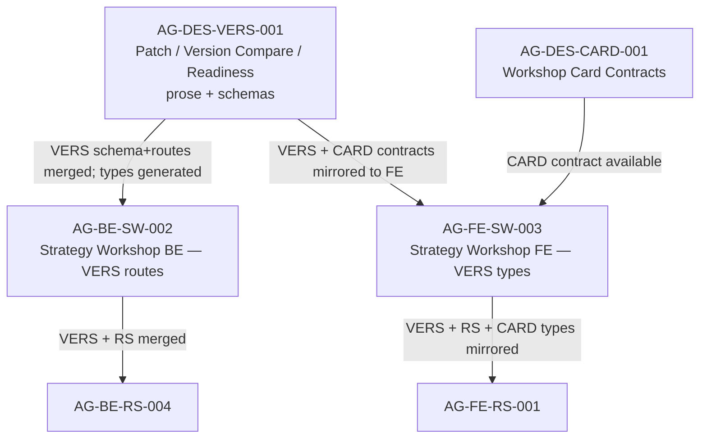

# AG-DES-VERS-001 Sidecar Acceptance Packet

**Sidecar task:** `AG-DES-VERS-001-SIDECAR-ACCEPTANCE`  
**Helper parent:** `AG-DES-VERS-001`  
**Helper kind:** `acceptance_packet`  
**Parent deliverable:** Patch/version compare/readiness prose + schemas (Agora v1.3 design closure, section A)  
**Parent owner lane:** system design  
**Parent reviewer:** `Codex`  
**Sidecar owner:** `Claude`  
**Sidecar reviewer:** `Claude2`  
**Date:** `2026-06-21`  
**Status:** `in_progress — ready for sidecar review`

> Scope constraint: support artifact only. This packet summarises the
> acceptance checklist, dependency map, and reviewer attention points for
> `AG-DES-VERS-001`. It does not modify canonical truth, L1 policy, runtime
> code, registry code, governance implementation, BFF implementation, or
> any schema under `services/control-plane/specs/agora/`.

---

## 1. Executive Summary

`AG-DES-VERS-001` is the system-design task that closes Round 2 gap **A —
Strategy Versioning / Patch / Readiness**. Its deliverables are:

1. Prose contract — `docs/04/pantheon_agora_cross_repo_2026-06-20/design-closure-round2/01_strategy_versioning_patch_readiness.md`
2. Three JSON schemas targeting `services/control-plane/specs/agora/v4/`:
   - `version_patch_proposal.schema.json`
   - `version_compare.schema.json`
   - `strategy_readiness.schema.json`
3. Nine BFF API routes described in `08_openapi_v1_3_delta.yaml` and referenced in `agora_v1_3.openapi.yaml`

The design decision: use **restricted RFC 6902 JSON Patch** (add / remove / replace / test only; move/copy forbidden) to propose new immutable `StrategySpec` drafts from a workshop-selected Registry version. No Registry row is mutated in place.

Two downstream execution tasks — `AG-BE-SW-002` and `AG-FE-SW-003` — remain
blocked until the AG-DES-VERS-001 schemas and routes are merged into `dev` and generated types are available.

---

## 2. Sources Used

| Source | Role |
|---|---|
| `docs/04/pantheon_agora_cross_repo_2026-06-20/design-closure-round2/01_strategy_versioning_patch_readiness.md` | Canonical prose contract for patch grammar, lifecycle, API, readiness gates, error codes |
| `docs/04/pantheon_agora_cross_repo_2026-06-20/design-closure-round2/07_dispatch_unblock_matrix.md` | Downstream dependency matrix and dispatch rules |
| `docs/04/pantheon_agora_cross_repo_2026-06-20/design-closure-round2/08_openapi_v1_3_delta.yaml` | OpenAPI routes for patch-proposals, version-comparisons, readiness |
| `docs/04/pantheon_agora_cross_repo_2026-06-20/design-closure-round2/schemas/version_patch_proposal.schema.json` | JSON Schema draft-07 for `VersionPatchProposal` |
| `docs/04/pantheon_agora_cross_repo_2026-06-20/design-closure-round2/schemas/version_compare.schema.json` | JSON Schema draft-07 for `VersionCompare` |
| `docs/04/pantheon_agora_cross_repo_2026-06-20/design-closure-round2/schemas/strategy_readiness.schema.json` | JSON Schema draft-07 for `StrategyReadinessAssessment` |
| `docs/04/pantheon_agora_cross_repo_2026-06-20/design-closure-round2/INDEX.md` | Round 2 bundle overview and mandatory bundle rule |

---

## 3. Deliverable Inventory

### 3.1 Prose Contract

File: `01_strategy_versioning_patch_readiness.md`

Sections that must be present and internally consistent for acceptance:

| Section | Content |
|---|---|
| A1 | Ownership — Registry owns immutable versions; Workshop owns proposals and readiness |
| A2 | Patch grammar — RFC 6902 restricted; allowed/forbidden ops and allowed/forbidden StrategySpec paths |
| A3 | `VersionPatchProposal` lifecycle state machine (draft → validating → validated → accepted/rejected/superseded) and 10-step validation sequence |
| A4 | API route catalog (9 routes) |
| A5 | Version comparison — up to 4 candidates, evidence class taxonomy, decision-authority rule |
| A6 | Readiness gate definitions — Gate 1 (`preliminary_research`, 8 criteria), Gate 2 (`full_validation`, 10 criteria), Gate 3 (`trading_room`, 10 criteria) |
| A7 | Staleness triggers for a previously ready gate |
| A8 | Error code catalogue (9 codes) |

### 3.2 JSON Schemas

All three schemas target `services/control-plane/specs/agora/v4/` and use `$schema: http://json-schema.org/draft-07/schema#`.

| Schema file | Key required fields | Constraints to verify |
|---|---|---|
| `version_patch_proposal.schema.json` | `proposal_id` (prefix `vpp_`), `base_document_sha256` (64-char hex), `operations` (array of RFC 6902 ops), `status` (enum) | `move`/`copy` ops absent from allowed enum; `patch_format` must be `rfc6902_restricted`; `patch_format` and `status` enums consistent with A3 lifecycle |
| `version_compare.schema.json` | `comparison_id` (prefix `vcmp_`), `base_version`, `candidate_versions` (1–4 items), `metric_diffs` with `evidence_class` enum | `evidence_class` enum must match four values from A5: `predicted`, `backtested_in_sample`, `backtested_oos`, `paper_observed`; `decision_authority: trader` is the only allowed value |
| `strategy_readiness.schema.json` | `assessment_id` (prefix `ready_`), `gates` (exactly 3 items), `highest_ready_gate` (nullable enum) | Gate IDs must be `preliminary_research`, `full_validation`, `trading_room`; gate status enum must include `not_assessed`, `blocked`, `conditional`, `ready`, `stale`; `conditional` meaning must be narrower than `ready` |

### 3.3 API Routes

Nine routes in the OpenAPI v1.3 delta — all scoped to `workshops/{workshop_id}`:

| Method | Path suffix | Operation ID | Required request headers |
|---|---|---|---|
| GET | `/patch-proposals` | `listWorkshopPatchProposals` | — |
| POST | `/patch-proposals` | `createWorkshopPatchProposal` | `If-Match`, `Idempotency-Key`, `X-Request-Id` |
| GET | `/patch-proposals/{proposal_id}` | `getWorkshopPatchProposal` | — |
| POST | `/patch-proposals/{proposal_id}/validate` | `validateWorkshopPatchProposal` | `If-Match`, `Idempotency-Key`, `X-Request-Id` |
| POST | `/patch-proposals/{proposal_id}/accept` | `acceptWorkshopPatchProposal` | `If-Match`, `Idempotency-Key`, `X-Request-Id` |
| POST | `/patch-proposals/{proposal_id}/reject` | `rejectWorkshopPatchProposal` | `If-Match`, `Idempotency-Key`, `X-Request-Id` |
| POST | `/version-comparisons` | `createWorkshopVersionComparison` | `If-Match`, `Idempotency-Key`, `X-Request-Id` |
| GET | `/readiness` | `getWorkshopReadiness` | — |
| POST | `/readiness/reassess` | `reassessWorkshopReadiness` | `If-Match`, `Idempotency-Key`, `X-Request-Id` |

---

## 4. Acceptance Checklist

For the parent reviewer (`Codex`) to check when reviewing AG-DES-VERS-001.

| # | Criterion | Rationale / Spec Ref | Check Rule |
|---|---|---|---|
| A-01 | Patch grammar uses restricted RFC 6902 | A2 prose | `move` and `copy` are absent from the `operations` items' `op` enum in `version_patch_proposal.schema.json` |
| A-02 | Immutable StrategySpec paths are protected | A2 prose | `/spec_version`, `/strategy_id`, `/lifecycle_state`, `/provenance` are not in the allowed-paths list in the schema or prose |
| A-03 | `base_document_sha256` is enforced | A3 validation step 2 | Schema `base_document_sha256` pattern is `^[a-f0-9]{64}$`; every write command requires `If-Match` |
| A-04 | Proposal lifecycle is complete | A3 state machine | All six terminal/non-terminal states — `draft`, `validating`, `validated`, `accepted`, `rejected`, `superseded` — present in schema `status` enum and prose diagram |
| A-05 | Version comparison caps candidates at 4 | A5 prose | `candidate_versions.maxItems: 4` in schema |
| A-06 | Evidence class taxonomy is correct | A5 prose | Exactly four `evidence_class` values in schema: `predicted`, `backtested_in_sample`, `backtested_oos`, `paper_observed` |
| A-07 | `decision_authority` is always `trader` | A5 prose ("The servant may recommend, but decision_authority is always trader") | Schema field `decision_authority` is a const or single-value enum `trader` |
| A-08 | Three gates present with correct IDs | A6 prose | `gates.minItems/maxItems: 3`; gate IDs are exactly `preliminary_research`, `full_validation`, `trading_room` |
| A-09 | `conditional` is a distinct gate state | A6 prose ("conditional permits only the next explicitly allowed lower-risk activity") | `conditional` is present in gate `status` enum and is not aliased to `ready` |
| A-10 | Gate 3 (`trading_room`) requires `full_validation` ready | A6 TR-01 | Either enforced in prose or schema dependency note |
| A-11 | Staleness triggers are enumerated | A7 prose | At minimum: active StrategySpec version change, required research artifact superseded, risk policy change, dataset stale/unavailable, dashboard recipe version mismatch, incident open |
| A-12 | Error codes match prose catalogue | A8 prose | `PATCH_PATH_FORBIDDEN`, `PATCH_BASE_HASH_MISMATCH`, `PATCH_RESULT_SCHEMA_INVALID`, `PATCH_POLICY_INVALID`, `PATCH_PROPOSAL_NOT_VALIDATED`, `VERSION_COMPARE_LIMIT_EXCEEDED`, `READINESS_HARD_BLOCKER`, `READINESS_STALE`, `REGISTRY_VERSION_MISMATCH` are all referenceable from the route error responses |
| A-13 | Schemas land in `v4/` only | INDEX.md bundle rule | Target path prefix is `services/control-plane/specs/agora/v4/`; no edit to `v1/`, `v2/`, `v3/`, or prior bundle indexes |
| A-14 | `agora_v1_3.openapi.yaml` delta adds nine routes | A4 prose | All nine operation IDs from §3.3 above are present in `08_openapi_v1_3_delta.yaml` |
| A-15 | No mutation of prior bundle indexes | INDEX.md bundle rule | `bundle_index.json`, `bundle_index.v1_1.json`, `bundle_index.v1_2.json` are unmodified |

---

## 5. Dependency Map

### 5.1 Upstream dependencies

AG-DES-VERS-001 does not depend on other AGORA Round 2 design tasks. It is an independent system-design deliverable drawing only on:

- The frozen v1.2 contract state (`agora_v1_2.openapi.yaml`, `bundle_index.v1_2.json`)
- The Round 2 gap inventory and design decision packet (`MASTER_SD_RESPONSE.md`, `INDEX.md`)

### 5.2 Downstream unblock conditions



### 5.3 Dispatch rule citation

Per `07_dispatch_unblock_matrix.md`:

> No downstream task should cite a section number that exists only in a
> planning brief. It must cite a merged prose contract path, a merged
> schema/OpenAPI path, the v1.3 bundle hash, or generated frontend contract
> commit when relevant.

The parent owner must confirm the exact merged prose/schema paths before
closing AG-DES-VERS-001, so downstream tasks can cite durable paths.

---

## 6. Suggested Parent Review and Verification Plan

The parent owner (system design lane) should perform these steps before
requesting reviewer sign-off from Codex.

### 6.1 Schema self-consistency check

```bash
# Confirm all three schemas validate as legal JSON
python3 -c "import json; [json.load(open(f)) for f in [
  'docs/04/pantheon_agora_cross_repo_2026-06-20/design-closure-round2/schemas/version_patch_proposal.schema.json',
  'docs/04/pantheon_agora_cross_repo_2026-06-20/design-closure-round2/schemas/version_compare.schema.json',
  'docs/04/pantheon_agora_cross_repo_2026-06-20/design-closure-round2/schemas/strategy_readiness.schema.json',
]]; print('OK')"
```

### 6.2 Prose / schema alignment spot-checks

1. Open `version_patch_proposal.schema.json` and confirm `op` enum does not contain `move` or `copy`.
2. Open `version_compare.schema.json` and confirm `candidate_versions.maxItems` is `4`.
3. Open `strategy_readiness.schema.json` and confirm `gates.minItems` and `gates.maxItems` are both `3`.
4. Confirm `evidence_class` enum in `version_compare.schema.json` has exactly the four values from A5.

### 6.3 OpenAPI route presence check

```bash
grep -c "operationId:" \
  docs/04/pantheon_agora_cross_repo_2026-06-20/design-closure-round2/08_openapi_v1_3_delta.yaml
# Expected: >= 9 (nine VERS routes; other sections may add more)
```

### 6.4 Bundle index immutability check

```bash
# Confirm prior bundle indexes are unmodified from dev HEAD
git diff dev -- \
  services/control-plane/specs/agora/bundle_index.json \
  services/control-plane/specs/agora/bundle_index.v1_1.json \
  services/control-plane/specs/agora/bundle_index.v1_2.json
# Expected: empty diff (no changes)
```

### 6.5 Merge target confirmation

Confirm that the three schema files and `agora_v1_3.openapi.yaml` are
staged/committed under their canonical repo targets (see `INDEX.md`):

```text
services/control-plane/specs/agora/v4/version_patch_proposal.schema.json
services/control-plane/specs/agora/v4/version_compare.schema.json
services/control-plane/specs/agora/v4/strategy_readiness.schema.json
services/control-plane/openapi/agora_v1_3.openapi.yaml
```

---

## 7. Attention Items for Reviewer (Codex)

| # | Item | Why it matters |
|---|---|---|
| R-01 | Confirm `decision_authority: trader` is a schema-level enforcement, not only a prose note | If omitted from the schema, the servant could silently recommend a version as final without a trader gate |
| R-02 | Confirm `conditional` gate state has explicit meaning — it must not allow Trading Room entry | `conditional` on Gate 1 is safe; `conditional` on Gate 3 must not satisfy TR-01 |
| R-03 | Confirm that the `accept` route creates a new Registry draft and links it to the Workshop — not just a status flip on the proposal | A3 step 9–10 prose must map to the route's response shape |
| R-04 | Confirm error codes are referenceable from the OpenAPI response schemas, not only listed in prose | Downstream BFF implementors need machine-readable error codes |
| R-05 | Confirm the v1.3 bundle generation note is explicit: `bundle_index.v1_3.json` must be generated after merge, not copied from the design package | INDEX.md mandatory bundle rule |

---

## 8. Support-Only Boundary Confirmation

- No L1 canonical policy or architecture document has been edited or superseded.
- No main runtime, registry, BFF router, governance implementation, or frontend code has been changed.
- No schema file under `services/control-plane/specs/agora/` has been created or modified by this sidecar.
- The only artifact produced by this sidecar task is this file:  
  `support/sidecars/AG-DES-VERS-001/AG-DES-VERS-001-SIDECAR-ACCEPTANCE.md`

---

## 9. Reviewer Approval and Owner Closeout

Sidecar reviewer is `Claude2`. On approval, the sidecar owner (`Claude`) will:

1. Create the task-scoped commit via `worker_commit.py` covering only this sidecar file and the task brief.
2. Push the `task/AG-DES-VERS-001-SIDECAR-ACCEPTANCE` branch and open a PR via `task_finalize.sh`.
3. Wait for the PR to merge into `dev`.
4. Run: `AI_NAME=Claude ./scripts/ai-status.sh done AG-DES-VERS-001-SIDECAR-ACCEPTANCE "Acceptance packet merged; support-only boundary maintained; handoff ready for parent owner review of VERS schemas."`

Closeout verification:
- `AI_NAME=Claude python3 scripts/ai_status.py show AG-DES-VERS-001-SIDECAR-ACCEPTANCE`
- `git diff --check -- support/sidecars/AG-DES-VERS-001/AG-DES-VERS-001-SIDECAR-ACCEPTANCE.md .orchestrator/task-briefs/ag_des_vers_001_sidecar_acceptance.md`

*Prepared by Claude for the AG-DES-VERS-001-SIDECAR-ACCEPTANCE support slice.*
