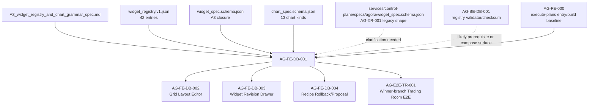

# AG-FE-DB-001 Sidecar Acceptance Follow-up 2

**Sidecar task:** `AG-FE-DB-001-SIDECAR-ACCEPTANCE-FOLLOWUP-2`

**Helper parent:** `AG-FE-DB-001`

**Helper kind:** `acceptance_packet`

**Sidecar owner:** `Codex`

**Sidecar reviewer:** `Codex2`

**Date:** `2026-06-20`

**Status:** review approved; pending owner closeout

Scope constraint: support artifact only. This packet does not change L1
canonical truth, runtime code, frontend implementation, registry code,
governance implementation, or BFF implementation.

---

## 1. Purpose

This follow-up narrows the acceptance surface for `AG-FE-DB-001` after the
first sidecar acceptance packet was archived. It does not reopen that packet.
It records the current implementation blocker and converts the frozen A3
design artifacts into a reviewer-ready checklist for the parent owner.

The key distinction remains:

- A3 design closure says `AG-FE-DB-001` is conceptually unblocked by
  `A3_widget_registry_and_chart_grammar_spec.md`.
- The active parent task remains `blocked` in status, waiting for `Claude2`,
  because the executable source of truth and frontend wiring path are still
  not reproducible from the current repo baseline.

Parent implementation should not start until the active blocker is resolved.

---

## 2. Current State Snapshot

| Item | Observed state | Acceptance implication |
|---|---|---|
| Parent task | `AG-FE-DB-001` is `blocked`, owner `Codex`, reviewer `Claude2`, waiting for `Claude2`. | This sidecar can prepare acceptance material only; it must not unblock implementation by itself. |
| A3 closure artifacts | `docs/04/pantheon_agora_cross_repo_2026-06-20/design-closure/` contains A3 spec, registry, widget schema, and chart schema. | These are the frozen design inputs to check against. |
| Registry JSON shape | `widget_registry.v1.json` top-level keys are `registry_version`, `schema_version`, `created_at`, and `entries`. | Frontend registry work must consume or map `entries`, not a non-existent `widgets` array. |
| Registry size/status | `entries` contains exactly 42 widget entries; no entry has non-`active` status in the current artifact. | Tests should assert exact key coverage and active-only rendering against these 42 entries. |
| Field naming | Registry and schemas use snake_case fields such as `widget_type`, `allowed_chart_kinds`, and `allowed_data_sources`. | Any TypeScript camelCase facade must prove lossless mapping from the source artifact. |
| Existing canonical Agora schema | `services/control-plane/specs/agora/widget_spec.schema.json` is the AG-XR-001-era schema with enum `widget_type` and object `data_source.bff_path`. | Parent must not silently mix this schema with the newer A3 closure schema. Reviewer clarification is required before implementation. |
| Frontend target files | `execute-plans/src/agora/widgets/registry.ts`, `WidgetRenderer.tsx`, and `ChartSpecRenderer.tsx` do not exist in this baseline. | Parent must create a new module only after wiring boundaries are clarified. |
| Chart dependency | `execute-plans/package.json` has no approved chart library dependency. | `ChartSpecRenderer` acceptance cannot assume Recharts, ECharts, D3, Chart.js, Nivo, or Visx. |

---

## 3. Clarifications Needed Before Parent Implementation

`AG-FE-DB-001` should stay blocked until these questions have explicit
reviewer or parent-owner answers:

1. Should the frontend consume A3 closure artifacts directly from
   `docs/04/.../design-closure/`, or must `AG-BE-DB-001` first promote the A3
   registry and schemas into a canonical service bundle with checksum evidence?
2. What is the expected checksum comparison contract between frontend registry,
   backend validator, and OpenClaw `agora-dashboard-compose` skill?
3. Should `execute-plans/src/agora/widgets/` be introduced by this parent task,
   and if so, where should it be wired without inventing routes, pages, layout,
   visual styling, or data fetching behavior?
4. Which chart dependency, if any, is approved for this slice? If none is
   approved, should the first implementation provide only safe structural
   fallbacks plus tests for grammar enforcement?
5. How should the A3 `widget_spec.schema.json` be reconciled with the
   AG-XR-001 `services/control-plane/specs/agora/widget_spec.schema.json`
   without creating a parallel contract or silently overriding canonical files?

---

## 4. Parent Acceptance Delta

The first sidecar packet already covers the broad acceptance checklist. This
follow-up adds these stricter acceptance rules:

| Acceptance item | Parent pass condition |
|---|---|
| Source artifact selection is explicit | Implementation states whether it consumes A3 design-closure artifacts directly or a promoted canonical bundle. No implicit fallback to AG-XR-001 legacy widget schema. |
| Registry shape is exact | Tests prove all 42 `entries[].widget_type` values are represented, with no extra widget types and no dropped entries. |
| Active gate is data-driven | Renderer checks `status: "active"` from the registry entry instead of assuming every known widget is renderable forever. |
| Field mapping is lossless | If frontend types use camelCase, tests prove mapping from snake_case registry/schema fields. |
| Chart grammar is allowlisted | Renderer accepts only the 13 `chart_spec.schema.json` `kind` values and rejects arbitrary HTML, JS, iframes, remote scripts, and custom React component references. |
| Transform grammar is declarative | Renderer parses only the listed transform `type` values and treats transform params as data, not executable code. |
| Interaction grammar is allowlisted | Renderer maps only A3 interaction kinds and explicitly blocks order/capital/runtime-binding actions. |
| Data source boundaries are not invented | Widget specs reference only A3 data source IDs; BFF route/path decisions are delegated to a capability manifest or parent-approved adapter surface. |
| Chart library gap is handled | Parent either uses an approved dependency committed in `execute-plans/package.json` or implements dependency-free graceful fallbacks. |
| Baseline file creation is reviewed | New `execute-plans/src/agora/widgets/*` files are accepted only with tests and without unrelated route/layout/style invention. |

---

## 5. Dependency Map



Dependency notes:

- `AG-FE-000` is the declared parent dependency and provides the
  `execute-plans` app/build baseline.
- `AG-BE-DB-001` is not listed as a formal `depends_on` in the active parent
  status, but A3 requires frontend, backend validator, and OpenClaw skill to use
  one registry version and schema checksum. Parent review should decide whether
  this is a hard dependency or a compose-time verification item.
- Downstream DB tasks should not depend on invented widget types, chart kinds,
  route IDs, or layout semantics from `AG-FE-DB-001`.

---

## 6. Suggested Parent Verification

Once the parent blocker is resolved and implementation begins, the minimum
focused checks should include:

```bash
cd execute-plans
npm run build:agora
npm run test -- src/agora/widgets/
```

Suggested focused test coverage:

- registry coverage against the selected A3/canonical registry source;
- reject unknown, inactive, or sensitivity-mismatched widgets;
- reject unsupported chart kinds, encodings, transform types, and interactions;
- prove forbidden dynamic execution paths are absent;
- prove safe fallback behavior when no chart library is approved;
- prove data source IDs are allowlisted and not converted into invented BFF
  paths inside the renderer.

---

## 7. Sidecar Verification Performed

Commands run for this support packet:

```bash
AI_NAME=Codex ./scripts/ai-status.sh show AG-FE-DB-001
AI_NAME=Codex ./scripts/ai-status.sh show AG-FE-DB-001-SIDECAR-ACCEPTANCE-FOLLOWUP-2
jq '.entries | length' docs/04/pantheon_agora_cross_repo_2026-06-20/design-closure/widget_registry.v1.json
jq -r '.entries[] | select(.status != "active") | [.widget_type, .status] | @tsv' docs/04/pantheon_agora_cross_repo_2026-06-20/design-closure/widget_registry.v1.json
jq '.properties' docs/04/pantheon_agora_cross_repo_2026-06-20/design-closure/widget_spec.schema.json
jq '.properties.kind, .properties.encodings, .properties.transforms' docs/04/pantheon_agora_cross_repo_2026-06-20/design-closure/chart_spec.schema.json
find execute-plans/src -maxdepth 5 \( -name 'registry.ts' -o -name 'WidgetRenderer.tsx' -o -name 'ChartSpecRenderer.tsx' \) -print
rg -n 'recharts|echarts|chart.js|visx|nivo|d3' execute-plans/package.json execute-plans/src -g '*.*'
```

Observed results:

- `AG-FE-DB-001` remains blocked on `Claude2`.
- The follow-up sidecar is `review_approved`, owned by `Codex`, reviewed by
  `Codex2`, and scoped to this file.
- A3 registry has exactly 42 entries and no non-active entries.
- No target widget renderer files exist in the current frontend baseline.
- No approved chart dependency is present in `execute-plans/package.json`.

---

## 8. Reviewer Handoff

Codex2 should review only this sidecar's support obligations:

| Review question | Expected answer |
|---|---|
| Does this packet stay support-only? | Yes; it adds only this sidecar artifact. |
| Does it avoid changing canonical truth or implementation? | Yes; it records gaps and acceptance criteria only. |
| Does it preserve the parent blocker? | Yes; it says implementation must wait for `Claude2` clarification. |
| Does it improve the dependency map beyond the archived first packet? | Yes; it adds exact registry shape/count, schema source conflict, missing frontend files, and chart dependency handling. |

Suggested reviewer command:

```bash
AI_NAME=Codex2 ./scripts/ai-status.sh approve AG-FE-DB-001-SIDECAR-ACCEPTANCE-FOLLOWUP-2 "Review approved: follow-up acceptance packet is support-only, preserves the parent blocker, and clarifies registry shape, schema-source conflict, frontend file baseline, chart dependency gap, and downstream dependency map for AG-FE-DB-001."
```

---

## 9. Owner Closeout Note

Codex2 approved this support packet in `ai-status`. Owner closeout should
publish only this sidecar artifact, keep `AG-FE-DB-001` blocked on `Claude2`,
and run `AI_NAME=Codex ./scripts/ai-status.sh done
AG-FE-DB-001-SIDECAR-ACCEPTANCE-FOLLOWUP-2` only after the task PR merges into
`dev`.
