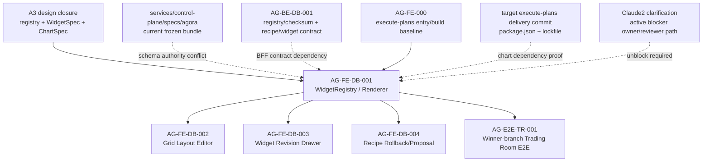

# AG-FE-DB-001 Sidecar Acceptance Follow-up 3

| Field | Value |
|---|---|
| Task ID | `AG-FE-DB-001-SIDECAR-ACCEPTANCE-FOLLOWUP-3` |
| Helper kind | `acceptance_packet` |
| Parent task | `AG-FE-DB-001` - WidgetRegistry/Renderer/ChartRenderer |
| Parent owner / reviewer | `Codex` / `Claude2` |
| Prepared by | `Codex2` |
| Reviewer | `Codex` |
| Date | `2026-06-20` |
| Mutates canonical truth | `false` |
| Status | Review approved; owner closeout addendum recorded |

## Purpose

This support-only packet extends the prior FE acceptance follow-ups after the
approved `AG-BE-DB-001-SIDECAR-BFF-HANDOFF-FOLLOWUP-2` packet. It reconciles
the frontend acceptance packet with the backend handoff packet and records the
remaining dependency and evidence map for the `AG-FE-DB-001` parent owner.

It does not change canonical truth, schema authority, BFF/OpenAPI contracts,
frontend implementation, registry code, renderer code, route wiring, or
governance/runtime behavior.

## Current State Snapshot

| Surface | Observed state | Acceptance consequence |
|---|---|---|
| Parent task | `AG-FE-DB-001` remains `blocked`, owner `Codex`, reviewer `Claude2`, waiting on `Claude2`. | Parent implementation must not resume until the recorded blocker is explicitly resolved. |
| Backend sibling | `AG-BE-DB-001` also remains `blocked`, owner `Claude`, reviewer `Claude2`, waiting on schema/route/storage/concurrency authority. | FE work must not invent BFF paths, registry handshake fields, validation endpoints, or save/update conflict payloads. |
| A3 design closure | A3 is design-frozen and dispatch matrix says `AG-FE-DB-001` is conceptually dispatchable. | This is design readiness only; it does not override active task blockers in `ai-status`. |
| A3 registry | `widget_registry.v1.json` has 42 entries, all `status: active`; 41 use `renderer: chart_spec`, 1 uses `renderer: builtin`. | Tests should assert exact entry coverage, status gating, and renderer-mode handling from the source artifact. |
| A3 chart grammar | `chart_spec.schema.json` allowlists 13 chart kinds, 18 encoding channels, 16 transform types, and 15 interaction kinds. | `ChartSpecRenderer` must reject arbitrary chart kinds, transforms, encodings, and unsafe actions. |
| A3 WidgetSpec | A3 `widget_spec.schema.json` requires `widget_id`, `widget_type`, `title`, `data_source`, `query`, `chart_spec`, `interactions`, `sensitivity`, and `can_export`. | Parent must not silently mix this with the older control-plane WidgetSpec shape. |
| Current frozen bundle | `python3 scripts/agora_schema_bundle.py --verify` passes for the existing `services/control-plane/specs/agora/` bundle. | Passing bundle verification proves the current legacy bundle is internally consistent, not that A3 has been promoted into it. |
| In-repo execute-plans mirror | `execute-plans/package.json` has no chart library dependency and no `src/agora/widgets/` target files. | This mirror still supports the prior dependency-free fallback warning. |
| Active local execute-plans checkout | `/home/lupin/code/execute-plans` has `recharts` `^2.15.4`, but that checkout is `main...origin/main [ahead 2, behind 467]`. It also has no `src/agora/widgets/` target files. | Recharts presence is useful evidence, but not sufficient approval. Parent acceptance must confirm the target delivery commit's `package.json` and lockfile before relying on Recharts. |
| Generated frontend snapshot | In-repo `execute-plans/src/lib/bff-v1/agora/types.ts` and `contract-snapshot.json` point at the current `services/control-plane/specs/agora/` hash set, including the older WidgetSpec hash. | Generated DTOs must be regenerated only from the accepted schema authority, not manually patched or mixed with A3 closure files. |

## Dependency Map



Dependency notes:

- A3 can drive frontend renderer acceptance after the blocker is resolved, but
  it does not by itself define the BFF capability manifest, OpenAPI paths,
  storage authority, or optimistic concurrency contract.
- `AG-BE-DB-001` is a compose-time dependency for checksum parity and recipe
  persistence. FE can build pure renderer primitives only if the parent/reviewer
  explicitly accepts a data-prop-only slice that does not add BFF route helpers.
- The chart dependency question should be evaluated against the actual
  execute-plans branch and commit used for `AG-FE-DB-001`, not the stale in-repo
  mirror or a divergent local checkout alone.

## Parent Acceptance Delta

| Acceptance item | Parent pass condition |
|---|---|
| Active blocker honored | `AG-FE-DB-001` does not start implementation until `Claude2` resolves the status blocker or records an explicit reviewer clarification. |
| Schema authority declared | Parent names whether A3 closure files are consumed directly, promoted into a versioned canonical bundle, or deferred behind `AG-BE-DB-001`; no implicit mixing with the current legacy WidgetSpec. |
| Hash set recorded | Parent records the registry/schema hash set used by frontend tests and compares it with the backend/contract source selected for the task. |
| Registry coverage exact | Tests prove all 42 A3 `entries[].widget_type` values are represented with no extras or omissions. |
| Active gate data-driven | Renderer rejects inactive or unknown widgets through registry data, even though the current A3 file has all entries active. |
| Renderer mode explicit | Builtin and `chart_spec` entries are handled separately; plugin rendering remains out of scope unless explicitly accepted. |
| Chart dependency evidence current | If using Recharts, the parent proves the target execute-plans delivery commit includes the dependency and lockfile. If not, it implements safe dependency-free fallbacks. |
| BFF route restraint | Renderer work does not add unaccepted strict live route helpers for registry, recipe load/save, validation, version history, rollback, or checksum handshake. |
| Data source restraint | `data_source` remains an allowlisted A3 data-source ID; the renderer does not convert it into invented `bff_path` routes. |
| Security gates | No `eval`, `new Function`, `dangerouslySetInnerHTML`, iframe, remote script, arbitrary HTML, custom React component injection, broker action, capital binding, or RuntimeBinding write path is introduced. |
| Interaction allowlist | Only A3 interaction kinds are mapped to approved handlers; unsafe order/capital/runtime actions are blocked. |
| Generated DTO discipline | Frontend generated types are regenerated only from the accepted contract bundle. No hand-edited generated snapshots to bridge schema conflict. |

## Chart Dependency Reconciliation

Prior FE acceptance material warned that no chart dependency was present. The
backend handoff later observed `recharts` in `/home/lupin/code/execute-plans`.
Both statements can be true depending on which checkout is inspected:

| Location | Finding |
|---|---|
| In-repo mirror at this Pantheon worktree, `execute-plans/package.json` | No Recharts/ECharts/Chart.js/Nivo/Visx/D3 dependency found. |
| Active local frontend checkout, `/home/lupin/code/execute-plans/package.json` | `recharts` `^2.15.4` is present. |
| Active local frontend checkout git state | `main...origin/main [ahead 2, behind 467]`, so this checkout is not reliable proof of the current remote delivery baseline without an owner-selected commit. |

Acceptance implication: `AG-FE-DB-001` should not be failed merely because one
older mirror lacks Recharts, and it should not be accepted merely because one
divergent local checkout has Recharts. The parent should record the exact
execute-plans commit used for implementation and test the renderer against that
commit's package metadata.

## Suggested Parent Verification

After the blocker is resolved and the parent implementation exists, the focused
checks should include:

```bash
cd /home/lupin/code/execute-plans
npm run build:agora
npm run test -- src/agora/widgets/
```

Suggested test coverage:

- registry parity against the selected A3 or promoted canonical registry;
- unknown and inactive widget rejection;
- snake_case source artifact to TypeScript facade mapping if camelCase is used;
- all 13 chart kinds accepted only through the allowlist;
- invalid chart kind, encoding channel, transform type, and interaction kind
  rejection;
- forbidden dynamic execution and external script paths absent;
- safe behavior when BFF registry/checksum or data-source catalog is not ready;
- chart dependency behavior against the target package commit.

## Verification Notes For This Packet

Commands run by Codex2:

```bash
AI_NAME=Codex2 ./scripts/ai-status.sh show AG-FE-DB-001-SIDECAR-ACCEPTANCE-FOLLOWUP-3
AI_NAME=Codex2 ./scripts/ai-status.sh show AG-FE-DB-001
AI_NAME=Codex2 ./scripts/ai-status.sh show AG-BE-DB-001
AI_NAME=Codex2 ./scripts/ai-status.sh show AG-FE-DB-001-SIDECAR-ACCEPTANCE-FOLLOWUP-2
jq '{entry_count:(.entries|length), statuses:(.entries|group_by(.status)|map({status:.[0].status,count:length})), renderers:(.entries|group_by(.renderer)|map({renderer:.[0].renderer,count:length})), chart_kinds:([.entries[].allowed_chart_kinds[]]|unique), data_sources:([.entries[].allowed_data_sources[]]|unique|length), interactions:([.entries[].allowed_interactions[]]|unique|length)}' docs/04/pantheon_agora_cross_repo_2026-06-20/design-closure/widget_registry.v1.json
jq '{schema_id: .["$id"], required: .required, properties: (.properties|keys)}' docs/04/pantheon_agora_cross_repo_2026-06-20/design-closure/widget_spec.schema.json
jq '{kind_count:(.properties.kind.enum|length), encoding_count:(.properties.encodings.propertyNames.enum|length), transform_count:(.properties.transforms.items.properties.type.enum|length), interaction_count:(.["$defs"].interaction.properties.kind.enum|length)}' docs/04/pantheon_agora_cross_repo_2026-06-20/design-closure/chart_spec.schema.json
python3 scripts/agora_schema_bundle.py --verify
sha256sum docs/04/pantheon_agora_cross_repo_2026-06-20/design-closure/widget_registry.v1.json docs/04/pantheon_agora_cross_repo_2026-06-20/design-closure/widget_spec.schema.json docs/04/pantheon_agora_cross_repo_2026-06-20/design-closure/chart_spec.schema.json services/control-plane/specs/agora/widget_spec.schema.json services/control-plane/specs/agora/capability_manifest.json services/control-plane/openapi/agora_v1.openapi.yaml
jq -r '[(.dependencies//{}),(.devDependencies//{})] | add | to_entries[] | select(.key|test("^(recharts|echarts|chart\\.js|chart.js|victory|d3)$|^@visx/|^@nivo/")) | "\(.key)=\(.value)"' execute-plans/package.json
git -C /home/lupin/code/execute-plans status -sb
jq -r '[(.dependencies//{}),(.devDependencies//{})] | add | to_entries[] | select(.key|test("^(recharts|echarts|chart\\.js|chart.js|victory|d3)$|^@visx/|^@nivo/")) | "\(.key)=\(.value)"' /home/lupin/code/execute-plans/package.json
find execute-plans/src -maxdepth 5 \( -path '*/agora/*' -o -name '*Agora*' \) -print
find /home/lupin/code/execute-plans/src -maxdepth 5 \( -path '*/agora/widgets*' -o -name 'registry.ts' -o -name 'WidgetRenderer.tsx' -o -name 'ChartSpecRenderer.tsx' \) -print
```

Observed results:

- `AG-FE-DB-001-SIDECAR-ACCEPTANCE-FOLLOWUP-3` is active, owner `Codex2`,
  reviewer `Codex`, and support-only.
- `AG-FE-DB-001` remains blocked on `Claude2`.
- `AG-BE-DB-001` remains blocked on `Claude2`.
- `AG-FE-DB-001-SIDECAR-ACCEPTANCE-FOLLOWUP-2` is archived as done.
- A3 registry has 42 active entries, 41 `chart_spec` entries, 1 builtin entry,
  13 chart kinds, 28 unique data sources, and 14 registry-listed interaction
  kinds.
- A3 WidgetSpec required fields match the A3 closure schema listed above.
- Current frozen Agora bundle verification passed.
- Hashes observed:
  - A3 registry: `add7f379f4ff1f3c0c0930a566a269897cd497fb22ef53bbdfecb2b1d85c34d4`
  - A3 WidgetSpec: `b0ae282fa8b79d7c168a1ec0d4ff83361e46854025bfd92a8b182858c147573a`
  - A3 ChartSpec: `8f1dba23ebdf78c2fb7bca43e25c85b2097d6a566930d5b6236da5c0611faaf0`
  - Current control-plane WidgetSpec: `0749275943dc155afa08dbb8736c336d613daf18b99b42f6c10aec15d2eabedb`
  - Current capability manifest: `5988cac6d8ca38fc0c51922086c1cc2564b1bb31b2b36ee276e6d363249e9e3e`
  - Current Agora OpenAPI: `4da5ea91923e40c13a9118ee4f784a5d6627e6cb91e4d4712d8fac244912118f`
- The in-repo execute-plans mirror has no chart dependency and no
  `src/agora/widgets/` target files.
- `/home/lupin/code/execute-plans` has Recharts but is far behind
  `origin/main` and has no `src/agora/widgets/` target files.

## Reviewer Handoff

Codex should review only this sidecar support scope:

| Review question | Expected answer |
|---|---|
| Does this packet stay support-only? | Yes; it adds only this support artifact. |
| Does it preserve the parent blocker? | Yes; implementation remains blocked on `Claude2`. |
| Does it avoid changing canonical truth? | Yes; it records evidence and acceptance deltas only. |
| Does it reconcile the chart dependency discrepancy? | Yes; it distinguishes stale mirror evidence from divergent local checkout evidence and requires target-commit proof. |
| Does it align with the BE handoff? | Yes; it keeps BFF routes, schema authority, checksum handshake, persistence, and concurrency under `AG-BE-DB-001`/reviewer decision. |

Suggested reviewer command:

```bash
AI_NAME=Codex ./scripts/ai-status.sh approve AG-FE-DB-001-SIDECAR-ACCEPTANCE-FOLLOWUP-3 "Review approved: follow-up 3 is support-only, preserves the AG-FE-DB-001 blocker, reconciles chart dependency evidence across execute-plans checkouts, and maps FE acceptance to A3/BE schema and BFF contract dependencies without changing canonical truth."
```

## Owner Closeout Addendum

Codex approved this packet and PR #1823 merged commit `fddea8a9` into `dev`.
The owner closeout scope remains this support artifact only. The parent
`AG-FE-DB-001` remains blocked on `Claude2`; no canonical truth, schema/BFF
contract, frontend implementation, runtime, registry, routing, or governance
surface is changed by this addendum.

Owner closeout verification rerun by Codex2:

```bash
python3 scripts/agora_schema_bundle.py --verify
git diff --check -- support/sidecars/AG-FE-DB-001/AG-FE-DB-001-SIDECAR-ACCEPTANCE-FOLLOWUP-3.md
AI_NAME=Codex2 ./scripts/ai-status.sh show AG-FE-DB-001
AI_NAME=Codex2 ./scripts/ai-status.sh show AG-BE-DB-001
```

After this closeout addendum is merged, owner closeout should run:

```bash
AI_NAME=Codex2 ./scripts/ai-status.sh done AG-FE-DB-001-SIDECAR-ACCEPTANCE-FOLLOWUP-3 "Closeout complete: support packet merged; AG-FE-DB-001 remains blocked on Claude2 pending schema/route/chart dependency clarification."
```
