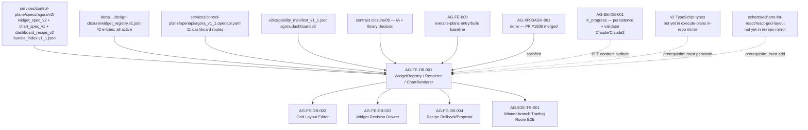

# AG-FE-DB-001 Sidecar Acceptance Follow-up 4

| Field | Value |
|---|---|
| Task ID | `AG-FE-DB-001-SIDECAR-ACCEPTANCE-FOLLOWUP-4` |
| Helper kind | `acceptance_packet` |
| Parent task | `AG-FE-DB-001` — WidgetRegistry/Renderer/ChartRenderer |
| Parent owner / reviewer | `Codex` / `Claude2` |
| Prepared by | `Claude` |
| Reviewer | `Claude2` |
| Date | `2026-06-20` |
| Mutates canonical truth | `false` |
| Status | Finalized / done |

## Purpose

This follow-up updates the acceptance packet for `AG-FE-DB-001` to reflect the
current post-contract-closure state. The key change since Follow-up 3 is that
`AG-XR-DASH-001` is now **done** (PR #1836 merged into dev), which has unblocked
`AG-FE-DB-001` from `blocked` to `todo`. The prior Claude2 blocker is resolved
at the status level; the dependency is now satisfied by the merged contract.

This packet records:
- the updated task status and unblock condition
- new canonical v2 contract artifacts now available in the repo
- the library and renderer dispatch decisions from contract-closure doc 05
- the UI IA placement from the frozen IA spec
- updated acceptance delta for the parent owner (Codex)
- the remaining prerequisites before implementation can start
- updated dependency map

It does not change canonical truth, schema authority, BFF/OpenAPI contracts,
frontend implementation, registry code, renderer code, route wiring, or
governance/runtime behavior.

---

## Current State Snapshot

| Surface | Observed state | Acceptance consequence |
|---|---|---|
| Parent task `AG-FE-DB-001` | `todo`, owner `Codex`, reviewer `Claude2`, `depends_on: [AG-XR-DASH-001]`. Prior Claude2 blocker is resolved at status level. | Implementation may start once the remaining artifact prerequisites below are confirmed. |
| Backend sibling `AG-BE-DB-001` | `in_progress`, owner `Claude`, reviewer `Claude2`, `depends_on: [AG-XR-DASH-001]`. | Backend persistence and validator are in progress. FE must not invent BFF paths, registry handshake fields, or validation endpoints; wait for BE to publish or agree to a parallel prop-only slice. |
| `AG-XR-DASH-001` | `done` (PR #1836 merged, commit `0ccb4f89`). Delivered 11 dashboard routes, ETag/If-Match concurrency semantics, `agora.dashboard.v2` capability, WidgetSpec v2 / ChartSpec v1 / DashboardRecipe v2 schemas, and `bundle_index.v1_1.json`. | The contract dependency is fully satisfied. FE can now consume the v2 schemas from `services/control-plane/specs/agora/v2/`. |
| v2 schemas in repo | `widget_spec_v2.schema.json`, `chart_spec_v1.schema.json`, `dashboard_recipe_v2.schema.json` present in `services/control-plane/specs/agora/v2/` with hashes recorded in `bundle_index.v1_1.json`. | FE must use these files (not the legacy v1 `widget_spec.schema.json`) as the implementation reference. |
| Generated v2 TypeScript types | `execute-plans/src/lib/bff-v1/agora/types.ts` still references the v1 contract snapshot only. No v1.1 type file exists in the in-repo mirror. | The type generation step (per `bundle_index.v1_1.json`) must be run and committed before or alongside FE implementation; unresolved until done. |
| Chart libraries (in-repo mirror) | `execute-plans/package.json` (in-repo mirror) has no charting dependency. The active local checkout `/home/lupin/code/execute-plans` has `recharts ^2.15.4` but is `[ahead 2, behind 467]`. | Contract-closure doc 05 has resolved the library decision (see §3 below). Parent owner must confirm the target delivery commit includes the approved deps. |
| `src/agora/widgets/` target files | `execute-plans/src/agora/widgets/registry.ts`, `WidgetRenderer.tsx`, `ChartSpecRenderer.tsx` do not exist in current baseline. | Parent must create these as new files; they must align with the A3 registry and v2 schemas. |
| Frozen v1 bundle | `python3 scripts/agora_schema_bundle.py --verify` passes (15/15 OK, verified by AG-XR-DASH-001 closeout). | Frozen v1 bundle remains intact. FE must not break the v1 bundle by modifying files in `services/control-plane/specs/agora/` (non-v2 subtree). |

---

## New Contract Artifacts Available

Since Follow-up 3, the following files are now canonically present in the repo
(merged via PR #1836 into `dev`):

| Artifact path | Purpose | SHA-256 (from bundle_index.v1_1.json) |
|---|---|---|
| `services/control-plane/openapi/agora_v1_1.openapi.yaml` | Dashboard CRUD + mutation/concurrency routes (11 routes) | — (not in v1_1 bundle file list; verify with `sha256sum`) |
| `services/control-plane/specs/agora/v2/widget_spec_v2.schema.json` | WidgetSpec v2 shape | `d360a17a9762d69e6a5e2c87921117bb85ee34d972fd8034f8904df6facb993f` |
| `services/control-plane/specs/agora/v2/chart_spec_v1.schema.json` | ChartSpec v1 grammar | `0bcd0fa5fc21d7c021d54803780e310cfd9234b3ea15c044fa0b5cdfffed0967` |
| `services/control-plane/specs/agora/v2/dashboard_recipe_v2.schema.json` | DashboardRecipe v2 persistence schema | `34c7e0fab793ec79776e9ddd5cca98683cacc6b8bba328e02a8c4c5eba45c13a` |
| `services/control-plane/specs/agora/v2/capability_manifest_v1_1.json` | Capability manifest v1.1 with `agora.dashboard.v2` | `6a729d1284ca8f88058a4c301dc67a4c17fd76097190bf020310f4f2cab3db41` |
| `services/control-plane/specs/agora/bundle_index.v1_1.json` | v1.1 bundle index extending v1.0 | — |

Previously recorded hashes for A3 design-closure artifacts remain valid:
- `widget_registry.v1.json`: `add7f379f4ff1f3c0c0930a566a269897cd497fb22ef53bbdfecb2b1d85c34d4`

WidgetSpec v2 field shape (required fields):

```
spec_version  (const "2.0")
widget_id
widget_type   (string; validated against registry at runtime)
title
data_source_id  (renamed from "data_source"; must be an allowlisted A3 data-source ID)
query           (object: filters, sort?, limit?, window?)
chart_spec      ($ref chart_spec_v1.schema.json)
interactions    (array of interaction definitions from chart_spec_v1)
sensitivity     (enum: public_market | user_private | broker_sensitive | restricted)
can_export      (boolean)
registry_version (const "widget_registry.v1")
version         (integer >= 1)
created_at      (date-time)
```

Note the rename: prior A3 closure spec used `data_source`; canonical v2 schema
uses `data_source_id`. Frontend types must follow the v2 schema, not the A3
closure draft.

---

## Library and Renderer Dispatch Decision (Contract-Closure Doc 05)

Contract-closure doc 05 (`docs/04/.../contract-closure/05_execute_plans_agora_ui_ia_and_dependencies.md`)
has resolved all chart library questions. This supersedes the prior "no library
approved" warning from Follow-ups 1–3.

### Approved library additions

Add to `execute-plans/package.json` (dependencies):
```json
{
  "echarts": "^5.6.0",
  "echarts-for-react": "^3.0.2",
  "react-grid-layout": "^1.5.0"
}
```

Add to devDependencies:
```json
{
  "@types/react-grid-layout": "^1.3.5"
}
```

Recharts is already present on `execute-plans@dev` and approved for use.

### Renderer dispatch map (canonical)

| Chart kinds | Renderer component |
|---|---|
| `metric`, `line`, `area`, `bar` (simple) | `RechartsRenderer` |
| `heatmap`, `network`, `sankey`, `candlestick`, `gauge`, `scatter` (complex) | `EChartsRenderer` |
| `table`, `stacked_bar`, `timeline` and `builtin` registry entries | `BuiltinWidgetRenderer` |

No component may execute arbitrary HTML or JS from a WidgetSpec. `react-resizable-panels`
remains for shell-level split panels only.

### BFF boundary (canonical)

All BFF reads and writes must use `src/lib/bff-v1/agora/*`. Pages must not
call `fetch()` directly.

---

## UI IA Placement (Contract-Closure Doc 05)

The frontend IA is now frozen. `AG-FE-DB-001` delivers renderer primitives into
the `TradingDeskShell` hierarchy under `/agora/trading-room`:

```text
/agora/trading-room          (canonical primary entry)
/agora/strategy-workshop
/agora/strategy-performance
```

Page composition for Trading Room (where AG-FE-DB-001 widgets live):

```text
TradingDeskShell
  StrategyLensSwitcher
  DashboardRecipeRenderer
    DashboardViewTabs
    EditableGrid
      WidgetFrame
      ChartSpecRenderer      ← AG-FE-DB-001 target
  TradingEventQueue
  PositionActionQueue
  ServantDrawer
  DashboardProposalPreview
  DashboardChangeLog
```

The parent must not invent new routes, pages, layout components, or navigation
patterns outside this frozen IA. Drag/resize uses `react-grid-layout`.

---

## BFF Routes Available for Frontend Use

From `agora_v1_1.openapi.yaml` (11 new routes, capability `agora.dashboard.v2`):

```
GET  /bff/agora/strategies/{strategy_id}/dashboard-recipes
POST /bff/agora/strategies/{strategy_id}/dashboard-recipes/proposals
GET  /bff/agora/dashboard-recipes/{recipe_id}
POST /bff/agora/dashboard-recipes/{recipe_id}/accept
PATCH /bff/agora/dashboard-recipes/{recipe_id}/layout
POST /bff/agora/dashboard-recipes/{recipe_id}/rollback
POST /bff/agora/dashboard-recipes/{recipe_id}/feedback
GET  /bff/agora/dashboard-recipes/{recipe_id}/versions
POST /bff/agora/widgets/validate
POST /bff/agora/widgets/{widget_id}/feedback
POST /bff/agora/widgets/propose-plugin
```

Concurrency contract: state-changing requests require `If-Match` (ETag) +
`Idempotency-Key` (client UUID) + `expected_version` in body. Conflict returns
409 `CONCURRENT_MODIFICATION` with `current_etag` / `latest_href`. Feedback
routes (`/feedback`) are exempt from `If-Match` per contract.

Frontend must not invent routes outside this list or call internal paths directly.

---

## Remaining Prerequisites Before Implementation

| Prerequisite | Status | Owner / action |
|---|---|---|
| v2 TypeScript types generated in execute-plans | Not done in-repo | Parent owner must run `node scripts/generate-agora-types.mjs` (or equivalent) against `bundle_index.v1_1.json` and commit the output to the target execute-plans delivery branch. |
| Chart dependencies added | Not done in in-repo mirror | Parent owner must add echarts/echarts-for-react/react-grid-layout to `execute-plans/package.json` (per doc 05 decision) and commit with lockfile. |
| AG-BE-DB-001 persistence layer | `in_progress` | FE may implement pure renderer primitives (receive widget data via props) without the BE; it must not add unaccepted BFF route helpers or invent registry/checksum handshake fields. |

---

## Parent Acceptance Delta

Cumulative acceptance rules (superseding prior follow-up deltas):

| Acceptance item | Parent pass condition |
|---|---|
| Schema authority v2 | Implementation uses `services/control-plane/specs/agora/v2/widget_spec_v2.schema.json` and `chart_spec_v1.schema.json`; not the legacy v1 `widget_spec.schema.json` and not the A3 design-closure draft files. |
| Field naming from v2 | `data_source_id` (not `data_source`) used throughout; `spec_version: "2.0"` and `registry_version: "widget_registry.v1"` are included. |
| Hash set recorded | Parent records sha256 of registry, widget_spec_v2, chart_spec_v1 used by frontend tests; must match bundle_index.v1_1.json values. |
| Registry coverage exact | Tests prove all 42 A3 `entries[].widget_type` values are represented with no extras or omissions. |
| Active gate data-driven | Renderer rejects inactive/unknown widget types from registry data. |
| Renderer mode explicit | Builtin and chart_spec modes handled separately; ECharts/Recharts dispatch follows doc 05 map. |
| Library evidence in target commit | The deliver commit's `execute-plans/package.json` includes echarts/echarts-for-react/react-grid-layout and lockfile; or safe dependency-free fallbacks with explicit justification. |
| v2 types in target commit | `execute-plans` delivery commit includes generated types from `bundle_index.v1_1.json`; no hand-editing or mixing with v1 snapshot. |
| BFF route restraint | Renderer work uses only the 11 dashboard routes from `agora_v1_1.openapi.yaml`; no invented additional routes. |
| Data source ID restraint | `data_source_id` is forwarded as allowlisted ID to BFF; renderer does not convert it into invented `bff_path` or `fetch` URLs. |
| ETag/concurrency awareness | FE read-modify-write flows pass `If-Match`, `Idempotency-Key`, `expected_version`; handle 409 `CONCURRENT_MODIFICATION` per doc 04 contract. |
| IA placement | New components placed within `DashboardRecipeRenderer → EditableGrid → WidgetFrame → ChartSpecRenderer` hierarchy; no new route or top-level page invented. |
| Security gates | No `eval`, `new Function`, `dangerouslySetInnerHTML`, iframe, remote script, arbitrary HTML, broker action, capital binding, or RuntimeBinding write path introduced. |
| Chart kind allowlist | Only 13 `chart_spec_v1` kinds accepted; arbitrary kinds rejected. |
| Interaction allowlist | Only 15 A3 interaction kinds mapped; order/capital/runtime actions blocked. |
| Transform allowlist | Only 16 declared transform types parsed; params treated as data only. |
| Encoding allowlist | Only 18 declared encoding channel names accepted. |
| Generated DTO discipline | Frontend generated types regenerated only from `bundle_index.v1_1.json`; no hand-edited snapshots or bridging between v1 and v2. |
| Frozen v1 bundle integrity | `python3 scripts/agora_schema_bundle.py --verify` passes (15/15) after any FE commit; FE must not touch files tracked in v1 bundle. |

---

## Dependency Map



Dependency notes:

- `AG-XR-DASH-001` is done; its delivered schemas and OpenAPI routes are the
  implementation authority for this task.
- `AG-BE-DB-001` is a compose-time dependency for checksum parity and recipe
  persistence. FE may build pure renderer primitives (props-fed, no BFF call) if
  the parent reviewer explicitly accepts a data-prop-only slice. Otherwise, FE
  must wait for the BE persistence layer to publish its BFF path before wiring
  live data fetching.
- Generated v2 TypeScript types and chart dependencies are not yet committed to
  the in-repo execute-plans mirror. These are hard prerequisites before
  TypeScript compilation of the new widget module can succeed.
- Downstream DB tasks (`AG-FE-DB-002`, `AG-FE-DB-003`, `AG-FE-DB-004`) must not
  depend on invented widget types, chart kinds, route IDs, or layout semantics
  from this task.

---

## Verification Notes For This Packet

Commands run for this support packet:

```bash
AI_NAME=Claude python3 scripts/ai_status.py show AG-FE-DB-001-SIDECAR-ACCEPTANCE-FOLLOWUP-4
AI_NAME=Claude python3 scripts/ai_status.py show AG-FE-DB-001
AI_NAME=Claude python3 scripts/ai_status.py show AG-XR-DASH-001
AI_NAME=Claude python3 scripts/ai_status.py show AG-BE-DB-001
ls docs/04/pantheon_agora_cross_repo_2026-06-20/contract-closure/
ls services/control-plane/openapi/
ls services/control-plane/specs/agora/v2/
cat services/control-plane/specs/agora/bundle_index.v1_1.json
cat services/control-plane/specs/agora/v2/capability_manifest_v1_1.json
sha256sum docs/04/pantheon_agora_cross_repo_2026-06-20/design-closure/widget_registry.v1.json \
  services/control-plane/specs/agora/v2/widget_spec_v2.schema.json \
  services/control-plane/specs/agora/v2/chart_spec_v1.schema.json \
  services/control-plane/specs/agora/v2/dashboard_recipe_v2.schema.json
jq -r '[(.dependencies//{}),(.devDependencies//{})] | add | to_entries[] | select(.key|test("recharts|echarts|react-grid-layout")) | "\(.key)=\(.value)"' execute-plans/package.json
python3 scripts/agora_schema_bundle.py --verify
```

Observed results:

- `AG-FE-DB-001-SIDECAR-ACCEPTANCE-FOLLOWUP-4` is `in_progress`, owner `Claude`,
  reviewer `Claude2`, support-only.
- `AG-FE-DB-001` is `todo`, unblocked, depends on `AG-XR-DASH-001` (done).
- `AG-XR-DASH-001` is archived done; commit `0ccb4f89` in dev.
- `AG-BE-DB-001` is `in_progress`.
- v2 contract artifacts present in `services/control-plane/specs/agora/v2/` with
  hashes matching `bundle_index.v1_1.json`.
- `agora.dashboard.v2` capability registered in `capability_manifest_v1_1.json`.
- In-repo execute-plans mirror has no chart library dependencies and no
  `src/agora/widgets/` target files.
- Frozen v1 bundle verification passed (15/15 OK).

---

## Reviewer Handoff

Claude2 should review only this sidecar support scope:

| Review question | Expected answer |
|---|---|
| Does this packet stay support-only? | Yes; it adds only this sidecar artifact. |
| Does it preserve the parent implementation discipline? | Yes; it records unblock conditions and prerequisites but does not start implementation. |
| Does it avoid changing canonical truth? | Yes; it records evidence and acceptance deltas only. |
| Does it correctly reflect the post-AG-XR-DASH-001 state? | Yes; it records the task now as `todo`, the new v2 schema files, the library decision, the IA decision, and the remaining prerequisites. |
| Does it align the acceptance criteria with v2 schema fields? | Yes; it records `data_source_id` rename, `spec_version/registry_version` constants, and v2 required fields. |

Suggested reviewer command:

```bash
AI_NAME=Claude2 ./scripts/ai-status.sh approve AG-FE-DB-001-SIDECAR-ACCEPTANCE-FOLLOWUP-4 "Review approved: follow-up 4 is support-only, reflects AG-XR-DASH-001 done state, records v2 schema fields, resolved library/renderer/IA decisions, remaining v2-type-gen and library prerequisites, and updated dependency map for AG-FE-DB-001."
```

---

## Finalization Record (Owner Closeout)

| Field | Value |
|---|---|
| Owner | Claude |
| Finalized at | 2026-06-20 |
| Reviewer approval | Claude2 — review_approved |
| Review notes | See `review_notes_zh` in ai-status.json: v2 schema hashes confirmed, 11 BFF routes confirmed, lib/renderer/IA decisions recorded from doc 05, remaining prerequisites stated, no canonical truth modified. |
| Canonical truth modified | false |
| Verification commands | See §Verification Notes above |
| Commit | AG-FE-DB-001-SIDECAR-ACCEPTANCE-FOLLOWUP-4: acceptance packet closeout |

This packet is closed. The parent task `AG-FE-DB-001` remains `todo` and is unblocked for Codex to begin implementation once the remaining prerequisites (v2 TypeScript type generation, chart library deps) are addressed.
