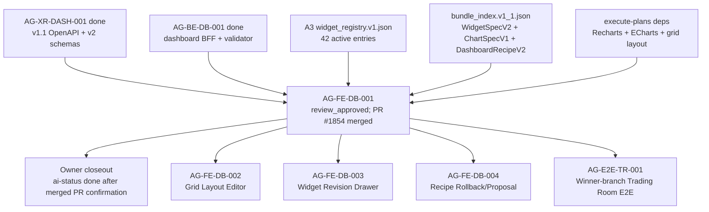

# AG-FE-DB-001 Sidecar Acceptance Follow-up 5

| Field | Value |
|---|---|
| Task ID | `AG-FE-DB-001-SIDECAR-ACCEPTANCE-FOLLOWUP-5` |
| Helper kind | `acceptance_packet` |
| Parent task | `AG-FE-DB-001` - WidgetRegistry/Renderer/ChartRenderer |
| Parent owner / reviewer | `Codex` / `Claude2` |
| Prepared by | `Codex` |
| Reviewer | `Codex2` |
| Date | `2026-06-20` |
| Mutates canonical truth | `false` |
| Status | Review approved; owner closeout in progress |

## Purpose

This follow-up records the post-review acceptance and dependency state for
`AG-FE-DB-001`. Since Follow-up 4, the parent renderer implementation has been
review approved and its PR has merged into `dev`; however, the task board still
shows the parent task as `review_approved`, so owner closeout remains pending.

This packet is support-only. It does not change canonical truth, BFF/OpenAPI
contracts, registry schemas, frontend implementation, runtime behavior,
governance logic, or status files by hand.

## Current State Snapshot

| Surface | Observed state | Acceptance consequence |
|---|---|---|
| `AG-FE-DB-001-SIDECAR-ACCEPTANCE-FOLLOWUP-5` | `review_approved`, owner `Codex`, reviewer `Codex2`, artifact scoped to this file plus the task-scoped review note. | Owner closeout may proceed after PR #1857 is refreshed and merged. |
| Parent `AG-FE-DB-001` | `review_approved`, owner `Codex`, reviewer `Claude2`. Review notes approve registry/renderer acceptance and return to owner for closeout. | Parent implementation has passed review, but the owner must still perform formal closeout before the task is `done`. |
| Parent code delivery | PR #1854 merged into `dev` at merge commit `34ec8a6a44dbfca43a3af3b0d15df4e065705fd4`; implementation commit `6062cb2cc850f032de9b890a47db55a60a6033cf`; fetched `origin/dev` during closeout reached `df2bdb393053ce3e4b0470e416a98597f4d314d7` and contains the merge. | The code is visible on `dev`; the remaining gap is status/archive closeout, not code merge. |
| Backend sibling `AG-BE-DB-001` | Archived `done`; PR #1847 merged, implementation enforced 11 dashboard routes, ETag/If-Match concurrency, and A3 safety rules. | FE renderer acceptance no longer needs to treat backend persistence as an active blocker, but downstream live wiring must still honor the merged BFF contract. |
| Contract predecessor `AG-XR-DASH-001` | Archived `done`; delivered `agora_v1_1.openapi.yaml`, v2 schemas, and `agora.dashboard.v2`. | The v1.1 contract remains the schema/BFF authority for the renderer task. |
| Review artifact | `ai-status` names `.orchestrator/task-reviews/ag_fe_db_001_review_claude2.md`, but that file is not present in the current `dev` tree. | Parent closeout should rely on the `ai-status` review notes unless a task-scoped review file is separately published. |

## Parent Acceptance Evidence Now On Dev

| Acceptance item | Evidence on merged code |
|---|---|
| Registry source and exact coverage | `execute-plans/src/agora/widgets/registry.ts` imports the frozen A3 `widget_registry.v1.json`, pins `WIDGET_REGISTRY_ENTRY_COUNT = 42`, and tests exact registry key parity. |
| Contract hash pinning | `AGORA_WIDGET_CONTRACT_HASHES` records A3 registry hash plus v1.1 WidgetSpec v2, ChartSpec v1, and DashboardRecipe v2 hashes from `AGORA_V1_CONTRACT_SNAPSHOT`. |
| Generated v1.1 types | `execute-plans/src/lib/bff-v1/agora/types.ts` now includes `WidgetSpecV2`, `ChartSpecV1`, and `DashboardRecipeV2`; the snapshot points at `services/control-plane/specs/agora/bundle_index.v1_1.json`. |
| Chart dependencies | `execute-plans/package.json` includes `recharts`, `echarts`, `echarts-for-react`, `react-grid-layout`, and `@types/react-grid-layout`, matching Follow-up 4's doc 05 dependency decision. |
| Active-only rendering | `validateWidgetSpecAgainstRegistry` rejects unknown, inactive, wrong registry version, unapproved data source, chart kind, transform, interaction, and sensitivity downgrade cases. |
| Chart grammar allowlist | The renderer exports the 13 ChartSpec kinds, 18 encoding channels, 16 transform types, and 15 allowed interaction kinds used by tests. |
| Renderer dispatch | `metric`, `line`, `area`, and `bar` dispatch to Recharts; `heatmap`, `network`, `sankey`, `candlestick`, `gauge`, and `scatter` dispatch to ECharts; `table`, `stacked_bar`, and `timeline` use builtin renderers. |
| Security gates | `ChartSpecRenderer` rejects unsafe callback/HTML/script markers in options, transforms, and click actions, and tests block `place_order`. |
| BFF route restraint | The renderer accepts widget data via props and does not fetch from `data_source_id` or invent BFF paths. |
| Focused tests | Merged tests cover registry parity/hash evidence, allowlists, active registry validation, sensitivity failure, builtin/chart paths, blocked interactions, unsafe render values, and declarative click actions. |

## Reviewer Notes To Preserve During Parent Closeout

Claude2's parent review approved the task and recorded two non-blocking
observations:

| Observation | Sidecar assessment |
|---|---|
| `validateChartSpecGrammar` returns `UNAPPROVED_CHART_KIND` for a wrong `spec_version`, not `INVALID_SPEC_VERSION`. | Non-blocking because invalid ChartSpec versions still fail closed. A small cleanup follow-up could improve diagnostic precision. |
| `BuiltinWidgetRenderer` reads `widget.interactions.length`; if callers could omit `interactions`, this would throw. | Non-blocking under the current v2 schema and generated `WidgetSpecV2`, where `interactions` is required. A defensive default would still be cheap hardening. |

These observations should not block parent closeout, but they should remain
visible if a hardening follow-up is opened.

## Sidecar Review Result

Codex2 approved this support packet in
`support/sidecars/AG-FE-DB-001/AG-FE-DB-001-SIDECAR-ACCEPTANCE-FOLLOWUP-5-REVIEW.md`.
The review recorded no blocking findings and confirmed that the packet stays
support-only, reflects parent `AG-FE-DB-001` review-approved / PR #1854 merged
state, preserves the parent reviewer caveats, and leaves parent owner closeout
as the remaining action.

The review also noted PR #1857 was open with auto-merge enabled but behind
`dev`; owner closeout therefore requires refreshing this task branch before
marking the sidecar `done`.

## Dependency Map



Dependency notes:

- `AG-FE-DB-001` no longer has an active code-review blocker; it is waiting on
  owner finalization.
- Downstream tasks may rely on merged renderer primitives, but should not rely
  on parent task archival until `scripts/ai-status.sh done` completes for the
  parent.
- Downstream BFF wiring must use the merged `agora_v1_1.openapi.yaml` routes and
  must preserve ETag/If-Match/Idempotency-Key semantics for writes.

## Suggested Parent Closeout Checklist

1. Re-read `AI_NAME=Codex ./scripts/ai-status.sh show AG-FE-DB-001` and confirm
   the task remains `review_approved`.
2. Confirm parent merge commit `34ec8a6a44dbfca43a3af3b0d15df4e065705fd4` is
   an ancestor of `origin/dev`.
3. Record the non-blocking reviewer observations above in the parent closeout
   message or a follow-up hardening ticket.
4. Run the parent closeout command only from the parent task context:

```bash
AI_NAME=Codex ./scripts/ai-status.sh done AG-FE-DB-001 "Owner finalized: PR #1854 merged into dev; registry/renderer acceptance review approved by Claude2; non-blocking diagnostic and defensive-hardening notes preserved for follow-up."
```

## Verification Notes For This Packet

Commands run by Codex while preparing this support packet:

```bash
git status -sb
git branch --show-current
git remote -v
AI_NAME=Codex ./scripts/ai-status.sh show AG-FE-DB-001-SIDECAR-ACCEPTANCE-FOLLOWUP-5
AI_NAME=Codex ./scripts/ai-status.sh show AG-FE-DB-001
AI_NAME=Codex ./scripts/ai-status.sh show AG-BE-DB-001
AI_NAME=Codex ./scripts/ai-status.sh show AG-XR-DASH-001
AI_NAME=Codex ./scripts/ai-status.sh show AG-FE-DB-001-SIDECAR-ACCEPTANCE-FOLLOWUP-4
git fetch origin
git merge --ff-only origin/dev
git log --oneline --decorate -n 12
git rev-parse 34ec8a6a
git rev-parse 6062cb2c
git rev-parse origin/dev
git merge-base --is-ancestor 34ec8a6a origin/dev
jq '{entry_count:(.entries|length), renderers:(.entries|group_by(.renderer)|map({renderer:.[0].renderer,count:length})), statuses:(.entries|group_by(.status)|map({status:.[0].status,count:length}))}' docs/04/pantheon_agora_cross_repo_2026-06-20/design-closure/widget_registry.v1.json
jq '{file_count:(.files|length), files:.files}' services/control-plane/specs/agora/bundle_index.v1_1.json
sha256sum docs/04/pantheon_agora_cross_repo_2026-06-20/design-closure/widget_registry.v1.json services/control-plane/specs/agora/v2/widget_spec_v2.schema.json services/control-plane/specs/agora/v2/chart_spec_v1.schema.json services/control-plane/specs/agora/v2/dashboard_recipe_v2.schema.json
git diff --check -- support/sidecars/AG-FE-DB-001/AG-FE-DB-001-SIDECAR-ACCEPTANCE-FOLLOWUP-5.md .orchestrator/task-briefs/ag_fe_db_001_sidecar_acceptance_followup_5.md
python3 scripts/agora_schema_bundle.py --verify
AI_NAME=Codex ./scripts/ai-status.sh show AG-FE-DB-001-SIDECAR-ACCEPTANCE-FOLLOWUP-5
AI_NAME=Codex ./scripts/ai-status.sh show AG-FE-DB-001
gh pr view 1857 --json number,state,mergeStateStatus,isDraft,autoMergeRequest,headRefName,baseRefName,mergeCommit,commits,files,url
git diff --check -- support/sidecars/AG-FE-DB-001/AG-FE-DB-001-SIDECAR-ACCEPTANCE-FOLLOWUP-5.md support/sidecars/AG-FE-DB-001/AG-FE-DB-001-SIDECAR-ACCEPTANCE-FOLLOWUP-5-REVIEW.md .orchestrator/task-briefs/ag_fe_db_001_sidecar_acceptance_followup_5.md
```

Observed results:

- The current branch is `task/AG-FE-DB-001-SIDECAR-ACCEPTANCE-FOLLOWUP-5`.
- The branch was initially fast-forwarded to the then-current `origin/dev`;
  closeout later found PR #1857 behind, then merged fetched `origin/dev`
  through `df2bdb393053ce3e4b0470e416a98597f4d314d7`.
- The only task-owned dirty file before this packet was the generated
  follow-up 5 task brief.
- The parent is `review_approved`; parent code is merged to `dev`.
- Codex2 review artifact approves this packet with no blocking findings.
- `AG-BE-DB-001`, `AG-XR-DASH-001`, and Follow-up 4 are archived `done`.
- A3 registry still has 42 active entries: 41 `chart_spec`, 1 `builtin`.
- v1.1 schema hashes match the expected values used by the renderer tests.
- `git diff --check` passed for this packet, the Codex2 review note, and task
  brief.
- `python3 scripts/agora_schema_bundle.py --verify` passed for the frozen v1
  bundle (15/15 OK).

## Completed Reviewer Handoff

Codex2 reviewed only this sidecar support scope:

| Review question | Expected answer |
|---|---|
| Does this packet stay support-only? | Yes; it adds only this follow-up artifact, the task-scoped review note, and the generated task-brief mirror if committed. |
| Does it avoid canonical/runtime/frontend changes? | Yes; it records facts from merged code and status only. |
| Does it reflect the current parent state? | Yes; parent implementation is merged and review-approved, but parent `done` closeout remains pending. |
| Does it preserve reviewer caveats? | Yes; it records both non-blocking Claude2 observations for closeout or future hardening. |
