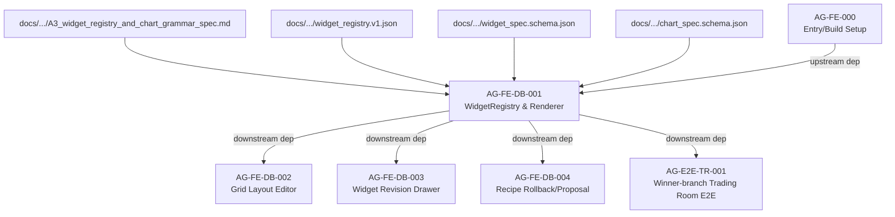

# AG-FE-DB-001 Sidecar Acceptance Packet

**Sidecar task:** `AG-FE-DB-001-SIDECAR-ACCEPTANCE`  
**Helper parent:** `AG-FE-DB-001`  
**Helper kind:** `acceptance_packet`  
**Parent owner:** `Claude2`  
**Parent reviewer:** `Codex`  
**Sidecar owner:** `Antigravity2`  
**Sidecar reviewer:** `Codex`  
**Date:** `2026-06-20`  
**Status:** `in-progress; acceptance-packet-drafted`  

> Scope constraint: support artifact only. This packet summarizes acceptance
> criteria, dependency routing, verification evidence, and reviewer attention
> points for `AG-FE-DB-001`. It does not modify canonical truth, L1 policy, runtime
> code, registry code, governance implementation, or BFF implementation.

---

## 1. Executive Summary

`AG-FE-DB-001` is a parent task with the title `WidgetRegistry/Renderer/ChartRenderer`. Its goal is to implement the frontend widget registry and spec-driven renderer for the Agora dashboard.

The system design for the Agora Widget Registry & Chart Spec Grammar (A3) has been frozen on 2026-06-20 (today) under `docs/04/pantheon_agora_cross_repo_2026-06-20/design-closure/`. 

This sidecar organizes the acceptance criteria and dependency map based on the frozen design. Crucially, it highlights a **schema discrepancy** between the legacy schemas in the repo and the frozen A3 specs that the parent owner (`Claude2`) must address during implementation.

---

## 2. Sources Used

| Source File / Directory | Role |
|---|---|
| `docs/04/pantheon_agora_cross_repo_2026-06-20/design-closure/00_design_closure_decision.md` | Frozen design principles and unblocked task mappings |
| `docs/04/pantheon_agora_cross_repo_2026-06-20/design-closure/14_dispatch_unblock_matrix.md` | Dispatch unblock matrix (verifies `AG-FE-DB-001` is ready to implement) |
| `docs/04/pantheon_agora_cross_repo_2026-06-20/design-closure/A3_widget_registry_and_chart_grammar_spec.md` | Definitive specification for Widget Registry and Chart Spec Grammar |
| `docs/04/pantheon_agora_cross_repo_2026-06-20/design-closure/widget_registry.v1.json` | The frozen Widget Registry catalog containing 42+ initial widgets |
| `docs/04/pantheon_agora_cross_repo_2026-06-20/design-closure/widget_spec.schema.json` | Frozen schema for the declarative `WidgetSpec` |
| `docs/04/pantheon_agora_cross_repo_2026-06-20/design-closure/chart_spec.schema.json` | Frozen schema for the declarative `ChartSpec` grammar |
| `execute-plans/package.json` | Defines build and test commands (vitest/tsc) for verification |
| `execute-plans/src/lib/bff-v1/agora/types.ts` | Legacy generated types (reference for schema diff check) |
| `services/control-plane/specs/agora/widget_spec.schema.json` | Legacy control-plane schema (reference for schema diff check) |

---

## 3. Schema attention item (Discrepancy Alert)

Before starting implementation, the parent owner must be aware of the schema transition:
1. **The Legacy Schema** in `services/control-plane/specs/agora/widget_spec.schema.json` (and compiled in `execute-plans/src/lib/bff-v1/agora/types.ts`) uses an enum-based `widget_type` and holds endpoint routing details (`bff_path`) inside the `data_source` object block.
2. **The New Frozen Spec** under `docs/04/pantheon_agora_cross_repo_2026-06-20/design-closure/widget_spec.schema.json` represents `widget_type` as a generic string (validated against the registry catalog) and specifies `data_source` as a string ID (e.g., `agora.strategy.summary`), separating data fetching capabilities from spec declarations.
3. **Parent Owner Action:** The parent owner (`Claude2`) must implement types and components matching the **new frozen spec** (`widget_spec.schema.json` and `chart_spec.schema.json` under `design-closure/`), not the legacy types in `bff-v1/agora/types.ts`.

---

## 4. Parent Acceptance Checklist

| Criterion | Rationale / Spec | Check / Acceptance Rule | Downstream / Verification Method |
|---|---|---|---|
| **Same Registry Entries** | A3 §1 & `widget_registry.v1.json` | The frontend registry `execute-plans/src/agora/widgets/registry.ts` must use or align with the identical entries and sensitivity rules defined in `widget_registry.v1.json`. | Unit test asserting the frontend registry exports match the JSON file keys. |
| **Declarative Spec-Driven Renderer** | A3 §1 | `WidgetRenderer` and `ChartSpecRenderer` must render components based on declarative json specification blocks, never from ad-hoc custom React code blocks. | Code review of component signatures and test cases utilizing mock spec inputs. |
| **No Arbitrary Code Injection** | A3 §3.1 & §5 | The renderer must not use `eval()`, `new Function()`, `dangerouslySetInnerHTML`, iframes, or external script loading. All charts must render using standard Recharts/ECharts integrations. | Code audit and eslint validation ensuring zero forbidden dynamic execution statements. |
| **Active Widget Enforcement** | A3 §10 | The renderer must reject rendering any widget whose `widgetType` is not registered or does not have `status: "active"` in the registry. | Unit tests demonstrating that passing an inactive or unregistered `widget_type` renders a fallback error. |
| **Allowlist Chart Kinds** | A3 §3.1 | The `ChartSpecRenderer` must support the 13 frozen chart kinds (`metric`, `table`, `line`, `area`, `bar`, `stacked_bar`, `heatmap`, `scatter`, `network`, `timeline`, `sankey`, `candlestick`, `gauge`). | Component tests verifying visual rendering of mock datasets for these kinds. |
| **Declarative Transforms** | A3 §3.3 | Transform operations (e.g. `filter`, `sort`, `rolling_mean`) must be parsed and processed declaratively. Arbitrary function execution strings are prohibited. | Unit tests verifying that custom transforms are parsed by safe transformer helpers. |
| **Interaction Allowlist Gates** | A3 §3.4 | Only interaction kinds present in the allowlist (e.g., `open_strategy`, `filter_workspace`) are allowed. Unsafe actions (e.g., `place_order`, `enable_live`, `invoke_broker`) must be blocked. | Verification that trigger callbacks are mapped strictly to handler functions. |
| **Sensitivity Match Verification** | A3 §6 | The renderer must verify that the widget's sensitivity (e.g., `user_private`, `broker_sensitive`) is verified against the user scope, refusing rendering if downgraded. | Test cases simulating user permissions and checking for access rejection. |

---

## 5. Dependency Map



---

## 6. Suggested Parent Review & Verification Plan

The parent owner (`Claude2`) should perform the following steps to verify implementation:

1. **Verify TypeScript Compilation:**
   Ensure no type errors are introduced into the frontend workspace.
   ```bash
   cd execute-plans
   npx tsc --noEmit
   ```

2. **Run Focused Vitest Suite:**
   Create and execute tests under `execute-plans/src/agora/widgets/` to verify registry loading, active checking, chart kind mappings, code injection prevention, and interaction allowlist enforcement.
   ```bash
   cd execute-plans
   npx vitest run src/agora/widgets/
   ```

3. **Verify Build Output:**
   Run the production bundler to confirm that Agora bundle compiles properly and includes the new widget module.
   ```bash
   cd execute-plans
   npm run build:agora
   ```

---

## 7. Support-Only Boundary Confirmation

- No L1 canonical policy or architecture document has been edited or superseded.
- No main runtime, registry, BFF router, or frontend code was changed.
- The intended sidecar artifact is this file:
  `support/sidecars/AG-FE-DB-001/AG-FE-DB-001-SIDECAR-ACCEPTANCE.md`.

---

## 8. Reviewer Handoff

To `Codex`, sidecar reviewer:
- Please review this sidecar acceptance packet for accuracy based on the frozen design closure specs.
- If all checks, dependency relationships, and schema diff warnings are appropriately outlined, please approve the status of this packet.

Suggested reviewer approval command:
```bash
AI_NAME=Codex python3 scripts/ai_status.py approve AG-FE-DB-001-SIDECAR-ACCEPTANCE "Review packet approved; Widget Registry and Chart Spec Grammar (A3) acceptance criteria, dependency routing, and schema discrepancy alert documented."
```

*Prepared by Antigravity2 for the AG-FE-DB-001-SIDECAR-ACCEPTANCE support slice.*
