# AG-FE-DB-002 Sidecar Acceptance Follow-up 10

| Field | Value |
|---|---|
| Task ID | `AG-FE-DB-002-SIDECAR-ACCEPTANCE-FOLLOWUP-10` |
| Helper kind | `acceptance_packet` |
| Parent task | `AG-FE-DB-002` - Drag/resize/add/remove/change chart editor |
| Parent owner / reviewer | `Codex` / `Claude` |
| Prepared by | `Codex2` |
| Reviewer | `Codex` |
| Date | `2026-06-21` |
| Mutates canonical truth | `false` |
| Status | Review approved; owner closeout in progress |

## Purpose

This packet is a support-only follow-up for `AG-FE-DB-002`. It refreshes the
acceptance checklist, dependency map, and parent-handoff evidence after
`AG-FE-DB-002-SIDECAR-ACCEPTANCE-FOLLOWUP-9` was finalized. The parent task
remains active `blocked` and `waiting_for` `Claude`; this sidecar does not
unblock, reopen, implement, or close the parent.

No runtime, registry, schema, OpenAPI, BFF, governance, broker, RuntimeBinding,
or canonical L1/L2 truth surface is changed by this packet.

## Reviewed Evidence Chain

All prior DB002 support packets are durable and reviewed:

| Sidecar | State | Key decision or evidence |
|---|---|---|
| `AG-FE-DB-002-SIDECAR-ACCEPTANCE` | `done` PR #1870 | Original mirror waiver, V10/V11 waiver, 13-item acceptance checklist, dependency map |
| `AG-FE-DB-002-SIDECAR-ACCEPTANCE-FOLLOWUP-2` | `done` PR #1887 | Parent blocked-status distinction and DashboardGridEditor composition gates |
| `AG-FE-DB-002-SIDECAR-ACCEPTANCE-FOLLOWUP-3` | `done` PR #1894 | Current-dev compose surface and closeout refresh |
| `AG-FE-DB-002-SIDECAR-ACCEPTANCE-FOLLOWUP-4` | `done` PR #1903 | Parent blocked-status preservation and dependency refresh |
| `AG-FE-DB-002-SIDECAR-ACCEPTANCE-FOLLOWUP-5` | `done` PR #1910 | Waiver evidence routing, dependency map refresh, support-only boundary |
| `AG-FE-DB-002-SIDECAR-ACCEPTANCE-FOLLOWUP-6` | `done` PR #1914 | Compressed handoff packet and parent blocked-state confirmation |
| `AG-FE-DB-002-SIDECAR-ACCEPTANCE-FOLLOWUP-7` | `done` PR #1917 | Evidence routing and compose-surface refresh through followup-6 |
| `AG-FE-DB-002-SIDECAR-ACCEPTANCE-FOLLOWUP-8` | `done` PR #1922/#1923 | Evidence chain refreshed through followup-7, finalization record added |
| `AG-FE-DB-002-SIDECAR-ACCEPTANCE-FOLLOWUP-9` | `done` PR #1933/#1937 | Current-dev acceptance refresh through followup-8 and closeout record |

Current `origin/dev` has advanced through unrelated sidecar merges after
followup-9, including `AG-FE-ID-001-SIDECAR-BFF-HANDOFF-FOLLOWUP-19` and
`AG-XR-003-SIDECAR-ACCEPTANCE-FOLLOWUP-12`. These merges do not change the
DB002 dashboard editor dependency surface.

## Current State Snapshot

| Surface | Observed state | Acceptance consequence |
|---|---|---|
| `AG-FE-DB-002` | Active `blocked`; owner `Codex`; reviewer `Claude`; `waiting_for` `Claude`. | Parent remains blocked until `Claude` explicitly absorbs reviewed sidecar evidence or records a new concrete blocker. |
| `AG-FE-DB-002-SIDECAR-ACCEPTANCE-FOLLOWUP-10` | Active `review_approved`; owner `Codex2`; reviewer `Codex`; artifact is this support packet. | Owner closeout should preserve the reviewed support-only packet and then mark this sidecar `done`; parent status remains unchanged. |
| `AG-XR-DASH-001` | Archived `done`. | v1.1 dashboard routes, v2 schemas, ETag/If-Match, expected version, idempotency, and 409 conflict semantics are available. |
| `AG-BE-DB-001` | Archived `done`. | Dashboard BFF CRUD, layout PATCH, widget validator, append-only versioning, and core A3 safety rules are merged. |
| `AG-FE-DB-001` | Archived `done`. | Registry, `WidgetRenderer`, `ChartSpecRenderer`, generated Agora types, ECharts, and `react-grid-layout` dependency are merged. |
| `AG-FE-DB-003` | Archived `done`. | `WidgetRevisionDrawer` and before/after widget change flow are merged. DB002 must compose this surface instead of forking widget revision UX. |
| `AG-FE-DB-004` | Archived `done`. | `DashboardProposalPreview`, `DashboardChangeLog`, rollback/proposal UI, and dashboard tests are merged. DB002 must not duplicate those ownership areas. |
| `DashboardGridEditor` | `execute-plans/src/agora/dashboard/DashboardGridEditor.tsx` is absent on current dev. | Parent implementation remains incomplete; this support packet makes no runtime delivery claim. |
| Layout PATCH helper | `execute-plans/src/lib/bff-v1/agora/dashboard.ts` currently exposes widget validation, not a typed layout PATCH helper. | DB002 may need a narrow helper there, but UI components must still avoid direct `fetch()`. |
| `AG-FE-TR-002` | Active `todo`; owner `Claude`; reviewer `Codex`. | Trading Room queue UI is separate and does not unblock DB002. |
| `AG-E2E-TR-001` | Active `todo`; depends on `AG-FE-TR-002` and `AG-FE-DB-002`. | E2E must wait for DB002 implementation, review, merge, and closure. |

## Parent Blocker Absorption

The parent blocker still cites repository/dependency routing conflict and
missing V10/V11 visual references. The reviewed support chain already answers
both points:

| Blocker point | Reviewed answer to absorb |
|---|---|
| `execute-plans/` is gitignored as a phantom mirror | Intentional `execute-plans/` task files may be committed only through `scripts/git/worker_commit.py` with explicit file paths in `--scope`. Raw `git add .`, raw `git add -A`, and directory-scope `--scope execute-plans/` remain forbidden. |
| Clean sibling `execute-plans` lacks AG-FE-DB-001 artifacts | The reviewed support chain treats the Pantheon `execute-plans/` mirror artifacts merged by AG-FE-DB-001/003/004 as the current compose surface for this Agora wave unless the parent reviewer/supervisor gives a new routing decision. |
| Missing V10/V11 visual snapshots | Missing snapshots do not block functional DB002 work. Binding authority is the contract-closure prose, v2 schemas, A3 widget registry/chart grammar, and existing `execute-plans/src/agora/` component/token conventions. |

Recommended parent path:

1. `Claude`, as the parent reviewer and current `waiting_for`, explicitly
   acknowledges reviewed sidecar evidence through followup-10 or records a new
   concrete blocker.
2. If acknowledged, `Claude` reopens the parent for owner implementation:

   ```bash
   AI_NAME=Claude ./scripts/ai-status.sh reopen AG-FE-DB-002 "Reviewed DB002 sidecar waiver evidence accepted through followup-10; return parent to Codex for DashboardGridEditor implementation."
   ```

3. `Codex`, as parent owner, implements only the narrow DB002 runtime slice:
   `DashboardGridEditor`, focused tests, and a typed layout PATCH helper only
   if the existing Agora BFF helper surface still lacks one.
4. Any new ambiguity in route shape, field spelling, UI authority, mirror
   routing, or dependency ownership should become a parent blocker. The parent
   brief still prohibits filling gaps by inference.

## Current Dev Compose Surface

| Surface | Current file or dependency | DB002 usage rule |
|---|---|---|
| Registry gate | `execute-plans/src/agora/widgets/registry.ts` | Use `validateWidgetSpecAgainstRegistry`, active registry metadata, and sensitivity checks. Do not create a second allowlist. |
| Widget rendering | `execute-plans/src/agora/widgets/WidgetRenderer.tsx` | Every grid frame renders through `WidgetRenderer`; pass the user's allowed sensitivity scope. |
| Chart rendering | `execute-plans/src/agora/widgets/ChartSpecRenderer.tsx` | Delegate chart display; do not introduce arbitrary HTML/JS, iframe, `eval`, `new Function`, or `dangerouslySetInnerHTML`. |
| Widget revision | `execute-plans/src/agora/widgets/WidgetRevisionDrawer.tsx` | Chart/widget change UX should compose this drawer or its accepted `WidgetSpecV2` result boundary. |
| Proposal/history/rollback | `execute-plans/src/agora/dashboard/DashboardProposalPreview.tsx`, `DashboardChangeLog.tsx` | Preserve DB004 ownership of proposal, version, rollback, and change-log behavior. |
| Typed Agora contracts | `execute-plans/src/lib/bff-v1/agora/types.ts` | Use generated names and v2 field spelling; do not invent route bodies or enum values. |
| Dashboard BFF helper | `execute-plans/src/lib/bff-v1/agora/dashboard.ts` | Keep BFF fetch details in helper code; add only a narrow layout PATCH helper if DB002 needs one. UI components should not make raw route calls. |
| Layout dependency | `react-grid-layout` `^1.5.0`, `@types/react-grid-layout` `^1.3.5` | Use this library for drag/resize; no alternate grid library or custom drag engine. |
| Chart dependency | `echarts` `^5.6.0`, `echarts-for-react` `^3.0.2`, `recharts` `^2.15.4` | Continue the existing chart stack. No dependency-only change is needed for DB002. |

## Parent Acceptance Checklist

| Area | Parent pass condition |
|---|---|
| File scope | Any commit touching `execute-plans/` uses explicit file paths with `worker_commit.py --scope`; no raw staging sweep and no directory-scope mirror commit. |
| Component ownership | Add `DashboardGridEditor` and focused tests only unless a typed layout PATCH helper is strictly required. |
| Grid library | Use `react-grid-layout`; no alternate grid library and no custom drag engine. |
| Editable gestures | Tests cover drag, resize, add, remove, and chart-change. |
| Placement shape | Layout mutations produce `WidgetPlacement`-compatible records with `widget_id`, `x`, `y`, `w`, `h`, `min_w`, `min_h`, and preserve optional `max_w`, `max_h`, `pinned`. |
| Patch operation allowlist | Layout writes use only `move_widget`, `resize_widget`, `remove_widget`, `add_registered_widget`, `replace_chart_spec`, or `update_widget_query`. |
| BFF route | Layout PATCH targets `/bff/agora/dashboard-recipes/{recipe_id}/layout` through the typed Agora BFF helper surface. |
| Concurrency | State-changing layout writes include current ETag/`If-Match`, `expected_version`, and `Idempotency-Key`; 409 `CONCURRENT_MODIFICATION` is visible and never overwritten silently. |
| Personalization event | Every layout or chart mutation emits a schema-compatible `PersonalizationEvent` with dashboard recipe context. |
| Registry validation | Add/change flows call the merged registry gate and, where server validation is needed, the BFF widget validate helper. Unknown, inactive, unsupported chart kind, blocked interaction, unapproved data source, or sensitivity downgrade cases fail closed. |
| Renderer composition | Every widget frame renders through `WidgetRenderer`; DB002 must not fork chart rendering or built-in widget cards. |
| Sensitivity | Pass allowed sensitivity context to `WidgetRenderer`; do not render data above operator scope. |
| Pinned guard | `pinned: true` placements cannot be moved or resized; tests cover this guard. |
| DB003 composition | Assistant-driven chart/widget changes compose `WidgetRevisionDrawer` or its accepted result instead of a parallel conversation flow. |
| DB004 composition | Recipe proposal, change-log, version, and rollback behavior remains owned by DB004 surfaces and backend contract. |
| Runtime boundary | No order placement, broker invocation, capital binding, RuntimeBinding write, management route, arbitrary HTML/JS, iframe, `eval`, `new Function`, or `dangerouslySetInnerHTML`. |
| Verification | Focused editor tests, widget/dashboard regression tests, `build:agora`, contract drift checks when generated contract surfaces are touched, and `git diff --check` are recorded in parent closeout. |

## Dependency Map

```mermaid
graph TD
    XRDASH["AG-XR-DASH-001 done<br/>v1.1 routes + v2 schemas + concurrency"] --> BEDB["AG-BE-DB-001 done<br/>BFF CRUD + layout PATCH + validator"]
    XRDASH --> DB001["AG-FE-DB-001 done<br/>registry + WidgetRenderer + ChartSpecRenderer + deps"]
    BEDB --> DB002["AG-FE-DB-002 active blocked<br/>DashboardGridEditor absent"]
    DB001 --> DB002
    DB003["AG-FE-DB-003 done<br/>WidgetRevisionDrawer"] --> DB002
    DB004["AG-FE-DB-004 done<br/>ProposalPreview + ChangeLog + rollback"] --> DB002
    P0["Original sidecar done PR #1870<br/>mirror + V10/V11 waivers"] -. reviewed evidence .-> DB002
    P2["FOLLOWUP-2 done PR #1887<br/>blocked-status distinction"] -. reviewed evidence .-> DB002
    P3["FOLLOWUP-3 done PR #1894<br/>current-dev compose surface"] -. reviewed evidence .-> DB002
    P4["FOLLOWUP-4 done PR #1903<br/>dependency refresh"] -. reviewed evidence .-> DB002
    P5["FOLLOWUP-5 done PR #1910<br/>waiver evidence routing"] -. reviewed evidence .-> DB002
    P6["FOLLOWUP-6 done PR #1914<br/>handoff compression"] -. reviewed evidence .-> DB002
    P7["FOLLOWUP-7 done PR #1917<br/>evidence routing refresh"] -. reviewed evidence .-> DB002
    P8["FOLLOWUP-8 done PR #1922/#1923<br/>finalized evidence chain"] -. reviewed evidence .-> DB002
    P9["FOLLOWUP-9 done PR #1933/#1937<br/>current-dev acceptance refresh"] -. reviewed evidence .-> DB002
    P10["FOLLOWUP-10 this packet<br/>current-dev acceptance refresh"] -. review handoff .-> DB002
    DB002 --> E2E["AG-E2E-TR-001 todo<br/>depends on AG-FE-TR-002 + DB002"]
```



Dependency notes:

- Upstream DB002 implementation dependencies remain merged and archived `done`.
- The remaining parent issue is reviewer absorption of reviewed blocker
  evidence, not a missing schema, route, registry, or library dependency.
- `DashboardGridEditor` remains absent, so DB002 cannot be represented as
  runtime-complete.
- `AG-E2E-TR-001` must wait for DB002 parent implementation and closure.

## Suggested Parent Verification

Once the parent implementation exists:

```bash
npm --prefix execute-plans test -- --run src/agora/dashboard/DashboardGridEditor
npm --prefix execute-plans test -- --run src/agora/widgets src/agora/dashboard
npm --prefix execute-plans run build:agora
git diff --check
```

Keep these contract checks if DB002 touches generated Agora contract surfaces:

```bash
node execute-plans/scripts/generate-agora-types.mjs --check --pantheon-root .
python3 scripts/agora_schema_bundle.py --verify
```

If broad TypeScript or lint commands remain blocked by unrelated baseline
failures, the parent owner should record the exact focused passing commands and
the unrelated failure signature.

## Sidecar Verification Performed

Commands used while preparing this support packet:

```bash
git status -sb
git branch --show-current
git remote -v
AI_NAME=Codex2 ./scripts/ai-status.sh show AG-FE-DB-002-SIDECAR-ACCEPTANCE-FOLLOWUP-10
AI_NAME=Codex2 ./scripts/ai-status.sh show AG-FE-DB-002
AI_NAME=Codex2 ./scripts/ai-status.sh show AG-FE-DB-002-SIDECAR-ACCEPTANCE-FOLLOWUP-9
AI_NAME=Codex2 ./scripts/ai-status.sh show AG-FE-DB-001
AI_NAME=Codex2 ./scripts/ai-status.sh show AG-FE-DB-003
AI_NAME=Codex2 ./scripts/ai-status.sh show AG-FE-DB-004
AI_NAME=Codex2 ./scripts/ai-status.sh show AG-XR-DASH-001
AI_NAME=Codex2 ./scripts/ai-status.sh show AG-BE-DB-001
AI_NAME=Codex2 ./scripts/ai-status.sh show AG-FE-TR-002
AI_NAME=Codex2 ./scripts/ai-status.sh show AG-E2E-TR-001
git merge --ff-only origin/dev
test -f execute-plans/src/agora/dashboard/DashboardGridEditor.tsx
rg -n 'react-grid-layout|@types/react-grid-layout|echarts|echarts-for-react' execute-plans/package.json
rg -n 'validateWidgetSpecAgainstRegistry|WidgetRenderer|DashboardRecipeV2|PersonalizationEvent|move_widget|resize_widget|replace_chart_spec|expected_version|If-Match|Idempotency' execute-plans/src/agora execute-plans/src/lib/bff-v1/agora services/control-plane/specs/agora docs/04/pantheon_agora_cross_repo_2026-06-20 -S
wc -l execute-plans/src/lib/bff-v1/agora/dashboard.ts
git log --oneline -8 HEAD
```

Observed results:

- Branch is `task/AG-FE-DB-002-SIDECAR-ACCEPTANCE-FOLLOWUP-10` at current
  `origin/dev` checkpoint `519aa954`.
- Only pre-existing dirty entry before authoring was the generated
  task-scoped brief
  `.orchestrator/task-briefs/ag_fe_db_002_sidecar_acceptance_followup_10.md`.
- This sidecar is active `in_progress`, owned by `Codex2`, reviewed by `Codex`.
- Parent `AG-FE-DB-002` remains active `blocked`, waiting for `Claude`.
- Prior DB002 support packets through followup-9 are archived `done`.
- `AG-FE-DB-001`, `AG-BE-DB-001`, `AG-XR-DASH-001`, `AG-FE-DB-003`, and
  `AG-FE-DB-004` are archived `done`.
- `AG-FE-TR-002` and `AG-E2E-TR-001` remain active `todo`; `AG-E2E-TR-001`
  depends on `AG-FE-DB-002`.
- `DashboardGridEditor` is absent on current dev.
- `react-grid-layout`, `@types/react-grid-layout`, `echarts`, and
  `echarts-for-react` are present in `execute-plans/package.json`.
- `execute-plans/src/lib/bff-v1/agora/dashboard.ts` currently contains the
  widget validation BFF helper; a narrow layout PATCH helper remains a parent
  implementation concern if no later task adds it first.
- No canonical truth, schema, OpenAPI, runtime, registry, governance, broker,
  or RuntimeBinding implementation was changed by this sidecar.

## Reviewer Approval

`Codex` approved this sidecar for owner closeout. Reviewer notes recorded in
task status:

- followup-10 only adds this support packet and does not change canonical
  truth, runtime, schema, registry, governance, broker, or RuntimeBinding
  surfaces.
- PR #1939 packet commit `851029b3` is already included in `origin/dev`.
- Parent `AG-FE-DB-002` remains `blocked` and `waiting_for` `Claude`.
- Upstream DB002 compose dependencies remain archived `done`; `DashboardGridEditor`
  is still absent; layout PATCH helper remains outside the existing helper
  surface and is a parent implementation concern.
- Non-blocking observation from review: the original packet snapshot said this
  sidecar was `in_progress`; this closeout update refreshes that status to
  `review_approved` without changing the parent handoff substance.

## Closeout Finalization

Owner closeout confirms:

- The reviewed deliverable is a support-only acceptance/dependency packet.
- The parent task remains blocked; this closeout does not reopen, unblock,
  implement, or close `AG-FE-DB-002`.
- No canonical truth, runtime, registry, schema, OpenAPI, governance, broker,
  RuntimeBinding, or primary implementation surface is changed.
- The generated local task brief
  `.orchestrator/task-briefs/ag_fe_db_002_sidecar_acceptance_followup_10.md`
  is worker context only and is not part of this support artifact scope.

Additional owner closeout checks:

```bash
AI_NAME=Codex2 ./scripts/ai-status.sh show AG-FE-DB-002-SIDECAR-ACCEPTANCE-FOLLOWUP-10
AI_NAME=Codex2 ./scripts/ai-status.sh show AG-FE-DB-002
git show --stat --oneline --decorate 159ec96b
git branch -r --contains 159ec96b
git log --oneline --decorate -12 -- support/sidecars/AG-FE-DB-002/AG-FE-DB-002-SIDECAR-ACCEPTANCE-FOLLOWUP-10.md
git diff --check
```
