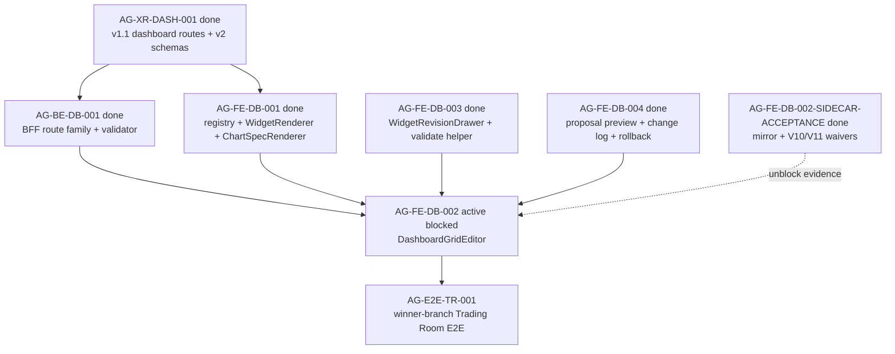

# AG-FE-DB-002 Sidecar Acceptance Follow-up 2

| Field | Value |
|---|---|
| Task ID | `AG-FE-DB-002-SIDECAR-ACCEPTANCE-FOLLOWUP-2` |
| Helper kind | `acceptance_packet` |
| Parent task | `AG-FE-DB-002` - Drag/resize/add/remove/change chart editor |
| Parent owner / reviewer | `Codex` / `Claude` |
| Prepared by | `Codex2` |
| Reviewer | `Codex` |
| Date | `2026-06-20` |
| Mutates canonical truth | `false` |
| Status | Review approved |

## Purpose

This follow-up gives the parent owner a fresh unblock and acceptance packet for
`AG-FE-DB-002` after the original `AG-FE-DB-002-SIDECAR-ACCEPTANCE` packet was
archived `done`.

The parent task is still active and `blocked` in `ai-status` on an older
mirror/V10/V11 blocker. The archived sidecar packet already reviewed and
accepted both waivers. This packet does not change that state by itself. It
records the current dependency state and the exact review questions Codex
should absorb before restarting or handing the parent back to Claude.

This is support-only. It does not edit L1 canonical truth, OpenAPI/schema
truth, BFF runtime code, frontend runtime code, registry behavior, governance
logic, broker authority, or RuntimeBinding.

## Current State Snapshot

| Surface | Observed state | Acceptance consequence |
|---|---|---|
| Parent `AG-FE-DB-002` | Active `blocked`, owner `Codex`, reviewer `Claude`, waiting_for `Claude`. | Parent implementation should not be called unblocked until Codex/Claude intentionally resolves the old blocker in status. |
| Original DB002 sidecar | Archived `done`; PR #1870 merged; reviewer notes approved the execute-plans mirror waiver, V10/V11 waiver, 13-item checklist, and dependency map. | The old blocker has a reviewed support answer, but the answer has not yet been absorbed into parent task state. |
| `AG-FE-DB-001` | Archived `done`; PR #1854 merged registry, `WidgetRenderer`, `ChartSpecRenderer`, generated v1.1 types, chart deps, and widget tests. | DB002 may compose these files; it must not fork widget rendering or registry validation. |
| `AG-BE-DB-001` | Archived `done`; dashboard BFF route family, ETag/If-Match concurrency, and widget validator are merged. | DB002 layout writes must use the existing BFF route semantics instead of inventing client-only persistence. |
| `AG-XR-DASH-001` | Archived `done`; v1.1 dashboard routes, v2 schemas, append-only versioning, and `agora.dashboard.v2` capability are merged. | DB002 must use the v1.1 contract and v2 schema field names exactly. |
| `AG-FE-DB-003` | Archived `done`; `WidgetRevisionDrawer` and widget validation helper are merged. | DB002 chart-change flows should compose with DB003 for conversation revision rather than duplicating it. |
| `AG-FE-DB-004` | Archived `done`; proposal preview, change log, rollback UI, and dashboard BFF helpers are merged. | DB002 should compose recipe/version semantics with DB004 and avoid alternate rollback/history behavior. |
| DB002 implementation file | `execute-plans/src/agora/dashboard/DashboardGridEditor.tsx` is not present on current `dev`. | This follow-up is still preparatory; it does not claim parent code exists. |

## Blocker Absorption Guidance

The parent blocker names two implementation blockers:

1. Whether intentional `execute-plans/` files can be committed from the
   Pantheon worktree even though the directory is gitignored as a mirror.
2. Whether missing V10/V11 visual reference files block implementation.

The archived DB002 sidecar packet resolves both for this support slice:

- Intentional `execute-plans/` files may be committed when the worker uses
  `scripts/git/worker_commit.py` with explicit file paths in `--scope`. The
  directory-scope form `--scope execute-plans/` remains forbidden because it can
  sweep ignored files into the commit.
- Missing V10/V11 snapshots do not block DB002 functional implementation.
  Existing design authority comes from the contract-closure prose, v2 schemas,
  A3 registry/chart grammar, and existing `execute-plans/src/agora/` tokens and
  component patterns.

Recommended parent-owner action after this follow-up is reviewed:

1. Re-read the archived sidecar packet and this follow-up.
2. Decide whether Codex, as parent owner, may resolve the old blocker directly
   or whether Claude should first acknowledge the waiver in the parent task.
3. If proceeding, keep the parent implementation scope limited to the
   DashboardGridEditor component, focused tests, and any typed BFF helper needed
   for the already-merged layout PATCH contract.

This sidecar does not run `start`, `progress`, or `done` for the parent task.

## Parent Acceptance Checklist Delta

The original DB002 sidecar already carries the broad 13-item checklist. This
follow-up adds the current post-DB001/003/004 composition rules:

| Area | Parent pass condition |
|---|---|
| Explicit file scope | Any DB002 commit that touches `execute-plans/` uses explicit file paths in `worker_commit.py --scope`; no raw `git add .`, no directory-scope `execute-plans/`. |
| Grid library | `DashboardGridEditor` uses `react-grid-layout`; no alternate grid library or custom drag engine. |
| Placement shape | Drag/resize/add/remove emits `WidgetPlacement`-compatible records with `widget_id`, `x`, `y`, `w`, `h`, `min_w`, `min_h`, and preserves optional `max_w`, `max_h`, `pinned`. |
| Patch operation allowlist | Layout writes use only `move_widget`, `resize_widget`, `remove_widget`, `add_registered_widget`, `replace_chart_spec`, or `update_widget_query`. |
| BFF write route | Layout PATCH goes through the typed `src/lib/bff-v1/agora/*` helper surface to `/bff/agora/dashboard-recipes/{recipe_id}/layout`; no raw fetch in UI components unless the helper owns it. |
| Concurrency | State-changing layout writes include current ETag/`If-Match`, `expected_version`, and `Idempotency-Key`; 409 `CONCURRENT_MODIFICATION` is visible and never overwritten silently. |
| Registry gate | Add/change chart flows call the merged registry/widget validation path before accepting a widget. Unknown, inactive, unsupported chart kind, blocked interaction, or sensitivity downgrade cases fail closed. |
| Renderer composition | Every widget frame renders through `WidgetRenderer`; DB002 must not duplicate `ChartSpecRenderer` or builtin widget rendering. |
| Pinned guard | `pinned: true` placements cannot be moved or resized. Tests must cover this guard. |
| DB003 composition | If a chart-change path invokes assistant/widget revision behavior, it composes `WidgetRevisionDrawer` or its validated result boundary instead of inventing a second conversation flow. |
| DB004 composition | Recipe status/version/history/rollback behavior remains owned by DB004 helpers and backend contract; DB002 does not create a separate history model. |
| Runtime boundary | No order placement, broker invocation, capital binding, RuntimeBinding write, management route, arbitrary HTML/JS, `eval`, `new Function`, iframe, or `dangerouslySetInnerHTML`. |
| Focused tests | Tests cover drag, resize, add, remove, chart-change, personalization event emission, pinned guard, active-registry rejection, and conflict handling. |

## Dependency Map



Dependency notes:

- `AG-FE-DB-002` remains the missing DashboardGridEditor implementation slice.
- All named upstream implementation dependencies are on `dev`.
- The remaining blocker is coordination/status absorption of the already
  reviewed sidecar waivers, not a missing schema or runtime dependency.
- Downstream `AG-E2E-TR-001` should not treat the Trading Room dashboard path as
  complete until DB002 itself is implemented, reviewed, merged, and closed.

## Review Approval And Closeout Boundary

`AI_NAME=Codex2 ./scripts/ai-status.sh show
AG-FE-DB-002-SIDECAR-ACCEPTANCE-FOLLOWUP-2` reports this task as
`review_approved` with reviewer `Codex`.

Reviewer note:

> follow-up packet correctly distinguishes the archived sidecar waiver from
> parent `AG-FE-DB-002` still being `blocked`/`waiting_for Claude`; the
> DB001/BE/XR/DB003/DB004 dependency map matches archived state; the
> `DashboardGridEditor` composition gates preserve the support-only boundary
> without canonical/runtime edits.

Owner closeout keeps that boundary unchanged. This task closes only the support
packet and task brief; it does not resolve the parent blocker or start the
parent implementation.

## Suggested Parent Verification

Focused DB002 checks once implementation exists:

```bash
npm --prefix execute-plans test -- --run src/agora/dashboard/DashboardGridEditor
npm --prefix execute-plans test -- --run src/agora/widgets src/agora/dashboard
npm --prefix execute-plans run build:agora
```

Repository/contract checks that should remain in closeout when touched files
intersect the generated Agora contract surface:

```bash
node execute-plans/scripts/generate-agora-types.mjs --check --pantheon-root .
python3 scripts/agora_schema_bundle.py --verify
git diff --check
```

If repo-wide TypeScript or lint has pre-existing unrelated failures, the parent
owner should record the exact focused tests that passed and the unrelated
failure signature.

## Sidecar Verification Performed

Commands run while preparing this support packet:

```bash
git status -sb
git branch --show-current
git remote -v
AI_NAME=Codex2 ./scripts/ai-status.sh show AG-FE-DB-002
AI_NAME=Codex2 ./scripts/ai-status.sh show AG-FE-DB-002-SIDECAR-ACCEPTANCE
AI_NAME=Codex2 ./scripts/ai-status.sh show AG-FE-DB-001
AI_NAME=Codex2 ./scripts/ai-status.sh show AG-BE-DB-001
AI_NAME=Codex2 ./scripts/ai-status.sh show AG-XR-DASH-001
AI_NAME=Codex2 ./scripts/ai-status.sh show AG-FE-DB-003
AI_NAME=Codex2 ./scripts/ai-status.sh show AG-FE-DB-004
find execute-plans/src/agora -maxdepth 4 -type f \( -name '*DashboardGridEditor*' -o -name '*Dashboard*' -o -name '*Widget*' \) -print
git ls-files execute-plans/src/agora
```

Observed results:

- Current branch is `task/AG-FE-DB-002-SIDECAR-ACCEPTANCE-FOLLOWUP-2`.
- The only pre-existing dirty entry before this packet was the generated
  task-scoped brief `.orchestrator/task-briefs/ag_fe_db_002_sidecar_acceptance_followup_2.md`.
- Parent `AG-FE-DB-002` is still active `blocked` on the old mirror/V10/V11
  blocker, waiting for `Claude`.
- Original `AG-FE-DB-002-SIDECAR-ACCEPTANCE` is archived `done` and says the
  waivers were reviewed and approved.
- `AG-FE-DB-001`, `AG-BE-DB-001`, `AG-XR-DASH-001`, `AG-FE-DB-003`, and
  `AG-FE-DB-004` are archived `done`.
- `DashboardGridEditor` does not exist on current `dev`; this packet makes no
  implementation claim.

## Reviewer Handoff

Codex should review this support packet for:

1. Whether it accurately distinguishes the archived sidecar waiver from the
   parent task's still-blocked status.
2. Whether the post-DB001/003/004 composition checklist is complete enough for
   the parent DashboardGridEditor implementation.
3. Whether the support-only boundary is preserved.

Suggested reviewer command:

```bash
AI_NAME=Codex REVIEW_FILE=support/sidecars/AG-FE-DB-002/AG-FE-DB-002-SIDECAR-ACCEPTANCE-FOLLOWUP-2.md ./scripts/ai-status.sh approve AG-FE-DB-002-SIDECAR-ACCEPTANCE-FOLLOWUP-2 "Review approved: DB002 follow-up packet accurately preserves parent blocked status, absorbs archived mirror/V10 waivers, maps done dependencies, and defines DashboardGridEditor composition gates without canonical/runtime changes."
```

Prepared by `Codex2` for the `AG-FE-DB-002-SIDECAR-ACCEPTANCE-FOLLOWUP-2`
support slice.
