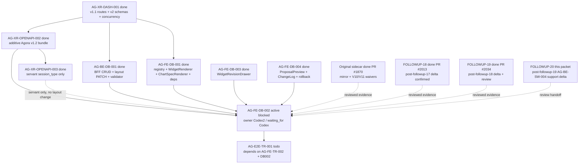

# AG-FE-DB-002 Sidecar Acceptance Follow-up 20

| Field | Value |
|---|---|
| Task ID | `AG-FE-DB-002-SIDECAR-ACCEPTANCE-FOLLOWUP-20` |
| Helper kind | `acceptance_packet` |
| Parent task | `AG-FE-DB-002` - Drag/resize/add/remove/change chart editor |
| Current parent owner / reviewer | `Codex2` / `Codex` |
| Prepared by | `Codex` |
| Reviewer | `Codex2` |
| Date | `2026-06-21` |
| Baseline | follow-up 19 merged to `dev` at `068eb9c4` (PR #2034) |
| Current dev | `ea320c5e` (PR #2035) |
| Mutates canonical truth | `false` |
| Status | Ready for review |

## Purpose

This packet is a support-only refresh for `AG-FE-DB-002`. It updates the
acceptance checklist, dependency map, and parent handoff after
`AG-FE-DB-002-SIDECAR-ACCEPTANCE-FOLLOWUP-19` was reviewed, finalized, and
archived `done`.

The parent task remains active `blocked`. Current status records parent owner
`Codex2`, reviewer `Codex`, and `waiting_for` `Codex`. This sidecar does not
unblock, reopen, implement, or close the parent. It also does not change
runtime, registry, schema, OpenAPI, BFF, governance, broker, RuntimeBinding,
or canonical L1/L2 truth surfaces.

## Reviewed Evidence Chain

All prior DB002 support packets through follow-up 19 are durable. Follow-up 19
is archived `done` and records review approval plus owner closeout:

| Sidecar | State | Key decision or evidence |
|---|---|---|
| `AG-FE-DB-002-SIDECAR-ACCEPTANCE` | `done` PR #1870 | Original mirror waiver, V10/V11 waiver, 13-item acceptance checklist, dependency map |
| `AG-FE-DB-002-SIDECAR-ACCEPTANCE-FOLLOWUP-2` | `done` PR #1887 | Parent blocked-status distinction and DashboardGridEditor composition gates |
| `AG-FE-DB-002-SIDECAR-ACCEPTANCE-FOLLOWUP-3` | `done` PR #1894 | Current-dev compose surface and closeout refresh |
| `AG-FE-DB-002-SIDECAR-ACCEPTANCE-FOLLOWUP-4` | `done` PR #1903 | Parent blocked-status preservation and dependency refresh |
| `AG-FE-DB-002-SIDECAR-ACCEPTANCE-FOLLOWUP-5` | `done` PR #1910 | Waiver evidence routing, dependency map refresh, support-only boundary |
| `AG-FE-DB-002-SIDECAR-ACCEPTANCE-FOLLOWUP-6` | `done` PR #1914 | Compressed handoff packet and parent blocked-state confirmation |
| `AG-FE-DB-002-SIDECAR-ACCEPTANCE-FOLLOWUP-7` | `done` PR #1917 | Evidence routing and compose-surface refresh through followup-6 |
| `AG-FE-DB-002-SIDECAR-ACCEPTANCE-FOLLOWUP-8` | `done` PR #1922/#1923 | Evidence chain refreshed through followup-7, finalization record added |
| `AG-FE-DB-002-SIDECAR-ACCEPTANCE-FOLLOWUP-9` | `done` PR #1933/#1937 | Current-dev acceptance refresh through followup-8 and closeout record |
| `AG-FE-DB-002-SIDECAR-ACCEPTANCE-FOLLOWUP-10` | `done` PR #1942 | Current-dev acceptance refresh through followup-9 and closeout record |
| `AG-FE-DB-002-SIDECAR-ACCEPTANCE-FOLLOWUP-11` | `done` PR #1947 | Current-dev acceptance refresh through followup-10 and closeout record |
| `AG-FE-DB-002-SIDECAR-ACCEPTANCE-FOLLOWUP-12` | `done` PR #1958 | Current-dev acceptance refresh through followup-11; Codex reviewed |
| `AG-FE-DB-002-SIDECAR-ACCEPTANCE-FOLLOWUP-13` | `done` PR #1963 | Current-dev acceptance refresh through followup-12; Claude2 reviewed |
| `AG-FE-DB-002-SIDECAR-ACCEPTANCE-FOLLOWUP-14` | `done` PR #1972 | Current-dev acceptance refresh through followup-13; Claude2 reviewed; closeout record merged |
| `AG-FE-DB-002-SIDECAR-ACCEPTANCE-FOLLOWUP-15` | `done` PR #1995 | Current-dev acceptance refresh through followup-14; Codex reviewed; v1.2 contract freshness note merged |
| `AG-FE-DB-002-SIDECAR-ACCEPTANCE-FOLLOWUP-16` | `done` PR #2002 | Packet, Codex review record, and closeout records merged; parent remained blocked |
| `AG-FE-DB-002-SIDECAR-ACCEPTANCE-FOLLOWUP-17` | `done` PR #2010 | Packet and closeout records merged; post-followup-16 delta confirmed unrelated |
| `AG-FE-DB-002-SIDECAR-ACCEPTANCE-FOLLOWUP-18` | `done` PR #2013 | Packet, Claude2 review, and closeout merged; post-followup-17 delta confirmed unrelated |
| `AG-FE-DB-002-SIDECAR-ACCEPTANCE-FOLLOWUP-19` | `done` PR #2034 | Packet reviewed by Codex2; post-followup-18 delta confirmed unrelated to DB002 dashboard layout semantics |

Follow-up 19 archived status records PR #2034 merged into `dev` at
`068eb9c40dda1dccca6339533596b67b92c6816d`, visible CI checks passing, no
canonical truth mutation, and parent `AG-FE-DB-002` still blocked waiting for
`Codex` absorption.

## Current Dev Delta Since Follow-up 19 Closeout

Follow-up 19 merged to `dev` at `068eb9c4`. Current `origin/dev` during this
packet is `ea320c5e`.

`git log --first-parent --oneline 068eb9c4..origin/dev` shows one later merge:

| Area | Merged work since follow-up 19 | DB002 consequence |
|---|---|---|
| Strategy workshop BFF handoff support | PR #2035 `AG-BE-SW-004-SIDECAR-BFF-HANDOFF` added `support/sidecars/AG-BE-SW-004/AG-BE-SW-004-SIDECAR-BFF-HANDOFF.md`. | Support artifact for a separate strategy-workshop sidecar. It does not touch DB002 dashboard editor, widget renderer, dashboard helper, OpenAPI, or schema surfaces. |

`git diff --name-only 068eb9c4 origin/dev` lists only:

- `support/sidecars/AG-BE-SW-004/AG-BE-SW-004-SIDECAR-BFF-HANDOFF.md`

`git diff --name-only 068eb9c4 origin/dev -- execute-plans/src/agora/dashboard
execute-plans/src/agora/widgets execute-plans/src/lib/bff-v1/agora
services/control-plane/openapi services/control-plane/specs/agora` returned no
paths.

No changed file in this delta is under:

- `execute-plans/src/agora/dashboard/`
- `execute-plans/src/agora/widgets/`
- `execute-plans/src/lib/bff-v1/agora/`
- `services/control-plane/openapi/`
- `services/control-plane/specs/agora/`

The dashboard layout route remains present as
`PATCH /bff/agora/dashboard-recipes/{recipe_id}/layout` with operationId
`patchDashboardRecipeLayout`. The six allowed operation names remain
`move_widget`, `resize_widget`, `remove_widget`, `add_registered_widget`,
`replace_chart_spec`, and `update_widget_query`.

## Current State Snapshot

| Surface | Observed state | Acceptance consequence |
|---|---|---|
| `AG-FE-DB-002` | Active `blocked`; owner `Codex2`; reviewer `Codex`; `waiting_for` `Codex`. | Parent remains blocked until `Codex` explicitly absorbs reviewed sidecar evidence or records a new concrete blocker. |
| `AG-FE-DB-002-SIDECAR-ACCEPTANCE-FOLLOWUP-20` | Active `in_progress`; owner `Codex`; reviewer `Codex2`; artifact is this packet. | Owner should commit and hand this packet to `Codex2` for review. Parent status remains unchanged. |
| `AG-FE-DB-002-SIDECAR-ACCEPTANCE-FOLLOWUP-19` | Archived `done`; PR #2034 merged; review notes state support-only boundary and parent blocked state were preserved. | Follow-up 20 starts from finalized follow-up 19 evidence instead of reopening earlier packets. |
| `AG-XR-DASH-001` | Archived `done`. | v1.1 dashboard routes, v2 schemas, ETag/If-Match, expected version, idempotency, and 409 conflict semantics are available. |
| `AG-XR-OPENAPI-002` | Archived `done`. | v1.2 additive route/type context is merged. |
| `AG-XR-OPENAPI-003` | Archived `done`. | Adds servant-session `session_type`; it does not change DB002 dashboard layout semantics. |
| `AG-BE-DB-001` | Archived `done`. | Dashboard BFF CRUD, layout PATCH, widget validator, append-only versioning, and core A3 safety rules are merged. |
| `AG-FE-DB-001` | Archived `done`. | Registry, `WidgetRenderer`, `ChartSpecRenderer`, generated Agora types, ECharts, and `react-grid-layout` dependency are merged. |
| `AG-FE-DB-003` | Archived `done`. | `WidgetRevisionDrawer` and before/after widget change flow are merged. DB002 must compose this surface instead of forking widget revision UX. |
| `AG-FE-DB-004` | Archived `done`. | `DashboardProposalPreview`, `DashboardChangeLog`, rollback/proposal UI, and dashboard tests are merged. DB002 must not duplicate those ownership areas. |
| `DashboardGridEditor` | `execute-plans/src/agora/dashboard/DashboardGridEditor.tsx` is absent on current dev. | Parent implementation remains incomplete; this support packet makes no runtime delivery claim. |
| Layout PATCH helper | `execute-plans/src/lib/bff-v1/agora/dashboard.ts` remains 113 lines and exposes only the widget validation helper. | DB002 still likely needs a narrow typed layout PATCH helper, but UI components must avoid direct `fetch()`. |
| Typed route inventory | `execute-plans/src/lib/bff-v1/agora/types.ts` includes `patchDashboardRecipeLayout` for `/bff/agora/dashboard-recipes/{recipe_id}/layout`. | Parent owner should use generated names and current request semantics instead of inventing route bodies. |
| `AG-FE-TR-002` | Active `todo`; owner `Claude`; reviewer `Codex`. | Trading Room queue UI is separate and does not unblock DB002. |
| `AG-E2E-TR-001` | Active `todo`; depends on `AG-FE-TR-002` and `AG-FE-DB-002`. | E2E must wait for DB002 implementation, review, merge, and closure. |

## Parent Blocker Absorption

The parent blocker still cites repository/dependency routing conflict and
missing V10/V11 visual references. The reviewed support chain through
follow-up 19 already answers both points. Follow-up 20 adds current-dev delta
confirmation that the only merge since follow-up 19 is unrelated strategy
workshop support material.

| Blocker point | Reviewed answer to absorb |
|---|---|
| `execute-plans/` is gitignored as a phantom mirror | Intentional `execute-plans/` task files may be committed only through `scripts/git/worker_commit.py` with explicit file paths in `--scope`. Raw `git add .`, raw `git add -A`, and directory-scope `--scope execute-plans/` remain forbidden. |
| Clean sibling `execute-plans` lacks AG-FE-DB-001 artifacts | The reviewed support chain treats the Pantheon `execute-plans/` mirror artifacts merged by AG-FE-DB-001/003/004 as the current compose surface for this Agora wave unless the parent reviewer/supervisor gives a new routing decision. |
| Missing V10/V11 visual snapshots | Missing snapshots do not block functional DB002 work. Binding authority is the contract-closure prose, v2/v1.2 schemas, A3 widget registry/chart grammar, and existing `execute-plans/src/agora/` component/token conventions. |
| v1.2 contract files changed after older packets | The relevant v1.2 delta remains servant-session `session_type` from `AG-XR-OPENAPI-003`. It does not alter dashboard layout PATCH semantics, operation names, or generated `patchDashboardRecipeLayout` route inventory. |
| Dev advanced after follow-up 19 | The new delta is only AG-BE-SW-004 sidecar BFF handoff support material. It does not add `DashboardGridEditor`, change the dashboard BFF helper, or change DB002 dashboard layout behavior. |

Recommended parent path:

1. `Codex`, as the current parent reviewer and `waiting_for`, explicitly
   acknowledges reviewed sidecar evidence through follow-up 20 or records a new
   concrete parent blocker.
2. If acknowledged, `Codex` reopens the parent for owner implementation:

   ```bash
   AI_NAME=Codex ./scripts/ai-status.sh reopen AG-FE-DB-002 "Reviewed DB002 sidecar waiver and current-dev evidence accepted through followup-20; return parent to Codex2 for DashboardGridEditor implementation."
   ```

3. `Codex2`, as current parent owner, implements only the narrow DB002 runtime
   slice: `DashboardGridEditor`, focused tests, and a typed layout PATCH helper
   only if the existing Agora BFF helper surface still lacks one.
4. Any ambiguity in route shape, field spelling, UI authority, mirror routing,
   generated type freshness, or dependency ownership should become a parent
   blocker. The parent brief still prohibits filling gaps by inference.

## Current Dev Compose Surface

| Surface | Current file or dependency | DB002 usage rule |
|---|---|---|
| Registry gate | `execute-plans/src/agora/widgets/registry.ts` | Use `validateWidgetSpecAgainstRegistry`, active registry metadata, and sensitivity checks. Do not create a second allowlist. |
| Widget rendering | `execute-plans/src/agora/widgets/WidgetRenderer.tsx` | Every grid frame renders through `WidgetRenderer`; pass the user's allowed sensitivity scope. |
| Chart rendering | `execute-plans/src/agora/widgets/ChartSpecRenderer.tsx` | Delegate chart display; do not introduce arbitrary HTML/JS, iframe, `eval`, `new Function`, or `dangerouslySetInnerHTML`. |
| Widget revision | `execute-plans/src/agora/widgets/WidgetRevisionDrawer.tsx` | Chart/widget change UX should compose this drawer or its accepted `WidgetSpecV2` result boundary. |
| Proposal/history/rollback | `execute-plans/src/agora/dashboard/DashboardProposalPreview.tsx`, `DashboardChangeLog.tsx` | Preserve DB004 ownership of proposal, version, rollback, and change-log behavior. |
| Typed Agora contracts | `execute-plans/src/lib/bff-v1/agora/types.ts` | Use generated names and current route metadata; do not invent route bodies or enum values. |
| Dashboard BFF helper | `execute-plans/src/lib/bff-v1/agora/dashboard.ts` | Keep BFF fetch details in helper code; add only a narrow layout PATCH helper if DB002 needs one. UI components should not make raw route calls. |
| v1.2 layout contract | `services/control-plane/openapi/agora_v1_2.openapi.yaml` | Confirms `PATCH /bff/agora/dashboard-recipes/{recipe_id}/layout`, `If-Match`, `Idempotency-Key`, `expected_version`, and the six layout operations. The post-followup-19 delta does not alter this route. |
| Layout dependency | `react-grid-layout` `^1.5.0`, `@types/react-grid-layout` `^1.3.5` | Use this library for drag/resize; no alternate grid library or custom drag engine. |
| Chart dependency | `echarts` `^5.6.0`, `echarts-for-react` `^3.0.2`, `recharts` `^2.15.4` | Continue the existing chart stack. No dependency-only change is needed for DB002. |

## Parent Acceptance Checklist

| Area | Parent pass condition |
|---|---|
| File scope | Any commit touching `execute-plans/` uses explicit file paths with `worker_commit.py --scope`; no raw staging sweep and no directory-scope mirror commit. |
| Component ownership | Add `DashboardGridEditor` and focused tests only unless a typed layout PATCH helper is strictly required. |
| Contract freshness | Before implementation closeout, confirm generated Agora types and helper calls align with current v1.2 dashboard route semantics. Do not hand-write missing contract shapes. |
| Grid library | Use `react-grid-layout`; no alternate grid library and no custom drag engine. |
| Editable gestures | Tests cover drag, resize, add, remove, and chart-change. |
| Placement shape | Layout mutations produce `WidgetPlacement`-compatible records with `widget_id`, `x`, `y`, `w`, `h`, `min_w`, `min_h`, and preserve optional `max_w`, `max_h`, `pinned`. |
| Patch operation allowlist | Layout writes use only `move_widget`, `resize_widget`, `remove_widget`, `add_registered_widget`, `replace_chart_spec`, or `update_widget_query`. |
| BFF route | Layout PATCH targets `/bff/agora/dashboard-recipes/{recipe_id}/layout` through the typed Agora BFF helper surface. |
| Concurrency | State-changing layout writes include current ETag/`If-Match`, `expected_version`, and `Idempotency-Key`; 409 `CONCURRENT_MODIFICATION` is visible and never overwritten silently. |
| Personalization event | Every layout or chart mutation emits a schema-compatible `PersonalizationEvent` with dashboard recipe context. |
| Registry validation | Add/change flows call the merged registry gate and, where server validation is needed, the BFF widget validate helper. Unknown, inactive, unsupported chart kind, blocked interaction, unapproved data source, or sensitivity downgrade cases fail closed. |
| Renderer composition | Every widget frame renders through `WidgetRenderer`; DB002 must not fork chart rendering or built-in widget cards. |
| Sensitivity | Pass allowed sensitivity context to `WidgetRenderer`; do not render data above operator scope. |
| Pinned guard | `pinned: true` placements cannot be moved or resized; tests cover this guard. |
| DB003 composition | Assistant-driven chart/widget changes compose `WidgetRevisionDrawer` or its accepted result instead of a parallel conversation flow. |
| DB004 composition | Recipe proposal, change-log, version, and rollback behavior remains owned by DB004 surfaces and backend contract. |
| Runtime boundary | No order placement, broker invocation, capital binding, RuntimeBinding write, management route, arbitrary HTML/JS, iframe, `eval`, `new Function`, or `dangerouslySetInnerHTML`. |
| Verification | Focused editor tests, widget/dashboard regression tests, `build:agora`, contract drift checks when generated contract surfaces are touched, and `git diff --check` are recorded in parent closeout. |

## Dependency Map



Dependency notes:

- Upstream DB002 implementation dependencies remain merged and archived `done`.
- `AG-XR-OPENAPI-003` changes the v1.2 contract bundle, but only for servant
  session create request shape. It is not a dashboard layout blocker.
- The dev delta after follow-up 19 closeout is a strategy-workshop BFF handoff
  support artifact and does not touch any DB002 compose surface.
- `DashboardGridEditor` remains absent, so DB002 cannot be represented as
  runtime-complete.
- `AG-E2E-TR-001` must wait for DB002 parent implementation and closure.

## Suggested Parent Verification

Once the parent implementation exists:

```bash
npm --prefix execute-plans test -- --run src/agora/dashboard/DashboardGridEditor
npm --prefix execute-plans test -- --run src/agora/widgets src/agora/dashboard
npm --prefix execute-plans run build:agora
git diff --check
```

Keep these contract checks if DB002 touches generated Agora contract surfaces:

```bash
node execute-plans/scripts/generate-agora-types.mjs --check --pantheon-root .
python3 scripts/agora_schema_bundle.py --verify
python3 -m pytest scripts/test_agora_v1_2_bundle.py -q
```

If broad TypeScript or lint commands remain blocked by unrelated baseline
failures, the parent owner should record the exact focused passing commands and
the unrelated failure signature.

## Sidecar Verification Performed

Commands used while preparing this support packet:

```bash
git status -sb
git branch --show-current
git remote -v
git fetch origin dev
git merge --ff-only origin/dev
AI_NAME=Codex ./scripts/ai-status.sh show AG-FE-DB-002-SIDECAR-ACCEPTANCE-FOLLOWUP-20
AI_NAME=Codex ./scripts/ai-status.sh show AG-FE-DB-002-SIDECAR-ACCEPTANCE-FOLLOWUP-19
AI_NAME=Codex ./scripts/ai-status.sh show AG-FE-DB-002
AI_NAME=Codex ./scripts/ai-status.sh show AG-XR-DASH-001
AI_NAME=Codex ./scripts/ai-status.sh show AG-XR-OPENAPI-002
AI_NAME=Codex ./scripts/ai-status.sh show AG-XR-OPENAPI-003
AI_NAME=Codex ./scripts/ai-status.sh show AG-BE-DB-001
AI_NAME=Codex ./scripts/ai-status.sh show AG-FE-DB-001
AI_NAME=Codex ./scripts/ai-status.sh show AG-FE-DB-003
AI_NAME=Codex ./scripts/ai-status.sh show AG-FE-DB-004
AI_NAME=Codex ./scripts/ai-status.sh show AG-FE-TR-002
AI_NAME=Codex ./scripts/ai-status.sh show AG-E2E-TR-001
git log --first-parent --oneline 068eb9c4..origin/dev
git diff --name-only 068eb9c4 origin/dev
git diff --name-only 068eb9c4 origin/dev -- execute-plans/src/agora/dashboard execute-plans/src/agora/widgets execute-plans/src/lib/bff-v1/agora services/control-plane/openapi services/control-plane/specs/agora
git diff --stat 068eb9c4 origin/dev
git show --stat --oneline --no-renames ea320c5e
find execute-plans/src/agora/dashboard -maxdepth 1 -name DashboardGridEditor.tsx -print
wc -l execute-plans/src/lib/bff-v1/agora/dashboard.ts
grep -c "patchDashboardRecipeLayout" execute-plans/src/lib/bff-v1/agora/types.ts
grep -E "react-grid-layout|@types/react-grid-layout|echarts|echarts-for-react|recharts" execute-plans/package.json
rg -n "dashboard-recipes/\\{recipe_id\\}/layout|patchDashboardRecipeLayout|move_widget|resize_widget|remove_widget|add_registered_widget|replace_chart_spec|update_widget_query|If-Match|Idempotency-Key|expected_version|CONCURRENT_MODIFICATION" services/control-plane/openapi/agora_v1_2.openapi.yaml execute-plans/src/lib/bff-v1/agora/types.ts execute-plans/src/lib/bff-v1/agora/dashboard.ts
rg -n "DashboardGridEditor|WidgetRenderer|ChartSpecRenderer|WidgetRevisionDrawer|DashboardProposalPreview|DashboardChangeLog|validateWidgetSpecAgainstRegistry" execute-plans/src/agora execute-plans/src/lib/bff-v1/agora
```

Observed results:

- Branch is `task/AG-FE-DB-002-SIDECAR-ACCEPTANCE-FOLLOWUP-20`.
- Current branch was fast-forwarded to `origin/dev` at `ea320c5e`, which merged
  only `AG-BE-SW-004-SIDECAR-BFF-HANDOFF.md` after follow-up 19.
- Follow-up 19 is archived `done`; PR #2034 merged at `068eb9c4`.
- Parent `AG-FE-DB-002` remains active `blocked`, owner `Codex2`, reviewer
  `Codex`, `waiting_for` `Codex`.
- DB002 execute-plans dashboard, widget, and Agora BFF helper paths have no
  changed files in the post-followup-19 delta.
- OpenAPI/specs paths have no changed files in the post-followup-19 delta.
- `DashboardGridEditor.tsx` is absent on current dev.
- `react-grid-layout`, `@types/react-grid-layout`, `echarts`,
  `echarts-for-react`, and `recharts` are present in
  `execute-plans/package.json`.
- `execute-plans/src/lib/bff-v1/agora/dashboard.ts` remains 113 lines and
  contains only the widget validation BFF helper.
- `patchDashboardRecipeLayout` is present in
  `execute-plans/src/lib/bff-v1/agora/types.ts`.

## Reviewer Checklist

Please review this sidecar as support material only:

1. Confirm follow-up 20 accurately reflects follow-up 19 as archived `done`
   (PR #2034).
2. Confirm the post-followup-19 dev delta is characterized correctly: PR #2035
   adds AG-BE-SW-004 sidecar BFF handoff support material and does not touch
   DB002 dashboard layout semantics or compose surfaces.
3. Confirm the parent acceptance checklist and dependency map remain useful for
   `AG-FE-DB-002` without claiming parent runtime completion.
4. Confirm this packet does not mutate canonical truth, runtime, registry,
   OpenAPI, schema, governance, broker, RuntimeBinding, or parent task state.

If approved, return this sidecar to `Codex` for closeout finalization. Parent
`AG-FE-DB-002` should remain blocked until `Codex` absorbs the reviewed sidecar
evidence or records a new concrete blocker.
