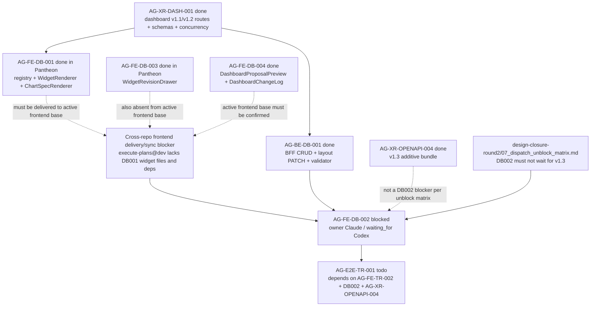

# AG-FE-DB-002 Sidecar Acceptance Follow-up 23

| Field | Value |
|---|---|
| Task ID | `AG-FE-DB-002-SIDECAR-ACCEPTANCE-FOLLOWUP-23` |
| Helper kind | `acceptance_packet` |
| Parent task | `AG-FE-DB-002` - Drag/resize/add/remove/change chart editor |
| Current parent owner / reviewer | `Claude` / `Claude2` |
| Parent waiting_for | `Codex` |
| Prepared by | `Codex` |
| Reviewer | `Claude2` |
| Date | `2026-06-21` |
| Baseline | follow-up 22 closeout merged to `dev` at `f0f33ca6` (PR #2052) |
| Current dev | `0e5b9b42` (PR #2082) |
| Mutates canonical truth | `false` |
| Status | Ready for review |

## Purpose

This packet is a support-only refresh for `AG-FE-DB-002`. It updates the
acceptance checklist, dependency map, and reviewer handoff after
`AG-FE-DB-002-SIDECAR-ACCEPTANCE-FOLLOWUP-22` was reviewed, finalized, and
archived `done`.

The material change since the older packets is not a new DB002 runtime surface.
It is the current design-closure and frontend-delivery interpretation:

- `docs/04/pantheon_agora_cross_repo_2026-06-20/design-closure-round2/07_dispatch_unblock_matrix.md`
  now says `AG-FE-DB-002` must not wait for v1.3.
- The same matrix says the blocker is cross-repo delivery: reviewed
  `AG-FE-DB-001` files must actually be present in `execute-plans@dev`, then
  DB002 is retried.
- Current `execute-plans` remote refs still do not contain the DB001 widget
  registry/renderers, DB003/DB004 dashboard/widget surfaces, or the
  `react-grid-layout`/ECharts dependency set on `origin/main` or `origin/dev`.

This sidecar does not reopen, unblock, implement, or close the parent. It does
not change runtime, registry, schema, OpenAPI, BFF, governance, broker,
RuntimeBinding, L1, or L2 truth surfaces.

## Reviewed Evidence Chain

All prior DB002 support packets through follow-up 22 are durable. Follow-up 22
is archived `done` and records review approval plus owner closeout:

| Sidecar | State | Key decision or evidence |
|---|---|---|
| `AG-FE-DB-002-SIDECAR-ACCEPTANCE` | `done` PR #1870 | Original mirror waiver, V10/V11 waiver, 13-item acceptance checklist, dependency map |
| `AG-FE-DB-002-SIDECAR-ACCEPTANCE-FOLLOWUP-2` | `done` PR #1887 | Parent blocked-status distinction and DashboardGridEditor composition gates |
| `AG-FE-DB-002-SIDECAR-ACCEPTANCE-FOLLOWUP-3` | `done` PR #1894 | Current-dev compose surface and closeout refresh |
| `AG-FE-DB-002-SIDECAR-ACCEPTANCE-FOLLOWUP-4` | `done` PR #1903 | Parent blocked-status preservation and dependency refresh |
| `AG-FE-DB-002-SIDECAR-ACCEPTANCE-FOLLOWUP-5` | `done` PR #1910 | Waiver evidence routing, dependency map refresh, support-only boundary |
| `AG-FE-DB-002-SIDECAR-ACCEPTANCE-FOLLOWUP-6` | `done` PR #1914 | Compressed handoff packet and parent blocked-state confirmation |
| `AG-FE-DB-002-SIDECAR-ACCEPTANCE-FOLLOWUP-7` | `done` PR #1917 | Evidence routing and compose-surface refresh through followup-6 |
| `AG-FE-DB-002-SIDECAR-ACCEPTANCE-FOLLOWUP-8` | `done` PR #1922/#1923 | Evidence chain refreshed through followup-7, finalization record added |
| `AG-FE-DB-002-SIDECAR-ACCEPTANCE-FOLLOWUP-9` | `done` PR #1933/#1937 | Current-dev acceptance refresh through followup-8 and closeout record |
| `AG-FE-DB-002-SIDECAR-ACCEPTANCE-FOLLOWUP-10` | `done` PR #1942 | Current-dev acceptance refresh through followup-9 and closeout record |
| `AG-FE-DB-002-SIDECAR-ACCEPTANCE-FOLLOWUP-11` | `done` PR #1947 | Current-dev acceptance refresh through followup-10 and closeout record |
| `AG-FE-DB-002-SIDECAR-ACCEPTANCE-FOLLOWUP-12` | `done` PR #1958 | Current-dev acceptance refresh through followup-11; Codex reviewed |
| `AG-FE-DB-002-SIDECAR-ACCEPTANCE-FOLLOWUP-13` | `done` PR #1963 | Current-dev acceptance refresh through followup-12; Claude2 reviewed |
| `AG-FE-DB-002-SIDECAR-ACCEPTANCE-FOLLOWUP-14` | `done` PR #1972 | Current-dev acceptance refresh through followup-13; Claude2 reviewed; closeout record merged |
| `AG-FE-DB-002-SIDECAR-ACCEPTANCE-FOLLOWUP-15` | `done` PR #1995 | Current-dev acceptance refresh through followup-14; Codex reviewed; v1.2 contract freshness note merged |
| `AG-FE-DB-002-SIDECAR-ACCEPTANCE-FOLLOWUP-16` | `done` PR #2002 | Packet, Codex review record, and closeout records merged; parent remained blocked |
| `AG-FE-DB-002-SIDECAR-ACCEPTANCE-FOLLOWUP-17` | `done` PR #2010 | Packet and closeout records merged; post-followup-16 delta confirmed unrelated |
| `AG-FE-DB-002-SIDECAR-ACCEPTANCE-FOLLOWUP-18` | `done` PR #2013 | Packet, Claude2 review, and closeout merged; post-followup-17 delta confirmed unrelated |
| `AG-FE-DB-002-SIDECAR-ACCEPTANCE-FOLLOWUP-19` | `done` PR #2034 | Packet reviewed by Codex2; post-followup-18 delta confirmed unrelated to DB002 dashboard layout semantics |
| `AG-FE-DB-002-SIDECAR-ACCEPTANCE-FOLLOWUP-20` | `done` PR #2037 | Packet reviewed by Codex2; post-followup-19 delta confirmed unrelated; parent remained blocked waiting for Codex absorption |
| `AG-FE-DB-002-SIDECAR-ACCEPTANCE-FOLLOWUP-21` | `done` PR #2041 | Packet reviewed by Codex2; post-followup-20 strategy-workshop delta confirmed unrelated; parent remained blocked waiting for Codex absorption |
| `AG-FE-DB-002-SIDECAR-ACCEPTANCE-FOLLOWUP-22` | `done` packet PR #2049 / closeout PR #2052 | Packet and Codex2 review record merged; parent remained blocked waiting for Codex absorption |

Follow-up 22 archived status records PR #2049 and PR #2052 merged into `dev`,
review file
`support/sidecars/AG-FE-DB-002/AG-FE-DB-002-SIDECAR-ACCEPTANCE-FOLLOWUP-22-REVIEW.md`,
and parent `AG-FE-DB-002` still blocked.

## Current Dev Delta Since Follow-up 22 Closeout

Follow-up 22 closeout merged to `dev` at `f0f33ca6`. Current `origin/dev`
during this packet is `0e5b9b42`.

`git log --first-parent --oneline f0f33ca6..origin/dev` shows later merges in
these groups:

| Area | Merged work since follow-up 22 closeout | DB002 consequence |
|---|---|---|
| Design-closure round2 tasks and reviews | AG-DES-VERS/RS/SSE/TR/CARD/E2E implementation, acceptance, review, and review-verdict packets. | The already-merged round2 unblock matrix explicitly says DB002 must not wait for v1.3 and instead needs cross-repo AG-FE-DB-001 delivery into `execute-plans@dev`. |
| AG-XR-OPENAPI-004 | Additive Agora v1.3 OpenAPI/capability/schema bundle and hashes. | `AG-XR-OPENAPI-004` is archived `done`, but DB002 remains a delivery/sync issue rather than a v1.3 design blocker. The v1.3 OpenAPI file does not add or alter the dashboard layout PATCH route used by DB002. |
| Management live-evidence and stream-control fixes | Release-gate artifact verification and Management AI stream-control/BFF adjustments. | Not a DB002 dashboard editor/widget route change. Parent validation should still account for current CI gates at closeout. |
| Strategy-workshop sidecar/support work | AG-BE-SW-002 and AG-BE-SW-004 support/handoff packets. | Separate strategy-workshop support material. No DB002 dashboard editor implementation surface. |
| Frontend identity sidecar support | AG-FE-ID-001 sidecar BFF handoff follow-up 30. | Separate identity/BFF handoff material. No DB002 dashboard editor implementation surface. |

Path-limited delta from `f0f33ca6` to `origin/dev` confirms:

```text
git diff --name-status f0f33ca6 origin/dev -- \
  execute-plans/src/agora/dashboard \
  execute-plans/src/agora/widgets \
  execute-plans/src/lib/bff-v1/agora \
  services/control-plane/openapi \
  services/control-plane/specs/agora \
  docs/04/pantheon_agora_cross_repo_2026-06-20/design-closure-round2
```

Only v1.3 OpenAPI/spec files and a design-review artifact appear under those
paths. There is still no `DashboardGridEditor.tsx` on current `dev`, and no
DB002 implementation claim can be made.

## Current State Snapshot

| Surface | Observed state | Acceptance consequence |
|---|---|---|
| `AG-FE-DB-002` | Active `blocked`; owner `Claude`; reviewer `Claude2`; `waiting_for` `Codex`. | Parent remains blocked until `Codex` records an absorption decision or a new concrete blocker. |
| `AG-FE-DB-002-SIDECAR-ACCEPTANCE-FOLLOWUP-23` | Active `in_progress`; owner `Codex`; reviewer `Claude2`; artifact is this packet. | Owner should commit and hand this packet to `Claude2` for review. Parent status remains unchanged. |
| `AG-FE-DB-002-SIDECAR-ACCEPTANCE-FOLLOWUP-22` | Archived `done`; packet PR #2049 and closeout PR #2052 merged; Codex2 review preserved. | Follow-up 23 starts from finalized follow-up 22 evidence instead of reopening earlier packets. |
| `AG-XR-DASH-001` | Archived `done`. | v1.1 dashboard routes, v2 schemas, ETag/If-Match, expected version, idempotency, and 409 conflict semantics are available in Pantheon. |
| `AG-XR-OPENAPI-004` | Archived `done`. | v1.3 bundle is complete, but DB002 must not wait for it; DB002 still uses dashboard layout semantics from the dashboard contract chain. |
| `AG-BE-DB-001` | Archived `done`. | Dashboard BFF CRUD, layout PATCH, widget validator, append-only versioning, and core A3 safety rules are merged in Pantheon. |
| `AG-FE-DB-001` | Archived `done` in Pantheon. | The reviewed registry/renderer artifacts exist in the Pantheon legacy mirror, but the active `execute-plans` remote base still lacks them. |
| `AG-FE-DB-003` | Archived `done` in Pantheon. | `WidgetRevisionDrawer` exists in the Pantheon legacy mirror, but the active `execute-plans` remote base still lacks it. |
| `AG-FE-DB-004` | Archived `done` with `repository_id` `execute_plans`, but current remote/base inspection still lacks dashboard proposal/change-log files. | Parent DB002 must not assume DB004 compose surfaces are present on the frontend base until the correct `execute-plans` delivery commit is identified. |
| Pantheon `execute-plans/` path | Contains DB001/003/004 mirror artifacts and deps, but `.gitignore` labels new files under this legacy path as phantom mirror artifacts. | This is evidence for what was reviewed, not sufficient delivery proof for the active frontend repo. |
| `/home/lupin/code/execute-plans` local checkout | On `task/AG-FE-ID-001`; clean; remote `origin` is `ajoe734/execute-plans`. | Read-only inspection only; this sidecar does not change the frontend repo. |
| `execute-plans` remote `origin/main` | Only `package.json` matched the inspected Agora/widget/dashboard paths; no DB001 widget files, no DB002 editor, no DB003/DB004 surfaces. | Not ready for DB002 implementation. |
| `execute-plans` remote `origin/dev` | Has `src/lib/bff-v1/agora/types.ts`, but no widget/dashboard implementation files and no dashboard layout route in generated types. | Cross-repo type and frontend implementation delivery is still incomplete for DB002. |
| `DashboardGridEditor` | Absent from Pantheon mirror and active frontend remote bases. | Parent implementation remains incomplete. |
| `AG-FE-TR-002` | Active `todo`; depends on `AG-FE-TR-001`, `AG-BE-CP-001`, and `AG-XR-OPENAPI-004`. | Separate Trading Room UI work; it does not unblock DB002. |
| `AG-E2E-TR-001` | Active `todo`; depends on `AG-FE-TR-002`, `AG-FE-DB-002`, and `AG-XR-OPENAPI-004`. | E2E must wait for DB002 implementation, review, merge, and closure. |

## Parent Blocker Absorption

The parent blocker currently says implementation would either add ignored
phantom files in Pantheon or silently re-implement/sweep AG-FE-DB-001 into the
wrong `execute-plans` branch. Current evidence supports preserving that blocker,
with one refinement:

| Blocker point | Follow-up 23 answer |
|---|---|
| `execute-plans/` in this Pantheon repo is gitignored and labelled a phantom mirror path. | Accurate for new DB002 work. Do not add `DashboardGridEditor` under the Pantheon legacy mirror as the parent implementation path. |
| Older sidecars allowed explicit `worker_commit.py --scope execute-plans/...` mirror commits. | That remains historical evidence for prior Pantheon-side packets, but the current round2 unblock matrix narrows DB002 to cross-repo delivery into `execute-plans@dev`. |
| AG-FE-DB-001 reviewed files are missing from the active frontend repo/base. | Still true after fetching `ajoe734/execute-plans`; `origin/main` and `origin/dev` lack the widget registry/renderers and grid/chart dependency set. |
| Missing V10/V11 visual snapshots. | Not the decisive blocker now. The decisive blocker is frontend cross-repo delivery/sync of the reviewed compose surface. Visual references remain a parent reviewer/design concern if a DB002 implementation branch becomes available. |
| v1.3 design closure landed. | It does not block DB002. `07_dispatch_unblock_matrix.md` explicitly says DB002 must not wait for v1.3; it must wait for reviewed AG-FE-DB-001 files to be present in `execute-plans@dev`. |

Recommended parent path:

1. `Codex`, as current `waiting_for`, records that reviewed sidecar evidence
   through follow-up 23 is absorbed only as a refined blocker: DB002 should wait
   for cross-repo delivery/sync of AG-FE-DB-001 into the active frontend base.
2. A separate frontend delivery/sync task should identify the correct
   `execute-plans` target branch and deliver the reviewed DB001 compose surface
   there, including generated dashboard contract types and dependencies.
3. After `execute-plans@dev` or the agreed frontend delivery base contains the
   required DB001 surface, DB002 can be retried by the parent owner.
4. If the parent owner/reviewer chooses a base other than `execute-plans@dev`,
   that decision should be recorded explicitly before implementation resumes.

This packet intentionally does not recommend reopening `AG-FE-DB-002` today,
because the inspected active frontend remote still lacks the compose surface
that the latest unblock matrix requires.

## Current Dev Compose Surface

| Surface | Current file or dependency | DB002 usage rule |
|---|---|---|
| DB002 route contract | `services/control-plane/openapi/agora_v1_2.openapi.yaml` and Pantheon mirror `execute-plans/src/lib/bff-v1/agora/types.ts` include `patchDashboardRecipeLayout`. | Parent must use generated route metadata once the active frontend repo has a compatible generated contract surface. |
| v1.3 contract | `services/control-plane/openapi/agora_v1_3.openapi.yaml` and `services/control-plane/specs/agora/v4/*`. | Not a DB002 blocker; do not wait on v1.3 for dashboard grid work. |
| Registry gate | Pantheon mirror `execute-plans/src/agora/widgets/registry.ts`. | Reviewed evidence exists, but active frontend repo must receive it before DB002 composes it. |
| Widget rendering | Pantheon mirror `execute-plans/src/agora/widgets/WidgetRenderer.tsx`. | Parent must not fork widget rendering; it must compose the delivered frontend version. |
| Chart rendering | Pantheon mirror `execute-plans/src/agora/widgets/ChartSpecRenderer.tsx`. | Parent must delegate chart display and avoid arbitrary HTML/JS, iframes, `eval`, `new Function`, or `dangerouslySetInnerHTML`. |
| Widget revision | Pantheon mirror `execute-plans/src/agora/widgets/WidgetRevisionDrawer.tsx`. | Chart/widget changes should compose the delivered DB003 surface or its accepted result boundary. |
| Proposal/history/rollback | Pantheon mirror `execute-plans/src/agora/dashboard/DashboardProposalPreview.tsx`, `DashboardChangeLog.tsx`. | Preserve DB004 ownership if those files are present on the agreed frontend base. |
| Layout dependency | Pantheon mirror `package.json` contains `react-grid-layout` and `@types/react-grid-layout`; active `execute-plans` remote does not. | Do not implement DB002 until the dependency is present or the dependency addition is explicitly part of the frontend delivery task. |

## Parent Acceptance Checklist

| Area | Parent pass condition |
|---|---|
| Repository target | Implement in the active `ajoe734/execute-plans` task branch or agreed frontend delivery worktree, not in the Pantheon legacy mirror path. |
| Compose-surface proof | Before DB002 implementation starts, verify AG-FE-DB-001 registry/renderers, generated dashboard route types, and required dependencies are present on the chosen frontend base. |
| Component ownership | Add `DashboardGridEditor` and focused tests only unless a typed layout PATCH helper is strictly required. |
| Contract freshness | Confirm generated Agora types expose the dashboard layout PATCH route and request/response fields; do not hand-write missing contract shapes. |
| Grid library | Use `react-grid-layout`; no alternate grid library and no custom drag engine. |
| Editable gestures | Tests cover drag, resize, add, remove, and chart-change. |
| Placement shape | Layout mutations produce `WidgetPlacement`-compatible records with `widget_id`, `x`, `y`, `w`, `h`, `min_w`, `min_h`, and preserve optional `max_w`, `max_h`, `pinned`. |
| Patch operation allowlist | Layout writes use only `move_widget`, `resize_widget`, `remove_widget`, `add_registered_widget`, `replace_chart_spec`, or `update_widget_query`. |
| BFF route | Layout PATCH targets `/bff/agora/dashboard-recipes/{recipe_id}/layout` through the typed Agora BFF helper surface. |
| Concurrency | State-changing layout writes include current ETag/`If-Match`, `expected_version`, and `Idempotency-Key`; 409 `CONCURRENT_MODIFICATION` is visible and never overwritten silently. |
| Personalization event | Every layout or chart mutation emits a schema-compatible `PersonalizationEvent` with dashboard recipe context. |
| Registry validation | Add/change flows call the delivered registry gate and, where server validation is needed, the BFF widget validate helper. Unknown, inactive, unsupported chart kind, blocked interaction, unapproved data source, or sensitivity downgrade cases fail closed. |
| Renderer composition | Every widget frame renders through `WidgetRenderer`; DB002 must not fork chart rendering or built-in widget cards. |
| Sensitivity | Pass allowed sensitivity context to `WidgetRenderer`; do not render data above operator scope. |
| Pinned guard | `pinned: true` placements cannot be moved or resized; tests cover this guard. |
| DB003/DB004 composition | Compose delivered DB003/DB004 surfaces where present; otherwise block for delivery/sync rather than reimplementing their ownership areas. |
| Runtime boundary | No order placement, broker invocation, capital binding, RuntimeBinding write, management route, arbitrary HTML/JS, iframe, `eval`, `new Function`, or `dangerouslySetInnerHTML`. |
| Verification | Focused editor tests, widget/dashboard regression tests, frontend build, contract drift checks when generated contract surfaces are touched, current release-gate-relevant smoke checks, and `git diff --check` are recorded in parent closeout. |

## Dependency Map



Dependency notes:

- Upstream Pantheon-side dashboard backend and renderer evidence is reviewed
  and archived, but active frontend delivery is not proven.
- `AG-XR-OPENAPI-004` is done and should unblock v1.3-dependent downstream
  tasks, but it is not the DB002 blocker.
- `execute-plans` remote `origin/dev` exists, but currently lacks the DB001
  widget files, DB003/DB004 UI files, `react-grid-layout`, ECharts dependency
  set, and dashboard layout route in generated frontend types.
- `AG-E2E-TR-001` must continue to wait for DB002 parent implementation and
  closure.

## Suggested Parent Verification

Before retrying parent implementation, verify the active frontend base:

```bash
git -C /home/lupin/code/execute-plans fetch origin --prune
git -C /home/lupin/code/execute-plans ls-tree -r --name-only origin/dev src/agora src/lib package.json
git -C /home/lupin/code/execute-plans show origin/dev:package.json | rg "react-grid-layout|@types/react-grid-layout|echarts|echarts-for-react|recharts"
git -C /home/lupin/code/execute-plans show origin/dev:src/lib/bff-v1/agora/types.ts | rg "patchDashboardRecipeLayout|dashboard-recipes"
```

Once the compose surface exists and DB002 is implemented:

```bash
npm --prefix /home/lupin/code/execute-plans test -- --run src/agora/dashboard/DashboardGridEditor
npm --prefix /home/lupin/code/execute-plans test -- --run src/agora/widgets src/agora/dashboard
npm --prefix /home/lupin/code/execute-plans run build:agora
git diff --check
```

Keep Pantheon contract checks if generated Agora contract surfaces are touched:

```bash
node execute-plans/scripts/generate-agora-types.mjs --check --pantheon-root .
python3 scripts/agora_schema_bundle.py --verify
python3 -m pytest scripts/test_agora_v1_2_bundle.py -q
```

## Sidecar Verification Performed

Commands used while preparing this support packet:

```bash
git status -sb
git branch --show-current
git remote -v
git fetch origin --prune
git merge --ff-only origin/dev
AI_NAME=Codex ./scripts/ai-status.sh show AG-FE-DB-002-SIDECAR-ACCEPTANCE-FOLLOWUP-23
AI_NAME=Codex ./scripts/ai-status.sh show AG-FE-DB-002-SIDECAR-ACCEPTANCE-FOLLOWUP-22
AI_NAME=Codex ./scripts/ai-status.sh show AG-FE-DB-002
AI_NAME=Codex ./scripts/ai-status.sh show AG-FE-DB-001
AI_NAME=Codex ./scripts/ai-status.sh show AG-FE-DB-003
AI_NAME=Codex ./scripts/ai-status.sh show AG-FE-DB-004
AI_NAME=Codex ./scripts/ai-status.sh show AG-XR-DASH-001
AI_NAME=Codex ./scripts/ai-status.sh show AG-XR-OPENAPI-004
AI_NAME=Codex ./scripts/ai-status.sh show AG-BE-DB-001
AI_NAME=Codex ./scripts/ai-status.sh show AG-FE-TR-002
AI_NAME=Codex ./scripts/ai-status.sh show AG-E2E-TR-001
git rev-parse origin/dev
git log --first-parent --oneline f0f33ca687e39c143e5c72b7f64f96718276ee16..origin/dev
git diff --name-status f0f33ca687e39c143e5c72b7f64f96718276ee16 origin/dev
git diff --name-status f0f33ca687e39c143e5c72b7f64f96718276ee16 origin/dev -- execute-plans/src/agora/dashboard execute-plans/src/agora/widgets execute-plans/src/lib/bff-v1/agora services/control-plane/openapi services/control-plane/specs/agora docs/04/pantheon_agora_cross_repo_2026-06-20/design-closure-round2
find execute-plans/src/agora -maxdepth 3 -type f
rg -n "react-grid-layout|@types/react-grid-layout|echarts|echarts-for-react|recharts" execute-plans/package.json
rg -n "WidgetRenderer|ChartSpecRenderer|validateWidgetSpecAgainstRegistry|WidgetRevisionDrawer|DashboardProposalPreview|DashboardChangeLog" execute-plans/src/agora execute-plans/src/lib/bff-v1/agora
git -C /home/lupin/code/execute-plans fetch origin --prune
git -C /home/lupin/code/execute-plans ls-remote --heads origin main dev task/AG-FE-DB-001 task/AG-FE-DB-003 task/AG-FE-DB-004 task/AG-FE-DB-002
git -C /home/lupin/code/execute-plans ls-tree -r --name-only origin/main src/agora src/lib package.json
git -C /home/lupin/code/execute-plans ls-tree -r --name-only origin/dev src/agora src/lib package.json
git -C /home/lupin/code/execute-plans show origin/dev:src/lib/bff-v1/agora/types.ts | rg "patchDashboardRecipeLayout|dashboard-recipes|move_widget|resize_widget|add_registered_widget"
```

Sidecar-local validation:

```bash
git diff --check -- support/sidecars/AG-FE-DB-002/AG-FE-DB-002-SIDECAR-ACCEPTANCE-FOLLOWUP-23.md
```

## Reviewer Handoff

To `Claude2`, sidecar reviewer:

Please review this packet for:

1. Support-only boundary: it changes only this sidecar artifact and task brief,
   and it does not claim parent runtime completion.
2. Accuracy of the follow-up 22 to current-dev delta, especially the effect of
   design-closure round2 and `AG-XR-OPENAPI-004`.
3. Correct interpretation of the newest DB002 unblock matrix: DB002 must not
   wait for v1.3, but it must wait for AG-FE-DB-001 compose files to be present
   in the active `execute-plans` frontend base.
4. Completeness of the parent acceptance checklist and dependency map.
5. Correct parent handoff: parent `AG-FE-DB-002` remains `blocked` and
   `waiting_for` `Codex`; this packet asks for an absorption/blocker decision,
   not for parent implementation or closeout.

Suggested reviewer approval command:

```bash
AI_NAME=Claude2 ./scripts/ai-status.sh approve AG-FE-DB-002-SIDECAR-ACCEPTANCE-FOLLOWUP-23 "Review approved: follow-up 23 packet is support-only; it correctly identifies DB002 as blocked on cross-repo execute-plans delivery of AG-FE-DB-001 rather than v1.3, and preserves parent blocked state."
```
