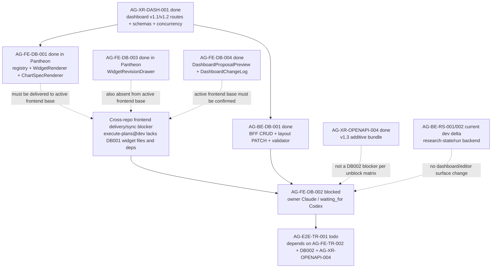

# AG-FE-DB-002 Sidecar Acceptance Follow-up 24

| Field | Value |
|---|---|
| Task ID | `AG-FE-DB-002-SIDECAR-ACCEPTANCE-FOLLOWUP-24` |
| Helper kind | `acceptance_packet` |
| Parent task | `AG-FE-DB-002` - Drag/resize/add/remove/change chart editor |
| Current parent owner / reviewer | `Claude` / `Claude2` |
| Parent waiting_for | `Codex` |
| Prepared by | `Codex` |
| Reviewer | `Claude` |
| Date | `2026-06-21` |
| Baseline | follow-up 23 archived `done`, PR #2083 merged to `dev` at `a8e7034011d8ee9eede9e78b7df2c52076bb984a` |
| Current dev | `3566d9e6ee1f531e84c536fd3ff0d4b44e0744c4` (PR #2094) |
| Mutates canonical truth | `false` |
| Status | Ready for review |

## Purpose

This packet is a support-only refresh for `AG-FE-DB-002`. It updates the
acceptance checklist, dependency map, and reviewer handoff after
`AG-FE-DB-002-SIDECAR-ACCEPTANCE-FOLLOWUP-23` was reviewed, finalized, and
archived `done`.

The material conclusion is unchanged from follow-up 23:

- `AG-FE-DB-002` should not wait for Agora v1.3. `AG-XR-OPENAPI-004` is
  archived `done`, and the round2 unblock matrix already treats v1.3 as
  non-blocking for DB002.
- The decisive blocker is still frontend cross-repo delivery/sync. The active
  `execute-plans` remote base lacks the reviewed `AG-FE-DB-001` widget
  registry/renderers, DB003/DB004 compose surfaces, generated dashboard layout
  route inventory, and `react-grid-layout`/ECharts dependency set needed for
  `DashboardGridEditor`.
- The Pantheon in-repo `execute-plans/` mirror still contains reviewed evidence
  from DB001/DB003/DB004, but it is not the current frontend delivery truth for
  new DB002 implementation.

This sidecar does not reopen, unblock, implement, or close the parent. It does
not change runtime, registry, schema, OpenAPI, BFF, governance, broker,
RuntimeBinding, L1, or L2 truth surfaces.

## Reviewed Evidence Chain

The prior DB002 support chain is durable. Follow-up 23 is archived `done` and
records Claude2 approval:

| Sidecar | State | Key decision or evidence |
|---|---|---|
| `AG-FE-DB-002-SIDECAR-ACCEPTANCE` | `done` PR #1870 | Original mirror waiver, V10/V11 waiver, acceptance checklist, dependency map |
| `AG-FE-DB-002-SIDECAR-ACCEPTANCE-FOLLOWUP-2` through `FOLLOWUP-14` | `done` PRs #1887-#1972 | Repeated support-only refreshes preserving parent blocked state and DB002 compose rules |
| `AG-FE-DB-002-SIDECAR-ACCEPTANCE-FOLLOWUP-15` | `done` PR #1995 | v1.2 contract freshness note merged; parent remained blocked |
| `AG-FE-DB-002-SIDECAR-ACCEPTANCE-FOLLOWUP-16` | `done` PR #2002 | Packet, review record, and closeout records merged |
| `AG-FE-DB-002-SIDECAR-ACCEPTANCE-FOLLOWUP-17` | `done` PR #2010 | Post-followup-16 delta confirmed unrelated |
| `AG-FE-DB-002-SIDECAR-ACCEPTANCE-FOLLOWUP-18` | `done` PR #2013 | Packet, Claude2 review, and closeout merged |
| `AG-FE-DB-002-SIDECAR-ACCEPTANCE-FOLLOWUP-19` | `done` PR #2034 | Post-followup-18 delta confirmed unrelated to DB002 dashboard layout semantics |
| `AG-FE-DB-002-SIDECAR-ACCEPTANCE-FOLLOWUP-20` | `done` PR #2037 | Parent remained blocked waiting for Codex absorption |
| `AG-FE-DB-002-SIDECAR-ACCEPTANCE-FOLLOWUP-21` | `done` PR #2041 | Strategy-workshop delta confirmed unrelated |
| `AG-FE-DB-002-SIDECAR-ACCEPTANCE-FOLLOWUP-22` | `done` packet PR #2049 / closeout PR #2052 | Packet and Codex2 review record merged; parent remained blocked |
| `AG-FE-DB-002-SIDECAR-ACCEPTANCE-FOLLOWUP-23` | `done` PR #2083 | Claude2 approved the refined blocker: DB002 is blocked on active `execute-plans` delivery of AG-FE-DB-001, not on v1.3 |

Follow-up 23 archived status records support-only packet approval, no canonical
truth mutation, and parent `AG-FE-DB-002` still active `blocked` with
`waiting_for` `Codex`.

## Current Dev Delta Since Follow-up 23 Closeout

Follow-up 23 merged to `dev` at `a8e7034011d8ee9eede9e78b7df2c52076bb984a`.
Current `origin/dev` during this packet is
`3566d9e6ee1f531e84c536fd3ff0d4b44e0744c4`.

`git log --first-parent --oneline a8e7034011d8ee9eede9e78b7df2c52076bb984a..origin/dev`
shows these later merges:

| Area | Merged work since follow-up 23 | DB002 consequence |
|---|---|---|
| AG-BE-RS-001 support and implementation | PRs #2086, #2087, #2088, #2089, #2091 added research-state task briefs, BFF handoff support packets, and backend research-state work. | Separate research-state backend/handoff work. It does not add `DashboardGridEditor`, frontend widget registry delivery, dashboard layout helpers, or DB002 UI dependencies. |
| AG-BE-RS-002 support, implementation, and closeout | PRs #2090, #2092, #2094 added unified research run/progress/result projection code, BFF tests, handoff packet, and closeout evidence. | Backend research-run projection only. It touches `services/control-plane/bff/agora/research/*` and tests, not the DB002 dashboard editor or widget compose surface. |
| AG-FE-ID-001 sidecar support | PR #2093 added identity BFF handoff follow-up 31. | Separate frontend identity support material. No DB002 dashboard editor implementation surface. |

`git diff --name-status a8e7034011d8ee9eede9e78b7df2c52076bb984a origin/dev`
lists only research-state/research-run BFF files, tests, task briefs, and
sidecar packets:

- `.orchestrator/task-briefs/ag_be_rs_001*.md`
- `.orchestrator/task-briefs/ag_be_rs_002*.md`
- `services/control-plane/bff/agora/research/router.py`
- `services/control-plane/bff/agora/research/store.py`
- `services/control-plane/bff/agora/strategy_workshop/router.py`
- `services/control-plane/bff/tests/test_agora_research_run_projection.py`
- `services/control-plane/bff/tests/test_workshop_stream_ag_be_sw_004.py`
- `support/sidecars/AG-BE-RS-001/*`
- `support/sidecars/AG-BE-RS-002/*`
- `support/sidecars/AG-FE-ID-001/AG-FE-ID-001-SIDECAR-BFF-HANDOFF-FOLLOWUP-31.md`

Path-limited diff across the DB002 compose surface is empty:

```text
git diff --name-status a8e7034011d8ee9eede9e78b7df2c52076bb984a origin/dev -- \
  execute-plans/src/agora/dashboard \
  execute-plans/src/agora/widgets \
  execute-plans/src/lib/bff-v1/agora \
  services/control-plane/openapi \
  services/control-plane/specs/agora \
  docs/04/pantheon_agora_cross_repo_2026-06-20/design-closure-round2
```

No changed file in the new delta alters dashboard layout PATCH semantics,
widget registry/rendering, generated Agora frontend types, or the DB002
dependency route.

## Current State Snapshot

| Surface | Observed state | Acceptance consequence |
|---|---|---|
| `AG-FE-DB-002` | Active `blocked`; owner `Claude`; reviewer `Claude2`; `waiting_for` `Codex`. | Parent remains blocked until `Codex` records an absorption decision or a new concrete blocker. |
| `AG-FE-DB-002-SIDECAR-ACCEPTANCE-FOLLOWUP-24` | Active `in_progress`; owner `Codex`; reviewer `Claude`; artifact is this packet. | Owner should commit and hand this packet to `Claude` for review. Parent status remains unchanged. |
| `AG-FE-DB-002-SIDECAR-ACCEPTANCE-FOLLOWUP-23` | Archived `done`; PR #2083 merged; Claude2 review preserved. | Follow-up 24 starts from finalized follow-up 23 evidence instead of reopening earlier packets. |
| `AG-XR-DASH-001` | Archived `done`. | Dashboard v1.1/v1.2 routes, schemas, ETag/If-Match, expected version, idempotency, and 409 semantics remain available in Pantheon. |
| `AG-XR-OPENAPI-004` | Archived `done`. | Agora v1.3 is complete, but it is not the DB002 blocker. |
| `AG-BE-DB-001` | Archived `done`. | Dashboard BFF CRUD, layout PATCH, widget validator, append-only versioning, and core A3 safety rules remain merged in Pantheon. |
| `AG-FE-DB-001` | Archived `done` in Pantheon. | Reviewed registry/renderer artifacts exist in the Pantheon legacy mirror, but the active `execute-plans` remote base still lacks them. |
| `AG-FE-DB-003` | Archived `done` in Pantheon. | `WidgetRevisionDrawer` exists in the Pantheon legacy mirror, but the active `execute-plans` remote base still lacks it. |
| `AG-FE-DB-004` | Archived `done` in Pantheon. | Proposal/change-log files exist in the Pantheon legacy mirror, but the active frontend base still does not prove this compose surface. |
| Pantheon `execute-plans/` path | Contains DB001/003/004 mirror artifacts, `react-grid-layout`, ECharts, and generated layout route inventory. | Evidence for what was reviewed, not sufficient delivery proof for the active frontend repo. |
| `/home/lupin/code/execute-plans` local checkout | Detached HEAD; clean; remote `origin` is `ajoe734/execute-plans`. | Read-only inspection only; this sidecar does not change the frontend repo. |
| `execute-plans` remote refs | Only `main` and `dev` heads found for inspected DB task refs; no `task/AG-FE-DB-001`, `task/AG-FE-DB-002`, `task/AG-FE-DB-003`, or `task/AG-FE-DB-004` heads. | No task branch on the active frontend remote currently exposes the reviewed DB001/DB003/DB004 compose surface. |
| `execute-plans` remote `origin/main` | Contains Agora page shells and generic BFF libraries only. | No DB001 widget registry/renderers, no DB002 editor, no DB003/DB004 surfaces. |
| `execute-plans` remote `origin/dev` | Contains `src/lib/bff-v1/agora/types.ts`, but no widget/dashboard implementation files. | Still missing DB001 compose files and dashboard layout route metadata needed for DB002. |
| `execute-plans` remote dependencies | `origin/dev:package.json` matches `recharts` only; no `react-grid-layout`, `@types/react-grid-layout`, `echarts`, or `echarts-for-react`. | Parent DB002 implementation cannot assume required grid/chart dependencies on the active frontend base. |
| `DashboardGridEditor` | Absent from Pantheon mirror and active frontend remote bases. | Parent implementation remains incomplete. |
| `AG-E2E-TR-001` | Active downstream task depending on DB002. | E2E must wait for DB002 implementation, review, merge, and closure. |

## Parent Blocker Absorption

Follow-up 24 supports preserving the blocker refined by follow-up 23. The new
dev delta since follow-up 23 is Research Sprint backend/handoff work and
identity sidecar support. It does not deliver the missing frontend compose
surface and does not change DB002 route semantics.

| Blocker point | Follow-up 24 answer |
|---|---|
| Active `execute-plans` base lacks AG-FE-DB-001 widget files and dependencies. | Still true after fetching `ajoe734/execute-plans`; `origin/dev` lacks DB001 widget files, DB003/DB004 surfaces, `react-grid-layout`, ECharts, and dashboard layout route metadata. |
| Pantheon mirror contains reviewed DB001/003/004 artifacts. | Still true, but current repository guidance routes active frontend delivery through `ajoe734/execute-plans`, not new implementation under Pantheon legacy mirror. |
| v1.3 completion might unblock DB002. | Incorrect for the current blocker. `AG-XR-OPENAPI-004` is done, and the unblock matrix says DB002 must not wait for v1.3. The missing frontend compose surface remains decisive. |
| New `dev` merges might have changed DB002 compose surface. | Not in this delta. Path-limited diff across dashboard/widget/frontend Agora types/OpenAPI/specs/design-closure-round2 is empty. |

Recommended parent path:

1. `Codex`, as current `waiting_for`, records that reviewed sidecar evidence
   through follow-up 24 is absorbed as a concrete blocker: DB002 should wait for
   cross-repo delivery/sync of AG-FE-DB-001 into the active frontend base.
2. A separate frontend delivery/sync task should identify the correct
   `execute-plans` target branch and deliver the reviewed DB001 compose surface
   there, including generated dashboard contract types and dependencies.
3. After `execute-plans@dev` or the agreed frontend delivery base contains the
   required DB001 surface, DB002 can be retried by the parent owner.
4. If the parent owner/reviewer chooses a base other than `execute-plans@dev`,
   that decision should be recorded explicitly before implementation resumes.

This packet intentionally does not recommend reopening `AG-FE-DB-002` today,
because the inspected active frontend remote still lacks the compose surface
that the latest unblock matrix requires.

## Parent Acceptance Checklist

| Area | Parent pass condition |
|---|---|
| Repository target | Implement in the active `ajoe734/execute-plans` task branch or agreed frontend delivery worktree, not as new runtime work in the Pantheon legacy mirror path. |
| Compose-surface proof | Before DB002 implementation starts, verify AG-FE-DB-001 registry/renderers, generated dashboard route types, and required dependencies are present on the chosen frontend base. |
| Component ownership | Add `DashboardGridEditor` and focused tests only unless a typed layout PATCH helper is strictly required. |
| Contract freshness | Confirm generated Agora types expose the dashboard layout PATCH route and request/response fields; do not hand-write missing contract shapes. |
| Grid library | Use `react-grid-layout`; no alternate grid library and no custom drag engine. |
| Editable gestures | Tests cover drag, resize, add, remove, and chart-change. |
| Placement shape | Layout mutations produce `WidgetPlacement`-compatible records with `widget_id`, `x`, `y`, `w`, `h`, `min_w`, `min_h`, and preserve optional `max_w`, `max_h`, `pinned`. |
| Patch operation allowlist | Layout writes use only `move_widget`, `resize_widget`, `remove_widget`, `add_registered_widget`, `replace_chart_spec`, or `update_widget_query`. |
| BFF route | Layout PATCH targets `/bff/agora/dashboard-recipes/{recipe_id}/layout` through the typed Agora BFF helper surface. |
| Concurrency | State-changing layout writes include current ETag/`If-Match`, `expected_version`, and `Idempotency-Key`; 409 `CONCURRENT_MODIFICATION` is visible and never overwritten silently. |
| Personalization event | Every layout or chart mutation emits a schema-compatible `PersonalizationEvent` with dashboard recipe context. |
| Registry validation | Add/change flows call the delivered registry gate and, where server validation is needed, the BFF widget validate helper. Unknown, inactive, unsupported chart kind, blocked interaction, unapproved data source, or sensitivity downgrade cases fail closed. |
| Renderer composition | Every widget frame renders through `WidgetRenderer`; DB002 must not fork chart rendering or built-in widget cards. |
| Sensitivity | Pass allowed sensitivity context to `WidgetRenderer`; do not render data above operator scope. |
| Pinned guard | `pinned: true` placements cannot be moved or resized; tests cover this guard. |
| DB003/DB004 composition | Compose delivered DB003/DB004 surfaces where present; otherwise block for delivery/sync rather than reimplementing their ownership areas. |
| Runtime boundary | No order placement, broker invocation, capital binding, RuntimeBinding write, management route, arbitrary HTML/JS, iframe, `eval`, `new Function`, or `dangerouslySetInnerHTML`. |
| Verification | Focused editor tests, widget/dashboard regression tests, frontend build, contract drift checks when generated contract surfaces are touched, current release-gate-relevant smoke checks, and `git diff --check` are recorded in parent closeout. |

## Dependency Map



Dependency notes:

- Upstream Pantheon-side dashboard backend and renderer evidence is reviewed
  and archived, but active frontend delivery is still not proven.
- `AG-XR-OPENAPI-004` is done and should unblock v1.3-dependent downstream
  tasks, but it is not the DB002 blocker.
- `AG-BE-RS-001` and `AG-BE-RS-002` current-dev merges are backend research
  surfaces and do not affect DB002 acceptance.
- `AG-E2E-TR-001` must continue to wait for DB002 parent implementation and
  closure.

## Suggested Parent Verification

Before retrying parent implementation, verify the active frontend base:

```bash
git -C /home/lupin/code/execute-plans fetch origin --prune
git -C /home/lupin/code/execute-plans ls-tree -r --name-only origin/dev src/agora src/lib package.json
git -C /home/lupin/code/execute-plans show origin/dev:package.json | rg "react-grid-layout|@types/react-grid-layout|echarts|echarts-for-react|recharts"
git -C /home/lupin/code/execute-plans show origin/dev:src/lib/bff-v1/agora/types.ts | rg "patchDashboardRecipeLayout|dashboard-recipes"
```

Once the compose surface exists and DB002 is implemented:

```bash
npm --prefix /home/lupin/code/execute-plans test -- --run src/agora/dashboard/DashboardGridEditor
npm --prefix /home/lupin/code/execute-plans test -- --run src/agora/widgets src/agora/dashboard
npm --prefix /home/lupin/code/execute-plans run build:agora
git diff --check
```

Keep Pantheon contract checks if generated Agora contract surfaces are touched:

```bash
node execute-plans/scripts/generate-agora-types.mjs --check --pantheon-root .
python3 scripts/agora_schema_bundle.py --verify
python3 -m pytest scripts/test_agora_v1_2_bundle.py -q
```

## Sidecar Verification Performed

Commands used while preparing this support packet:

```bash
git status -sb
git branch --show-current
git remote -v
git fetch origin --prune
AI_NAME=Codex ./scripts/ai-status.sh show AG-FE-DB-002-SIDECAR-ACCEPTANCE-FOLLOWUP-24
AI_NAME=Codex ./scripts/ai-status.sh show AG-FE-DB-002-SIDECAR-ACCEPTANCE-FOLLOWUP-23
AI_NAME=Codex ./scripts/ai-status.sh show AG-FE-DB-002
AI_NAME=Codex ./scripts/ai-status.sh show AG-FE-DB-001
AI_NAME=Codex ./scripts/ai-status.sh show AG-XR-OPENAPI-004
git rev-parse --short HEAD
git rev-parse --short origin/dev
git log --first-parent --oneline a8e7034011d8ee9eede9e78b7df2c52076bb984a..origin/dev
git diff --name-status a8e7034011d8ee9eede9e78b7df2c52076bb984a origin/dev
git diff --name-status a8e7034011d8ee9eede9e78b7df2c52076bb984a origin/dev -- execute-plans/src/agora/dashboard execute-plans/src/agora/widgets execute-plans/src/lib/bff-v1/agora services/control-plane/openapi services/control-plane/specs/agora docs/04/pantheon_agora_cross_repo_2026-06-20/design-closure-round2
find execute-plans/src/agora -maxdepth 3 -type f
rg -n "react-grid-layout|@types/react-grid-layout|echarts|echarts-for-react|recharts" execute-plans/package.json
rg -n "patchDashboardRecipeLayout|dashboard-recipes|move_widget|resize_widget|add_registered_widget|WidgetPlacement" execute-plans/src/lib/bff-v1/agora services/control-plane/openapi services/control-plane/specs/agora
git -C /home/lupin/code/execute-plans fetch origin --prune
git -C /home/lupin/code/execute-plans ls-remote --heads origin main dev task/AG-FE-DB-001 task/AG-FE-DB-002 task/AG-FE-DB-003 task/AG-FE-DB-004
git -C /home/lupin/code/execute-plans ls-tree -r --name-only origin/main src/agora src/lib package.json
git -C /home/lupin/code/execute-plans ls-tree -r --name-only origin/dev src/agora src/lib package.json
git -C /home/lupin/code/execute-plans show origin/dev:package.json | rg "react-grid-layout|@types/react-grid-layout|echarts|echarts-for-react|recharts"
git -C /home/lupin/code/execute-plans show origin/dev:src/lib/bff-v1/agora/types.ts | rg "patchDashboardRecipeLayout|dashboard-recipes|move_widget|resize_widget|add_registered_widget|WidgetPlacement"
```

Sidecar-local validation:

```bash
git diff --check -- .orchestrator/task-briefs/ag_fe_db_002_sidecar_acceptance_followup_24.md support/sidecars/AG-FE-DB-002/AG-FE-DB-002-SIDECAR-ACCEPTANCE-FOLLOWUP-24.md
```

## Reviewer Handoff

To `Claude`, sidecar reviewer:

Please review this packet for:

1. Support-only boundary: it changes only this sidecar artifact and task brief,
   and it does not claim parent runtime completion.
2. Accuracy of the follow-up 23 to current-dev delta, especially that the new
   Research Sprint backend/handoff merges do not alter DB002 dashboard/editor
   or frontend compose surfaces.
3. Correct preservation of the follow-up 23 blocker interpretation: DB002 must
   not wait for v1.3, but it must wait for AG-FE-DB-001 compose files,
   dependencies, and generated dashboard route metadata to be present in the
   active `execute-plans` frontend base.
4. Completeness of the parent acceptance checklist and dependency map.
5. Correct parent handoff: parent `AG-FE-DB-002` remains `blocked` and
   `waiting_for` `Codex`; this packet asks for an absorption/blocker decision,
   not for parent implementation or closeout.

Suggested reviewer approval command:

```bash
AI_NAME=Claude ./scripts/ai-status.sh approve AG-FE-DB-002-SIDECAR-ACCEPTANCE-FOLLOWUP-24 "Review approved: follow-up 24 packet is support-only; it correctly confirms the post-followup-23 research/identity deltas do not change DB002, preserves the active execute-plans delivery blocker, and keeps parent AG-FE-DB-002 blocked pending Codex absorption."
```
