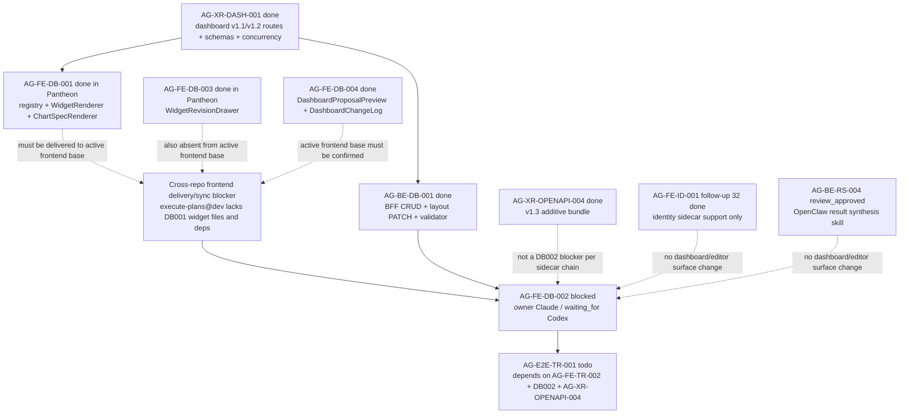

# AG-FE-DB-002 Sidecar Acceptance Follow-up 25

| Field | Value |
|---|---|
| Task ID | `AG-FE-DB-002-SIDECAR-ACCEPTANCE-FOLLOWUP-25` |
| Helper kind | `acceptance_packet` |
| Parent task | `AG-FE-DB-002` - Drag/resize/add/remove/change chart editor |
| Current parent owner / reviewer | `Claude` / `Claude2` |
| Parent waiting_for | `Codex` |
| Prepared by | `Codex` |
| Reviewer | `Claude` |
| Date | `2026-06-21` |
| Baseline | follow-up 24 archived `done`, closeout PR #2097 merged to `dev` at `7b391454eacaeb01f5d7e859a16c3906856d5557` |
| Current Pantheon dev | `9cb0158f4f8902be620ecd4326a4884754e92c21` |
| Active frontend remote | `ajoe734/execute-plans` `origin/dev` at `574cc541bf326e031a2f6bf9081e428a708b929a` |
| Mutates canonical truth | `false` |
| Status | `review_approved`; ready for Codex owner closeout |

## Purpose

This packet is a support-only refresh for `AG-FE-DB-002`. It updates the
acceptance checklist, dependency map, and reviewer handoff after
`AG-FE-DB-002-SIDECAR-ACCEPTANCE-FOLLOWUP-24` was reviewed, finalized, and
archived `done`.

The material conclusion is unchanged from follow-up 24:

- `AG-FE-DB-002` should not wait for Agora v1.3. `AG-XR-OPENAPI-004` is
  archived `done`, and the latest sidecar chain already records v1.3 as
  non-blocking for DB002.
- The decisive blocker is still active frontend delivery/sync. The active
  `execute-plans` remote base lacks the reviewed `AG-FE-DB-001` widget
  registry/renderers, DB003/DB004 compose surfaces, generated dashboard layout
  route inventory, and `react-grid-layout`/ECharts dependency set needed for
  `DashboardGridEditor`.
- The Pantheon in-repo `execute-plans/` legacy mirror still contains reviewed
  DB001/DB003/DB004 evidence, v1.2 route metadata, and dependencies, but
  `.gitignore` explicitly treats new files under that legacy path as phantom
  mirror artifacts. It is not the active frontend delivery truth.

This sidecar does not reopen, unblock, implement, or close the parent. It does
not change runtime, registry, schema, OpenAPI, BFF, governance, broker,
RuntimeBinding, L1, or L2 truth surfaces.

## Owner Closeout Note

Claude approved this packet in
`support/sidecars/AG-FE-DB-002/AG-FE-DB-002-SIDECAR-ACCEPTANCE-FOLLOWUP-25-REVIEW.md`.
Owner closeout preserves the approved support-only boundary: the sidecar
artifact and task brief may be finalized, but parent `AG-FE-DB-002` remains
blocked until the separate active `execute-plans` delivery/sync blocker is
absorbed or resolved by the parent owner flow.

After this closeout commit merges to `dev`, Codex should run:

```bash
AI_NAME=Codex ./scripts/ai-status.sh done AG-FE-DB-002-SIDECAR-ACCEPTANCE-FOLLOWUP-25 "<checkpoint message>"
```

## Reviewed Evidence Chain

The prior DB002 support chain is durable. Follow-up 24 is archived `done` and
records Claude approval:

| Sidecar | State | Key decision or evidence |
|---|---|---|
| `AG-FE-DB-002-SIDECAR-ACCEPTANCE` | `done` PR #1870 | Original mirror waiver, V10/V11 waiver, acceptance checklist, dependency map |
| `AG-FE-DB-002-SIDECAR-ACCEPTANCE-FOLLOWUP-2` through `FOLLOWUP-14` | `done` PRs #1887-#1972 | Repeated support-only refreshes preserving parent blocked state and DB002 compose rules |
| `AG-FE-DB-002-SIDECAR-ACCEPTANCE-FOLLOWUP-15` | `done` PR #1995 | v1.2 contract freshness note merged; parent remained blocked |
| `AG-FE-DB-002-SIDECAR-ACCEPTANCE-FOLLOWUP-16` | `done` PR #2002 | Packet, review record, and closeout records merged |
| `AG-FE-DB-002-SIDECAR-ACCEPTANCE-FOLLOWUP-17` | `done` PR #2010 | Post-followup-16 delta confirmed unrelated |
| `AG-FE-DB-002-SIDECAR-ACCEPTANCE-FOLLOWUP-18` | `done` PR #2013 | Packet, Claude2 review, and closeout merged |
| `AG-FE-DB-002-SIDECAR-ACCEPTANCE-FOLLOWUP-19` | `done` PR #2034 | Post-followup-18 delta confirmed unrelated to DB002 dashboard layout semantics |
| `AG-FE-DB-002-SIDECAR-ACCEPTANCE-FOLLOWUP-20` | `done` PR #2037 | Parent remained blocked waiting for Codex absorption |
| `AG-FE-DB-002-SIDECAR-ACCEPTANCE-FOLLOWUP-21` | `done` PR #2041 | Strategy-workshop delta confirmed unrelated |
| `AG-FE-DB-002-SIDECAR-ACCEPTANCE-FOLLOWUP-22` | `done` packet PR #2049 / closeout PR #2052 | Packet and Codex2 review record merged; parent remained blocked |
| `AG-FE-DB-002-SIDECAR-ACCEPTANCE-FOLLOWUP-23` | `done` PR #2083 | Claude2 approved the refined blocker: DB002 is blocked on active `execute-plans` delivery of AG-FE-DB-001, not on v1.3 |
| `AG-FE-DB-002-SIDECAR-ACCEPTANCE-FOLLOWUP-24` | `done` packet PR #2095 / closeout PR #2097 | Claude approved preserving the active `execute-plans` delivery blocker after post-followup-23 research/identity deltas |

Follow-up 24 archived status records support-only packet approval, no canonical
truth mutation, and parent `AG-FE-DB-002` still active `blocked` with
`waiting_for` `Codex`.

## Current Dev Delta Since Follow-up 24 Closeout

Follow-up 24 closeout merged to `dev` at
`7b391454eacaeb01f5d7e859a16c3906856d5557`. Current `origin/dev` during this
packet is `9cb0158f4f8902be620ecd4326a4884754e92c21`.

`git log --first-parent --oneline 7b391454eacaeb01f5d7e859a16c3906856d5557..origin/dev`
shows the follow-up 32 identity sidecar merges and the AG-BE-RS-004 merge:

| Area | Merged work since follow-up 24 | DB002 consequence |
|---|---|---|
| AG-FE-ID-001 sidecar support | PRs #2098 and #2099 added an identity BFF/frontend handoff packet, review record, and generated task brief for `AG-FE-ID-001-SIDECAR-BFF-HANDOFF-FOLLOWUP-32`. | Separate identity support material. It does not add `DashboardGridEditor`, DB001 widget files, dashboard layout helpers, or DB002 UI dependencies. |
| AG-BE-RS-004 result synthesis | PR #2096 added OpenClaw `integrations/openclaw/skills/agora/result_synthesis/*` files and a generated task brief. Central status shows `AG-BE-RS-004` active `review_approved`, owner `Claude`, reviewer `Codex`. | Separate backend/OpenClaw research-result synthesis skill. It does not add dashboard editor UI, frontend widget registry delivery, generated layout PATCH types, or DB002 dependencies. |

`git diff --name-status 7b391454eacaeb01f5d7e859a16c3906856d5557 origin/dev`
lists only:

- `.orchestrator/task-briefs/ag_be_rs_004.md`
- `.orchestrator/task-briefs/ag_fe_id_001_sidecar_bff_handoff_followup_32.md`
- `integrations/openclaw/skills/agora/result_synthesis/SPEC.md`
- `integrations/openclaw/skills/agora/result_synthesis/__init__.py`
- `integrations/openclaw/skills/agora/result_synthesis/skill.py`
- `integrations/openclaw/skills/agora/result_synthesis/test_skill.py`
- `support/sidecars/AG-FE-ID-001/AG-FE-ID-001-SIDECAR-BFF-HANDOFF-FOLLOWUP-32.md`
- `support/sidecars/AG-FE-ID-001/AG-FE-ID-001-SIDECAR-BFF-HANDOFF-FOLLOWUP-32-REVIEW.md`

Path-limited diff across the DB002 compose surface is empty:

```text
git diff --name-status 7b391454eacaeb01f5d7e859a16c3906856d5557 origin/dev -- \
  execute-plans/src/agora/dashboard \
  execute-plans/src/agora/widgets \
  execute-plans/src/lib/bff-v1/agora \
  services/control-plane/openapi \
  services/control-plane/specs/agora \
  docs/04/pantheon_agora_cross_repo_2026-06-20/design-closure-round2
```

No changed file in the new Pantheon delta alters dashboard layout PATCH
semantics, widget registry/rendering, generated Agora frontend types, or the
DB002 dependency route.

## Active Frontend Remote Snapshot

`/home/lupin/code/execute-plans` was fetched read-only from `origin`. It is a
detached, clean checkout with remote `https://github.com/ajoe734/execute-plans.git`.

| Surface | Observed state | DB002 consequence |
|---|---|---|
| Remote heads | Only `main` (`7b2f17c4dee8dcafe62c2295504df03aed0ae16e`) and `dev` (`574cc541bf326e031a2f6bf9081e428a708b929a`) are present for the inspected refs. No `task/AG-FE-DB-001`, `task/AG-FE-DB-002`, `task/AG-FE-DB-003`, or `task/AG-FE-DB-004` heads exist. | No active frontend task branch exposes the reviewed DB001/DB003/DB004 compose surface. |
| `origin/main` | Contains Agora page shells and generic BFF libraries only. | No DB001 widget registry/renderers, no DB002 editor, no DB003/DB004 surfaces. |
| `origin/dev` | Adds `src/lib/bff-v1/agora/types.ts`, but no `src/agora/widgets`, no `src/agora/dashboard`, and no `src/lib/bff-v1/agora/dashboard.ts`. | Still missing DB001 compose files and dashboard layout helper surface needed for DB002. |
| `origin/dev:package.json` | `rg "react-grid-layout|@types/react-grid-layout|echarts|echarts-for-react|recharts"` returns only `recharts`. | Parent DB002 cannot assume the approved grid/chart dependency set on the active frontend base. |
| `origin/dev:src/lib/bff-v1/agora/types.ts` | `rg "patchDashboardRecipeLayout|dashboard-recipes|move_widget|resize_widget|add_registered_widget|WidgetPlacement"` returns no matches. | Active frontend generated types do not expose the layout PATCH route/operation set needed by DB002. |

By contrast, the Pantheon legacy `execute-plans/` path currently contains
`src/agora/widgets/*`, DB003/DB004 dashboard support files,
`react-grid-layout`, ECharts dependencies, `src/lib/bff-v1/agora/dashboard.ts`,
and v1.2 generated route metadata. That evidence remains useful for review
history only; current repository guidance routes active frontend work through
the separate `ajoe734/execute-plans` repository and its Pantheon-owned dev
hosting path.

## Current State Snapshot

| Surface | Observed state | Acceptance consequence |
|---|---|---|
| `AG-FE-DB-002` | Active `blocked`; owner `Claude`; reviewer `Claude2`; `waiting_for` `Codex`. | Parent remains blocked until `Codex` records an absorption decision or a new concrete blocker. |
| `AG-FE-DB-002-SIDECAR-ACCEPTANCE-FOLLOWUP-25` | Active `review_approved`; owner `Codex`; reviewer `Claude`; artifacts are this packet and the Claude review record. | Owner should merge the closeout commit, then run `AI_NAME=Codex ./scripts/ai-status.sh done`. Parent status remains unchanged. |
| `AG-FE-DB-002-SIDECAR-ACCEPTANCE-FOLLOWUP-24` | Archived `done`; packet PR #2095 and closeout PR #2097 merged; Claude review preserved. | Follow-up 25 starts from finalized follow-up 24 evidence. |
| `AG-XR-DASH-001` | Archived `done`. | Dashboard v1.1/v1.2 routes, schemas, ETag/If-Match, expected version, idempotency, and 409 semantics remain available in Pantheon. |
| `AG-XR-OPENAPI-004` | Archived `done`. | Agora v1.3 is complete, but it is not the DB002 blocker. |
| `AG-BE-DB-001` | Archived `done`. | Dashboard BFF CRUD, layout PATCH, widget validator, append-only versioning, and core A3 safety rules remain merged in Pantheon. |
| `AG-FE-DB-001` | Archived `done` in Pantheon. | Reviewed registry/renderer artifacts exist in the Pantheon legacy mirror, but the active `execute-plans` remote base still lacks them. |
| `AG-FE-DB-003` | Archived `done` in Pantheon. | `WidgetRevisionDrawer` exists in the Pantheon legacy mirror, but the active frontend remote base still lacks it. |
| `AG-FE-DB-004` | Archived `done` in Pantheon. | Proposal/change-log files exist in the Pantheon legacy mirror, but the active frontend base still does not prove this compose surface. |
| `AG-FE-ID-001-SIDECAR-BFF-HANDOFF-FOLLOWUP-32` | Archived `done`; PRs #2098 and #2099 merged after follow-up 24. | Identity sidecar support only; no DB002 dashboard editor consequence. |
| `AG-BE-RS-004` | Active `review_approved`; PR #2096 merged OpenClaw result-synthesis skill files after follow-up 24. | Backend/OpenClaw skill work only; no DB002 dashboard editor consequence. |
| `AG-E2E-TR-001` | Active `todo`; depends on `AG-FE-TR-002`, `AG-FE-DB-002`, and `AG-XR-OPENAPI-004`. | E2E must wait for DB002 implementation, review, merge, and closure. |

## Parent Blocker Absorption

Follow-up 25 supports preserving the blocker refined by follow-up 23 and
approved again in follow-up 24. The new dev delta since follow-up 24 is identity
sidecar support plus OpenClaw result-synthesis skill work. It does not deliver
the missing frontend compose surface and does not change DB002 route semantics.

| Blocker point | Follow-up 25 answer |
|---|---|
| Active `execute-plans` base lacks AG-FE-DB-001 widget files and dependencies. | Still true after fetching `ajoe734/execute-plans`; `origin/dev` lacks DB001 widget files, DB003/DB004 surfaces, `react-grid-layout`, ECharts, and dashboard layout route metadata. |
| Pantheon mirror contains reviewed DB001/003/004 artifacts. | Still true, but `.gitignore` marks new files under the legacy in-repo path as phantom mirror artifacts; active frontend delivery must use `ajoe734/execute-plans`. |
| v1.3 completion might unblock DB002. | Incorrect for the current blocker. `AG-XR-OPENAPI-004` is done, and the missing frontend compose surface remains decisive. |
| New `dev` merges might have changed DB002 compose surface. | Not in this delta. Path-limited diff across dashboard/widget/frontend Agora types/OpenAPI/specs/design-closure-round2 is empty. |

Recommended parent path:

1. `Codex`, as current `waiting_for`, records whether the reviewed sidecar
   evidence through follow-up 25 is absorbed as a concrete blocker: DB002 should
   wait for cross-repo delivery/sync of AG-FE-DB-001 into the active frontend
   base.
2. A separate frontend delivery/sync task should identify the correct
   `execute-plans` target branch and deliver the reviewed DB001 compose surface
   there, including generated dashboard contract types and dependencies.
3. After `execute-plans@dev` or the agreed frontend delivery base contains the
   required DB001 surface, DB002 can be retried by the parent owner.
4. If the parent owner/reviewer chooses a base other than `execute-plans@dev`,
   that decision should be recorded explicitly before implementation resumes.

This packet intentionally does not recommend reopening `AG-FE-DB-002` today,
because the inspected active frontend remote still lacks the compose surface
that the latest unblock matrix requires.

## Parent Acceptance Checklist

| Area | Parent pass condition |
|---|---|
| Repository target | Implement in the active `ajoe734/execute-plans` task branch or agreed frontend delivery worktree, not as new runtime work in the Pantheon legacy mirror path. |
| Compose-surface proof | Before DB002 implementation starts, verify AG-FE-DB-001 registry/renderers, generated dashboard route types, and required dependencies are present on the chosen frontend base. |
| Component ownership | Add `DashboardGridEditor` and focused tests only unless a typed layout PATCH helper is strictly required. |
| Contract freshness | Confirm generated Agora types expose the dashboard layout PATCH route and request/response fields; do not hand-write missing contract shapes. |
| Grid library | Use `react-grid-layout`; no alternate grid library and no custom drag engine. |
| Editable gestures | Tests cover drag, resize, add, remove, and chart-change. |
| Placement shape | Layout mutations produce `WidgetPlacement`-compatible records with `widget_id`, `x`, `y`, `w`, `h`, `min_w`, `min_h`, and preserve optional `max_w`, `max_h`, `pinned`. |
| Patch operation allowlist | Layout writes use only `move_widget`, `resize_widget`, `remove_widget`, `add_registered_widget`, `replace_chart_spec`, or `update_widget_query`. |
| BFF route | Layout PATCH targets `/bff/agora/dashboard-recipes/{recipe_id}/layout` through the typed Agora BFF helper surface. |
| Concurrency | State-changing layout writes include current ETag/`If-Match`, `expected_version`, and `Idempotency-Key`; 409 `CONCURRENT_MODIFICATION` is visible and never overwritten silently. |
| Personalization event | Every layout or chart mutation emits a schema-compatible `PersonalizationEvent` with dashboard recipe context. |
| Registry validation | Add/change flows call the delivered registry gate and, where server validation is needed, the BFF widget validate helper. Unknown, inactive, unsupported chart kind, blocked interaction, unapproved data source, or sensitivity downgrade cases fail closed. |
| Renderer composition | Every widget frame renders through `WidgetRenderer`; DB002 must not fork chart rendering or built-in widget cards. |
| Sensitivity | Pass allowed sensitivity context to `WidgetRenderer`; do not render data above operator scope. |
| Pinned guard | `pinned: true` placements cannot be moved or resized; tests cover this guard. |
| DB003/DB004 composition | Compose delivered DB003/DB004 surfaces where present; otherwise block for delivery/sync rather than reimplementing their ownership areas. |
| Runtime boundary | No order placement, broker invocation, capital binding, RuntimeBinding write, management route, arbitrary HTML/JS, iframe, `eval`, `new Function`, or `dangerouslySetInnerHTML`. |
| Verification | Focused editor tests, widget/dashboard regression tests, frontend build, contract drift checks when generated contract surfaces are touched, current release-gate-relevant smoke checks, and `git diff --check` are recorded in parent closeout. |

## Dependency Map



Dependency notes:

- Upstream Pantheon-side dashboard backend and renderer evidence is reviewed
  and archived, but active frontend delivery is still not proven.
- `AG-XR-OPENAPI-004` is done and should unblock v1.3-dependent downstream
  tasks, but it is not the DB002 blocker.
- `AG-FE-ID-001-SIDECAR-BFF-HANDOFF-FOLLOWUP-32` is identity support material
  and does not affect DB002 acceptance.
- `AG-BE-RS-004` is OpenClaw result-synthesis skill work and does not affect
  DB002 acceptance.
- `AG-E2E-TR-001` must continue to wait for DB002 parent implementation and
  closure.

## Suggested Parent Verification

Before retrying parent implementation, verify the active frontend base:

```bash
git -C /home/lupin/code/execute-plans fetch origin --prune
git -C /home/lupin/code/execute-plans ls-tree -r --name-only origin/dev src/agora src/lib package.json
git -C /home/lupin/code/execute-plans show origin/dev:package.json | rg "react-grid-layout|@types/react-grid-layout|echarts|echarts-for-react|recharts"
git -C /home/lupin/code/execute-plans show origin/dev:src/lib/bff-v1/agora/types.ts | rg "patchDashboardRecipeLayout|dashboard-recipes|move_widget|resize_widget|add_registered_widget|WidgetPlacement"
```

Once the compose surface exists and DB002 is implemented:

```bash
npm --prefix /home/lupin/code/execute-plans test -- --run src/agora/dashboard/DashboardGridEditor
npm --prefix /home/lupin/code/execute-plans test -- --run src/agora/widgets src/agora/dashboard
npm --prefix /home/lupin/code/execute-plans run build:agora
git diff --check
```

Keep Pantheon contract checks if generated Agora contract surfaces are touched:

```bash
node execute-plans/scripts/generate-agora-types.mjs --check --pantheon-root .
python3 scripts/agora_schema_bundle.py --verify
python3 -m pytest scripts/test_agora_v1_2_bundle.py -q
```

## Sidecar Verification Performed

Commands used while preparing this support packet:

```bash
git status -sb
git branch --show-current
git remote -v
AI_NAME=Codex ./scripts/ai-status.sh show AG-FE-DB-002-SIDECAR-ACCEPTANCE-FOLLOWUP-25
AI_NAME=Codex ./scripts/ai-status.sh show AG-FE-DB-002-SIDECAR-ACCEPTANCE-FOLLOWUP-24
AI_NAME=Codex ./scripts/ai-status.sh show AG-FE-DB-002
AI_NAME=Codex ./scripts/ai-status.sh show AG-FE-DB-001
AI_NAME=Codex ./scripts/ai-status.sh show AG-XR-OPENAPI-004
AI_NAME=Codex ./scripts/ai-status.sh show AG-FE-ID-001-SIDECAR-BFF-HANDOFF-FOLLOWUP-32
AI_NAME=Codex ./scripts/ai-status.sh show AG-BE-RS-004
AI_NAME=Codex ./scripts/ai-status.sh show AG-E2E-TR-001
git rev-parse --short HEAD
git rev-parse --short origin/dev
git log --first-parent --oneline 7b391454eacaeb01f5d7e859a16c3906856d5557..origin/dev
git diff --name-status 7b391454eacaeb01f5d7e859a16c3906856d5557 origin/dev
git diff --name-status 7b391454eacaeb01f5d7e859a16c3906856d5557 origin/dev -- execute-plans/src/agora/dashboard execute-plans/src/agora/widgets execute-plans/src/lib/bff-v1/agora services/control-plane/openapi services/control-plane/specs/agora docs/04/pantheon_agora_cross_repo_2026-06-20/design-closure-round2
find execute-plans/src/agora -maxdepth 3 -type f
rg -n "react-grid-layout|@types/react-grid-layout|echarts|echarts-for-react|recharts" execute-plans/package.json
rg -n "patchDashboardRecipeLayout|dashboard-recipes|move_widget|resize_widget|add_registered_widget|WidgetPlacement|DashboardRecipeV2|WidgetSpecV2|ChartSpecV1" execute-plans/src/lib/bff-v1/agora services/control-plane/openapi services/control-plane/specs/agora
git -C /home/lupin/code/execute-plans fetch origin --prune
git -C /home/lupin/code/execute-plans status -sb
git -C /home/lupin/code/execute-plans remote -v
git -C /home/lupin/code/execute-plans ls-remote --heads origin main dev task/AG-FE-DB-001 task/AG-FE-DB-002 task/AG-FE-DB-003 task/AG-FE-DB-004
git -C /home/lupin/code/execute-plans ls-tree -r --name-only origin/main src/agora src/lib package.json
git -C /home/lupin/code/execute-plans ls-tree -r --name-only origin/dev src/agora src/lib package.json
git -C /home/lupin/code/execute-plans show origin/dev:package.json | rg "react-grid-layout|@types/react-grid-layout|echarts|echarts-for-react|recharts"
git -C /home/lupin/code/execute-plans show origin/dev:src/lib/bff-v1/agora/types.ts | rg "patchDashboardRecipeLayout|dashboard-recipes|move_widget|resize_widget|add_registered_widget|WidgetPlacement"
```

Sidecar-local validation:

```bash
git diff --check -- .orchestrator/task-briefs/ag_fe_db_002_sidecar_acceptance_followup_25.md support/sidecars/AG-FE-DB-002/AG-FE-DB-002-SIDECAR-ACCEPTANCE-FOLLOWUP-25.md
```

## Reviewer Handoff

This packet is ready for `Claude` review after the task PR merges. Review focus:

1. Confirm the packet remains support-only and does not mutate canonical truth
   or parent implementation state.
2. Confirm the post-followup-24 delta is unrelated to DB002.
3. Confirm the active `execute-plans` blocker is still stated narrowly:
   missing AG-FE-DB-001 compose surface, generated layout route metadata, and
   grid/chart dependencies on the active frontend delivery base.

If approved, return the task to `Codex` for owner closeout. Parent
`AG-FE-DB-002` should remain blocked unless the parent owner/reviewer records a
separate absorption decision.
