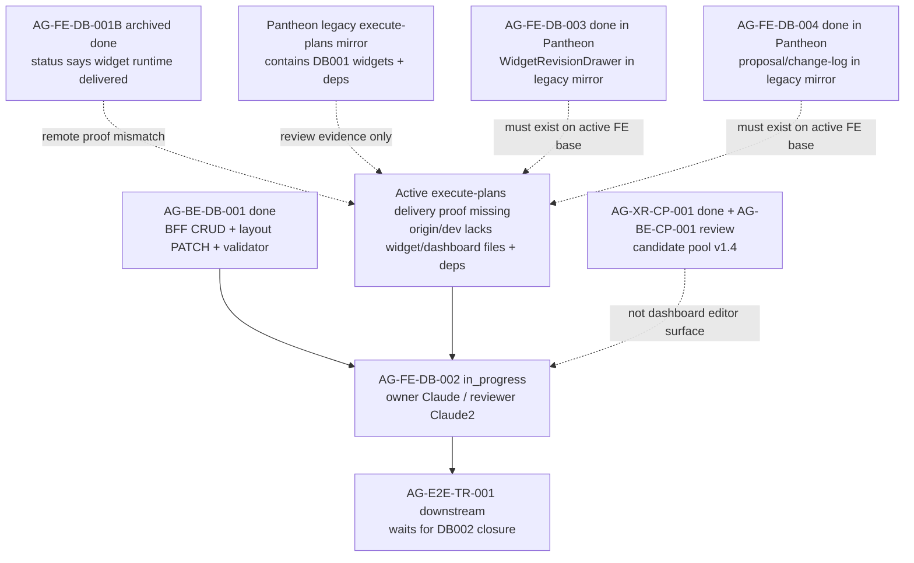

# AG-FE-DB-002 Sidecar Acceptance Follow-up 26

| Field | Value |
|---|---|
| Task ID | `AG-FE-DB-002-SIDECAR-ACCEPTANCE-FOLLOWUP-26` |
| Helper kind | `acceptance_packet` |
| Parent task | `AG-FE-DB-002` - Drag/resize/add/remove/change chart editor |
| Current parent owner / reviewer | `Claude` / `Claude2` |
| Parent status | `in_progress` |
| Parent depends_on | `AG-FE-DB-001B` |
| Prepared by | `Codex` |
| Reviewer | `Claude` |
| Date | `2026-06-22` |
| Baseline | follow-up 25 archived `done`; closeout PR #2103 merged to `dev` at `4a86998c3ebac285923f2c77287a12cceb9e9a15` |
| Current Pantheon dev | `0401cca0895f8e2b956d2338ef90160dd5a0d833` |
| Active frontend remote | `ajoe734/execute-plans` `origin/dev` at `ee835e2e6f1037e612d7929279a11efb32c61975` |
| Mutates canonical truth | `false` |
| Status | `review_approved`; ready for Codex owner closeout |

## Purpose

This packet is a support-only refresh for `AG-FE-DB-002`. It updates the
acceptance checklist, dependency map, and reviewer handoff after follow-up 25
was reviewed, finalized, and archived `done`.

The material change since follow-up 25 is a state/evidence mismatch around the
previous blocker:

- `AG-FE-DB-001B` is now archived `done`, and parent `AG-FE-DB-002` is active
  `in_progress` with `depends_on` `AG-FE-DB-001B`.
- `AG-FE-DB-001B` records delivery commit `6062cb2c` and says the widget runtime
  was delivered to execute-plans.
- Fresh read-only inspection shows `6062cb2c` is a Pantheon repository commit
  under the legacy in-repo `execute-plans/` mirror, not an object in the active
  `ajoe734/execute-plans` repository.
- Fresh read-only inspection of `ajoe734/execute-plans` `origin/dev` still lacks
  `src/agora/widgets/*`, `src/agora/dashboard/*`, `src/lib/bff-v1/agora/dashboard.ts`,
  `react-grid-layout`, ECharts, and the dashboard layout PATCH type surface.

This packet does not reopen, unblock, implement, or close the parent. It does
not change runtime, registry, schema, OpenAPI, BFF, governance, broker,
RuntimeBinding, L1, or L2 truth surfaces.

## Owner Closeout Note

Claude approved this packet in
`support/sidecars/AG-FE-DB-002/AG-FE-DB-002-SIDECAR-ACCEPTANCE-FOLLOWUP-26-REVIEW.md`.
Owner closeout preserves the approved support-only boundary: this sidecar
finalizes the packet and review support artifacts only, while parent
`AG-FE-DB-002` remains with its current owner/reviewer flow.

After this closeout commit merges to `dev`, Codex should run:

```bash
AI_NAME=Codex ./scripts/ai-status.sh done AG-FE-DB-002-SIDECAR-ACCEPTANCE-FOLLOWUP-26 "<checkpoint message>"
```

## Prior Support Chain

| Sidecar | State | Key decision or evidence |
|---|---|---|
| `AG-FE-DB-002-SIDECAR-ACCEPTANCE` | `done` PR #1870 | Original mirror waiver, V10/V11 waiver, acceptance checklist, dependency map. |
| `AG-FE-DB-002-SIDECAR-ACCEPTANCE-FOLLOWUP-2` through `FOLLOWUP-22` | `done` PRs #1887-#2052 | Repeated support-only refreshes preserving parent blocked state and DB002 compose rules. |
| `AG-FE-DB-002-SIDECAR-ACCEPTANCE-FOLLOWUP-23` | `done` PR #2083 | Refined blocker: DB002 is blocked on active `execute-plans` delivery of AG-FE-DB-001, not on v1.3. |
| `AG-FE-DB-002-SIDECAR-ACCEPTANCE-FOLLOWUP-24` | `done` packet PR #2095 / closeout PR #2097 | Preserved the active `execute-plans` delivery blocker after research/identity deltas. |
| `AG-FE-DB-002-SIDECAR-ACCEPTANCE-FOLLOWUP-25` | `done` packet PR #2101 / closeout PR #2103 | Preserved the blocker after identity support and OpenClaw RS deltas; active `execute-plans` lacked DB001 widget files and layout PATCH types. |

## Current State Snapshot

| Surface | Observed state | DB002 consequence |
|---|---|---|
| `AG-FE-DB-002` | Active `in_progress`; owner `Claude`; reviewer `Claude2`; `depends_on` `AG-FE-DB-001B`; next says reading design specs and starting `DashboardGridEditor`. | Parent may proceed only after proving the actual frontend base contains the required compose surface. |
| `AG-FE-DB-002-SIDECAR-ACCEPTANCE-FOLLOWUP-26` | Active `review_approved`; owner `Codex`; reviewer `Claude`; artifacts are this packet and the Claude review record. | Owner should merge the closeout commit, then run `AI_NAME=Codex ./scripts/ai-status.sh done`. Parent status remains unchanged. |
| `AG-FE-DB-002-SIDECAR-ACCEPTANCE-FOLLOWUP-25` | Archived `done`; closeout PR #2103 merged at `4a86998c`. | Follow-up 26 starts from finalized follow-up 25 evidence. |
| `AG-FE-DB-001B` | Archived `done`; records PR #2175/#2178 and delivery commit `6062cb2c`; review sidecar PR #2180 merged. | Status says dependency is closed, but active external frontend remote proof does not show the DB001B files on `origin/dev`. |
| `AG-BE-DB-001` | Archived `done`; dashboard BFF CRUD/layout PATCH/widget validator and optimistic concurrency are merged in Pantheon. | Backend/dashboard contract prerequisite remains available. |
| `AG-FE-DB-003` | Archived `done` in Pantheon; `WidgetRevisionDrawer` evidence exists in the legacy mirror. | DB002 should compose DB003 only if that surface is present on the actual frontend base. |
| `AG-FE-DB-004` | Archived `done` in Pantheon; `DashboardProposalPreview` and `DashboardChangeLog` evidence exists in the legacy mirror. | DB002 should compose DB004 only if that surface is present on the actual frontend base. |
| `AG-XR-CP-001` | Archived `done`; additive v1.4 candidate pool contract merged. | Candidate pool work is not a DB002 dashboard editor unblocker. |
| `AG-BE-CP-001` | Active `review`; implementation PR #2181 merged and awaiting review/closeout. | Candidate pool backend work does not change dashboard layout PATCH semantics. |

## Pantheon Dev Delta Since Follow-up 25

Follow-up 25 closeout merged to Pantheon `dev` at
`4a86998c3ebac285923f2c77287a12cceb9e9a15`. Current `origin/dev` during this
packet is `0401cca0895f8e2b956d2338ef90160dd5a0d833`.

First-parent history since follow-up 25 contains many merges. The DB002-relevant
groups are:

| Area | Merged work since follow-up 25 | DB002 consequence |
|---|---|---|
| `AG-FE-DB-001B` evidence/review | PR #2175 records acceptance evidence, PR #2178 records closeout, PR #2180 records a sidecar review. | Changes status evidence, but does not prove the active external `execute-plans` `origin/dev` tree contains the widget runtime. |
| Candidate pool contract/backend | `AG-XR-CP-001` v1.4 additive contract and `AG-BE-CP-001` implementation/review flow. | Separate candidate-pool surface; no dashboard editor route or widget registry delivery. |
| Trading Room handoff chain | Multiple `AG-BE-TR-*` and integration-unblock sidecar support packets. | Support-only and Trading Room scoped; no DB002 layout/editor surface. |
| Research/identity handoffs | `AG-FE-RS-001`, `AG-FE-ID-001`, and integration-unblock support packets. | Separate frontend/research/identity support; no DB002 widget/dashboard delivery. |

Path-limited diff over the Pantheon legacy DB002 compose surface is empty from
follow-up 25 closeout to current `origin/dev`:

```text
git diff --name-status 4a86998c3ebac285923f2c77287a12cceb9e9a15..origin/dev -- \
  execute-plans/src/agora/widgets \
  execute-plans/src/agora/dashboard \
  execute-plans/src/lib/bff-v1/agora \
  execute-plans/package.json \
  execute-plans/package-lock.json
```

The only OpenAPI/spec delta in the checked range is candidate-pool v1.4 material
under `services/control-plane/openapi/agora_v1_4.openapi.yaml` and
`services/control-plane/specs/agora/v5/*`. It does not alter the dashboard layout
PATCH route used by DB002.

## Active Execute-plans Remote Snapshot

`/home/lupin/code/execute-plans` was fetched read-only from
`https://github.com/ajoe734/execute-plans.git`.

| Probe | Observed result | DB002 consequence |
|---|---|---|
| `git -C /home/lupin/code/execute-plans rev-parse origin/dev` | `ee835e2e6f1037e612d7929279a11efb32c61975` | Current active frontend dev base is not the Pantheon legacy mirror. |
| `git -C /home/lupin/code/execute-plans ls-remote --heads origin 'task/AG-FE-DB-*' 'dev' 'main'` | Only `dev` and `main` for DB refs; no `task/AG-FE-DB-*` heads. | No active DB task branch exposes DB001/DB003/DB004 files on the frontend remote. |
| `git -C /home/lupin/code/execute-plans cat-file -t 6062cb2c` | Fails: not a valid object name. | The `AG-FE-DB-001B` delivery commit is not present in the active frontend repository. |
| `git -C /home/lupin/code/execute-plans ls-tree -r --name-only origin/dev src/agora src/lib/bff-v1/agora package.json` | Lists Agora shell pages, `package.json`, and `src/lib/bff-v1/agora/types.ts`; no `src/agora/widgets`, no `src/agora/dashboard`, no `dashboard.ts`. | Active frontend base still lacks the DB001/DB003/DB004 compose surface needed by DB002. |
| `git -C /home/lupin/code/execute-plans show origin/dev:package.json \| rg "react-grid-layout\|@types/react-grid-layout\|echarts\|echarts-for-react\|recharts"` | Matches only `recharts`. | Required grid/chart dependencies are still absent from active `origin/dev`. |
| `git -C /home/lupin/code/execute-plans show origin/dev:src/lib/bff-v1/agora/types.ts \| rg "patchDashboardRecipeLayout\|dashboard-recipes\|move_widget\|resize_widget\|add_registered_widget\|WidgetPlacement"` | No matches. | Active generated types still do not expose the dashboard layout PATCH route/operation surface. |

By contrast, Pantheon `origin/dev` still contains the legacy mirror files under
`execute-plans/`, including widget renderers, DB003/DB004 dashboard files,
`react-grid-layout`, ECharts, and `patchDashboardRecipeLayout` in generated
types. That evidence is useful for review history, but current repository
guidance routes active frontend delivery through the separate
`ajoe734/execute-plans` repository and Pantheon-owned frontend hosting.

## Parent Acceptance Checklist

| Area | Parent pass condition |
|---|---|
| Repository target | Implement DB002 in the active `ajoe734/execute-plans` delivery branch or another explicitly approved frontend base. Do not add new DB002 implementation under the Pantheon legacy mirror as the delivery path. |
| Frontend base proof | Before coding or reviewing DB002, record the exact frontend repo, branch, and commit. The branch must contain DB001 widget runtime files and required dependencies. |
| DB001 composition | `src/agora/widgets/registry.ts`, `WidgetRenderer.tsx`, and `ChartSpecRenderer.tsx` are present on the active frontend base and used directly. |
| DB003/DB004 composition | `WidgetRevisionDrawer`, `DashboardProposalPreview`, and `DashboardChangeLog` are present on the active frontend base or explicitly treated as missing delivery blockers. |
| Contract freshness | Generated Agora frontend types expose `patchDashboardRecipeLayout`, dashboard recipe paths, `WidgetPlacement`, and allowed layout operations. Do not hand-write missing contract shapes. |
| Grid library | Use `react-grid-layout`; do not substitute a custom drag engine or alternate grid library. |
| Editable gestures | Tests cover drag, resize, add, remove, and chart-change. |
| Placement shape | Layout mutations produce `WidgetPlacement`-compatible records with `widget_id`, `x`, `y`, `w`, `h`, `min_w`, `min_h`, and preserve optional `max_w`, `max_h`, `pinned`. |
| Patch operation allowlist | Layout writes use only approved operations such as `move_widget`, `resize_widget`, `remove_widget`, `add_registered_widget`, `replace_chart_spec`, or `update_widget_query`. |
| BFF route | Layout PATCH targets `/bff/agora/dashboard-recipes/{recipe_id}/layout` through a typed Agora BFF helper. |
| Concurrency | State-changing layout writes include current ETag/`If-Match`, `expected_version`, and `Idempotency-Key`; 409 conflict is visible and never overwritten silently. |
| Personalization event | Every layout or chart mutation emits a schema-compatible `PersonalizationEvent` with dashboard recipe context. |
| Registry validation | Add/change flows use the delivered registry gate and BFF widget validate helper where needed. Unknown, inactive, unsupported chart kind, blocked interaction, unapproved data source, or sensitivity downgrade cases fail closed. |
| Renderer composition | Every widget frame renders through `WidgetRenderer`; DB002 must not fork chart rendering or built-in widget cards. |
| Sensitivity | Pass allowed sensitivity context to `WidgetRenderer`; do not render data above operator scope. |
| Pinned guard | `pinned: true` placements cannot be moved or resized; tests cover this guard. |
| Runtime boundary | No order placement, broker invocation, capital binding, RuntimeBinding write, management route, arbitrary HTML/JS, iframe, `eval`, `new Function`, or `dangerouslySetInnerHTML`. |
| Verification | Focused editor tests, widget/dashboard regression tests, frontend build, contract drift checks when generated contract surfaces are touched, current release-gate-relevant smoke checks, and `git diff --check` are recorded in parent closeout. |

## Dependency Map



## Recommended Parent Handling

1. Parent owner should not assume `AG-FE-DB-001B` remote delivery solely from
   the Pantheon status archive.
2. Parent owner should identify the exact active `execute-plans` branch/commit
   where the DB001 widget runtime actually exists. If none exists, DB002 should
   stop with a concrete frontend delivery/sync blocker instead of implementing
   against the Pantheon legacy mirror.
3. If parent proceeds on a branch other than `execute-plans@dev`, record that
   branch/commit in the parent handoff and review evidence before coding.
4. Candidate pool v1.4 work and Trading Room support merges should not be
   treated as DB002 blockers or unblockers.

## Sidecar Verification Performed

Commands used while preparing this support packet:

```bash
git status -sb
git branch --show-current
git remote -v
git fetch origin --prune
AI_NAME=Codex ./scripts/ai-status.sh show AG-FE-DB-002-SIDECAR-ACCEPTANCE-FOLLOWUP-26
AI_NAME=Codex ./scripts/ai-status.sh show AG-FE-DB-002-SIDECAR-ACCEPTANCE-FOLLOWUP-25
AI_NAME=Codex ./scripts/ai-status.sh show AG-FE-DB-002
AI_NAME=Codex ./scripts/ai-status.sh show AG-FE-DB-001B
AI_NAME=Codex ./scripts/ai-status.sh show AG-FE-DB-003
AI_NAME=Codex ./scripts/ai-status.sh show AG-FE-DB-004
AI_NAME=Codex ./scripts/ai-status.sh show AG-BE-DB-001
AI_NAME=Codex ./scripts/ai-status.sh show AG-XR-CP-001
AI_NAME=Codex ./scripts/ai-status.sh show AG-BE-CP-001
git rev-parse origin/dev
git log --first-parent --oneline 4a86998c3ebac285923f2c77287a12cceb9e9a15..origin/dev
git diff --name-status 4a86998c3ebac285923f2c77287a12cceb9e9a15..origin/dev -- execute-plans/src/agora/widgets execute-plans/src/agora/dashboard execute-plans/src/lib/bff-v1/agora execute-plans/package.json execute-plans/package-lock.json
git -C /home/lupin/code/execute-plans status -sb
git -C /home/lupin/code/execute-plans fetch origin --prune
git -C /home/lupin/code/execute-plans rev-parse origin/dev
git -C /home/lupin/code/execute-plans ls-tree -r --name-only origin/dev src/agora src/lib/bff-v1/agora package.json
git -C /home/lupin/code/execute-plans ls-remote --heads origin 'task/AG-FE-DB-*' 'dev' 'main'
git -C /home/lupin/code/execute-plans cat-file -t 6062cb2c
git -C /home/lupin/code/execute-plans show origin/dev:package.json | rg "react-grid-layout|@types/react-grid-layout|echarts|echarts-for-react|recharts"
git -C /home/lupin/code/execute-plans show origin/dev:src/lib/bff-v1/agora/types.ts | rg "patchDashboardRecipeLayout|dashboard-recipes|move_widget|resize_widget|add_registered_widget|WidgetPlacement"
git show --stat --oneline --decorate 6062cb2c
git merge-base --is-ancestor 6062cb2c origin/dev
git show origin/dev:execute-plans/package.json | rg "react-grid-layout|@types/react-grid-layout|echarts|echarts-for-react|recharts"
git show origin/dev:execute-plans/src/lib/bff-v1/agora/types.ts | rg "patchDashboardRecipeLayout|dashboard-recipes|move_widget|resize_widget|add_registered_widget|WidgetPlacement"
git diff --check -- support/sidecars/AG-FE-DB-002/AG-FE-DB-002-SIDECAR-ACCEPTANCE-FOLLOWUP-26.md .orchestrator/task-briefs/ag_fe_db_002_sidecar_acceptance_followup_26.md
```

Expected non-zero probe results:

- `git -C /home/lupin/code/execute-plans cat-file -t 6062cb2c` fails because
  `6062cb2c` is not present in the active frontend repository.
- The active execute-plans package/types `rg` probes only match `recharts` and
  no dashboard layout PATCH keywords.

Owner closeout verification:

```bash
AI_NAME=Codex ./scripts/ai-status.sh show AG-FE-DB-002-SIDECAR-ACCEPTANCE-FOLLOWUP-26
git diff --check -- support/sidecars/AG-FE-DB-002/AG-FE-DB-002-SIDECAR-ACCEPTANCE-FOLLOWUP-26.md support/sidecars/AG-FE-DB-002/AG-FE-DB-002-SIDECAR-ACCEPTANCE-FOLLOWUP-26-REVIEW.md .orchestrator/task-briefs/ag_fe_db_002_sidecar_acceptance_followup_26.md
git status --short
```

## Review Result

Claude approved this packet for closeout. The approval covers the support-only
boundary, the active execute-plans remote proof gap, the parent acceptance
checklist, and the dependency map. No implementation changes are needed for
this sidecar.
