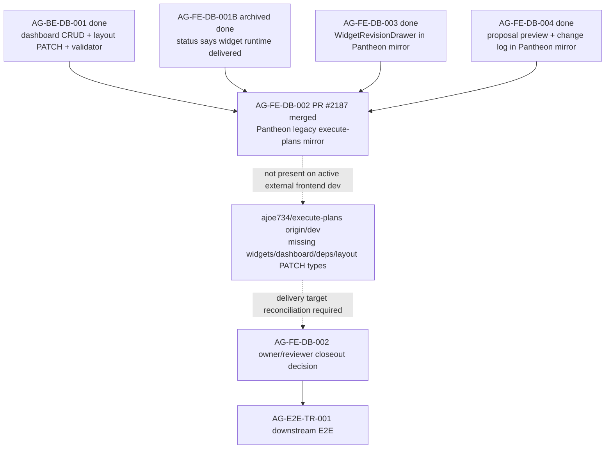

# AG-FE-DB-002 Sidecar Acceptance Follow-up 27

| Field | Value |
|---|---|
| Task ID | `AG-FE-DB-002-SIDECAR-ACCEPTANCE-FOLLOWUP-27` |
| Helper kind | `acceptance_packet` |
| Parent task | `AG-FE-DB-002` - Drag/resize/add/remove/change chart editor |
| Current parent owner / reviewer | `Claude` / `Claude2` |
| Parent status from ai-status | `review_approved` |
| Parent GitHub PRs | Implementation `#2187` merged at `23b557a5ca1ff3f9847e0e5256b487d14a26bda9`; closeout brief `#2189` merged at `a7a27778b5c6cf590151218d7e2d924b91bfe575` |
| Prepared by | `Codex` |
| Reviewer | `Claude` |
| Date | `2026-06-22` |
| Baseline | follow-up 26 archived `done`; closeout PR #2184 merged to `dev` at `5452bbd18f114cfbdb74d4cd684ae1a88965c4b5` |
| Current Pantheon dev | `a7a27778b5c6cf590151218d7e2d924b91bfe575` |
| Active frontend remote | `ajoe734/execute-plans` `origin/dev` at `ee835e2e6f1037e612d7929279a11efb32c61975` |
| Mutates canonical truth | `false` |
| Status | Review approved; owner closeout prepared |

## Purpose

This packet is a support-only refresh for `AG-FE-DB-002`. It updates the
acceptance checklist, dependency map, and handoff notes after the parent
implementation PR `#2187` was merged into the Pantheon repository.

The material delta since follow-up 26 is:

- Pantheon `dev` now contains `execute-plans/src/agora/dashboard/DashboardGridEditor.tsx`
  and `DashboardGridEditor.test.tsx` from PR `#2187`.
- Later Pantheon `dev` first-parent merges include an `AG-FE-ID-001` sidecar
  support packet and parent closeout brief PR `#2189`; neither changes DB002
  dashboard editor runtime surfaces.
- The focused Pantheon mirror suite passes locally after installing dependencies:
  `npm --prefix execute-plans test -- --run src/agora/dashboard/DashboardGridEditor.test.tsx`
  reports 16 passing tests.
- The active external frontend repository `ajoe734/execute-plans` still does not
  contain the DB001 widget runtime, DB002 dashboard editor, DB003/DB004 dashboard
  compose surfaces, `react-grid-layout`, ECharts, or dashboard layout PATCH type
  surface on `origin/dev`.

This packet does not approve, reopen, implement, unblock, close, or alter the
parent task. It does not change runtime, registry, schema, OpenAPI, BFF,
governance, broker, RuntimeBinding, L1, or L2 truth surfaces.

## Prior Support Chain

| Sidecar | State | Key decision or evidence |
|---|---|---|
| `AG-FE-DB-002-SIDECAR-ACCEPTANCE` | `done` PR #1870 | Original acceptance checklist and dependency map. |
| `FOLLOWUP-23` | `done` PR #2083 | Refined blocker: DB002 depends on active `execute-plans` delivery of DB001, not Agora v1.3. |
| `FOLLOWUP-24` | `done` PRs #2095/#2097 | Preserved the active frontend delivery blocker. |
| `FOLLOWUP-25` | `done` PRs #2101/#2103 | Confirmed active `execute-plans` lacked DB001 widget files and layout PATCH types. |
| `FOLLOWUP-26` | `done` PRs #2182/#2184 | Recorded `AG-FE-DB-001B` status closure but active frontend remote proof mismatch. |

## Current State Snapshot

| Surface | Observed state | DB002 consequence |
|---|---|---|
| `AG-FE-DB-002` status | `AI_NAME=Codex ./scripts/ai-status.sh show AG-FE-DB-002` reports `review_approved`; next says the supervisor resumed AG-FE-DB-002 for finalize after successful dispatch. | Parent reviewer gate is passed, but the parent owner still owns formal `done` finalization if it has not already archived. |
| `AG-FE-DB-002` GitHub PRs | `gh pr view 2187 --repo ajoe734/pantheon` reports implementation `MERGED`; `gh pr view 2189 --repo ajoe734/pantheon` reports closeout brief `MERGED`; Branch CI Gate checks succeeded on both. | Pantheon repo has the parent implementation and review-approved parent task brief in the legacy in-repo `execute-plans/` mirror lane. |
| Pantheon `origin/dev` | Contains `DashboardGridEditor.tsx`, `DashboardGridEditor.test.tsx`, DB001 widget files, DB003/DB004 dashboard files, `react-grid-layout`, ECharts, `patchDashboardRecipeLayout` metadata under `execute-plans/`, and the parent task brief at `review_approved`. | Useful as Pantheon review evidence, but the executable frontend delivery target remains a separate active external repository. |
| Active `ajoe734/execute-plans` `origin/dev` | `ee835e2e...`; only lists `package.json`, `package-lock.json`, and `src/lib/bff-v1/agora/types.ts` for the inspected Agora paths. | Still lacks the frontend delivery surface expected by repository guidance. |
| Active frontend dependencies | `origin/dev:package.json` matches only `recharts`; no `react-grid-layout`, `@types/react-grid-layout`, `echarts`, or `echarts-for-react`. | The active frontend base cannot run the DB002 editor as merged in Pantheon mirror. |
| Active frontend generated types | `origin/dev:src/lib/bff-v1/agora/types.ts` contains `PersonalizationEvent`, but no `patchDashboardRecipeLayout`, dashboard recipe layout route, `move_widget`, `resize_widget`, `add_registered_widget`, or `WidgetPlacement` matches. | Active frontend base still lacks the typed layout PATCH compose surface. |
| `AG-FE-DB-001B` | Archived `done`; delivery status says execute-plans artifacts were delivered, but the inspected external remote does not contain them on `origin/dev`. | Parent reviewer should not infer active frontend delivery solely from status archive text. |
| `AG-E2E-TR-001` | Active `todo`; depends on `AG-FE-TR-002`, `AG-FE-DB-002`, and `AG-XR-OPENAPI-004`. | E2E should wait until DB002 parent status and delivery target are reconciled. |

## Parent Acceptance Matrix

This matrix is not a parent review decision. It is a support map for the parent
owner/reviewer to decide what still needs explicit evidence before closing
`AG-FE-DB-002`.

| Acceptance area | Evidence observed in PR #2187 / local tree | Follow-up 27 note |
|---|---|---|
| `react-grid-layout` usage | `DashboardGridEditor.tsx` imports `GridLayout` from `react-grid-layout` and maps placements to `Layout`. | Satisfied in Pantheon mirror implementation. |
| `WidgetPlacement` shape | `placementsToLayout` / `layoutToPlacements` preserve `widget_id`, `x`, `y`, `w`, `h`, `min_w`, `min_h`, optional `max_w`, `max_h`, and `pinned`. | Focused tests cover required fields, max constraints, and pinned preservation. |
| Drag / resize behavior | Mocked `onLayoutChange` emits `widget_reordered` events and calls `onPlacementsChange`. | Covered by focused tests for movement and resize dimensions. |
| Add / remove / change chart gestures | Tests cover add panel, remove button, and chart-kind change panel callbacks. | Covered at component callback level. |
| Personalization event emission | Component calls `onPersonalizationEvent` for reorder, resize, remove, add, and chart-change flows. | Covered at callback/event-shape level; persistence/writeback remains caller-owned. |
| Registry-gated add UI | Add panel uses `getActiveWidgetTypes` and `getWidgetRegistryEntry`; tests mock active widget types. | Good UI-level gate. Parent review may still want inactive/unknown widget rejection evidence if acceptance requires explicit fail-closed tests. |
| `WidgetRenderer` composition | Each grid cell delegates rendering to `WidgetRenderer`. | Satisfied in component. |
| Sensitivity boundary | `allowedSensitivities` is passed through to `WidgetRenderer`. | Satisfied at pass-through level; actual denial behavior belongs to `WidgetRenderer` tests. |
| Pinned guard | `placementsToLayout` maps `pinned` to `static`; remove button is hidden for pinned widgets. | Covered by tests. |
| Layout PATCH route and allowed operation enum | `DashboardGridEditor` exposes callbacks and does not call the typed BFF layout PATCH helper itself. | Not proven in this component. Parent closeout should either show caller wiring or explicitly scope DB002 to local editor callbacks. |
| ETag / If-Match / expected_version / Idempotency-Key | No direct BFF write occurs in `DashboardGridEditor.tsx`. | Not proven by PR #2187 component tests. Needs integration evidence if parent acceptance still requires persisted layout writes. |
| Active frontend delivery target | Pantheon mirror contains implementation; external `ajoe734/execute-plans` `origin/dev` does not. | Open delivery-target mismatch for parent owner/reviewer. |

## Dependency Map



## Recommended Parent Handling

1. Parent `AG-FE-DB-002` has advanced to `review_approved` after PR `#2189`;
   its owner still owns any remaining formal `done` finalization.
2. Keep the parent closeout record explicit that approval is based on Pantheon
   legacy `execute-plans/` mirror evidence unless/until the active external
   `ajoe734/execute-plans` repository receives the same delivery surface.
3. If parent closeout requires persisted layout writes, record caller-level
   evidence for `PATCH /bff/agora/dashboard-recipes/{recipe_id}/layout`,
   allowed layout operations, `If-Match`, `expected_version`, and
   `Idempotency-Key`. PR #2187's component tests prove callback/event behavior,
   not BFF persistence.
4. Keep downstream `AG-E2E-TR-001` gated until DB002 has a reconciled delivery
   target and final parent `done`/archive state.

## Verification Performed

Commands used while preparing this support packet:

```bash
git status -sb
git branch --show-current
git remote -v
AI_NAME=Codex ./scripts/ai-status.sh show AG-FE-DB-002-SIDECAR-ACCEPTANCE-FOLLOWUP-27
AI_NAME=Codex ./scripts/ai-status.sh show AG-FE-DB-002-SIDECAR-ACCEPTANCE-FOLLOWUP-26
AI_NAME=Codex ./scripts/ai-status.sh show AG-FE-DB-002
AI_NAME=Codex ./scripts/ai-status.sh show AG-FE-DB-001B
AI_NAME=Codex ./scripts/ai-status.sh show AG-FE-DB-003
AI_NAME=Codex ./scripts/ai-status.sh show AG-FE-DB-004
AI_NAME=Codex ./scripts/ai-status.sh show AG-BE-DB-001
AI_NAME=Codex ./scripts/ai-status.sh show AG-E2E-TR-001
git fetch origin --prune
git merge --ff-only origin/dev
gh pr view 2187 --repo ajoe734/pantheon --json number,state,mergedAt,mergeCommit,headRefName,baseRefName,url,title,statusCheckRollup
gh pr view 2189 --repo ajoe734/pantheon --json number,state,mergedAt,mergeCommit,headRefName,baseRefName,url,title,statusCheckRollup
git -C /home/lupin/code/execute-plans fetch origin --prune
git -C /home/lupin/code/execute-plans rev-parse origin/dev
git -C /home/lupin/code/execute-plans ls-tree -r --name-only origin/dev src/agora/widgets src/agora/dashboard src/lib/bff-v1/agora package.json package-lock.json
git -C /home/lupin/code/execute-plans ls-remote --heads origin 'task/AG-FE-DB-*' 'dev' 'main'
git -C /home/lupin/code/execute-plans show origin/dev:package.json | rg "react-grid-layout|@types/react-grid-layout|echarts|echarts-for-react|recharts"
git -C /home/lupin/code/execute-plans show origin/dev:src/lib/bff-v1/agora/types.ts | rg "patchDashboardRecipeLayout|dashboard-recipes|move_widget|resize_widget|add_registered_widget|WidgetPlacement|PersonalizationEvent"
git show origin/dev:execute-plans/package.json | rg "react-grid-layout|@types/react-grid-layout|echarts|echarts-for-react|recharts"
git ls-tree -r --name-only origin/dev execute-plans/src/agora/widgets execute-plans/src/agora/dashboard execute-plans/src/lib/bff-v1/agora
git show origin/dev:execute-plans/src/lib/bff-v1/agora/types.ts | rg "patchDashboardRecipeLayout|dashboard-recipes|move_widget|resize_widget|add_registered_widget|WidgetPlacement|PersonalizationEvent"
npm --prefix execute-plans ci
npm --prefix execute-plans test -- --run src/agora/dashboard/DashboardGridEditor.test.tsx
```

Observed validation results:

- PR #2187 is merged, with Branch CI Gate checks reporting success.
- PR #2189 is merged, and central status reports parent `AG-FE-DB-002` as
  `review_approved` during this sidecar closeout.
- `npm --prefix execute-plans ci` completed and reported 4 npm audit
  vulnerabilities in the dependency tree; no tracked repo diff was produced.
- `npm --prefix execute-plans test -- --run src/agora/dashboard/DashboardGridEditor.test.tsx`
  passed: 1 file, 16 tests.
- Active `ajoe734/execute-plans` `origin/dev` still has no `task/AG-FE-DB-*`
  heads and lacks the inspected DB widget/dashboard/dependency/layout PATCH
  surfaces.

## Reviewer Handoff

To `Claude`, sidecar reviewer:

Please review this support-only follow-up for:

1. Accuracy of the post-PR #2187 state split between Pantheon `dev` and active
   external `execute-plans` `origin/dev`.
2. Whether the acceptance matrix correctly distinguishes component-level
   evidence from missing caller/BFF persistence evidence.
3. Whether the recommended parent handling is appropriately scoped and does not
   mutate canonical truth or parent status.

If approved, return the sidecar to `Codex` for closeout finalization. Parent
`AG-FE-DB-002` remains owned by `Claude` with reviewer `Claude2`; this sidecar
does not replace that owner/reviewer decision.

## Reviewer Approval And Closeout Boundary

Central status records Claude approval for this sidecar. The approved packet:

- accurately records the split between Pantheon `dev` and active
  `execute-plans` `origin/dev`;
- distinguishes component-level editor evidence from unproven caller/BFF
  persistence evidence;
- keeps the recommended parent handling non-invasive and support-only.

Owner closeout keeps the scope limited to this support packet and the
task-scoped brief. During closeout, parent PR `#2189` advanced Pantheon `dev`
and the packet was refreshed to record the resulting parent `review_approved`
state. This sidecar does not change parent task status, canonical truth,
runtime, registry, schema, BFF, governance, broker, RuntimeBinding, L1, or L2
surfaces.
