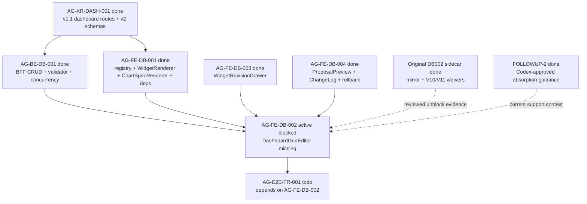

# AG-FE-DB-002 Sidecar Acceptance Follow-up 3

| Field | Value |
|---|---|
| Task ID | `AG-FE-DB-002-SIDECAR-ACCEPTANCE-FOLLOWUP-3` |
| Helper kind | `acceptance_packet` |
| Parent task | `AG-FE-DB-002` - Drag/resize/add/remove/change chart editor |
| Parent owner / reviewer | `Codex` / `Claude` |
| Prepared by | `Codex2` |
| Reviewer | `Codex` |
| Date | `2026-06-20` |
| Mutates canonical truth | `false` |
| Status | Review requested |

## Purpose

This packet is a support-only acceptance refresh for `AG-FE-DB-002` after both
earlier DB002 sidecar packets were archived `done`.

The parent task is still active and `blocked` on the older
execute-plans-mirror and V10/V11-reference blocker. This packet does not resolve
that parent blocker by itself, start parent implementation, or change
`AG-FE-DB-002` ownership. It gives the reviewer and parent owner a current-dev
checkpoint: the prior waivers remain reviewed, the upstream implementation
dependencies are merged, `DashboardGridEditor` is still the missing slice, and
the implementation boundary is now narrow enough to hand back to the parent
owner/reviewer path.

## Current State Snapshot

| Surface | Current status | Acceptance consequence |
|---|---|---|
| `AG-FE-DB-002` | Active `blocked`, owner `Codex`, reviewer `Claude`, waiting_for `Claude`. | Parent state still needs explicit absorption by Codex/Claude before implementation resumes. This sidecar must not mark the parent unblocked. |
| `AG-FE-DB-002-SIDECAR-ACCEPTANCE` | Archived `done`; PR #1870; reviewer `Claude2` approved mirror waiver, V10/V11 waiver, 13-item checklist, and dependency map. | Prior waiver evidence is reviewed and durable. |
| `AG-FE-DB-002-SIDECAR-ACCEPTANCE-FOLLOWUP-2` | Archived `done`; PR #1887; reviewer `Codex` approved preserving parent blocked status while restating waiver absorption and composition gates. | This follow-up should not re-litigate the waiver; it should route the reviewed answer to the parent owner/reviewer. |
| `AG-XR-DASH-001` | Archived `done`; v1.1 dashboard routes, v2 schemas, ETag/If-Match/idempotency, append-only versioning, and `agora.dashboard.v2` are merged. | DB002 must use v1.1 route semantics and v2 schema field names. |
| `AG-BE-DB-001` | Archived `done`; dashboard BFF CRUD routes, validation, ETag/If-Match concurrency, and widget validator are merged. | DB002 layout writes must use the existing BFF route contract and must not invent client-only persistence. |
| `AG-FE-DB-001` | Archived `done`; registry, `WidgetRenderer`, `ChartSpecRenderer`, generated types, ECharts, and `react-grid-layout` dependency are merged. | DB002 should compose these exports and should not create a second renderer or registry gate. |
| `AG-FE-DB-003` | Archived `done`; `WidgetRevisionDrawer` and widget validation helper integration are merged. | Chart-change or assistant-revision UX should compose DB003 instead of duplicating the revision drawer. |
| `AG-FE-DB-004` | Archived `done`; `DashboardProposalPreview`, `DashboardChangeLog`, rollback/proposal UI, and tests are merged. | DB002 should leave recipe history/rollback/proposal behavior to DB004-owned surfaces. |
| `DashboardGridEditor` | `execute-plans/src/agora/dashboard/DashboardGridEditor.tsx` is absent on current dev. | The parent implementation remains incomplete; this sidecar makes no runtime delivery claim. |

## Reviewed Waiver Absorption

The parent blocker has two already-reviewed answers:

1. Intentional `execute-plans/` files may be committed from the Pantheon task
   branch only when `scripts/git/worker_commit.py` receives explicit file paths
   in `--scope`. Directory-scope `--scope execute-plans/`, raw `git add .`, and
   raw `git add -A` remain forbidden.
2. Missing V10/V11 visual snapshots do not block functional implementation.
   The binding design authority is the contract-closure prose, v2 schemas, A3
   widget registry/chart grammar, and existing `execute-plans/src/agora/`
   component/token conventions.

Recommended parent-status handling:

1. Codex, as parent owner, should not silently ignore the existing parent
   `blocked` state.
2. Claude, as parent reviewer and current `waiting_for`, should either
   acknowledge these reviewed waivers on the parent task or hand the parent back
   to Codex with the blocker resolved.
3. Once parent status is intentionally unblocked, implementation should be
   limited to the DashboardGridEditor component, focused tests, and any typed
   BFF helper additions needed for the already-merged layout PATCH contract.

## Latest Dev Compose Surface

Current `dev` already contains the upstream frontend surfaces DB002 should use:

| Surface | Current file | Parent usage rule |
|---|---|---|
| Registry gate | `execute-plans/src/agora/widgets/registry.ts` | Use `validateWidgetSpecAgainstRegistry`, `getActiveWidgetTypes`, registry constants, and sensitivity rules; do not create a second allowlist. |
| Widget rendering | `execute-plans/src/agora/widgets/WidgetRenderer.tsx` | Each grid frame renders through `WidgetRenderer`; DB002 must not re-implement `ChartSpecRenderer` or builtin rendering. |
| Chart rendering | `execute-plans/src/agora/widgets/ChartSpecRenderer.tsx` | Delegate all chart display; no arbitrary HTML/JS, iframe, `eval`, `new Function`, or `dangerouslySetInnerHTML`. |
| Widget revision | `execute-plans/src/agora/widgets/WidgetRevisionDrawer.tsx` | If chart-change uses assistant revision, compose this drawer or its validated result boundary. |
| Proposal/history | `execute-plans/src/agora/dashboard/DashboardProposalPreview.tsx`, `DashboardChangeLog.tsx` | Reuse version/proposal/change-log semantics; do not introduce a competing recipe history model. |
| BFF validate helper | `execute-plans/src/lib/bff-v1/agora/dashboard.ts` | Existing helper covers `POST /bff/agora/widgets/validate`; any layout helper should live beside it and own fetch details. |
| Typed contract | `execute-plans/src/lib/bff-v1/agora/types.ts` | Use generated `DashboardRecipeV2` / `WidgetSpecV2` names and schema field spelling. |
| Dependencies | `execute-plans/package.json` | `echarts`, `echarts-for-react`, `react-grid-layout`, and `@types/react-grid-layout` are already present; DB002 does not need a dependency-only change. |

## Parent Acceptance Checklist

This follow-up keeps the original 13-item checklist and adds current-dev
precision:

| Area | Parent pass condition |
|---|---|
| File scope | Any commit touching `execute-plans/` passes explicit file paths to `worker_commit.py --scope`; no raw sweep and no directory-scope mirror commit. |
| Component ownership | Add `DashboardGridEditor` and focused tests only unless a typed BFF helper is strictly required for layout PATCH. |
| Grid library | Use `react-grid-layout`; no alternate grid library or custom drag engine. |
| Placement fields | Drag/resize/add/remove produces `WidgetPlacement`-compatible records with `widget_id`, `x`, `y`, `w`, `h`, `min_w`, `min_h`, preserving optional `max_w`, `max_h`, `pinned`. |
| Patch op allowlist | Layout writes use only `move_widget`, `resize_widget`, `remove_widget`, `add_registered_widget`, `replace_chart_spec`, or `update_widget_query`. |
| BFF route | Layout PATCH targets `/bff/agora/dashboard-recipes/{recipe_id}/layout` through `src/lib/bff-v1/agora/*`; UI components should not own ad hoc raw fetch calls. |
| Concurrency | State-changing layout writes include current ETag/`If-Match`, `expected_version`, and `Idempotency-Key`; 409 `CONCURRENT_MODIFICATION` is visible and never overwritten silently. |
| Registry validation | Add/change flows call the merged frontend registry gate and, where server validation is needed, the BFF widget validate helper. Unknown, inactive, unsupported chart kind, blocked interaction, unapproved data source, or sensitivity downgrade cases fail closed. |
| Renderer composition | Every widget frame renders through `WidgetRenderer`; DB002 does not fork chart rendering or builtin widget cards. |
| Sensitivity | Pass allowed sensitivity context to `WidgetRenderer`; do not render data above the operator scope. |
| Pinned guard | `pinned: true` placements cannot be moved or resized; tests cover the guard. |
| DB003 composition | Assistant-driven chart/widget changes compose `WidgetRevisionDrawer` or its accepted `WidgetSpecV2` result instead of a parallel conversation flow. |
| DB004 composition | Recipe proposal, change-log, version, and rollback behavior remains owned by DB004 surfaces and backend contract. |
| Runtime boundary | No order placement, broker invocation, capital binding, RuntimeBinding write, management route, arbitrary HTML/JS, iframe, `eval`, `new Function`, or `dangerouslySetInnerHTML`. |
| Focused tests | Cover drag, resize, add, remove, chart-change, personalization event emission, pinned guard, active-registry rejection, and conflict handling. |

## Dependency Map



Dependency notes:

- All upstream implementation dependencies named above are merged and archived
  `done`.
- `AG-E2E-TR-001` is still `todo` and depends on `AG-FE-DB-002`; it should not
  claim Trading Room dashboard completion until DB002 is implemented, reviewed,
  merged, and closed.
- This sidecar is not a substitute for the parent implementation or parent
  reviewer decision.

## Suggested Parent Verification

Once the parent implementation exists:

```bash
npm --prefix execute-plans test -- --run src/agora/dashboard/DashboardGridEditor
npm --prefix execute-plans test -- --run src/agora/widgets src/agora/dashboard
npm --prefix execute-plans run build:agora
```

Contract and repo checks to keep if DB002 touches generated Agora contract
surfaces:

```bash
node execute-plans/scripts/generate-agora-types.mjs --check --pantheon-root .
python3 scripts/agora_schema_bundle.py --verify
git diff --check
```

If full TypeScript or lint still fails on unrelated baseline issues, the parent
owner should record the focused passing commands and the exact unrelated failure
signature.

## Sidecar Verification Performed

Commands used to prepare this support packet:

```bash
git status -sb
git branch --show-current
git remote -v
AI_NAME=Codex2 ./scripts/ai-status.sh show AG-FE-DB-002
AI_NAME=Codex2 ./scripts/ai-status.sh show AG-FE-DB-002-SIDECAR-ACCEPTANCE
AI_NAME=Codex2 ./scripts/ai-status.sh show AG-FE-DB-002-SIDECAR-ACCEPTANCE-FOLLOWUP-2
AI_NAME=Codex2 ./scripts/ai-status.sh show AG-FE-DB-001
AI_NAME=Codex2 ./scripts/ai-status.sh show AG-BE-DB-001
AI_NAME=Codex2 ./scripts/ai-status.sh show AG-XR-DASH-001
AI_NAME=Codex2 ./scripts/ai-status.sh show AG-FE-DB-003
AI_NAME=Codex2 ./scripts/ai-status.sh show AG-FE-DB-004
AI_NAME=Codex2 ./scripts/ai-status.sh show AG-E2E-TR-001
git merge --ff-only origin/dev
git ls-files execute-plans/src/agora
find execute-plans/src/agora -maxdepth 4 -type f \( -name '*DashboardGridEditor*' -o -name '*Dashboard*' -o -name '*Widget*' \) -print
jq '.dependencies | {echarts, "echarts-for-react": .["echarts-for-react"], "react-grid-layout": .["react-grid-layout"], recharts}' execute-plans/package.json
jq '.devDependencies | {"@types/react-grid-layout": .["@types/react-grid-layout"]}' execute-plans/package.json
rg -n "DashboardGridEditor|EditableGrid|react-grid-layout|drag|resize|add_registered_widget|move_widget|resize_widget|remove_widget|replace_chart_spec|update_widget_query|PersonalizationEvent|If-Match|Idempotency-Key|CONCURRENT_MODIFICATION" docs/04/pantheon_agora_cross_repo_2026-06-20/contract-closure docs/04/pantheon_agora_cross_repo_2026-06-20/design-closure services/control-plane/specs/agora -g '*.md' -g '*.json' -g '*.yaml'
```

Observed results:

- Branch is `task/AG-FE-DB-002-SIDECAR-ACCEPTANCE-FOLLOWUP-3`, fast-forwarded
  to current `origin/dev` before this packet was written.
- Parent `AG-FE-DB-002` remains active `blocked` and waiting for `Claude`.
- Original DB002 sidecar and FOLLOWUP-2 are archived `done`.
- `AG-FE-DB-001`, `AG-BE-DB-001`, `AG-XR-DASH-001`, `AG-FE-DB-003`, and
  `AG-FE-DB-004` are archived `done`.
- `AG-E2E-TR-001` is active `todo` and depends on `AG-FE-DB-002`.
- `DashboardGridEditor` is not present on current dev.
- `react-grid-layout`, ECharts, and the grid-layout type package are already
  present in `execute-plans/package.json`.
- No canonical truth, schema, OpenAPI, runtime, registry, governance, broker, or
  RuntimeBinding implementation was changed by this sidecar.

## Reviewer Handoff

Codex should review this packet for:

1. Whether it accurately preserves the parent task's active `blocked` status
   while routing already-reviewed waiver evidence back to the parent owner and
   reviewer.
2. Whether the current-dev compose surface is accurate for
   `DashboardGridEditor`.
3. Whether the support-only boundary is preserved.

Suggested reviewer command:

```bash
AI_NAME=Codex REVIEW_FILE=support/sidecars/AG-FE-DB-002/AG-FE-DB-002-SIDECAR-ACCEPTANCE-FOLLOWUP-3.md ./scripts/ai-status.sh approve AG-FE-DB-002-SIDECAR-ACCEPTANCE-FOLLOWUP-3 "Review approved: DB002 follow-up 3 accurately preserves parent blocked status, points to reviewed waiver evidence, verifies current-dev compose surfaces, and keeps support-only boundaries without canonical/runtime changes."
```

Prepared by `Codex2` for the `AG-FE-DB-002-SIDECAR-ACCEPTANCE-FOLLOWUP-3`
support slice.
