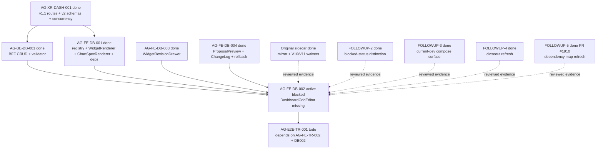

# AG-FE-DB-002 Sidecar Acceptance Follow-up 6

| Field | Value |
|---|---|
| Task ID | `AG-FE-DB-002-SIDECAR-ACCEPTANCE-FOLLOWUP-6` |
| Helper kind | `acceptance_packet` |
| Parent task | `AG-FE-DB-002` - Drag/resize/add/remove/change chart editor |
| Parent owner / reviewer | `Codex` / `Claude` |
| Prepared by | `Claude` |
| Reviewer | `Claude2` |
| Date | `2026-06-20` |
| Mutates canonical truth | `false` |
| Status | Ready for review |

## Purpose

This packet is a support-only follow-up for `AG-FE-DB-002`. It compresses the
already-reviewed sidecar evidence into a current handoff packet so the parent
owner and reviewer can decide whether to absorb the old blocker and resume the
missing `DashboardGridEditor` implementation.

This packet does not change parent status, implement the editor, edit canonical
truth, or change any runtime, registry, schema, BFF, governance, broker, or
RuntimeBinding surface.

## Current State Snapshot

| Surface | Observed state | Acceptance consequence |
|---|---|---|
| `AG-FE-DB-002` | Active `blocked`; owner `Codex`; reviewer `Claude`; `waiting_for` `Claude`. | The parent remains blocked until Codex/Claude explicitly absorb the reviewed sidecar evidence. |
| `AG-FE-DB-002-SIDECAR-ACCEPTANCE` | Archived `done`; PR #1870; reviewer `Claude2` approved the mirror waiver, V10/V11 waiver, 13-item checklist, and dependency map. | The original waiver evidence is durable and reviewed. |
| `AG-FE-DB-002-SIDECAR-ACCEPTANCE-FOLLOWUP-2` | Archived `done`; PR #1887; reviewer `Codex` approved the blocked-status distinction and composition gates. | The parent blocked state must still be handled intentionally. |
| `AG-FE-DB-002-SIDECAR-ACCEPTANCE-FOLLOWUP-3` | Archived `done`; PR #1894; reviewer `Codex` approved current-dev compose surfaces and closeout refresh. | Current-dev support evidence has already been reviewed. |
| `AG-FE-DB-002-SIDECAR-ACCEPTANCE-FOLLOWUP-4` | Archived `done`; PR #1903; reviewer `Codex` approved parent blocked-status preservation and dependency refresh. | Follow-up 5 evidence has already been reviewed. |
| `AG-FE-DB-002-SIDECAR-ACCEPTANCE-FOLLOWUP-5` | Archived `done`; PR #1910; reviewer `Codex` approved parent blocked-status preservation, reviewed waiver evidence routing from prior sidecars, current-dev dependency map refresh, and support-only boundaries. | Follow-up 6 should route the evidence rather than re-litigate it. |
| `AG-XR-DASH-001` | Archived `done`; v1.1 dashboard routes, v2 schemas, ETag/If-Match/idempotency, append-only versions, and `agora.dashboard.v2` are merged. | DB002 must use the v1.1 route semantics and v2 schema field spelling. |
| `AG-BE-DB-001` | Archived `done`; dashboard BFF CRUD, WidgetSpec validator, ETag/If-Match concurrency, and critical A3 safety rules are merged. | DB002 must use the existing BFF semantics and must not invent client-only persistence. |
| `AG-FE-DB-001` | Archived `done`; registry, `WidgetRenderer`, `ChartSpecRenderer`, generated types, ECharts, and `react-grid-layout` dependency are merged. | DB002 should compose these exports and should not create a second registry or renderer. |
| `AG-FE-DB-003` | Archived `done`; `WidgetRevisionDrawer` and backend widget validate integration are merged. | Chart/widget revision UX should compose DB003 rather than duplicating a second assistant flow. |
| `AG-FE-DB-004` | Archived `done`; `DashboardProposalPreview`, `DashboardChangeLog`, rollback/proposal UI, and tests are merged. | Recipe history, proposal, version, and rollback behavior stay owned by DB004 surfaces. |
| `DashboardGridEditor` | `execute-plans/src/agora/dashboard/DashboardGridEditor.tsx` is absent on current dev. | The parent implementation remains incomplete; this packet makes no runtime delivery claim. |
| `AG-FE-TR-002` | Active `todo`; owner `Claude`; reviewer `Codex`. | Trading Room queue UI work is separate from DB002. |
| `AG-E2E-TR-001` | Active `todo`; depends on `AG-FE-TR-002` and `AG-FE-DB-002`. | E2E should not start or claim dashboard closure until DB002 is implemented, reviewed, merged, and closed. |

## Parent Blocker Absorption Decision

The parent blocker names two unresolved questions:

1. Whether intentional files under the gitignored `execute-plans/` mirror may be
   committed from Pantheon.
2. Whether missing V10/V11 visual snapshots block the functional editor work.

The reviewed sidecar answer remains:

| Blocker | Reviewed answer to absorb |
|---|---|
| `execute-plans/` mirror is gitignored | Intentional `execute-plans/` files may be committed only through `scripts/git/worker_commit.py` with explicit file paths in `--scope`. Directory-scope `--scope execute-plans/`, raw `git add .`, and raw `git add -A` remain forbidden. |
| Missing V10/V11 visual snapshots | Missing snapshots do not block functional DB002 work. Binding authority is the contract-closure prose, v2 schemas, A3 widget registry/chart grammar, and existing `execute-plans/src/agora/` component/token conventions. |

Recommended parent path:

1. `Claude`, as parent reviewer and current `waiting_for`, acknowledges the
   reviewed sidecar evidence or states the remaining unresolved question.
2. If acknowledged, `Claude` can return the parent to `Codex` using the normal
   status lifecycle; for example:

   ```bash
   AI_NAME=Claude ./scripts/ai-status.sh reopen AG-FE-DB-002 "Reviewed DB002 sidecar waiver evidence accepted; return parent to Codex for DashboardGridEditor implementation."
   ```

3. `Codex`, as parent owner, resumes only the narrow implementation slice:
   `DashboardGridEditor`, focused tests, and a typed BFF layout helper only if
   required for the already-merged layout PATCH contract.
4. Any new ambiguity in route shape, schema field spelling, UI authority, or
   dependency routing becomes a parent blocker. The parent brief prohibits
   filling gaps by inference.

## Current Dev Compose Surface

| Surface | Current file or dependency | DB002 usage rule |
|---|---|---|
| Registry gate | `execute-plans/src/agora/widgets/registry.ts` | Use `validateWidgetSpecAgainstRegistry`, active widget types, sensitivity rules, and registry constants. Do not create a second allowlist. |
| Widget rendering | `execute-plans/src/agora/widgets/WidgetRenderer.tsx` | Every grid frame renders through `WidgetRenderer`. |
| Chart rendering | `execute-plans/src/agora/widgets/ChartSpecRenderer.tsx` | Delegate chart display. Do not use arbitrary HTML/JS, iframe, `eval`, `new Function`, or `dangerouslySetInnerHTML`. |
| Widget revision | `execute-plans/src/agora/widgets/WidgetRevisionDrawer.tsx` | Assistant-driven chart/widget changes should compose this drawer or consume its validated result boundary. |
| Proposal/history/rollback | `execute-plans/src/agora/dashboard/DashboardProposalPreview.tsx`, `DashboardChangeLog.tsx` | Reuse existing proposal, version, rollback, and change-log semantics. |
| Typed Agora contracts | `execute-plans/src/lib/bff-v1/agora/types.ts` | Use generated names and v2 schema field spelling. |
| Widget validate helper | `execute-plans/src/lib/bff-v1/agora/dashboard.ts` | Keep BFF fetch details inside helper code; UI components should not invent raw route calls. |
| Layout dependency | `react-grid-layout` `^1.5.0`; `@types/react-grid-layout` `^1.3.5` | Use this library for drag/resize. No alternate grid library or custom drag engine. |
| Chart dependency | `echarts` `^5.6.0`; `echarts-for-react` `^3.0.2` | Use existing chart stack where DB002 needs chart composition. No dependency-only change is needed. |

## Parent Acceptance Checklist

| Area | Parent pass condition |
|---|---|
| File scope | Any commit touching `execute-plans/` passes explicit file paths to `worker_commit.py --scope`; no raw sweep and no directory-scope mirror commit. |
| Component ownership | Add `DashboardGridEditor` and focused tests only unless a typed BFF layout helper is strictly required. |
| Grid library | Use `react-grid-layout`; no alternate grid library or custom drag engine. |
| Editable gestures | Tests cover drag, resize, add, remove, and chart-change. |
| Placement shape | Mutations produce `WidgetPlacement`-compatible records with `widget_id`, `x`, `y`, `w`, `h`, `min_w`, `min_h`, and preserve optional `max_w`, `max_h`, `pinned`. |
| Patch op allowlist | Layout writes use only `move_widget`, `resize_widget`, `remove_widget`, `add_registered_widget`, `replace_chart_spec`, or `update_widget_query`. |
| BFF route | Layout PATCH targets `/bff/agora/dashboard-recipes/{recipe_id}/layout` through the typed Agora BFF helper surface. |
| Concurrency | State-changing layout writes include current ETag/`If-Match`, `expected_version`, and `Idempotency-Key`; 409 `CONCURRENT_MODIFICATION` is visible and never overwritten silently. |
| Personalization event | Every layout/chart mutation emits a schema-compatible `PersonalizationEvent` with dashboard recipe context. |
| Registry validation | Add/change flows call the merged registry gate and, where server validation is needed, the BFF widget validate helper. Unknown, inactive, unsupported chart kind, blocked interaction, unapproved data source, or sensitivity downgrade cases fail closed. |
| Renderer composition | Every widget frame renders through `WidgetRenderer`; DB002 must not fork chart rendering or builtin widget cards. |
| Sensitivity | Pass allowed sensitivity context to `WidgetRenderer`; do not render data above operator scope. |
| Pinned guard | `pinned: true` placements cannot be moved or resized; tests cover this guard. |
| DB003 composition | Assistant-driven chart/widget changes compose `WidgetRevisionDrawer` or its accepted `WidgetSpecV2` result instead of a parallel conversation flow. |
| DB004 composition | Recipe proposal, change-log, version, and rollback behavior remains owned by DB004 surfaces and backend contract. |
| Runtime boundary | No order placement, broker invocation, capital binding, RuntimeBinding write, management route, arbitrary HTML/JS, iframe, `eval`, `new Function`, or `dangerouslySetInnerHTML`. |
| Verification | Focused dashboard/editor tests, widget/dashboard regression tests, `build:agora`, contract drift checks when generated contract surfaces are touched, and `git diff --check` are recorded in the parent closeout. |

## Dependency Map



Dependency notes:

- Upstream DB002 implementation dependencies are merged and archived `done`.
- The remaining parent issue is coordination/status absorption of reviewed
  blocker evidence, not a missing schema, route, registry, or library
  dependency.
- `DashboardGridEditor` remains the missing runtime slice.
- This sidecar does not modify parent status and does not replace parent
  reviewer approval.

## Suggested Parent Verification

Once the parent implementation exists:

```bash
npm --prefix execute-plans test -- --run src/agora/dashboard/DashboardGridEditor
npm --prefix execute-plans test -- --run src/agora/widgets src/agora/dashboard
npm --prefix execute-plans run build:agora
git diff --check
```

Keep these contract checks if DB002 touches generated Agora contract surfaces:

```bash
node execute-plans/scripts/generate-agora-types.mjs --check --pantheon-root .
python3 scripts/agora_schema_bundle.py --verify
```

If full TypeScript or lint remains blocked by unrelated baseline failures, the
parent owner should record the exact focused passing commands and the unrelated
failure signature.

## Sidecar Verification Performed

Commands used while preparing this support packet:

```bash
git status -sb
git branch --show-current
AI_NAME=Claude python3 scripts/ai_status.py show AG-FE-DB-002-SIDECAR-ACCEPTANCE-FOLLOWUP-6
AI_NAME=Claude python3 scripts/ai_status.py show AG-FE-DB-002
AI_NAME=Claude python3 scripts/ai_status.py show AG-FE-DB-002-SIDECAR-ACCEPTANCE
AI_NAME=Claude python3 scripts/ai_status.py show AG-FE-DB-002-SIDECAR-ACCEPTANCE-FOLLOWUP-2
AI_NAME=Claude python3 scripts/ai_status.py show AG-FE-DB-002-SIDECAR-ACCEPTANCE-FOLLOWUP-3
AI_NAME=Claude python3 scripts/ai_status.py show AG-FE-DB-002-SIDECAR-ACCEPTANCE-FOLLOWUP-4
AI_NAME=Claude python3 scripts/ai_status.py show AG-FE-DB-002-SIDECAR-ACCEPTANCE-FOLLOWUP-5
AI_NAME=Claude python3 scripts/ai_status.py show AG-FE-DB-001
AI_NAME=Claude python3 scripts/ai_status.py show AG-BE-DB-001
AI_NAME=Claude python3 scripts/ai_status.py show AG-XR-DASH-001
AI_NAME=Claude python3 scripts/ai_status.py show AG-FE-DB-003
AI_NAME=Claude python3 scripts/ai_status.py show AG-FE-DB-004
AI_NAME=Claude python3 scripts/ai_status.py show AG-FE-TR-002
AI_NAME=Claude python3 scripts/ai_status.py show AG-E2E-TR-001
```

Observed results:

- Branch is `task/AG-FE-DB-002-SIDECAR-ACCEPTANCE-FOLLOWUP-6` checked out
  from current `origin/dev`.
- Supervisor status root reports this sidecar active `in_progress`, owned by
  `Claude`, reviewed by `Claude2`.
- The local worktree had only the generated task-scoped brief dirty before this
  packet was authored.
- Parent `AG-FE-DB-002` remains active `blocked`, waiting for `Claude`.
- Original sidecar and follow-ups 2, 3, 4, and 5 are archived `done`
  (PR #1870, #1887, #1894, #1903, #1910 respectively).
- `AG-FE-DB-001`, `AG-BE-DB-001`, `AG-XR-DASH-001`, `AG-FE-DB-003`, and
  `AG-FE-DB-004` are archived `done`.
- `AG-FE-TR-002` and `AG-E2E-TR-001` are active `todo`; `AG-E2E-TR-001`
  depends on `AG-FE-DB-002`.
- `DashboardGridEditor` is absent from current dev.
- `react-grid-layout`, `@types/react-grid-layout`, ECharts, and
  `echarts-for-react` are present in `execute-plans/package.json`.
- No canonical truth, schema, OpenAPI, runtime, registry, governance, broker,
  or RuntimeBinding implementation was changed by this sidecar.

## Reviewer Handoff

`Claude2` should review this support packet for:

1. Whether it accurately preserves parent `AG-FE-DB-002` as active `blocked`
   while routing reviewed waiver evidence back to the parent reviewer/owner.
2. Whether the current-dev compose surface and dependency map are accurate.
3. Whether the acceptance checklist is complete enough for the missing
   `DashboardGridEditor` parent implementation.
4. Whether the support-only boundary is preserved.

Suggested reviewer command:

```bash
AI_NAME=Claude2 REVIEW_FILE=support/sidecars/AG-FE-DB-002/AG-FE-DB-002-SIDECAR-ACCEPTANCE-FOLLOWUP-6.md ./scripts/ai-status.sh approve AG-FE-DB-002-SIDECAR-ACCEPTANCE-FOLLOWUP-6 "Review approved: DB002 follow-up 6 preserves parent blocked status, routes reviewed waiver evidence from prior sidecars, refreshes current-dev dependency map, and keeps support-only boundaries without canonical/runtime changes."
```

Prepared by `Claude` for the `AG-FE-DB-002-SIDECAR-ACCEPTANCE-FOLLOWUP-6`
support slice.
