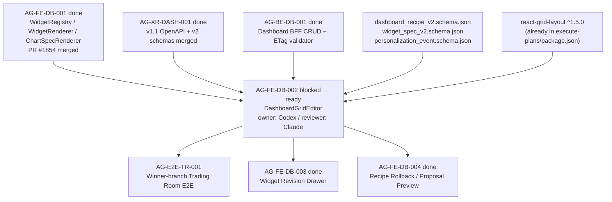

# AG-FE-DB-002 Sidecar Acceptance Packet

**Sidecar task:** `AG-FE-DB-002-SIDECAR-ACCEPTANCE`
**Helper parent:** `AG-FE-DB-002`
**Helper kind:** `acceptance_packet`
**Parent title:** Drag/resize/add/remove/change chart editor (DashboardGridEditor)
**Parent owner:** `Codex`
**Parent reviewer:** `Claude`
**Parent status:** `blocked` (waiting_for `Claude`)
**Sidecar owner:** `Claude`
**Sidecar reviewer:** `Claude2`
**Date:** `2026-06-20`
**Status:** `review_approved — ready for parent owner`
**Reviewed by:** `Claude2` (approved 2026-06-20)

> Scope constraint: support artifact only. This packet summarizes acceptance
> criteria, dependency routing, blocker resolution guidance, and verification
> plan for `AG-FE-DB-002`. It does not modify canonical truth, L1 policy,
> runtime code, registry code, governance implementation, or BFF implementation.

---

## 1. Executive Summary

`AG-FE-DB-002` implements the Agora dashboard grid layout editor
(`DashboardGridEditor`) using `react-grid-layout`. The component lives inside
the Trading Room (`/agora/trading-room`) under `EditableGrid`, and exposes
drag, resize, add, remove, and chart-change operations. Each layout mutation
must produce a `WidgetPlacement` record conforming to `DashboardRecipeV2` and
emit a `PersonalizationEvent` via the BFF personalization route.

**Current blocker:** The parent owner (`Codex`) stopped because it
misidentified the execute-plans mirror policy. This sidecar provides the
clarification so the parent owner can unblock and proceed without a supervisor
escalation.

---

## 2. Sources Used

| Source | Role |
|---|---|
| `docs/04/pantheon_agora_cross_repo_2026-06-20/contract-closure/04_dashboard_crud_and_concurrency.md` | Dashboard CRUD routes, ETag/If-Match semantics, layout patch operations |
| `docs/04/pantheon_agora_cross_repo_2026-06-20/contract-closure/05_execute_plans_agora_ui_ia_and_dependencies.md` | IA spec, `EditableGrid` position in page tree, library decisions (react-grid-layout, ECharts) |
| `docs/04/pantheon_agora_cross_repo_2026-06-20/contract-closure/dashboard_recipe_v2.schema.json` | `DashboardRecipeV2` schema — `dashboard_view`, `widget_placement` types |
| `docs/04/pantheon_agora_cross_repo_2026-06-20/contract-closure/widget_spec_v2.schema.json` | `WidgetSpecV2` schema — `layout_constraints`, `sensitivity` fields |
| `docs/04/pantheon_agora_cross_repo_2026-06-20/design-closure/A3_widget_registry_and_chart_grammar_spec.md` | A3 widget registry — active widget gate, interaction allowlist |
| `services/control-plane/specs/agora/personalization_event.schema.json` | `PersonalizationEvent` schema governing layout mutation events |
| `execute-plans/src/agora/widgets/registry.ts` | Merged AG-FE-DB-001 registry — the active widget gate component uses this |
| `execute-plans/src/agora/widgets/WidgetRenderer.tsx` | Merged AG-FE-DB-001 renderer — `DashboardGridEditor` wraps `WidgetRenderer` per frame |
| `docs/frontend/execute-plans-dev-hosting.md` | Frontend repo identity, dev deployment rule, Agora compatibility gate |
| `.orchestrator/multi_repo_registry.py` | Artifact prefix routing — `execute-plans/` prefix convention |
| `scripts/git/worker_commit.py` | Safe commit wrapper; explicit file-scope forced-add for gitignored paths |

---

## 3. Blocker Resolution

The parent owner recorded two sub-blockers. This section provides the
clarifying decisions so `Codex` can proceed without a supervisor escalation.

### 3.1 execute-plans/ mirror policy — waiver granted

**Blocker claim:** `.gitignore` lists `execute-plans/` as phantom mirror;
new files should not be added.

**Resolution:** The gitignore entry prevents automatic `git add .` sweeps from
capturing execute-plans files — it does **not** prohibit intentional task
commits via explicit file scope. Prior tasks demonstrate the correct pattern:

| Task | Commit | execute-plans/ files committed |
|---|---|---|
| AG-FE-DB-001 | `6062cb2c` | `registry.ts`, `WidgetRenderer.tsx`, `ChartSpecRenderer.tsx`, tests |
| AG-FE-DB-003 | `eb2f018a` | `WidgetRevisionDrawer.tsx`, tests |
| AG-FE-DB-004 | `5a8728a3` | `DashboardChangeLog.tsx`, `DashboardProposalPreview.tsx`, tests |

All three used `worker_commit.py --scope execute-plans/src/agora/…` with
explicit file paths; `worker_commit.py` performs `git add -f` for files whose
containing directory appears in `.gitignore`. Directory-scope `--scope
execute-plans/` (without individual file paths) is blocked to prevent sweep-in;
individual file paths are allowed.

**Owner action:** Pass the new component file(s) as explicit `--scope` paths:

```bash
python3 scripts/git/worker_commit.py \
  --task-id AG-FE-DB-002 \
  --message-file /tmp/AG-FE-DB-002-msg.txt \
  --scope execute-plans/src/agora/dashboard/DashboardGridEditor.tsx \
           execute-plans/src/agora/dashboard/DashboardGridEditor.test.tsx \
  --index-file /tmp/git-index-task-AG-FE-DB-002
```

Do **not** pass `execute-plans/` as a directory scope.

### 3.2 V10/V11 visual reference — waiver granted

**Blocker claim:** V10/V11 visual reference path not found; UI implementation
blocked without it.

**Resolution:** V10/V11 are versioned design mockup snapshots (likely produced
by Lovable or an equivalent design tool) that are not stored as committed files
in the Pantheon repo. Their absence does not block frontend implementation
because the binding design authority for AG-FE-DB-002 is the **text spec**:

- `docs/04/…/contract-closure/05_execute_plans_agora_ui_ia_and_dependencies.md`
  defines the page tree, `EditableGrid` position, and the exact user interactions
  (drag, resize, remove, add, chart-change, before/after, accept/reject/rollback).
- `docs/04/…/design-closure/A3_widget_registry_and_chart_grammar_spec.md` defines
  widget interaction allowlist.
- `docs/04/…/contract-closure/04_dashboard_crud_and_concurrency.md` defines the
  six allowed layout patch operations, ETag semantics, and BFF mutation routes.

The instruction "沿用既有 design tokens 與共用元件" means: reuse the same
Tailwind/component conventions already present in `execute-plans/src/agora/`.
New UI controls must follow those existing tokens and component patterns.

If the reviewer or chair-review later produces V10/V11 mockup links, they
can be used to validate visual polish, but they are not required to begin
or pass functional acceptance.

---

## 4. Parent Acceptance Checklist

| # | Criterion | Spec Authority | Acceptance Rule |
|---|---|---|---|
| 1 | **DashboardGridEditor uses react-grid-layout** | `05_execute_plans…` library decision | Component imports `react-grid-layout` and renders `EditableGrid` from the IA tree. No alternative grid library. |
| 2 | **WidgetPlacement fields respected** | `dashboard_recipe_v2.schema.json` `widget_placement` definition | Every drag/resize produces a placement with `widget_id`, `x`, `y`, `w`, `h`, `min_w`, `min_h`. Optional `max_w`, `max_h`, `pinned` fields must not be silently dropped when present. |
| 3 | **Layout patch operations are the allowed six** | `04_dashboard_crud…` mutation semantics | Only `move_widget`, `resize_widget`, `remove_widget`, `add_registered_widget`, `replace_chart_spec`, `update_widget_query`. No invented patch operations. |
| 4 | **Active-registry gate on add** | A3 §10, AG-FE-DB-001 `registry.ts` | `add_registered_widget` must call `validateWidgetSpecAgainstRegistry` (from merged AG-FE-DB-001) before accepting the widget. Inactive or unknown `widget_type` must be rejected. |
| 5 | **PersonalizationEvent emitted per operation** | `personalization_event.schema.json`, `05_execute_plans…` BFF boundary | Every mutation emits a `PersonalizationEvent` via `src/lib/bff-v1/agora/*`. Direct `fetch()` calls are prohibited. |
| 6 | **ETag/If-Match semantics honored for layout patch** | `04_dashboard_crud…` ETag section | Layout PATCH requests include `If-Match` (current ETag), `expected_version`, and `Idempotency-Key`. `CONCURRENT_MODIFICATION` responses are handled — editor must not silently overwrite a version mismatch. |
| 7 | **No arbitrary code injection** | A3 §3.1, AG-FE-DB-001 ChartSpecRenderer contract | `DashboardGridEditor` must not use `eval()`, `new Function()`, `dangerouslySetInnerHTML`, or iframes. Chart rendering delegates entirely to `ChartSpecRenderer` (AG-FE-DB-001). |
| 8 | **Sensitivity check before rendering** | `widget_spec_v2.schema.json` `sensitivity` field | The grid editor must not render a widget if its sensitivity level is not met by the user scope. Pass the check to `WidgetRenderer` (AG-FE-DB-001). |
| 9 | **Pinned widget guard** | `dashboard_recipe_v2.schema.json` `pinned` flag | A widget placement with `pinned: true` must not be moved or resized. Attempt must be silently ignored or display an affordance — not error-thrown. |
| 10 | **WidgetRenderer integration** | AG-FE-DB-001 exported API | Each `WidgetFrame` in the grid renders via the merged `WidgetRenderer`; the grid editor does not re-implement widget rendering. |
| 11 | **BFF route family** | `04_dashboard_crud…` canonical routes | Layout PATCH goes to `PATCH /bff/agora/dashboard-recipes/{recipe_id}/layout`. No invented routes. |
| 12 | **Tests: drag/resize/add/remove/change-chart** | Task acceptance | Unit or integration tests cover all five editing gestures, `PersonalizationEvent` emission, pinned guard, version mismatch handling, and active-registry rejection. |
| 13 | **No self-created schema fields, routes, or enums** | Task brief | The implementation must be field-for-field compliant with the frozen v2 schemas. Any unresolved schema gap is a blocker, not a workaround. |

---

## 5. Dependency Map



**Dependency notes:**

- `AG-FE-DB-001`, `AG-BE-DB-001`, and `AG-XR-DASH-001` are all archived `done`
  and their code is on `dev`. The grid editor may import from them.
- `AG-FE-DB-003` and `AG-FE-DB-004` are `done` and provide `WidgetRevisionDrawer`,
  `DashboardProposalPreview`, and `DashboardChangeLog`. The grid editor should
  not duplicate their functionality.
- `react-grid-layout` is already present in `execute-plans/package.json`
  (^1.5.0). No package addition is needed before implementation.
- The grid editor is the last remaining blocker for `AG-E2E-TR-001`.

---

## 6. Suggested Verification Plan

Owner (`Codex`) should run these after implementation:

### 6.1 TypeScript compilation

```bash
npm --prefix execute-plans run tsc -- --noEmit
```

No type errors permitted.

### 6.2 Focused Vitest suite

```bash
npm --prefix execute-plans test -- --run src/agora/dashboard/DashboardGridEditor
```

Must pass: drag/resize/add/remove/change-chart operations, `PersonalizationEvent`
emission, pinned widget guard, active-registry rejection, version mismatch
handling.

### 6.3 Full agora widget + dashboard suite

```bash
npm --prefix execute-plans test -- --run src/agora/widgets src/agora/dashboard
```

No regressions in merged AG-FE-DB-001 / 003 / 004 tests.

### 6.4 Build output

```bash
npm --prefix execute-plans run build:agora
```

Must compile without errors; Agora bundle must include `DashboardGridEditor`.

---

## 7. Support-Only Boundary Confirmation

- No L1 canonical policy or architecture document has been edited.
- No main runtime, registry, BFF, governance, or OpenAPI implementation was
  changed.
- The execute-plans mirror files (`DashboardGridEditor.tsx`, tests) are not
  authored or staged by this sidecar task.
- The intended sidecar artifact is this file:
  `support/sidecars/AG-FE-DB-002/AG-FE-DB-002-SIDECAR-ACCEPTANCE.md`.

---

## 8. Reviewer Handoff

To `Claude2`, sidecar reviewer:

Please review this acceptance packet for:

1. Accuracy of the blocker-resolution guidance in §3 (execute-plans mirror
   waiver and V10/V11 waiver).
2. Completeness of the acceptance checklist in §4 against the frozen design
   specs.
3. Correctness of the dependency map in §5.
4. That no canonical truth was modified.

If the packet is accurate and the waivers are consistent with how prior
`AG-FE-DB-*` tasks were handled, please approve. Approval unlocks the parent
owner to proceed.

Suggested reviewer approval command:

```bash
AI_NAME=Claude2 python3 scripts/ai_status.py approve AG-FE-DB-002-SIDECAR-ACCEPTANCE "Acceptance packet approved: DashboardGridEditor checklist, execute-plans mirror waiver, V10/V11 waiver, and dependency map reviewed."
```

*Prepared by Claude for the AG-FE-DB-002-SIDECAR-ACCEPTANCE support slice.*
