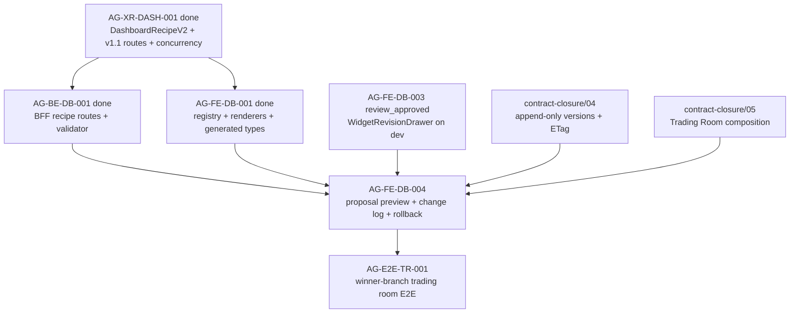

# AG-FE-DB-004 Sidecar Acceptance Packet

| Field | Value |
|---|---|
| Task ID | `AG-FE-DB-004-SIDECAR-ACCEPTANCE` |
| Helper kind | `acceptance_packet` |
| Parent task | `AG-FE-DB-004` - Recipe proposal/change log/version rollback |
| Parent owner / reviewer | `Codex` / `Claude` |
| Prepared by | `Codex2` |
| Reviewer | `Codex` |
| Date | `2026-06-20` |
| Mutates canonical truth | `false` |
| Status | Ready for review |

## Purpose

This packet supports `AG-FE-DB-004` by spelling out the acceptance checklist,
dependency state, review gates, and handoff notes for the dashboard recipe
proposal preview, immutable change log, and rollback UI.

It is support-only. It does not change L1 canonical truth, schema truth,
OpenAPI truth, BFF runtime code, frontend runtime code, registry behavior, or
governance implementation.

## Sources Used

| Source | Relevance |
|---|---|
| `AI_NAME=Codex2 ./scripts/ai-status.sh show AG-FE-DB-004` | Parent task title, owner/reviewer, dependencies, acceptance. |
| `AI_NAME=Codex2 ./scripts/ai-status.sh show AG-XR-DASH-001` | Confirms the v1.1 dashboard recipe CRUD/concurrency contract is done. |
| `AI_NAME=Codex2 ./scripts/ai-status.sh show AG-BE-DB-001` | Confirms backend dashboard recipe routes and widget validator are done. |
| `AI_NAME=Codex2 ./scripts/ai-status.sh show AG-FE-DB-001` | Confirms WidgetRegistry/WidgetRenderer/ChartSpecRenderer are done. |
| `AI_NAME=Codex2 ./scripts/ai-status.sh show AG-FE-DB-003` | Confirms WidgetRevisionDrawer is review-approved and merged on current `dev`. |
| `docs/04/pantheon_agora_cross_repo_2026-06-20/contract-closure/04_dashboard_crud_and_concurrency.md` | Route list, append-only version model, ETag/If-Match semantics, rollback behavior. |
| `docs/04/pantheon_agora_cross_repo_2026-06-20/contract-closure/05_execute_plans_agora_ui_ia_and_dependencies.md` | Trading Room composition and placement for `DashboardProposalPreview` / `DashboardChangeLog`. |
| `services/control-plane/specs/agora/v2/dashboard_recipe_v2.schema.json` | Field truth for `DashboardRecipeV2`. |
| `execute-plans/src/lib/bff-v1/agora/types.ts` | Generated frontend `DashboardRecipeV2` type and operation catalog. |
| `execute-plans/src/lib/bff-v1/agora/dashboard.ts` | Current frontend BFF helper state; only widget validation helper exists. |
| `services/control-plane/bff/agora/dashboard/router.py` | Merged backend behavior for accept/layout/rollback/version list. |

## Current Dependency State

| Dependency | Current state | Acceptance consequence for `AG-FE-DB-004` |
|---|---|---|
| `AG-XR-DASH-001` | Archived `done`; v1.1 contract delivered `DashboardRecipeV2`, dashboard-recipe routes, ETag/If-Match/Idempotency-Key/`expected_version`, and append-only rollback semantics. | DB004 must use the v1.1 route family and v2 schema. No new routes, enums, or camelCase aliases may be invented. |
| `AG-BE-DB-001` | Archived `done`; backend implements dashboard recipe routes, widget validation, A3 safety rules, ETag conflict payloads, and rollback as a new version. | DB004 can call the merged BFF behavior, but must preserve conflict handling and never overwrite history client-side. |
| `AG-FE-DB-001` | Archived `done`; renderer/registry/chart renderer and generated v1.1 types are merged. | DB004 preview UI should compose `WidgetRenderer` / `ChartSpecRenderer` instead of building a parallel renderer. |
| `AG-FE-DB-003` | `review_approved`; files are present on current `origin/dev` after fast-forward. | DB004 should compose with `WidgetRevisionDrawer` decisions where a proposal changes individual widgets, while leaving DB003 owner closeout to that task. |

## Blocking Mismatch To Guard

The parent brief mentions `previousVersionId`, but the merged contract and
generated frontend type use `previous_version`.

Acceptance rule: DB004 must use `DashboardRecipeV2.previous_version` exactly.
Do not add `previousVersionId`, `previousVersion`, or any other compatibility
alias unless a separate contract task changes the generated type/schema.

## Parent Acceptance Checklist

| Area | Acceptance rule | Reviewer check |
|---|---|---|
| Type source | Import and use `DashboardRecipeV2` from `execute-plans/src/lib/bff-v1/agora/types.ts`. | No local duplicate recipe type with different field names or status enum. |
| Route source | Use only the v1.1 dashboard recipe operations: list, propose, get, accept, layout, rollback, feedback, versions. | No ad-hoc `/dashboard`, `/widget-specs`, `/version-history`, or direct runtime routes. |
| BFF helper boundary | All recipe reads/writes go through `src/lib/bff-v1/agora/*`. | Components/pages do not call raw `fetch()` except inside the BFF helper module. |
| Proposal preview | `DashboardProposalPreview` renders a proposed `DashboardRecipeV2` with existing widget/chart renderers and shows `generated_by`, `change_reason`, `version`, `previous_version`, `status`, and validation state. | Preview does not execute arbitrary HTML/JS and does not activate a proposal before backend success. |
| Accept flow | Accept sends `If-Match`, `Idempotency-Key`, and body `expected_version`; it updates UI from the returned version/ETag only after a 200 response. | Missing/stale ETag or version cannot silently succeed in the UI. |
| Conflict flow | A 409 conflict surfaces `current_version`, `current_etag`, and `latest_href` and offers reload/compare; it does not auto-overwrite or retry blindly. | Tests cover stale `expected_version` or stale `If-Match`. |
| Change log | `DashboardChangeLog` uses `GET /bff/agora/dashboard-recipes/{recipe_id}/versions` and displays immutable history: `version`, `previous_version`, `status`, `content_sha256`, `generated_by`, `change_reason`, `created_at`. | No route claims to delete, rewrite, or re-label historical versions. |
| Rollback flow | Rollback sends `target_version`, `expected_version`, `If-Match`, `Idempotency-Key`, and optional reason to `POST /rollback`. | UI presents rollback as creating a new version with status `rolled_back`, not as rewinding the active version. |
| Widget validation | Proposal acceptance must respect backend widget validation failures and the renderer's active registry/sensitivity gates. | Invalid widget specs block accept/keep-both paths; errors remain visible. |
| Composition with DB003 | If proposal preview exposes one-widget redesign, it should call/compose `WidgetRevisionDrawer` instead of duplicating its before/after validation path. | DB004 does not fork a second widget revision flow. |
| Runtime/governance boundary | Dashboard recipe UI never places orders, enables live trading, changes capital binding, writes RuntimeBinding, or calls management routes. | No broker/runtime/governance write route appears in this slice. |

## Implementation Scope Note For Parent Owner

The parent artifact list names:

- `execute-plans/src/agora/dashboard/DashboardChangeLog.tsx`
- `execute-plans/src/agora/dashboard/DashboardProposalPreview.tsx`

Current `execute-plans/src/lib/bff-v1/agora/dashboard.ts` only exposes
`validateAgoraWidget`. If DB004 needs typed recipe route helpers, the parent
owner should either include that helper file in the task scope or open a
blocker before placing raw network calls in UI components.

## Dependency Map



## Suggested Parent Verification

Focused checks once DB004 implementation exists:

```bash
cd execute-plans
npx vitest run src/agora/dashboard/DashboardProposalPreview.test.tsx src/agora/dashboard/DashboardChangeLog.test.tsx
npx vitest run src/lib/bff-v1/agora/dashboard.test.ts
rg -n "previousVersionId|previousVersion" src/agora src/lib/bff-v1/agora
rg -n "fetch\\(" src/agora/dashboard
```

Repository-level checks that should remain part of parent closeout:

```bash
git diff --check
node execute-plans/scripts/generate-agora-types.mjs --check --pantheon-root .
python3 scripts/agora_schema_bundle.py --verify
```

If repo-wide TypeScript or lint has pre-existing unrelated failures, parent
closeout should record the exact focused tests that passed and the unrelated
failure signature.

## Reviewer Handoff

To `Codex`, sidecar reviewer and parent owner:

- Verify this packet accurately reflects the v1.1 dashboard recipe contract,
  backend implementation state, generated frontend type names, and current FE
  dependency map.
- Confirm the `previousVersionId` mismatch warning is strong enough for the
  parent implementation to avoid field drift.
- If accepted, approve this sidecar and use it as the DB004 parent acceptance
  guardrail.

Suggested reviewer command:

```bash
AI_NAME=Codex REVIEW_FILE=support/sidecars/AG-FE-DB-004/AG-FE-DB-004-SIDECAR-ACCEPTANCE.md ./scripts/ai-status.sh approve AG-FE-DB-004-SIDECAR-ACCEPTANCE "Review approved: DB004 acceptance packet captures v1.1 route/type truth, dependency state, append-only rollback semantics, conflict handling, and support-only boundary."
```

Prepared by `Codex2` for the `AG-FE-DB-004-SIDECAR-ACCEPTANCE` support slice.
