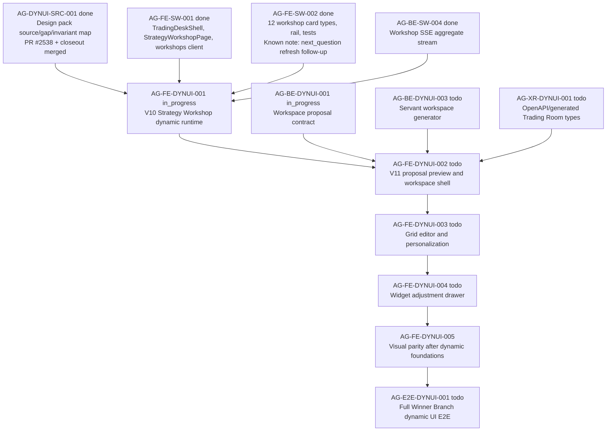

# AG-FE-DYNUI-001 Sidecar Acceptance Packet

**Sidecar task:** `AG-FE-DYNUI-001-SIDECAR-ACCEPTANCE`
**Helper parent:** `AG-FE-DYNUI-001`
**Helper kind:** `acceptance_packet`
**Parent title:** V10 Strategy Workshop dynamic runtime
**Parent owner:** `Codex`
**Parent reviewer:** `Claude`
**Parent status:** `in_progress` as of 2026-06-28
**Sidecar owner:** `Codex2`
**Sidecar reviewer:** `Codex`
**Date:** `2026-06-28`
**Status:** `review_approved`

> Scope constraint: support artifact only. This packet packages acceptance
> criteria, dependency routing, blocker triggers, and verification guidance for
> `AG-FE-DYNUI-001`. It does not edit canonical truth, schemas, OpenAPI, BFF
> routes, frontend runtime code, registry code, or governance implementation.

---

## 1. Purpose

`AG-FE-DYNUI-001` is the V10 Strategy Workshop runtime slice from the Agora
design-pack dynamic UI graph. The parent must upgrade the existing Strategy
Workshop from the earlier Phase 2 shell/cards into a dynamic co-construction
workspace:

1. A long Winner Branch strategy description must first produce a Strategy
   Reconstruction Card, before generic questions.
2. The right rail must track the V10 12 strategy blocks with data-derived
   states.
3. Workshop cards and rail updates must be driven by the BFF client and SSE
   stream, not local mock state or direct `fetch()`.
4. Trading Room readiness must stay gate-driven and hand off to the V11
   proposal-generation flow rather than opening an empty or static dashboard.

This sidecar intentionally stops at acceptance support for the parent owner.
V11 proposal preview, grid editing, widget revision, version history, rollback,
visual parity, and full E2E remain separate tasks.

---

## 2. Sources Used

| Source | Role for this packet |
| --- | --- |
| `.orchestrator/task-briefs/ag_fe_dynui_001_sidecar_acceptance.md` | Sidecar scope: acceptance packet and dependency map only. |
| `docs/04/agora_design_pack_dynui_2026-06-28/README.md` | Dynamic UI execution packet and task graph. |
| `docs/04/agora_design_pack_dynui_2026-06-28/source-map-and-gap-map.md` | Frozen V10/V11 source map, current gap map, and non-static dynamic invariants. |
| `docs/04/agora_design_pack_dynui_2026-06-28/closeout.md` | `AG-DYNUI-SRC-001` closeout evidence and merged intake record. |
| `docs/04/pantheon_agora_cross_repo_2026-06-20/contract-closure/05_execute_plans_agora_ui_ia_and_dependencies.md` | Agora IA: Trading Room, Strategy Workshop, Performance; BFF boundary. |
| `services/control-plane/specs/agora/strategy_completeness.schema.json` | Existing completeness schema; confirms the old seven generic dimensions are not enough for V10 12-block acceptance. |
| `services/control-plane/specs/agora/v4/workshop_card.schema.json` | Typed workshop card payloads, including `servant_reconstruction`, `completeness_update`, `next_question`, and `readiness_gate`. |
| `services/control-plane/specs/agora/v4/workshop_stream_event.schema.json` | SSE event enum, including `workshop.next_question.updated`, completeness, readiness, servant response, research, patch, and version events. |
| `services/control-plane/specs/agora/v4/strategy_readiness.schema.json` | Three readiness gates and `highest_ready_gate` model. |
| `execute-plans/src/agora/pages/strategy-workshop/StrategyWorkshopPage.tsx` | Existing workshop page, BFF client usage, SSE refresh reducer, add-to-Trading-Room gate. |
| `execute-plans/src/agora/components/StrategyCompletenessRail.tsx` | Existing rail implementation and current gap against V10 12-block rail. |
| `execute-plans/src/agora/components/WorkshopCardRenderer.tsx` | Existing card renderer and current generic reconstruction-card limitation. |

---

## 3. Parent Acceptance Checklist

| # | Criterion | Acceptance rule |
| --- | --- | --- |
| 1 | **Design-pack evidence is explicit** | Parent closeout evidence lists the V10/V11/V6/V4 design docs, `Agora.dc.html`, and the four required screenshots from the design pack or the frozen `source-map-and-gap-map.md`. If the archive cannot be read, parent opens a blocker. |
| 2 | **Workshop is dynamic, not a chat/form/static page** | `/agora/strategy-workshop` remains a Strategy Workshop workspace with card stream, rail, composer, readiness CTA, and event-driven updates. Static screenshots, hardcoded mock cards, a landing page, or a plain StrategySpec form fail acceptance. |
| 3 | **First servant response is reconstruction** | For a long Winner Branch description, the first completed servant response inserted into the card stream is `servant_reconstruction`. `next_question`, `missing_definition`, or generic assistant text may follow, but cannot be the first servant response. |
| 4 | **Strategy Reconstruction Card covers V10 content** | The rendered reconstruction card shows V10-required strategy core, derived research subquestions, recognized components, research/legal limitation labels, servant inferences, uncertainty/contradiction markers, and proposed next actions when present. Reusing only the old causal-chain card is insufficient. |
| 5 | **Card reducer preserves sequence truth** | Card rendering sorts by `sequence_no`, upserts by `card_id`, and does not reorder reconstruction/question/research cards by local UI preference. Tests cover initial load and stream-triggered refresh. |
| 6 | **SSE event handling is complete for this slice** | `workshop.servant.response.completed`, `workshop.completeness.updated`, `workshop.next_question.updated`, `workshop.readiness.updated`, research events, patch events, version events, and `workshop.snapshot` refresh the correct data surfaces. The existing omission of `workshop.next_question.updated` must be fixed or explicitly blocked. |
| 7 | **BFF boundary stays strict** | Page code uses `src/lib/bff-v1/agora/workshops.ts` functions and `openWorkshopStream`. No direct page-level `fetch()`, Management route, RuntimeBinding route, broker route, or capital-affecting action is introduced. |
| 8 | **V10 12-block rail is data-derived** | The rail renders the V10 blocks: market scope; insider/branch mapping; winner branch scoring; migration and reverse flow; event lead; signal formation; entry and holding; add/reduce/exit; sizing and leverage; cost/liquidity/capacity; validation/backtest/refutation; monitoring/update. States must distinguish confirmed, servant-inferred, missing, weak, and conflict. Display labels may be constants, but state must come from typed data. |
| 9 | **No fake 12-block mapping from old schema** | The old `strategy_completeness.schema.json` enum has seven generic dimensions. Parent must not pretend those seven fields satisfy V10. If no typed card/readiness/completeness payload can carry the 12-block states, parent must open a contract blocker or handoff instead of inventing fields. |
| 10 | **Readiness controls Trading Room handoff** | Add-to-Trading-Room remains disabled until `highest_ready_gate === "trading_room"` and a real handoff handler exists. A ready state must initiate the V11 proposal-generation route/shell when available; it must not navigate to an empty dashboard or static Trading Room skeleton. |
| 11 | **No arbitrary frontend code path** | The slice does not add `eval()`, `new Function()`, `dangerouslySetInnerHTML`, iframes, raw HTML/JS injection, external scripts, or agent-generated React execution. |
| 12 | **Design language moves toward V10 but not by static clone** | Visual updates should align with the design-pack dark AGORA shell and Strategy Workshop density where in scope, but must sit on dynamic data/components. Recreating `Agora.dc.html` as production code fails. |
| 13 | **Regression coverage exists** | Focused tests cover first-response ordering, reconstruction card sections, 12-block rail states, next-question stream refresh, readiness disabled/enabled CTA, BFF-only client usage, and no direct broker/Management wording. |
| 14 | **Screenshot or browser evidence is attached by parent** | Parent closeout includes screenshot/Playwright evidence for V10 mid-state: long Winner Branch input, reconstruction card before questions, 12-block rail, composer, and disabled/ready Trading Room CTA. |

---

## 4. Dependency Map



### Dependency notes

| Task | State | Relevance to `AG-FE-DYNUI-001` |
| --- | --- | --- |
| `AG-DYNUI-SRC-001` | `done` | Freezes the source map and non-static invariants. Parent must cite it. |
| `AG-FE-SW-001` | `done` | Provides existing Strategy Workshop page shell and BFF client pattern. |
| `AG-FE-SW-002` | `done` | Provides card renderer and rail foundation. Parent must extend/fix it for V10, not duplicate unrelated cards. |
| `AG-BE-SW-004` | `done` | Provides SSE aggregate stream and event source for dynamic card/rail/readiness updates. |
| `AG-BE-DYNUI-001` | `in_progress` | Downstream V11 workspace proposal contract. Parent should only hand off readiness into it. |
| `AG-FE-DYNUI-002` | `todo` | Owns proposal preview and active workspace shell. Parent should not absorb this scope. |
| `AG-FE-DYNUI-003` | `todo` | Owns grid editing and personalization events. Parent should not absorb this scope. |
| `AG-FE-DYNUI-004` | `todo` | Owns widget adjustment drawer and before/after revision. Parent should not absorb this scope. |
| `AG-E2E-DYNUI-001` | `todo` | Final dynamic UI proof after all runtime and contract slices compose. |

---

## 5. Blocker Triggers For Parent Owner

Parent owner should stop and open a blocker if any of these are true:

1. The design archive or frozen source map cannot be read.
2. V10 requires a field/route/enum/widget that is not present in committed
   schemas or generated frontend types.
3. The 12-block rail cannot be represented without inventing fields.
4. The first-response reconstruction ordering depends on backend behavior that
   is not emitted by the current stream/card route.
5. The Trading Room handoff requires `TradingRoomWorkspaceProposal` routes before
   `AG-BE-DYNUI-001`/`AG-XR-DYNUI-001` are ready.
6. Any implementation path would require direct `fetch()`, raw HTML/JS/React
   injection, Management/RuntimeBinding/broker language, or order/capital
   actions.

---

## 6. Suggested Parent Verification Plan

Run from the relevant `execute-plans` checkout after parent implementation:

```bash
npm --prefix execute-plans test -- --run \
  src/agora/pages/strategy-workshop/StrategyWorkshopPage.test.tsx \
  src/agora/components/StrategyCompletenessRail.test.tsx \
  src/agora/components/WorkshopCardRenderer.test.tsx
```

```bash
npm --prefix execute-plans run build:agora
```

Recommended additional evidence:

- focused test for long Winner Branch input -> first `servant_reconstruction`
  card -> later `next_question`;
- focused test for `workshop.next_question.updated` triggering card/rail refresh;
- focused test for all 12 V10 rail blocks and five states;
- screenshot or Playwright evidence of the V10 mid-state and readiness CTA;
- `rg` or test assertion proving no direct `fetch(` in
  `StrategyWorkshopPage.tsx` and no Management/RuntimeBinding/broker/order text
  in the Agora Strategy Workshop UI.

---

## 7. Support-Only Boundary Confirmation

- No L1/L2 canonical policy or architecture document was edited.
- No backend schema, OpenAPI, BFF route, runtime, registry, or governance
  implementation was changed.
- No frontend runtime file was changed by this sidecar.
- The only intended deliverable is this support packet:
  `support/sidecars/AG-FE-DYNUI-001/AG-FE-DYNUI-001-SIDECAR-ACCEPTANCE.md`.
- The sidecar does not approve the parent implementation. It gives the parent
  owner and reviewer a concrete acceptance surface.

---

## 8. Reviewer Handoff Notes

**Reviewer:** `Codex`

### What to verify

1. The packet stays support-only and does not redefine canonical contract truth.
2. The acceptance checklist correctly separates `AG-FE-DYNUI-001` from V11
   proposal/grid/revision/version follow-ups.
3. The 12-block rail warning is accurate: the old seven-dimension completeness
   enum is not enough for V10.
4. The suggested verification plan is concrete enough for parent owner use.

### Suggested reviewer command

```bash
AI_NAME=Codex ./scripts/ai-status.sh approve AG-FE-DYNUI-001-SIDECAR-ACCEPTANCE "Acceptance packet approved; support artifact gives AG-FE-DYNUI-001 concrete V10 Strategy Workshop criteria, dependency routing, blocker triggers, and verification guidance without changing canonical truth."
```

If changes are required:

```bash
AI_NAME=Codex ./scripts/ai-status.sh reopen AG-FE-DYNUI-001-SIDECAR-ACCEPTANCE "Describe the exact packet corrections needed."
```

*Prepared by Codex2 for the `AG-FE-DYNUI-001-SIDECAR-ACCEPTANCE` sidecar slice.*

---

## 9. Closeout Finalization

- Review approval is recorded in the task status record with reviewer `Codex`
  and `review_file` pointing at this packet.
- Initial packet commit `f764f84c891ee66e698754ebd5539fc912e80054`
  merged to `dev` through PR #2568 as merge commit
  `ad1fbb153d629d5927ce82ae1300d47ec78b4a43`.
- Finalization remains support-only: no canonical truth, schema, OpenAPI, BFF
  route, frontend runtime, registry, governance, or parent implementation file
  is changed by this sidecar.
- Closeout verification checks are limited to task status, merge ancestry, and
  packet scope because this slice only publishes acceptance support material.
