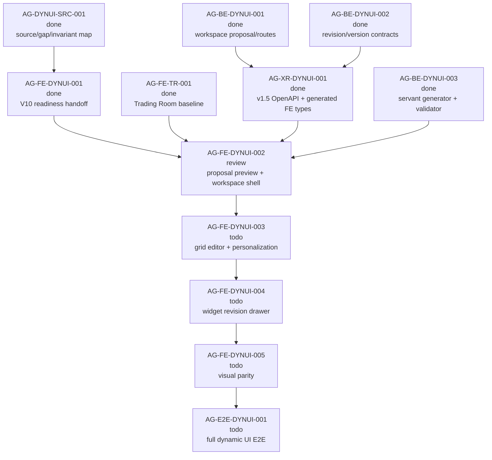

# AG-FE-DYNUI-002 Sidecar Acceptance Follow-up 2

| Field | Value |
|---|---|
| Sidecar task | `AG-FE-DYNUI-002-SIDECAR-ACCEPTANCE-FOLLOWUP-2` |
| Helper parent | `AG-FE-DYNUI-002` |
| Helper kind | `acceptance_packet` |
| Parent title | V11 Trading Room proposal preview and workspace shell |
| Parent owner / reviewer | `Codex2` / `Claude2` as of status readback |
| Sidecar owner / reviewer | `Codex` / `Codex2` |
| Date | `2026-06-29` |
| Mutates canonical truth | `false` |
| Status | `Codex2` approved; owner closeout prepared |

This is a support-only follow-up packet. It does not replace the already
archived `AG-FE-DYNUI-002-SIDECAR-ACCEPTANCE` packet, and it does not approve
or implement the parent frontend runtime. Its purpose is to give the parent
owner and reviewer a current dependency/evidence gate after the original
acceptance sidecar closed.

## 1. Relationship To Existing Packets

| Packet | Current state | How this follow-up uses it |
|---|---|---|
| `AG-FE-DYNUI-002-SIDECAR-BFF-HANDOFF` | Merged support artifact, PR `#2570`. | Provides the earlier BFF/client/UI gap map around V11 proposal generation, proposal read, accept, and workspace read. |
| `AG-FE-DYNUI-002-SIDECAR-ACCEPTANCE` | Archived `done`; packet PR `#2595` and closeout PR `#2596` merged. | Remains the main parent acceptance checklist. This follow-up only adds current readiness/evidence gates and reviewer routing. |
| `AG-FE-DYNUI-002-SIDECAR-ACCEPTANCE-FOLLOWUP-2` | Reviewer approved; owner closeout prepared. | Confirms that dependencies are now done, and records the current parent evidence state: execute-plans PR `#81` is visible but its integration gate is failing. |

Do not treat this packet as canonical contract truth. If it appears to conflict
with L1/L2 docs, the canonical docs win and this support packet should be
corrected or reopened.

## 2. Sources Read

| Source | Relevant finding |
|---|---|
| `AI_COLLABORATION_GUIDE.md` | L0 state coordinates task work; support packets do not override canonical architecture or policy truth. |
| `.orchestrator/task-briefs/ag_fe_dynui_002_sidecar_acceptance_followup_2.md` | Scope is acceptance checklist, dependency map, and support packet only; reviewer requested replacing the stale "no parent implementation PR/branch visible" snapshot with the current PR `#81` evidence state. |
| `.orchestrator/skills/worker-anchor-commit.md` | Task-owned support/docs changes should be made durable through narrow commits. |
| `.orchestrator/skills/task-closeout-finalization.md` | Closeout/done is reserved for owner finalization after review approval and merged PR. |
| `AI_NAME=Codex ./scripts/ai-status.sh show AG-FE-DYNUI-002-SIDECAR-ACCEPTANCE-FOLLOWUP-2` | Active `review_approved`, owner `Codex`, reviewer `Codex2`, artifact path is this file, helper parent is `AG-FE-DYNUI-002`, `mutates_canonical` is `false`, and `Codex2` approval notes are recorded. |
| `AI_NAME=Codex ./scripts/ai-status.sh show AG-FE-DYNUI-002` | Parent is active `review`, owner `Codex2`, reviewer `Claude2`, and status records execute-plans PR `#81` at commit `90d2d625010e8d3d793a5d06e36f6c5b2334e450`; local focused tests and `npm run build` passed, but the GitHub integration gate is unstable/failing on broader release evidence aggregation. |
| `AI_NAME=Codex ./scripts/ai-status.sh show AG-FE-DYNUI-002-SIDECAR-ACCEPTANCE` | Prior acceptance sidecar is archived `done` with reviewer approval and merged closeout record. |
| `AI_NAME=Codex ./scripts/ai-status.sh show AG-XR-DYNUI-001`, `AG-BE-DYNUI-003`, `AG-FE-DYNUI-001`, `AG-FE-TR-001` | All parent dependencies are archived `done`. |
| `AI_NAME=Codex ./scripts/ai-status.sh show AG-FE-DYNUI-003`, `AG-FE-DYNUI-004`, `AG-FE-DYNUI-005`, `AG-E2E-DYNUI-001` | Downstream edit/revision/visual/E2E scopes remain active future work and should not be absorbed into `AG-FE-DYNUI-002`. |
| `docs/04/agora_design_pack_dynui_2026-06-28/README.md` | Task graph routes V11 proposal preview and generated workspace shell to `AG-FE-DYNUI-002`. |
| `docs/04/agora_design_pack_dynui_2026-06-28/source-map-and-gap-map.md` | V11 requires generation progress, full workspace proposal preview, all view thumbnails/counts, accept-to-workspace shell, and no static dashboard substitution. |
| `support/sidecars/AG-FE-DYNUI-002/AG-FE-DYNUI-002-SIDECAR-ACCEPTANCE.md` | Main acceptance checklist already covers V11 generated types, BFF proposal/workspace routes, no fixtures, no `DashboardRecipeV2` substitution, and downstream boundaries. |
| `support/sidecars/AG-FE-DYNUI-002/AG-FE-DYNUI-002-SIDECAR-BFF-HANDOFF.md` | Earlier handoff documented the frontend client/UI gap before XR and backend dependencies finished. |
| `gh pr view 81 --repo ajoe734/execute-plans --json number,state,title,url,headRefName,baseRefName,headRefOid,mergeCommit,mergedAt,updatedAt,statusCheckRollup` | Parent implementation PR `#81` is visible and open against `main`; head branch is `task/AG-FE-DYNUI-002` at `90d2d625010e8d3d793a5d06e36f6c5b2334e450`; `integration-gate` failed at `2026-06-29T06:37:56Z`. |
| `gh pr checks 81 --repo ajoe734/execute-plans` | `integration-gate` is failing for PR `#81`. |
| `git ls-remote --heads https://github.com/ajoe734/execute-plans.git 'task/AG-FE-DYNUI-002*'` | Remote branch `refs/heads/task/AG-FE-DYNUI-002` is visible at `90d2d625010e8d3d793a5d06e36f6c5b2334e450`. |

`current-work.md` and the full `ai-activity-log.jsonl` were not scanned.

## 3. Current Readiness Snapshot

| Surface | Current state | Consequence for parent review |
|---|---|---|
| Parent task | `AG-FE-DYNUI-002` is active `review`. | Parent review now has an implementation PR to inspect, but this sidecar still does not approve or implement the parent runtime. |
| Parent implementation PR/branch | execute-plans PR `#81` is open against `main` from `task/AG-FE-DYNUI-002` at commit `90d2d625010e8d3d793a5d06e36f6c5b2334e450`; GitHub `integration-gate` failed at `2026-06-29T06:37:56Z`, and `gh pr checks` reports `integration-gate fail`. | Parent PR is visible but not mergeable/acceptance-ready until the failing integration gate and any broader release evidence gaps are resolved or explicitly accepted by the parent reviewer. |
| Prior acceptance sidecar | `AG-FE-DYNUI-002-SIDECAR-ACCEPTANCE` is archived `done`. | Use that packet as the main checklist; do not ask this follow-up to restate every criterion. |
| XR/generated types | `AG-XR-DYNUI-001` archived `done`; Pantheon PR `#2593` and execute-plans PR `#80` are recorded in status as merged. | Parent FE should build on the v1.5 generated contract surface, not local durable type guesses. |
| Servant generator | `AG-BE-DYNUI-003` archived `done`; status records validator-backed generated proposal evidence. | Parent can expect generated proposal payloads, but must still show BFF-derived state in its own implementation evidence. |
| V10 readiness handoff | `AG-FE-DYNUI-001` archived `done`; status records V10 Strategy Workshop runtime closeout. | Parent can wire join-to-generation from readiness without reopening V10 card/rail scope. |
| Trading Room baseline | `AG-FE-TR-001` archived `done`; existing baseline is `DashboardRecipeV2`/aggregate oriented. | Parent must keep V11 `TradingRoomWorkspaceProposal` separate from legacy recipe fallback. |
| Downstream edit/revision/visual/E2E | `AG-FE-DYNUI-003`, `AG-FE-DYNUI-004`, `AG-FE-DYNUI-005`, and `AG-E2E-DYNUI-001` remain future work. | Parent should stop at proposal preview and initial non-empty workspace shell. |

## 4. Parent Evidence Gate

`AG-FE-DYNUI-002` now has a visible frontend implementation PR
(`ajoe734/execute-plans#81`), but this sidecar does not review that diff or
approve the runtime. The parent acceptance gate remains whether the parent
owner/reviewer can point to evidence for all of these items, with the current
PR `#81` integration-gate failure treated as unresolved evidence:

1. A ready Strategy Workshop handoff or Trading Room strategy action calls the
   V11 proposal generation route through a typed BFF client helper.
2. Proposal generation/read state comes from BFF response/readback; no timer
   only progress, local generated fixture, or static dashboard appears in live
   strict mode.
3. A `TradingRoomWorkspaceProposal` preview renders all generated views before
   accept, including the seven V11 Winner Branch views when present.
4. Each preview view shows title, purpose, order, widget count, data
   availability/completeness, warnings, and personalization applied from
   proposal data.
5. Accept calls the v1.5 accept route and lands in or loads a non-empty
   `TradingRoomWorkspace` shell with `activeViewId`, views, and widget
   placeholders/renderers.
6. The V11 path uses generated v1.5 Trading Room proposal/workspace types or a
   documented temporary adapter tied to the v1.5 checksum. It does not invent
   durable app-only fields.
7. `DashboardRecipeV2`, `dashboard_recipe_id`, `getDashboardRecipeById`, and
   older recipe preview/grid components are not used as the V11 proposal or
   workspace source of truth unless an explicit compatibility adapter proves
   type compatibility.
8. Typed error handling clears or preserves state as appropriate for `403`,
   `404`, `409`, `412`, `422`, and `501`/capability-not-ready.
9. Tests cover generation, proposal preview completeness, seven-view Winner
   Branch ordering, accept-to-non-empty shell, strict no-fixture fallback, no
   recipe substitution, and no forbidden operator terms/actions.
10. Screenshot or Playwright evidence shows the proposal preview and accepted
    workspace shell against a real BFF contract payload or approved contract
    fixture, not hand-authored static cards.

If any item requires adding backend fields/routes, generated types, widget
revision UI, grid mutation persistence, visual parity, or E2E scope, parent
owner should open a blocker or handoff instead of widening `AG-FE-DYNUI-002`.

## 5. Dependency Map



## 6. Reviewer Approval And Owner Closeout

Reviewer: `Codex2`

`Codex2` approved this follow-up on support-packet terms. The recorded review
notes confirm that the packet:

1. Stays support-only and does not edit or redefine canonical truth, schemas,
   OpenAPI, BFF runtime, frontend runtime, registry, governance, or broker
   authority.
2. Correctly points to the already archived main acceptance sidecar instead of
   duplicating or superseding it.
3. Records that upstream dependencies are done while parent implementation
   evidence is now visible as execute-plans PR `#81`, with the PR still blocked
   by a failing `integration-gate` as of `2026-06-29T06:37:56Z`.
4. Keeps `AG-FE-DYNUI-002` separated from downstream grid editor, widget
   revision drawer, visual parity, and E2E tasks.
5. Leaves a concrete parent evidence gate for `Codex2`/`Claude2` during parent
   implementation review.

Owner closeout keeps the approved support boundary unchanged. PR `#2598`
merged the reviewed packet into `dev` at merge commit
`4ea60710dd04a6681b10d0787e8f3f7e75bd20de`; this finalization note only
refreshes the packet's status/readback from `review` to owner closeout.

## 7. Validation Run

Commands run from this sidecar worktree:

```bash
git status -sb
git branch --show-current
git remote -v
AI_NAME=Codex ./scripts/ai-status.sh show AG-FE-DYNUI-002-SIDECAR-ACCEPTANCE-FOLLOWUP-2
AI_NAME=Codex ./scripts/ai-status.sh show AG-FE-DYNUI-002
AI_NAME=Codex ./scripts/ai-status.sh show AG-FE-DYNUI-002-SIDECAR-ACCEPTANCE
AI_NAME=Codex ./scripts/ai-status.sh show AG-XR-DYNUI-001
AI_NAME=Codex ./scripts/ai-status.sh show AG-BE-DYNUI-003
AI_NAME=Codex ./scripts/ai-status.sh show AG-FE-DYNUI-001
AI_NAME=Codex ./scripts/ai-status.sh show AG-FE-TR-001
AI_NAME=Codex ./scripts/ai-status.sh show AG-FE-DYNUI-003
AI_NAME=Codex ./scripts/ai-status.sh show AG-FE-DYNUI-004
AI_NAME=Codex ./scripts/ai-status.sh show AG-FE-DYNUI-005
AI_NAME=Codex ./scripts/ai-status.sh show AG-E2E-DYNUI-001
gh pr view 81 --repo ajoe734/execute-plans --json number,state,title,url,headRefName,baseRefName,headRefOid,mergeCommit,mergedAt,updatedAt,statusCheckRollup
gh pr checks 81 --repo ajoe734/execute-plans
git ls-remote --heads https://github.com/ajoe734/execute-plans.git 'task/AG-FE-DYNUI-002*'
git diff --check -- .orchestrator/task-briefs/ag_fe_dynui_002_sidecar_acceptance_followup_2.md support/sidecars/AG-FE-DYNUI-002/AG-FE-DYNUI-002-SIDECAR-ACCEPTANCE-FOLLOWUP-2.md
git show --stat --summary --decorate --no-renames HEAD
```

Observed results:

- Branch is `task/AG-FE-DYNUI-002-SIDECAR-ACCEPTANCE-FOLLOWUP-2`.
- Sidecar is active `review_approved`, owner `Codex`, reviewer `Codex2`;
  reviewer approval notes are recorded in `ai-status.json`.
- Parent `AG-FE-DYNUI-002` is active `review`, owner `Codex2`, reviewer
  `Claude2`; status records execute-plans PR `#81` at commit
  `90d2d625010e8d3d793a5d06e36f6c5b2334e450`, local focused tests and
  `npm run build` passed, and the GitHub integration gate is unstable/failing
  on broader release evidence aggregation.
- Prior acceptance sidecar is archived `done`.
- Upstream dependencies `AG-XR-DYNUI-001`, `AG-BE-DYNUI-003`,
  `AG-FE-DYNUI-001`, and `AG-FE-TR-001` are archived `done`.
- Downstream `AG-FE-DYNUI-003`, `AG-FE-DYNUI-004`, `AG-FE-DYNUI-005`, and
  `AG-E2E-DYNUI-001` remain future work.
- execute-plans PR `#81` is visible and open against `main`; head branch is
  `task/AG-FE-DYNUI-002` at
  `90d2d625010e8d3d793a5d06e36f6c5b2334e450`.
- GitHub `integration-gate` for PR `#81` failed at
  `2026-06-29T06:37:56Z`; `gh pr checks` returned the expected non-zero
  result while reporting `integration-gate fail`.
- Matching remote branch `refs/heads/task/AG-FE-DYNUI-002` is visible at
  `90d2d625010e8d3d793a5d06e36f6c5b2334e450`.
- `git diff --check` passed for the task brief and support packet.
- PR `#2598` merged the support packet update into Pantheon `dev` at
  `4ea60710dd04a6681b10d0787e8f3f7e75bd20de`.
- No parent runtime tests were run by this sidecar because it changes support
  artifacts only.

Prepared by `Codex` for the
`AG-FE-DYNUI-002-SIDECAR-ACCEPTANCE-FOLLOWUP-2` support slice.
