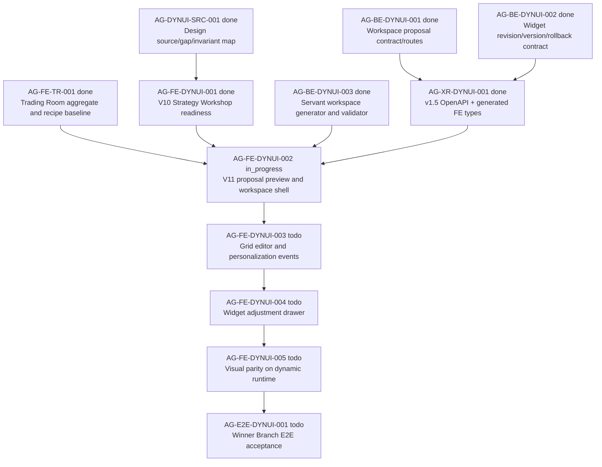

# AG-FE-DYNUI-002 Sidecar Acceptance Packet

| Field | Value |
|---|---|
| Sidecar task | `AG-FE-DYNUI-002-SIDECAR-ACCEPTANCE` |
| Helper parent | `AG-FE-DYNUI-002` |
| Helper kind | `acceptance_packet` |
| Parent title | V11 Trading Room proposal preview and workspace shell |
| Parent owner / reviewer | `Codex2` / `Claude2` as of `2026-06-29` status readback |
| Sidecar owner / reviewer | `Codex` / `Codex2` |
| Date | `2026-06-29` |
| Mutates canonical truth | `false` |
| Status | Ready for reviewer handoff |

This packet is support material only. It packages acceptance criteria,
dependency routing, blocker triggers, and verification guidance for
`AG-FE-DYNUI-002`. It does not edit L1 canonical truth, schemas, OpenAPI, BFF
runtime, frontend runtime, registry, governance, broker authority, or parent
implementation files.

## 1. Purpose

`AG-FE-DYNUI-002` owns the frontend bridge from a Strategy Workshop-ready
strategy into the V11 Trading Room dynamic workspace flow:

1. start a generated `TradingRoomWorkspaceProposal`;
2. show generation/proposal state from the BFF, not local fixtures;
3. preview all generated views and widget counts before accept;
4. accept the proposal and enter a non-empty `TradingRoomWorkspace` shell;
5. keep later grid editing, widget revision, version history, rollback, and
   final visual parity assigned to downstream tasks.

This sidecar intentionally stops at acceptance support. The parent owner decides
how to compose it into the active `AG-FE-DYNUI-002` implementation.

## 2. Sources Used

| Source | Role for this packet |
|---|---|
| `AI_COLLABORATION_GUIDE.md` | L0/L1/L2 truth layering, sidecar lifecycle, status command rules, and support-only boundaries. |
| `.orchestrator/task-briefs/ag_fe_dynui_002_sidecar_acceptance.md` | Sidecar scope: acceptance checklist, dependency map, and support packet only. |
| `.orchestrator/skills/worker-anchor-commit.md` | Commit boundary for task-owned support/docs surfaces. |
| `.orchestrator/skills/task-closeout-finalization.md` | Closeout boundary; this packet is a review handoff, not owner `done` closeout. |
| `AI_NAME=Codex ./scripts/ai-status.sh show AG-FE-DYNUI-002-SIDECAR-ACCEPTANCE` | Confirmed active sidecar owner `Codex`, reviewer `Codex2`, status `in_progress`, helper parent `AG-FE-DYNUI-002`, support artifact path, and `mutates_canonical: false`. |
| `AI_NAME=Codex ./scripts/ai-status.sh show AG-FE-DYNUI-002` | Confirmed parent active `in_progress`, owner `Codex2`, reviewer `Claude2`, and V11 scope around generation progress, proposal preview, view thumbnails/counts, and accept-to-workspace shell. |
| `docs/04/agora_design_pack_dynui_2026-06-28/README.md` | Dynamic UI execution packet, V11 invariants, task graph, and non-goals. |
| `docs/04/agora_design_pack_dynui_2026-06-28/source-map-and-gap-map.md` | Source/gap map: AG-FE-DYNUI-002 owns V11 proposal preview and workspace shell; static screenshots and empty dashboard substitutions fail. |
| `support/sidecars/AG-FE-DYNUI-002/AG-FE-DYNUI-002-SIDECAR-BFF-HANDOFF.md` | Prior support-only BFF/frontend handoff. Useful for journey and error-state coverage; updated here with newer dependency state. |
| `services/control-plane/openapi/agora_v1_5.openapi.yaml` | Current Pantheon v1.5 OpenAPI has proposal create/read/accept and workspace read route family. |
| `services/control-plane/specs/agora/trading_room_workspace.schema.json` | Current Pantheon schema has `TradingRoomWorkspaceProposal`, `TradingRoomWorkspace`, `TradingRoomViewSpec`, `TradingRoomWidgetSpec`, and `WidgetRevisionProposal` definitions. |
| `services/control-plane/specs/agora/v6/capability_manifest_v1_5.json` | Capability manifest lists workspace proposal, workspace editing, widget revision, and workspace version route families. |
| `AI_NAME=Codex ./scripts/ai-status.sh show AG-BE-DYNUI-001`, `AG-BE-DYNUI-002`, `AG-BE-DYNUI-003`, `AG-XR-DYNUI-001`, `AG-FE-DYNUI-001`, `AG-FE-TR-001` | Confirmed upstream contracts, generator, generated type sync, Strategy Workshop runtime, and existing Trading Room baseline are archived `done`. |
| `gh pr view 80 --repo ajoe734/execute-plans ...` and `git -C /home/lupin/code/execute-plans grep ... origin/main` | Confirmed execute-plans PR `#80` merged v1.5 generated types/snapshot to `main`; `types.ts` includes V11 types and route paths. |
| `execute-plans/src/agora/pages/trading-room/TradingRoomPage.tsx` and `execute-plans/src/lib/bff-v1/agora/tradingRoom.ts` in the Pantheon snapshot plus execute-plans `origin/main` grep | Current FE Trading Room page/client still use `DashboardRecipeV2`, `dashboard_recipe_id`, `getDashboardRecipeById`, and `strategy-recipe-workspace`; no V11 proposal/workspace client helpers are present yet. |

`current-work.md` and the full `ai-activity-log.jsonl` were not scanned.

## 3. Current Compose Snapshot

| Surface | Observed state | Acceptance consequence |
|---|---|---|
| Parent task | `AG-FE-DYNUI-002` is active `in_progress`, owner `Codex2`, reviewer `Claude2`. | This packet should be reviewed by `Codex2`, then parent owner decides whether/how to absorb it into the implementation branch. |
| Backend workspace proposal contract | `AG-BE-DYNUI-001` archived `done`; Pantheon v1.5 OpenAPI has proposal create/read/accept and workspace read routes. | Parent FE should consume the published route family rather than invent local fields or treat missing routes as the default state. |
| Widget revision/version backend | `AG-BE-DYNUI-002` archived `done`. | Parent should preserve handoff state for later edit/revision tasks, but AG-FE-DYNUI-002 should not absorb widget revision UI. |
| Servant workspace generator | `AG-BE-DYNUI-003` archived `done`; review notes say generator remains declarative and validator-backed. | Parent should expect generated proposal payloads, not local mock workspace construction. |
| Generated contract/types | `AG-XR-DYNUI-001` archived `done`; execute-plans PR `#80` merged to `main`, and `origin/main` generated `types.ts` includes `TradingRoomWorkspaceProposal`, `TradingRoomWorkspace`, `TradingRoomWidgetSpec`, and `WidgetRevisionProposal`. | Parent FE should update from the current execute-plans `main` or a task worktree that includes PR `#80`. A branch without those generated types is stale. |
| Strategy Workshop readiness | `AG-FE-DYNUI-001` archived `done`; V10 readiness CTA is gate-controlled. | Parent can wire the ready handoff into V11 proposal generation, but must not reopen V10 Strategy Workshop scope. |
| Existing Trading Room baseline | `AG-FE-TR-001` archived `done`; current page uses aggregate/decision events and `dashboard_recipe_id` to load `DashboardRecipeV2`. | Baseline may remain for legacy/read-only surfaces, but V11 join-to-workspace must not use `DashboardRecipeV2` as the proposal/workspace source. |
| Active FE implementation gap | Current Trading Room client/page still lack V11 helper methods and V11 UI state. | Parent acceptance requires explicit V11 client methods, generation/proposal states, accept flow, and tests. |
| Downstream FE runtime | `AG-FE-DYNUI-003`, `AG-FE-DYNUI-004`, `AG-FE-DYNUI-005`, and `AG-E2E-DYNUI-001` remain future work. | Parent must stop at proposal preview and initial non-empty workspace shell, leaving editing, revision drawer, visual parity, and E2E proof to their tasks. |

## 4. Parent Acceptance Checklist

| # | Criterion | Acceptance rule |
|---|---|---|
| 1 | **Design-pack and source-map evidence is explicit** | Parent closeout cites `docs/04/agora_design_pack_dynui_2026-06-28/README.md`, `source-map-and-gap-map.md`, and the V11 Winner Branch design source or extracted sections used. If a required source cannot be read, parent opens a blocker instead of guessing. |
| 2 | **Implementation uses published V11 contract/types** | FE code imports/uses generated `TradingRoomWorkspaceProposal`, `TradingRoomWorkspace`, `TradingRoomViewSpec`, and `TradingRoomWidgetSpec` types from the current execute-plans v1.5 generated surface or a deliberately narrow adapter tied to v1.5 checksums. Ad hoc durable fields fail. |
| 3 | **Join starts proposal generation** | The Strategy Workshop ready handoff or Trading Room strategy action calls `POST /bff/agora/strategies/{strategy_id}/trading-room/proposals` through a BFF client helper. It must not jump directly to `DashboardRecipeV2`, a static skeleton, or an empty grid. |
| 4 | **Generation state is BFF-derived** | The UI shows generation/submission/proposal-ready/failed/capability-unavailable states from the BFF response or proposal readback. Timer-only animation, local fake progress, or fixture proposal state fails. |
| 5 | **Proposal preview precedes workspace entry** | Before accept, the UI renders a `TradingRoomWorkspaceProposal` preview with all `views[]` and overall proposal metadata. The operator can inspect the proposal and cancel/return without creating a blank workspace. |
| 6 | **Winner Branch minimum views render** | A Winner Branch proposal with the seven V11-required views renders all seven in order: strategy overview, candidates/entry, winner branch intelligence, related-party/flow migration, event lead, positions/add/reduce/exit, and evidence/monitoring rules. |
| 7 | **Per-view preview metadata is visible** | Each preview view shows title, purpose, order, widget count, data availability/completeness, warnings, and personalization applied. A thumbnail can be visual or a structured layout summary, but it must be derived from proposal view/widget specs. |
| 8 | **Accept creates or loads a non-empty workspace shell** | Accept calls `POST /bff/agora/strategies/{strategy_id}/trading-room/proposals/{proposal_id}/accept`, then uses the returned workspace or `GET /bff/agora/trading-room/workspaces/{workspace_id}`. The resulting shell has `activeViewId`, view tabs/cards, and widget placeholders/renderers when the proposal contained views/widgets. |
| 9 | **Workspace source is V11, not recipe substitution** | The V11 path uses `TradingRoomWorkspace` as source of truth. `DashboardRecipeV2`, `getDashboardRecipeById`, `DashboardProposalPreview`, or `DashboardGridEditor` may only be reused behind an explicit compatibility adapter after type compatibility is proven; they cannot be the proposal/workspace source. |
| 10 | **Strict fallback posture is enforced** | In live strict mode, no fixtures, locally generated mock workspaces, static cards, or silent `DashboardRecipeV2` fallbacks appear after generation/read/accept failures. Capability-not-ready or BFF-unavailable state is visible and terminal for that attempt. |
| 11 | **Error states are typed and state-clearing** | `403` clears proposal/workspace state and shows a scope error; `404` clears stale navigation; `409` re-reads proposal/workspace workflow state; `412` preserves ETag/stale-write handoff for downstream edit tasks; `422` surfaces validation details; `501` or capability absence shows capability-not-ready without substituting fake data. |
| 12 | **BFF boundary remains strict** | Page components call typed helpers from `src/lib/bff-v1/agora/tradingRoom.ts` or a narrow sibling module. New direct page-level `fetch()` calls, Management routes, RuntimeBinding routes, broker routes, or capital-affecting actions fail. |
| 13 | **Security and terminology boundary is preserved** | The UI does not expose direct order routing, broker/backend controls, capital binding, RuntimeBinding, Management-plane terms, `eval`, `new Function`, `dangerouslySetInnerHTML`, raw HTML/JS/script injection, or unsupported renderer execution. |
| 14 | **Downstream task boundaries stay intact** | AG-FE-DYNUI-002 may render initial workspace shell placeholders and preserve IDs/ETags, but it does not implement drag/resize/add/remove/restore/duplicate/change-chart persistence, widget adjustment drawer, before/after revision flow, version history, rollback, or final visual parity. |
| 15 | **Regression and browser evidence exists** | Parent includes focused tests for generation, proposal preview, all-view metadata, accept-to-workspace, error handling, no fixture fallback, no recipe substitution for V11, and no forbidden UI terms. Parent closeout also includes screenshot or Playwright evidence for the proposal preview and accepted non-empty workspace shell. |

## 5. Dependency Map



### Dependency notes

| Task | Current state | Relevance to AG-FE-DYNUI-002 |
|---|---|---|
| `AG-BE-DYNUI-001` | `done` | Proposal create/read/accept and workspace read contract/routes are available in Pantheon v1.5. |
| `AG-BE-DYNUI-002` | `done` | Downstream edit/revision/version semantics exist; parent should not absorb their UI. |
| `AG-BE-DYNUI-003` | `done` | Generated proposal payloads should come from BFF/generator, not client-side fixtures. |
| `AG-XR-DYNUI-001` | `done` | execute-plans `main` has v1.5 generated types/snapshot; parent FE branch must include them. |
| `AG-FE-DYNUI-001` | `done` | Readiness CTA can hand off to V11 proposal generation. |
| `AG-FE-TR-001` | `done` | Existing Trading Room route and aggregate page are the baseline to replace/gate for V11. |
| `AG-FE-DYNUI-003` | `todo` | Owns persisted grid editor and personalization events after initial workspace shell. |
| `AG-FE-DYNUI-004` | `todo` | Owns widget adjustment drawer and before/after revision flow. |
| `AG-FE-DYNUI-005` | `todo` | Owns final visual parity after dynamic runtime exists. |
| `AG-E2E-DYNUI-001` | `todo` | Owns full Winner Branch flow proof after FE/BE/XR slices compose. |

## 6. Blocker Triggers For Parent Owner

Parent owner should stop and open a blocker or reviewer handoff if any of these
are true:

1. The active execute-plans branch does not include v1.5 generated types or
   contract snapshot from PR `#80`.
2. The dev BFF target does not expose the v1.5 proposal/workspace route family
   or returns an envelope shape that cannot be mapped to generated types.
3. A proposal payload lacks the V11-required views, widget counts, rationale,
   data availability, warnings, or personalization metadata.
4. The FE cannot preserve scope isolation on `403` without leaving stale
   proposal/workspace content visible.
5. Accepting a proposal can lead to an empty workspace despite non-empty
   proposal views/widgets.
6. Implementation would require inventing durable fields, route names, widget
   types, renderer code, or error envelopes not in the published contract.
7. Any path requires direct order routing, broker/capital/RuntimeBinding/
   Management UI, raw code execution, or bypassing widget/chart validation.
8. The parent branch needs to implement grid editing, widget revision drawer,
   version history, rollback, or visual parity to make the initial shell work.
   Those are downstream scopes; open a blocker instead of widening this task.

## 7. Suggested Parent Verification Plan

Run from the relevant execute-plans task worktree after parent implementation:

```bash
npm test -- --run \
  src/agora/pages/trading-room/TradingRoomPage.test.tsx \
  src/lib/bff-v1/agora/tradingRoom.test.ts
```

```bash
npm run contract:drift -- --summary
npm run build:agora
```

Recommended additional focused checks:

- a test where a ready Strategy Workshop handoff calls the proposal generation
  helper and shows BFF-derived generation/proposal state;
- a test that a Winner Branch proposal renders all seven V11 views in order with
  widget counts, data availability, warnings, and personalization;
- a test that accept calls the v1.5 accept route and renders a non-empty active
  workspace shell;
- a test that `501`/capability absence and `403` do not render fixtures, recipe
  workspace, or stale proposal/workspace state;
- an assertion or scoped grep proving `getDashboardRecipeById` is not used as
  the V11 proposal/workspace source;
- a scoped safety grep for `fetch(` in Trading Room page components and for
  forbidden strings such as `RuntimeBinding`, `broker`, `capital`, `place order`,
  `enable live`, `eval(`, `new Function`, `dangerouslySetInnerHTML`, and
  `<iframe`;
- Playwright or screenshot evidence for proposal preview and accepted workspace
  shell, using a real BFF fixture/contract payload rather than static cards.

Optional Pantheon-side compose verification if the parent needs BFF route
evidence:

```bash
python3 -m pytest services/control-plane/bff/agora/trading_room/test_trading_room.py -q
python3 -m pytest scripts/test_agora_v1_5_bundle.py -q
```

## 8. Support-Only Boundary Confirmation

- No L1/L2 canonical policy or architecture document was edited by this sidecar.
- No backend schema, OpenAPI, BFF route, runtime, registry, or governance
  implementation was changed by this sidecar.
- No frontend runtime file was changed by this sidecar.
- The only intended deliverable is this support packet:
  `support/sidecars/AG-FE-DYNUI-002/AG-FE-DYNUI-002-SIDECAR-ACCEPTANCE.md`.
- The sidecar does not approve the parent implementation. It gives the parent
  owner and reviewer a concrete acceptance surface.

## 9. Validation Run

Commands run from this sidecar worktree unless noted:

```bash
git fetch origin
git status -sb
git branch --show-current
git remote -v
AI_NAME=Codex ./scripts/ai-status.sh show AG-FE-DYNUI-002-SIDECAR-ACCEPTANCE
AI_NAME=Codex ./scripts/ai-status.sh show AG-FE-DYNUI-002
AI_NAME=Codex ./scripts/ai-status.sh show AG-BE-DYNUI-001
AI_NAME=Codex ./scripts/ai-status.sh show AG-BE-DYNUI-002
AI_NAME=Codex ./scripts/ai-status.sh show AG-BE-DYNUI-003
AI_NAME=Codex ./scripts/ai-status.sh show AG-XR-DYNUI-001
AI_NAME=Codex ./scripts/ai-status.sh show AG-FE-DYNUI-001
AI_NAME=Codex ./scripts/ai-status.sh show AG-FE-TR-001
AI_NAME=Codex ./scripts/ai-status.sh show AG-FE-DYNUI-003
AI_NAME=Codex ./scripts/ai-status.sh show AG-FE-DYNUI-004
AI_NAME=Codex ./scripts/ai-status.sh show AG-FE-DYNUI-005
AI_NAME=Codex ./scripts/ai-status.sh show AG-E2E-DYNUI-001
rg -n "TradingRoomWorkspaceProposal|TradingRoomWorkspace|TradingRoomWidgetSpec|WidgetRevisionProposal|trading-room/proposals|workspaces" services/control-plane/specs/agora services/control-plane/openapi services/control-plane/bff/agora/trading_room execute-plans/src/lib/bff-v1/agora --glob '!**/*.map'
gh pr view 80 --repo ajoe734/execute-plans --json number,state,mergedAt,mergeCommit,url,title,headRefName,baseRefName,statusCheckRollup
git -C /home/lupin/code/execute-plans fetch origin
git -C /home/lupin/code/execute-plans grep -n "interface TradingRoomWorkspaceProposal\|interface TradingRoomWorkspace\|interface TradingRoomWidgetSpec\|interface WidgetRevisionProposal" origin/main -- src/lib/bff-v1/agora/types.ts
git -C /home/lupin/code/execute-plans grep -n "createTradingRoomWorkspaceProposal\|getTradingRoomWorkspaceProposal\|acceptTradingRoomWorkspaceProposal\|getTradingRoomWorkspace\|trading-room/proposals" origin/main -- src/lib/bff-v1/agora/tradingRoom.ts src/lib/bff-v1/agora/types.ts src/lib/bff-v1/agora/contract-snapshot.json
git -C /home/lupin/code/execute-plans grep -n "DashboardRecipeV2\|dashboard_recipe_id\|getDashboardRecipeById\|strategy-recipe-workspace" origin/main -- src/agora/pages/trading-room src/lib/bff-v1/agora/tradingRoom.ts
git diff --check -- .orchestrator/task-briefs/ag_fe_dynui_002_sidecar_acceptance.md support/sidecars/AG-FE-DYNUI-002/AG-FE-DYNUI-002-SIDECAR-ACCEPTANCE.md
```

Observed results:

- Sidecar branch is `task/AG-FE-DYNUI-002-SIDECAR-ACCEPTANCE` at current
  `origin/dev` before this packet commit.
- Active sidecar is `in_progress`, owner `Codex`, reviewer `Codex2`; parent is
  active `in_progress`, owner `Codex2`, reviewer `Claude2`.
- `AG-BE-DYNUI-001`, `AG-BE-DYNUI-002`, `AG-BE-DYNUI-003`,
  `AG-XR-DYNUI-001`, `AG-FE-DYNUI-001`, and `AG-FE-TR-001` are archived `done`.
- `AG-FE-DYNUI-003`, `AG-FE-DYNUI-004`, `AG-FE-DYNUI-005`, and
  `AG-E2E-DYNUI-001` remain active future work.
- Pantheon v1.5 OpenAPI/spec/BFF surfaces include the dynamic Trading Room
  route family and schema definitions needed by AG-FE-DYNUI-002.
- execute-plans PR `#80` is merged to `main` at
  `5e5a260160fd3d35ac29da23ddc299434686dee6`; generated `types.ts` on
  `origin/main` includes V11 Trading Room definitions and route paths.
- execute-plans `origin/main` still has the Trading Room page/client baseline
  using `DashboardRecipeV2`, `dashboard_recipe_id`, `getDashboardRecipeById`,
  and `strategy-recipe-workspace`; V11 client helpers are not present yet.
- `git diff --check` passed for the task brief and this support packet.
- No parent runtime tests were run by this sidecar because it does not modify
  runtime code.

## 10. Reviewer Handoff Notes

**Reviewer:** `Codex2`

### What to verify

1. The packet stays support-only and does not redefine canonical contract truth.
2. The dependency snapshot correctly reflects that AG-BE-DYNUI-001/002/003,
   AG-XR-DYNUI-001, AG-FE-DYNUI-001, and AG-FE-TR-001 are now archived `done`.
3. The acceptance checklist correctly separates AG-FE-DYNUI-002 from
   AG-FE-DYNUI-003/004/005 and AG-E2E-DYNUI-001.
4. The `DashboardRecipeV2` warning is accurate: the current FE baseline still
   uses it, but V11 proposal/workspace acceptance must not treat it as the
   source of truth.
5. The suggested verification plan is concrete enough for the parent owner to
   use during implementation/review.

### Suggested reviewer command

The reviewer should run this with their own AI identity:

```bash
AI_NAME=Codex2 REVIEW_FILE=support/sidecars/AG-FE-DYNUI-002/AG-FE-DYNUI-002-SIDECAR-ACCEPTANCE.md \
  REVIEW_NOTES_ZH="審核通過：AG-FE-DYNUI-002 acceptance packet 支援 V11 Trading Room proposal preview/workspace shell，更新 dependency snapshot 至 AG-BE-DYNUI-001/002/003、AG-XR-DYNUI-001、AG-FE-DYNUI-001、AG-FE-TR-001 已 done；驗收明確要求 v1.5 generated types、BFF proposal create/read/accept/workspace read、all-view preview、accept-to-non-empty workspace、strict no fixture/no DashboardRecipeV2 substitution/no order route，且不修改 canonical truth/runtime。" \
  ./scripts/ai-status.sh approve AG-FE-DYNUI-002-SIDECAR-ACCEPTANCE \
  "Acceptance packet approved; support artifact gives AG-FE-DYNUI-002 concrete V11 criteria, dependency routing, blocker triggers, and verification guidance without changing canonical truth."
```

If changes are required:

```bash
AI_NAME=Codex2 ./scripts/ai-status.sh reopen AG-FE-DYNUI-002-SIDECAR-ACCEPTANCE \
  "Describe the exact packet correction, dependency-state issue, or missing acceptance detail needed before approval."
```

Prepared by `Codex` for the `AG-FE-DYNUI-002-SIDECAR-ACCEPTANCE` support slice.
