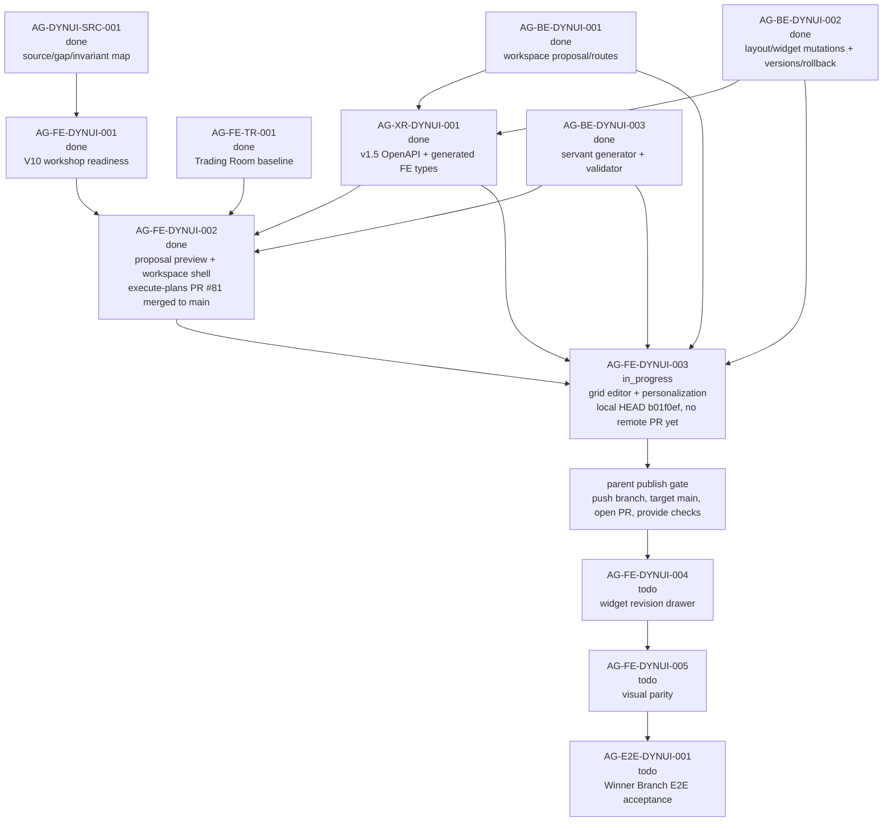

# AG-FE-DYNUI-003 Sidecar Acceptance Follow-up 2

| Field | Value |
|---|---|
| Sidecar task | `AG-FE-DYNUI-003-SIDECAR-ACCEPTANCE-FOLLOWUP-2` |
| Helper parent | `AG-FE-DYNUI-003` |
| Helper kind | `acceptance_packet` |
| Parent title | Trading Room grid editor and personalization events |
| Parent owner / reviewer | `Codex2` / `Codex` as of status readback |
| Sidecar owner / reviewer | `Codex` / `Codex2` |
| Date | `2026-06-29` |
| Mutates canonical truth | `false` |
| Status | Ready for `Codex2` support review |

This is a support-only follow-up packet. It does not replace the archived
`AG-FE-DYNUI-003-SIDECAR-ACCEPTANCE` packet, and it does not approve or
implement the parent frontend runtime. Its purpose is to give the parent owner
and reviewer a current dependency/evidence gate after the original acceptance
sidecar closed and while the parent implementation is still in progress.

## 1. Relationship To Existing Packet

| Packet / task | Current state | How this follow-up uses it |
|---|---|---|
| `AG-FE-DYNUI-003-SIDECAR-ACCEPTANCE` | Archived `done`; PR `#2603` merged into Pantheon `dev` at `ffb5dc1cb8b4e711647bb579376c88cab2531d2d`. | Remains the main acceptance checklist for grid editor and personalization behavior. This follow-up adds current parent evidence routing and branch/readiness gates. |
| `AG-FE-DYNUI-003` | Active `in_progress`; owner `Codex2`, reviewer `Codex`. | Parent implementation still needs GitHub-visible PR evidence and reviewer validation before it can be accepted. |
| `AG-FE-DYNUI-003-SIDECAR-ACCEPTANCE-FOLLOWUP-2` | Active `in_progress`; support artifact is this file. | Provides a narrow handoff packet for `Codex2` review; it does not change canonical truth or parent code. |

If this packet appears to conflict with L1/L2 canonical docs or the archived
main acceptance packet, the canonical docs and archived main packet win. This
follow-up should then be corrected or reopened.

## 2. Sources Read

| Source | Relevant finding |
|---|---|
| `AI_COLLABORATION_GUIDE.md` | L0 state coordinates task work; support packets do not override canonical architecture or policy truth. |
| `.orchestrator/task-briefs/ag_fe_dynui_003_sidecar_acceptance_followup_2.md` | Scope is acceptance checklist, dependency map, and support packet only; canonical/runtime changes are out of scope. |
| `.orchestrator/skills/worker-anchor-commit.md` | Task-owned support/docs changes should be made durable through narrow commits. |
| `.orchestrator/skills/task-closeout-finalization.md` | Final `done` closeout is reserved for owner finalization after review approval and merged task PR. |
| `AI_NAME=Codex ./scripts/ai-status.sh show AG-FE-DYNUI-003-SIDECAR-ACCEPTANCE-FOLLOWUP-2` | Active `in_progress`, owner `Codex`, reviewer `Codex2`, helper parent `AG-FE-DYNUI-003`, artifact path is this file, and `mutates_canonical` is `false`. |
| `AI_NAME=Codex ./scripts/ai-status.sh show AG-FE-DYNUI-003` | Parent is active `in_progress`, owner `Codex2`, reviewer `Codex`; status says execute-plans task branch is implementing grid editor persistence, restore/duplicate/change-chart, save/discard, and personalization events. |
| `AI_NAME=Codex ./scripts/ai-status.sh show AG-FE-DYNUI-003-SIDECAR-ACCEPTANCE` | Prior acceptance sidecar is archived `done` with `Codex2` review approval and merged PR `#2603`. |
| `AI_NAME=Codex ./scripts/ai-status.sh show AG-FE-DYNUI-002` | Upstream proposal preview/workspace shell is archived `done`; execute-plans PR `#81` merged into `main` at `64a963119e85f2e91efbedbd83c4fbd97c7c2e20`. |
| `AI_NAME=Codex ./scripts/ai-status.sh show AG-BE-DYNUI-001`, `AG-BE-DYNUI-002`, `AG-BE-DYNUI-003`, `AG-XR-DYNUI-001` | Workspace proposal/routes, layout/widget mutations, versions/rollback, servant generator, v1.5 OpenAPI, and generated frontend types are archived `done`. |
| `AI_NAME=Codex ./scripts/ai-status.sh show AG-FE-DYNUI-004`, `AG-FE-DYNUI-005`, `AG-E2E-DYNUI-001` | Widget adjustment drawer, visual parity, and full dynamic UI E2E remain downstream and must not be absorbed by `AG-FE-DYNUI-003`. |
| `support/sidecars/AG-FE-DYNUI-003/AG-FE-DYNUI-003-SIDECAR-ACCEPTANCE.md` | Main packet already defines the detailed 20-point parent acceptance checklist, dependency map, blocker triggers, and verification guidance. |
| `gh pr list --repo ajoe734/execute-plans --head task/AG-FE-DYNUI-003 --state all ...` | No GitHub-visible execute-plans PR exists for `task/AG-FE-DYNUI-003` at packet preparation time. |
| `git ls-remote --heads https://github.com/ajoe734/execute-plans.git 'task/AG-FE-DYNUI-003*'` | No matching remote task branch is visible at packet preparation time. |
| `git -C /home/lupin/code/execute-plans status -sb` | Local frontend branch is `task/AG-FE-DYNUI-003...origin/dev [ahead 3]` and clean. |
| `git -C /home/lupin/code/execute-plans show --stat --summary --format=fuller --no-renames HEAD` | Local HEAD is `b01f0ef76d3125073ccc30a881730d6d60c70ca9`, subject `AG-FE-DYNUI-003: add trading room grid editor`, touching Trading Room page/tests, `WorkspaceGridEditor.tsx`, and BFF v1.5 Trading Room helpers/tests. Commit message records local validation commands. |
| `git -C /home/lupin/code/execute-plans rev-parse HEAD origin/main origin/dev` | Local HEAD is `b01f0ef76d3125073ccc30a881730d6d60c70ca9`; `origin/main` is `64a963119e85f2e91efbedbd83c4fbd97c7c2e20`; `origin/dev` is `8bf1aff32df804c654a9016e94fc69b45f913dd7`. |
| `git -C /home/lupin/code/execute-plans merge-base --is-ancestor origin/main HEAD` | Returned non-zero: the local parent branch is not currently proven to contain `origin/main`. |
| `git -C /home/lupin/code/execute-plans config --get branch.task/AG-FE-DYNUI-003.merge` | Local branch upstream config points at `refs/heads/dev`, while execute-plans delivery base is expected to be `main`. |

`current-work.md` and the full `ai-activity-log.jsonl` were not scanned.

## 3. Current Readiness Snapshot

| Surface | Current state | Consequence for parent review |
|---|---|---|
| Parent task | `AG-FE-DYNUI-003` is active `in_progress`, owner `Codex2`, reviewer `Codex`. | Parent is not ready for formal acceptance until owner publishes reviewable PR evidence and hands off to reviewer. |
| Prior sidecar packet | `AG-FE-DYNUI-003-SIDECAR-ACCEPTANCE` is archived `done` and merged. | Use the archived packet as the primary checklist; this follow-up should not duplicate or supersede it. |
| Upstream FE shell | `AG-FE-DYNUI-002` is archived `done`; execute-plans PR `#81` merged to `main` at `64a963119e85f2e91efbedbd83c4fbd97c7c2e20`. | Parent must compose on top of the final `main` state from PR `#81`, including review fixes and integration-gate repairs. |
| Backend/XR dependencies | `AG-BE-DYNUI-001`, `AG-BE-DYNUI-002`, `AG-BE-DYNUI-003`, and `AG-XR-DYNUI-001` are archived `done`. | Parent can rely on v1.5 workspace layout, widget mutation, version/rollback, generator, and generated type contracts. |
| Local parent implementation evidence | `/home/lupin/code/execute-plans` has a clean local `task/AG-FE-DYNUI-003` branch with HEAD `b01f0ef76d3125073ccc30a881730d6d60c70ca9`. | Useful for owner continuity, but not sufficient for reviewer acceptance because no remote branch, PR, or check run is visible. |
| Parent PR/remote branch | No GitHub PR or remote branch named `task/AG-FE-DYNUI-003*` is visible. | Parent owner must push/open PR before reviewer can verify the implementation in the normal workflow. |
| Branch base / composition | Local `task/AG-FE-DYNUI-003` tracks `origin/dev`; `origin/main` is not an ancestor of HEAD. | Parent owner should rebase/compose onto execute-plans `main` before PR, or record a concrete blocker. Do not sweep stale `dev` or unrelated route/management drift into the parent PR. |
| Downstream FE scope | `AG-FE-DYNUI-004`, `AG-FE-DYNUI-005`, and `AG-E2E-DYNUI-001` remain active future tasks. | Parent should stop at persisted grid editor/personalization and leave widget adjustment drawer, final visual parity, and full E2E proof downstream. |

## 4. Parent Evidence Gate Delta

The archived main sidecar packet remains the full acceptance checklist. This
follow-up adds the current gates that should be checked before `AG-FE-DYNUI-003`
review:

1. Publish a GitHub-visible execute-plans branch and PR for
   `task/AG-FE-DYNUI-003`, normally targeting `main`.
2. Ensure the PR branch composes with execute-plans `main` at or after
   `64a963119e85f2e91efbedbd83c4fbd97c7c2e20`, the merged `AG-FE-DYNUI-002`
   delivery base.
3. Remove or explicitly account for branch-base drift from the local
   `origin/dev` upstream. The parent PR should not carry unrelated historical
   route, Management, workflow, or AG-FE-DYNUI-002 repair diffs as part of
   `AG-FE-DYNUI-003`.
4. Provide reviewer-verifiable validation output or check runs. The local HEAD
   commit message records `npm test`, `eslint`, `git diff --check`, and
   `npm run build`, but commit text alone is not enough for parent acceptance.
5. Preserve the main packet's behavior gates: `TradingRoomWorkspace` source of
   truth, real grid placement/drag/resize, explicit dirty save/discard,
   ETag/idempotency guarded layout PATCH, remove/restore, registry-scoped add,
   validator-backed change chart, contract-shaped duplicate or blocker,
   personalization event evidence, typed error states, strict BFF boundary, and
   no unsafe/broker/runtime/capital surfaces.
6. Keep downstream scope out of the parent PR. Widget-context servant
   adjustment and before/after `WidgetRevisionProposal` UI stay in
   `AG-FE-DYNUI-004`; final visual parity stays in `AG-FE-DYNUI-005`; full
   Winner Branch E2E proof stays in `AG-E2E-DYNUI-001`.

If any of these gates cannot be satisfied without changing backend contracts,
generated types, canonical docs, widget allowlists, or downstream runtime
scope, parent owner should open a blocker instead of widening this task.

## 5. Dependency Map



### Dependency Notes

| Task / surface | Current state | Relevance to `AG-FE-DYNUI-003` |
|---|---|---|
| `AG-FE-DYNUI-002` | Archived `done`; execute-plans PR `#81` merged into `main` at `64a963119e85f2e91efbedbd83c4fbd97c7c2e20`. | Parent should extend the accepted workspace shell from the final merged `main` state. |
| `AG-BE-DYNUI-001` | Archived `done`. | Provides workspace proposal/read/accept and base workspace route family. |
| `AG-BE-DYNUI-002` | Archived `done`. | Provides layout operations, widget mutation, revision proposals, workspace versions, and rollback. |
| `AG-BE-DYNUI-003` | Archived `done`. | Provides declarative generator and registry/validator-backed widget specs. |
| `AG-XR-DYNUI-001` | Archived `done`. | Generated v1.5 frontend types/routes are available for parent client helpers. |
| Local execute-plans branch | Clean local `task/AG-FE-DYNUI-003` at `b01f0ef76d3125073ccc30a881730d6d60c70ca9`; no remote PR/branch visible. | Parent owner has local continuity but must publish and compose it onto `main` before normal review. |
| `AG-FE-DYNUI-004` | Active `todo`; depends on `AG-FE-DYNUI-003` and `AG-BE-DYNUI-002`. | Owns widget adjustment drawer and before/after revision flow. |
| `AG-FE-DYNUI-005` | Active `todo`; depends on `AG-FE-DYNUI-001` through `AG-FE-DYNUI-004`. | Owns visual parity on top of completed dynamic runtime. |
| `AG-E2E-DYNUI-001` | Active `todo`; depends on backend/XR and visual completion. | Owns complete Winner Branch dynamic UI E2E proof. |

## 6. Blocker Triggers For Parent Owner

Parent owner should stop and open a blocker or reviewer handoff if any of these
are true:

1. The implementation remains local-only after the owner claims it is ready for
   review.
2. The PR cannot target or compose with execute-plans `main` without losing the
   merged `AG-FE-DYNUI-002` fixes from PR `#81`.
3. The branch diff includes unrelated historical `dev`, Management, route,
   workflow, or already-closed FE/XR work that cannot be separated from
   `AG-FE-DYNUI-003`.
4. Grid editing requires inventing fields/routes outside
   `WorkspaceLayoutOperation`, view/widget PATCH, or another published v1.5
   route.
5. Save semantics require bypassing ETag/idempotency or treating stale/invalid
   writes as successful local state.
6. Add widget, change chart, duplicate, or personalization cannot be represented
   by generated types and registry/validator-supported payloads.
7. The task needs the full widget adjustment drawer, before/after revision
   lifecycle, final design parity, or full E2E flow to pass. Those are
   downstream scopes.

## 7. Suggested Parent Verification Plan

Run from the execute-plans parent task branch after it is composed on `main`:

```bash
npm test -- --run \
  src/lib/bff-v1/agora/tradingRoom.test.ts \
  src/agora/pages/trading-room/TradingRoomPage.test.tsx \
  src/agora/widgets/registry.test.ts
```

```bash
npx eslint \
  src/agora/trading-room/WorkspaceGridEditor.tsx \
  src/agora/pages/trading-room/TradingRoomPage.tsx \
  src/agora/pages/trading-room/TradingRoomPage.test.tsx \
  src/lib/bff-v1/agora/tradingRoom.ts \
  src/lib/bff-v1/agora/tradingRoom.test.ts
```

```bash
npm run contract:drift -- --summary
npm run build
git diff --check origin/main...HEAD
```

Recommended focused reviewer checks:

- a scoped diff check that parent PR changes are centered on Trading Room grid
  editor, BFF v1.5 helpers, tests, and necessary registry surfaces;
- a branch-base check that `origin/main` is an ancestor of the PR branch;
- UI/test evidence for view tabs, real grid handles, dirty state,
  save/discard, remove/restore, add widget, change chart, and duplicate
  contract behavior;
- tests for `412` stale-write recovery and `422` validation failure without
  false saved state;
- a safety grep for forbidden broker/capital/runtime/Management/direct-order
  language and unsafe rendering primitives.

## 8. Support-Only Boundary Confirmation

- No L1/L2 canonical policy or architecture document was edited by this
  sidecar.
- No backend schema, OpenAPI, BFF route, runtime, registry, or governance
  implementation was changed by this sidecar.
- No execute-plans frontend runtime file was changed by this sidecar.
- The only intended support deliverable is this packet:
  `support/sidecars/AG-FE-DYNUI-003/AG-FE-DYNUI-003-SIDECAR-ACCEPTANCE-FOLLOWUP-2.md`.
- The generated task brief is task-scoped state:
  `.orchestrator/task-briefs/ag_fe_dynui_003_sidecar_acceptance_followup_2.md`.
- This sidecar does not approve the parent implementation.

## 9. Validation Run

Commands run from this sidecar worktree unless noted:

```bash
git status -sb
git branch --show-current
git remote -v
AI_NAME=Codex ./scripts/ai-status.sh show AG-FE-DYNUI-003-SIDECAR-ACCEPTANCE-FOLLOWUP-2
AI_NAME=Codex ./scripts/ai-status.sh show AG-FE-DYNUI-003
AI_NAME=Codex ./scripts/ai-status.sh show AG-FE-DYNUI-003-SIDECAR-ACCEPTANCE
AI_NAME=Codex ./scripts/ai-status.sh show AG-FE-DYNUI-002
AI_NAME=Codex ./scripts/ai-status.sh show AG-BE-DYNUI-001
AI_NAME=Codex ./scripts/ai-status.sh show AG-BE-DYNUI-002
AI_NAME=Codex ./scripts/ai-status.sh show AG-BE-DYNUI-003
AI_NAME=Codex ./scripts/ai-status.sh show AG-XR-DYNUI-001
AI_NAME=Codex ./scripts/ai-status.sh show AG-FE-DYNUI-004
AI_NAME=Codex ./scripts/ai-status.sh show AG-FE-DYNUI-005
AI_NAME=Codex ./scripts/ai-status.sh show AG-E2E-DYNUI-001
gh pr list --repo ajoe734/execute-plans --head task/AG-FE-DYNUI-003 --state all --json number,state,title,url,headRefName,baseRefName,headRefOid,updatedAt,statusCheckRollup
git ls-remote --heads https://github.com/ajoe734/execute-plans.git 'task/AG-FE-DYNUI-003*'
git -C /home/lupin/code/execute-plans status -sb
git -C /home/lupin/code/execute-plans branch --show-current
git -C /home/lupin/code/execute-plans show --stat --summary --format=fuller --no-renames HEAD
git -C /home/lupin/code/execute-plans rev-parse HEAD origin/main origin/dev
git -C /home/lupin/code/execute-plans merge-base --is-ancestor origin/main HEAD
git -C /home/lupin/code/execute-plans config --get branch.task/AG-FE-DYNUI-003.merge
git diff --check -- .orchestrator/task-briefs/ag_fe_dynui_003_sidecar_acceptance_followup_2.md support/sidecars/AG-FE-DYNUI-003/AG-FE-DYNUI-003-SIDECAR-ACCEPTANCE-FOLLOWUP-2.md
```

Observed results:

- Branch is `task/AG-FE-DYNUI-003-SIDECAR-ACCEPTANCE-FOLLOWUP-2`.
- Sidecar is active `in_progress`, owner `Codex`, reviewer `Codex2`, and
  support-only.
- Parent `AG-FE-DYNUI-003` is active `in_progress`, owner `Codex2`, reviewer
  `Codex`.
- Prior `AG-FE-DYNUI-003-SIDECAR-ACCEPTANCE` is archived `done`; PR `#2603`
  merged into Pantheon `dev` at
  `ffb5dc1cb8b4e711647bb579376c88cab2531d2d`.
- Upstream `AG-FE-DYNUI-002`, `AG-BE-DYNUI-001`, `AG-BE-DYNUI-002`,
  `AG-BE-DYNUI-003`, and `AG-XR-DYNUI-001` are archived `done`.
- Downstream `AG-FE-DYNUI-004`, `AG-FE-DYNUI-005`, and `AG-E2E-DYNUI-001`
  remain active future tasks.
- No execute-plans PR or remote branch named `task/AG-FE-DYNUI-003*` was
  visible at packet preparation time.
- Local execute-plans branch `task/AG-FE-DYNUI-003` is clean at
  `b01f0ef76d3125073ccc30a881730d6d60c70ca9`; commit message records local
  `npm test`, `eslint`, `git diff --check`, and `npm run build` validation.
- Local execute-plans branch upstream config points at `origin/dev`; `origin/main`
  is not currently an ancestor of HEAD.
- `git diff --check` passed for this task brief and support packet.
- No parent runtime tests were run by this sidecar because it changes support
  artifacts only.

## 10. Reviewer Handoff Notes

**Reviewer:** `Codex2`

### What to verify

1. The packet stays support-only and does not redefine canonical contracts.
2. The packet correctly treats the archived
   `AG-FE-DYNUI-003-SIDECAR-ACCEPTANCE` as the main checklist.
3. The current parent evidence state is accurate: local execute-plans branch
   exists, but no remote PR/branch is visible yet.
4. The branch-base gate is useful and scoped: parent owner should compose onto
   execute-plans `main` before review, without sweeping unrelated diffs into
   the parent PR.
5. Downstream AG-FE-DYNUI-004/005 and E2E scopes remain outside this parent.

### Suggested reviewer command

```bash
AI_NAME=Codex2 ./scripts/ai-status.sh approve AG-FE-DYNUI-003-SIDECAR-ACCEPTANCE-FOLLOWUP-2 "Follow-up acceptance packet approved; support artifact updates AG-FE-DYNUI-003 dependency/evidence gates without changing canonical truth or runtime."
```

If changes are required:

```bash
AI_NAME=Codex2 ./scripts/ai-status.sh reopen AG-FE-DYNUI-003-SIDECAR-ACCEPTANCE-FOLLOWUP-2 "Describe the exact packet corrections needed."
```

Prepared by `Codex` for the
`AG-FE-DYNUI-003-SIDECAR-ACCEPTANCE-FOLLOWUP-2` support slice.
