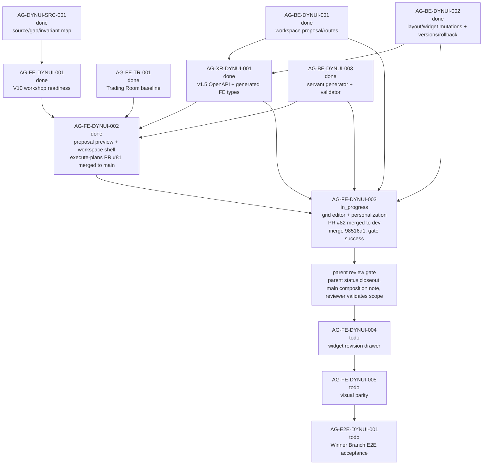

# AG-FE-DYNUI-003 Sidecar Acceptance Follow-up 2

| Field | Value |
|---|---|
| Sidecar task | `AG-FE-DYNUI-003-SIDECAR-ACCEPTANCE-FOLLOWUP-2` |
| Helper parent | `AG-FE-DYNUI-003` |
| Helper kind | `acceptance_packet` |
| Parent title | Trading Room grid editor and personalization events |
| Parent owner / reviewer | `Codex2` / `Codex` as of status readback |
| Sidecar owner / reviewer | `Codex` / `Codex2` |
| Date | `2026-06-29` |
| Mutates canonical truth | `false` |
| Status | Ready for `Codex2` support review |

This is a support-only follow-up packet. It does not replace the archived
`AG-FE-DYNUI-003-SIDECAR-ACCEPTANCE` packet, and it does not approve or
implement the parent frontend runtime. Its purpose is to give the parent owner
and reviewer a current dependency/evidence gate after the original acceptance
sidecar closed and while the parent implementation is still in progress.

## 1. Relationship To Existing Packet

| Packet / task | Current state | How this follow-up uses it |
|---|---|---|
| `AG-FE-DYNUI-003-SIDECAR-ACCEPTANCE` | Archived `done`; PR `#2603` merged into Pantheon `dev` at `ffb5dc1cb8b4e711647bb579376c88cab2531d2d`. | Remains the main acceptance checklist for grid editor and personalization behavior. This follow-up adds current parent evidence routing and branch/readiness gates. |
| `AG-FE-DYNUI-003` | Active `in_progress`; owner `Codex2`, reviewer `Codex`; execute-plans PR `#82` is merged into `dev`. | Parent implementation now has merged PR/check evidence, but still needs parent owner/reviewer status closeout before it can be accepted. |
| `AG-FE-DYNUI-003-SIDECAR-ACCEPTANCE-FOLLOWUP-2` | Active `in_progress`; support artifact is this file. | Provides a narrow handoff packet for `Codex2` review; it does not change canonical truth or parent code. |

If this packet appears to conflict with L1/L2 canonical docs or the archived
main acceptance packet, the canonical docs and archived main packet win. This
follow-up should then be corrected or reopened.

## 2. Sources Read

| Source | Relevant finding |
|---|---|
| `AI_COLLABORATION_GUIDE.md` | L0 state coordinates task work; support packets do not override canonical architecture or policy truth. |
| `.orchestrator/task-briefs/ag_fe_dynui_003_sidecar_acceptance_followup_2.md` | Scope is acceptance checklist, dependency map, and support packet only; canonical/runtime changes are out of scope; reviewer readback requires refreshing PR `#82` from open/in-progress evidence to merged evidence. |
| `.orchestrator/skills/worker-anchor-commit.md` | Task-owned support/docs changes should be made durable through narrow commits. |
| `.orchestrator/skills/task-closeout-finalization.md` | Final `done` closeout is reserved for owner finalization after review approval and merged task PR. |
| `AI_NAME=Codex ./scripts/ai-status.sh show AG-FE-DYNUI-003-SIDECAR-ACCEPTANCE-FOLLOWUP-2` | Active `in_progress`, owner `Codex`, reviewer `Codex2`, helper parent `AG-FE-DYNUI-003`, artifact path is this file, and `mutates_canonical` is `false`. |
| `AI_NAME=Codex ./scripts/ai-status.sh show AG-FE-DYNUI-003` | Parent remains active `in_progress`, owner `Codex2`, reviewer `Codex`; external execute-plans PR evidence has advanced to merged, but parent status has not yet been owner/reviewer-closed. |
| `AI_NAME=Codex ./scripts/ai-status.sh show AG-FE-DYNUI-003-SIDECAR-ACCEPTANCE` | Prior acceptance sidecar is archived `done` with `Codex2` review approval and merged PR `#2603`. |
| `AI_NAME=Codex ./scripts/ai-status.sh show AG-FE-DYNUI-002` | Upstream proposal preview/workspace shell is archived `done`; execute-plans PR `#81` merged into `main` at `64a963119e85f2e91efbedbd83c4fbd97c7c2e20`. |
| `AI_NAME=Codex ./scripts/ai-status.sh show AG-BE-DYNUI-001`, `AG-BE-DYNUI-002`, `AG-BE-DYNUI-003`, `AG-XR-DYNUI-001` | Workspace proposal/routes, layout/widget mutations, versions/rollback, servant generator, v1.5 OpenAPI, and generated frontend types are archived `done`. |
| `AI_NAME=Codex ./scripts/ai-status.sh show AG-FE-DYNUI-004`, `AG-FE-DYNUI-005`, `AG-E2E-DYNUI-001` | Widget adjustment drawer, visual parity, and full dynamic UI E2E remain downstream and must not be absorbed by `AG-FE-DYNUI-003`. |
| `support/sidecars/AG-FE-DYNUI-003/AG-FE-DYNUI-003-SIDECAR-ACCEPTANCE.md` | Main packet already defines the detailed 20-point parent acceptance checklist, dependency map, blocker triggers, and verification guidance. |
| `gh pr view 82 --repo ajoe734/execute-plans --json ...` | execute-plans PR `#82` is `MERGED`, non-draft, title `AG-FE-DYNUI-003: trading room grid editor`, head `task/AG-FE-DYNUI-003` at `e16e6950091eb42ad6754135f0cd291df17efeac`, base `dev`, merge commit `98516d129e377842f1d5866af61e326134751439`, merged at `2026-06-29T09:11:36Z`; `integration-gate` completed `SUCCESS` at `2026-06-29T09:11:02Z`. |
| `gh pr list --repo ajoe734/execute-plans --head task/AG-FE-DYNUI-003 --state all ...` | Confirms the GitHub-visible PR for `task/AG-FE-DYNUI-003` is PR `#82`, state `MERGED`, head `e16e6950091eb42ad6754135f0cd291df17efeac`, merge time `2026-06-29T09:11:36Z`, with successful `integration-gate`. |
| `git ls-remote --heads https://github.com/ajoe734/execute-plans.git task/AG-FE-DYNUI-003 main dev` | Remote `task/AG-FE-DYNUI-003` is no longer listed; `dev` is PR `#82` merge commit `98516d129e377842f1d5866af61e326134751439`; `main` remains `64a963119e85f2e91efbedbd83c4fbd97c7c2e20`. |
| `git -C /home/lupin/code/execute-plans status -sb` | Local frontend checkout is clean on `dev` tracking `origin/dev`. |
| `git -C /home/lupin/code/execute-plans show --stat --summary --format=fuller --no-renames HEAD` | Local HEAD is PR `#82` merge commit `98516d129e377842f1d5866af61e326134751439`, merging `task/AG-FE-DYNUI-003`; changed files remain centered on Trading Room page/tests, `WorkspaceGridEditor.tsx`, `WorkspaceProposalPreview.tsx`, `workspaceValidation.ts`, and BFF v1.5 Trading Room helpers/tests. |
| `gh pr view 82 --repo ajoe734/execute-plans --json commits,files` | PR `#82` currently includes AG-FE-DYNUI-002 cherry-picked commits plus the AG-FE-DYNUI-003 grid editor commit; changed files include `src/App.tsx`, `WorkspaceProposalPreview.tsx`, Trading Room page/tests, grid editor, validation, and BFF helper/tests. |
| `git -C /home/lupin/code/execute-plans rev-parse HEAD origin/main origin/dev` | Local HEAD is `98516d129e377842f1d5866af61e326134751439`; `origin/main` is `64a963119e85f2e91efbedbd83c4fbd97c7c2e20`; `origin/dev` is `98516d129e377842f1d5866af61e326134751439`. |
| `git -C /home/lupin/code/execute-plans merge-base --is-ancestor origin/main HEAD` | Returned non-zero: merged `dev` HEAD is still not currently proven to contain `origin/main`. |
| `git -C /home/lupin/code/execute-plans merge-base --is-ancestor origin/dev HEAD` | Returned zero: local HEAD equals `origin/dev`, the PR `#82` merge target. |

`current-work.md` and the full `ai-activity-log.jsonl` were not scanned.

## 3. Current Readiness Snapshot

| Surface | Current state | Consequence for parent review |
|---|---|---|
| Parent task | `AG-FE-DYNUI-003` is active `in_progress`, owner `Codex2`, reviewer `Codex`; execute-plans PR evidence is now merged but the parent task state has not yet been closed. | Parent has cleared the prior PR/check publication blocker, but formal task acceptance still needs parent owner/reviewer status closeout. |
| Prior sidecar packet | `AG-FE-DYNUI-003-SIDECAR-ACCEPTANCE` is archived `done` and merged. | Use the archived packet as the primary checklist; this follow-up should not duplicate or supersede it. |
| Upstream FE shell | `AG-FE-DYNUI-002` is archived `done`; execute-plans PR `#81` merged to `main` at `64a963119e85f2e91efbedbd83c4fbd97c7c2e20`. | Parent must compose on top of the final `main` state from PR `#81`, including review fixes and integration-gate repairs. |
| Backend/XR dependencies | `AG-BE-DYNUI-001`, `AG-BE-DYNUI-002`, `AG-BE-DYNUI-003`, and `AG-XR-DYNUI-001` are archived `done`. | Parent can rely on v1.5 workspace layout, widget mutation, version/rollback, generator, and generated type contracts. |
| Local parent implementation evidence | `/home/lupin/code/execute-plans` is clean on `dev`, with HEAD and `origin/dev` at PR `#82` merge commit `98516d129e377842f1d5866af61e326134751439`. | Useful for owner/reviewer continuity; the merged commit is now the evidence anchor for parent review. |
| Parent PR/remote branch | execute-plans PR `#82` is `MERGED` from `task/AG-FE-DYNUI-003` at `e16e6950091eb42ad6754135f0cd291df17efeac` into `dev`; `integration-gate` completed `SUCCESS`; remote `task/AG-FE-DYNUI-003` is no longer listed by `ls-remote`. | The previous publish, check, and remote branch readiness blockers are cleared; formal parent acceptance still waits on parent owner/reviewer status workflow. |
| Branch base / composition | PR `#82` merged into `dev` at `98516d129e377842f1d5866af61e326134751439`; `origin/main` remains `64a963119e85f2e91efbedbd83c4fbd97c7c2e20` and is still not an ancestor of merged `dev` HEAD. PR commits include AG-FE-DYNUI-002 cherry-picks rather than proving ancestry from `main` merge `64a963119e85f2e91efbedbd83c4fbd97c7c2e20`. | Preserve the main-base composition note: parent owner/reviewer should record whether `dev` is the intended temporary delivery target and how/when this work composes back to execute-plans `main`. Do not sweep unrelated route/Management/workflow drift into parent acceptance. |
| Downstream FE scope | `AG-FE-DYNUI-004`, `AG-FE-DYNUI-005`, and `AG-E2E-DYNUI-001` remain active future tasks. | Parent should stop at persisted grid editor/personalization and leave widget adjustment drawer, final visual parity, and full E2E proof downstream. |

## 4. Parent Evidence Gate Delta

The archived main sidecar packet remains the full acceptance checklist. This
follow-up adds the current gates that should be checked before `AG-FE-DYNUI-003`
review:

1. Treat GitHub PR/check publication as satisfied but not parent-status closed:
   execute-plans PR `#82` is merged from `task/AG-FE-DYNUI-003` at
   `e16e6950091eb42ad6754135f0cd291df17efeac` into `dev` as
   `98516d129e377842f1d5866af61e326134751439`.
2. Use PR `#82`'s `integration-gate` as reviewer-visible check evidence:
   `Pantheon FE-BFF Integration Gate / integration-gate` completed `SUCCESS`
   at `2026-06-29T09:11:02Z`.
3. Treat the remote task branch lifecycle as closed: authoritative
   `git ls-remote` no longer lists `refs/heads/task/AG-FE-DYNUI-003`.
4. Preserve the main-base composition note. PR `#82` merged to `dev`, while
   `origin/main` at `64a963119e85f2e91efbedbd83c4fbd97c7c2e20` is still not an
   ancestor of merged `dev` HEAD. Parent owner/reviewer should record whether
   `dev` is the intended temporary delivery target and how this work composes
   back to execute-plans `main`.
5. Account for branch-base drift explicitly. The merged PR commits include
   AG-FE-DYNUI-002 cherry-picks rather than proving ancestry from `main`; parent
   acceptance should distinguish necessary carryover from accidental unrelated
   route, Management, workflow, or already-closed FE/XR scope.
6. Provide parent-status closure separately. Merged PR evidence is available,
   but `AG-FE-DYNUI-003` still reads as active `in_progress` in Pantheon status.
7. Preserve the main packet's behavior gates: `TradingRoomWorkspace` source of
   truth, real grid placement/drag/resize, explicit dirty save/discard,
   ETag/idempotency guarded layout PATCH, remove/restore, registry-scoped add,
   validator-backed change chart, contract-shaped duplicate or blocker,
   personalization event evidence, typed error states, strict BFF boundary, and
   no unsafe/broker/runtime/capital surfaces.
8. Keep downstream scope out of the parent PR. Widget-context servant
   adjustment and before/after `WidgetRevisionProposal` UI stay in
   `AG-FE-DYNUI-004`; final visual parity stays in `AG-FE-DYNUI-005`; full
   Winner Branch E2E proof stays in `AG-E2E-DYNUI-001`.

If any of these gates cannot be satisfied without changing backend contracts,
generated types, canonical docs, widget allowlists, or downstream runtime
scope, parent owner should open a blocker instead of widening this task.

## 5. Dependency Map



### Dependency Notes

| Task / surface | Current state | Relevance to `AG-FE-DYNUI-003` |
|---|---|---|
| `AG-FE-DYNUI-002` | Archived `done`; execute-plans PR `#81` merged into `main` at `64a963119e85f2e91efbedbd83c4fbd97c7c2e20`. | Parent should extend the accepted workspace shell from the final merged `main` state. |
| `AG-BE-DYNUI-001` | Archived `done`. | Provides workspace proposal/read/accept and base workspace route family. |
| `AG-BE-DYNUI-002` | Archived `done`. | Provides layout operations, widget mutation, revision proposals, workspace versions, and rollback. |
| `AG-BE-DYNUI-003` | Archived `done`. | Provides declarative generator and registry/validator-backed widget specs. |
| `AG-XR-DYNUI-001` | Archived `done`. | Generated v1.5 frontend types/routes are available for parent client helpers. |
| execute-plans PR `#82` / branch | PR `#82` is merged into `dev` at `98516d129e377842f1d5866af61e326134751439`; `integration-gate` succeeded; remote `task/AG-FE-DYNUI-003` is no longer listed. | Parent owner has merged reviewable implementation evidence; parent acceptance still needs status closeout and the main-base composition note or explicit delivery-target record. |
| `AG-FE-DYNUI-004` | Active `todo`; depends on `AG-FE-DYNUI-003` and `AG-BE-DYNUI-002`. | Owns widget adjustment drawer and before/after revision flow. |
| `AG-FE-DYNUI-005` | Active `todo`; depends on `AG-FE-DYNUI-001` through `AG-FE-DYNUI-004`. | Owns visual parity on top of completed dynamic runtime. |
| `AG-E2E-DYNUI-001` | Active `todo`; depends on backend/XR and visual completion. | Owns complete Winner Branch dynamic UI E2E proof. |

## 6. Blocker Triggers For Parent Owner

Parent owner should stop and open a blocker or reviewer handoff if any of these
are true:

1. PR `#82`'s merged state, merge commit, or successful `integration-gate`
   evidence cannot be reproduced from GitHub by the parent reviewer.
2. The merged `dev` delivery cannot compose back to execute-plans `main` without
   losing the merged `AG-FE-DYNUI-002` fixes from PR `#81`.
3. The work remains delivered only to `dev` while `origin/main` is not an
   ancestor of merged `dev` HEAD, and no explicit reviewer-acceptable delivery
   target / composition note is recorded.
4. The merged diff includes unrelated historical `dev`, Management, route,
   workflow, or already-closed FE/XR work that cannot be distinguished from
   `AG-FE-DYNUI-003`.
5. Grid editing requires inventing fields/routes outside
   `WorkspaceLayoutOperation`, view/widget PATCH, or another published v1.5
   route.
6. Save semantics require bypassing ETag/idempotency or treating stale/invalid
   writes as successful local state.
7. Add widget, change chart, duplicate, or personalization cannot be represented
   by generated types and registry/validator-supported payloads.
8. The task needs the full widget adjustment drawer, before/after revision
   lifecycle, final design parity, or full E2E flow to pass. Those are
   downstream scopes.

## 7. Suggested Parent Verification Plan

Run from execute-plans `dev` at merge commit
`98516d129e377842f1d5866af61e326134751439`, or from the follow-up branch that
composes this merge back to `main`:

```bash
npm test -- --run \
  src/lib/bff-v1/agora/tradingRoom.test.ts \
  src/agora/pages/trading-room/TradingRoomPage.test.tsx \
  src/agora/widgets/registry.test.ts
```

```bash
npx eslint \
  src/agora/trading-room/WorkspaceGridEditor.tsx \
  src/agora/pages/trading-room/TradingRoomPage.tsx \
  src/agora/pages/trading-room/TradingRoomPage.test.tsx \
  src/lib/bff-v1/agora/tradingRoom.ts \
  src/lib/bff-v1/agora/tradingRoom.test.ts
```

```bash
npm run contract:drift -- --summary
npm run build
git diff --check origin/main...HEAD
```

Recommended focused reviewer checks:

- a scoped diff check that parent PR changes are centered on Trading Room grid
  editor, BFF v1.5 helpers, tests, and necessary registry surfaces;
- a branch-base check that records whether `origin/main` is an ancestor of the
  reviewed commit, or why `dev` is the accepted temporary delivery target;
- UI/test evidence for view tabs, real grid handles, dirty state,
  save/discard, remove/restore, add widget, change chart, and duplicate
  contract behavior;
- tests for `412` stale-write recovery and `422` validation failure without
  false saved state;
- a safety grep for forbidden broker/capital/runtime/Management/direct-order
  language and unsafe rendering primitives.

## 8. Support-Only Boundary Confirmation

- No L1/L2 canonical policy or architecture document was edited by this
  sidecar.
- No backend schema, OpenAPI, BFF route, runtime, registry, or governance
  implementation was changed by this sidecar.
- No execute-plans frontend runtime file was changed by this sidecar.
- The only intended support deliverable is this packet:
  `support/sidecars/AG-FE-DYNUI-003/AG-FE-DYNUI-003-SIDECAR-ACCEPTANCE-FOLLOWUP-2.md`.
- The generated task brief is task-scoped state:
  `.orchestrator/task-briefs/ag_fe_dynui_003_sidecar_acceptance_followup_2.md`.
- This sidecar does not approve the parent implementation.

## 9. Validation Run

Commands run from this sidecar worktree unless noted:

```bash
git status -sb
git branch --show-current
git remote -v
AI_NAME=Codex ./scripts/ai-status.sh show AG-FE-DYNUI-003-SIDECAR-ACCEPTANCE-FOLLOWUP-2
AI_NAME=Codex ./scripts/ai-status.sh show AG-FE-DYNUI-003
AI_NAME=Codex ./scripts/ai-status.sh show AG-FE-DYNUI-003-SIDECAR-ACCEPTANCE
AI_NAME=Codex ./scripts/ai-status.sh show AG-FE-DYNUI-002
AI_NAME=Codex ./scripts/ai-status.sh show AG-BE-DYNUI-001
AI_NAME=Codex ./scripts/ai-status.sh show AG-BE-DYNUI-002
AI_NAME=Codex ./scripts/ai-status.sh show AG-BE-DYNUI-003
AI_NAME=Codex ./scripts/ai-status.sh show AG-XR-DYNUI-001
AI_NAME=Codex ./scripts/ai-status.sh show AG-FE-DYNUI-004
AI_NAME=Codex ./scripts/ai-status.sh show AG-FE-DYNUI-005
AI_NAME=Codex ./scripts/ai-status.sh show AG-E2E-DYNUI-001
gh pr view 82 --repo ajoe734/execute-plans --json number,state,title,url,headRefName,baseRefName,headRefOid,mergeCommit,mergedAt,updatedAt,isDraft,mergeStateStatus,statusCheckRollup,reviewDecision
gh pr list --repo ajoe734/execute-plans --head task/AG-FE-DYNUI-003 --state all --json number,state,title,url,headRefName,baseRefName,headRefOid,mergedAt,updatedAt,statusCheckRollup
gh pr view 82 --repo ajoe734/execute-plans --json commits,files
git ls-remote --heads https://github.com/ajoe734/execute-plans.git task/AG-FE-DYNUI-003 main dev
git -C /home/lupin/code/execute-plans status -sb
git -C /home/lupin/code/execute-plans branch --show-current
git -C /home/lupin/code/execute-plans show --stat --summary --format=fuller --no-renames HEAD
git -C /home/lupin/code/execute-plans rev-parse HEAD origin/main origin/dev
git -C /home/lupin/code/execute-plans merge-base --is-ancestor origin/main HEAD
git -C /home/lupin/code/execute-plans merge-base --is-ancestor origin/main origin/dev
git -C /home/lupin/code/execute-plans merge-base --is-ancestor origin/dev HEAD
git diff --check -- .orchestrator/task-briefs/ag_fe_dynui_003_sidecar_acceptance_followup_2.md support/sidecars/AG-FE-DYNUI-003/AG-FE-DYNUI-003-SIDECAR-ACCEPTANCE-FOLLOWUP-2.md
```

Observed results:

- Branch is `task/AG-FE-DYNUI-003-SIDECAR-ACCEPTANCE-FOLLOWUP-2`.
- Sidecar is active `in_progress`, owner `Codex`, reviewer `Codex2`, and
  support-only.
- Parent `AG-FE-DYNUI-003` is active `in_progress`, owner `Codex2`, reviewer
  `Codex`; its execute-plans PR evidence is merged, but Pantheon task status is
  not yet closed.
- Prior `AG-FE-DYNUI-003-SIDECAR-ACCEPTANCE` is archived `done`; PR `#2603`
  merged into Pantheon `dev` at
  `ffb5dc1cb8b4e711647bb579376c88cab2531d2d`.
- Upstream `AG-FE-DYNUI-002`, `AG-BE-DYNUI-001`, `AG-BE-DYNUI-002`,
  `AG-BE-DYNUI-003`, and `AG-XR-DYNUI-001` are archived `done`.
- Downstream `AG-FE-DYNUI-004`, `AG-FE-DYNUI-005`, and `AG-E2E-DYNUI-001`
  remain active future tasks.
- execute-plans PR `#82` is `MERGED` at
  `https://github.com/ajoe734/execute-plans/pull/82`; head
  `task/AG-FE-DYNUI-003` was `e16e6950091eb42ad6754135f0cd291df17efeac`, base is
  `dev`, merge commit is `98516d129e377842f1d5866af61e326134751439`, and
  `integration-gate` completed `SUCCESS`.
- Authoritative `git ls-remote` no longer lists remote
  `task/AG-FE-DYNUI-003`; `dev` points at the PR `#82` merge commit.
- Local execute-plans checkout is clean on `dev`; HEAD and `origin/dev` are
  `98516d129e377842f1d5866af61e326134751439`.
- PR `#82` includes AG-FE-DYNUI-002 cherry-picked commits plus the
  AG-FE-DYNUI-003 grid editor commit; reviewer should distinguish necessary
  carryover from accidental scope drift.
- `origin/dev` equals HEAD; `origin/main` is not currently an ancestor of HEAD or
  `origin/dev`, so the main-base composition note remains open.
- `git diff --check` passed for this task brief and support packet.
- No parent runtime tests were run by this sidecar because it changes support
  artifacts only.

## 10. Reviewer Handoff Notes

**Reviewer:** `Codex2`

### What to verify

1. The packet stays support-only and does not redefine canonical contracts.
2. The packet correctly treats the archived
   `AG-FE-DYNUI-003-SIDECAR-ACCEPTANCE` as the main checklist.
3. The current parent evidence state is accurate: execute-plans PR `#82` is
   merged at `98516d129e377842f1d5866af61e326134751439`, base `dev`, with
   successful `integration-gate`; remote `task/AG-FE-DYNUI-003` is no longer
   listed by authoritative `ls-remote`.
4. The branch-base note is useful and scoped: `origin/main` is not currently an
   ancestor of merged `dev` HEAD, so parent owner/reviewer should record whether
   `dev` is the accepted temporary target and how this composes back to
   execute-plans `main`.
5. Downstream AG-FE-DYNUI-004/005 and E2E scopes remain outside this parent.

### Suggested reviewer command

```bash
AI_NAME=Codex2 ./scripts/ai-status.sh approve AG-FE-DYNUI-003-SIDECAR-ACCEPTANCE-FOLLOWUP-2 "Follow-up acceptance packet approved; support artifact refreshes AG-FE-DYNUI-003 evidence gates for merged execute-plans PR #82, successful integration-gate, and closed remote task branch while preserving the main-base composition note and without changing canonical truth or runtime."
```

If changes are required:

```bash
AI_NAME=Codex2 ./scripts/ai-status.sh reopen AG-FE-DYNUI-003-SIDECAR-ACCEPTANCE-FOLLOWUP-2 "Describe the exact packet corrections needed."
```

Prepared by `Codex` for the
`AG-FE-DYNUI-003-SIDECAR-ACCEPTANCE-FOLLOWUP-2` support slice.
