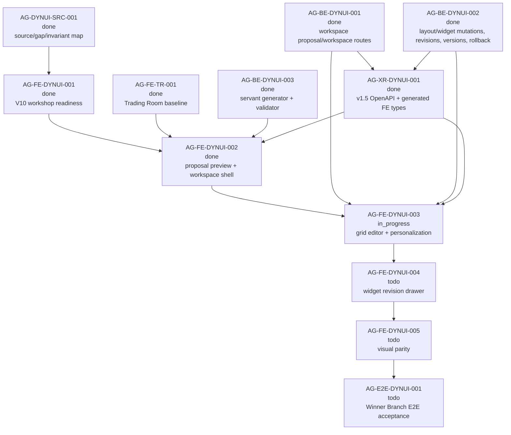

# AG-FE-DYNUI-003 Sidecar Acceptance Packet

| Field | Value |
|---|---|
| Sidecar task | `AG-FE-DYNUI-003-SIDECAR-ACCEPTANCE` |
| Helper parent | `AG-FE-DYNUI-003` |
| Helper kind | `acceptance_packet` |
| Parent title | Trading Room grid editor and personalization events |
| Parent owner / reviewer | `Codex2` / `Codex` as of `2026-06-29` status readback |
| Sidecar owner / reviewer | `Codex` / `Codex2` |
| Date | `2026-06-29` |
| Mutates canonical truth | `false` |
| Status | Ready for `Codex2` review |

This packet is support material only. It packages acceptance criteria,
dependency routing, blocker triggers, and verification guidance for
`AG-FE-DYNUI-003`. It does not edit L1 canonical truth, schemas, OpenAPI, BFF
runtime, frontend runtime, registry/governance code, broker authority, or parent
implementation files.

## 1. Purpose

`AG-FE-DYNUI-003` owns the frontend runtime step after the V11 Trading Room
proposal has been accepted into a non-empty `TradingRoomWorkspace`. The parent
must turn the accepted workspace shell into a controlled editor:

1. render workspace views as editable tabs/surfaces driven by
   `TradingRoomWorkspace.views`;
2. map widget placement to real grid drop targets, drag handles, and resize
   handles instead of fixed CSS card positions;
3. support trader-owned edit operations: move, resize, remove, restore, add
   registered widget, change chart, duplicate where the published contract can
   represent it, and save/discard unsaved changes;
4. persist accepted editor changes through the v1.5 Trading Room workspace
   mutation routes with ETag and idempotency guards;
5. emit or preserve personalization events for trader layout/widget choices
   without exposing direct orders, capital binding, runtime binding, broker
   controls, or arbitrary frontend code.

This sidecar does not approve or implement the parent. It gives the parent
owner and reviewer a concrete acceptance surface. Widget-context servant
adjustment with before/after `WidgetRevisionProposal` UI belongs to
`AG-FE-DYNUI-004`; final visual parity belongs to `AG-FE-DYNUI-005`; full
Winner Branch E2E proof belongs to `AG-E2E-DYNUI-001`.

## 2. Sources Read

| Source | Relevant finding |
|---|---|
| `AI_COLLABORATION_GUIDE.md` | L0 state coordinates task work; support packets do not override canonical architecture or policy truth. |
| `.orchestrator/task-briefs/ag_fe_dynui_003_sidecar_acceptance.md` | Sidecar scope is acceptance checklist, dependency map, and support packet only; canonical/runtime changes are out of scope. |
| `.orchestrator/skills/worker-anchor-commit.md` | Task-owned support/docs changes should be committed narrowly. |
| `.orchestrator/skills/task-closeout-finalization.md` | Final `done` closeout is reserved for owner finalization after review approval and merged task PR. |
| `AI_NAME=Codex ./scripts/ai-status.sh show AG-FE-DYNUI-003-SIDECAR-ACCEPTANCE` | Active sidecar is `in_progress`, owner `Codex`, reviewer `Codex2`, helper parent `AG-FE-DYNUI-003`, artifact path is this packet, and `mutates_canonical` is `false`. |
| `AI_NAME=Codex ./scripts/ai-status.sh show AG-FE-DYNUI-003` | Parent is active `in_progress`, owner `Codex2`, reviewer `Codex`, and owns Trading Room grid editor plus personalization events. |
| `AI_NAME=Codex ./scripts/ai-status.sh show AG-FE-DYNUI-002` | Upstream FE proposal preview/workspace shell is archived `done`; execute-plans PR `#81` merged to `main` at `64a963119e85f2e91efbedbd83c4fbd97c7c2e20`. |
| `AI_NAME=Codex ./scripts/ai-status.sh show AG-BE-DYNUI-001`, `AG-BE-DYNUI-002`, `AG-BE-DYNUI-003`, `AG-XR-DYNUI-001` | Workspace proposal/workspace routes, widget revisions/versions/rollback, servant generator, OpenAPI, and generated FE types are archived `done`. |
| `AI_NAME=Codex ./scripts/ai-status.sh show AG-FE-DYNUI-004`, `AG-FE-DYNUI-005`, `AG-E2E-DYNUI-001` | Widget revision drawer, visual parity, and full E2E proof remain downstream and must not be absorbed by `AG-FE-DYNUI-003`. |
| `docs/04/agora_design_pack_dynui_2026-06-28/README.md` | Dynamic UI invariants require trader layout edits, widget edit actions, personalization, versions, and rollback on top of generated workspace proposals. |
| `docs/04/agora_design_pack_dynui_2026-06-28/source-map-and-gap-map.md` | Routes persisted grid editor, add/remove/restore/duplicate/change chart/save-discard/personalization to `AG-FE-DYNUI-003`; static mock pages and empty dashboards fail. |
| `support/sidecars/AG-FE-DYNUI-002/AG-FE-DYNUI-002-SIDECAR-ACCEPTANCE.md` | Prior FE acceptance packet stops at proposal preview and initial workspace shell, leaving persisted grid editing to this parent. |
| `support/sidecars/AG-FE-DYNUI-002/AG-FE-DYNUI-002-SIDECAR-REVIEW.md` | Confirms upstream FE shell evidence and explicitly leaves layout PATCH, widget mutation, revision drawer, version history, rollback, and E2E flow outside `AG-FE-DYNUI-002`. |
| `support/sidecars/AG-BE-DYNUI-003/AG-BE-DYNUI-003-IMPLEMENTATION-EVIDENCE.md` | Servant generator emits declarative widget/chart specs and leaves frontend grid editor, drawer, visual parity, and E2E to FE tasks. |
| `services/control-plane/openapi/agora_v1_5.openapi.yaml` | v1.5 route family includes workspace layout PATCH, view/widget PATCH, widget revision proposals, versions, and rollback. |
| `services/control-plane/specs/agora/trading_room_workspace.schema.json` | `WorkspaceLayoutOperation` supports `move_widget`, `resize_widget`, `remove_widget`, `add_registered_widget`, `replace_chart_spec`, and `update_widget_query`; `TradingRoomWorkspace` and `TradingRoomWidgetSpec` define the source workspace model. |
| `services/control-plane/specs/agora/v6/capability_manifest_v1_5.json` | Capability manifest lists workspace editing, widget revision, and workspace version route families. |
| `services/control-plane/bff/agora/trading_room/test_trading_room.py` | Focused backend tests cover ETag/stale layout semantics, remove/restore, widget mutation, revision proposals, keep-copy, and rollback. |
| `git -C /home/lupin/code/execute-plans grep ... origin/main -- src/agora src/lib/bff-v1/agora package.json` | `origin/main` has the `AG-FE-DYNUI-002` workspace shell, v1.5 generated types/routes, `react-grid-layout`, and legacy `DashboardGridEditor` foundations, but no visible `task/AG-FE-DYNUI-003` PR or remote branch yet. |
| `gh pr list --repo ajoe734/execute-plans --head task/AG-FE-DYNUI-003 --state all ...` and `git ls-remote ... 'task/AG-FE-DYNUI-003*'` | No parent implementation PR or remote branch is visible at packet preparation time. |

`current-work.md` and the full `ai-activity-log.jsonl` were not scanned.

## 3. Current Readiness Snapshot

| Surface | Current state | Consequence for parent review |
|---|---|---|
| Parent task | `AG-FE-DYNUI-003` is active `in_progress`, owner `Codex2`, reviewer `Codex`. | This packet should be reviewed by `Codex2`, then the parent owner can use it as an acceptance checklist. |
| Parent implementation PR/branch | No execute-plans PR or remote `task/AG-FE-DYNUI-003*` branch is visible yet. | Not a blocker for this sidecar; parent review must require concrete PR/commit evidence later. |
| Upstream FE shell | `AG-FE-DYNUI-002` is archived `done`; execute-plans `main` includes proposal generation, proposal preview, accept envelope handling, workspace shell, typed errors, and widget registry safety from PR `#81`. | Parent should extend the generated `TradingRoomWorkspace` shell rather than reimplement proposal preview or fall back to `DashboardRecipeV2`. |
| Backend workspace editing | `AG-BE-DYNUI-001` and `AG-BE-DYNUI-002` are archived `done`; OpenAPI v1.5 exposes layout/view/widget mutation, revision proposals, versions, and rollback. | Parent should call published helpers/routes and preserve ETag/idempotency semantics instead of local-only persistence. |
| Servant generator | `AG-BE-DYNUI-003` is archived `done`; generator stays declarative and validator-backed. | Parent can assume workspace/widget specs are generated, but all trader edits must remain schema/registry validated. |
| Cross-repo types | `AG-XR-DYNUI-001` is archived `done`; execute-plans generated v1.5 types include dynamic Trading Room contracts and route names. | Parent should use generated contract types or a narrow adapter tied to those generated types. |
| Legacy editor foundations | execute-plans `origin/main` still has `DashboardGridEditor`, `DashboardChangeLog`, and `WidgetRevisionDrawer` foundations from earlier dashboard runtime work. | Reuse is acceptable only through explicit V11 `TradingRoomWorkspace` adapters; recipe-only state or no-op persistence fails. |
| Downstream FE scope | `AG-FE-DYNUI-004`, `AG-FE-DYNUI-005`, and `AG-E2E-DYNUI-001` remain active future tasks. | Parent must stop at persisted grid editor/personalization and preserve handoff state for drawer, visual parity, and E2E. |

## 4. Parent Acceptance Checklist

| # | Criterion | Acceptance rule |
|---|---|---|
| 1 | **Design and contract evidence is explicit** | Parent closeout cites the dynamic UI README/source map, V11 sections used for editor behavior, v1.5 OpenAPI/schema surfaces, and upstream AG-FE/BE/XR support packets. If any source cannot be read or conflicts with code, parent opens a blocker. |
| 2 | **Implementation starts from `TradingRoomWorkspace`** | Editor state is initialized from accepted `TradingRoomWorkspace.views`, `activeViewId`, widget specs, ETag/version metadata, and generated view/widget IDs. Reopening proposal preview, `DashboardRecipeV2`, local mock workspaces, or static card arrays as the source of truth fails. |
| 3 | **View tabs are data-driven** | View tabs/cards render from `workspace.views` in order and select/update `activeViewId` without losing unsaved edits. Empty placeholder tabs must not appear when the workspace has generated views. |
| 4 | **Grid is real, not CSS-only** | Widget placement maps from `TradingRoomWidgetSpec.placement` into stable grid coordinates/drop targets. Drag and resize affordances must be functional in edit mode; fixed CSS positions that only look draggable fail. |
| 5 | **Drag/resize operations are typed** | Dragging emits `move_widget`; resizing emits `resize_widget`; payloads preserve widget id, view id, placement coordinates, and size fields that can map back to `WidgetPlacement`. |
| 6 | **Unsaved-change workflow is explicit** | The editor shows dirty state after local edits and supports save/discard. Saving persists the pending operations; discarding restores the last server workspace. Silent local mutation with no save boundary fails. |
| 7 | **Layout save uses BFF contract guards** | Save calls `PATCH /bff/agora/trading-room/workspaces/{workspace_id}/layout` or the generated helper equivalent with `If-Match`/ETag and `Idempotency-Key`. `412` stale writes and `422` validation failures must be visible and must not leave false saved state. |
| 8 | **Remove and restore are reversible** | Removing a widget uses the contract-supported remove path and places the widget in a visible restore tray/menu for the same workspace/view. Restore returns the widget with valid placement; removal must not delete data, version history, or restore metadata. |
| 9 | **Add widget is registry-scoped** | Add-widget UI only offers registry-allowed widgets/data/chart families. It persists via `add_registered_widget` or a route-supported equivalent. Unsupported widgets must be blocked or handed off, not invented in frontend state. |
| 10 | **Change chart is validator-backed** | Chart changes use `replace_chart_spec` or widget PATCH with generated `ChartSpec` types and registry validation. Raw chart config, arbitrary URLs, scriptable renderer options, or unsupported chart kinds fail. |
| 11 | **Duplicate is contract-shaped or blocked** | Duplicate must either map to an explicitly supported contract operation, or be recorded as a blocker/handoff if v1.5 lacks the necessary operation. A local-only copied widget with fake persistence fails. |
| 12 | **Widget PATCH stays trader-owned** | Direct widget PATCH is only used for trader-owned supported fields. Servant-originated widget changes are not smuggled through this path; those remain `AG-FE-DYNUI-004` via `WidgetRevisionProposal`. |
| 13 | **Personalization events are emitted/preserved** | Drag, resize, add, remove, restore, change-chart, duplicate, active-view, density, or layout preference changes emit a typed personalization event or record the BFF-provided personalization metadata. Events must include safe workspace/view/widget context without raw private prompts or broker/runtime data. |
| 14 | **Workspace versions remain append-only** | Successful saved edits produce or preserve updated workspace version/change-log evidence from the BFF response. Parent does not need to build the full versions UI, but it must not discard version/ETag metadata needed by downstream version history and rollback. |
| 15 | **Typed errors clear or preserve state correctly** | `403` clears scoped workspace data; `404` clears stale navigation; `409` re-reads or marks conflict; `412` preserves local dirty edits and prompts refresh/discard; `422` surfaces validation details; `501`/capability-not-ready does not render fixtures or local fallback success. |
| 16 | **BFF boundary stays strict** | Trading Room page/components call generated or narrow BFF client helpers. New page-level `fetch()`, Management routes, RuntimeBinding routes, broker routes, direct capital actions, or cross-repo shell access fail. |
| 17 | **Safety language and code-injection guard remain intact** | UI does not expose direct order routing, broker backend controls, capital binding, RuntimeBinding, Management-plane terms, `eval`, `new Function`, `dangerouslySetInnerHTML`, iframes, raw HTML/JS, arbitrary renderer code, or unsupported external scripts. |
| 18 | **Downstream boundaries stay intact** | Parent may expose buttons/placeholders for "adjust" only if they do not perform the backend-backed before/after revision flow. Widget adjustment drawer, apply/keep/cancel revision lifecycle, final visual parity, and full E2E proof remain downstream. |
| 19 | **Regression tests cover the editor contract** | Tests cover view tabs, placement-to-grid mapping, drag, resize, save/discard, ETag/stale handling, remove/restore, add registered widget, change chart, blocked unsupported actions, personalization events, no local fixture fallback, and no forbidden UI terms/actions. |
| 20 | **Browser evidence exists** | Parent closeout includes screenshot or Playwright evidence for accepted workspace shell in edit mode: tabs, grid handles, dirty state, save/discard, remove/restore, add widget, change chart, and saved workspace update. Evidence must use contract-shaped workspace data. |

## 5. Dependency Map



### Dependency notes

| Task / surface | Current state | Relevance to `AG-FE-DYNUI-003` |
|---|---|---|
| `AG-FE-DYNUI-002` | Archived `done`; execute-plans PR `#81` merged to `main`. | Provides the accepted proposal/workspace shell to extend. |
| `AG-BE-DYNUI-001` | Archived `done`. | Provides workspace proposal/read/accept and base workspace mutation route family. |
| `AG-BE-DYNUI-002` | Archived `done`. | Provides layout operations, widget revision proposals, workspace versions, and rollback semantics that editor persistence must preserve. |
| `AG-BE-DYNUI-003` | Archived `done`. | Provides generated declarative workspace/widget specs; editor must not bypass registry validation. |
| `AG-XR-DYNUI-001` | Archived `done`. | Generated v1.5 frontend types/routes are available for editor client helpers. |
| `DashboardGridEditor` foundation | Present on execute-plans `origin/main`. | Can be adapted only if source of truth becomes `TradingRoomWorkspace` and persistence stops being no-op. |
| `AG-FE-DYNUI-004` | Active future task. | Owns widget-context drawer and before/after revision proposal UI; 003 should preserve trigger context only. |
| `AG-FE-DYNUI-005` | Active future task. | Owns visual parity after runtime behavior exists. |
| `AG-E2E-DYNUI-001` | Active future task. | Owns complete Winner Branch workflow proof after 003/004/005 compose. |

## 6. Blocker Triggers For Parent Owner

Parent owner should stop and open a blocker or reviewer handoff if any of these
are true:

1. The active execute-plans branch does not include the v1.5 generated dynamic
   Trading Room types and route paths from `AG-XR-DYNUI-001`.
2. `AG-FE-DYNUI-002` workspace shell state cannot be used as the editor source
   without reintroducing `DashboardRecipeV2` or local mock workspace state.
3. `TradingRoomWidgetSpec.placement` cannot be mapped to the chosen grid
   library without inventing placement fields or losing min/preferred/max size
   semantics.
4. Drag, resize, remove, restore, add widget, change chart, or duplicate cannot
   be represented by `WorkspaceLayoutOperation`, view/widget PATCH, or another
   published v1.5 route.
5. Saving requires bypassing ETag/idempotency, ignoring `412` stale writes, or
   treating validation failure as a successful local save.
6. Personalization events require fields that are not in generated types or
   require writing raw private prompt/session/broker/runtime/capital data.
7. Implementation would require direct broker/order/capital/runtime/Management
   UI, direct page `fetch()`, raw HTML/JS/React injection, arbitrary renderer
   code, unsupported data sources, or widget registry allowlist expansion.
8. The parent needs to implement the full widget adjustment drawer,
   before/after `WidgetRevisionProposal` lifecycle, final visual parity, or E2E
   flow to make the editor usable. Those are downstream scopes.

## 7. Suggested Parent Verification Plan

Run from the relevant execute-plans task worktree after parent implementation:

```bash
npm test -- --run \
  src/agora/pages/trading-room/TradingRoomPage.test.tsx \
  src/agora/dashboard/DashboardGridEditor.test.tsx \
  src/lib/bff-v1/agora/tradingRoom.test.ts \
  src/agora/widgets/registry.test.ts
```

```bash
npm run contract:drift -- --summary
npm run build
```

Recommended additional focused checks:

- a test that `TradingRoomWorkspace.views[].widgets[].placement` maps into grid
  layout items and does not render fixed CSS-only positions;
- tests that drag and resize emit/save `move_widget` and `resize_widget`
  operations with ETag/idempotency headers;
- tests for save/discard dirty state and `412` stale-write recovery;
- tests for remove/restore and add registered widget using contract operations;
- tests for change chart using `replace_chart_spec` or widget PATCH with
  registry validation;
- a blocker or test around duplicate semantics, depending on whether the
  implementation can map duplicate to a published v1.5 operation;
- tests proving personalization events are emitted or preserved without unsafe
  fields;
- a scoped grep proving no page-level `fetch(` in Trading Room page components;
- a scoped safety grep for `RuntimeBinding`, `broker`, `capital`, `place order`,
  `enable live`, `eval(`, `new Function`, `dangerouslySetInnerHTML`, and
  `<iframe`;
- Playwright or screenshot evidence for an accepted workspace in edit mode with
  view tabs, grid handles, dirty save/discard, remove/restore, add widget, and
  change chart controls.

Optional Pantheon-side contract evidence if parent needs to confirm backend
route behavior:

```bash
python3 -m pytest services/control-plane/bff/agora/trading_room/test_trading_room.py -q
python3 -m pytest scripts/test_agora_v1_5_bundle.py -q
```

## 8. Support-Only Boundary Confirmation

- No L1/L2 canonical policy or architecture document was edited by this
  sidecar.
- No backend schema, OpenAPI, BFF route, runtime, registry, or governance
  implementation was changed by this sidecar.
- No frontend runtime file was changed by this sidecar.
- The only intended deliverable is this support packet:
  `support/sidecars/AG-FE-DYNUI-003/AG-FE-DYNUI-003-SIDECAR-ACCEPTANCE.md`.
- The sidecar does not approve the parent implementation. It gives the parent
  owner and reviewer a concrete acceptance surface.

## 9. Validation Run

Commands run from this sidecar worktree unless noted:

```bash
git status -sb
git branch --show-current
git remote -v
AI_NAME=Codex ./scripts/ai-status.sh show AG-FE-DYNUI-003-SIDECAR-ACCEPTANCE
AI_NAME=Codex ./scripts/ai-status.sh show AG-FE-DYNUI-003
AI_NAME=Codex ./scripts/ai-status.sh show AG-FE-DYNUI-002
AI_NAME=Codex ./scripts/ai-status.sh show AG-BE-DYNUI-001
AI_NAME=Codex ./scripts/ai-status.sh show AG-BE-DYNUI-002
AI_NAME=Codex ./scripts/ai-status.sh show AG-BE-DYNUI-003
AI_NAME=Codex ./scripts/ai-status.sh show AG-XR-DYNUI-001
AI_NAME=Codex ./scripts/ai-status.sh show AG-FE-DYNUI-004
AI_NAME=Codex ./scripts/ai-status.sh show AG-FE-DYNUI-005
AI_NAME=Codex ./scripts/ai-status.sh show AG-E2E-DYNUI-001
rg -n "layout|views/\{view_id\}|widgets/\{widget_id\}|WorkspaceLayoutOperation|TradingRoomDashboardVersion|rollback|revision-proposals|PersonalizationEvent" services/control-plane/specs/agora services/control-plane/openapi/agora_v1_5.openapi.yaml services/control-plane/bff/agora/trading_room scripts/test_agora_v1_5_bundle.py -S
gh pr list --repo ajoe734/execute-plans --head task/AG-FE-DYNUI-003 --state all --json number,state,title,url,headRefName,baseRefName,headRefOid,updatedAt,statusCheckRollup
git ls-remote --heads https://github.com/ajoe734/execute-plans.git 'task/AG-FE-DYNUI-003*'
git -C /home/lupin/code/execute-plans grep -n "TradingRoomWorkspaceShell\|WorkspaceProposalPreview\|TradingRoomWorkspace\|update.*layout\|PATCH\|revision-proposals\|versions\|rollback\|react-grid-layout\|ResponsiveGridLayout\|onLayoutChange\|drag\|resize\|personalization" origin/main -- src/agora src/lib/bff-v1/agora package.json
git diff --check -- support/sidecars/AG-FE-DYNUI-003/AG-FE-DYNUI-003-SIDECAR-ACCEPTANCE.md
```

Observed results:

- Branch is `task/AG-FE-DYNUI-003-SIDECAR-ACCEPTANCE`.
- Sidecar is active `in_progress`, owner `Codex`, reviewer `Codex2`; parent is
  active `in_progress`, owner `Codex2`, reviewer `Codex`.
- `AG-FE-DYNUI-002`, `AG-BE-DYNUI-001`, `AG-BE-DYNUI-002`,
  `AG-BE-DYNUI-003`, and `AG-XR-DYNUI-001` are archived `done`.
- `AG-FE-DYNUI-004`, `AG-FE-DYNUI-005`, and `AG-E2E-DYNUI-001` remain active
  future tasks.
- Pantheon v1.5 OpenAPI/schema/BFF tests include layout PATCH, view/widget
  PATCH, widget revision proposals, versions, rollback, and
  `WorkspaceLayoutOperation` coverage.
- execute-plans `origin/main` contains the upstream proposal/workspace shell,
  v1.5 generated types, `react-grid-layout`, and earlier dashboard editor
  foundations.
- No execute-plans PR or remote branch named `task/AG-FE-DYNUI-003*` was
  visible at packet preparation time.
- `git diff --check` passed for this support packet.
- No parent runtime tests were run by this sidecar because it changes support
  artifacts only.

## 10. Reviewer Handoff Notes

**Reviewer:** `Codex2`

### What to verify

1. The packet stays support-only and does not redefine canonical contracts.
2. The checklist is scoped to `AG-FE-DYNUI-003` editor/personalization work and
   does not absorb `AG-FE-DYNUI-004`, `AG-FE-DYNUI-005`, or E2E scope.
3. The packet correctly uses the already completed v1.5 backend/XR/FE
   dependencies as inputs.
4. The duplicate/change-chart/add-widget criteria correctly require published
   contract operations or blockers rather than local-only frontend state.

### Suggested reviewer command

```bash
AI_NAME=Codex2 ./scripts/ai-status.sh approve AG-FE-DYNUI-003-SIDECAR-ACCEPTANCE "Acceptance packet approved; support artifact gives AG-FE-DYNUI-003 concrete grid editor and personalization criteria, dependency routing, blocker triggers, and verification guidance without changing canonical truth."
```

If changes are required:

```bash
AI_NAME=Codex2 ./scripts/ai-status.sh reopen AG-FE-DYNUI-003-SIDECAR-ACCEPTANCE "Describe the exact packet corrections needed."
```

Prepared by `Codex` for the `AG-FE-DYNUI-003-SIDECAR-ACCEPTANCE` support slice.
