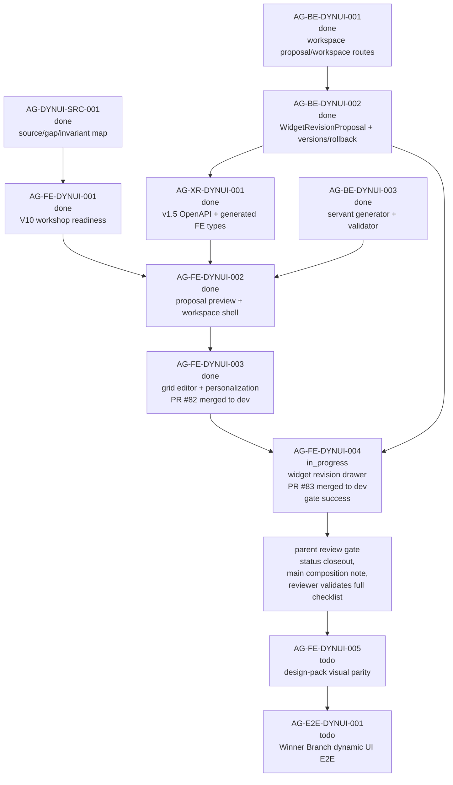

# AG-FE-DYNUI-004 Sidecar Acceptance Follow-up 2

| Field | Value |
|---|---|
| Sidecar task | `AG-FE-DYNUI-004-SIDECAR-ACCEPTANCE-FOLLOWUP-2` |
| Helper parent | `AG-FE-DYNUI-004` |
| Helper kind | `acceptance_packet` |
| Parent title | Widget adjustment drawer and before-after revision flow |
| Parent owner / reviewer | `Codex2` / `Claude2` as of status readback |
| Sidecar owner / reviewer | `Codex` / `Codex2` |
| Date | `2026-06-29` |
| Mutates canonical truth | `false` |
| Status | Ready for `Codex2` review; parent remains `in_progress` |

This is a support-only follow-up packet. It does not replace the archived
`AG-FE-DYNUI-004-SIDECAR-ACCEPTANCE` packet, and it does not approve or
implement the parent frontend runtime. Its purpose is to give the parent owner
and reviewer a current dependency/evidence gate after the original acceptance
sidecar closed and after the parent implementation PR became GitHub-visible.

## 1. Relationship To Existing Packet

| Packet / task | Current state | How this follow-up uses it |
|---|---|---|
| `AG-FE-DYNUI-004-SIDECAR-ACCEPTANCE` | Archived `done`; Codex2 approval recorded; packet PR `#2608` is recorded as merged into Pantheon `dev` at `a725cc4acc6c06b43a20bdf1bfd8a8586ba61ec4`. | Remains the main acceptance checklist for the widget adjustment drawer and before/after revision flow. This follow-up adds current parent PR/check/readiness evidence. |
| `AG-FE-DYNUI-004` | Active `in_progress`; owner `Codex2`, reviewer `Claude2`; execute-plans PR `#83` is merged into `dev` with a successful integration gate. | Parent implementation now has merged PR/check evidence, but formal task acceptance still needs parent owner/reviewer status closeout. |
| `AG-FE-DYNUI-004-SIDECAR-ACCEPTANCE-FOLLOWUP-2` | Active support slice owned by `Codex`, reviewed by `Codex2`; support artifact is this file. | Provides a narrow current evidence/dependency packet for reviewer handoff; it does not change canonical truth or parent code. |

If this packet appears to conflict with L1/L2 canonical docs or the archived
main acceptance packet, the canonical docs and archived main packet win. This
follow-up should then be corrected or reopened.

## 2. Sources Read

| Source | Relevant finding |
|---|---|
| `AI_COLLABORATION_GUIDE.md` | L0 state coordinates task work; support packets do not override canonical architecture or policy truth. |
| `.orchestrator/task-briefs/ag_fe_dynui_004_sidecar_acceptance_followup_2.md` | Scope is acceptance checklist, dependency map, and support packet only; canonical/runtime changes are out of scope; owner is `Codex`, reviewer is `Codex2`. |
| `.orchestrator/skills/worker-anchor-commit.md` | Task-owned support/docs changes should be made durable through narrow commits. |
| `.orchestrator/skills/task-closeout-finalization.md` | Final `done` closeout is reserved for owner finalization after review approval and merged task PR. |
| `AI_NAME=Codex ./scripts/ai-status.sh show AG-FE-DYNUI-004-SIDECAR-ACCEPTANCE-FOLLOWUP-2` | Active `in_progress`, owner `Codex`, reviewer `Codex2`, helper parent `AG-FE-DYNUI-004`, artifact path is this file, and `mutates_canonical` is `false`. |
| `AI_NAME=Codex ./scripts/ai-status.sh show AG-FE-DYNUI-004` | Parent remains active `in_progress`, owner `Codex2`, reviewer `Claude2`; status has not yet recorded parent review/closeout despite merged frontend PR evidence. |
| `AI_NAME=Codex ./scripts/ai-status.sh show AG-FE-DYNUI-004-SIDECAR-ACCEPTANCE` | Prior acceptance sidecar is archived `done` with `Codex2` approval and merged PR evidence. |
| `AI_NAME=Codex ./scripts/ai-status.sh show AG-FE-DYNUI-003` | Upstream grid editor and personalization task is archived `done`; execute-plans PR `#82` merged into `dev` at `98516d129e377842f1d5866af61e326134751439`. |
| `AI_NAME=Codex ./scripts/ai-status.sh show AG-BE-DYNUI-002`, `AG-BE-DYNUI-003`, `AG-XR-DYNUI-001` | Widget revision proposals/versioning, servant generator/validator, and v1.5 generated frontend types are archived `done`. |
| `AI_NAME=Codex ./scripts/ai-status.sh show AG-FE-DYNUI-005`, `AG-E2E-DYNUI-001` | Design-pack visual parity and full Winner Branch dynamic UI E2E remain downstream and must not be absorbed by `AG-FE-DYNUI-004`. |
| `support/sidecars/AG-FE-DYNUI-004/AG-FE-DYNUI-004-SIDECAR-ACCEPTANCE.md` | Main packet already defines the detailed 30-point parent acceptance checklist, dependency map, blocker triggers, verification plan, and support-only boundary. |
| `gh pr view 83 --repo ajoe734/execute-plans --json ...` | execute-plans PR `#83` is `MERGED`, non-draft, title `AG-FE-DYNUI-004: add widget revision drawer`, head `task/AG-FE-DYNUI-004` at `e68082e342319b934ec348da2c26a4df6dfba09e`, base `dev`, merge commit `a95d5d7855d31c0b93ab6b6cb4523b69669a3797`, merged at `2026-06-29T12:10:23Z`; `integration-gate` completed `SUCCESS` at `2026-06-29T12:16:45Z`. |
| `gh pr checks 83 --repo ajoe734/execute-plans` | `integration-gate` passed in `7m24s`. |
| `gh run view 28370937967 --repo ajoe734/execute-plans --json ...` | Workflow run completed `success`; job steps for install, lint, unit/integration tests, build, contract drift, browser probe, Playwright E2E, aggregate release gate, evidence upload, and PR comment all completed successfully. |
| `gh pr view 83 --repo ajoe734/execute-plans --json commits,files` | PR `#83` contains task commit `e68082e342319b934ec348da2c26a4df6dfba09e`; changed files are centered on Trading Room page/tests, `WorkspaceGridEditor`, new `WorkspaceWidgetRevisionDrawer`, chart-spec adapter, BFF v1.5 helpers/tests, and local type support. |
| `git ls-remote --heads https://github.com/ajoe734/execute-plans.git task/AG-FE-DYNUI-004 main dev` | Remote `task/AG-FE-DYNUI-004` is no longer listed; `dev` is PR `#83` merge commit `a95d5d7855d31c0b93ab6b6cb4523b69669a3797`; `main` remains `64a963119e85f2e91efbedbd83c4fbd97c7c2e20`. |
| `git -C /home/lupin/code/execute-plans status -sb` | Local frontend checkout is clean on `task/AG-FE-DYNUI-004`; local `HEAD` is the parent task commit `e68082e342319b934ec348da2c26a4df6dfba09e`, while refreshed `origin/dev` is the merge commit `a95d5d7855d31c0b93ab6b6cb4523b69669a3797`. |
| `git -C /home/lupin/code/execute-plans merge-base --is-ancestor origin/main origin/dev` | Returned non-zero: merged `dev` HEAD is still not currently proven to contain `origin/main`. |

`current-work.md` and the full `ai-activity-log.jsonl` were not scanned.

## 3. Current Readiness Snapshot

| Surface | Current state | Consequence for parent review |
|---|---|---|
| Parent task | `AG-FE-DYNUI-004` is active `in_progress`, owner `Codex2`, reviewer `Claude2`; execute-plans PR evidence is merged and green, but the parent task state has not yet been closed. | Parent has cleared the PR/check publication gate; formal acceptance still needs parent owner/reviewer status workflow and evidence closeout. |
| Prior sidecar packet | `AG-FE-DYNUI-004-SIDECAR-ACCEPTANCE` is archived `done` and approved by `Codex2`. | Use the archived packet as the primary checklist; this follow-up should not duplicate or supersede it. |
| Parent PR/check evidence | execute-plans PR `#83` merged into `dev` at `a95d5d7855d31c0b93ab6b6cb4523b69669a3797`; `integration-gate` completed `SUCCESS`; remote `task/AG-FE-DYNUI-004` is no longer listed by authoritative `ls-remote`. | Parent owner/reviewer can use PR `#83` and run `28370937967` as the current implementation evidence anchor. |
| Parent implementation scope | PR `#83` changes 11 files centered on BFF revision helpers/tests, `WorkspaceGridEditor`, new `WorkspaceWidgetRevisionDrawer`, chart-spec adapter, local Trading Room type support, and Trading Room page tests. | Diff shape matches the sidecar's intended drawer/client/grid integration surface; parent reviewer still owns behavior review against the full checklist. |
| Local frontend checkout | `/home/lupin/code/execute-plans` is clean on task commit `e68082e342319b934ec348da2c26a4df6dfba09e`; refreshed `origin/dev` is PR `#83` merge commit `a95d5d7855d31c0b93ab6b6cb4523b69669a3797`. | Local checkout is useful for inspecting the task commit, but reviewer should treat `origin/dev` / PR `#83` as the merged delivery state. |
| Branch base / composition | PR `#83` merged into `dev`; `origin/main` remains `64a963119e85f2e91efbedbd83c4fbd97c7c2e20` and is still not an ancestor of `origin/dev`. | Preserve the main-base composition note. Parent owner/reviewer should record whether `dev` is the intended temporary delivery target and how this work composes back to execute-plans `main`. |
| Upstream dependencies | `AG-FE-DYNUI-003`, `AG-BE-DYNUI-002`, `AG-BE-DYNUI-003`, and `AG-XR-DYNUI-001` are archived `done`. | Parent can rely on grid editor/version/rollback, backend revision proposal routes, generator/validator, and v1.5 generated type surfaces. |
| Downstream FE scope | `AG-FE-DYNUI-005` and `AG-E2E-DYNUI-001` remain active future tasks. | Parent should stop at widget adjustment drawer and before/after revision flow; final visual parity and full E2E proof stay downstream. |

## 4. Parent Evidence Gate Delta

The archived main sidecar packet remains the full acceptance checklist. This
follow-up adds the current gates that should be checked before `AG-FE-DYNUI-004`
review/closeout:

1. Treat GitHub PR/check publication as satisfied but not parent-status closed:
   execute-plans PR `#83` is merged from `task/AG-FE-DYNUI-004` at
   `e68082e342319b934ec348da2c26a4df6dfba09e` into `dev` as
   `a95d5d7855d31c0b93ab6b6cb4523b69669a3797`.
2. Use PR `#83`'s `integration-gate` as reviewer-visible check evidence:
   `Pantheon FE-BFF Integration Gate / integration-gate` completed `SUCCESS`
   at `2026-06-29T12:16:45Z`; `gh pr checks` reports `integration-gate pass`.
3. Treat the remote task branch lifecycle as closed: authoritative
   `git ls-remote` no longer lists `refs/heads/task/AG-FE-DYNUI-004`.
4. Preserve the main-base composition note. PR `#83` merged to `dev`, while
   `origin/main` at `64a963119e85f2e91efbedbd83c4fbd97c7c2e20` is still not an
   ancestor of `origin/dev`. Parent owner/reviewer should record whether `dev`
   is the intended temporary delivery target and how this work composes back to
   execute-plans `main`.
5. Distinguish PR-local implementation scope from broader `dev` vs `main`
   drift. PR `#83` itself is centered on the widget revision drawer/client/grid
   integration surface, but the base branch remains `dev`; parent acceptance
   should not silently sweep unrelated route, Management, workflow, or
   historical dev/main drift into this task.
6. Provide parent-status closure separately. Merged PR and green check evidence
   is available, but `AG-FE-DYNUI-004` still reads as active `in_progress` in
   Pantheon status.
7. Preserve the main packet's behavior gates: widget entrypoint from generated
   workspace widgets, full drawer context, controlled instruction input, strict
   BFF helper boundary, server-backed `WidgetRevisionProposal`, idempotency and
   ETag guards, durable before/after snapshots, apply/keep-copy/cancel/adjust
   again, stale proposal protection, version/change-log refresh, editor
   regression safety, and no order/capital/runtime/code-injection surfaces.
8. Keep downstream scope out of parent closeout. Final dark AGORA visual parity
   stays in `AG-FE-DYNUI-005`; full Winner Branch dynamic UI E2E acceptance
   stays in `AG-E2E-DYNUI-001`.

If any of these gates cannot be satisfied without changing backend contracts,
generated types, canonical docs, widget allowlists, or downstream runtime
scope, parent owner should open a blocker instead of widening this task.

## 5. Dependency Map



### Dependency Notes

| Task / surface | Current state | Relevance to `AG-FE-DYNUI-004` |
|---|---|---|
| `AG-FE-DYNUI-003` | Archived `done`; execute-plans PR `#82` merged into `dev` at `98516d129e377842f1d5866af61e326134751439`. | Provides workspace grid editor, menu, save/discard, versions, rollback, and personalization display that the drawer must preserve. |
| `AG-BE-DYNUI-002` | Archived `done`; focused backend tests recorded for revision proposals, versions, and rollback. | Provides backend create/accept/keep-copy/version/rollback semantics. |
| `AG-BE-DYNUI-003` | Archived `done`. | Provides generator and safe widget validator context; parent should not rebuild generator behavior. |
| `AG-XR-DYNUI-001` | Archived `done`; execute-plans generated v1.5 types were merged to `main` in PR `#80`. | Parent should use generated or generated-adjacent contract types, and should open a drift blocker rather than inventing durable app-only shapes. |
| execute-plans PR `#83` | Merged into `dev` at `a95d5d7855d31c0b93ab6b6cb4523b69669a3797`; `integration-gate` succeeded. | Parent owner has merged reviewable implementation evidence; parent acceptance still needs status closeout and the main-base composition note. |
| `AG-FE-DYNUI-005` | Active `todo`; depends on `AG-FE-DYNUI-004`. | Owns final design-pack visual parity on top of the dynamic runtime. |
| `AG-E2E-DYNUI-001` | Active `todo`; depends on backend/XR and visual completion. | Owns complete Winner Branch dynamic UI E2E proof. |

## 6. Blocker Triggers For Parent Owner

Parent owner should stop and open a blocker or reviewer handoff if any of these
are true:

1. PR `#83`'s merged state, merge commit, or successful `integration-gate`
   evidence cannot be reproduced from GitHub by the parent reviewer.
2. Parent closeout still cannot move `AG-FE-DYNUI-004` out of `in_progress`
   because required review artifacts, screenshots, or owner evidence are
   missing.
3. The merged `dev` delivery cannot compose back to execute-plans `main`
   without losing the merged `AG-FE-DYNUI-002` and `AG-FE-DYNUI-003` state.
4. The work remains delivered only to `dev` while `origin/main` is not an
   ancestor of `origin/dev`, and no explicit reviewer-acceptable delivery
   target / composition note is recorded.
5. The parent implementation uses local-only `proposedSpec`, fake persistence,
   direct widget mutation, or non-BFF routes as proof of the
   `WidgetRevisionProposal` flow.
6. Apply or keep-copy accepts cannot be guarded by the current workspace ETag
   and idempotency key.
7. The drawer weakens existing grid editor save/discard, version history,
   rollback, widget validation, cross-user isolation, or personalization state.
8. The task needs final visual parity or full Winner Branch E2E to pass. Those
   are downstream scopes.

## 7. Suggested Parent Verification Plan

Run from execute-plans `dev` at merge commit
`a95d5d7855d31c0b93ab6b6cb4523b69669a3797`, or from a follow-up branch that
composes this merge back to `main`:

```bash
npm test -- --run \
  src/lib/bff-v1/agora/tradingRoom.test.ts \
  src/agora/pages/trading-room/TradingRoomPage.test.tsx \
  src/agora/dashboard/DashboardGridEditor.test.tsx \
  src/agora/widgets/WidgetRevisionDrawer.test.tsx
```

```bash
npx eslint \
  src/lib/bff-v1/agora/tradingRoom.ts \
  src/agora/pages/trading-room/TradingRoomPage.tsx \
  src/agora/trading-room/WorkspaceGridEditor.tsx \
  src/agora/trading-room/WorkspaceWidgetRevisionDrawer.tsx
```

```bash
npm run contract:drift -- --summary
npm run build
git diff --check origin/main...HEAD
```

Recommended focused reviewer checks:

- a scoped PR `#83` diff check that parent changes remain centered on the
  drawer/client/grid integration and focused tests;
- a branch-base check that records whether `origin/main` is an ancestor of the
  reviewed commit, or why `dev` is the accepted temporary delivery target;
- UI/test evidence for opening the drawer from a real generated workspace
  widget, full context display, server-backed before/after proposal, field diff,
  apply, keep-copy, cancel, adjust again, stale proposal recovery, and workspace
  version/change-log refresh;
- regression evidence that view tabs, grid edit/save/discard, remove/restore,
  add widget, duplicate, change chart, version listing, rollback, and
  personalization display still pass after drawer integration;
- a safety grep for forbidden broker/capital/runtime/Management/direct-order
  language and unsafe rendering primitives.

## 8. Support-Only Boundary Confirmation

- No L1/L2 canonical policy or architecture document was edited by this
  sidecar.
- No backend schema, OpenAPI, BFF route, runtime, registry, governance, or
  generated type file was changed by this sidecar.
- No execute-plans frontend runtime file was changed by this sidecar.
- The only intended support deliverable is this packet:
  `support/sidecars/AG-FE-DYNUI-004/AG-FE-DYNUI-004-SIDECAR-ACCEPTANCE-FOLLOWUP-2.md`.
- The generated task brief is task-scoped state:
  `.orchestrator/task-briefs/ag_fe_dynui_004_sidecar_acceptance_followup_2.md`.
- This sidecar does not approve the parent implementation.

## 9. Validation Run

Commands run from this sidecar worktree unless noted:

```bash
git status -sb
git branch --show-current
git remote -v
AI_NAME=Codex ./scripts/ai-status.sh show AG-FE-DYNUI-004-SIDECAR-ACCEPTANCE-FOLLOWUP-2
AI_NAME=Codex ./scripts/ai-status.sh show AG-FE-DYNUI-004
AI_NAME=Codex ./scripts/ai-status.sh show AG-FE-DYNUI-004-SIDECAR-ACCEPTANCE
AI_NAME=Codex ./scripts/ai-status.sh show AG-FE-DYNUI-003
AI_NAME=Codex ./scripts/ai-status.sh show AG-BE-DYNUI-002
AI_NAME=Codex ./scripts/ai-status.sh show AG-BE-DYNUI-003
AI_NAME=Codex ./scripts/ai-status.sh show AG-XR-DYNUI-001
AI_NAME=Codex ./scripts/ai-status.sh show AG-FE-DYNUI-005
AI_NAME=Codex ./scripts/ai-status.sh show AG-E2E-DYNUI-001
gh pr list --repo ajoe734/execute-plans --head task/AG-FE-DYNUI-004 --state all --json number,state,title,url,headRefName,baseRefName,headRefOid,mergeCommit,mergedAt,updatedAt,isDraft,statusCheckRollup,reviewDecision
gh pr view 83 --repo ajoe734/execute-plans --json number,state,title,url,headRefName,baseRefName,headRefOid,mergeCommit,mergedAt,updatedAt,isDraft,mergeStateStatus,statusCheckRollup,reviewDecision,commits,files
gh pr checks 83 --repo ajoe734/execute-plans
gh run view 28370937967 --repo ajoe734/execute-plans --json status,conclusion,createdAt,updatedAt,headSha,displayTitle,event,workflowName,url,jobs
git ls-remote --heads https://github.com/ajoe734/execute-plans.git task/AG-FE-DYNUI-004 main dev
git -C /home/lupin/code/execute-plans status -sb
git -C /home/lupin/code/execute-plans branch --show-current
git -C /home/lupin/code/execute-plans fetch origin dev main
git -C /home/lupin/code/execute-plans rev-parse HEAD origin/dev origin/main
git -C /home/lupin/code/execute-plans merge-base --is-ancestor origin/main origin/dev
git -C /home/lupin/code/execute-plans show --stat --summary --format=fuller --no-renames origin/dev
git diff --check -- support/sidecars/AG-FE-DYNUI-004/AG-FE-DYNUI-004-SIDECAR-ACCEPTANCE-FOLLOWUP-2.md
git diff --check --no-index -- /dev/null support/sidecars/AG-FE-DYNUI-004/AG-FE-DYNUI-004-SIDECAR-ACCEPTANCE-FOLLOWUP-2.md
```

Observed results:

- Branch is `task/AG-FE-DYNUI-004-SIDECAR-ACCEPTANCE-FOLLOWUP-2`.
- This sidecar is active `in_progress`, owner `Codex`, reviewer `Codex2`,
  helper parent `AG-FE-DYNUI-004`, and support-only.
- Parent `AG-FE-DYNUI-004` is active `in_progress`, owner `Codex2`, reviewer
  `Claude2`.
- Prior acceptance sidecar is archived `done`.
- Upstream `AG-FE-DYNUI-003`, `AG-BE-DYNUI-002`, `AG-BE-DYNUI-003`, and
  `AG-XR-DYNUI-001` are archived `done`.
- Downstream `AG-FE-DYNUI-005` and `AG-E2E-DYNUI-001` remain future work.
- execute-plans PR `#83` is merged into `dev`; head commit is
  `e68082e342319b934ec348da2c26a4df6dfba09e`, merge commit is
  `a95d5d7855d31c0b93ab6b6cb4523b69669a3797`, and `integration-gate` passed.
- GitHub run `28370937967` completed `success`; install, lint, tests, build,
  contract drift, browser probe, Playwright, aggregate release gate, evidence
  upload, and PR comment steps all succeeded.
- Authoritative `ls-remote` shows execute-plans `dev` at
  `a95d5d7855d31c0b93ab6b6cb4523b69669a3797`, `main` at
  `64a963119e85f2e91efbedbd83c4fbd97c7c2e20`, and no remote
  `task/AG-FE-DYNUI-004` branch.
- Local execute-plans checkout is clean on task commit
  `e68082e342319b934ec348da2c26a4df6dfba09e`; refreshed `origin/dev` is the
  PR `#83` merge commit.
- `origin/main` is not an ancestor of refreshed `origin/dev`; parent closeout
  should preserve the dev/main composition note.
- Whitespace checks emitted no diagnostics. The no-index check returned the
  expected new-file diff status with no diagnostic output.
- No parent runtime tests were run by this sidecar because it changes support
  artifacts only.

Prepared by `Codex` for the
`AG-FE-DYNUI-004-SIDECAR-ACCEPTANCE-FOLLOWUP-2` support slice.
