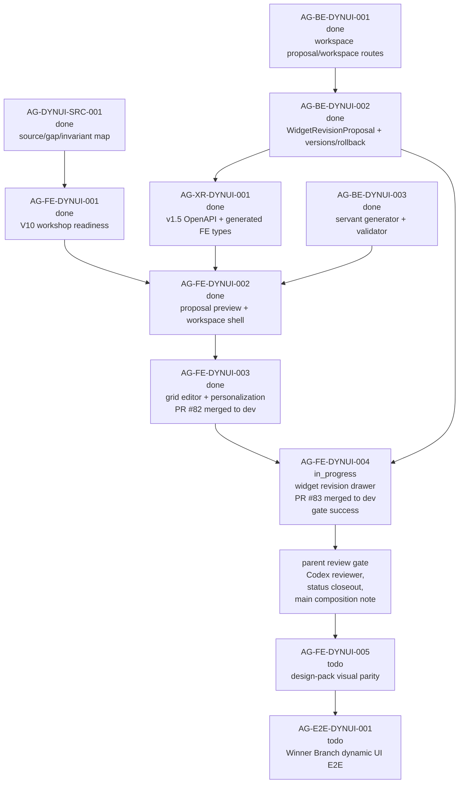

# AG-FE-DYNUI-004 Sidecar Acceptance Follow-up 3

| Field | Value |
|---|---|
| Sidecar task | `AG-FE-DYNUI-004-SIDECAR-ACCEPTANCE-FOLLOWUP-3` |
| Helper parent | `AG-FE-DYNUI-004` |
| Helper kind | `acceptance_packet` |
| Parent title | Widget adjustment drawer and before-after revision flow |
| Parent owner / reviewer | `Codex2` / `Codex` as of status readback |
| Sidecar owner / reviewer | `Codex` / `Codex2` |
| Date | `2026-06-29` |
| Mutates canonical truth | `false` |
| Status | Ready for `Codex2` review; parent remains `in_progress` |

This is a support-only follow-up packet. It does not replace the archived
`AG-FE-DYNUI-004-SIDECAR-ACCEPTANCE` packet or
`AG-FE-DYNUI-004-SIDECAR-ACCEPTANCE-FOLLOWUP-2`, and it does not approve or
implement the parent frontend runtime. Its purpose is to refresh the parent
review handoff after the parent task was re-dispatched and after the local
execute-plans checkout became dirty again.

## 1. Relationship To Existing Packets

| Packet / task | Current state | How this follow-up uses it |
|---|---|---|
| `AG-FE-DYNUI-004-SIDECAR-ACCEPTANCE` | Archived `done`; Codex2 approval recorded; packet PR `#2608` is recorded as merged. | Remains the main 30-point acceptance checklist, dependency map, blocker trigger list, and verification guidance for the widget adjustment drawer. |
| `AG-FE-DYNUI-004-SIDECAR-ACCEPTANCE-FOLLOWUP-2` | Archived `done`; Codex2 approval recorded; Pantheon PR `#2611` is recorded as merged into `dev` at `52e005335a1805d41302c516ad1cdb0cba8b9c81`. | Remains the current GitHub evidence packet for execute-plans PR `#83`; this follow-up only adds the latest status/routing deltas. |
| `AG-FE-DYNUI-004` | Active `in_progress`; owner `Codex2`, reviewer `Codex`; execute-plans PR `#83` is still merged and green. | Parent implementation evidence is published, but parent status acceptance still belongs to the parent owner/reviewer workflow. |
| `AG-FE-DYNUI-004-SIDECAR-ACCEPTANCE-FOLLOWUP-3` | Active support slice owned by `Codex`, reviewed by `Codex2`; support artifact is this file. | Provides a narrow updated handoff packet. It does not change parent implementation files or canonical truth. |

If this packet conflicts with L1/L2 canonical docs or either archived sidecar
packet, the canonical docs and archived packet win. This packet should then be
corrected or reopened.

## 2. Sources Read

| Source | Relevant finding |
|---|---|
| `AI_COLLABORATION_GUIDE.md` | L0 state coordinates task work; support packets do not override canonical architecture or policy truth. |
| `.orchestrator/task-briefs/ag_fe_dynui_004_sidecar_acceptance_followup_3.md` | Scope is acceptance checklist, dependency map, and support packet only; canonical/runtime changes are out of scope; owner is `Codex`, reviewer is `Codex2`. |
| `.orchestrator/skills/worker-anchor-commit.md` | Task-owned support/docs changes should be made durable through narrow commits. |
| `.orchestrator/skills/task-closeout-finalization.md` | Final `done` closeout is reserved for owner finalization after review approval and merged task PR. |
| `AI_NAME=Codex ./scripts/ai-status.sh show AG-FE-DYNUI-004-SIDECAR-ACCEPTANCE-FOLLOWUP-3` | Active `in_progress`, owner `Codex`, reviewer `Codex2`, helper parent `AG-FE-DYNUI-004`, artifact path is this file, and `mutates_canonical` is `false`. |
| `AI_NAME=Codex ./scripts/ai-status.sh show AG-FE-DYNUI-004` | Parent remains active `in_progress`, owner `Codex2`, reviewer `Codex`; status has not recorded parent review approval or done closeout. |
| `AI_NAME=Codex ./scripts/ai-status.sh show AG-FE-DYNUI-004-SIDECAR-ACCEPTANCE-FOLLOWUP-2` | Prior follow-up is archived `done`; review notes record Pantheon PR `#2611` merged and parent implementation acceptance remains separate. |
| `AI_NAME=Codex ./scripts/ai-status.sh show AG-FE-DYNUI-004-SIDECAR-ACCEPTANCE` | Original sidecar is archived `done`; review notes record support-only acceptance packet approval and parent implementation remains separate. |
| `AI_NAME=Codex ./scripts/ai-status.sh show AG-FE-DYNUI-005`, `AG-E2E-DYNUI-001` | Design-pack visual parity and full Winner Branch dynamic UI E2E remain downstream and must not be absorbed by `AG-FE-DYNUI-004`. |
| `jq '.handoffs[]? | select(.task_id=="AG-FE-DYNUI-004" or .task_id=="AG-FE-DYNUI-004-SIDECAR-ACCEPTANCE-FOLLOWUP-3")' ai-status.json` | No active handoff was present for the parent or this follow-up at readback time. |
| `jq '.blockers[]? | select(.task_id=="AG-FE-DYNUI-004" or .task_id=="AG-FE-DYNUI-004-SIDECAR-ACCEPTANCE-FOLLOWUP-3")' ai-status.json` | No active blocker was present for the parent or this follow-up at readback time. |
| `gh pr view 83 --repo ajoe734/execute-plans --json ...` | execute-plans PR `#83` remains `MERGED`, non-draft, title `AG-FE-DYNUI-004: add widget revision drawer`, head `task/AG-FE-DYNUI-004` at `e68082e342319b934ec348da2c26a4df6dfba09e`, base `dev`, merge commit `a95d5d7855d31c0b93ab6b6cb4523b69669a3797`, merged at `2026-06-29T12:10:23Z`; `integration-gate` completed `SUCCESS`. |
| `gh pr checks 83 --repo ajoe734/execute-plans` | `integration-gate` passed in `7m24s`. |
| `gh run view 28370937967 --repo ajoe734/execute-plans --json ...` | Workflow run completed `success`; install, lint, tests, build, contract drift, browser probe, Playwright E2E, evidence upload, and PR comment steps all completed successfully. |
| `git ls-remote --heads https://github.com/ajoe734/execute-plans.git task/AG-FE-DYNUI-004 main dev` | Remote `task/AG-FE-DYNUI-004` is no longer listed; `dev` is `a95d5d7855d31c0b93ab6b6cb4523b69669a3797`; `main` remains `64a963119e85f2e91efbedbd83c4fbd97c7c2e20`. |
| `git -C /home/lupin/code/execute-plans status -sb` | Local frontend checkout is on `task/AG-FE-DYNUI-004...origin/task/AG-FE-DYNUI-004 [gone]` and now has modified files. This dirty local checkout should not be used as parent delivery evidence. |
| `git -C /home/lupin/code/execute-plans rev-parse HEAD origin/dev origin/main` | Local `HEAD` and `origin/dev` are both `a95d5d7855d31c0b93ab6b6cb4523b69669a3797`; `origin/main` is `64a963119e85f2e91efbedbd83c4fbd97c7c2e20`. |
| `git -C /home/lupin/code/execute-plans merge-base --is-ancestor origin/main origin/dev` | Returned non-zero: merged `dev` is still not currently proven to contain `origin/main`. |

`current-work.md` and the full `ai-activity-log.jsonl` were not scanned.

## 3. Current Readiness Snapshot

| Surface | Current state | Consequence for parent review |
|---|---|---|
| Parent task | `AG-FE-DYNUI-004` is active `in_progress`; owner `Codex2`, reviewer `Codex`; no active blocker or handoff is recorded. | Parent still needs formal review routing and status workflow. This support packet should be handed to `Codex2` for sidecar review, not treated as parent approval by `Codex`. |
| Parent PR/check evidence | execute-plans PR `#83` remains merged into `dev` at `a95d5d7855d31c0b93ab6b6cb4523b69669a3797`; `integration-gate` passed. | GitHub publication evidence remains usable. Parent reviewer should cite PR `#83`, run `28370937967`, and the archived sidecar packets. |
| Local frontend checkout | `/home/lupin/code/execute-plans` now has uncommitted modifications on the gone task branch, even though `HEAD` equals `origin/dev`. | Do not use this dirty local checkout as proof of the reviewed delivery. If the parent needs further edits, use a new clean task branch/worktree and keep those edits out of this sidecar. |
| Parent reviewer route | Parent reviewer is now `Codex`, while this support sidecar owner is also `Codex`. | This packet must remain support-only. Parent acceptance still needs the normal parent task review action and should not be conflated with authoring this sidecar. |
| Branch base / composition | PR `#83` merged to execute-plans `dev`; `origin/main` remains not an ancestor of `origin/dev`. | Preserve the main-base composition note before parent closeout or downstream visual/E2E work. |
| Downstream FE scope | `AG-FE-DYNUI-005` is `todo`; `AG-E2E-DYNUI-001` is `todo`. | Final visual parity and full Winner Branch E2E proof remain downstream. |

## 4. Delta Since Follow-up 2

1. Parent `AG-FE-DYNUI-004` is still active `in_progress`, but the current
   status readback shows reviewer `Codex` instead of the prior follow-up's
   reviewer context.
2. No active `ai-status.json` handoff or blocker exists for the parent or this
   sidecar at readback time.
3. Remote execute-plans PR `#83` evidence is unchanged and still authoritative:
   merged to `dev` at `a95d5d7855d31c0b93ab6b6cb4523b69669a3797`, with
   `integration-gate` success.
4. The local execute-plans checkout now has modified files on a gone task
   branch, so parent reviewers should rely on remote PR/run evidence or a clean
   checkout, not the dirty local tree.
5. The `origin/main` vs `origin/dev` composition gap still exists and should be
   explicitly recorded before parent closeout or downstream visual parity work.

## 5. Parent Review Gate Notes

Use the archived original packet as the full checklist. The parent review gate
for the current state should additionally confirm:

1. Parent task status can move through the normal lifecycle with `Codex2` as
   owner and `Codex` as reviewer, without treating this sidecar as parent
   approval.
2. PR `#83` is the implementation evidence anchor, not the dirty local
   execute-plans checkout.
3. The reviewed implementation remains centered on BFF revision helpers,
   `WorkspaceGridEditor` integration, `WorkspaceWidgetRevisionDrawer`,
   before/after preview, apply, keep-copy, cancel, adjust again, stale
   proposal recovery, workspace version refresh, and focused tests.
4. The original packet's fail-closed boundaries remain true: no local-only
   `proposedSpec` proof, no direct widget mutation, no non-BFF route, no
   arbitrary React/JavaScript/HTML injection, and no order/capital/runtime
   authority leak.
5. Parent closeout records the `dev` delivery target and the unresolved
   `origin/main` composition note, or opens a blocker if that composition is
   unacceptable.
6. `AG-FE-DYNUI-005` and `AG-E2E-DYNUI-001` remain downstream and are not used
   as hidden acceptance requirements for this parent.

## 6. Dependency Map



## 7. Blocker Triggers For Parent Owner

Parent owner or reviewer should stop and open a blocker if any of these are
true:

1. PR `#83`'s merged state, merge commit, or successful `integration-gate`
   evidence cannot be reproduced from GitHub.
2. Parent acceptance depends on uncommitted local execute-plans changes rather
   than the merged PR or a clean follow-up branch.
3. Parent closeout cannot explain why execute-plans `dev` is the accepted
   delivery target while `origin/main` is not an ancestor of `origin/dev`.
4. The current parent implementation uses local-only proposal generation,
   direct widget mutation, non-BFF calls, unsafe renderer injection, or
   runtime/capital/order authority surfaces.
5. Apply or keep-copy is not guarded by current workspace ETag and idempotency
   key.
6. The drawer weakens existing grid editor save/discard, version history,
   rollback, widget validation, cross-user isolation, or personalization state.
7. The task needs final visual parity or full Winner Branch E2E to pass.

## 8. Suggested Parent Verification Plan

Run from a clean execute-plans checkout at `dev` merge commit
`a95d5d7855d31c0b93ab6b6cb4523b69669a3797`, or from a clean follow-up branch
that composes this merge back to the intended delivery base:

```bash
npm test -- --run \
  src/lib/bff-v1/agora/tradingRoom.test.ts \
  src/agora/pages/trading-room/TradingRoomPage.test.tsx \
  src/agora/dashboard/DashboardGridEditor.test.tsx \
  src/agora/widgets/WidgetRevisionDrawer.test.tsx
```

```bash
npx eslint \
  src/lib/bff-v1/agora/tradingRoom.ts \
  src/agora/pages/trading-room/TradingRoomPage.tsx \
  src/agora/trading-room/WorkspaceGridEditor.tsx \
  src/agora/trading-room/WorkspaceWidgetRevisionDrawer.tsx
```

```bash
npm run contract:drift -- --summary
npm run build
git diff --check origin/main...HEAD
```

Recommended focused reviewer checks:

- confirm the drawer opens from a real generated workspace widget;
- confirm full context display, server-backed before/after proposal, field
  diff, apply, keep-copy, cancel, adjust again, stale proposal recovery, and
  workspace version/change-log refresh;
- confirm view tabs, grid edit/save/discard, remove/restore, add widget,
  duplicate, change chart, version listing, rollback, and personalization
  display still pass;
- grep for forbidden broker/capital/runtime/Management/direct-order language
  and unsafe rendering primitives.

## 9. Support-Only Boundary Confirmation

- No L1/L2 canonical policy or architecture document was edited by this
  sidecar.
- No backend schema, OpenAPI, BFF route, runtime, registry, governance, or
  generated type file was changed by this sidecar.
- No execute-plans frontend runtime file was changed by this sidecar.
- The only intended support deliverable is this packet:
  `support/sidecars/AG-FE-DYNUI-004/AG-FE-DYNUI-004-SIDECAR-ACCEPTANCE-FOLLOWUP-3.md`.
- The generated task brief is task-scoped state:
  `.orchestrator/task-briefs/ag_fe_dynui_004_sidecar_acceptance_followup_3.md`.
- This sidecar does not approve the parent implementation.

## 10. Validation Run

Commands run from this sidecar worktree unless noted:

```bash
git status -sb
git branch --show-current
git remote -v
AI_NAME=Codex ./scripts/ai-status.sh show AG-FE-DYNUI-004-SIDECAR-ACCEPTANCE-FOLLOWUP-3
AI_NAME=Codex ./scripts/ai-status.sh show AG-FE-DYNUI-004
AI_NAME=Codex ./scripts/ai-status.sh show AG-FE-DYNUI-004-SIDECAR-ACCEPTANCE-FOLLOWUP-2
AI_NAME=Codex ./scripts/ai-status.sh show AG-FE-DYNUI-004-SIDECAR-ACCEPTANCE
AI_NAME=Codex ./scripts/ai-status.sh show AG-FE-DYNUI-005
AI_NAME=Codex ./scripts/ai-status.sh show AG-E2E-DYNUI-001
jq '.handoffs[]? | select(.task_id=="AG-FE-DYNUI-004" or .task_id=="AG-FE-DYNUI-004-SIDECAR-ACCEPTANCE-FOLLOWUP-3")' ai-status.json
jq '.blockers[]? | select(.task_id=="AG-FE-DYNUI-004" or .task_id=="AG-FE-DYNUI-004-SIDECAR-ACCEPTANCE-FOLLOWUP-3")' ai-status.json
gh pr view 83 --repo ajoe734/execute-plans --json number,state,title,url,headRefName,baseRefName,headRefOid,mergeCommit,mergedAt,updatedAt,isDraft,mergeStateStatus,statusCheckRollup,reviewDecision,commits,files
gh pr checks 83 --repo ajoe734/execute-plans
gh run view 28370937967 --repo ajoe734/execute-plans --json status,conclusion,createdAt,updatedAt,headSha,displayTitle,event,workflowName,url,jobs
git ls-remote --heads https://github.com/ajoe734/execute-plans.git task/AG-FE-DYNUI-004 main dev
git -C /home/lupin/code/execute-plans status -sb
git -C /home/lupin/code/execute-plans rev-parse HEAD origin/dev origin/main
git -C /home/lupin/code/execute-plans merge-base --is-ancestor origin/main origin/dev
```
