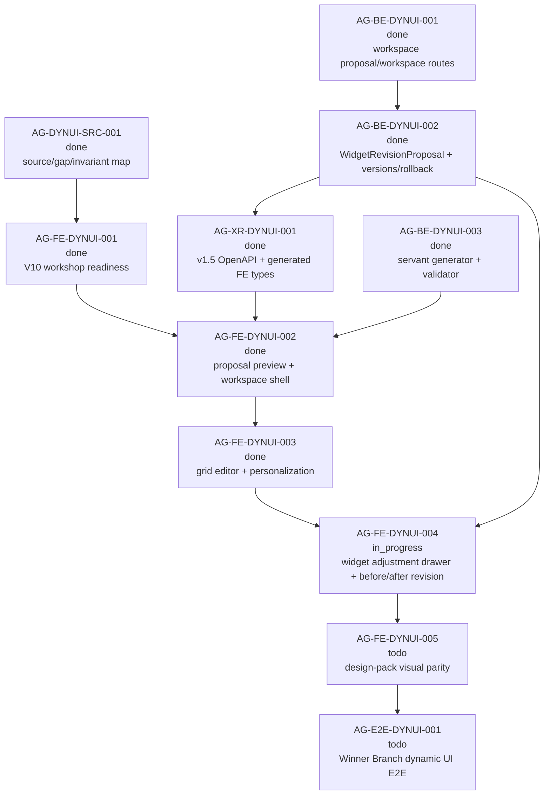

# AG-FE-DYNUI-004 Sidecar Acceptance Packet

| Field | Value |
|---|---|
| Sidecar task | `AG-FE-DYNUI-004-SIDECAR-ACCEPTANCE` |
| Helper parent | `AG-FE-DYNUI-004` |
| Helper kind | `acceptance_packet` |
| Parent title | Widget adjustment drawer and before-after revision flow |
| Parent owner / reviewer | `Codex2` / `Claude2` as of status readback |
| Sidecar owner / reviewer | `Codex` / `Codex2` |
| Date | `2026-06-29` |
| Mutates canonical truth | `false` |
| Status | Ready for `Codex2` review |

This is a support-only packet. It packages acceptance criteria, dependency
routing, blocker triggers, and verification guidance for the parent
`AG-FE-DYNUI-004` frontend implementation. It does not edit canonical truth,
backend schemas, OpenAPI, generated types, BFF routes, widget registry
semantics, frontend runtime code, governance logic, or parent implementation
files.

## 1. Purpose

`AG-FE-DYNUI-004` owns the V11 widget-context servant adjustment flow in the
Trading Room. The parent should wire the existing dynamic workspace shell and
backend `WidgetRevisionProposal` contract into a frontend drawer that lets a
trader request a widget change, review before/after output, and choose an
explicit outcome.

The parent must deliver these outcomes without turning the Trading Room into a
static mock dashboard:

1. Any editable, registry-backed Trading Room widget can open a
   widget-context-aware adjustment drawer from the widget surface or menu.
2. The drawer shows the widget, strategy, view, evidence, data, query, chart,
   sensitivity, warning, data availability, and placement context needed for a
   safe servant revision.
3. The trader enters an instruction; the frontend calls the BFF
   `WidgetRevisionProposal` route family and renders the server-returned
   `beforeSpec` and `proposedSpec`.
4. The UI supports apply, adjust again, keep original and add modified copy,
   and cancel without directly mutating servant-originated widget changes.
5. Accepted revisions refresh the active `TradingRoomWorkspace`, ETag, version
   history, and change-log state through the existing versioned workspace
   contract.

This packet is not parent approval. It gives the parent owner and reviewer a
concrete acceptance surface.

## 2. Sources Used

| Source | Relevant finding |
|---|---|
| `AI_COLLABORATION_GUIDE.md` | L0 state coordinates task work; support packets cannot override canonical architecture or policy truth. |
| `.orchestrator/task-briefs/ag_fe_dynui_004_sidecar_acceptance.md` | Sidecar scope is acceptance packet and dependency map only; canonical/runtime changes are out of scope. |
| `.orchestrator/skills/worker-anchor-commit.md` | Task-owned support/docs changes should be made durable through narrow commits. |
| `.orchestrator/skills/task-closeout-finalization.md` | Final `done` is owner closeout after review approval and merged task PR, not a simple status flip. |
| `AI_NAME=Codex ./scripts/ai-status.sh show AG-FE-DYNUI-004-SIDECAR-ACCEPTANCE` | Sidecar is active `in_progress`, owner `Codex`, reviewer `Codex2`, helper parent `AG-FE-DYNUI-004`, artifact path is this packet, and `mutates_canonical` is false. |
| `AI_NAME=Codex ./scripts/ai-status.sh show AG-FE-DYNUI-004` | Parent is active `in_progress`, owner `Codex2`, reviewer `Claude2`; scope is widget adjustment drawer and before/after revision flow. |
| `AI_NAME=Codex ./scripts/ai-status.sh show AG-FE-DYNUI-001`, `AG-FE-DYNUI-002`, `AG-FE-DYNUI-003` | Strategy Workshop runtime, proposal preview/workspace shell, and grid editor/personalization are archived `done`. |
| `AI_NAME=Codex ./scripts/ai-status.sh show AG-BE-DYNUI-001`, `AG-BE-DYNUI-002`, `AG-BE-DYNUI-003`, `AG-XR-DYNUI-001` | Workspace proposals, widget revision/version/rollback backend, servant generator, and v1.5 generated type drift closure are archived `done`. |
| `AI_NAME=Codex ./scripts/ai-status.sh show AG-FE-DYNUI-005`, `AG-E2E-DYNUI-001` | Visual parity and full Winner Branch E2E proof remain downstream and must not be absorbed by this parent. |
| `docs/04/agora_design_pack_dynui_2026-06-28/README.md` | Dynamic UI invariants require widget-context adjustment, `WidgetRevisionProposal`, before/after preview, apply/adjust/keep/cancel, and workspace versions. |
| `docs/04/agora_design_pack_dynui_2026-06-28/source-map-and-gap-map.md` | Routes V11 widget-context adjustment drawer and backend-backed before/after revision proposal flow to `AG-FE-DYNUI-004`. |
| `support/sidecars/AG-BE-DYNUI-002/AG-BE-DYNUI-002-SIDECAR-ACCEPTANCE.md` | Backend revision proposal/version/rollback acceptance boundary. |
| `support/sidecars/AG-FE-DYNUI-003/AG-FE-DYNUI-003-SIDECAR-ACCEPTANCE-FOLLOWUP-2.md` and `support/evidence/AG-FE-DYNUI-003/owner-closeout.md` | Upstream grid editor delivered workspace tabs, edit mode, save/discard, version history, rollback, and preserved widget revision drawer as downstream scope. |
| `services/control-plane/specs/agora/trading_room_workspace.schema.json` | Defines `TradingRoomWorkspace`, `TradingRoomWidgetSpec`, `WidgetRevisionProposal`, and `TradingRoomDashboardVersion`. |
| `services/control-plane/bff/agora/trading_room/router.py` and `test_trading_room.py` | Backend route family exists for create revision proposal, accept apply/keep-copy, list versions, rollback, ETag/idempotency, stale guards, cross-user isolation, and no direct servant widget patch. |
| `/home/lupin/code/execute-plans/src/lib/bff-v1/agora/tradingRoom.ts` | Active frontend BFF client has v1.5 workspace proposal, workspace, layout, versions, and rollback helpers; parent likely needs revision proposal create/accept helpers added here or in an equivalent BFF client module. |
| `/home/lupin/code/execute-plans/src/agora/trading-room/WorkspaceGridEditor.tsx` | Active workspace editor has widget menu, add/duplicate/remove/change-chart, save/discard, versions, and rollback; the servant modification menu action is still disabled and is the parent integration point. |
| `/home/lupin/code/execute-plans/src/agora/widgets/WidgetRevisionDrawer.tsx` | Existing drawer is a local `WidgetSpecV2` callback component; parent should adapt or replace it for `TradingRoomWidgetSpec` plus backend `WidgetRevisionProposal`. |
| `git -C /home/lupin/code/execute-plans status -sb` | Active frontend checkout is on parent branch `task/AG-FE-DYNUI-004` with parent-owned untracked files; this sidecar did not modify or stage that checkout. |

`current-work.md` and the full `ai-activity-log.jsonl` were not scanned.

## 3. Current Composition Snapshot

| Surface | Current state | Consequence for `AG-FE-DYNUI-004` |
|---|---|---|
| Dynamic source map | `AG-DYNUI-SRC-001` source/gap map is published. | Parent must cite the design pack and keep the non-static dynamic UI invariants. |
| Strategy Workshop | `AG-FE-DYNUI-001` is archived `done`. | Parent starts after readiness and join flow, not from a standalone drawer demo. |
| Proposal/workspace shell | `AG-FE-DYNUI-002` is archived `done`; execute-plans PR `#81` merged to `main`. | Parent should compose on the accepted V11 proposal preview and workspace shell. |
| Grid editor | `AG-FE-DYNUI-003` is archived `done`; execute-plans PR `#82` merged to `dev`. | Parent should open the revision drawer from the delivered workspace editor rather than replacing grid editing. |
| Backend revision contract | `AG-BE-DYNUI-002` is archived `done`; backend tests cover create/apply/keep-copy/version/rollback. | Parent should reuse the backend route family, not invent local-only proposals. |
| Generated types | `AG-XR-DYNUI-001` is archived `done`. | Parent should use generated `TradingRoomWorkspace`, `TradingRoomWidgetSpec`, `WidgetRevisionProposal`, and version types or open a drift blocker. |
| Existing drawer | `WidgetRevisionDrawer.tsx` is still a `WidgetSpecV2` local callback surface. | Parent acceptance requires a `TradingRoomWidgetSpec`/BFF-backed revision flow, not just reusing this component unchanged. |
| Active FE branch | `/home/lupin/code/execute-plans` is on `task/AG-FE-DYNUI-004` and has parent-owned local files. | This sidecar leaves parent implementation files untouched and provides acceptance support only. |
| Downstream scope | `AG-FE-DYNUI-005` and `AG-E2E-DYNUI-001` are active future tasks. | Parent must not claim final visual parity or full E2E completion. |

## 4. Parent Acceptance Checklist

| # | Criterion | Acceptance rule |
|---|---|---|
| 1 | Design source is cited | Parent closeout cites the dynamic UI README/source map, V11 widget revision flow, relevant screenshots/prototype drawer states, and upstream FE/BE packets. If design material is unreadable or conflicts with committed contracts, parent opens a blocker. |
| 2 | Dynamic workspace source is preserved | The drawer is launched from an accepted `TradingRoomWorkspace` rendered by the V11 workspace shell. Parent must not reintroduce `DashboardRecipeV2` as the V11 source of truth or create a static widget demo. |
| 3 | Widget entrypoint exists | Each visible, editable, registry-backed widget exposes a working adjustment entry from click, menu, or the `request_widget_revision` interaction. The existing disabled servant-modify menu action cannot remain disabled for accepted widgets. |
| 4 | Unsupported widgets fail honestly | Hidden widgets, non-registry widgets, unsupported interactions, invalid widget specs, or missing workspace ETag show a typed unavailable/error state. Parent must not fabricate a successful proposal. |
| 5 | Drawer context is complete | Drawer shows or makes inspectable: strategy id/version, workspace id/version, view id/title, widget id/title/type/purpose/whyIncluded, data source, query filters/window/sort/limit, chart kind/encodings/transforms, interactions, sensitivity, placement, warnings, data availability, and evidence/context refs when present. |
| 6 | Instruction input is controlled | Empty instructions cannot submit. Loading, retry, validation failure, stale workspace, forbidden, missing widget, and unavailable backend states are visible without losing the current workspace unexpectedly. |
| 7 | BFF boundary stays strict | Page/components call a `src/lib/bff-v1/agora/*` helper for revision create/accept. No page-level direct `fetch()`, Management route, RuntimeBinding route, broker route, arbitrary URL, or non-BFF side channel is introduced. |
| 8 | Revision proposal is server-backed | Submit calls `POST /bff/agora/trading-room/workspaces/{workspace_id}/widgets/{widget_id}/revision-proposals` or an equivalent published route and renders the returned `WidgetRevisionProposal`. Locally generating `proposedSpec` as proof fails acceptance. |
| 9 | Idempotency is present | Revision create and accept use repo-standard idempotency keys. Accept/apply and keep-copy also pass the current workspace `If-Match` ETag. |
| 10 | Before snapshot is durable | Before preview renders the backend proposal `beforeSpec`, not a mutable local widget object that can drift after proposal creation. |
| 11 | After snapshot is durable | After preview renders the backend proposal `proposedSpec`, preserving rationale, warnings, data availability, and validation result. |
| 12 | Before/after preview is meaningful | The UI shows side-by-side widget previews and a concise field diff for title/type, data source, query/filter/window, chart spec, interactions, sensitivity, and placement when changed. |
| 13 | Validation is contract-aligned | The proposed widget is validated by backend/schema/registry rules. Client validation may supplement but cannot override backend rejection. |
| 14 | Apply action is wired | Apply calls `POST /bff/agora/trading-room/widget-revision-proposals/{proposal_id}/accept` with action `apply`, then refreshes the workspace, ETag, dashboard version, version history, and change log from the response or follow-up GET. |
| 15 | Keep original plus copy is wired | Keep-copy calls the same accept route with `keep_original_add_modified_copy` or the published equivalent, shows the copied widget id when available, preserves the original widget, and refreshes workspace/version state. |
| 16 | Cancel is non-mutating | Cancel closes or resets the drawer without changing active workspace state. If parent claims durable rejection/supersession, it must use a published backend route or open a backend handoff instead of faking status locally. |
| 17 | Adjust again is deterministic | A second instruction creates a new preview proposal or explicitly supersedes the previous preview through a supported route. The UI never applies a stale previous proposal accidentally. |
| 18 | Stale proposal protection is visible | `412` stale workspace ETag and `widget_revision_before_spec_mismatch` errors keep the workspace unchanged, clear or refresh stale proposal state, and instruct the trader to refresh/regenerate. |
| 19 | Cross-scope failures are fail-closed | `403`, `404`, and cross-user/cross-workspace errors do not leak unrelated workspace or widget details and do not leave apply buttons enabled. |
| 20 | Workspace versioning is visible | After apply/keep-copy, the version history/change log shows the new dashboard version, source revision proposal id, affected views/widgets, and rollback availability where provided. |
| 21 | Downstream rollback remains intact | Existing workspace rollback behavior remains functional after a revision accept. Parent must not weaken `AG-FE-DYNUI-003` version/rollback controls. |
| 22 | Workspace editor behavior remains intact | View tabs, edit mode, drag/resize, remove/restore, add widget, duplicate, change chart, save/discard, and personalization event display continue to work after adding the drawer. |
| 23 | No arbitrary frontend code path | No `eval`, `new Function`, `dangerouslySetInnerHTML`, iframe, external script, raw HTML, generated React execution, or arbitrary data-source URL is added. |
| 24 | No order/capital/runtime authority leaks | Drawer, BFF helpers, and tests do not expose direct order routing, capital binding, broker controls, RuntimeBinding, or Management-plane wording as operator controls. |
| 25 | Visual parity is scoped | Drawer layout and copy should move toward the design pack where practical, but final dark AGORA visual parity belongs to `AG-FE-DYNUI-005`. Parent acceptance is blocked only if UX is unusable or contradicts the required flow. |
| 26 | Error copy avoids backend-internal leakage | User-facing errors can expose useful status/code context for recovery, but must not surface internal stack traces, raw provider errors, or broker/runtime implementation terms. |
| 27 | Tests cover BFF client helpers | Frontend tests cover revision create, apply, keep-copy, stale ETag, validation errors, forbidden/missing proposal, and malformed envelope handling in the BFF helper layer. |
| 28 | Tests cover drawer integration | UI tests cover opening from a widget/menu, full context display, submit loading/error, before/after diff, disabled invalid actions, apply refresh, keep-copy refresh, cancel no-op, adjust again, and stale proposal recovery. |
| 29 | Tests cover no-regression editor behavior | Existing Trading Room workspace tests still cover grid edit/save/discard, remove/restore, duplicate, change chart, add widget, version listing, rollback, and proposal preview/accept shell. |
| 30 | Review evidence is attached | Parent closeout includes exact commands, local outputs or summaries, PR/check links, and screenshot or Playwright evidence of the drawer opened from a real generated workspace widget. |

## 5. Dependency Map



### Dependency Notes

| Task / surface | Current state | Relevance |
|---|---|---|
| `AG-FE-DYNUI-001` | Archived `done`. | Provides readiness-driven Strategy Workshop path into Trading Room. |
| `AG-FE-DYNUI-002` | Archived `done`; execute-plans PR `#81` merged to `main`. | Provides V11 proposal preview and accepted workspace shell. |
| `AG-FE-DYNUI-003` | Archived `done`; execute-plans PR `#82` merged to `dev`. | Provides workspace grid editor, menu, save/discard, versions, and rollback. |
| `AG-BE-DYNUI-002` | Archived `done`. | Provides backend revision proposal, accept apply/keep-copy, version, rollback, and no direct servant mutation guards. |
| `AG-BE-DYNUI-003` | Archived `done`. | Provides generator and validator context; parent should not rebuild generator behavior. |
| `AG-XR-DYNUI-001` | Archived `done`. | Provides v1.5 generated type/drift closure; parent should not hand-roll contract shapes. |
| `WidgetRevisionDrawer.tsx` | Existing drawer component is local `WidgetSpecV2` based. | Reuse only if adapted to `TradingRoomWidgetSpec` and backend `WidgetRevisionProposal`. |
| `WorkspaceGridEditor.tsx` | Has disabled servant-modify entry and existing editor controls. | Parent integration point for opening the drawer and refreshing workspace/version state. |
| `AG-FE-DYNUI-005` | Active future task. | Final design-pack visual parity remains downstream. |
| `AG-E2E-DYNUI-001` | Active future task. | Full end-to-end proof remains downstream. |

## 6. Blocker Triggers For Parent Owner

Parent owner should stop and open a blocker or reviewer handoff if any of these
are true:

1. The design pack source, frozen source/gap map, or upstream packets cannot be
   read.
2. The active frontend branch cannot see generated `WidgetRevisionProposal` or
   `TradingRoomWidgetSpec` types without inventing local type shapes.
3. No BFF client helper or route can create a revision proposal for
   `workspaceId` plus `widgetId`.
4. Accepting a proposal cannot be guarded by current workspace ETag and
   idempotency key.
5. The frontend cannot distinguish apply from keep-original-and-add-copy using
   the published route contract.
6. The backend lacks any durable rejection/cancel route but the parent wants to
   claim durable rejected status.
7. The proposed widget cannot be rendered through the controlled
   `TradingRoomWidgetSpec`/registry renderer.
8. The implementation requires direct page-level `fetch()`, arbitrary URL/data
   source access, raw HTML/JS/React execution, or unsafe renderer injection.
9. The work would weaken existing grid editor save/discard, version history,
   rollback, widget validation, or cross-user isolation behavior.
10. The task needs final visual parity or full E2E to pass. Those are
    downstream scopes.

## 7. Suggested Parent Verification Plan

Run from the active execute-plans checkout after parent implementation:

```bash
npm test -- --run \
  src/lib/bff-v1/agora/tradingRoom.test.ts \
  src/agora/pages/trading-room/TradingRoomPage.test.tsx \
  src/agora/widgets/WidgetRevisionDrawer.test.tsx \
  src/agora/widgets/registry.test.ts
```

```bash
npx eslint \
  src/lib/bff-v1/agora/tradingRoom.ts \
  src/agora/pages/trading-room/TradingRoomPage.tsx \
  src/agora/trading-room/WorkspaceGridEditor.tsx \
  src/agora/widgets/WidgetRevisionDrawer.tsx
```

```bash
PANTHEON_CONTRACT_ROOT=/tmp/pantheon-worker-worktrees/pantheon/ag-fe-dynui-004-sidecar-acceptance \
  npm run contract:drift -- --summary
```

```bash
npm run build
git diff --check
```

Recommended focused checks:

- BFF helper tests for create revision proposal, accept apply, keep-copy,
  stale ETag, forbidden/missing proposal, and malformed envelope.
- UI tests for opening the drawer from the workspace widget menu, context
  display, before/after diff, apply, keep-copy, cancel, adjust again, and stale
  proposal recovery.
- Regression checks that existing proposal preview, workspace shell, grid
  edit/save/discard, remove/restore, add widget, duplicate, change chart,
  version history, and rollback still pass.
- Safety grep:

```bash
rg -n "RuntimeBinding|Management|broker|capital|place_order|enable_live|dangerouslySetInnerHTML|eval\\(|new Function|iframe|rawHtml|external script" \
  src/agora src/lib/bff-v1/agora
```

- Screenshot or Playwright evidence showing a real generated Trading Room
  widget opening the adjustment drawer, a server-backed before/after proposal,
  and both apply and keep-copy outcomes.

## 8. Sidecar Validation Run

Commands run or inspected from this sidecar worktree unless noted:

```bash
git status -sb
git branch --show-current
git remote -v
AI_NAME=Codex ./scripts/ai-status.sh show AG-FE-DYNUI-004-SIDECAR-ACCEPTANCE
AI_NAME=Codex ./scripts/ai-status.sh show AG-FE-DYNUI-004
AI_NAME=Codex ./scripts/ai-status.sh show AG-FE-DYNUI-001
AI_NAME=Codex ./scripts/ai-status.sh show AG-FE-DYNUI-002
AI_NAME=Codex ./scripts/ai-status.sh show AG-FE-DYNUI-003
AI_NAME=Codex ./scripts/ai-status.sh show AG-BE-DYNUI-001
AI_NAME=Codex ./scripts/ai-status.sh show AG-BE-DYNUI-002
AI_NAME=Codex ./scripts/ai-status.sh show AG-BE-DYNUI-003
AI_NAME=Codex ./scripts/ai-status.sh show AG-XR-DYNUI-001
AI_NAME=Codex ./scripts/ai-status.sh show AG-FE-DYNUI-005
AI_NAME=Codex ./scripts/ai-status.sh show AG-E2E-DYNUI-001
git -C /home/lupin/code/execute-plans status -sb
git -C /home/lupin/code/execute-plans branch --show-current
git -C /home/lupin/code/execute-plans rev-parse HEAD origin/dev origin/main
git diff --check -- .orchestrator/task-briefs/ag_fe_dynui_004_sidecar_acceptance.md support/sidecars/AG-FE-DYNUI-004/AG-FE-DYNUI-004-SIDECAR-ACCEPTANCE.md
git diff --check --no-index -- /dev/null support/sidecars/AG-FE-DYNUI-004/AG-FE-DYNUI-004-SIDECAR-ACCEPTANCE.md
git diff --check --no-index -- /dev/null .orchestrator/task-briefs/ag_fe_dynui_004_sidecar_acceptance.md
```

Observed results:

- Pantheon sidecar branch is
  `task/AG-FE-DYNUI-004-SIDECAR-ACCEPTANCE`.
- Sidecar is `in_progress`, owner `Codex`, reviewer `Codex2`, helper parent
  `AG-FE-DYNUI-004`, and support-only.
- Parent `AG-FE-DYNUI-004` is `in_progress`, owner `Codex2`, reviewer
  `Claude2`.
- Upstream `AG-FE-DYNUI-001`, `AG-FE-DYNUI-002`, `AG-FE-DYNUI-003`,
  `AG-BE-DYNUI-001`, `AG-BE-DYNUI-002`, `AG-BE-DYNUI-003`, and
  `AG-XR-DYNUI-001` are archived `done`.
- Downstream `AG-FE-DYNUI-005` and `AG-E2E-DYNUI-001` remain future tasks.
- Active execute-plans checkout is on parent branch `task/AG-FE-DYNUI-004`;
  local dirty files there were not modified by this sidecar.
- Whitespace checks emitted no errors for the new support packet and generated
  task brief. The no-index checks returned the expected new-file diff status
  with no diagnostic output.
- No parent runtime tests were run because this sidecar changes support
  artifacts only.

## 9. Support-Only Boundary Confirmation

- No L1/L2 canonical policy or architecture document was edited by this
  sidecar.
- No backend schema, OpenAPI, BFF route, runtime, registry, governance, or
  generated type file was changed by this sidecar.
- No execute-plans frontend runtime file was changed by this sidecar.
- The intended support deliverable is:
  `support/sidecars/AG-FE-DYNUI-004/AG-FE-DYNUI-004-SIDECAR-ACCEPTANCE.md`.
- The generated task brief is task-scoped state:
  `.orchestrator/task-briefs/ag_fe_dynui_004_sidecar_acceptance.md`.
- This sidecar does not approve the parent implementation.

## 10. Reviewer Handoff Notes

**Reviewer:** `Codex2`

### What to verify

1. The packet stays support-only and does not redefine canonical contract
   truth.
2. The checklist correctly routes parent work to the existing V11
   `TradingRoomWorkspace` and `WidgetRevisionProposal` contract family.
3. The packet separates parent drawer integration from backend contract,
   generator, generated types, visual parity, and full E2E scopes.
4. The blocker triggers correctly force a stop instead of field/route/widget
   invention.
5. The suggested verification plan is concrete enough for parent owner and
   reviewer use.

### Suggested reviewer command

```bash
AI_NAME=Codex2 REVIEW_FILE=support/sidecars/AG-FE-DYNUI-004/AG-FE-DYNUI-004-SIDECAR-ACCEPTANCE.md \
  ./scripts/ai-status.sh approve AG-FE-DYNUI-004-SIDECAR-ACCEPTANCE \
  "Acceptance packet approved; support artifact gives AG-FE-DYNUI-004 concrete widget adjustment drawer criteria, dependency routing, blocker triggers, and verification guidance without changing canonical truth or runtime."
```

If changes are needed:

```bash
AI_NAME=Codex2 ./scripts/ai-status.sh reopen AG-FE-DYNUI-004-SIDECAR-ACCEPTANCE "Describe the exact packet corrections needed."
```

Prepared by `Codex` for the
`AG-FE-DYNUI-004-SIDECAR-ACCEPTANCE` support slice.
