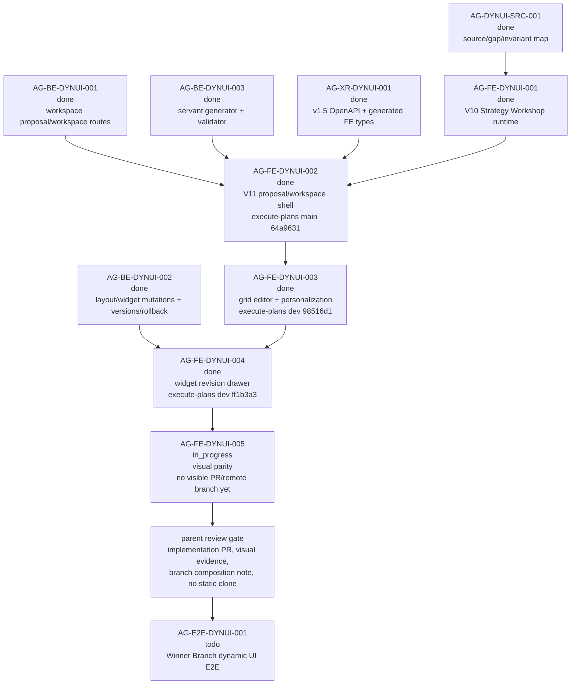

# AG-FE-DYNUI-005 Sidecar Acceptance Follow-up 2

| Field | Value |
|---|---|
| Sidecar task | `AG-FE-DYNUI-005-SIDECAR-ACCEPTANCE-FOLLOWUP-2` |
| Helper parent | `AG-FE-DYNUI-005` |
| Helper kind | `acceptance_packet` |
| Parent title | Design-pack visual parity on top of dynamic runtime |
| Parent owner / reviewer | `Claude` / `Codex` as of status readback |
| Sidecar owner / reviewer | `Codex2` / `Claude` |
| Date | `2026-06-29` |
| Mutates canonical truth | `false` |
| Status | `Claude` review approved; parent remains `in_progress` |

This is a support-only follow-up packet. It does not replace the archived
`AG-FE-DYNUI-005-SIDECAR-ACCEPTANCE` packet, approve the parent implementation,
or change canonical/runtime/contract truth. Its purpose is to refresh the
parent evidence gate after the main acceptance packet closed and while
`AG-FE-DYNUI-005` has started but has no GitHub-visible implementation branch
or PR yet.

Closeout note, 2026-06-29: `Claude` approved this sidecar as support-only
follow-up evidence. The approved packet continues to defer to the archived main
acceptance packet, records that upstream `AG-FE-DYNUI-001` through `004` are
done, keeps downstream `AG-E2E-DYNUI-001` as `todo`, and requires parent owner
implementation evidence before `AG-FE-DYNUI-005` review. This note does not
approve the parent implementation or widen sidecar scope.

If this packet conflicts with L1/L2 canonical docs or the archived main
acceptance packet, those sources win. Reopen this follow-up instead of widening
parent scope.

## 1. Relationship To Existing Packet

| Packet / task | Current state | How this follow-up uses it |
|---|---|---|
| `AG-FE-DYNUI-005-SIDECAR-ACCEPTANCE` | Archived `done`; PR `#2620` merged into Pantheon `dev` at `cf0e2b4aa25ff6c9332811e9eb7d8e26c73b13d9`. | Remains the main 30-point acceptance checklist, dependency map, blocker trigger set, and verification guide for visual parity. |
| `AG-FE-DYNUI-005` | Active `in_progress`; owner `Claude`, reviewer `Codex`; no artifacts recorded in active task state. | Parent can use the archived packet plus this follow-up as support input, but still needs implementation evidence, review, merge, and closeout. |
| `AG-FE-DYNUI-005-SIDECAR-ACCEPTANCE-FOLLOWUP-2` | Active `in_progress` while this file is prepared. | Adds a current readiness/evidence gate and handoff packet only; it does not change runtime code or parent task status. |

## 2. Sources Read

| Source | Relevant finding |
|---|---|
| `AI_COLLABORATION_GUIDE.md` | L0 state coordinates task work; support packets do not override L1/L2 architecture or policy truth. |
| `.orchestrator/task-briefs/ag_fe_dynui_005_sidecar_acceptance_followup_2.md` | Scope is acceptance checklist, dependency map, and support packet only; canonical/runtime changes are out of scope. |
| `.orchestrator/skills/worker-anchor-commit.md` | Task-owned support/docs changes should be made durable with narrow commits and explicit scope. |
| `.orchestrator/skills/task-closeout-finalization.md` | Final `done` is owner closeout after review approval and merged task PR, not a simple status flip. |
| `AI_NAME=Codex2 ./scripts/ai-status.sh show AG-FE-DYNUI-005-SIDECAR-ACCEPTANCE-FOLLOWUP-2` | Follow-up sidecar is active `in_progress`, owner `Codex2`, reviewer `Claude`, helper parent `AG-FE-DYNUI-005`, artifact path is this file, and `mutates_canonical` is `false`. |
| `AI_NAME=Codex2 ./scripts/ai-status.sh show AG-FE-DYNUI-005` | Parent is active `in_progress`, owner `Claude`, reviewer `Codex`, depends on `AG-FE-DYNUI-001` through `004`, and owns visual parity only. |
| `AI_NAME=Codex2 ./scripts/ai-status.sh show AG-FE-DYNUI-005-SIDECAR-ACCEPTANCE` | Main sidecar is archived `done`; reviewer approved its visual-parity criteria, dependency map, dynamic runtime requirements, E2E routing, and support-only boundary. |
| `support/sidecars/AG-FE-DYNUI-005/AG-FE-DYNUI-005-SIDECAR-ACCEPTANCE.md` | The main packet already defines the detailed parent checklist; this follow-up should not duplicate or supersede it. |
| `AI_NAME=Codex2 ./scripts/ai-status.sh show AG-FE-DYNUI-001` | V10 Strategy Workshop runtime is archived `done`; owner closeout recorded focused Strategy Workshop tests and Agora build. |
| `AI_NAME=Codex2 ./scripts/ai-status.sh show AG-FE-DYNUI-002` | V11 proposal preview/workspace shell is archived `done`; execute-plans PR `#81` merged into `main` at `64a963119e85f2e91efbedbd83c4fbd97c7c2e20`. |
| `AI_NAME=Codex2 ./scripts/ai-status.sh show AG-FE-DYNUI-003` | Grid editor/personalization is archived `done`; execute-plans PR `#82` merged into `dev` at `98516d129e377842f1d5866af61e326134751439`. |
| `AI_NAME=Codex2 ./scripts/ai-status.sh show AG-FE-DYNUI-004` | Widget adjustment drawer is archived `done`; execute-plans PR `#84` merged into `dev` at `ff1b3a3bb744f40939a9c025bcef2b58ba796fb3`. |
| `AI_NAME=Codex2 ./scripts/ai-status.sh show AG-BE-DYNUI-001`, `AG-BE-DYNUI-002`, `AG-BE-DYNUI-003`, `AG-XR-DYNUI-001` | Backend workspace routes, layout/widget mutations, versions/rollback, servant generator, validator, v1.5 OpenAPI, and generated types are archived `done`. |
| `AI_NAME=Codex2 ./scripts/ai-status.sh show AG-E2E-DYNUI-001` | Full Winner Branch dynamic UI E2E proof remains active `todo` and depends on `AG-FE-DYNUI-005`. |
| `gh pr list --repo ajoe734/execute-plans --search "AG-FE-DYNUI-005" --state all ...` and `--head task/AG-FE-DYNUI-005` | No GitHub-visible execute-plans PR exists for `AG-FE-DYNUI-005` at packet preparation time. |
| `git ls-remote --heads https://github.com/ajoe734/execute-plans.git 'task/AG-FE-DYNUI-005*' main dev` | No remote task branch matching `task/AG-FE-DYNUI-005*`; `main` is `64a963119e85f2e91efbedbd83c4fbd97c7c2e20`, `dev` is `ff1b3a3bb744f40939a9c025bcef2b58ba796fb3`. |
| `gh pr view 82` and `gh pr view 84` for `ajoe734/execute-plans` | PR `#82` and PR `#84` are merged to `dev` and their `integration-gate` checks completed `SUCCESS`. |
| `git -C /home/lupin/code/execute-plans status -sb` | Local frontend checkout is on stale `task/AG-FE-DYNUI-004...origin/task/AG-FE-DYNUI-004 [gone]`; it must not be used as `AG-FE-DYNUI-005` implementation evidence. |
| `git -C /home/lupin/code/execute-plans merge-base --is-ancestor origin/main origin/dev` and reverse | Both returned non-zero after fetch; execute-plans `main` and `dev` still need explicit composition routing before parent closeout claims delivery across branches. |

`current-work.md` and the full `ai-activity-log.jsonl` were not scanned.

## 3. Current Readiness Snapshot

| Surface | Current state | Consequence for `AG-FE-DYNUI-005` review |
|---|---|---|
| Main acceptance packet | Archived `done` and merged through Pantheon PR `#2620`. | Use it as the primary checklist. This follow-up is only a current evidence delta. |
| Parent task | Active `in_progress`; owner `Claude`, reviewer `Codex`; no parent artifacts recorded yet. | Parent implementation still needs PR/commit/check/screenshot evidence before review. |
| execute-plans 005 branch/PR | No PR and no remote `task/AG-FE-DYNUI-005*` branch are visible. | Reviewer should not accept parent visual parity until a concrete frontend branch or PR exists. |
| Local execute-plans checkout | Clean but parked on deleted `task/AG-FE-DYNUI-004`. | Local checkout is not parent evidence; parent owner should create or switch to the correct task branch before implementation review. |
| Upstream runtime surfaces | `AG-FE-DYNUI-001` through `004` are archived `done`. | Parent can now work on final visual parity over dynamic Strategy Workshop, proposal/workspace shell, grid editor, and widget revision drawer behavior. |
| Backend/XR dependencies | `AG-BE-DYNUI-001/002/003` and `AG-XR-DYNUI-001` are archived `done`. | Parent should use the existing BFF/contracts/generated types and open blockers for drift instead of inventing fields, routes, or widget shapes. |
| execute-plans delivery base | `main` remains at PR `#81`; `dev` is PR `#84`; neither local ancestor check proved one contains the other. | Parent owner/reviewer should record the intended delivery target and composition path before claiming visual parity is integrated for downstream E2E. |
| Downstream E2E | `AG-E2E-DYNUI-001` is active `todo`, depends on `AG-FE-DYNUI-005`. | Parent should provide browser visual evidence, but full Winner Branch E2E acceptance remains downstream. |

## 4. Parent Evidence Gate Delta

The archived main sidecar packet remains the full acceptance checklist. This
follow-up adds the current gates that should be checked before parent review:

1. Treat the main acceptance packet as approved support input, not parent
   implementation approval.
2. Require GitHub-visible frontend implementation evidence for
   `AG-FE-DYNUI-005`: branch, PR, head commit, changed files, checks, and
   reviewable screenshots. At packet preparation time this evidence is absent.
3. Base visual parity on completed dynamic runtime slices:
   `AG-FE-DYNUI-001` Strategy Workshop, `AG-FE-DYNUI-002` proposal/workspace
   shell, `AG-FE-DYNUI-003` grid editor/personalization, and
   `AG-FE-DYNUI-004` widget revision drawer.
4. Preserve the branch composition note. execute-plans `main` and `dev` are
   not currently ancestor-related after fetch; parent closeout should state
   whether visual parity targets `dev`, `main`, or a branch that explicitly
   composes both.
5. Do not use the local execute-plans checkout as delivery proof until it is
   moved from the deleted `AG-FE-DYNUI-004` branch to the correct 005 task
   branch or an approved clean worktree.
6. Keep all dynamic runtime behavior from the upstream tasks intact while
   restyling. Visual parity must not replace the Strategy Workshop or Trading
   Room with static cards, screenshots, cloned prototype HTML, or local mock
   widget state.
7. Keep safety and validator boundaries intact: no arbitrary React/JS/HTML
   execution, no unvalidated widget/chart/data-source path, no broker/capital
   controls, and no Management/RuntimeBinding wording in Agora user-facing UI.
8. Attach visual evidence for the states named by the main packet: V10 mid
   Strategy Workshop, V11 generation/proposal preview, active workspace edit
   mode, widget menu, layout adjustment drawer, widget revision drawer, change
   log, and version/rollback modal.
9. Keep `AG-E2E-DYNUI-001` as the downstream full E2E proof. Parent 005 can
   provide visual smoke/screenshots, but should not claim complete Winner
   Branch journey proof.

If any gate requires changing canonical docs, backend contracts, generated
types, registry semantics, or downstream runtime/E2E scope, parent owner should
open a blocker instead of expanding `AG-FE-DYNUI-005`.

## 5. Dependency Map



### Dependency Notes

| Task / surface | Current state | Relevance |
|---|---|---|
| `AG-FE-DYNUI-001` | Archived `done`; closeout recorded focused Strategy Workshop tests and Agora build. | Parent must restyle the dynamic workshop rather than replacing it. |
| `AG-FE-DYNUI-002` | Archived `done`; execute-plans PR `#81` merged into `main` at `64a963119e85f2e91efbedbd83c4fbd97c7c2e20`. | Parent must preserve proposal generation, preview, and workspace shell behavior. |
| `AG-FE-DYNUI-003` | Archived `done`; execute-plans PR `#82` merged into `dev` at `98516d129e377842f1d5866af61e326134751439`. | Parent must preserve grid edit/save/discard/add/remove/duplicate/change-chart/version behavior. |
| `AG-FE-DYNUI-004` | Archived `done`; execute-plans PR `#84` merged into `dev` at `ff1b3a3bb744f40939a9c025bcef2b58ba796fb3`. | Parent must preserve widget revision drawer, before/after proposal, and apply/keep/cancel/adjust-again behavior. |
| `AG-BE-DYNUI-001/002/003` | Archived `done`. | Backend workspace routes, widget revisions, versions/rollback, servant generator, and validator are available. |
| `AG-XR-DYNUI-001` | Archived `done`. | Generated v1.5 types/contracts are available; drift should be a blocker, not hand-rolled shapes. |
| execute-plans `AG-FE-DYNUI-005` branch/PR | No visible PR or remote branch at packet preparation time. | Parent review must wait for concrete implementation evidence. |
| execute-plans `main` / `dev` | `main` is `64a9631`; `dev` is `ff1b3a3`; ancestor checks did not prove either contains the other. | Parent closeout must record delivery target and composition path. |
| `AG-E2E-DYNUI-001` | Active `todo`; depends on `AG-FE-DYNUI-005`. | Receives visual evidence after parent 005, but owns full E2E acceptance. |

## 6. Blocker Triggers For Parent Owner

Parent owner should stop and open a blocker or reviewer handoff if any of these
are true:

1. No clean `AG-FE-DYNUI-005` frontend branch, PR, or equivalent approved
   implementation surface exists.
2. The parent implementation is attempted from the stale local
   `task/AG-FE-DYNUI-004` checkout instead of a correct 005 worktree/branch.
3. execute-plans branch composition remains ambiguous and parent cannot state
   whether visual parity targets `main`, `dev`, or a branch that composes both.
4. The current frontend base does not contain the completed 001-004 dynamic
   runtime behavior required by the main acceptance packet.
5. Visual parity requires changing backend route semantics, OpenAPI/schema,
   generated types, registry allowlists, validator posture, or L1/L2 canonical
   truth.
6. Restyling would hide, remove, or fake Strategy Workshop event/card state,
   workspace proposal state, grid placement, widget revision proposal state,
   version history, change log, rollback, warnings, stale-write handling, or
   data availability.
7. The task needs arbitrary generated React/JS/HTML execution, raw HTML,
   iframe/script injection, external data-source URLs, or unvalidated widgets.
8. User-facing UI copy exposes Management, RuntimeBinding, broker backend,
   direct order routing, capital binding, governance internals, or ArtifactState.
9. Parent cannot produce repeatable browser/Playwright visual evidence for the
   major states listed in the main packet.
10. Parent needs full Winner Branch dynamic UI E2E proof to pass visual parity.
    That remains `AG-E2E-DYNUI-001`.

## 7. Suggested Parent Verification Plan

Run from the eventual execute-plans `AG-FE-DYNUI-005` implementation branch,
not from the stale local `AG-FE-DYNUI-004` checkout:

```bash
npm test -- --run \
  src/agora/pages/strategy-workshop/StrategyWorkshopPage.test.tsx \
  src/agora/components/StrategyCompletenessRail.test.tsx \
  src/agora/components/WorkshopCardRenderer.test.tsx \
  src/agora/pages/trading-room/TradingRoomPage.test.tsx \
  src/agora/widgets/WidgetRevisionDrawer.test.tsx \
  src/agora/widgets/registry.test.ts \
  src/lib/bff-v1/agora/tradingRoom.test.ts
```

```bash
npx eslint \
  src/agora/pages/strategy-workshop \
  src/agora/pages/trading-room \
  src/agora/trading-room \
  src/agora/widgets \
  src/lib/bff-v1/agora
```

```bash
npm run contract:drift -- --summary
npm run build
git diff --check
```

Recommended evidence:

- PR link, head commit, base branch, changed-file list, and check summary.
- Browser or Playwright screenshots for V10 Strategy Workshop mid-state,
  Trading Room generation/proposal preview, active workspace edit mode, widget
  menu, layout adjustment drawer, widget revision drawer, change log, and
  version/rollback modal.
- Desktop and narrow viewport screenshots showing no incoherent overlap or
  text overflow in bars, tabs, drawers, cards, menus, and modals.
- Safety grep against changed Agora files:

```bash
rg -n "RuntimeBinding|Management|ArtifactState|governance|broker|capital|place_order|enable_live|dangerouslySetInnerHTML|eval\\(|new Function|iframe|rawHtml|external script" \
  src/agora src/lib/bff-v1/agora
```

## 8. Support-Only Boundary Confirmation

- No L1/L2 canonical policy or architecture document was edited by this
  sidecar.
- No backend schema, OpenAPI, BFF route, runtime, registry, governance, or
  generated type file was changed by this sidecar.
- No execute-plans frontend runtime file was changed by this sidecar.
- The intended support deliverable is this packet:
  `support/sidecars/AG-FE-DYNUI-005/AG-FE-DYNUI-005-SIDECAR-ACCEPTANCE-FOLLOWUP-2.md`.
- The generated task brief is task-scoped state:
  `.orchestrator/task-briefs/ag_fe_dynui_005_sidecar_acceptance_followup_2.md`.
- This sidecar does not approve the parent implementation.

## 9. Validation Run

Commands run from this Pantheon sidecar worktree unless noted:

```bash
git status -sb
git branch --show-current
git remote -v
AI_NAME=Codex2 ./scripts/ai-status.sh show AG-FE-DYNUI-005-SIDECAR-ACCEPTANCE-FOLLOWUP-2
AI_NAME=Codex2 ./scripts/ai-status.sh show AG-FE-DYNUI-005
AI_NAME=Codex2 ./scripts/ai-status.sh show AG-FE-DYNUI-005-SIDECAR-ACCEPTANCE
AI_NAME=Codex2 ./scripts/ai-status.sh show AG-FE-DYNUI-001
AI_NAME=Codex2 ./scripts/ai-status.sh show AG-FE-DYNUI-002
AI_NAME=Codex2 ./scripts/ai-status.sh show AG-FE-DYNUI-003
AI_NAME=Codex2 ./scripts/ai-status.sh show AG-FE-DYNUI-004
AI_NAME=Codex2 ./scripts/ai-status.sh show AG-BE-DYNUI-001
AI_NAME=Codex2 ./scripts/ai-status.sh show AG-BE-DYNUI-002
AI_NAME=Codex2 ./scripts/ai-status.sh show AG-BE-DYNUI-003
AI_NAME=Codex2 ./scripts/ai-status.sh show AG-XR-DYNUI-001
AI_NAME=Codex2 ./scripts/ai-status.sh show AG-E2E-DYNUI-001
gh pr list --repo ajoe734/execute-plans --search "AG-FE-DYNUI-005" --state all --json number,state,title,url,headRefName,baseRefName,headRefOid,mergeCommit,mergedAt,updatedAt,statusCheckRollup,isDraft,reviewDecision
gh pr list --repo ajoe734/execute-plans --head task/AG-FE-DYNUI-005 --state all --json number,state,title,url,headRefName,baseRefName,headRefOid,mergeCommit,mergedAt,updatedAt,statusCheckRollup,isDraft,reviewDecision
gh pr list --repo ajoe734/execute-plans --search "DYNUI-005" --state all --json number,state,title,url,headRefName,baseRefName,headRefOid,mergeCommit,mergedAt,updatedAt,statusCheckRollup,isDraft,reviewDecision
gh pr view 82 --repo ajoe734/execute-plans --json number,state,title,url,headRefName,baseRefName,headRefOid,mergeCommit,mergedAt,updatedAt,isDraft,mergeStateStatus,statusCheckRollup,reviewDecision
gh pr view 84 --repo ajoe734/execute-plans --json number,state,title,url,headRefName,baseRefName,headRefOid,mergeCommit,mergedAt,updatedAt,isDraft,mergeStateStatus,statusCheckRollup,reviewDecision
git ls-remote --heads https://github.com/ajoe734/execute-plans.git 'task/AG-FE-DYNUI-005*' main dev
git -C /home/lupin/code/execute-plans fetch origin main dev --quiet
git -C /home/lupin/code/execute-plans status -sb
git -C /home/lupin/code/execute-plans branch --show-current
git -C /home/lupin/code/execute-plans rev-parse origin/main
git -C /home/lupin/code/execute-plans rev-parse origin/dev
git -C /home/lupin/code/execute-plans merge-base --is-ancestor origin/main origin/dev
git -C /home/lupin/code/execute-plans merge-base --is-ancestor origin/dev origin/main
```

Observed results:

- Pantheon sidecar branch is
  `task/AG-FE-DYNUI-005-SIDECAR-ACCEPTANCE-FOLLOWUP-2`.
- The only pre-edit dirty file was the generated task brief for this sidecar.
- Sidecar is active `in_progress`, owner `Codex2`, reviewer `Claude`, helper
  parent `AG-FE-DYNUI-005`, and support-only.
- Parent `AG-FE-DYNUI-005` is active `in_progress`, owner `Claude`, reviewer
  `Codex`.
- Main acceptance sidecar is archived `done` and merged through Pantheon PR
  `#2620`; it remains the primary checklist.
- Upstream `AG-FE-DYNUI-001` through `004`, `AG-BE-DYNUI-001` through `003`,
  and `AG-XR-DYNUI-001` are archived `done`.
- Downstream `AG-E2E-DYNUI-001` remains active `todo`.
- No GitHub-visible execute-plans PR or remote branch was found for
  `AG-FE-DYNUI-005`.
- execute-plans PR `#82` and PR `#84` are merged to `dev`, with successful
  `integration-gate` checks.
- Local execute-plans checkout is clean but on stale
  `task/AG-FE-DYNUI-004...origin/task/AG-FE-DYNUI-004 [gone]`.
- execute-plans `origin/main` is
  `64a963119e85f2e91efbedbd83c4fbd97c7c2e20`; `origin/dev` is
  `ff1b3a3bb744f40939a9c025bcef2b58ba796fb3`; neither ancestor check passed.
- No parent runtime tests were run by this sidecar because it changes support
  artifacts only.

## 10. Reviewer Handoff Recommendation

For this sidecar:

```bash
AI_NAME=Codex2 ./scripts/ai-status.sh handoff AG-FE-DYNUI-005-SIDECAR-ACCEPTANCE-FOLLOWUP-2 Claude \
  "Support-only follow-up packet is ready. It preserves the archived main AG-FE-DYNUI-005 acceptance packet as the primary checklist and adds current readiness gates: upstream 001-004 are done, no visible AG-FE-DYNUI-005 execute-plans PR or remote branch exists yet, local FE checkout is still on deleted AG-FE-DYNUI-004 branch, and parent review must require implementation evidence plus dev/main composition notes without changing canonical truth or runtime."
```

Prepared by `Codex2` for the
`AG-FE-DYNUI-005-SIDECAR-ACCEPTANCE-FOLLOWUP-2` support slice.
