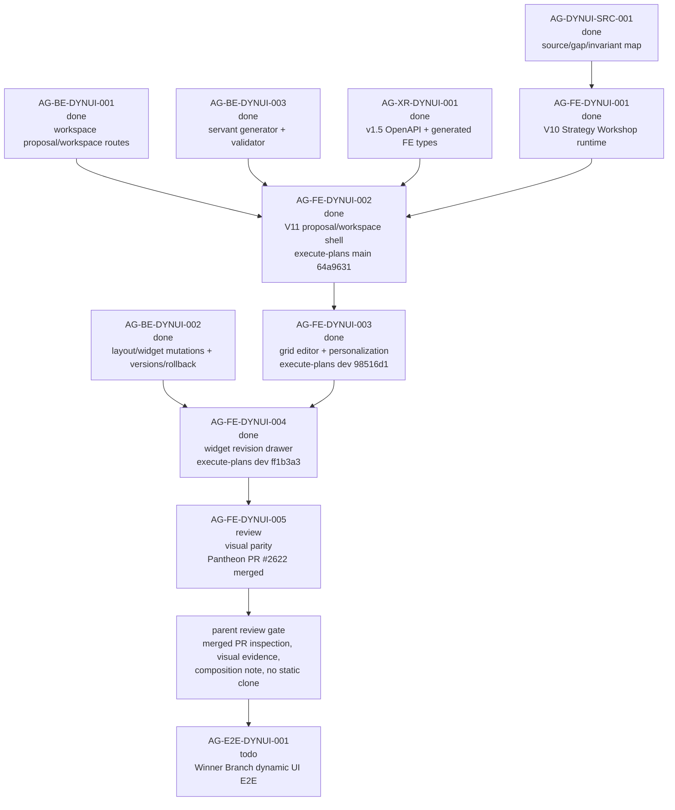

# AG-FE-DYNUI-005 Sidecar Acceptance Follow-up 3

| Field | Value |
|---|---|
| Sidecar task | `AG-FE-DYNUI-005-SIDECAR-ACCEPTANCE-FOLLOWUP-3` |
| Helper parent | `AG-FE-DYNUI-005` |
| Helper kind | `acceptance_packet` |
| Parent title | Design-pack visual parity on top of dynamic runtime |
| Parent owner / reviewer | `Claude` / `Codex` as of status readback |
| Sidecar owner / reviewer | `Codex2` / `Claude` |
| Date | `2026-06-29` |
| Mutates canonical truth | `false` |
| Status | Review approved; owner closeout prepared |

This is a support-only follow-up packet. It does not replace the archived main
`AG-FE-DYNUI-005-SIDECAR-ACCEPTANCE` packet or the archived
`AG-FE-DYNUI-005-SIDECAR-ACCEPTANCE-FOLLOWUP-2` packet. It refreshes the parent
readiness evidence after `AG-FE-DYNUI-005` was re-dispatched, merged through
Pantheon PR `#2622`, and moved to reviewer gate. Claude approved this
support-only packet after Pantheon PR `#2624` merged into `dev`; this closeout
update records that review result without changing the support findings.

This packet does not approve the parent implementation, change parent task
status, edit canonical truth, or modify runtime/contract/frontend code.

## 1. Relationship To Existing Support Packets

| Packet / task | Current state | How follow-up 3 uses it |
|---|---|---|
| `AG-FE-DYNUI-005-SIDECAR-ACCEPTANCE` | Archived `done`; PR `#2620` merged into Pantheon `dev` at `cf0e2b4aa25ff6c9332811e9eb7d8e26c73b13d9`. | Remains the primary visual-parity acceptance checklist, dependency map, blocker trigger set, and verification guide. |
| `AG-FE-DYNUI-005-SIDECAR-ACCEPTANCE-FOLLOWUP-2` | Archived `done`; PR `#2623` merged into Pantheon `dev` at `6b7652751bef3293dedf96d28169f4b97cdc1f02`. | Remains the previous readiness delta: upstream 001-004 done, no visible 005 frontend PR/branch then, local FE checkout stale, and main/dev composition ambiguous. |
| `AG-FE-DYNUI-005` | Active `review`; owner `Claude`, reviewer `Codex`; Pantheon PR `#2622` merged into `dev` at `f127bdbedfb4823470ab2453f15485cea001b5a8`; artifacts remain empty in task state. | Parent now needs reviewer evaluation, any requested fixes, `review_approved`, and owner closeout before downstream E2E can proceed. |
| `AG-FE-DYNUI-005-SIDECAR-ACCEPTANCE-FOLLOWUP-3` | `review_approved`; Pantheon PR `#2624` merged into `dev` at `5e4964877a2bdcc2d06a40b14f53a753a81a5878`. | Adds a current evidence refresh only; owner closeout records approval and then archives the sidecar as `done`. |

If this packet conflicts with L1/L2 canonical docs, the archived main acceptance
packet, or follow-up 2, those sources win. Reopen this follow-up instead of
widening parent scope.

## 2. Sources Read

| Source | Relevant finding |
|---|---|
| `AI_COLLABORATION_GUIDE.md` | L0 state coordinates work; support packets cannot override canonical architecture or policy truth. |
| `.orchestrator/task-briefs/ag_fe_dynui_005_sidecar_acceptance_followup_3.md` | Scope is acceptance checklist, dependency map, and support packet only; canonical/runtime changes are out of scope. |
| `.orchestrator/skills/worker-anchor-commit.md` | Task-owned support/docs changes should be made durable with narrow commits and explicit scope. |
| `.orchestrator/skills/task-closeout-finalization.md` | Final `done` is owner closeout after review approval and merged task PR, not a simple status flip. |
| `AI_NAME=Codex2 ./scripts/ai-status.sh show AG-FE-DYNUI-005-SIDECAR-ACCEPTANCE-FOLLOWUP-3` | Follow-up 3 is `review_approved`, owner `Codex2`, reviewer `Claude`, helper parent `AG-FE-DYNUI-005`, artifact path is this file, and `mutates_canonical` is `false`. |
| `AI_NAME=Codex2 ./scripts/ai-status.sh show AG-FE-DYNUI-005` | Parent is active `review`, owner `Claude`, reviewer `Codex`, depends on `AG-FE-DYNUI-001` through `004`, and records implementation complete via Pantheon PR `#2622` with relevant tests/build/safety grep summarized in `next`. |
| `AI_NAME=Codex2 ./scripts/ai-status.sh show AG-FE-DYNUI-005-SIDECAR-ACCEPTANCE` | Main sidecar is archived `done`; reviewer approved the support-only visual-parity criteria, dependency map, dynamic runtime requirements, and E2E routing. |
| `AI_NAME=Codex2 ./scripts/ai-status.sh show AG-FE-DYNUI-005-SIDECAR-ACCEPTANCE-FOLLOWUP-2` | Follow-up 2 is archived `done`; reviewer approved the readiness delta and parent evidence gates. |
| `support/sidecars/AG-FE-DYNUI-005/AG-FE-DYNUI-005-SIDECAR-ACCEPTANCE.md` | The main packet already defines the detailed 30-point parent checklist and should not be duplicated or superseded here. |
| `support/sidecars/AG-FE-DYNUI-005/AG-FE-DYNUI-005-SIDECAR-ACCEPTANCE-FOLLOWUP-2.md` | The previous follow-up already captured the no-PR/no-remote-branch state and branch composition warning; this packet refreshes that evidence. |
| `AI_NAME=Codex2 ./scripts/ai-status.sh show AG-FE-DYNUI-001` | V10 Strategy Workshop runtime is archived `done`; screenshot/browser evidence remains a downstream visual-parity concern. |
| `AI_NAME=Codex2 ./scripts/ai-status.sh show AG-FE-DYNUI-002` | V11 proposal preview/workspace shell is archived `done`; execute-plans PR `#81` merged into `main` at `64a963119e85f2e91efbedbd83c4fbd97c7c2e20`. |
| `AI_NAME=Codex2 ./scripts/ai-status.sh show AG-FE-DYNUI-003` | Grid editor/personalization is archived `done`; execute-plans PR `#82` merged into `dev` at `98516d129e377842f1d5866af61e326134751439`. |
| `AI_NAME=Codex2 ./scripts/ai-status.sh show AG-FE-DYNUI-004` | Widget adjustment drawer is archived `done`; execute-plans PR `#84` merged into `dev` at `ff1b3a3bb744f40939a9c025bcef2b58ba796fb3`. |
| `AI_NAME=Codex2 ./scripts/ai-status.sh show AG-BE-DYNUI-001`, `AG-BE-DYNUI-002`, `AG-BE-DYNUI-003`, `AG-XR-DYNUI-001` | Backend workspace routes, widget revision/version/rollback contracts, servant generator, validator, v1.5 OpenAPI, and generated frontend types are archived `done`. |
| `AI_NAME=Codex2 ./scripts/ai-status.sh show AG-E2E-DYNUI-001` | Full Winner Branch dynamic UI E2E proof remains active `todo` and depends on `AG-FE-DYNUI-005`. |
| `gh pr list --repo ajoe734/execute-plans --search "AG-FE-DYNUI-005" --state all ...`, `--head task/AG-FE-DYNUI-005`, and `--search "DYNUI-005"` | No GitHub-visible execute-plans PR exists for `AG-FE-DYNUI-005` at follow-up 3 preparation time. |
| `git ls-remote --heads https://github.com/ajoe734/execute-plans.git 'task/AG-FE-DYNUI-005*' main dev` | No remote task branch matching `task/AG-FE-DYNUI-005*`; `main` is `64a963119e85f2e91efbedbd83c4fbd97c7c2e20`, `dev` is `ff1b3a3bb744f40939a9c025bcef2b58ba796fb3`. |
| `git -C /home/lupin/code/execute-plans fetch origin main dev --quiet` plus local readbacks | Local execute-plans checkout remains on stale `task/AG-FE-DYNUI-004...origin/task/AG-FE-DYNUI-004 [gone]`; it is not parent 005 implementation evidence. |
| `git -C /home/lupin/code/execute-plans merge-base --is-ancestor origin/main origin/dev` and reverse | Both returned `1`; execute-plans `main` and `dev` remain not ancestor-related after fetch. |
| `git log --oneline --decorate --max-count=8 origin/dev` | Latest Pantheon `dev` includes `f127bdbe` merging PR `#2622` from `task/AG-FE-DYNUI-005`, plus `62f343b3` merging `origin/dev` into that parent branch. |
| `gh pr view 2622 --repo ajoe734/pantheon --json ...` | Pantheon PR `#2622` is merged to `dev`; branch checks `Commit trailers`, `Runtime mirror guard`, `Smoke acceptance`, and `Forward to orchestrator` completed `SUCCESS`. |
| `git show --stat --format=fuller 784c78a2` | Parent task commit changed ten tracked `execute-plans/` files for dark AGORA shell/page/widget theme and recorded `Verified: vitest run + vite build pass; client.test.ts failures pre-existing`. |

`current-work.md` and the full `ai-activity-log.jsonl` were not scanned.

## 3. Current Readiness Snapshot

| Surface | Current state | Consequence for `AG-FE-DYNUI-005` review |
|---|---|---|
| Main support packet | Archived `done` and merged through Pantheon PR `#2620`. | Use it as the primary checklist. |
| Follow-up 2 | Archived `done` and merged through Pantheon PR `#2623`. | Keep its branch-composition and evidence-gate warnings active as reviewer caveats. |
| Parent task | Active `review`; owner `Claude`, reviewer `Codex`; Pantheon PR `#2622` merged. | Parent now has implementation evidence and is waiting for reviewer evaluation, not initial implementation dispatch. |
| Pantheon parent PR | PR `#2622` merged into `dev` at `f127bdbedfb4823470ab2453f15485cea001b5a8`; checks succeeded. | Reviewer should inspect the merged PR and parent evidence against the main acceptance packet before approval. |
| execute-plans repo 005 branch/PR | No separate execute-plans repo PR and no remote `task/AG-FE-DYNUI-005*` branch are visible. | Reviewer should decide whether Pantheon-tracked `execute-plans/` delivery is sufficient and record the composition path explicitly. |
| Local execute-plans checkout | Clean but parked on deleted `task/AG-FE-DYNUI-004`. | It remains unusable as 005 delivery proof until moved to a correct task branch or clean worktree. |
| Upstream runtime surfaces | `AG-FE-DYNUI-001` through `004` are archived `done`. | Parent has the dynamic runtime layers needed for final visual restyling. |
| Backend/XR dependencies | `AG-BE-DYNUI-001/002/003` and `AG-XR-DYNUI-001` are archived `done`. | Parent should use existing contracts/types and open blockers for drift instead of inventing shapes or routes. |
| execute-plans delivery base | Upstream execute-plans `main` remains at `64a9631`; upstream `dev` remains at `ff1b3a3`; neither ancestor check passed. Pantheon `dev` now contains PR `#2622` under tracked `execute-plans/` paths. | Parent review/closeout must record the accepted delivery target and composition path. |
| Downstream E2E | `AG-E2E-DYNUI-001` is active `todo`, depends on `AG-FE-DYNUI-005`. | Parent can provide visual smoke/screenshots, but full Winner Branch E2E acceptance remains downstream. |

## 4. Follow-up 3 Parent Evidence Gate Delta

The main acceptance packet remains the full checklist. Follow-up 3 adds only
the current evidence refresh:

1. Parent implementation evidence now exists in Pantheon: PR `#2622` merged
   `task/AG-FE-DYNUI-005` into `dev` at
   `f127bdbedfb4823470ab2453f15485cea001b5a8`, with branch checks successful.
2. Parent `AG-FE-DYNUI-005` is active `review`; reviewer `Codex` must evaluate
   the merged implementation against the main acceptance packet and follow-up 2
   caveats before moving it to `review_approved`.
3. No separate execute-plans repo PR or remote `task/AG-FE-DYNUI-005*` branch
   was found. This no longer means there is no implementation, but it remains a
   delivery/composition caveat because the visible implementation is in Pantheon
   tracked `execute-plans/` paths.
4. The local `/home/lupin/code/execute-plans` checkout remains on the deleted
   `task/AG-FE-DYNUI-004` branch and is still not valid 005 implementation
   evidence.
5. Upstream execute-plans `origin/main` and `origin/dev` remain not
   ancestor-related; parent owner/reviewer must record an explicit delivery
   target and composition path before claiming integrated visual parity.
6. Parent PR `#2622` body/status records tests/build/safety grep, but this
   sidecar did not run parent runtime tests or inspect screenshots. Reviewer
   should still require or confirm browser/Playwright visual evidence for the
   states named by the main packet.
7. Upstream dynamic runtime and contract dependencies remain done, so any
   remaining review gap is parent visual evidence/composition, not unresolved
   001-004, BE, or XR prerequisites.
8. Full Winner Branch journey proof remains outside parent 005 and belongs to
   `AG-E2E-DYNUI-001`.

If reviewer accepts Pantheon PR `#2622` as the frontend delivery path, that
decision should be recorded in parent review/closeout along with the exact base,
merge commit, and downstream E2E handoff boundary.

## 5. Dependency Map



### Dependency Notes

| Task / surface | Current state | Relevance |
|---|---|---|
| `AG-FE-DYNUI-001` | Archived `done`; closeout recorded focused Strategy Workshop tests and Agora build. | Parent must restyle the dynamic Strategy Workshop and provide screenshot/browser evidence for visual parity. |
| `AG-FE-DYNUI-002` | Archived `done`; execute-plans PR `#81` merged into `main` at `64a963119e85f2e91efbedbd83c4fbd97c7c2e20`. | Parent must preserve generation progress, proposal preview, and workspace shell behavior. |
| `AG-FE-DYNUI-003` | Archived `done`; execute-plans PR `#82` merged into `dev` at `98516d129e377842f1d5866af61e326134751439`. | Parent must preserve grid edit/save/discard/add/remove/duplicate/change-chart/version behavior. |
| `AG-FE-DYNUI-004` | Archived `done`; execute-plans PR `#84` merged into `dev` at `ff1b3a3bb744f40939a9c025bcef2b58ba796fb3`. | Parent must preserve widget revision drawer, before/after proposal, apply/keep/cancel/adjust-again behavior. |
| `AG-BE-DYNUI-001/002/003` | Archived `done`. | Backend workspace routes, widget revisions, versions/rollback, servant generator, and validator are available. |
| `AG-XR-DYNUI-001` | Archived `done`. | Generated v1.5 types/contracts are available; drift should be a blocker, not hand-rolled frontend shapes. |
| Pantheon `AG-FE-DYNUI-005` branch/PR | Pantheon PR `#2622` merged to `dev` at `f127bdbedfb4823470ab2453f15485cea001b5a8`; task status is `review`. | Parent review should inspect the merged implementation against the main packet and record any gaps before approval. |
| execute-plans repo `AG-FE-DYNUI-005` branch/PR | No separate execute-plans repo PR or remote task branch was visible at follow-up 3 preparation time. | Parent review/closeout must record the accepted composition path if the Pantheon-tracked `execute-plans/` delivery is used. |
| execute-plans `main` / `dev` | `main` is `64a9631`; `dev` is `ff1b3a3`; neither ancestor check passed. | Parent closeout must record delivery target and composition path. |
| `AG-E2E-DYNUI-001` | Active `todo`; depends on `AG-FE-DYNUI-005`. | Receives visual evidence after parent 005, but owns full E2E acceptance. |

## 6. Blocker Triggers For Parent Owner

Parent owner should stop and open a blocker or reviewer handoff if any of these
are true:

1. No acceptable `AG-FE-DYNUI-005` implementation surface exists after reviewer
   inspection, or Pantheon PR `#2622` is not accepted as the delivery path.
2. Parent implementation is attempted from the stale local
   `task/AG-FE-DYNUI-004` checkout instead of a correct 005 worktree/branch.
3. execute-plans branch composition remains ambiguous and parent cannot state
   whether visual parity targets `main`, `dev`, or a branch that composes both.
4. The frontend base does not contain completed 001-004 dynamic runtime behavior
   required by the main acceptance packet.
5. Visual parity requires changing backend route semantics, OpenAPI/schema,
   generated types, registry allowlists, validator posture, or L1/L2 canonical
   truth.
6. Restyling would hide, remove, or fake Strategy Workshop event/card state,
   workspace proposal state, grid placement, widget revision proposal state,
   version history, change log, rollback, warnings, stale-write handling, or
   data availability.
7. The task needs arbitrary generated React/JS/HTML execution, raw HTML,
   iframe/script injection, external data-source URLs, or unvalidated widgets.
8. User-facing UI copy exposes Management, RuntimeBinding, broker backend,
   direct order routing, capital binding, governance internals, or ArtifactState.
9. Parent cannot produce repeatable browser/Playwright visual evidence for the
   major states listed in the main packet.
10. Parent needs full Winner Branch dynamic UI E2E proof to pass visual parity.
    That remains `AG-E2E-DYNUI-001`.

## 7. Suggested Parent Verification Plan

Run from the accepted `AG-FE-DYNUI-005` implementation surface, such as the
Pantheon PR `#2622` merge/tree if reviewer accepts that path, or a proper
execute-plans task branch. Do not use the stale local `AG-FE-DYNUI-004`
checkout:

```bash
npm test -- --run \
  src/agora/pages/strategy-workshop/StrategyWorkshopPage.test.tsx \
  src/agora/components/StrategyCompletenessRail.test.tsx \
  src/agora/components/WorkshopCardRenderer.test.tsx \
  src/agora/pages/trading-room/TradingRoomPage.test.tsx \
  src/agora/widgets/WidgetRevisionDrawer.test.tsx \
  src/agora/widgets/registry.test.ts \
  src/lib/bff-v1/agora/tradingRoom.test.ts
```

```bash
npx eslint \
  src/agora/pages/strategy-workshop \
  src/agora/pages/trading-room \
  src/agora/trading-room \
  src/agora/widgets \
  src/lib/bff-v1/agora
```

```bash
npm run contract:drift -- --summary
npm run build
git diff --check
```

Recommended evidence:

- PR link, head commit, base branch, changed-file list, and check summary.
- Browser or Playwright screenshots for V10 Strategy Workshop mid-state,
  Trading Room generation/proposal preview, active workspace edit mode, widget
  menu, layout adjustment drawer, widget revision drawer, change log, and
  version/rollback modal.
- Desktop and narrow viewport screenshots showing no incoherent overlap or text
  overflow in bars, tabs, drawers, cards, menus, and modals.
- Safety grep against changed Agora files:

```bash
rg -n "RuntimeBinding|Management|ArtifactState|governance|broker|capital|place_order|enable_live|dangerouslySetInnerHTML|eval\\(|new Function|iframe|rawHtml|external script" \
  execute-plans/src/agora execute-plans/src/lib/bff-v1/agora
```

## 8. Support-Only Boundary Confirmation

- No L1/L2 canonical policy or architecture document was edited by this
  sidecar.
- No backend schema, OpenAPI, BFF route, runtime, registry, governance, or
  generated type file was changed by this sidecar.
- No execute-plans frontend runtime file was changed by this sidecar.
- The intended support deliverable is this packet:
  `support/sidecars/AG-FE-DYNUI-005/AG-FE-DYNUI-005-SIDECAR-ACCEPTANCE-FOLLOWUP-3.md`.
- The generated task brief is task-scoped state:
  `.orchestrator/task-briefs/ag_fe_dynui_005_sidecar_acceptance_followup_3.md`.
- This sidecar does not approve the parent implementation.

## 9. Validation Run

Commands run from this Pantheon sidecar worktree unless noted:

```bash
git status -sb
git branch --show-current
git remote -v
sed -n '1,240p' AI_COLLABORATION_GUIDE.md
sed -n '1,260p' .orchestrator/task-briefs/ag_fe_dynui_005_sidecar_acceptance_followup_3.md
sed -n '1,240p' .orchestrator/skills/worker-anchor-commit.md
sed -n '1,260p' .orchestrator/skills/task-closeout-finalization.md
sed -n '1,260p' ai-status.json
jq '.tasks[] | select(.id=="AG-FE-DYNUI-005-SIDECAR-ACCEPTANCE-FOLLOWUP-3")' ai-status.json
AI_NAME=Codex2 ./scripts/ai-status.sh show AG-FE-DYNUI-005-SIDECAR-ACCEPTANCE-FOLLOWUP-3
AI_NAME=Codex2 ./scripts/ai-status.sh show AG-FE-DYNUI-005
AI_NAME=Codex2 ./scripts/ai-status.sh show AG-FE-DYNUI-005-SIDECAR-ACCEPTANCE
AI_NAME=Codex2 ./scripts/ai-status.sh show AG-FE-DYNUI-005-SIDECAR-ACCEPTANCE-FOLLOWUP-2
AI_NAME=Codex2 ./scripts/ai-status.sh show AG-FE-DYNUI-001
AI_NAME=Codex2 ./scripts/ai-status.sh show AG-FE-DYNUI-002
AI_NAME=Codex2 ./scripts/ai-status.sh show AG-FE-DYNUI-003
AI_NAME=Codex2 ./scripts/ai-status.sh show AG-FE-DYNUI-004
AI_NAME=Codex2 ./scripts/ai-status.sh show AG-BE-DYNUI-001
AI_NAME=Codex2 ./scripts/ai-status.sh show AG-BE-DYNUI-002
AI_NAME=Codex2 ./scripts/ai-status.sh show AG-BE-DYNUI-003
AI_NAME=Codex2 ./scripts/ai-status.sh show AG-XR-DYNUI-001
AI_NAME=Codex2 ./scripts/ai-status.sh show AG-E2E-DYNUI-001
gh pr list --repo ajoe734/execute-plans --search "AG-FE-DYNUI-005" --state all --json number,state,title,url,headRefName,baseRefName,headRefOid,mergeCommit,mergedAt,updatedAt,statusCheckRollup,isDraft,reviewDecision
gh pr list --repo ajoe734/execute-plans --head task/AG-FE-DYNUI-005 --state all --json number,state,title,url,headRefName,baseRefName,headRefOid,mergeCommit,mergedAt,updatedAt,statusCheckRollup,isDraft,reviewDecision
gh pr list --repo ajoe734/execute-plans --search "DYNUI-005" --state all --json number,state,title,url,headRefName,baseRefName,headRefOid,mergeCommit,mergedAt,updatedAt,statusCheckRollup,isDraft,reviewDecision
git ls-remote --heads https://github.com/ajoe734/execute-plans.git 'task/AG-FE-DYNUI-005*' main dev
git -C /home/lupin/code/execute-plans fetch origin main dev --quiet
git -C /home/lupin/code/execute-plans status -sb
git -C /home/lupin/code/execute-plans branch --show-current
git -C /home/lupin/code/execute-plans rev-parse origin/main
git -C /home/lupin/code/execute-plans rev-parse origin/dev
git -C /home/lupin/code/execute-plans merge-base --is-ancestor origin/main origin/dev; echo main_to_dev:$?
git -C /home/lupin/code/execute-plans merge-base --is-ancestor origin/dev origin/main; echo dev_to_main:$?
git log --oneline --decorate --max-count=8 origin/dev
AI_NAME=Codex2 ./scripts/ai-status.sh show AG-FE-DYNUI-005
git show --stat --oneline --decorate --max-count=1 origin/dev
gh pr view 2622 --repo ajoe734/pantheon --json number,state,title,url,headRefName,baseRefName,headRefOid,mergeCommit,mergedAt,updatedAt,isDraft,mergeStateStatus,statusCheckRollup,reviewDecision,body
git show --stat --format=fuller --max-count=1 784c78a2
git show --stat --format=fuller --max-count=1 62f343b3
gh pr list --repo ajoe734/pantheon --search "AG-FE-DYNUI-005" --state all --json number,state,title,url,headRefName,baseRefName,headRefOid,mergeCommit,mergedAt,updatedAt,statusCheckRollup,isDraft,reviewDecision
```

Observed results:

- Pantheon sidecar branch is
  `task/AG-FE-DYNUI-005-SIDECAR-ACCEPTANCE-FOLLOWUP-3`.
- The only pre-edit dirty file was the generated task brief for this sidecar.
- Follow-up 3 is active `in_progress`, owner `Codex2`, reviewer `Claude`,
  helper parent `AG-FE-DYNUI-005`, and support-only.
- Parent `AG-FE-DYNUI-005` is active `review`, owner `Claude`, reviewer
  `Codex`. Its status `next` records implementation complete via Pantheon PR
  `#2622`.
- Main acceptance sidecar and follow-up 2 are archived `done`; they remain the
  approved support inputs.
- Upstream `AG-FE-DYNUI-001` through `004`, `AG-BE-DYNUI-001` through `003`,
  and `AG-XR-DYNUI-001` are archived `done`.
- Downstream `AG-E2E-DYNUI-001` remains active `todo`.
- Pantheon PR `#2622` for `AG-FE-DYNUI-005` merged into `dev` at
  `f127bdbedfb4823470ab2453f15485cea001b5a8`; branch checks completed
  `SUCCESS`.
- The parent task commit `784c78a2` changed ten tracked `execute-plans/` files
  for dark AGORA visual parity and recorded vitest/build verification with
  pre-existing `client.test.ts` failures caveat.
- No separate GitHub-visible execute-plans repo PR or remote branch was found
  for `AG-FE-DYNUI-005`.
- Local execute-plans checkout is clean but on stale
  `task/AG-FE-DYNUI-004...origin/task/AG-FE-DYNUI-004 [gone]`.
- execute-plans `origin/main` is
  `64a963119e85f2e91efbedbd83c4fbd97c7c2e20`; `origin/dev` is
  `ff1b3a3bb744f40939a9c025bcef2b58ba796fb3`; neither ancestor check passed.
- No parent runtime tests were run by this sidecar because it changes support
  artifacts only.

Closeout validation to run before owner finalization:

```bash
git diff --check -- .orchestrator/task-briefs/ag_fe_dynui_005_sidecar_acceptance_followup_3.md support/sidecars/AG-FE-DYNUI-005/AG-FE-DYNUI-005-SIDECAR-ACCEPTANCE-FOLLOWUP-3.md
git diff --check --no-index -- /dev/null support/sidecars/AG-FE-DYNUI-005/AG-FE-DYNUI-005-SIDECAR-ACCEPTANCE-FOLLOWUP-3.md
rg -n "^(TBD|TODO|PLACEHOLDER|FIXME)$" support/sidecars/AG-FE-DYNUI-005/AG-FE-DYNUI-005-SIDECAR-ACCEPTANCE-FOLLOWUP-3.md .orchestrator/task-briefs/ag_fe_dynui_005_sidecar_acceptance_followup_3.md
AI_NAME=Codex2 ./scripts/ai-status.sh show AG-FE-DYNUI-005-SIDECAR-ACCEPTANCE-FOLLOWUP-3
gh pr view 2624 --repo ajoe734/pantheon --json number,state,mergeCommit,mergedAt,statusCheckRollup,url
```

## 10. Review Approval And Owner Closeout

Claude approved this support-only packet with these review conclusions:

- The packet preserves the prior approved support inputs and does not edit
  canonical truth, runtime, frontend code, or contract surfaces.
- It refreshes parent evidence after Pantheon PR `#2622`, maps upstream done
  states, and keeps downstream E2E ownership with `AG-E2E-DYNUI-001`.
- It correctly flags the execute-plans composition gap, stale local checkout,
  and remaining visual evidence/composition path decision for the parent
  `AG-FE-DYNUI-005` review gate.

Owner closeout scope is limited to this packet and the generated sidecar task
brief. After the closeout PR merges, `Codex2` should run:

```bash
AI_NAME=Codex2 ./scripts/ai-status.sh done AG-FE-DYNUI-005-SIDECAR-ACCEPTANCE-FOLLOWUP-3 \
  "Support-only follow-up 3 accepted and merged; packet handed to parent AG-FE-DYNUI-005 review without canonical/runtime changes."
```

Prepared by `Codex2` for the
`AG-FE-DYNUI-005-SIDECAR-ACCEPTANCE-FOLLOWUP-3` support slice.
