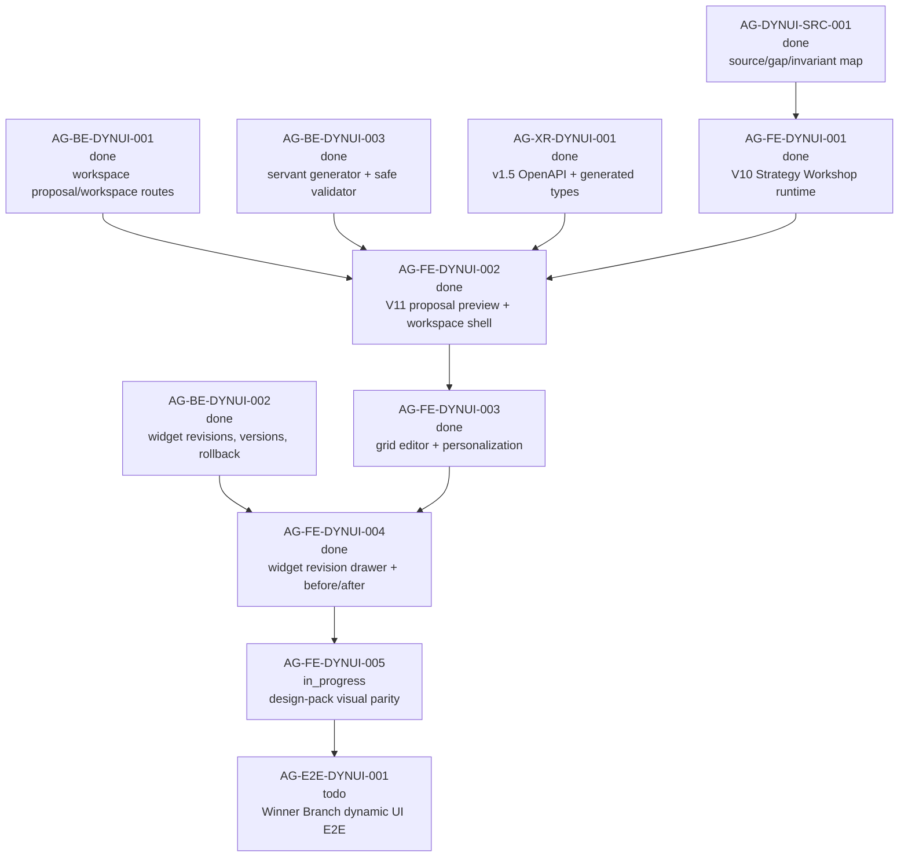

# AG-FE-DYNUI-005 Sidecar Acceptance Packet

| Field | Value |
| --- | --- |
| Sidecar task | `AG-FE-DYNUI-005-SIDECAR-ACCEPTANCE` |
| Helper parent | `AG-FE-DYNUI-005` |
| Helper kind | `acceptance_packet` |
| Parent title | Design-pack visual parity on top of dynamic runtime |
| Parent owner / reviewer | `Claude` / `Codex` as of status readback |
| Sidecar owner / reviewer | `Codex2` / `Claude` |
| Date | `2026-06-29` |
| Mutates canonical truth | `false` |
| Status | Ready for `Claude` review |

This is a support-only packet. It packages visual-parity acceptance criteria,
dependency routing, blocker triggers, and verification guidance for parent task
`AG-FE-DYNUI-005`. It does not edit L1 canonical truth, schemas, OpenAPI, BFF
routes, generated types, frontend runtime code, registry/governance logic,
deployment configuration, or parent implementation files.

## 1. Purpose

`AG-FE-DYNUI-005` owns the final design-pack visual parity pass after the
dynamic V10/V11 Agora runtime foundations have landed. The parent should make
the existing dynamic Strategy Workshop and Trading Room surfaces look and feel
like the design pack without replacing them with static screenshots, hardcoded
mock state, or a resurrected standalone prototype.

Parent delivery should align these already dynamic surfaces:

1. dark AGORA global shell, command bar, top navigation, strategy identity, and
   dense institutional trading-desk tone;
2. V10 Strategy Workshop mid-state: long Winner Branch hypothesis, Strategy
   Reconstruction Card, 12-block completeness rail, research/backtest/version
   cards, composer, and readiness-to-Trading-Room CTA;
3. V11 Trading Room proposal generation and preview: build progress, seven view
   thumbnails, widget counts, rationale, data availability, warnings, and
   personalization applied;
4. active Trading Room workspace: fixed control bar, view tabs, strategy-specific
   grid, edit toolbar, widget menu, data freshness, risk/pending-decision
   signals, and personalization status;
5. drawer/modal states: layout adjustment proposal, widget revision before/after
   drawer, add-widget library, dashboard change log, version history, and
   rollback affordances.

This packet is not parent approval and does not move the parent into E2E proof.
`AG-E2E-DYNUI-001` still owns the complete Winner Branch journey proof after
visual parity composes with the dynamic runtime.

## 2. Sources Used

| Source | Relevant finding |
| --- | --- |
| `AI_COLLABORATION_GUIDE.md` | L0 state coordinates work; support packets cannot override canonical architecture or policy truth. |
| `.orchestrator/task-briefs/ag_fe_dynui_005_sidecar_acceptance.md` | Sidecar scope is acceptance checklist, dependency map, and support packet only. |
| `.orchestrator/skills/worker-anchor-commit.md` | Task-owned support/docs changes should be made durable through narrow commits. |
| `.orchestrator/skills/task-closeout-finalization.md` | Final `done` requires reviewer approval, task-scoped commit, PR merge, and owner finalization. |
| `AI_NAME=Codex2 ./scripts/ai-status.sh show AG-FE-DYNUI-005-SIDECAR-ACCEPTANCE` | Sidecar is active `in_progress`, owner `Codex2`, reviewer `Claude`, helper parent `AG-FE-DYNUI-005`, artifact path is this packet, and `mutates_canonical` is false. |
| `AI_NAME=Codex2 ./scripts/ai-status.sh show AG-FE-DYNUI-005` | Parent is active `in_progress`, owner `Claude`, reviewer `Codex`, depends on `AG-FE-DYNUI-001` through `004`, and is scoped to visual parity only after dynamic foundations exist. |
| `AI_NAME=Codex2 ./scripts/ai-status.sh show AG-DYNUI-SRC-001` | Design-pack source/gap/invariant map is archived `done`; no intake blocker remains. |
| `AI_NAME=Codex2 ./scripts/ai-status.sh show AG-FE-DYNUI-001` | V10 Strategy Workshop runtime is archived `done`; reviewer noted screenshot/Playwright evidence still needs downstream follow-up. |
| `AI_NAME=Codex2 ./scripts/ai-status.sh show AG-FE-DYNUI-002` | V11 proposal preview and workspace shell are archived `done`; execute-plans PR `#81` merged to `main`. |
| `AI_NAME=Codex2 ./scripts/ai-status.sh show AG-FE-DYNUI-003` | Grid editor, personalization events, version/rollback controls, and dev deployment are archived `done`; visual parity remains downstream. |
| `AI_NAME=Codex2 ./scripts/ai-status.sh show AG-FE-DYNUI-004` | Widget adjustment drawer and before/after revision flow are archived `done`; execute-plans PR `#84` merged to `dev`. |
| `AI_NAME=Codex2 ./scripts/ai-status.sh show AG-BE-DYNUI-001`, `AG-BE-DYNUI-002`, `AG-BE-DYNUI-003` | Workspace proposal routes, widget revision/version/rollback contracts, servant generator, and safe validator integration are archived `done`. |
| `AI_NAME=Codex2 ./scripts/ai-status.sh show AG-XR-DYNUI-001` | v1.5 OpenAPI/generated frontend type drift closure is archived `done`; parent should report drift as blocker rather than hand-rolling shapes. |
| `AI_NAME=Codex2 ./scripts/ai-status.sh show AG-E2E-DYNUI-001` | Full Winner Branch dynamic UI end-to-end proof is still active `todo` and depends on `AG-FE-DYNUI-005`. |
| `docs/04/agora_design_pack_dynui_2026-06-28/README.md` | Visual parity must sit on dynamic contracts/runtime and cannot be delivered from screenshots alone. |
| `docs/04/agora_design_pack_dynui_2026-06-28/source-map-and-gap-map.md` | Routes dark AGORA visual parity from screenshots/prototype to `AG-FE-DYNUI-005`; static mock pages and arbitrary code injection fail. |
| `/tmp/ai-trading-desk-design/uploads/Pathreon_Agora_ClaudeDesign_UI_Requirement_V10_Expert_Strategy_Dialogue_2026-06-18.md` | Strategy Workshop should be a professional co-construction workspace with a compact header, dialogue/research cards, right rail, and Chinese trader-servant copy, not a chat page. |
| `/tmp/ai-trading-desk-design/uploads/Pathreon_Agora_ClaudeDesign_UI_Requirement_V11_WinnerBranch_TradingRoom_2026-06-19.md` | Trading Room skeleton requires fixed strategy/status/version/freshness controls, seven view tabs, strategy-specific grid, edit affordances, widget menu, revision drawer, version history, and safe wording. |
| `/tmp/ai-trading-desk-design/uploads/Pathreon_Agora_ClaudeDesign_UI_Requirement_V6_MultiStrategy_Dashboard_2026-06-18.md` | Visual style is professional, high-density, institutional, dark/neutral, semantic-color driven with icon/label/text redundancy, and no chatbot or backend-governance vocabulary. |
| `/tmp/ai-trading-desk-design/uploads/Pathreon_Agora_ClaudeDesign_UI_Requirement_V4_AI_Dashboard_Control_2026-05-20.md` | Layout adjustment and widget proposals must show assistant understanding, before/after preview, quick actions, widget menu rationale, change log, and rollback. |
| `/tmp/ai-trading-desk-design/Agora.dc.html` | Prototype contains concrete dark shell, V10 workshop, V11 generation/proposal/active workspace, drawer, add-widget, revision, and version-history states. |
| `/tmp/ai-trading-desk-design/screenshots/{01-v10-mid.png,02-v10-mid.png,01-applied.png,01-aifix.png}` | Primary screenshot references are readable 924x540 JPEG payloads with `.png` filenames. |
| `support/sidecars/AG-FE-DYNUI-001/AG-FE-DYNUI-001-SIDECAR-ACCEPTANCE.md` | Upstream V10 acceptance required design-pack evidence, dynamic workshop, and screenshot/browser proof. |
| `support/sidecars/AG-FE-DYNUI-002/AG-FE-DYNUI-002-SIDECAR-ACCEPTANCE.md` | Upstream V11 shell acceptance left final visual parity downstream. |
| `support/sidecars/AG-FE-DYNUI-003/AG-FE-DYNUI-003-SIDECAR-ACCEPTANCE.md` | Grid editor acceptance left widget drawer, final visual parity, and E2E downstream. |
| `support/sidecars/AG-FE-DYNUI-004/AG-FE-DYNUI-004-SIDECAR-ACCEPTANCE.md` | Drawer acceptance scoped layout/copy toward design pack but left final dark AGORA visual parity to `AG-FE-DYNUI-005`. |

`current-work.md` and the full `ai-activity-log.jsonl` were not scanned.

## 3. Current Composition Snapshot

| Surface | Current state | Consequence for `AG-FE-DYNUI-005` |
| --- | --- | --- |
| Design intake | `AG-DYNUI-SRC-001` is archived `done`; local archive and extracted references are readable. | Parent can cite the frozen source map and design files directly. |
| V10 Strategy Workshop | `AG-FE-DYNUI-001` is archived `done`. | Parent should restyle the existing dynamic card/rail/composer workflow, not replace it with a static mock workshop. |
| V11 proposal shell | `AG-FE-DYNUI-002` is archived `done`. | Parent should restyle generation progress, proposal preview, and accepted workspace shell from existing dynamic state. |
| Grid editor | `AG-FE-DYNUI-003` is archived `done`. | Parent must preserve drag/resize/add/remove/restore/duplicate/change-chart/save-discard/version/rollback behavior while changing visuals. |
| Widget revision drawer | `AG-FE-DYNUI-004` is archived `done`. | Parent should visually align the context drawer, before/after diff, quick commands, apply/keep/cancel/adjust-again controls, and error states. |
| E2E proof | `AG-E2E-DYNUI-001` is active `todo`. | Parent must provide screenshot/Playwright visual evidence but does not own full end-to-end acceptance. |
| Safety boundary | Design source and prior packets forbid Management/RuntimeBinding/broker/capital UI, direct orders, and arbitrary frontend code execution. | Parent must keep safety language and renderer allowlists intact during visual restyling. |

## 4. Parent Acceptance Checklist

| # | Criterion | Acceptance rule |
| --- | --- | --- |
| 1 | Design sources are explicitly cited | Parent closeout cites the local design archive or extracted references, the four primary design docs, `Agora.dc.html`, the four primary screenshots, and `docs/04/agora_design_pack_dynui_2026-06-28/source-map-and-gap-map.md`. If any required source cannot be read, parent opens a blocker. |
| 2 | Visual parity is applied to dynamic runtime | Restyling must use the landed Strategy Workshop, Trading Room proposal/workspace, grid editor, and widget revision drawer components. Static screenshots, hardcoded mock cards, or a cloned `Agora.dc.html` page fail. |
| 3 | Dark AGORA shell is present | Global shell has the AGORA identity, dark/neutral canvas, top command bar, three main tabs, strategy/persona context, quick actions, and dense trading-tool spacing consistent with the prototype. |
| 4 | No landing page or old white skeleton | `/agora/strategy-workshop` and `/agora/trading-room` open into the actual usable workflows. Parent must not introduce a marketing hero, placeholder dashboard, old light skeleton, or empty dashboard fallback. |
| 5 | Typography and density are institutional | UI reads as a professional trading desk: compact headers, data-dense widgets, restrained cards, clear hierarchy, no oversized marketing typography, no decorative blobs, no chatbot-like character treatment. |
| 6 | Semantic colors are contract-safe | Positive/improvement, warning, high risk, critical, research/info, shadow/simulation, and disabled/invalid states are visually distinct and reinforced with icons/labels/text, not color alone. |
| 7 | V10 workshop header matches design intent | Header shows strategy name/version, research state, completeness, backtest state, and Trading Room readiness/join action without hiding dynamic readiness logic. |
| 8 | V10 workshop body matches mid-state | Long Winner Branch hypothesis, Strategy Reconstruction Card sections, high-value question card, score/version/backtest/research cards, and bottom servant composer are visually aligned to the dark design while remaining event/card driven. |
| 9 | V10 right rail is visually complete | The 12-block completeness rail is visible, scannable, and distinguishes confirmed, servant-inferred, missing, weak, and conflict states without collapsing into generic progress text. |
| 10 | V10 screenshot evidence exists | Parent provides desktop screenshot or Playwright screenshot evidence matching the `01-v10-mid.png` / `02-v10-mid.png` mid-state: dark shell, long input, reconstruction card, right rail, composer, and readiness context. |
| 11 | V11 proposal generation matches design intent | Build/progress state communicates that the servant is creating a complete workspace and the trader is not starting from an empty dashboard. |
| 12 | V11 proposal preview is visually complete | Preview shows seven generated views as thumbnails/cards with widget counts, rationale, data availability, warnings, and personalization markers. |
| 13 | V11 active workspace control bar is fixed and informative | Active Trading Room shows strategy/version/status, dashboard version, data freshness, pending decisions, risk alerts, edit/layout controls, servant controls, version history, and link back to Strategy Workshop. |
| 14 | View tabs are dense and data-driven | Seven Winner Branch views render as compact tabs derived from workspace state, with counts/status markers where available and no static/fake tab list. |
| 15 | Grid visual parity preserves editor behavior | Restyled grid still uses `TradingRoomWidgetSpec.placement` and preserves drag handles, resize handles, edit mode, dirty save/discard, remove/restore, add widget, duplicate, change chart, versions, and rollback. |
| 16 | Widget cards are visually useful | Widgets show title, data freshness/availability, purpose or rationale access, chart/table content, sensitivity/warning state, menu affordance, and edit/revision affordances without overlapping or truncating critical text. |
| 17 | Widget menu aligns to design | Each editable widget has a clear menu including why shown, move/resize, change chart, edit data range, add comparison, duplicate, remove, mark useful/not useful, and servant revision entry where supported by runtime. |
| 18 | Layout adjustment drawer aligns to V4/V6 | Drawer includes natural-language input, quick intent chips, assistant understanding, proposed changes, before/after layout preview, apply/edit/reject style actions, and non-mutating cancel behavior. |
| 19 | Widget revision drawer aligns to V11 | Drawer visually surfaces widget context, revision instruction, quick commands, server-backed before/after proposal, diff summary, warnings/data availability, apply, adjust again, keep original plus copy, and cancel. |
| 20 | Change log and versions are first-class | Dashboard change log/version UI displays version id/name, who changed it, why, affected views/widgets, effect/evaluation if available, current marker, compare/rollback affordances, and per-trader/per-strategy-version language. |
| 21 | Personalization status is visible | UI shows per-trader personalization and servant-applied layout status without implying arbitrary direct mutation by the assistant. |
| 22 | Copy follows trader-servant tone | Chinese/English copy uses trader instructing research/trading servant language. It must not revert to generic "Ask AI", cute chatbot tone, retail Q&A, or backend engineering vocabulary. |
| 23 | Forbidden vocabulary stays out of Agora UI | User-facing Agora UI must not expose Management, RuntimeBinding, ArtifactState, governance internals, broker backend controls, direct order routing, capital binding, or live execution toggles. |
| 24 | Safety and validator boundaries remain intact | Visual work must not add `eval`, `new Function`, `dangerouslySetInnerHTML`, iframes, raw HTML/React/JS injection, arbitrary data-source URLs, or bypass widget/chart allowlist validation. |
| 25 | Responsive layout is verified | Desktop and narrower viewport screenshots prove top bars, tabs, drawers, widget cards, menus, modals, and button text do not overlap or overflow incoherently. |
| 26 | Existing focused tests still pass | Parent reruns focused Strategy Workshop, Trading Room, BFF helper, widget registry, and drawer tests touched by visual changes. Visual-only changes cannot break dynamic state assertions. |
| 27 | Build/lint/diff checks pass | Parent runs scoped lint, `npm run build` or repo equivalent, contract drift where applicable, and `git diff --check` for changed files. |
| 28 | Browser visual evidence is attached | Parent closeout attaches or references Playwright/browser screenshots for Strategy Workshop mid-state, Trading Room proposal preview, active workspace edit mode, widget menu, layout adjustment drawer, widget revision drawer, change log, and version modal. |
| 29 | Dev-host evidence is clear | If parent claims hosted dev delivery, evidence names the execute-plans commit, dev host URL, BFF target, strict live BFF mode, and safe write defaults. |
| 30 | E2E boundary is preserved | Parent may provide visual smoke flows, but must not claim full Winner Branch dynamic UI E2E acceptance; that remains `AG-E2E-DYNUI-001`. |

## 5. Dependency Map



### Dependency Notes

| Task / surface | Current state | Relevance |
| --- | --- | --- |
| `AG-DYNUI-SRC-001` | Archived `done`. | Frozen source map and dynamic invariants are valid input for parent. |
| `AG-FE-DYNUI-001` | Archived `done`. | Parent restyles V10 Strategy Workshop and should satisfy the open screenshot/browser evidence gap noted in review. |
| `AG-FE-DYNUI-002` | Archived `done`; execute-plans PR `#81` merged to `main`. | Parent restyles generation progress, proposal preview, and accepted workspace shell. |
| `AG-FE-DYNUI-003` | Archived `done`; execute-plans PR `#82` merged to `dev`. | Parent restyles the grid editor without weakening edit/persistence/version behavior. |
| `AG-FE-DYNUI-004` | Archived `done`; execute-plans PR `#84` merged to `dev`. | Parent restyles widget adjustment/revision drawer and before/after states. |
| `AG-BE-DYNUI-001/002/003` | Archived `done`. | Dynamic backend contracts/generator are available; parent should not redefine semantics. |
| `AG-XR-DYNUI-001` | Archived `done`. | Parent should use generated types already composed by frontend runtime tasks and report drift as blocker. |
| Design prototype/screenshots | Readable extracted references. | Parent should compare against screenshots/prototype while keeping production code controlled. |
| `AG-E2E-DYNUI-001` | Active `todo`. | Parent visual evidence becomes prerequisite input, but full E2E proof remains downstream. |

## 6. Blocker Triggers For Parent Owner

Parent owner should stop and open a blocker or reviewer handoff if any of these
are true:

1. The design archive, extracted references, four primary screenshots,
   `Agora.dc.html`, or frozen source/gap map cannot be read.
2. Current execute-plans branch does not include the completed dynamic
   `AG-FE-DYNUI-001` through `AG-FE-DYNUI-004` runtime surfaces.
3. Visual parity requires replacing `TradingRoomWorkspace`,
   `TradingRoomWorkspaceProposal`, `TradingRoomWidgetSpec`, or
   `WidgetRevisionProposal` with local mock shapes.
4. The parent needs to revive a hand-authored visual parity branch or static
   prototype clone as the delivery path without explicit owner instruction.
5. Design references conflict with committed schemas/routes/types and cannot be
   represented without changing canonical contracts.
6. The UI cannot render required widget/menu/drawer/version states from dynamic
   data without inventing fields, routes, widgets, or interactions.
7. Restyling would break grid editor persistence, ETag/idempotency behavior,
   widget revision apply/keep/cancel/adjust-again behavior, version history, or
   rollback.
8. Visual treatment would hide data availability, warnings, risk, pending
   decisions, validation errors, or stale-state recovery in a way that changes
   behavior truth.
9. Implementation introduces raw HTML/JS/React execution, arbitrary URLs,
   unvalidated chart/widget shapes, or bypasses registry validator posture.
10. User-facing text would expose Management, RuntimeBinding, broker backend,
    direct order, capital binding, ArtifactState, or governance vocabulary.
11. Parent cannot produce repeatable screenshot/Playwright evidence for the
    major visual states listed in the acceptance checklist.
12. Parent needs full Winner Branch E2E proof to pass visual parity. That belongs
    to `AG-E2E-DYNUI-001`.

## 7. Suggested Parent Verification Plan

Run from the active execute-plans checkout after parent implementation. Exact
file names may vary, but the evidence should cover the same surfaces.

```bash
npm test -- --run \
  src/agora/pages/strategy-workshop/StrategyWorkshopPage.test.tsx \
  src/agora/components/StrategyCompletenessRail.test.tsx \
  src/agora/components/WorkshopCardRenderer.test.tsx \
  src/agora/pages/trading-room/TradingRoomPage.test.tsx \
  src/agora/widgets/WidgetRevisionDrawer.test.tsx \
  src/agora/widgets/registry.test.ts \
  src/lib/bff-v1/agora/tradingRoom.test.ts
```

```bash
npx eslint \
  src/agora/pages/strategy-workshop \
  src/agora/pages/trading-room \
  src/agora/trading-room \
  src/agora/widgets \
  src/lib/bff-v1/agora
```

```bash
npm run build
git diff --check
```

Recommended visual evidence:

- Playwright or browser screenshot for V10 Strategy Workshop mid-state at
  desktop and narrow viewport.
- Playwright or browser screenshot for V11 build/proposal preview with seven
  views.
- Playwright or browser screenshot for active Trading Room edit mode with view
  tabs, grid handles, widget menu, and personalization status.
- Playwright or browser screenshot for layout adjustment drawer and before/after
  layout preview.
- Playwright or browser screenshot for widget revision drawer showing context,
  diff, before/after, warnings, apply, keep-copy, cancel, and adjust-again
  affordances.
- Playwright or browser screenshot for change log and version history/rollback
  modal.

Recommended safety grep:

```bash
rg -n "RuntimeBinding|Management|ArtifactState|governance|broker|capital|place_order|enable_live|dangerouslySetInnerHTML|eval\\(|new Function|iframe|rawHtml|external script" \
  src/agora src/lib/bff-v1/agora
```

Recommended dev-host readback if deployed:

```bash
curl -fsS "$PANTHEON_DEV_FE_URL/deployment.json"
```

The readback should identify the execute-plans commit and confirm live/strict
BFF configuration plus safe write defaults when those fields are available.

## 8. Sidecar Validation Run

Commands run or inspected from this sidecar worktree unless noted:

```bash
git status -sb
git branch --show-current
git remote -v
sed -n '1,220p' AI_COLLABORATION_GUIDE.md
sed -n '1,240p' .orchestrator/task-briefs/ag_fe_dynui_005_sidecar_acceptance.md
sed -n '1,220p' .orchestrator/skills/worker-anchor-commit.md
sed -n '1,260p' .orchestrator/skills/task-closeout-finalization.md
sed -n '1,260p' ai-status.json
jq '.tasks[] | select(.id=="AG-FE-DYNUI-005-SIDECAR-ACCEPTANCE" or .id=="AG-FE-DYNUI-005")' ai-status.json
AI_NAME=Codex2 ./scripts/ai-status.sh show AG-FE-DYNUI-005-SIDECAR-ACCEPTANCE
AI_NAME=Codex2 ./scripts/ai-status.sh show AG-FE-DYNUI-005
AI_NAME=Codex2 ./scripts/ai-status.sh show AG-DYNUI-SRC-001
AI_NAME=Codex2 ./scripts/ai-status.sh show AG-FE-DYNUI-001
AI_NAME=Codex2 ./scripts/ai-status.sh show AG-FE-DYNUI-002
AI_NAME=Codex2 ./scripts/ai-status.sh show AG-FE-DYNUI-003
AI_NAME=Codex2 ./scripts/ai-status.sh show AG-FE-DYNUI-004
AI_NAME=Codex2 ./scripts/ai-status.sh show AG-BE-DYNUI-001
AI_NAME=Codex2 ./scripts/ai-status.sh show AG-BE-DYNUI-002
AI_NAME=Codex2 ./scripts/ai-status.sh show AG-BE-DYNUI-003
AI_NAME=Codex2 ./scripts/ai-status.sh show AG-XR-DYNUI-001
AI_NAME=Codex2 ./scripts/ai-status.sh show AG-E2E-DYNUI-001
sed -n '1,220p' docs/04/agora_design_pack_dynui_2026-06-28/README.md
sed -n '1,240p' docs/04/agora_design_pack_dynui_2026-06-28/source-map-and-gap-map.md
sed -n '30,180p' /tmp/ai-trading-desk-design/Agora.dc.html
sed -n '619,715p' /tmp/ai-trading-desk-design/Agora.dc.html
sed -n '825,1000p' /tmp/ai-trading-desk-design/Agora.dc.html
sed -n '1197,1385p' /tmp/ai-trading-desk-design/Agora.dc.html
sed -n '166,214p' /tmp/ai-trading-desk-design/uploads/Pathreon_Agora_ClaudeDesign_UI_Requirement_V11_WinnerBranch_TradingRoom_2026-06-19.md
sed -n '536,762p' /tmp/ai-trading-desk-design/uploads/Pathreon_Agora_ClaudeDesign_UI_Requirement_V11_WinnerBranch_TradingRoom_2026-06-19.md
sed -n '135,248p' /tmp/ai-trading-desk-design/uploads/Pathreon_Agora_ClaudeDesign_UI_Requirement_V4_AI_Dashboard_Control_2026-05-20.md
sed -n '248,385p' /tmp/ai-trading-desk-design/uploads/Pathreon_Agora_ClaudeDesign_UI_Requirement_V4_AI_Dashboard_Control_2026-05-20.md
sed -n '1038,1129p' /tmp/ai-trading-desk-design/uploads/Pathreon_Agora_ClaudeDesign_UI_Requirement_V6_MultiStrategy_Dashboard_2026-06-18.md
file /tmp/ai-trading-desk-design/screenshots/01-v10-mid.png /tmp/ai-trading-desk-design/screenshots/02-v10-mid.png /tmp/ai-trading-desk-design/screenshots/01-applied.png /tmp/ai-trading-desk-design/screenshots/01-aifix.png
```

Validation to run before owner handoff:

```bash
git diff --check -- .orchestrator/task-briefs/ag_fe_dynui_005_sidecar_acceptance.md support/sidecars/AG-FE-DYNUI-005/AG-FE-DYNUI-005-SIDECAR-ACCEPTANCE.md
git diff --check --no-index -- /dev/null support/sidecars/AG-FE-DYNUI-005/AG-FE-DYNUI-005-SIDECAR-ACCEPTANCE.md
rg -n "^(TBD|TODO|PLACEHOLDER|FIXME)$" support/sidecars/AG-FE-DYNUI-005/AG-FE-DYNUI-005-SIDECAR-ACCEPTANCE.md .orchestrator/task-briefs/ag_fe_dynui_005_sidecar_acceptance.md
```

## 9. Support-Only Boundary Confirmation

- No L1/L2 canonical policy or architecture document was edited by this
  sidecar.
- No backend schema, OpenAPI, BFF route, runtime, registry, governance, or
  generated-type implementation was changed by this sidecar.
- No frontend runtime file was changed by this sidecar.
- The intended sidecar artifact is
  `support/sidecars/AG-FE-DYNUI-005/AG-FE-DYNUI-005-SIDECAR-ACCEPTANCE.md`.
- The pre-existing generated task brief remains task-scoped context for this
  worker and does not define product/runtime truth.
- This packet does not approve the parent implementation. It gives parent owner
  `Claude` and reviewer `Codex` a concrete visual-parity acceptance surface.

## 10. Reviewer Handoff

Reviewer should verify:

1. the packet is support-only and does not edit canonical/runtime/contract
   truth;
2. design references and current task states are represented truthfully;
3. acceptance criteria preserve dynamic runtime behavior and do not allow a
   static visual clone;
4. dependency map correctly routes full E2E proof to `AG-E2E-DYNUI-001`.

If approved, suggested reviewer command:

```bash
AI_NAME=Claude REVIEW_FILE=support/sidecars/AG-FE-DYNUI-005/AG-FE-DYNUI-005-SIDECAR-ACCEPTANCE.md \
  ./scripts/ai-status.sh approve AG-FE-DYNUI-005-SIDECAR-ACCEPTANCE \
  "Review approved: AG-FE-DYNUI-005 support packet captures visual-parity acceptance, dependencies, blocker triggers, verification evidence, and support-only boundary."
```

If changes are required:

```bash
AI_NAME=Claude ./scripts/ai-status.sh reopen AG-FE-DYNUI-005-SIDECAR-ACCEPTANCE "Describe the exact packet corrections needed."
```

Prepared by `Codex2` for the `AG-FE-DYNUI-005-SIDECAR-ACCEPTANCE` support
slice.
