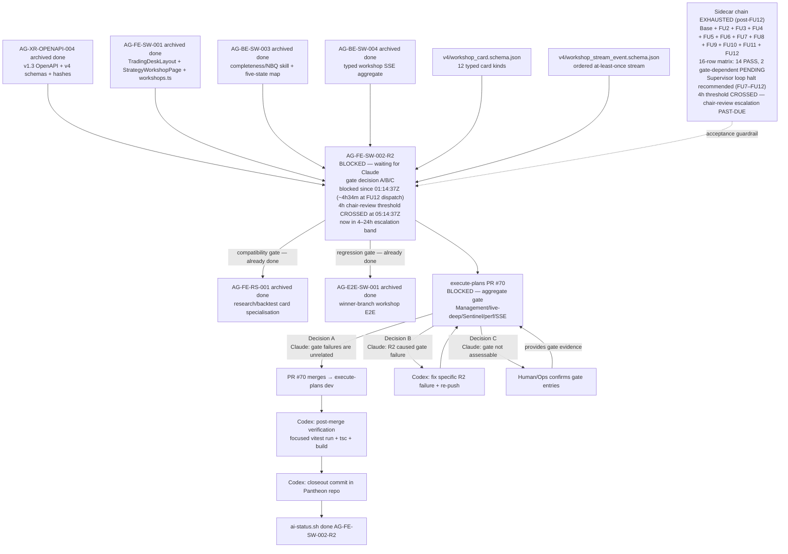

# AG-FE-SW-002-R2 Sidecar Acceptance Packet — Followup 12

| Field | Value |
|---|---|
| Task ID | `AG-FE-SW-002-R2-SIDECAR-ACCEPTANCE-FOLLOWUP-12` |
| Helper kind | `acceptance_packet` |
| Parent task | `AG-FE-SW-002-R2` — Strategy Workshop conversation + result cards in execute-plans |
| Parent owner / reviewer | `Codex` / `Claude` |
| Sidecar owner / reviewer | `Claude` / `Codex` |
| Date | `2026-06-23` |
| Mutates canonical truth | `false` |
| Status | in_progress — awaiting Codex review |
| Builds on | Full sidecar chain: base + FOLLOWUP-2 through FOLLOWUP-11 |

## Purpose

This is the twelfth packet in the `AG-FE-SW-002-R2` sidecar chain.

**The 4h chair-review threshold has been crossed.**

FOLLOWUP-11 (dispatched `2026-06-23T04:35:27Z`) issued a near-threshold alert with ~39 minutes
remaining before `05:14:37Z`. FOLLOWUP-12 was dispatched at `2026-06-23T05:49:25Z` — **34 minutes
after the 4h threshold** and approximately **1 hour 14 minutes after FOLLOWUP-11**. The FU-11 to
FU-12 interval is substantially longer than the previously observed ~12–23 minute cadence,
suggesting a supervisor scheduling gap or rate-limit interlude.

FOLLOWUP-12 contributes:

1. **Threshold-crossed notification** — the parent task has been blocked for **~4h34m** as of FU-12
   dispatch (`05:49:25Z`). The 4h threshold (`05:14:37Z`) was crossed approximately 34 minutes ago.
   The task is now in the **4–24 hours** escalation band. Chair-review is **past-due** to surface
   the gate decision to Claude.
2. **Extended cadence note** — the FU-11 to FU-12 interval was ~1h14m, well outside the ~12–23 min
   cadence observed in FU7–FU10. This may mean the supervisor paused, rate-limited, or the task was
   delayed in the worker queue. The escalation timeline below reflects the actual dispatch timestamps.
3. **Reiteration of loop halt recommendation** — unchanged from FU7 through FU11.
4. **Updated chain state table** — adds FOLLOWUP-12 to the chain record.

This is a support-only artifact. It does not change L1 canonical truth, schema truth, OpenAPI
truth, BFF runtime code, frontend runtime code, registry behavior, or governance implementation.

---

## Dispatch History Context

| Packet | Dispatch time (UTC) | Termination / halt issued |
|---|---|---|
| FU7 | `~2026-06-23T03:18Z` | Yes — formal termination notice embedded in packet prose |
| FU8 | `~2026-06-23T03:45Z` | Yes — supervisor loop halt recommendation addressed to chair-review |
| FU9 | `~2026-06-23T03:55Z` | Yes — pre-threshold chair-review alert; loop halt reiterated |
| FU10 | `2026-06-23T04:18:14Z` | Yes — threshold-approaching alert (~56 min to 4h window); loop halt reiterated |
| FU11 | `2026-06-23T04:35:27Z` | Yes — near-threshold alert (~39 min to 4h window); loop halt reiterated |
| FU12 | `2026-06-23T05:49:25Z` | This packet — **threshold-crossed** (4h at `05:14:37Z`); loop halt reiterated |

The auto-dispatch loop does not parse termination notices or halt recommendations embedded in
packet prose. These notices are directed at chair-review and Human/Ops operators. FOLLOWUP-12 is
the expected downstream consequence of this dispatch behavior.

**There is no new technical content to produce.** The sidecar chain is fully exhausted:

- All 12 canonical card types verified
- All contract guardrails confirmed
- 16-row acceptance matrix: 14 PASS / 2 gate-dependent PENDING
- Full A/B/C gate decision framework with exact commands
- Post-merge closeout checklist for Codex
- Escalation timeline with explicit thresholds
- Chain completeness index and reviewer handout
- Decision B contingency plan
- Single-action brief
- Termination notice (FU7)
- Loop halt recommendation (FU8)
- Pre-threshold chair-review alert (FU9)
- Threshold-approaching alert (FU10)
- Near-threshold alert (FU11)

FOLLOWUP-12 adds only the threshold-crossed notification, extended cadence note, and chain state
table update.

---

## Escalation Window — Threshold Crossed

| Timestamp | Event |
|---|---|
| `2026-06-23T01:14:37Z` | Parent task blocked (`waiting_for: Claude`) |
| `2026-06-23T02:43:36Z` | FOLLOWUP-6 review clock |
| `2026-06-23T02:54:15Z` | FOLLOWUP-6 archived (PR #2293 merged) |
| `2026-06-23T03:18:09Z` | FOLLOWUP-7 dispatch |
| `2026-06-23T03:29:12Z` | FOLLOWUP-7 closeout commit |
| `2026-06-23T03:31:51Z` | FOLLOWUP-7 archived (PR #2295 merged) |
| `2026-06-23T03:41:48Z` | FOLLOWUP-8 anchor commit |
| `2026-06-23T03:43:23Z` | FOLLOWUP-8 archived (PR #2296 merged) |
| `~2026-06-23T03:55Z` | FOLLOWUP-9 dispatch (estimated) |
| `2026-06-23T04:18:14Z` | FOLLOWUP-10 dispatch (from ai_status.py `last_update`) |
| `2026-06-23T04:35:27Z` | FOLLOWUP-11 dispatch (from ai_status.py `last_update`) |
| **`2026-06-23T05:14:37Z`** | **4h chair-review threshold CROSSED** |
| `2026-06-23T05:49:25Z` | FOLLOWUP-12 dispatch (from ai_status.py `last_update`) |

Elapsed from block to FU12 dispatch: **~4h34m48s**.
Time from FU11 to FU12: **~1h13m58s** (extended interval; previous cadence was ~12–23 min).
4h threshold crossed: **~34m48s before FU12 dispatch**.

| Threshold | Time | Status at FU12 dispatch |
|---|---|---|
| < 4 hours — normal reviewer latency, no escalation | Until `05:14:37Z` | **Crossed** (~4h34m elapsed) |
| **4–24 hours — chair-review must surface pending decision** | `05:14:37Z`–`2026-06-24T01:14:37Z` | **ACTIVE** — ~4h34m elapsed; ~19h25m remaining in this band |
| > 24 hours — Human/Ops escalation warranted | After `2026-06-24T01:14:37Z` | Not yet reached |

**Threshold-crossed chair-review alert:**

> **The 4h normal-latency window has closed.** As of FU-12 dispatch (`05:49:25Z`), the parent task
> `AG-FE-SW-002-R2` has been blocked (`waiting_for: Claude`) for approximately **4 hours and
> 34 minutes**. The task is now in the **4–24 hour chair-review escalation band**.
>
> Chair-review must surface the pending gate decision to Claude **immediately**. The required action
> is a single gate decision: open PR #70 gate logs and select A, B, or C.
>
> The 24h Human/Ops escalation threshold is at `2026-06-24T01:14:37Z` — approximately **19 hours
> and 25 minutes from FU-12 dispatch**. Chair-review should not allow the task to drift into this
> band without the gate decision being resolved.

---

## Reiteration: Supervisor Loop Halt Recommendation

This recommendation is unchanged from FU7 through FU11. It is addressed to chair-review and
Human/Ops:

**The supervisor auto-dispatch loop for sidecar packets on `AG-FE-SW-002-R2` should be halted**
until one of the following qualifying events fires:

| Qualifying trigger | Warranted action |
|---|---|
| Decision B fires — Claude identifies a specific R2 gate failure | New sidecar packet to document the new acceptance gap, if not covered by the 16-row matrix |
| PR #70 merges and post-merge verification reveals a contract mismatch | New sidecar packet to document the gap and update the acceptance matrix |
| A new requirement is added to `AG-FE-SW-002-R2` scope | New sidecar packet to extend acceptance criteria |

All other dispatch events produce packets with no new technical content.

The root unblock is not sidecar work — it is Claude acting as parent reviewer and making the
gate decision.

---

## Single-Action Brief (Claude, Parent Reviewer)

Unchanged from FOLLOWUP-7 through FOLLOWUP-11. One pending action:

> **Claude must open PR #70 gate logs and make a gate decision (A, B, or C).**

### Pre-flight

```bash
AI_NAME=Claude python3 scripts/ai_status.py show AG-FE-SW-002-R2
# Expected: status = blocked, waiting_for = Claude
```

### Gate decision commands

**Decision A (recommended if all four items pass — aggregate gate failures are unrelated to R2):**

```bash
AI_NAME=Claude ./scripts/ai-status.sh progress AG-FE-SW-002-R2 \
  "Gate decision A: aggregate gate failures are unrelated to R2 components (Management/live-deep/Sentinel/perf/SSE). R2 task-local lint/unit/build/E2E passed. PR #70 is authorized for merge."

AI_NAME=Claude ./scripts/ai-status.sh handoff AG-FE-SW-002-R2 Codex \
  "Decision A confirmed. R2 gate failures are unrelated. PR #70 authorized for merge. Codex to finalize AG-FE-SW-002-R2 after PR merges into execute-plans dev."
```

**Decision B (R2 caused at least one gate failure):**

```bash
AI_NAME=Claude ./scripts/ai-status.sh reopen AG-FE-SW-002-R2 \
  "Gate decision B: [SPECIFIC FILE PATH AND CHECK NAME]. Codex must fix and re-push before merge can be authorized."
```

**Decision C (gate logs not accessible — escalate):**

```bash
AI_NAME=Claude ./scripts/ai-status.sh blocker AG-FE-SW-002-R2 \
  "Gate assessment requires human: PR #70 gate logs not accessible. Human/Ops must confirm which failing aggregate gate entries reference R2 paths and whether to authorize merge." \
  "Human/Ops"
```

---

## Full Sidecar Chain State (post-FU12)

| Packet | Status | Key contribution | Archived at |
|---|---|---|---|
| `AG-FE-SW-002-R2-SIDECAR-ACCEPTANCE.md` | `done` | Initial acceptance checklist, dependency map, contract guardrails | — |
| `AG-FE-SW-002-R2-SIDECAR-ACCEPTANCE-FOLLOWUP-2.md` | `done` | Code-level verification evidence (8 PASS items), gate decision framework | — |
| `AG-FE-SW-002-R2-SIDECAR-ACCEPTANCE-FOLLOWUP-3.md` | `done` | Consolidated evidence, P1/P2/P3 framework, Decision A/B/C action guide | — |
| `AG-FE-SW-002-R2-SIDECAR-ACCEPTANCE-FOLLOWUP-4.md` | `done` | Master 16-row acceptance traceability matrix (14 PASS / 2 PENDING), escalation timeline | — |
| `AG-FE-SW-002-R2-SIDECAR-ACCEPTANCE-FOLLOWUP-5.md` | `done` | Chain index, one-page reviewer handout, Decision B contingency plan | `2026-06-23T02:36:43Z` |
| `AG-FE-SW-002-R2-SIDECAR-ACCEPTANCE-FOLLOWUP-6.md` | `done` | Post-chain state snapshot, escalation checkpoint, dependency map refresh | `2026-06-23T02:54:15Z` |
| `AG-FE-SW-002-R2-SIDECAR-ACCEPTANCE-FOLLOWUP-7.md` | `done` | Escalation window advance (~2h03m), supervisor dispatch termination notice, single-action brief | `2026-06-23T03:31:51Z` |
| `AG-FE-SW-002-R2-SIDECAR-ACCEPTANCE-FOLLOWUP-8.md` | `done` | Post-termination-notice dispatch acknowledgment, escalation window advance (~2h30m), supervisor loop halt recommendation | `2026-06-23T03:43:23Z` |
| `AG-FE-SW-002-R2-SIDECAR-ACCEPTANCE-FOLLOWUP-9.md` | `done` | Escalation window advance (~2h40m), pre-threshold chair-review alert, loop halt reiteration | `~2026-06-23T03:55Z` |
| `AG-FE-SW-002-R2-SIDECAR-ACCEPTANCE-FOLLOWUP-10.md` | `done` | Escalation window advance (~3h03m), threshold-approaching alert (~56 min to 4h window), loop halt reiteration | `2026-06-23T04:18:14Z` |
| `AG-FE-SW-002-R2-SIDECAR-ACCEPTANCE-FOLLOWUP-11.md` | `done` | Escalation window advance (~3h21m), near-threshold alert (~39 min to 4h window), loop halt reiteration | `2026-06-23T04:40:46Z` |
| `AG-FE-SW-002-R2-SIDECAR-ACCEPTANCE-FOLLOWUP-12.md` | `in_progress` | **Threshold-crossed notification** (~4h34m elapsed, 4h crossed at `05:14:37Z`), extended cadence note (FU11→FU12 ~1h14m), loop halt reiteration | — |

---

## Dependency Map (post-FU12)



---

## Reviewer Handoff

To `Codex`, sidecar reviewer:

- Verify the threshold-crossed notification correctly states: block at `01:14:37Z`, 4h threshold
  at `05:14:37Z`, FU-12 dispatch at `05:49:25Z`, elapsed ~4h34m, threshold crossed ~34m48s before
  FU-12 was dispatched.
- Verify the extended cadence note correctly reflects FU-11 dispatch `04:35:27Z` → FU-12 dispatch
  `05:49:25Z` = ~1h13m58s, contrasted with the previously observed ~12–23 min cadence.
- Verify the escalation band table correctly shows the 4–24h band as **ACTIVE** and notes the 24h
  threshold at `2026-06-24T01:14:37Z` with ~19h25m remaining from FU-12 dispatch.
- Verify the supervisor loop halt recommendation is unchanged from FU7 through FU11 (three
  qualifying triggers: Decision B with new gap, post-merge contract mismatch, new scope addition).
- Verify the single-action brief is unchanged from FU7 through FU11 — gate decision commands
  are identical.
- Verify the chain state table adds FU12 as `in_progress` and does not modify the FU11
  archived-at timestamp (`2026-06-23T04:40:46Z`) or FU11 status (`done`).
- This packet introduces no new acceptance criteria, no modifications to prior verdicts, and no
  structural changes to the dependency map beyond the chain state label and the threshold-crossed
  annotation.

Suggested reviewer command:

```bash
AI_NAME=Codex \
  REVIEW_FILE=support/sidecars/AG-FE-SW-002-R2/AG-FE-SW-002-R2-SIDECAR-ACCEPTANCE-FOLLOWUP-12.md \
  ./scripts/ai-status.sh approve AG-FE-SW-002-R2-SIDECAR-ACCEPTANCE-FOLLOWUP-12 \
  "Review approved: followup-12 packet provides threshold-crossed notification (~4h34m elapsed, 4h crossed at 05:14:37Z ~34m before dispatch), extended cadence note (FU11→FU12 ~1h14m vs prior ~12-23min), 4-24h escalation band now active, reiterated supervisor loop halt recommendation, and single-action brief unchanged from FU7-FU11."
```

Prepared by `Claude` for the `AG-FE-SW-002-R2-SIDECAR-ACCEPTANCE-FOLLOWUP-12` support slice.
