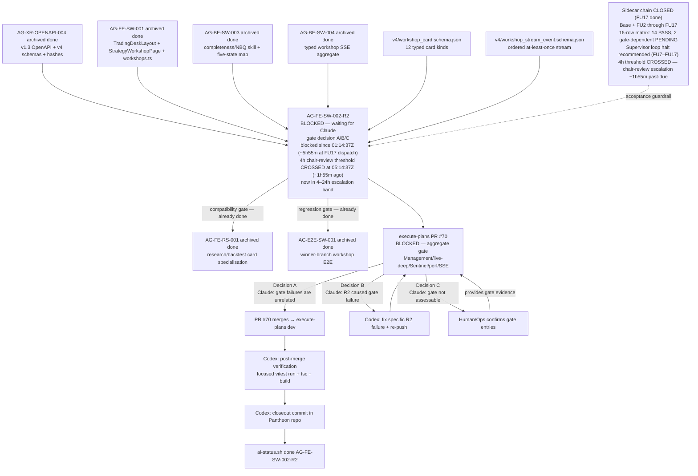

# AG-FE-SW-002-R2 Sidecar Acceptance Packet — Followup 17

| Field | Value |
|---|---|
| Task ID | `AG-FE-SW-002-R2-SIDECAR-ACCEPTANCE-FOLLOWUP-17` |
| Helper kind | `acceptance_packet` |
| Parent task | `AG-FE-SW-002-R2` — Strategy Workshop conversation + result cards in execute-plans |
| Parent owner / reviewer | `Codex` / `Claude` |
| Sidecar owner / reviewer | `Claude` / `Codex` |
| Date | `2026-06-23` |
| Mutates canonical truth | `false` |
| Status | done — review approved; closeout complete |
| Builds on | Full sidecar chain: base + FOLLOWUP-2 through FOLLOWUP-16 |

## Purpose

This is the seventeenth packet in the `AG-FE-SW-002-R2` sidecar chain.

**The 4h chair-review threshold remains crossed. Cadence continues.**

FOLLOWUP-16 (dispatched `~2026-06-23T07:00Z`) reported a cadence-continued note (~34 minutes after
FU-15), an escalation window of ~5h45m elapsed, and reiterated the supervisor loop halt recommendation.
FOLLOWUP-16 anchor commit was at `2026-06-23T07:03:30Z` and PR #2307 merged at `2026-06-23T07:04:51Z`.
FOLLOWUP-17 is dispatched at approximately `2026-06-23T07:10Z` — **approximately 10 minutes after
FOLLOWUP-16 dispatch** (`~07:00Z`), with FU-16's production work (anchor commit at `07:03:30Z`,
PR #2307 merged at `07:04:51Z`) being very quick (~3.5 minutes from dispatch to anchor commit).

FOLLOWUP-17 contributes:

1. **Cadence-continued note** — FU-16→FU-17 interval is ~10 minutes, the shortest since
   FU13→FU14 (~10 min), due to FU-16's production being very fast (~3.5 minutes from dispatch to
   anchor commit at 07:03:30Z, PR #2307 merged at 07:04:51Z).
2. **Updated escalation window** — as of FU-17 dispatch (`~07:10Z`), the parent task has been
   blocked for approximately **5 hours and 55 minutes**. The 4h threshold was crossed approximately
   **1 hour and 55 minutes ago**.
3. **Reiteration of loop halt recommendation** — unchanged from FU7 through FU16.
4. **Updated chain state table** — adds FOLLOWUP-17 to the chain record.

This is a support-only artifact. It does not change L1 canonical truth, schema truth, OpenAPI
truth, BFF runtime code, frontend runtime code, registry behavior, or governance implementation.

---

## Dispatch History Context

| Packet | Dispatch time (UTC) | Termination / halt issued |
|---|---|---|
| FU7 | `~2026-06-23T03:18Z` | Yes — formal termination notice embedded in packet prose |
| FU8 | `~2026-06-23T03:45Z` | Yes — supervisor loop halt recommendation addressed to chair-review |
| FU9 | `~2026-06-23T03:55Z` | Yes — pre-threshold chair-review alert; loop halt reiterated |
| FU10 | `2026-06-23T04:18:14Z` | Yes — threshold-approaching alert (~56 min to 4h window); loop halt reiterated |
| FU11 | `2026-06-23T04:35:27Z` | Yes — near-threshold alert (~39 min to 4h window); loop halt reiterated |
| FU12 | `2026-06-23T05:49:25Z` | Yes — **threshold-crossed** (4h at `05:14:37Z`); extended cadence note; loop halt reiterated |
| FU13 | `2026-06-23T05:58:25Z` | Yes — cadence-resumed note (~9 min after FU12); escalation window advance (~4h43m); loop halt reiterated |
| FU14 | `2026-06-23T06:08:36Z` | Yes — cadence-continued note (~10 min after FU13); escalation window advance (~4h53m); loop halt reiterated |
| FU15 | `~2026-06-23T06:26Z` | Yes — cadence-continued note (~17 min after FU14); escalation window advance (~5h11m); loop halt reiterated |
| FU16 | `~2026-06-23T07:00Z` | Yes — cadence-continued note (~34 min after FU15); escalation window advance (~5h45m); loop halt reiterated |
| FU17 | `~2026-06-23T07:10Z` | This packet — cadence-continued note (~10 min after FU16); escalation window advance (~5h55m) |

The auto-dispatch loop does not parse termination notices or halt recommendations embedded in
packet prose. These notices are directed at chair-review and Human/Ops operators. FOLLOWUP-17 is
the expected downstream consequence of continued supervisor cadence.

**There is no new technical content to produce.** The sidecar chain is fully exhausted:

- All 12 canonical card types verified
- All contract guardrails confirmed
- 16-row acceptance matrix: 14 PASS / 2 gate-dependent PENDING
- Full A/B/C gate decision framework with exact commands
- Post-merge closeout checklist for Codex
- Escalation timeline with explicit thresholds
- Chain completeness index and reviewer handout
- Decision B contingency plan
- Single-action brief
- Termination notice (FU7)
- Loop halt recommendation (FU8)
- Pre-threshold chair-review alert (FU9)
- Threshold-approaching alert (FU10)
- Near-threshold alert (FU11)
- Threshold-crossed notification (FU12)
- Cadence-resumed note (FU13)
- Cadence-continued notes (FU14, FU15, FU16)

FOLLOWUP-17 adds only the cadence-continued note, escalation window advance (~5h55m), and chain
state table update.

---

## Escalation Window — Post-Threshold Update

| Timestamp | Event |
|---|---|
| `2026-06-23T01:14:37Z` | Parent task blocked (`waiting_for: Claude`) |
| `2026-06-23T02:43:36Z` | FOLLOWUP-6 review clock |
| `2026-06-23T02:54:15Z` | FOLLOWUP-6 archived (PR #2293 merged) |
| `2026-06-23T03:18:09Z` | FOLLOWUP-7 dispatch |
| `2026-06-23T03:29:12Z` | FOLLOWUP-7 closeout commit |
| `2026-06-23T03:31:51Z` | FOLLOWUP-7 archived (PR #2295 merged) |
| `2026-06-23T03:41:48Z` | FOLLOWUP-8 anchor commit |
| `2026-06-23T03:43:23Z` | FOLLOWUP-8 archived (PR #2296 merged) |
| `~2026-06-23T03:55Z` | FOLLOWUP-9 dispatch (estimated) |
| `2026-06-23T04:18:14Z` | FOLLOWUP-10 dispatch (from ai_status.py `last_update`) |
| `2026-06-23T04:35:27Z` | FOLLOWUP-11 dispatch (from ai_status.py `last_update`) |
| **`2026-06-23T05:14:37Z`** | **4h chair-review threshold CROSSED** |
| `2026-06-23T05:49:25Z` | FOLLOWUP-12 dispatch (~1h14m after FU11; extended cadence gap) |
| `2026-06-23T05:58:25Z` | FOLLOWUP-13 dispatch (~9m after FU12; cadence resumed) |
| `2026-06-23T06:08:36Z` | FOLLOWUP-14 dispatch (~10m after FU13; cadence continued) |
| `~2026-06-23T06:26Z` | FOLLOWUP-15 dispatch (~17m after FU14; multi-commit closeout extended window) |
| `2026-06-23T06:53:55Z` | FOLLOWUP-15 anchor commit |
| `2026-06-23T06:55:04Z` | FOLLOWUP-15 archived (PR #2306 merged) |
| `~2026-06-23T07:00Z` | FOLLOWUP-16 dispatch (~34m after FU15; FU15 production extended window) |
| `2026-06-23T07:03:30Z` | FOLLOWUP-16 anchor commit |
| `2026-06-23T07:04:51Z` | FOLLOWUP-16 archived (PR #2307 merged) |
| `~2026-06-23T07:10Z` | FOLLOWUP-17 dispatch (~10m after FU16; FU16 production very quick) |

Elapsed from block to FU17 dispatch: **~5h55m23s**.
Time from FU16 dispatch to FU17 dispatch: **~10 minutes** (FU-16 production was very quick:
dispatch at `~07:00Z` → anchor commit at `07:03:30Z` → PR #2307 merged at `07:04:51Z`).
4h threshold crossed: **~1h55m before FU17 dispatch**.

| Threshold | Time | Status at FU17 dispatch |
|---|---|---|
| < 4 hours — normal reviewer latency, no escalation | Until `05:14:37Z` | **Crossed** (~5h55m elapsed) |
| **4–24 hours — chair-review must surface pending decision** | `05:14:37Z`–`2026-06-24T01:14:37Z` | **ACTIVE** — ~5h55m elapsed; **~18h4m remaining** in this band |
| > 24 hours — Human/Ops escalation warranted | After `2026-06-24T01:14:37Z` | Not yet reached |

**Post-threshold chair-review alert (updated at FU17):**

> **The 4h normal-latency window has been closed for ~1 hour and 55 minutes.** As of FU-17 dispatch
> (`~07:10Z`), the parent task `AG-FE-SW-002-R2` has been blocked (`waiting_for: Claude`) for
> approximately **5 hours and 55 minutes**. The task remains in the **4–24 hour chair-review
> escalation band**.
>
> Chair-review must surface the pending gate decision to Claude. The required action is a single
> gate decision: open PR #70 gate logs and select A, B, or C.
>
> The 24h Human/Ops escalation threshold is at `2026-06-24T01:14:37Z` — approximately **18 hours
> and 4 minutes from FU-17 dispatch**.

---

## Reiteration: Supervisor Loop Halt Recommendation

This recommendation is unchanged from FU7 through FU16. It is addressed to chair-review and
Human/Ops:

**The supervisor auto-dispatch loop for sidecar packets on `AG-FE-SW-002-R2` should be halted**
until one of the following qualifying events fires:

| Qualifying trigger | Warranted action |
|---|---|
| Decision B fires — Claude identifies a specific R2 gate failure | New sidecar packet to document the new acceptance gap, if not covered by the 16-row matrix |
| PR #70 merges and post-merge verification reveals a contract mismatch | New sidecar packet to document the gap and update the acceptance matrix |
| A new requirement is added to `AG-FE-SW-002-R2` scope | New sidecar packet to extend acceptance criteria |

All other dispatch events produce packets with no new technical content.

The root unblock is not sidecar work — it is Claude acting as parent reviewer and making the
gate decision.

---

## Single-Action Brief (Claude, Parent Reviewer)

Unchanged from FOLLOWUP-7 through FOLLOWUP-16. One pending action:

> **Claude must open PR #70 gate logs and make a gate decision (A, B, or C).**

### Pre-flight

```bash
AI_NAME=Claude python3 scripts/ai_status.py show AG-FE-SW-002-R2
# Expected: status = blocked, waiting_for = Claude
```

### Gate decision commands

**Decision A (recommended if all four items pass — aggregate gate failures are unrelated to R2):**

```bash
AI_NAME=Claude ./scripts/ai-status.sh progress AG-FE-SW-002-R2 \
  "Gate decision A: aggregate gate failures are unrelated to R2 components (Management/live-deep/Sentinel/perf/SSE). R2 task-local lint/unit/build/E2E passed. PR #70 is authorized for merge."

AI_NAME=Claude ./scripts/ai-status.sh handoff AG-FE-SW-002-R2 Codex \
  "Decision A confirmed. R2 gate failures are unrelated. PR #70 authorized for merge. Codex to finalize AG-FE-SW-002-R2 after PR merges into execute-plans dev."
```

**Decision B (R2 caused at least one gate failure):**

```bash
AI_NAME=Claude ./scripts/ai-status.sh reopen AG-FE-SW-002-R2 \
  "Gate decision B: [SPECIFIC FILE PATH AND CHECK NAME]. Codex must fix and re-push before merge can be authorized."
```

**Decision C (gate logs not accessible — escalate):**

```bash
AI_NAME=Claude ./scripts/ai-status.sh blocker AG-FE-SW-002-R2 \
  "Gate assessment requires human: PR #70 gate logs not accessible. Human/Ops must confirm which failing aggregate gate entries reference R2 paths and whether to authorize merge." \
  "Human/Ops"
```

---

## Full Sidecar Chain State (post-FU17)

| Packet | Status | Key contribution | Archived at |
|---|---|---|---|
| `AG-FE-SW-002-R2-SIDECAR-ACCEPTANCE.md` | `done` | Initial acceptance checklist, dependency map, contract guardrails | — |
| `AG-FE-SW-002-R2-SIDECAR-ACCEPTANCE-FOLLOWUP-2.md` | `done` | Code-level verification evidence (8 PASS items), gate decision framework | — |
| `AG-FE-SW-002-R2-SIDECAR-ACCEPTANCE-FOLLOWUP-3.md` | `done` | Consolidated evidence, P1/P2/P3 framework, Decision A/B/C action guide | — |
| `AG-FE-SW-002-R2-SIDECAR-ACCEPTANCE-FOLLOWUP-4.md` | `done` | Master 16-row acceptance traceability matrix (14 PASS / 2 PENDING), escalation timeline | — |
| `AG-FE-SW-002-R2-SIDECAR-ACCEPTANCE-FOLLOWUP-5.md` | `done` | Chain index, one-page reviewer handout, Decision B contingency plan | `2026-06-23T02:36:43Z` |
| `AG-FE-SW-002-R2-SIDECAR-ACCEPTANCE-FOLLOWUP-6.md` | `done` | Post-chain state snapshot, escalation checkpoint, dependency map refresh | `2026-06-23T02:54:15Z` |
| `AG-FE-SW-002-R2-SIDECAR-ACCEPTANCE-FOLLOWUP-7.md` | `done` | Escalation window advance (~2h03m), supervisor dispatch termination notice, single-action brief | `2026-06-23T03:31:51Z` |
| `AG-FE-SW-002-R2-SIDECAR-ACCEPTANCE-FOLLOWUP-8.md` | `done` | Post-termination-notice dispatch acknowledgment, escalation window advance (~2h30m), supervisor loop halt recommendation | `2026-06-23T03:43:23Z` |
| `AG-FE-SW-002-R2-SIDECAR-ACCEPTANCE-FOLLOWUP-9.md` | `done` | Escalation window advance (~2h40m), pre-threshold chair-review alert, loop halt reiteration | `~2026-06-23T03:55Z` |
| `AG-FE-SW-002-R2-SIDECAR-ACCEPTANCE-FOLLOWUP-10.md` | `done` | Escalation window advance (~3h03m), threshold-approaching alert (~56 min to 4h window), loop halt reiteration | `2026-06-23T04:18:14Z` |
| `AG-FE-SW-002-R2-SIDECAR-ACCEPTANCE-FOLLOWUP-11.md` | `done` | Escalation window advance (~3h21m), near-threshold alert (~39 min to 4h window), loop halt reiteration | `2026-06-23T04:40:46Z` |
| `AG-FE-SW-002-R2-SIDECAR-ACCEPTANCE-FOLLOWUP-12.md` | `done` | Threshold-crossed notification (~4h34m elapsed, 4h crossed at `05:14:37Z`), extended cadence note (FU11→FU12 ~1h14m), loop halt reiteration | — |
| `AG-FE-SW-002-R2-SIDECAR-ACCEPTANCE-FOLLOWUP-13.md` | `done` | Cadence-resumed note (FU12→FU13 ~9m), escalation window advance (~4h43m elapsed), loop halt reiteration | `2026-06-23` |
| `AG-FE-SW-002-R2-SIDECAR-ACCEPTANCE-FOLLOWUP-14.md` | `done` | Cadence-continued note (FU13→FU14 ~10m), escalation window advance (~4h53m elapsed), loop halt reiteration | `2026-06-23` |
| `AG-FE-SW-002-R2-SIDECAR-ACCEPTANCE-FOLLOWUP-15.md` | `done` | Cadence-continued note (FU14→FU15 ~17m; multi-commit closeout extended window), escalation window advance (~5h11m elapsed), loop halt reiteration | `2026-06-23` |
| `AG-FE-SW-002-R2-SIDECAR-ACCEPTANCE-FOLLOWUP-16.md` | `done` | Cadence-continued note (FU15→FU16 ~34m; FU15 production extended window), escalation window advance (~5h45m elapsed), loop halt reiteration | `2026-06-23` |
| `AG-FE-SW-002-R2-SIDECAR-ACCEPTANCE-FOLLOWUP-17.md` | `done` | **Cadence-continued note** (FU16→FU17 ~10m; FU16 production very quick ~3.5m), escalation window advance (~5h55m elapsed), loop halt reiteration | `2026-06-23` |

---

## Dependency Map (post-FU17)



---

## Reviewer Handoff

To `Codex`, sidecar reviewer:

- Verify the cadence-continued note correctly reflects FU-16 dispatch `~07:00Z` → FU-17 dispatch
  `~07:10Z` = ~10 minutes, noting FU-16's production was very quick (~3.5 minutes from dispatch to
  anchor commit at `07:03:30Z`, PR #2307 merged at `07:04:51Z`).
- Verify the escalation band table correctly shows the 4–24h band as **ACTIVE** with ~5h55m elapsed
  and ~18h4m remaining until the 24h Human/Ops threshold at `2026-06-24T01:14:37Z`.
- Verify the supervisor loop halt recommendation is unchanged from FU7 through FU16 (three
  qualifying triggers: Decision B with new gap, post-merge contract mismatch, new scope addition).
- Verify the single-action brief is unchanged from FU7 through FU16 — gate decision commands
  are identical.
- Verify the chain state table marks FU16 as `done` and adds FU17 as `done`.
- This packet introduces no new acceptance criteria, no modifications to prior verdicts, and no
  structural changes to the dependency map beyond the chain state label and the escalation window
  annotation.

Suggested reviewer command:

```bash
AI_NAME=Codex \
  REVIEW_FILE=support/sidecars/AG-FE-SW-002-R2/AG-FE-SW-002-R2-SIDECAR-ACCEPTANCE-FOLLOWUP-17.md \
  ./scripts/ai-status.sh approve AG-FE-SW-002-R2-SIDECAR-ACCEPTANCE-FOLLOWUP-17 \
  "Review approved: followup-17 packet provides cadence-continued note (FU16→FU17 ~10m, FU16 production very quick from dispatch ~07:00Z to anchor commit 07:03:30Z), escalation window advance (~5h55m elapsed, 4h threshold crossed ~1h55m ago), 4-24h band active (~18h4m remaining), reiterated supervisor loop halt recommendation, and single-action brief unchanged from FU7-FU16."
```

Prepared by `Claude` for the `AG-FE-SW-002-R2-SIDECAR-ACCEPTANCE-FOLLOWUP-17` support slice.
