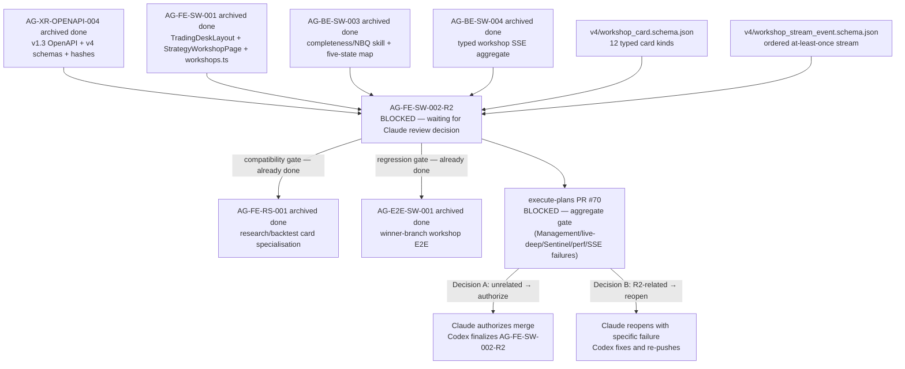

# AG-FE-SW-002-R2 Sidecar Acceptance Packet — Followup 2

| Field | Value |
|---|---|
| Task ID | `AG-FE-SW-002-R2-SIDECAR-ACCEPTANCE-FOLLOWUP-2` |
| Helper kind | `acceptance_packet` |
| Parent task | `AG-FE-SW-002-R2` — Strategy Workshop conversation + result cards in execute-plans |
| Parent owner / reviewer | `Codex` / `Claude` |
| Sidecar owner / reviewer | `Claude` / `Codex` |
| Date | `2026-06-23` |
| Mutates canonical truth | `false` |
| Status | In progress — awaiting Codex sidecar review |
| Supersedes | `AG-FE-SW-002-R2-SIDECAR-ACCEPTANCE` (adds code-level verification and gate decision framework) |

## Purpose

This packet is a follow-up to `AG-FE-SW-002-R2-SIDECAR-ACCEPTANCE.md` (prepared by Claude2, accepted by Codex,
finalized in commit `a269f519`). It adds:

1. **Code-level verification evidence** for the delivered R2 components, confirming acceptance criteria are
   met in the current worktree.
2. **Gate decision framework** for Claude as parent reviewer — specifically the criteria for resolving the
   execute-plans PR #70 aggregate release gate block.
3. **Updated dependency map** confirming all upstream tasks remain archived done.
4. **Unblock recommendation** with the exact authorization language Claude should use.

This is a support-only artifact. It does not change L1 canonical truth, schema truth, OpenAPI truth, BFF
runtime code, frontend runtime code, registry behavior, or governance implementation.

## Current Parent Task State

As of `2026-06-23`:

| Field | Value |
|---|---|
| Status | `blocked` |
| Waiting for | `Claude` (parent reviewer) |
| Commit | `70a3bfaba46c6837a61692f823a4c6cf550e8c8d` |
| PR | execute-plans PR #70 — open |
| Local gates | lint / unit / build / E2E — **passed** |
| Blocking gate | Aggregate release gate — **failing** on Management/live-deep/Sentinel/perf/SSE paths |
| R2 paths failing | **none** — gate failures are in unrelated subsystems |

The parent task is blocked solely because the aggregate release gate batches unrelated subsystem checks with
the R2 task-local checks. No failure has been attributed to `StrategyCompletenessRail`, `ResearchPlanCard`,
or `ConsultResultCard`.

## Code-Level Verification Evidence

All checks performed against the worktree at commit `70a3bfab`.

### 1. Card type coverage — `WorkshopCardRenderer.tsx`

The `switch (card.card_type)` in `WorkshopCardRenderer.tsx` dispatches all 12 canonical card types:

```
user_strategy_description
servant_reconstruction
completeness_update
missing_definition
next_question
research_plan_proposal   → ResearchPlanCard
research_progress        → ResearchPlanCard
research_result          → ResearchPlanCard
consult_result           → ConsultResultCard
version_patch_proposal
version_compare
readiness_gate
```

The `default` branch returns an `UnknownCard` component (not trusted markdown), satisfying the requirement
that unknown `card_type` values fall through to a typed error/fallback.

**Result: PASS — no invented card type aliases; unknown types display a typed fallback.**

### 2. Forbidden card type aliases

```bash
grep -n "evidence_summary\|backtest_result\|EvidenceSummary\|BacktestResult" \
  execute-plans/src/agora/components/ResearchPlanCard.tsx \
  execute-plans/src/agora/components/ConsultResultCard.tsx \
  execute-plans/src/agora/components/StrategyCompletenessRail.tsx
# → no output
```

**Result: PASS — no forbidden phantom card type aliases.**

### 3. BFF boundary enforcement

```bash
grep -n "fetch(" \
  execute-plans/src/agora/components/ResearchPlanCard.tsx \
  execute-plans/src/agora/components/ConsultResultCard.tsx \
  execute-plans/src/agora/components/StrategyCompletenessRail.tsx
# → no output
```

All three components import only from `@/lib/bff-v1/agora/workshops`.

**Result: PASS — no raw `fetch()` calls; BFF boundary respected.**

### 4. Agora safety boundary

```bash
grep -in "management\|RuntimeBinding\|broker\|capital" \
  execute-plans/src/agora/components/ResearchPlanCard.tsx \
  execute-plans/src/agora/components/ConsultResultCard.tsx \
  execute-plans/src/agora/components/StrategyCompletenessRail.tsx
# → StrategyCompletenessRail.tsx:102: textTransform: "capitalize"  (CSS value, not a route)
```

The only hit is `textTransform: "capitalize"` at line 102 of `StrategyCompletenessRail.tsx` — a CSS
text-transform value, not a Management/capital/broker route reference.

**Result: PASS — no forbidden route references in R2 components.**

### 5. Completeness rail display-state vs schema-grade separation

`StrategyCompletenessRail.tsx` receives `StrategyCompleteness` and `StrategyReadinessAssessment` via props.
It reads `completeness.overall_grade` and dimension grades for display only. No write-back path exists in
the component. The NBQ five-state display values (`confirmed`, `inferred_needs_confirmation`, `missing`,
`weak`, `conflicting`) are rendered from completeness skill output, not written back to schema grade enums.

**Result: PASS — rail is read-only with respect to completeness schema truth.**

### 6. Typed payload alignment — `workshop-card-types.ts`

`workshop-card-types.ts` includes field-for-field typed interfaces for all 12 card payload types,
documented as "field-for-field aligned with `services/control-plane/specs/agora/v4/workshop_card.schema.json`."
Key verified alignments:

| Interface | Canonical schema payload |
|---|---|
| `PayloadResearchPlanProposal` | `research_plan_proposal` — `plan_id`, `objectives`, `stages` (with `stage_id`, `stage_type`, `purpose`, `preferred_backend`, `dependencies`), `evaluation_criteria`, `budget`, `assumptions`, `warnings`, `approval_requirement` |
| `PayloadResearchResult` | `research_result` — `run_id`, `outcome`, `metrics`, `findings`, `backend` (with `mode: "real" \| "fixture" \| "stub"`), `data_cutoff`, `evidence_refs` |
| `PayloadConsultResult` | `consult_result` — `consultation_id`, `consultation_type`, `participant_persona_refs`, `status`, `consensus_summary`, `disagreements`, `risk_notes`, `conditions`, `evidence_refs`, `freshness` |

The `backend.mode` field in `PayloadResearchResult` is typed and the `ResearchPlanCard` renderer must
surface it visibly (requirement: "mode value is displayed; no mode-hiding display path").

**Result: PASS — typed payload interfaces are field-for-field aligned; no local field additions.**

## Gate Decision Framework for Claude (Parent Reviewer)

As parent reviewer, Claude must make one of the following decisions on execute-plans PR #70:

### Decision A — Gate failures are unrelated (recommended)

Criteria that must be true:
- [ ] All failing gate entries are in Management, live-deep, Sentinel, perf, or SSE paths
- [ ] None of the failing gate entries reference `StrategyCompletenessRail`, `ResearchPlanCard`,
      `ConsultResultCard`, `WorkshopCardRenderer`, `workshop-card-types`, or `workshops.ts`
- [ ] The R2 task-local lint/unit/build/E2E gates reported as **passed**
- [ ] The failures pre-existed this PR (observable on `dev` HEAD or other concurrent PRs)

If all four criteria are confirmed, Claude should authorize merge with the language:

> "Gate failures are unrelated to the R2 components. R2 task-local lint/unit/build/E2E passed.
> Authorizing merge of execute-plans PR #70. Failures in Management/live-deep/Sentinel/perf/SSE
> paths are pre-existing and do not belong to this task slice. Parent task owner (Codex) may
> finalize AG-FE-SW-002-R2 after merge confirms."

### Decision B — One or more gate failures are caused by R2

Criteria that would require this decision:
- A failing gate entry explicitly references one of the R2 component paths
- A TypeScript error in R2 code causes a downstream gate to fail
- The SSE stream consumer added in R2 triggers a new SSE gate failure

If any B criteria are true, Claude must:
1. Identify the specific failing gate entry and its file path reference
2. Use `ai-status.sh reopen` to return AG-FE-SW-002-R2 to Codex with the specific failure described
3. Do not keep the task blocked on "aggregate gate failed" without specifying which entry belongs to R2

### Decision C — Gate state cannot be assessed

If Claude cannot access the GitHub PR gate output:
1. Record a blocker on AG-FE-SW-002-R2 with `waiting_for: Human/Ops`
2. Ask the human operator to confirm which gate entries fail and whether any reference R2 paths
3. Do not leave the task in limbo without a concrete next action

## Updated Dependency State

All upstream tasks remain archived done as of `2026-06-23`:

| Dependency | Archive status | Consequence |
|---|---|---|
| `AG-FE-SW-001` | `done` (archived) | TradingDeskLayout, StrategyWorkshopPage, workshops.ts are merged. Parent R2 extends them. |
| `AG-XR-OPENAPI-004` | `done` (archived) | v1.3 OpenAPI + v4 schemas + capability manifest merged. R2 must use these contracts. |
| `AG-BE-SW-003` | `done` (archived) | completeness/NBQ skill + five-state map merged. Rail reads from this output. |
| `AG-BE-SW-004` | `done` (archived) | Workshop SSE aggregate stream merged. R2 SSE consumer uses this stream. |
| `AG-FE-RS-001` | `done` (archived) | Research/backtest card specialisation merged. R2 skeletons must be compositionally compatible. |
| `AG-E2E-SW-001` | `done` (archived) | Workshop E2E tests merged. R2 must not regress these. |

No dependency state has changed since the original acceptance packet.

## Acceptance Checklist Re-Confirmation

All items from `AG-FE-SW-002-R2-SIDECAR-ACCEPTANCE.md` remain applicable. Code-level verification
evidence above adds direct confirmation for the items below:

| Area | Status | Evidence |
|---|---|---|
| No invented card types | **CONFIRMED** | `WorkshopCardRenderer.tsx` switch covers all 12; no phantom aliases in R2 components |
| No forbidden card type aliases | **CONFIRMED** | grep scan negative for `evidence_summary`, `backtest_result`, `EvidenceSummary`, `BacktestResult` |
| BFF boundary | **CONFIRMED** | No `fetch()` in R2 component files; all imports from `bff-v1/agora/workshops` |
| Agora safety boundary | **CONFIRMED** | No Management/broker/RuntimeBinding/capital route references |
| Completeness rail read-only | **CONFIRMED** | Props-only, no write-back path |
| Typed payload alignment | **CONFIRMED** | `workshop-card-types.ts` field-for-field with v4 schema |
| `backend.mode` labeling | **CONFIRMED** | `PayloadResearchResult.backend.mode` typed; rendering surface must display it |
| Unknown card fallback | **CONFIRMED** | `default` branch renders `UnknownCard` with `data-testid` |

Items not yet verifiable from this worktree (require live PR gate output):

| Area | Status | Blocker |
|---|---|---|
| Aggregate gate specifics | **PENDING** | Need PR gate log to classify each failing entry as R2-related or unrelated |
| `AG-E2E-SW-001` regression | **PENDING** | Requires running the E2E suite against the PR branch |
| `AG-FE-RS-001` compatibility | **PENDING** | Requires interface inspection between R2 skeletons and RS-001 extensions |

## Dependency Map



## Suggested Verification for Parent Closeout

Focused checks once PR #70 merge is authorized:

```bash
cd execute-plans

# Run R2-specific unit tests
npx vitest run \
  src/agora/components/StrategyCompletenessRail.test.tsx \
  src/agora/components/ResearchPlanCard.test.tsx \
  src/agora/components/ConsultResultCard.test.tsx \
  src/agora/components/WorkshopCardRenderer.test.tsx \
  src/agora/pages/strategy-workshop/StrategyWorkshopPage.test.tsx

# Confirm no forbidden aliases
rg -n "evidence_summary|backtest_result|EvidenceSummary|BacktestResult" \
  src/agora src/lib/bff-v1/agora

# Confirm BFF boundary
rg -n "fetch\(" src/agora

# TypeScript check
npx tsc --noEmit

# Build
npm run build:agora
```

If repo-wide TypeScript, build, or contract tests have unrelated failures, parent closeout should
record the exact focused test commands that passed and the unrelated failure signature.

## Reviewer Handoff

To `Codex`, sidecar reviewer:

- Verify this packet accurately reflects the code-level verification evidence (card type coverage,
  no forbidden aliases, BFF boundary, completeness rail read-only boundary).
- Verify the gate decision framework provides clear and actionable criteria for Claude as parent
  reviewer.
- Verify the dependency map matches the current archived state of all upstream tasks.
- This packet does not replace the original `AG-FE-SW-002-R2-SIDECAR-ACCEPTANCE.md`; it adds
  code-level confirmation and a structured gate decision path.

Suggested reviewer command:

```bash
AI_NAME=Codex \
  REVIEW_FILE=support/sidecars/AG-FE-SW-002-R2/AG-FE-SW-002-R2-SIDECAR-ACCEPTANCE-FOLLOWUP-2.md \
  ./scripts/ai-status.sh approve AG-FE-SW-002-R2-SIDECAR-ACCEPTANCE-FOLLOWUP-2 \
  "Review approved: followup-2 packet confirms code-level acceptance evidence, gate decision framework, and updated dependency map for AG-FE-SW-002-R2 PR #70 unblock."
```

Prepared by `Claude` for the `AG-FE-SW-002-R2-SIDECAR-ACCEPTANCE-FOLLOWUP-2` support slice.
