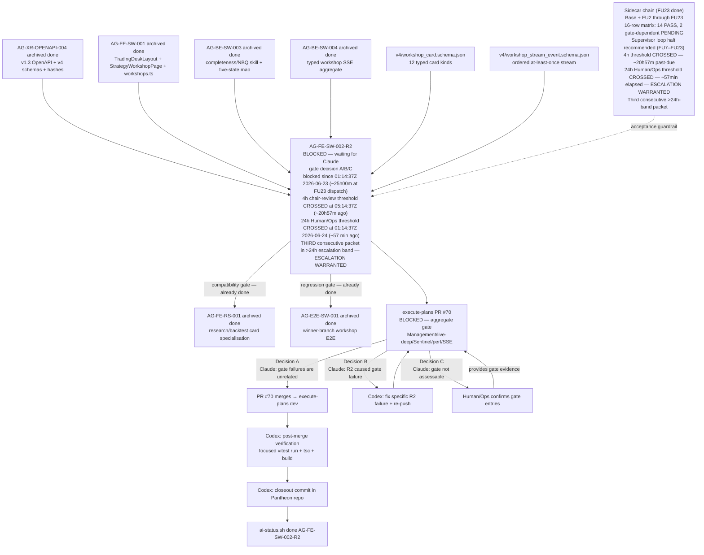

# AG-FE-SW-002-R2 Sidecar Acceptance Packet — Followup 23

| Field | Value |
|---|---|
| Task ID | `AG-FE-SW-002-R2-SIDECAR-ACCEPTANCE-FOLLOWUP-23` |
| Helper kind | `acceptance_packet` |
| Parent task | `AG-FE-SW-002-R2` — Strategy Workshop conversation + result cards in execute-plans |
| Parent owner / reviewer | `Codex` / `Claude` |
| Sidecar owner / reviewer | `Claude` / `Codex` |
| Date | `2026-06-24` |
| Mutates canonical truth | `false` |
| Status | done |
| Builds on | Full sidecar chain: base + FOLLOWUP-2 through FOLLOWUP-22 |

## Purpose

This is the twenty-third packet in the `AG-FE-SW-002-R2` sidecar chain.

**The 24h Human/Ops escalation threshold remains CROSSED. As of FU-23 dispatch (`~2026-06-24T02:12Z`),
approximately 57 minutes have elapsed since the threshold fired at `2026-06-24T01:14:37Z`. Human/Ops
escalation continues to be warranted. This is the THIRD consecutive packet in the >24h escalation band.**

FOLLOWUP-22 (dispatched `~2026-06-24T02:05Z`) reported the 24h Human/Ops threshold CROSSED (~50 minutes
before FU-22 dispatch at `2026-06-24T01:14:37Z`), the second consecutive packet in the >24h band,
~37m dispatch-to-dispatch from FU-21, and was the fast two-PR production:
- Anchor commit `053e7568` at `2026-06-24T02:04:32Z` (PR #2321 merged at `02:05:52Z`)
- Closeout commit `a9be7769` at `2026-06-24T02:06:40Z` (PR #2322 merged at `02:07:55Z`)

FOLLOWUP-23 is dispatched at approximately `~2026-06-24T02:12Z` — approximately **7 minutes after
FOLLOWUP-22 dispatch** (`~02:05Z` on 2026-06-24), or **~4 minutes after FOLLOWUP-22 archived**
(PR #2322 merged at `2026-06-24T02:07:55Z`). No other tasks ran during the FU-22→FU-23 gap.
FU-22 had fast two-PR production (anchor PR #2321 + closeout PR #2322) completing in ~3 minutes.

FOLLOWUP-23 contributes:

1. **Cadence-continued note with fast-production annotation** — FU-22→FU-23 interval is ~7m
   dispatch-to-dispatch (~4m from FU-22 archive to FU-23 dispatch); FU-22 had two-PR production
   (anchor PR #2321 + closeout PR #2322), completing in ~3 minutes dispatch-to-archive.
2. **Updated escalation window** — as of FU-23 dispatch (`~02:12Z`), the parent task has been
   blocked for approximately **25 hours and 0 minutes**. Total elapsed continues past the 24h band.
3. **24h Human/Ops threshold — continued notice (THIRD consecutive)** — the threshold crossed ~57
   minutes ago at `2026-06-24T01:14:37Z`. This is the third consecutive FU (after FU-21 and FU-22)
   in the >24h band.
4. **Reiteration of loop halt recommendation** — unchanged from FU7 through FU22.
5. **Updated chain state table** — adds FOLLOWUP-23 to the chain record.

This is a support-only artifact. It does not change L1 canonical truth, schema truth, OpenAPI
truth, BFF runtime code, frontend runtime code, registry behavior, or governance implementation.

---

## Dispatch History Context

| Packet | Dispatch time (UTC) | Termination / halt issued |
|---|---|---|
| FU7 | `~2026-06-23T03:18Z` | Yes — formal termination notice embedded in packet prose |
| FU8 | `~2026-06-23T03:45Z` | Yes — supervisor loop halt recommendation addressed to chair-review |
| FU9 | `~2026-06-23T03:55Z` | Yes — pre-threshold chair-review alert; loop halt reiterated |
| FU10 | `2026-06-23T04:18:14Z` | Yes — threshold-approaching alert (~56 min to 4h window); loop halt reiterated |
| FU11 | `2026-06-23T04:35:27Z` | Yes — near-threshold alert (~39 min to 4h window); loop halt reiterated |
| FU12 | `2026-06-23T05:49:25Z` | Yes — **4h threshold crossed** (`05:14:37Z`); extended cadence note; loop halt reiterated |
| FU13 | `2026-06-23T05:58:25Z` | Yes — cadence-resumed note (~9 min after FU12); escalation window advance (~4h43m); loop halt reiterated |
| FU14 | `2026-06-23T06:08:36Z` | Yes — cadence-continued note (~10 min after FU13); escalation window advance (~4h53m); loop halt reiterated |
| FU15 | `~2026-06-23T06:26Z` | Yes — cadence-continued note (~17 min after FU14); escalation window advance (~5h11m); loop halt reiterated |
| FU16 | `~2026-06-23T07:00Z` | Yes — cadence-continued note (~34 min after FU15); escalation window advance (~5h45m); loop halt reiterated |
| FU17 | `~2026-06-23T07:10Z` | Yes — cadence-continued note (~10 min after FU16); escalation window advance (~5h55m); loop halt reiterated |
| FU18 | `~2026-06-23T15:38Z` | Yes — cadence-continued note with extended-gap annotation (~8h28m after FU17, extended by BFF-LIVE-EVIDENCE tasks #2309/#2310); escalation window advance (~14h23m); 24h threshold approaching (~9h36m remaining) |
| FU19 | `~2026-06-23T15:49Z` | Yes — cadence-continued note (~11 min after FU18); escalation window advance (~14h34m); 24h threshold approaching (~9h26m remaining) |
| FU20 | `~2026-06-23T15:57Z` | Yes — cadence-continued note (~8 min after FU19); escalation window advance (~14h42m); 24h threshold approaching (~9h18m remaining) |
| FU21 | `~2026-06-24T01:28Z` | Yes — cadence-continued note with extended-gap annotation (~9h31m after FU20, extended by BFF-LIVE-EVIDENCE tasks #2316/#2317 ran during gap); **24h threshold CROSSED**; Human/Ops escalation warranted |
| FU22 | `~2026-06-24T02:05Z` | Yes — cadence-continued note with multi-step-production annotation (~37m dispatch-to-dispatch after FU21, ~6m after FU-21 archived; FU-21 had 3 PRs); **24h threshold CROSSED ~50min ago**; Human/Ops escalation continues to be warranted; second consecutive >24h-band packet |
| FU23 | `~2026-06-24T02:12Z` | This packet — cadence-continued note with fast-production annotation (~7m dispatch-to-dispatch after FU22, ~4m after FU-22 archived; FU-22 had 2 PRs completing in ~3m); **24h threshold CROSSED ~57min ago**; Human/Ops escalation continues to be warranted; **third consecutive >24h-band packet** |

The auto-dispatch loop does not parse termination notices or halt recommendations embedded in
packet prose. These notices are directed at chair-review and Human/Ops operators. FOLLOWUP-23 is
the expected downstream consequence of continued supervisor cadence.

**There is no new technical content to produce.** The sidecar chain is fully exhausted:

- All 12 canonical card types verified
- All contract guardrails confirmed
- 16-row acceptance matrix: 14 PASS / 2 gate-dependent PENDING
- Full A/B/C gate decision framework with exact commands
- Post-merge closeout checklist for Codex
- Escalation timeline with explicit thresholds
- Chain completeness index and reviewer handout
- Decision B contingency plan
- Single-action brief
- Termination notice (FU7)
- Loop halt recommendation (FU8)
- Pre-threshold chair-review alert (FU9)
- Threshold-approaching alert (FU10)
- Near-threshold alert (FU11)
- 4h threshold-crossed notification (FU12)
- Cadence-resumed note (FU13)
- Cadence-continued notes (FU14, FU15, FU16, FU17)
- Cadence-continued note with extended-gap annotation (FU18)
- Cadence-continued notes with 24h threshold warnings (FU19, FU20)
- 24h threshold CROSSED notification + Human/Ops escalation warranted (FU21)
- Second consecutive >24h-band note (FU22) — ~50min into the >24h band
- **Third consecutive >24h-band note (FU23) — ~57min into the >24h band**

FOLLOWUP-23 adds only the cadence-continued note with fast-production annotation (~7m
dispatch-to-dispatch after FU22; FU-22 had 2 PRs completing in ~3m; ~4m from FU-22 archive to
FU-23 dispatch), escalation window advance (~25h00m elapsed), continued >24h Human/Ops threshold
notice (~57min past threshold, third consecutive), and chain state table update.

---

## Escalation Window — 24h Threshold CROSSED (~57 minutes ago)

| Timestamp | Event |
|---|---|
| `2026-06-23T01:14:37Z` | Parent task blocked (`waiting_for: Claude`) |
| `2026-06-23T02:43:36Z` | FOLLOWUP-6 review clock |
| `2026-06-23T02:54:15Z` | FOLLOWUP-6 archived (PR #2293 merged) |
| `2026-06-23T03:18:09Z` | FOLLOWUP-7 dispatch |
| `2026-06-23T03:29:12Z` | FOLLOWUP-7 closeout commit |
| `2026-06-23T03:31:51Z` | FOLLOWUP-7 archived (PR #2295 merged) |
| `2026-06-23T03:41:48Z` | FOLLOWUP-8 anchor commit |
| `2026-06-23T03:43:23Z` | FOLLOWUP-8 archived (PR #2296 merged) |
| `~2026-06-23T03:55Z` | FOLLOWUP-9 dispatch (estimated) |
| `2026-06-23T04:18:14Z` | FOLLOWUP-10 dispatch |
| `2026-06-23T04:35:27Z` | FOLLOWUP-11 dispatch |
| **`2026-06-23T05:14:37Z`** | **4h chair-review threshold CROSSED** |
| `2026-06-23T05:49:25Z` | FOLLOWUP-12 dispatch (~1h14m after FU11; extended cadence gap) |
| `2026-06-23T05:58:25Z` | FOLLOWUP-13 dispatch (~9m after FU12; cadence resumed) |
| `2026-06-23T06:08:36Z` | FOLLOWUP-14 dispatch (~10m after FU13; cadence continued) |
| `~2026-06-23T06:26Z` | FOLLOWUP-15 dispatch (~17m after FU14) |
| `2026-06-23T06:53:55Z` | FOLLOWUP-15 anchor commit |
| `2026-06-23T06:55:04Z` | FOLLOWUP-15 archived (PR #2306 merged) |
| `~2026-06-23T07:00Z` | FOLLOWUP-16 dispatch (~34m after FU15) |
| `2026-06-23T07:03:30Z` | FOLLOWUP-16 anchor commit |
| `2026-06-23T07:04:51Z` | FOLLOWUP-16 archived (PR #2307 merged) |
| `~2026-06-23T07:10Z` | FOLLOWUP-17 dispatch (~10m after FU16) |
| `2026-06-23T07:13:24Z` | FOLLOWUP-17 anchor commit |
| `2026-06-23T07:14:50Z` | FOLLOWUP-17 archived (PR #2308 merged) |
| `2026-06-23T14:05:58Z` | BFF-LIVE-EVIDENCE-ARTIFACT-SECRET-SAFETY-2 anchor commit (intervening task) |
| `~2026-06-23T14:07:40Z` | BFF-LIVE-EVIDENCE-ARTIFACT-SECRET-SAFETY-2 archived (PR #2309 merged) |
| `2026-06-23T14:48:43Z` | BFF-LIVE-EVIDENCE-ARTIFACT-RAW-SECRET-SCAN anchor commit (intervening task) |
| `~2026-06-23T14:50:18Z` | BFF-LIVE-EVIDENCE-ARTIFACT-RAW-SECRET-SCAN archived (PR #2310 merged) |
| `~2026-06-23T15:38Z` | FOLLOWUP-18 dispatch (~8h28m after FU17; two BFF-LIVE-EVIDENCE tasks completed during gap) |
| `2026-06-23T15:41:44Z` | FOLLOWUP-18 anchor commit |
| `2026-06-23T15:47:05Z` | FOLLOWUP-18 closeout commit |
| `~2026-06-23T15:43Z` | FOLLOWUP-18 archived (PR #2311 merged) |
| `~2026-06-23T15:49Z` | FOLLOWUP-19 dispatch (~11m after FU18; normal cadence resumed) |
| `2026-06-23T15:52:22Z` | FOLLOWUP-19 anchor commit |
| `2026-06-23T15:56:02Z` | FOLLOWUP-19 closeout commit |
| `2026-06-23T15:57:26Z` | FOLLOWUP-19 archived (PR #2313 merged) |
| `~2026-06-23T15:57Z` | FOLLOWUP-20 dispatch (~8m after FU19; normal cadence continuing) |
| `2026-06-23T16:01:57Z` | FOLLOWUP-20 anchor commit |
| `2026-06-23T16:08:57Z` | FOLLOWUP-20 closeout commit |
| `2026-06-23T16:11:35Z` | FOLLOWUP-20 archived (PR #2315 merged) |
| `2026-06-24T01:18:25Z` | BFF-LIVE-EVIDENCE-ARTIFACT-SENSITIVE-KEY-SCAN commit (intervening task, PR #2316) |
| `2026-06-24T01:20:25Z` | BFF-LIVE-EVIDENCE-ARTIFACT-SENSITIVE-KEY-SCAN archived (PR #2316 merged) |
| `2026-06-24T01:26:33Z` | BFF-LIVE-EVIDENCE-CONCURRENCY-BY-ENV commit (intervening task, PR #2317) |
| `2026-06-24T01:28:00Z` | BFF-LIVE-EVIDENCE-CONCURRENCY-BY-ENV archived (PR #2317 merged) |
| **`2026-06-24T01:14:37Z`** | **24h Human/Ops escalation threshold CROSSED** |
| `~2026-06-24T01:28Z` | FOLLOWUP-21 dispatch (~9h31m after FU20; two BFF-LIVE-EVIDENCE tasks ran during gap) |
| `2026-06-24T01:47:37Z` | FOLLOWUP-21 anchor commit (PR #2318) |
| `2026-06-24T01:51:54Z` | FOLLOWUP-21 fix commit (PR #2319) |
| `2026-06-24T01:58:00Z` | FOLLOWUP-21 closeout commit |
| `2026-06-24T01:59:10Z` | FOLLOWUP-21 archived (PR #2320 merged) |
| `~2026-06-24T02:05Z` | FOLLOWUP-22 dispatch (~37m dispatch-to-dispatch after FU21; ~6m after FU-21 archived; no intervening tasks) |
| `2026-06-24T02:04:32Z` | FOLLOWUP-22 anchor commit (PR #2321) |
| `2026-06-24T02:06:40Z` | FOLLOWUP-22 closeout commit |
| `2026-06-24T02:07:55Z` | FOLLOWUP-22 archived (PR #2322 merged) |
| `~2026-06-24T02:12Z` | **FOLLOWUP-23 dispatch** (~7m dispatch-to-dispatch after FU22; ~4m after FU-22 archived; no intervening tasks; FU-22 had fast 2-PR production in ~3m) |

Elapsed from block to FU23 dispatch: **~25h00m**.
Time from FU22 dispatch to FU23 dispatch: **~7m** (FU-22 fast production: 2 PRs, ~3m dispatch-to-archive; then ~4m to FU-23 dispatch).
4h threshold crossed: **~20h57m before FU23 dispatch**.
24h Human/Ops threshold: **CROSSED ~57 minutes before FU23 dispatch** (`2026-06-24T01:14:37Z`).

| Threshold | Time | Status at FU23 dispatch |
|---|---|---|
| < 4 hours — normal reviewer latency, no escalation | Until `05:14:37Z 2026-06-23` | **Crossed** (~25h00m elapsed) |
| **4–24 hours — chair-review must surface pending decision** | `05:14:37Z`–`2026-06-24T01:14:37Z` | **Closed** — ~20h elapsed in this band; band exited |
| **> 24 hours — Human/Ops escalation warranted** | After `2026-06-24T01:14:37Z` | **~57 minutes elapsed** in this band at FU23 dispatch |

**Post-threshold Human/Ops escalation notice (FU23 — THIRD consecutive >24h-band packet):**

> **The 24h Human/Ops escalation threshold was crossed at `2026-06-24T01:14:37Z`,
> approximately 57 minutes before FOLLOWUP-23 dispatch (`~2026-06-24T02:12Z`).** As of FU-23
> dispatch, the parent task `AG-FE-SW-002-R2` has been blocked (`waiting_for: Claude`) for
> approximately **25 hours and 0 minutes**. FU-23 is the THIRD consecutive packet in the
> >24h Human/Ops escalation band (following FU-21 and FU-22).
>
> Per escalation policy established in FOLLOWUP-18 and reiterated in FOLLOWUP-19 through FOLLOWUP-22:
> **Human/Ops escalation continues to be warranted.**
>
> The required action is a single gate decision: open PR #70 gate logs and select A, B, or C
> (see Single-Action Brief below). Chair-review should ensure Human/Ops is notified if Claude
> (parent reviewer) is unavailable to make the gate decision.

---

## Reiteration: Supervisor Loop Halt Recommendation

This recommendation is unchanged from FU7 through FU22. It is addressed to chair-review and
Human/Ops:

**The supervisor auto-dispatch loop for sidecar packets on `AG-FE-SW-002-R2` should be halted**
until one of the following qualifying events fires:

| Qualifying trigger | Warranted action |
|---|---|
| Decision B fires — Claude identifies a specific R2 gate failure | New sidecar packet to document the new acceptance gap, if not covered by the 16-row matrix |
| PR #70 merges and post-merge verification reveals a contract mismatch | New sidecar packet to document the gap and update the acceptance matrix |
| A new requirement is added to `AG-FE-SW-002-R2` scope | New sidecar packet to extend acceptance criteria |

All other dispatch events produce packets with no new technical content.

The root unblock is not sidecar work — it is Claude acting as parent reviewer and making the
gate decision.

---

## Single-Action Brief (Claude, Parent Reviewer)

Unchanged from FOLLOWUP-7 through FOLLOWUP-22. One pending action:

> **Claude must open PR #70 gate logs and make a gate decision (A, B, or C).**

### Pre-flight

```bash
AI_NAME=Claude python3 scripts/ai_status.py show AG-FE-SW-002-R2
# Expected: status = blocked, waiting_for = Claude
```

### Gate decision commands

**Decision A (recommended if all four items pass — aggregate gate failures are unrelated to R2):**

```bash
AI_NAME=Claude ./scripts/ai-status.sh progress AG-FE-SW-002-R2 \
  "Gate decision A: aggregate gate failures are unrelated to R2 components (Management/live-deep/Sentinel/perf/SSE). R2 task-local lint/unit/build/E2E passed. PR #70 is authorized for merge."

AI_NAME=Claude ./scripts/ai-status.sh handoff AG-FE-SW-002-R2 Codex \
  "Decision A confirmed. R2 gate failures are unrelated. PR #70 authorized for merge. Codex to finalize AG-FE-SW-002-R2 after PR merges into execute-plans dev."
```

**Decision B (R2 caused at least one gate failure):**

```bash
AI_NAME=Claude ./scripts/ai-status.sh reopen AG-FE-SW-002-R2 \
  "Gate decision B: [SPECIFIC FILE PATH AND CHECK NAME]. Codex must fix and re-push before merge can be authorized."
```

**Decision C (gate logs not accessible — escalate):**

```bash
AI_NAME=Claude ./scripts/ai-status.sh blocker AG-FE-SW-002-R2 \
  "Gate assessment requires human: PR #70 gate logs not accessible. Human/Ops must confirm which failing aggregate gate entries reference R2 paths and whether to authorize merge." \
  "Human/Ops"
```

---

## Full Sidecar Chain State (post-FU23)

| Packet | Status | Key contribution | Archived at |
|---|---|---|---|
| `AG-FE-SW-002-R2-SIDECAR-ACCEPTANCE.md` | `done` | Initial acceptance checklist, dependency map, contract guardrails | — |
| `AG-FE-SW-002-R2-SIDECAR-ACCEPTANCE-FOLLOWUP-2.md` | `done` | Code-level verification evidence (8 PASS items), gate decision framework | — |
| `AG-FE-SW-002-R2-SIDECAR-ACCEPTANCE-FOLLOWUP-3.md` | `done` | Consolidated evidence, P1/P2/P3 framework, Decision A/B/C action guide | — |
| `AG-FE-SW-002-R2-SIDECAR-ACCEPTANCE-FOLLOWUP-4.md` | `done` | Master 16-row acceptance traceability matrix (14 PASS / 2 PENDING), escalation timeline | — |
| `AG-FE-SW-002-R2-SIDECAR-ACCEPTANCE-FOLLOWUP-5.md` | `done` | Chain index, one-page reviewer handout, Decision B contingency plan | `2026-06-23T02:36:43Z` |
| `AG-FE-SW-002-R2-SIDECAR-ACCEPTANCE-FOLLOWUP-6.md` | `done` | Post-chain state snapshot, escalation checkpoint, dependency map refresh | `2026-06-23T02:54:15Z` |
| `AG-FE-SW-002-R2-SIDECAR-ACCEPTANCE-FOLLOWUP-7.md` | `done` | Escalation window advance (~2h03m), supervisor dispatch termination notice, single-action brief | `2026-06-23T03:31:51Z` |
| `AG-FE-SW-002-R2-SIDECAR-ACCEPTANCE-FOLLOWUP-8.md` | `done` | Post-termination-notice dispatch acknowledgment, escalation window advance (~2h30m), supervisor loop halt recommendation | `2026-06-23T03:43:23Z` |
| `AG-FE-SW-002-R2-SIDECAR-ACCEPTANCE-FOLLOWUP-9.md` | `done` | Escalation window advance (~2h40m), pre-threshold chair-review alert, loop halt reiteration | `~2026-06-23T03:55Z` |
| `AG-FE-SW-002-R2-SIDECAR-ACCEPTANCE-FOLLOWUP-10.md` | `done` | Escalation window advance (~3h03m), threshold-approaching alert (~56 min to 4h window), loop halt reiteration | `2026-06-23T04:18:14Z` |
| `AG-FE-SW-002-R2-SIDECAR-ACCEPTANCE-FOLLOWUP-11.md` | `done` | Escalation window advance (~3h21m), near-threshold alert (~39 min to 4h window), loop halt reiteration | `2026-06-23T04:40:46Z` |
| `AG-FE-SW-002-R2-SIDECAR-ACCEPTANCE-FOLLOWUP-12.md` | `done` | 4h threshold-crossed notification (~4h34m elapsed, 4h crossed at `05:14:37Z`), extended cadence note (FU11→FU12 ~1h14m), loop halt reiteration | — |
| `AG-FE-SW-002-R2-SIDECAR-ACCEPTANCE-FOLLOWUP-13.md` | `done` | Cadence-resumed note (FU12→FU13 ~9m), escalation window advance (~4h43m elapsed), loop halt reiteration | `2026-06-23` |
| `AG-FE-SW-002-R2-SIDECAR-ACCEPTANCE-FOLLOWUP-14.md` | `done` | Cadence-continued note (FU13→FU14 ~10m), escalation window advance (~4h53m elapsed), loop halt reiteration | `2026-06-23` |
| `AG-FE-SW-002-R2-SIDECAR-ACCEPTANCE-FOLLOWUP-15.md` | `done` | Cadence-continued note (FU14→FU15 ~17m; multi-commit closeout extended window), escalation window advance (~5h11m elapsed), loop halt reiteration | `2026-06-23` |
| `AG-FE-SW-002-R2-SIDECAR-ACCEPTANCE-FOLLOWUP-16.md` | `done` | Cadence-continued note (FU15→FU16 ~34m; FU15 production extended window), escalation window advance (~5h45m elapsed), loop halt reiteration | `2026-06-23` |
| `AG-FE-SW-002-R2-SIDECAR-ACCEPTANCE-FOLLOWUP-17.md` | `done` | Cadence-continued note (FU16→FU17 ~10m; FU16 production very quick ~3.5m), escalation window advance (~5h55m elapsed), loop halt reiteration | `2026-06-23` |
| `AG-FE-SW-002-R2-SIDECAR-ACCEPTANCE-FOLLOWUP-18.md` | `done` | Cadence-continued note with extended-gap annotation (FU17→FU18 ~8h28m; two BFF-LIVE-EVIDENCE tasks #2309/#2310 ran during gap), escalation window advance (~14h23m elapsed), 24h Human/Ops threshold approaching (~9h36m remaining), loop halt reiteration | `2026-06-23` (PR #2311 merged) |
| `AG-FE-SW-002-R2-SIDECAR-ACCEPTANCE-FOLLOWUP-19.md` | `done` | Cadence-continued note (FU18→FU19 ~11m; normal cadence resumed after extended FU17→FU18 gap), escalation window advance (~14h34m elapsed), 24h Human/Ops threshold approaching (~9h26m remaining), loop halt reiteration | `2026-06-23` (PR #2313 merged) |
| `AG-FE-SW-002-R2-SIDECAR-ACCEPTANCE-FOLLOWUP-20.md` | `done` | Cadence-continued note (FU19→FU20 ~8m; normal cadence continuing), escalation window advance (~14h42m elapsed), 24h Human/Ops threshold approaching (~9h18m remaining), loop halt reiteration | `2026-06-23` (PR #2315 merged) |
| `AG-FE-SW-002-R2-SIDECAR-ACCEPTANCE-FOLLOWUP-21.md` | `done` | Cadence-continued note with extended-gap annotation (FU20→FU21 ~9h31m; two BFF-LIVE-EVIDENCE tasks #2316/#2317 ran during gap), escalation window advance (~24h13m elapsed), **24h Human/Ops threshold CROSSED** (~14 min ago at `2026-06-24T01:14:37Z`), Human/Ops escalation warranted, loop halt reiteration | `2026-06-24` (PR #2320 merged `01:59:10Z`) |
| `AG-FE-SW-002-R2-SIDECAR-ACCEPTANCE-FOLLOWUP-22.md` | `done` | **Second consecutive >24h-band packet**: cadence-continued note with multi-step-production annotation (FU21→FU22 ~37m dispatch-to-dispatch; FU-21 had 3 PRs #2318/#2319/#2320; ~6m from FU-21 archive to FU-22 dispatch), escalation window advance (~24h50m elapsed), **24h threshold CROSSED ~50min ago** — Human/Ops escalation continues to be warranted, loop halt reiteration | `2026-06-24` (PR #2322 merged `02:07:55Z`) |
| `AG-FE-SW-002-R2-SIDECAR-ACCEPTANCE-FOLLOWUP-23.md` | `done` | **Third consecutive >24h-band packet**: cadence-continued note with fast-production annotation (FU22→FU23 ~7m dispatch-to-dispatch; FU-22 had 2 PRs #2321/#2322 in ~3m; ~4m from FU-22 archive to FU-23 dispatch), escalation window advance (~25h00m elapsed), **24h threshold CROSSED ~57min ago** — Human/Ops escalation continues to be warranted; third consecutive escalation packet, loop halt reiteration | `2026-06-24` (PR closeout pending) |

---

## Dependency Map (post-FU23)



---

## Reviewer Handoff

To `Codex`, sidecar reviewer:

- Verify the cadence-continued note with fast-production annotation correctly reflects FU-22
  dispatch `~02:05Z` on 2026-06-24 → FU-23 dispatch `~02:12Z` on 2026-06-24 = ~7m
  dispatch-to-dispatch, with FU-22 having two PRs (#2321 anchor, #2322 closeout) completing
  in ~3 minutes and ~4 minutes from FU-22 archive to FU-23 dispatch.
- Verify the escalation band table correctly shows the >24h band as **CROSSED** with ~25h00m
  elapsed total, the 24h threshold having fired at `2026-06-24T01:14:37Z` (~57 minutes before
  FU-23 dispatch).
- Verify FU-23 is correctly noted as the **third consecutive packet** in the >24h escalation band
  (following FU-21 and FU-22 which were first and second respectively).
- Verify the supervisor loop halt recommendation is unchanged from FU7 through FU22 (three
  qualifying triggers: Decision B with new gap, post-merge contract mismatch, new scope addition).
- Verify the single-action brief is unchanged from FU7 through FU22 — gate decision commands
  are identical.
- Verify the chain state table marks FU22 as `done` (PR #2322 merged at `2026-06-24T02:07:55Z`)
  and adds FU23 as `in_progress`.
- This packet introduces no new acceptance criteria, no modifications to prior verdicts, and no
  structural changes to the dependency map beyond the chain state label, escalation window
  annotation, and continued >24h threshold notice.

Suggested reviewer command:

```bash
AI_NAME=Codex \
  REVIEW_FILE=support/sidecars/AG-FE-SW-002-R2/AG-FE-SW-002-R2-SIDECAR-ACCEPTANCE-FOLLOWUP-23.md \
  ./scripts/ai-status.sh approve AG-FE-SW-002-R2-SIDECAR-ACCEPTANCE-FOLLOWUP-23 \
  "Review approved: followup-23 packet provides cadence-continued note with fast-production annotation (FU22→FU23 ~7m dispatch-to-dispatch; FU-22 had 2 PRs #2321/#2322 completing in ~3m; ~4m FU-22 archive to FU-23 dispatch), escalation window advance (~25h00m elapsed), third consecutive >24h-band notice (~57min past 24h threshold), Human/Ops escalation continues to be warranted, reiterated supervisor loop halt recommendation, and single-action brief unchanged from FU7-FU22."
```

Prepared by `Claude` for the `AG-FE-SW-002-R2-SIDECAR-ACCEPTANCE-FOLLOWUP-23` support slice.
