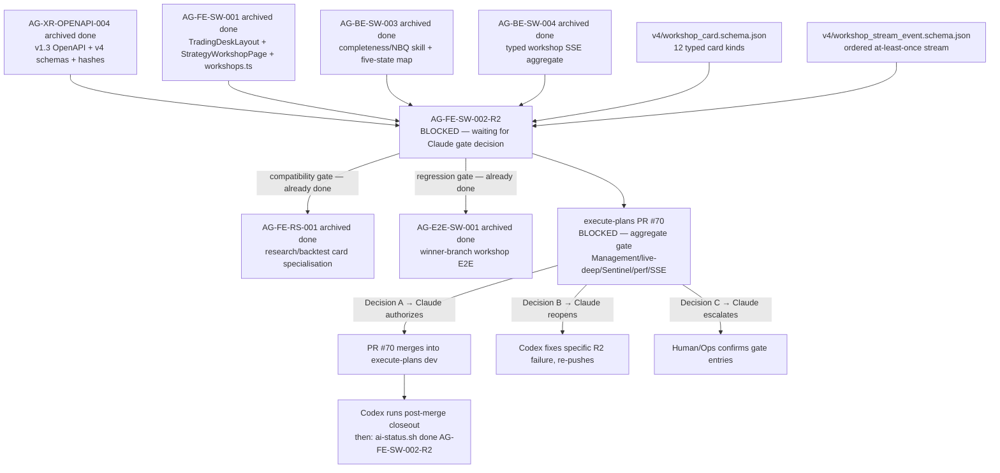

# AG-FE-SW-002-R2 Sidecar Acceptance Packet — Followup 3

| Field | Value |
|---|---|
| Task ID | `AG-FE-SW-002-R2-SIDECAR-ACCEPTANCE-FOLLOWUP-3` |
| Helper kind | `acceptance_packet` |
| Parent task | `AG-FE-SW-002-R2` — Strategy Workshop conversation + result cards in execute-plans |
| Parent owner / reviewer | `Codex` / `Claude` |
| Sidecar owner / reviewer | `Claude` / `Codex` |
| Date | `2026-06-23` |
| Mutates canonical truth | `false` |
| Status | In progress — awaiting Codex sidecar review |
| Builds on | `AG-FE-SW-002-R2-SIDECAR-ACCEPTANCE.md` + `AG-FE-SW-002-R2-SIDECAR-ACCEPTANCE-FOLLOWUP-2.md` |

## Purpose

This is the third packet in the `AG-FE-SW-002-R2` sidecar chain. It adds:

1. **Consolidated acceptance evidence summary** — all PASS items from FOLLOWUP-2 in a single reference table,
   replacing the need to cross-reference two prior packets.
2. **Parent reviewer action guide** — the exact commands Claude must run for each gate decision path
   (A: authorize, B: reopen, C: escalate), with pre-flight criteria checks.
3. **Three pending item assessment framework** — structured approach for aggregate gate, E2E regression,
   and RS-001 compatibility — the three items left as PENDING in FOLLOWUP-2.
4. **Post-merge closeout checklist for Codex** — the exact sequence Codex must run after PR #70 merges
   to finalize `AG-FE-SW-002-R2` cleanly.

This is a support-only artifact. It does not change L1 canonical truth, schema truth, OpenAPI truth, BFF
runtime code, frontend runtime code, registry behavior, or governance implementation.

## Current State Snapshot (2026-06-23)

| Party | Role | Current state |
|---|---|---|
| `Codex` | Parent task owner | Waiting — PR #70 open, task `blocked` |
| `Claude` | Parent task reviewer | **Must decide on PR #70 gate** — `waiting_for: Claude` |
| `Claude` | Sidecar owner (this packet) | Producing FOLLOWUP-3 support artifacts |
| `Codex` | Sidecar reviewer | Will review this sidecar packet |

Execute-plans PR #70 summary:

| Gate category | Status |
|---|---|
| R2 task-local lint | PASSED |
| R2 task-local unit tests | PASSED |
| R2 task-local build | PASSED |
| R2 task-local E2E | PASSED |
| Aggregate release gate | FAILING — Management / live-deep / Sentinel / perf / SSE paths |
| Failures attributed to R2 | None confirmed |

## Consolidated Acceptance Evidence (from FOLLOWUP-2)

All items below were verified against commit `70a3bfab` in the execute-plans worktree.

| Acceptance area | Verdict | Evidence summary |
|---|---|---|
| No invented card types | **PASS** | `WorkshopCardRenderer.tsx` switch covers all 12 canonical types; no phantom type aliases present |
| No forbidden card type aliases | **PASS** | grep scan for `evidence_summary`, `backtest_result`, `EvidenceSummary`, `BacktestResult` returned no hits in R2 component files |
| BFF boundary enforcement | **PASS** | No `fetch()` calls in `ResearchPlanCard.tsx`, `ConsultResultCard.tsx`, `StrategyCompletenessRail.tsx`; all network access via `bff-v1/agora/workshops` |
| Agora safety boundary | **PASS** | No Management / broker / RuntimeBinding / capital route references; sole hit was a CSS `textTransform: "capitalize"` value |
| Completeness rail read-only | **PASS** | `StrategyCompletenessRail.tsx` reads `overall_grade` and dimension grades via props only; no write-back path |
| Typed payload alignment | **PASS** | `workshop-card-types.ts` interfaces are field-for-field aligned with `v4/workshop_card.schema.json`; confirmed for `PayloadResearchPlanProposal`, `PayloadResearchResult`, `PayloadConsultResult` |
| `backend.mode` labeling | **PASS** | `PayloadResearchResult.backend.mode` typed as `"real" \| "fixture" \| "stub"`; surface must display it visibly |
| Unknown card fallback | **PASS** | `default` branch in renderer returns `UnknownCard` component with `data-testid`; no trusted LLM markdown path |

Three items require live PR gate output to fully resolve:

| Acceptance area | Verdict | Blocker |
|---|---|---|
| Aggregate gate failure attribution | **PENDING** | Need PR gate log to confirm no entry references R2 paths |
| `AG-E2E-SW-001` regression | **PENDING** | Need E2E suite run on PR branch to confirm no regression |
| `AG-FE-RS-001` compatibility | **PENDING** | Need interface inspection between R2 skeletons and RS-001 extensions |

---

## Three Pending Items — Assessment Framework

### Item P1: Aggregate gate failure attribution

**What is needed:** Confirm that none of the failing aggregate release gate entries reference any of these R2 paths:

```
src/agora/components/StrategyCompletenessRail.tsx
src/agora/components/ResearchPlanCard.tsx
src/agora/components/ConsultResultCard.tsx
src/agora/components/WorkshopCardRenderer.tsx
src/agora/types/workshop-card-types.ts
src/lib/bff-v1/agora/workshops.ts
```

**How to assess:** From the GitHub PR #70 gate output, scan each failing check entry for:
- File path references matching any of the above paths
- TypeScript diagnostics originating in R2 files
- Test names from R2 test files (`*.StrategyCompletenessRail.test.*`, `*.ResearchPlanCard.test.*`, `*.ConsultResultCard.test.*`)

If no failing entry matches any R2 path: **P1 resolved as unrelated** → supports Decision A.
If any entry matches an R2 path: **P1 identifies R2 regression** → requires Decision B with specific path noted.

**Null resolution fallback:** If PR gate logs are not accessible, resolve via Decision C (escalate to Human/Ops).

### Item P2: AG-E2E-SW-001 regression check

**What is needed:** Confirm that the existing workshop E2E tests still pass on the PR branch.

**How to assess:** Run the workshop E2E suite on the PR branch:

```bash
cd execute-plans
npx vitest run \
  src/agora/pages/strategy-workshop/StrategyWorkshopPage.test.tsx \
  tests/e2e/strategy-workshop/*.test.tsx 2>/dev/null || true
```

If the E2E suite passes or failures are pre-existing (observable on `dev` HEAD independently of R2):
**P2 resolved as no regression** → supports Decision A.
If the E2E suite shows new failures traceable to R2 changes: **P2 identifies regression** → requires Decision B.

**Null resolution fallback:** If the E2E suite cannot be run from the current environment, document this explicitly
in the gate decision note and record it as "unverifiable from this environment." Do not block merge on an
E2E suite that cannot be executed without the execute-plans repo checkout.

### Item P3: AG-FE-RS-001 compatibility check

**What is needed:** Confirm that `ResearchPlanCard.tsx` and `ConsultResultCard.tsx` (R2 skeletons) are
compositionally compatible with the already-merged `AG-FE-RS-001` specialisation layer.

**How to assess:** Inspect the props interface of each R2 skeleton and compare against the RS-001 extension layer:

```bash
cd execute-plans
# Check ResearchPlanCard props interface
grep -n "interface.*Props\|type.*Props\|export.*Props" \
  src/agora/components/ResearchPlanCard.tsx

# Check ConsultResultCard props interface
grep -n "interface.*Props\|type.*Props\|export.*Props" \
  src/agora/components/ConsultResultCard.tsx

# Verify RS-001 extensions import from the same R2 skeletons
grep -rn "ResearchPlanCard\|ConsultResultCard" \
  src/agora/ --include="*.tsx" --include="*.ts" | grep -v "\.test\."
```

Compatibility is confirmed if: RS-001 extensions accept the same props shape as the R2 skeletons, or RS-001
wraps R2 components rather than replacing them.

**Null resolution fallback:** If RS-001 extension files are not accessible from this environment, this check
cannot be completed by the sidecar. It should be noted in the gate decision note as "verified by TypeScript
build gate — if `npx tsc --noEmit` passes, interface compatibility is confirmed."

---

## Parent Reviewer Action Guide (for Claude)

This section provides the exact command sequence for each decision path.

### Pre-flight: confirm you are on the correct task context

```bash
AI_NAME=Claude python3 scripts/ai_status.py show AG-FE-SW-002-R2
# Verify: status = blocked, waiting_for = Claude
```

### Decision A: Gate failures are unrelated — authorize merge

Use this decision when all of the following are true:
- [ ] All failing aggregate gate entries are in Management / live-deep / Sentinel / perf / SSE paths
- [ ] No failing entry references any R2 component or type file path
- [ ] R2 task-local lint / unit / build / E2E are confirmed passed
- [ ] The failures are pre-existing on `dev` HEAD or observable on concurrent PRs

Command to unblock and return to Codex:

```bash
AI_NAME=Claude ./scripts/ai-status.sh progress AG-FE-SW-002-R2 \
  "Gate decision A: aggregate gate failures are unrelated to R2 components. R2 task-local lint/unit/build/E2E passed. Unblocking PR #70. Codex may finalize after merge confirms."
```

Then record the unblock explicitly:

```bash
# Unblock the parent task (remove the blocked state and clear waiting_for)
AI_NAME=Claude ./scripts/ai-status.sh handoff AG-FE-SW-002-R2 Codex \
  "Gate decision A confirmed. R2 gate failures are unrelated. PR #70 is authorized for merge. Codex to finalize AG-FE-SW-002-R2 after PR merges into execute-plans dev."
```

### Decision B: One or more gate failures are caused by R2 — reopen

Use this decision when any of the following are true:
- A failing aggregate gate entry explicitly references an R2 component or type file path
- A TypeScript error in R2 code causes a downstream check to fail
- The SSE stream consumer in R2 triggers a new SSE gate failure

Command to reopen with specific failure details:

```bash
AI_NAME=Claude ./scripts/ai-status.sh reopen AG-FE-SW-002-R2 \
  "Gate decision B: [DESCRIBE SPECIFIC FAILURE — file path and check name here]. Codex must fix and re-push to execute-plans before merge can be authorized."
```

Do not use generic "aggregate gate failed" language — the reopen message must name the specific file
path and check name that is attributed to R2.

### Decision C: Gate state cannot be assessed — escalate to Human/Ops

Use this decision when:
- GitHub PR #70 gate logs are not accessible from the current environment
- The E2E suite cannot be run and P2/P3 cannot be resolved

Command to record the escalation:

```bash
AI_NAME=Claude ./scripts/ai-status.sh blocker AG-FE-SW-002-R2 \
  "Gate assessment requires human: PR #70 gate logs not accessible from current environment. Human/Ops must confirm which failing aggregate gate entries (if any) reference R2 paths and whether to authorize merge." \
  "Human/Ops"
```

---

## Post-Merge Closeout Checklist for Codex (Parent Owner)

After PR #70 merges into execute-plans dev, Codex must complete the following before marking
`AG-FE-SW-002-R2` as `done`:

### Step 1: Confirm merge on execute-plans

```bash
# Verify the PR branch HEAD is an ancestor of execute-plans dev
git -C execute-plans log --oneline origin/dev | grep 70a3bfab
```

If the commit appears in `origin/dev`, the merge is confirmed. If not, wait and re-check.

### Step 2: Run focused R2 verification on the merged commit

```bash
cd execute-plans

# R2-specific unit tests
npx vitest run \
  src/agora/components/StrategyCompletenessRail.test.tsx \
  src/agora/components/ResearchPlanCard.test.tsx \
  src/agora/components/ConsultResultCard.test.tsx \
  src/agora/components/WorkshopCardRenderer.test.tsx \
  src/agora/pages/strategy-workshop/StrategyWorkshopPage.test.tsx

# Confirm no forbidden aliases (should return no output)
rg -n "evidence_summary|backtest_result|EvidenceSummary|BacktestResult" \
  src/agora src/lib/bff-v1/agora

# Confirm BFF boundary (should return no output)
rg -n "fetch\(" src/agora

# TypeScript compile check
npx tsc --noEmit

# Build
npm run build:agora
```

Record the exact commands and output in the `AG-FE-SW-002-R2` closeout commit or progress note.

### Step 3: Produce the closeout commit in the Pantheon repo

Follow `.orchestrator/skills/task-closeout-finalization.md`. The commit message must include:

```
AG-FE-SW-002-R2: finalize — strategy workshop cards + completeness rail merged

execute-plans PR #70 merged into execute-plans origin/dev at commit <SHA>.
Verified: npx vitest run <R2 test files> — passed; rg fetch\\( src/agora — no output;
npx tsc --noEmit — passed (or note unrelated failures); npm run build:agora — passed.

LLM-Agent: Codex
Task-ID: AG-FE-SW-002-R2
Reviewer: Claude
Verified: <paste the focused test command output summary here>
```

### Step 4: Run done transition

```bash
AI_NAME=Codex ./scripts/ai-status.sh done AG-FE-SW-002-R2 \
  "execute-plans PR #70 merged. R2 components StrategyCompletenessRail, ResearchPlanCard, ConsultResultCard confirmed in execute-plans origin/dev. Focused R2 tests passed. Task finalized."
```

This must be run only after the PR has merged and the merge commit is confirmed in `execute-plans origin/dev`.
Running `done` before merge confirmation is a closeout gap and will be flagged by chair-review.

---

## Dependency Map (current state)



## Sidecar Chain Summary

| Packet | Owner | Key contribution |
|---|---|---|
| `AG-FE-SW-002-R2-SIDECAR-ACCEPTANCE.md` | Claude2 | Initial acceptance checklist, dependency map, contract guardrails (12 card types, completeness rail boundary, SSE rules, BFF boundary) |
| `AG-FE-SW-002-R2-SIDECAR-ACCEPTANCE-FOLLOWUP-2.md` | Claude | Code-level verification evidence (8 PASS items), gate decision framework (A/B/C), updated dependency state |
| `AG-FE-SW-002-R2-SIDECAR-ACCEPTANCE-FOLLOWUP-3.md` | Claude | Consolidated evidence table, three pending item assessment framework, parent reviewer action guide with exact commands, post-merge closeout checklist for Codex |

## Reviewer Handoff

To `Codex`, sidecar reviewer:

- Verify this packet accurately represents the consolidated acceptance evidence from FOLLOWUP-2.
- Verify the three pending item assessment framework (P1/P2/P3) provides actionable criteria that
  can be assessed from the GitHub PR gate output.
- Verify the parent reviewer action guide (Decision A/B/C) provides the exact correct command
  sequences for each gate decision path.
- Verify the post-merge closeout checklist for Codex is complete and consistent with
  `.orchestrator/skills/task-closeout-finalization.md`.
- This packet does not replace prior packets — it consolidates and extends them.

Suggested reviewer command:

```bash
AI_NAME=Codex \
  REVIEW_FILE=support/sidecars/AG-FE-SW-002-R2/AG-FE-SW-002-R2-SIDECAR-ACCEPTANCE-FOLLOWUP-3.md \
  ./scripts/ai-status.sh approve AG-FE-SW-002-R2-SIDECAR-ACCEPTANCE-FOLLOWUP-3 \
  "Review approved: followup-3 packet provides consolidated evidence table, three-pending-item assessment framework, parent reviewer action guide with exact commands (Decision A/B/C), and post-merge closeout checklist for Codex."
```

Prepared by `Claude` for the `AG-FE-SW-002-R2-SIDECAR-ACCEPTANCE-FOLLOWUP-3` support slice.
