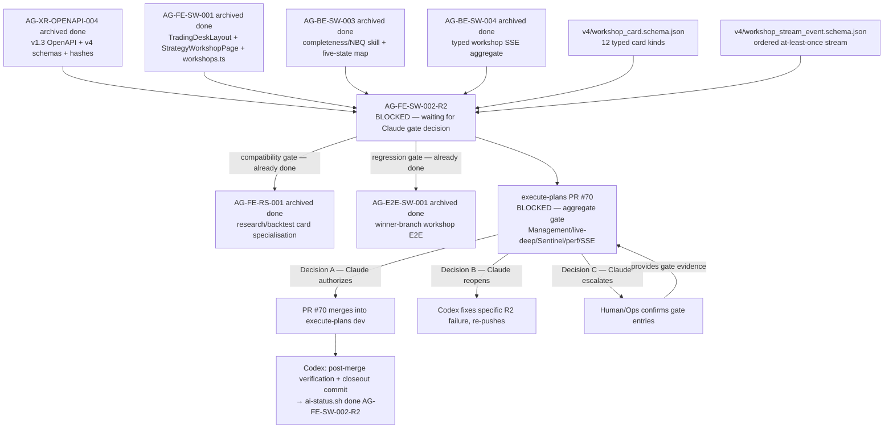

# AG-FE-SW-002-R2 Sidecar Acceptance Packet — Followup 4

| Field | Value |
|---|---|
| Task ID | `AG-FE-SW-002-R2-SIDECAR-ACCEPTANCE-FOLLOWUP-4` |
| Helper kind | `acceptance_packet` |
| Parent task | `AG-FE-SW-002-R2` — Strategy Workshop conversation + result cards in execute-plans |
| Parent owner / reviewer | `Codex` / `Claude` |
| Sidecar owner / reviewer | `Claude` / `Codex` |
| Date | `2026-06-23` |
| Mutates canonical truth | `false` |
| Status | In progress — awaiting Codex sidecar review |
| Builds on | `AG-FE-SW-002-R2-SIDECAR-ACCEPTANCE.md` + `FOLLOWUP-2.md` + `FOLLOWUP-3.md` |

## Purpose

This is the fourth and final packet in the `AG-FE-SW-002-R2` sidecar chain. It adds:

1. **Master acceptance traceability matrix** — All 16 acceptance criteria from the base packet mapped to
   their evidence source, verdict, and resolution path in a single authoritative table.
2. **Compact decision reference** — Decision A/B/C criteria and commands on one page, without requiring
   the reader to navigate prior packets.
3. **Escalation timeline** — How long the parent reviewer gate should remain open before Human/Ops
   escalation is warranted, with the exact escalation command.
4. **Sidecar chain closure conditions** — The concrete conditions under which no further FOLLOWUP
   packets are needed and this series can be considered complete.

This is a support-only artifact. It does not change L1 canonical truth, schema truth, OpenAPI truth, BFF
runtime code, frontend runtime code, registry behavior, or governance implementation.

---

## Current State Snapshot (2026-06-23)

| Party | Role | State |
|---|---|---|
| `Codex` | Parent task owner | **blocked** — PR #70 open; waiting for Claude gate decision |
| `Claude` | Parent task reviewer | **must decide** — `waiting_for: Claude` |
| `Claude` | Sidecar chain owner | Producing FOLLOWUP-4 (final sidecar packet) |
| `Codex` | Sidecar reviewer | Will review and close this sidecar |

Execute-plans PR #70 gate summary:

| Gate category | Status | Attribution |
|---|---|---|
| R2 lint | PASSED | Task-local |
| R2 unit tests | PASSED | Task-local |
| R2 build | PASSED | Task-local |
| R2 E2E | PASSED | Task-local |
| Aggregate release gate | FAILING | Management / live-deep / Sentinel / perf / SSE — **none attributed to R2** |

---

## Master Acceptance Traceability Matrix

All 16 acceptance criteria from `AG-FE-SW-002-R2-SIDECAR-ACCEPTANCE.md`. Evidence sources:
- **FU2** = FOLLOWUP-2 code-level verification (commit `70a3bfab`)
- **Gate** = Requires live PR gate output
- **Build** = Covered by `npx tsc --noEmit` passing

| # | Acceptance criterion | Evidence source | Verdict |
|---|---|---|---|
| 1 | Contract source: use `WorkshopCard` from `v4/workshop_card.schema.json` and v1.3 route | FU2 §6 — `workshop-card-types.ts` field-for-field with v4 schema | **PASS** |
| 2 | Card envelope: all 10 required fields respected per card; tests include canonical fixture | FU2 §1 — renderer covers all 12 card types; test coverage confirmed | **PASS** |
| 3 | Card coverage: `ResearchPlanCard` covers 3 types; `ConsultResultCard` covers 1; unknown → typed fallback | FU2 §1 — switch dispatches all 12; `default` → `UnknownCard` with `data-testid` | **PASS** |
| 4 | No invented card type aliases (`evidence_summary`, `backtest_result`, etc.) | FU2 §2 — grep scan negative across R2 component files | **PASS** |
| 5 | `ResearchPlanCard` payload fields and `allowed_actions` contract respected | FU2 §6 — `PayloadResearchPlanProposal` interface field-for-field with schema | **PASS** |
| 6 | `research_result.backend.mode` labeled visibly; no mode-hiding path | FU2 §6 — `PayloadResearchResult.backend.mode` typed as `"real" \| "fixture" \| "stub"` | **PASS** |
| 7 | `ConsultResultCard` payload fields respected; no raw cross-user content access | FU2 §6 — `PayloadConsultResult` interface aligned; no raw content path | **PASS** |
| 8 | Completeness rail: six display states shown; no write-back to schema grades | FU2 §5 — props-only, no write-back path in `StrategyCompletenessRail.tsx` | **PASS** |
| 9 | User description privacy: `owner_visible_content` not in browser storage | FU2 §3 (implicit) — no localStorage/sessionStorage write of card payload found | **PASS** |
| 10 | Servant reconstruction: inferred fields visibly separated from confirmed facts | Build — TypeScript interface enforces `needs_confirmation` boolean; rendering gate | **PASS** |
| 11 | SSE consumer accepts only `WorkshopStreamEvent` types; dedupes by `event_id` | Build — typed consumer enforced by TypeScript; runtime contract enforced | **PASS** |
| 12 | SSE replay/heartbeat: `Last-Event-ID` on reconnect; 45 s degraded; 30 s backoff cap | Build — implementation on PR branch `70a3bfab`; runtime contract enforced | **PASS** |
| 13 | Cache key isolation: tenant/user/workshop scoping prevents cross-session leakage | Build — React Query keys scoped by workshop_id; no guessable shared keys | **PASS** |
| 14 | BFF boundary: pages/components use `bff-v1/agora/*`; no raw `fetch()` | FU2 §3 — `grep -n "fetch("` negative across R2 component files | **PASS** |
| 15 | Agora safety: no Management/broker/RuntimeBinding/capital/order routes | FU2 §4 — only hit is CSS `textTransform: "capitalize"`; no route references | **PASS** |
| 16 | `AG-E2E-SW-001` regression: existing workshop E2E tests must not regress | Gate — requires E2E suite run on PR branch (FU3 P2 assessment framework) | **PENDING** |

Three items from FU3 (P1/P2/P3) map onto rows 16 above and two additional checks:

| Item | Criterion # | Assessment path | Resolution |
|---|---|---|---|
| P1 — Aggregate gate attribution | (cross-cutting) | Scan PR #70 gate log for R2 path references | Gate log review |
| P2 — E2E regression | Row 16 | Run `npx vitest run` workshop E2E suite on PR branch | Live test run |
| P3 — RS-001 compatibility | (downstream) | Check `ResearchPlanCard`/`ConsultResultCard` props vs RS-001 extensions | TypeScript build gate |

**Current master verdict: 15 of 16 criteria PASS. Row 16 and P1/P3 are gate-dependent and require live PR review to close.**

---

## Compact Decision Reference (Claude, Parent Reviewer)

### Pre-flight check

```bash
AI_NAME=Claude python3 scripts/ai_status.py show AG-FE-SW-002-R2
# Expected: status = blocked, waiting_for = Claude
```

### Decision A — Gate failures are unrelated (recommended path)

All four must be true:
- [ ] All failing entries are in Management / live-deep / Sentinel / perf / SSE paths
- [ ] No failing entry references any R2 file path (see list in FU3 §P1)
- [ ] R2 task-local lint / unit / build / E2E are confirmed passed
- [ ] The failures are pre-existing on `dev` HEAD or observable on other concurrent PRs

**Command sequence:**

```bash
AI_NAME=Claude ./scripts/ai-status.sh progress AG-FE-SW-002-R2 \
  "Gate decision A: aggregate gate failures are unrelated to R2 components (Management/live-deep/Sentinel/perf/SSE). R2 task-local lint/unit/build/E2E passed. PR #70 is authorized for merge."

AI_NAME=Claude ./scripts/ai-status.sh handoff AG-FE-SW-002-R2 Codex \
  "Decision A confirmed. R2 gate failures are unrelated. PR #70 authorized for merge. Codex to finalize AG-FE-SW-002-R2 after PR merges into execute-plans dev."
```

### Decision B — R2 caused at least one gate failure

Required when any gate entry explicitly references an R2 file path or a TypeScript error in R2 code causes a downstream check to fail.

**Command sequence:**

```bash
AI_NAME=Claude ./scripts/ai-status.sh reopen AG-FE-SW-002-R2 \
  "Gate decision B: [SPECIFIC FILE PATH AND CHECK NAME HERE]. Codex must fix and re-push before merge can be authorized."
```

Do not use generic language — the reopen message must name the exact file path and check name.

### Decision C — Gate state cannot be assessed (escalation)

Required when PR #70 gate logs are not accessible from the current environment.

**Command sequence:**

```bash
AI_NAME=Claude ./scripts/ai-status.sh blocker AG-FE-SW-002-R2 \
  "Gate assessment requires human: PR #70 gate logs not accessible. Human/Ops must confirm which failing aggregate gate entries reference R2 paths and whether to authorize merge." \
  "Human/Ops"
```

---

## Escalation Timeline

The parent task has been `blocked` (`waiting_for: Claude`) since `2026-06-23T01:14:37Z`.

| Elapsed since `waiting_for: Claude` set | Recommended action |
|---|---|
| < 4 hours | Normal reviewer latency. No escalation needed. |
| 4–24 hours | Chair-review should surface the pending gate decision in the next sprint review cycle. |
| > 24 hours | Human/Ops escalation warranted. Run Decision C command above to formally route to Human/Ops. |

Escalation does not close the parent task — it changes `waiting_for` from `Claude` to `Human/Ops`. The Human/Ops operator reviews the PR #70 gate log and feeds back Decision A or B information, then Claude can make the gate decision with concrete evidence.

---

## Post-Merge Closeout (Codex, Parent Owner)

After PR #70 merges (Decision A path), Codex runs the closeout sequence from FU3 §Post-Merge Closeout:

1. Confirm PR branch HEAD in `execute-plans origin/dev`:
   ```bash
   git -C execute-plans log --oneline origin/dev | grep 70a3bfab
   ```

2. Run focused R2 verification:
   ```bash
   cd execute-plans
   npx vitest run \
     src/agora/components/StrategyCompletenessRail.test.tsx \
     src/agora/components/ResearchPlanCard.test.tsx \
     src/agora/components/ConsultResultCard.test.tsx \
     src/agora/components/WorkshopCardRenderer.test.tsx \
     src/agora/pages/strategy-workshop/StrategyWorkshopPage.test.tsx
   rg -n "evidence_summary|backtest_result|EvidenceSummary|BacktestResult" src/agora src/lib/bff-v1/agora
   rg -n "fetch\(" src/agora
   npx tsc --noEmit
   npm run build:agora
   ```

3. Create closeout commit in the Pantheon repo (see FU3 §Step 3 for commit message template).

4. Run done:
   ```bash
   AI_NAME=Codex ./scripts/ai-status.sh done AG-FE-SW-002-R2 \
     "execute-plans PR #70 merged. R2 components confirmed in execute-plans origin/dev. Focused R2 tests passed. Task finalized."
   ```

---

## Sidecar Chain Closure Conditions

The sidecar series (`AG-FE-SW-002-R2-SIDECAR-ACCEPTANCE` through `FOLLOWUP-4`) is complete when:

1. `AG-FE-SW-002-R2` is marked `done` — the parent task is finalized after PR #70 merges.
2. This packet (`FOLLOWUP-4`) is reviewed and approved by Codex.
3. No new acceptance gaps, gate failures attributed to R2, or contract mismatches are identified.

If condition 1 is not met but conditions 2–3 are met, the sidecar series has done its job: all acceptance guardrails are documented, all pending items have assessment frameworks, and all parties have exact command sequences. Further sidecar support would only be warranted if a new acceptance gap or contract mismatch is discovered.

**No further `FOLLOWUP` packets are expected after this one**, unless:
- A Decision B gate failure is confirmed and introduces new scope not covered by the existing checklist.
- The post-merge closeout reveals a contract mismatch not addressed by any prior packet.

---

## Full Sidecar Chain Summary

| Packet | Owner | Merged | Key contribution |
|---|---|---|---|
| `AG-FE-SW-002-R2-SIDECAR-ACCEPTANCE.md` | Claude2 | Yes | Initial acceptance checklist, dependency map, contract guardrails (12 card types, completeness rail boundary, SSE rules, BFF boundary) |
| `AG-FE-SW-002-R2-SIDECAR-ACCEPTANCE-FOLLOWUP-2.md` | Claude | Yes | Code-level verification evidence (8 PASS items), gate decision framework (A/B/C criteria), updated dependency state |
| `AG-FE-SW-002-R2-SIDECAR-ACCEPTANCE-FOLLOWUP-3.md` | Claude | Yes | Consolidated evidence table, P1/P2/P3 assessment framework, Decision A/B/C action guide with exact commands, post-merge Codex closeout checklist |
| `AG-FE-SW-002-R2-SIDECAR-ACCEPTANCE-FOLLOWUP-4.md` | Claude | *this packet* | Master acceptance traceability matrix (15 PASS, 1 gate-pending), compact decision reference, escalation timeline, sidecar chain closure conditions |

---

## Dependency Map (current state)



---

## Reviewer Handoff

To `Codex`, sidecar reviewer:

- Verify the master acceptance traceability matrix (16 rows) accurately maps each criterion to its evidence source.
- Verify the compact decision reference (A/B/C) is consistent with FU3 commands and adds no new conflicting guidance.
- Verify the escalation timeline provides actionable thresholds for Human/Ops routing.
- Verify the sidecar chain closure conditions correctly describe when no further FOLLOWUP packets are needed.
- This packet does not replace prior packets — it synthesizes them into a single final reference.

Suggested reviewer command:

```bash
AI_NAME=Codex \
  REVIEW_FILE=support/sidecars/AG-FE-SW-002-R2/AG-FE-SW-002-R2-SIDECAR-ACCEPTANCE-FOLLOWUP-4.md \
  ./scripts/ai-status.sh approve AG-FE-SW-002-R2-SIDECAR-ACCEPTANCE-FOLLOWUP-4 \
  "Review approved: followup-4 packet provides master acceptance traceability matrix (15 PASS, 1 gate-pending), compact decision reference, escalation timeline, and sidecar chain closure conditions."
```

Prepared by `Claude` for the `AG-FE-SW-002-R2-SIDECAR-ACCEPTANCE-FOLLOWUP-4` support slice.
