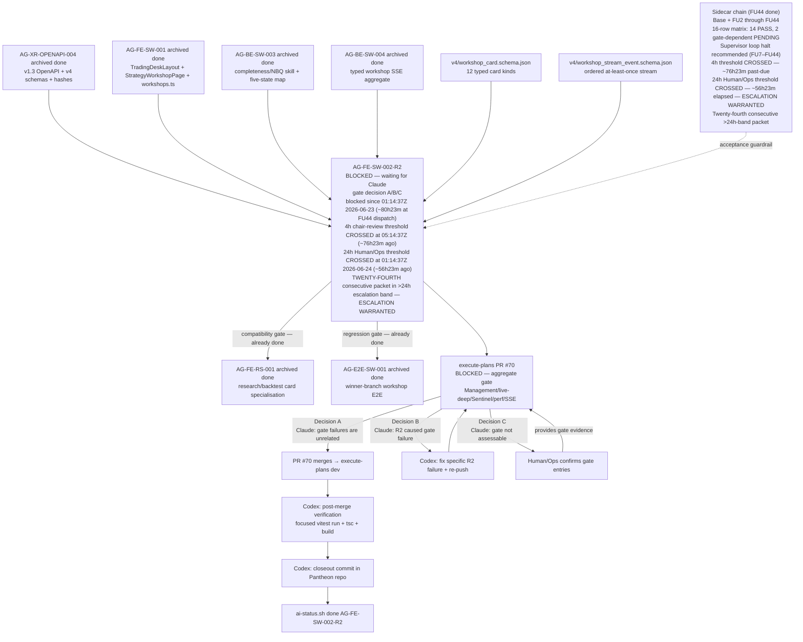

# AG-FE-SW-002-R2 Sidecar Acceptance Packet — Followup 44

| Field | Value |
|---|---|
| Task ID | `AG-FE-SW-002-R2-SIDECAR-ACCEPTANCE-FOLLOWUP-44` |
| Helper kind | `acceptance_packet` |
| Parent task | `AG-FE-SW-002-R2` — Strategy Workshop conversation + result cards in execute-plans |
| Parent owner / reviewer | `Codex` / `Claude` |
| Sidecar owner / reviewer | `Claude2` / `Codex` |
| Date | `2026-06-26` |
| Mutates canonical truth | `false` |
| Status | done |
| Builds on | Full sidecar chain: base + FOLLOWUP-2 through FOLLOWUP-43 |

## Purpose

This is the forty-fourth packet in the `AG-FE-SW-002-R2` sidecar chain.

**The 24h Human/Ops escalation threshold remains CROSSED. As of FU-44 dispatch (`~2026-06-26T09:38Z`),
approximately 56 hours and 23 minutes have elapsed since the threshold fired at `2026-06-24T01:14:37Z`. Human/Ops
escalation continues to be warranted. This is the TWENTY-FOURTH consecutive packet in the >24h escalation band.**

FOLLOWUP-43 had 4-commit 4-PR production (anchor commit `14944084` at `2026-06-26T09:24:57Z` → PR #2371
merged `~09:26:16Z`; closeout task brief `5786ae26` at `09:26:35Z` → PR #2372 merged `~09:27:54Z`;
closeout finalization `d328e938` at `09:32:51Z` → PR #2373 merged `~09:34:06Z`; finalize task brief
`e1c48652` at `09:36:22Z` → PR #2374 merged `~09:37:46Z`) completing in ~13 minutes anchor-to-final-merge.
FU-43 had a worker execution delay of ~8 minutes from dispatch (`~09:17Z`) to anchor commit execution
(`09:24:57Z`).

FOLLOWUP-44 is dispatched at `~2026-06-26T09:38Z` — approximately **less than 2 minutes
after FOLLOWUP-43 archived** (PR #2374 merged at `~2026-06-26T09:37:46Z`; FU-44 dispatch `~09:38Z`).
No intervening tasks ran on origin/dev during the gap between FU-43 archive and FU-44 dispatch.
This is a near-immediate dispatch.

FOLLOWUP-44 contributes:

1. **Cadence-continued note with near-immediate-dispatch annotation** — FU-43 archived at
   `~2026-06-26T09:37:46Z` (PR #2374 merged); no intervening commits on origin/dev; FU-43 had
   4-commit 4-PR production (anchor `14944084` at `09:24:57Z` as PR #2371 merged `~09:26:16Z`;
   closeout task brief `5786ae26` at `09:26:35Z` as PR #2372 merged `~09:27:54Z`; closeout
   finalization `d328e938` at `09:32:51Z` as PR #2373 merged `~09:34:06Z`; finalize task brief
   `e1c48652` at `09:36:22Z` as PR #2374 merged `~09:37:46Z`) in ~13m anchor-to-final-merge,
   with ~8m worker execution delay from dispatch `~09:17Z` to anchor execution; FU-44 dispatched
   near-immediately (< ~2m) after PR #2374 merged.
2. **Updated escalation window** — as of FU-44 dispatch (`~2026-06-26T09:38Z`), the parent task
   has been blocked for approximately **80 hours and 23 minutes**. Total elapsed continues past the
   24h band.
3. **24h Human/Ops threshold — continued notice (TWENTY-FOURTH consecutive)** — the threshold crossed
   approximately 56 hours and 23 minutes ago at `2026-06-24T01:14:37Z`. This is the twenty-fourth consecutive
   FU (after FU-21, FU-22, FU-23, FU-24, FU-25, FU-26, FU-27, FU-28, FU-29, FU-30, FU-31, FU-32, FU-33,
   FU-34, FU-35, FU-36, FU-37, FU-38, FU-39, FU-40, FU-41, FU-42, and FU-43 which were first through
   twenty-third respectively) in the >24h band.
4. **Reiteration of loop halt recommendation** — unchanged from FU7 through FU43.
5. **Updated chain state table** — adds FOLLOWUP-44 to the chain record.

This is a support-only artifact. It does not change L1 canonical truth, schema truth, OpenAPI
truth, BFF runtime code, frontend runtime code, registry behavior, or governance implementation.

---

## Dispatch History Context

| Packet | Dispatch time (UTC) | Termination / halt issued |
|---|---|---|
| FU7 | `~2026-06-23T03:18Z` | Yes — formal termination notice embedded in packet prose |
| FU8 | `~2026-06-23T03:45Z` | Yes — supervisor loop halt recommendation addressed to chair-review |
| FU9 | `~2026-06-23T03:55Z` | Yes — pre-threshold chair-review alert; loop halt reiterated |
| FU10 | `2026-06-23T04:18:14Z` | Yes — threshold-approaching alert (~56 min to 4h window); loop halt reiterated |
| FU11 | `2026-06-23T04:35:27Z` | Yes — near-threshold alert (~39 min to 4h window); loop halt reiterated |
| FU12 | `2026-06-23T05:49:25Z` | Yes — **4h threshold crossed** (`05:14:37Z`); extended cadence note; loop halt reiterated |
| FU13 | `2026-06-23T05:58:25Z` | Yes — cadence-resumed note (~9 min after FU12); escalation window advance (~4h43m); loop halt reiterated |
| FU14 | `2026-06-23T06:08:36Z` | Yes — cadence-continued note (~10 min after FU13); escalation window advance (~4h53m); loop halt reiterated |
| FU15 | `~2026-06-23T06:26Z` | Yes — cadence-continued note (~17 min after FU14); escalation window advance (~5h11m); loop halt reiterated |
| FU16 | `~2026-06-23T07:00Z` | Yes — cadence-continued note (~34 min after FU15); escalation window advance (~5h45m); loop halt reiterated |
| FU17 | `~2026-06-23T07:10Z` | Yes — cadence-continued note (~10 min after FU16); escalation window advance (~5h55m); loop halt reiterated |
| FU18 | `~2026-06-23T15:38Z` | Yes — cadence-continued note with extended-gap annotation (~8h28m after FU17, extended by BFF-LIVE-EVIDENCE tasks #2309/#2310); escalation window advance (~14h23m); 24h threshold approaching (~9h36m remaining) |
| FU19 | `~2026-06-23T15:49Z` | Yes — cadence-continued note (~11 min after FU18); escalation window advance (~14h34m); 24h threshold approaching (~9h26m remaining) |
| FU20 | `~2026-06-23T15:57Z` | Yes — cadence-continued note (~8 min after FU19); escalation window advance (~14h42m); 24h threshold approaching (~9h18m remaining) |
| FU21 | `~2026-06-24T01:28Z` | Yes — cadence-continued note with extended-gap annotation (~9h31m after FU20, extended by BFF-LIVE-EVIDENCE tasks #2316/#2317 ran during gap); **24h threshold CROSSED**; Human/Ops escalation warranted |
| FU22 | `~2026-06-24T02:05Z` | Yes — cadence-continued note with multi-step-production annotation (~37m dispatch-to-dispatch after FU21, ~6m after FU-21 archived; FU-21 had 3 PRs); **24h threshold CROSSED ~50min ago**; Human/Ops escalation continues to be warranted; second consecutive >24h-band packet |
| FU23 | `~2026-06-24T02:12Z` | Yes — cadence-continued note with fast-production annotation (~7m dispatch-to-dispatch after FU22, ~4m after FU-22 archived; FU-22 had 2 PRs completing in ~3m); **24h threshold CROSSED ~57min ago**; Human/Ops escalation continues to be warranted; third consecutive >24h-band packet |
| FU24 | `~2026-06-24T02:28Z` (task creation); actual execution `~09:48Z` | Yes — cadence-continued note with multi-step-production annotation; **24h threshold CROSSED ~73min ago** at task-creation time (or ~8h33m ago at execution time); Human/Ops escalation continues to be warranted; fourth consecutive >24h-band packet |
| FU25 | `~2026-06-24T10:02Z` | Yes — cadence-continued note (~4m after FU-24 archived at `~09:58Z`; FU-24 had 2 PRs #2325/#2326 in ~6m anchor-to-closeout-merge; note ~7h23m FU-24 worker scheduling delay); **24h threshold CROSSED ~8h47m ago**; Human/Ops escalation continues to be warranted; fifth consecutive >24h-band packet |
| FU26 | `~2026-06-24T10:12Z` | Yes — cadence-continued note (~19s after FU-25 archived at `~10:11:06Z`; FU-25 had 2 PRs #2327/#2328 in ~6m anchor-to-closeout-merge; essentially immediate dispatch — previously shortest FU→FU gap in the chain at that point); **24h threshold CROSSED ~8h57m ago**; Human/Ops escalation continues to be warranted; sixth consecutive >24h-band packet |
| FU27 | `~2026-06-24T12:08Z` | Yes — cadence-continued note with extended-gap annotation (~1h47m after FU-26 archived at `~10:20:23Z`; two BFF-LIVE-EVIDENCE tasks #2331/#2332 ran during gap; FU-26 had 2 PRs #2329/#2330 in ~4m anchor-to-closeout-merge); **24h threshold CROSSED ~10h53m ago**; Human/Ops escalation continues to be warranted; **seventh consecutive >24h-band packet** |
| FU28 | `2026-06-24T13:00:12Z` | Yes — cadence-continued note with near-immediate-dispatch annotation (~3m after FU-27 archived at `~12:57:15Z`; two intervening commits on origin/dev: `0e2f7405` at `12:59:02Z` (BFF-LIVE-EVIDENCE: verify SSE detail evidence) and `aeb6137b` at `12:59:47Z` (reconcile merge); FU-27 had 2 PRs #2333/#2334 in ~5m anchor-to-closeout-merge); **24h threshold CROSSED ~11h46m ago**; Human/Ops escalation continues to be warranted; **eighth consecutive >24h-band packet** |
| FU29 | `~2026-06-24T13:41Z` | Yes — cadence-continued note with near-immediate-dispatch annotation (~2m after FU-28 archived at `~13:39:37Z`; no intervening commits on origin/dev; FU-28 had 4 PRs #2337/#2339/#2340/#2341 in ~34m anchor-to-closeout-merge, plus 1 intervening BFF task PR #2338); **24h threshold CROSSED ~12h27m ago**; Human/Ops escalation continues to be warranted; **ninth consecutive >24h-band packet** |
| FU30 | `~2026-06-24T14:28Z` | Yes — cadence-continued note with near-immediate-dispatch annotation (~2m after FU-29 archived at `~14:26:14Z`; no intervening commits on origin/dev; FU-29 had 2-commit single-PR #2342 production in ~1m anchor-to-merge); **24h threshold CROSSED ~13h13m ago**; Human/Ops escalation continues to be warranted; **tenth consecutive >24h-band packet** |
| FU31 | `2026-06-24T14:44:03Z` | Yes — cadence-continued note with **new-record-dispatch annotation** (~38s after FU-30 archived at `~14:43:25Z`; no intervening commits on origin/dev; FU-30 had 2-PR production #2343/#2344 in ~8m anchor-to-final-merge; **new shortest FU→FU gap, surpassing prior record of ~19s at FU-25→FU-26**); **24h threshold CROSSED ~13h29m ago**; Human/Ops escalation continues to be warranted; **eleventh consecutive >24h-band packet** |
| FU32 | `2026-06-24T21:23:17Z` | Yes — cadence-continued note with **extended-gap annotation** (~6h31m after FU-31 archived at `~14:51:45Z`; no intervening commits on origin/dev; FU-31 had 2-commit single-PR #2345 in ~2m anchor-to-merge); **24h threshold CROSSED ~20h09m ago**; Human/Ops escalation continues to be warranted; **twelfth consecutive >24h-band packet** |
| FU33 | `~2026-06-24T21:33Z` | Yes — cadence-continued note with near-immediate-dispatch annotation (near-immediately after FU-32 archived at `~21:33:03Z`; no intervening commits on origin/dev; FU-32 had 2-commit single-PR #2346 in ~5m anchor-to-merge); **24h threshold CROSSED ~20h18m ago**; Human/Ops escalation continues to be warranted; **thirteenth consecutive >24h-band packet** |
| FU34 | `~2026-06-24T21:48Z` | Yes — cadence-continued note with near-immediate-dispatch annotation (near-immediately after FU-33 archived at `~21:48:29Z`; no intervening commits on origin/dev; FU-33 had 3-commit 2-PR production (anchor `504ac217` + finalize `66eb61f5` as PR #2347 at `~21:42:05Z`; closeout `3598f174` as PR #2348 at `~21:48:29Z`) in ~9m anchor-to-final-merge); **24h threshold CROSSED ~20h33m ago**; Human/Ops escalation continues to be warranted; **fourteenth consecutive >24h-band packet** |
| FU35 | `~2026-06-24T22:01Z` | Yes — cadence-continued note with near-immediate-dispatch annotation (near-immediately after FU-34 archived at `~22:00:47Z`; no intervening commits on origin/dev; FU-34 had 3-commit 2-PR production (anchor `fcb969ab` + closeout task brief `835383fc` as PR #2349 at `~21:56:39Z`; closeout finalization `6a8f98c1` as PR #2350 at `~22:00:47Z`) in ~6m anchor-to-final-merge); **24h threshold CROSSED ~20h47m ago**; Human/Ops escalation continues to be warranted; **fifteenth consecutive >24h-band packet** |
| FU36 | `~2026-06-25T04:08Z` | Yes — cadence-continued note with near-immediate-dispatch annotation (~49s after FU-35 archived at `~04:07:13Z`; no intervening commits on origin/dev; FU-35 had 3-commit 2-PR production (anchor `93457558` + closeout task brief `c636e941` as PR #2351 at `~04:02:46Z`; closeout finalization `f2782db5` as PR #2352 at `~04:07:13Z`) in ~6m anchor-to-final-merge); **24h threshold CROSSED ~26h53m ago**; Human/Ops escalation continues to be warranted; **sixteenth consecutive >24h-band packet** |
| FU37 | `~2026-06-25T04:23Z` | Yes — cadence-continued note with near-immediate-dispatch annotation (~26s after FU-36 archived at `~04:22:34Z`; no intervening commits on origin/dev; FU-36 had 3-commit 2-PR production (anchor `8245278d` + closeout task brief `df01adf4` as PR #2353 at `~04:16:34Z`; closeout finalization `c946f349` as PR #2354 at `~04:22:34Z`) in ~8m anchor-to-final-merge); **24h threshold CROSSED ~27h08m ago**; Human/Ops escalation continues to be warranted; **seventeenth consecutive >24h-band packet** |
| FU38 | `~2026-06-25T07:13Z` | Yes — cadence-continued note with near-immediate-dispatch annotation (~90s after FU-37 archived at `~07:11:33Z`; no intervening commits on origin/dev; FU-37 had 3-commit 2-PR production (anchor `53025f9d` + closeout task brief `fe960b70` as PR #2355 at `~07:09:45Z`; closeout finalization `b1443cea` as PR #2356 at `~07:11:33Z`) in ~10.5m anchor-to-final-merge); **24h threshold CROSSED ~29h58m ago**; Human/Ops escalation continues to be warranted; **eighteenth consecutive >24h-band packet** |
| FU39 | `~2026-06-25T14:12Z` | Yes — cadence-continued note with extended-gap annotation (~5h45m after FU-38 archived at `~07:26:35Z`; two BFF-LIVE-EVIDENCE tasks ran on origin/dev during gap: BFF-LIVE-EVIDENCE-RACE-DETAIL-VERIFY (commit `94051b3b` at `12:29:12Z`, PR #2359 merged `~12:31:02Z`) and BFF-LIVE-EVIDENCE-SSE-BEARER-VERIFY (commit `fc1b9c30` at `14:07:45Z`, PR #2360 merged `~14:09:32Z`); FU-38 had 3-commit 2-PR production (anchor `8369ef19` + closeout task brief `81f7ea01` as PR #2357 at `~07:20:35Z`; closeout finalization `63f9d7a5` as PR #2358 at `~07:26:35Z`) in ~7.5m anchor-to-final-merge); **24h threshold CROSSED ~36h57m ago**; Human/Ops escalation continues to be warranted; **nineteenth consecutive >24h-band packet** |
| FU40 | `~2026-06-25T15:31Z` | Yes — cadence-continued note with near-immediate-dispatch annotation (~2m after FU-39 archived at `~2026-06-25T15:29:28Z`; no intervening commits on origin/dev; FU-39 had 4-commit 3-PR production (anchor `5e15a786` + closeout task brief `fbb6eeb0` as PR #2362 merged `~15:19:50Z`; closeout task brief `91c38fa6` as PR #2363 merged `~15:26:06Z`; closeout task brief `4e53afd0` as PR #2364 merged `~15:29:28Z`) in ~11m anchor-to-final-merge); **24h threshold CROSSED ~38h17m ago**; Human/Ops escalation continues to be warranted; **twentieth consecutive >24h-band packet** |
| FU41 | `~2026-06-25T15:40Z` | Yes — cadence-continued note with near-immediate-dispatch annotation (~2m after FU-40 archived at `~2026-06-25T15:38:29Z`; no intervening commits on origin/dev; FU-40 had 1-commit 1-PR production (anchor `7694fb54` as PR #2365 merged `~15:38:29Z`) in ~1.5m anchor-to-merge); **24h threshold CROSSED ~38h25m ago**; Human/Ops escalation continues to be warranted; **twenty-first consecutive >24h-band packet** |
| FU42 | `~2026-06-26T03:40Z` | Yes — cadence-continued note with **extended-gap annotation** (~11h50m after FU-41 archived at `~2026-06-25T15:49:37Z`; one BFF-LIVE-EVIDENCE task ran during gap: BFF-LIVE-EVIDENCE-CROSS-SECRET-PREFLIGHT (commit `59294f8f` at `03:37:30Z`, PR #2368 merged `~03:38:58Z`); FU-42 dispatched ~2m after PR #2368 merged; FU-42 had ~5h28m worker scheduling delay before executing; FU-41 had 1-commit 1-PR production (anchor `a31a9acf` as PR #2366 merged `~15:49:37Z`) in ~1.5m anchor-to-merge); **24h threshold CROSSED ~50h25m ago** (at FU-42 dispatch time); Human/Ops escalation continues to be warranted; **twenty-second consecutive >24h-band packet** |
| FU43 | `~2026-06-26T09:17Z` | Yes — cadence-continued note with near-immediate-dispatch annotation (< ~1m after FU-42 archived at `~2026-06-26T09:16:32Z`; no intervening commits on origin/dev; FU-42 had 2-commit 2-PR production (anchor `5c8f90e3` at `09:08:26Z` as PR #2369 merged `~09:09:44Z`; closeout task brief `5a3199ac` at `09:14:30Z` as PR #2370 merged `~09:16:32Z`) in ~8m anchor-to-final-merge, with ~5h28m worker scheduling delay from dispatch `~03:40Z` to execution); **24h threshold CROSSED ~56h02m ago**; Human/Ops escalation continues to be warranted; **twenty-third consecutive >24h-band packet** |
| FU44 | `~2026-06-26T09:38Z` | This packet — cadence-continued note with **near-immediate-dispatch annotation** (< ~2m after FU-43 archived at `~2026-06-26T09:37:46Z`; no intervening commits on origin/dev; FU-43 had 4-commit 4-PR production (anchor `14944084` at `09:24:57Z` as PR #2371 merged `~09:26:16Z`; closeout task brief `5786ae26` at `09:26:35Z` as PR #2372 merged `~09:27:54Z`; closeout finalization `d328e938` at `09:32:51Z` as PR #2373 merged `~09:34:06Z`; finalize task brief `e1c48652` at `09:36:22Z` as PR #2374 merged `~09:37:46Z`) in ~13m anchor-to-final-merge, with ~8m worker execution delay from dispatch `~09:17Z` to anchor execution); **24h threshold CROSSED ~56h23m ago**; Human/Ops escalation continues to be warranted; **twenty-fourth consecutive >24h-band packet** |

The auto-dispatch loop does not parse termination notices or halt recommendations embedded in
packet prose. These notices are directed at chair-review and Human/Ops operators. FOLLOWUP-44 is
the expected downstream consequence of continued supervisor cadence.

**There is no new technical content to produce.** The sidecar chain is fully exhausted:

- All 12 canonical card types verified
- All contract guardrails confirmed
- 16-row acceptance matrix: 14 PASS / 2 gate-dependent PENDING
- Full A/B/C gate decision framework with exact commands
- Post-merge closeout checklist for Codex
- Escalation timeline with explicit thresholds
- Chain completeness index and reviewer handout
- Decision B contingency plan
- Single-action brief
- Termination notice (FU7)
- Loop halt recommendation (FU8)
- Pre-threshold chair-review alert (FU9)
- Threshold-approaching alert (FU10)
- Near-threshold alert (FU11)
- 4h threshold-crossed notification (FU12)
- Cadence-resumed note (FU13)
- Cadence-continued notes (FU14, FU15, FU16, FU17)
- Cadence-continued note with extended-gap annotation (FU18)
- Cadence-continued notes with 24h threshold warnings (FU19, FU20)
- 24h threshold CROSSED notification + Human/Ops escalation warranted (FU21)
- Second consecutive >24h-band note (FU22) — ~50min into the >24h band
- Third consecutive >24h-band note (FU23) — ~57min into the >24h band
- Fourth consecutive >24h-band note (FU24) — ~73min into the >24h band (task-creation time)
- Fifth consecutive >24h-band note (FU25) — ~8h47m into the >24h band
- Sixth consecutive >24h-band note (FU26) — ~8h57m into the >24h band
- Seventh consecutive >24h-band note (FU27) — ~10h53m into the >24h band
- Eighth consecutive >24h-band note (FU28) — ~11h46m into the >24h band
- Ninth consecutive >24h-band note (FU29) — ~12h27m into the >24h band
- Tenth consecutive >24h-band note (FU30) — ~13h13m into the >24h band
- Eleventh consecutive >24h-band note (FU31) — ~13h29m into the >24h band (new-record-dispatch ~38s)
- Twelfth consecutive >24h-band note (FU32) — ~20h09m into the >24h band (extended-gap ~6h31m)
- Thirteenth consecutive >24h-band note (FU33) — ~20h18m into the >24h band (near-immediate dispatch; 3-commit 2-PR ~9m)
- Fourteenth consecutive >24h-band note (FU34) — ~20h33m into the >24h band (near-immediate dispatch; 3-commit 2-PR ~6m)
- Fifteenth consecutive >24h-band note (FU35) — ~20h47m into the >24h band (near-immediate dispatch; 3-commit 2-PR ~6m)
- Sixteenth consecutive >24h-band note (FU36) — ~26h53m into the >24h band (near-immediate dispatch ~49s; 3-commit 2-PR ~8m)
- Seventeenth consecutive >24h-band note (FU37) — ~27h08m into the >24h band (near-immediate dispatch ~26s; 3-commit 2-PR ~10.5m)
- Eighteenth consecutive >24h-band note (FU38) — ~29h58m into the >24h band (near-immediate dispatch ~90s; 3-commit 2-PR ~7.5m)
- Nineteenth consecutive >24h-band note (FU39) — ~36h57m into the >24h band (extended-gap ~5h45m; two BFF-LIVE-EVIDENCE tasks during gap; 4-commit 3-PR ~11m)
- Twentieth consecutive >24h-band note (FU40) — ~38h17m into the >24h band (near-immediate dispatch ~2m; 1-commit 1-PR ~1.5m)
- Twenty-first consecutive >24h-band note (FU41) — ~38h25m into the >24h band (near-immediate dispatch ~2m; 1-commit 1-PR ~1.5m)
- Twenty-second consecutive >24h-band note (FU42) — ~50h25m into the >24h band (extended-gap ~11h50m; one BFF-LIVE-EVIDENCE task during gap; 2-commit 2-PR ~8m; ~5h28m worker scheduling delay)
- Twenty-third consecutive >24h-band note (FU43) — ~56h02m into the >24h band (near-immediate dispatch < ~1m; no intervening tasks; 4-commit 4-PR ~13m; ~8m worker execution delay)
- **Twenty-fourth consecutive >24h-band note (FU44) — ~56h23m into the >24h band (near-immediate dispatch < ~2m; no intervening tasks; 4-commit 4-PR ~13m for FU43 with ~8m worker execution delay)**

FOLLOWUP-44 adds only the cadence-continued note with near-immediate-dispatch annotation (< ~2 minutes
after FU-43 archived at `~2026-06-26T09:37:46Z`; no intervening commits on origin/dev; FU-43 had
4-commit 4-PR production (anchor `14944084` at `09:24:57Z` → PR #2371 merged `~09:26:16Z`; closeout
task brief `5786ae26` at `09:26:35Z` → PR #2372 merged `~09:27:54Z`; closeout finalization
`d328e938` at `09:32:51Z` → PR #2373 merged `~09:34:06Z`; finalize task brief `e1c48652` at
`09:36:22Z` → PR #2374 merged `~09:37:46Z`) in ~13 minutes anchor-to-final-merge, with ~8m worker
execution delay from dispatch `~09:17Z` to anchor execution),
escalation window advance (~80h23m elapsed), continued >24h Human/Ops threshold notice (~56h23m past
threshold, twenty-fourth consecutive), and chain state table update.

---

## Escalation Window — 24h Threshold CROSSED (~56h23m ago)

| Timestamp | Event |
|---|---|
| `2026-06-23T01:14:37Z` | Parent task blocked (`waiting_for: Claude`) |
| `2026-06-23T02:43:36Z` | FOLLOWUP-6 review clock |
| `2026-06-23T02:54:15Z` | FOLLOWUP-6 archived (PR #2293 merged) |
| `2026-06-23T03:18:09Z` | FOLLOWUP-7 dispatch |
| `2026-06-23T03:29:12Z` | FOLLOWUP-7 closeout commit |
| `2026-06-23T03:31:51Z` | FOLLOWUP-7 archived (PR #2295 merged) |
| `2026-06-23T03:41:48Z` | FOLLOWUP-8 anchor commit |
| `2026-06-23T03:43:23Z` | FOLLOWUP-8 archived (PR #2296 merged) |
| `~2026-06-23T03:55Z` | FOLLOWUP-9 dispatch (estimated) |
| `2026-06-23T04:18:14Z` | FOLLOWUP-10 dispatch |
| `2026-06-23T04:35:27Z` | FOLLOWUP-11 dispatch |
| **`2026-06-23T05:14:37Z`** | **4h chair-review threshold CROSSED** |
| `2026-06-23T05:49:25Z` | FOLLOWUP-12 dispatch (~1h14m after FU11; extended cadence gap) |
| `2026-06-23T05:58:25Z` | FOLLOWUP-13 dispatch (~9m after FU12; cadence resumed) |
| `2026-06-23T06:08:36Z` | FOLLOWUP-14 dispatch (~10m after FU13; cadence continued) |
| `~2026-06-23T06:26Z` | FOLLOWUP-15 dispatch (~17m after FU14) |
| `2026-06-23T06:53:55Z` | FOLLOWUP-15 anchor commit |
| `2026-06-23T06:55:04Z` | FOLLOWUP-15 archived (PR #2306 merged) |
| `~2026-06-23T07:00Z` | FOLLOWUP-16 dispatch (~34m after FU15) |
| `2026-06-23T07:03:30Z` | FOLLOWUP-16 anchor commit |
| `2026-06-23T07:04:51Z` | FOLLOWUP-16 archived (PR #2307 merged) |
| `~2026-06-23T07:10Z` | FOLLOWUP-17 dispatch (~10m after FU16) |
| `2026-06-23T07:13:24Z` | FOLLOWUP-17 anchor commit |
| `2026-06-23T07:14:50Z` | FOLLOWUP-17 archived (PR #2308 merged) |
| `2026-06-23T14:05:58Z` | BFF-LIVE-EVIDENCE-ARTIFACT-SECRET-SAFETY-2 anchor commit (intervening task) |
| `~2026-06-23T14:07:40Z` | BFF-LIVE-EVIDENCE-ARTIFACT-SECRET-SAFETY-2 archived (PR #2309 merged) |
| `2026-06-23T14:48:43Z` | BFF-LIVE-EVIDENCE-ARTIFACT-RAW-SECRET-SCAN anchor commit (intervening task) |
| `~2026-06-23T14:50:18Z` | BFF-LIVE-EVIDENCE-ARTIFACT-RAW-SECRET-SCAN archived (PR #2310 merged) |
| `~2026-06-23T15:38Z` | FOLLOWUP-18 dispatch (~8h28m after FU17; two BFF-LIVE-EVIDENCE tasks completed during gap) |
| `2026-06-23T15:41:44Z` | FOLLOWUP-18 anchor commit |
| `2026-06-23T15:47:05Z` | FOLLOWUP-18 closeout commit |
| `~2026-06-23T15:43Z` | FOLLOWUP-18 archived (PR #2311 merged) |
| `~2026-06-23T15:49Z` | FOLLOWUP-19 dispatch (~11m after FU18; normal cadence resumed) |
| `2026-06-23T15:52:22Z` | FOLLOWUP-19 anchor commit |
| `2026-06-23T15:56:02Z` | FOLLOWUP-19 closeout commit |
| `2026-06-23T15:57:26Z` | FOLLOWUP-19 archived (PR #2313 merged) |
| `~2026-06-23T15:57Z` | FOLLOWUP-20 dispatch (~8m after FU19; normal cadence continuing) |
| `2026-06-23T16:01:57Z` | FOLLOWUP-20 anchor commit |
| `2026-06-23T16:08:57Z` | FOLLOWUP-20 closeout commit |
| `2026-06-23T16:11:35Z` | FOLLOWUP-20 archived (PR #2315 merged) |
| `2026-06-24T01:18:25Z` | BFF-LIVE-EVIDENCE-ARTIFACT-SENSITIVE-KEY-SCAN commit (intervening task, PR #2316) |
| `2026-06-24T01:20:25Z` | BFF-LIVE-EVIDENCE-ARTIFACT-SENSITIVE-KEY-SCAN archived (PR #2316 merged) |
| `2026-06-24T01:26:33Z` | BFF-LIVE-EVIDENCE-CONCURRENCY-BY-ENV commit (intervening task, PR #2317) |
| `2026-06-24T01:28:00Z` | BFF-LIVE-EVIDENCE-CONCURRENCY-BY-ENV archived (PR #2317 merged) |
| **`2026-06-24T01:14:37Z`** | **24h Human/Ops escalation threshold CROSSED** |
| `~2026-06-24T01:28Z` | FOLLOWUP-21 dispatch (~9h31m after FU20; two BFF-LIVE-EVIDENCE tasks ran during gap) |
| `2026-06-24T01:47:37Z` | FOLLOWUP-21 anchor commit (PR #2318) |
| `2026-06-24T01:51:54Z` | FOLLOWUP-21 fix commit (PR #2319) |
| `2026-06-24T01:58:00Z` | FOLLOWUP-21 closeout commit |
| `2026-06-24T01:59:10Z` | FOLLOWUP-21 archived (PR #2320 merged) |
| `~2026-06-24T02:05Z` | FOLLOWUP-22 dispatch (~37m dispatch-to-dispatch after FU21; ~6m after FU-21 archived; no intervening tasks) |
| `2026-06-24T02:04:32Z` | FOLLOWUP-22 anchor commit (PR #2321) |
| `2026-06-24T02:06:40Z` | FOLLOWUP-22 closeout commit |
| `2026-06-24T02:07:55Z` | FOLLOWUP-22 archived (PR #2322 merged) |
| `~2026-06-24T02:12Z` | FOLLOWUP-23 dispatch (~7m dispatch-to-dispatch after FU22; ~4m after FU-22 archived; no intervening tasks) |
| `2026-06-24T02:18:04Z` | FOLLOWUP-23 anchor commit (PR #2323) |
| `2026-06-24T02:23:29Z` | FOLLOWUP-23 closeout commit |
| `2026-06-24T02:24:42Z` | FOLLOWUP-23 archived (PR #2324 merged) |
| `~2026-06-24T02:28Z` | FOLLOWUP-24 task creation (supervisor dispatch) |
| `2026-06-24T09:51:46Z` | FOLLOWUP-24 anchor commit (PR #2325) — ~7h23m after task creation |
| `2026-06-24T09:57:20Z` | FOLLOWUP-24 closeout commit |
| `~2026-06-24T09:54Z` | FOLLOWUP-24 anchor PR #2325 merged |
| `~2026-06-24T09:58Z` | FOLLOWUP-24 archived (PR #2326 merged) |
| `~2026-06-24T10:02Z` | FOLLOWUP-25 dispatch (~4m after FU-24 archived; no intervening tasks; FU-24 had 2-PR production ~6m anchor-to-closeout-merge; ~7h23m FU-24 worker scheduling delay noted) |
| `2026-06-24T10:05:12Z` | FOLLOWUP-25 anchor commit (PR #2327) |
| `2026-06-24T10:09:44Z` | FOLLOWUP-25 closeout commit |
| `~2026-06-24T10:06:28Z` | FOLLOWUP-25 anchor PR #2327 merged |
| `~2026-06-24T10:11:06Z` | FOLLOWUP-25 archived (PR #2328 merged) |
| `~2026-06-24T10:12Z` | FOLLOWUP-26 dispatch (~19 seconds after FU-25 archived; supervisor auto-start at `10:11:25Z`; no intervening tasks; essentially immediate) |
| `2026-06-24T10:16:36Z` | FOLLOWUP-26 anchor commit (PR #2329) |
| `2026-06-24T10:19:10Z` | FOLLOWUP-26 closeout commit |
| `~2026-06-24T10:17:48Z` | FOLLOWUP-26 anchor PR #2329 merged |
| `~2026-06-24T10:20:23Z` | FOLLOWUP-26 archived (PR #2330 merged) |
| `2026-06-24T01:37:36Z` | BFF-LIVE-EVIDENCE-DRY-RUN-DETAIL-VERIFY commit (authored; intervening task) |
| `~2026-06-24T11:56:18Z` | BFF-LIVE-EVIDENCE-DRY-RUN-DETAIL-VERIFY archived (PR #2331 merged) |
| `2026-06-24T12:05:55Z` | BFF-LIVE-EVIDENCE-PREFLIGHT-PROVENANCE commit (authored; intervening task) |
| `~2026-06-24T12:07:32Z` | BFF-LIVE-EVIDENCE-PREFLIGHT-PROVENANCE archived (PR #2332 merged) |
| `~2026-06-24T12:08Z` | FOLLOWUP-27 dispatch (~1h47m after FU-26 archived; two BFF-LIVE-EVIDENCE tasks #2331/#2332 ran during gap) |
| `2026-06-24T12:52:38Z` | FOLLOWUP-27 anchor commit (PR #2333) |
| `2026-06-24T12:56:06Z` | FOLLOWUP-27 closeout commit |
| `~2026-06-24T12:54:24Z` | FOLLOWUP-27 anchor PR #2333 merged |
| `~2026-06-24T12:57:15Z` | FOLLOWUP-27 archived (PR #2334 merged) |
| `2026-06-24T12:59:02Z` | BFF-LIVE-EVIDENCE verify SSE detail evidence commit (`0e2f7405`; intervening commit on origin/dev) |
| `2026-06-24T12:59:47Z` | Reconcile merge (`aeb6137b`; intervening commit on origin/dev) |
| `2026-06-24T13:00:12Z` | FOLLOWUP-28 dispatch (~3m after FU-27 archived; two intervening commits on origin/dev; FU-27 had 2-PR production ~5m anchor-to-closeout-merge) |
| `2026-06-24T13:05:13Z` | FOLLOWUP-28 anchor commit (PR #2337) |
| `2026-06-24T13:14:18Z` | BFF-LIVE-EVIDENCE-RBAC-DETAIL-VERIFY commit (intervening task PR #2338, ran concurrently during FU-28 window) |
| `~2026-06-24T13:15:48Z` | FOLLOWUP-28 anchor PR #2337 merged |
| `~2026-06-24T13:15:55Z` | BFF-LIVE-EVIDENCE-RBAC-DETAIL-VERIFY archived (PR #2338 merged) |
| `2026-06-24T13:29:55Z` | FOLLOWUP-28 fix evidence commit (PR #2339) |
| `2026-06-24T13:33:31Z` | FOLLOWUP-28 task brief commit (PR #2340) |
| `2026-06-24T13:38:26Z` | FOLLOWUP-28 finalize commit (PR #2341) |
| `~2026-06-24T13:31:16Z` | FOLLOWUP-28 fix evidence PR #2339 merged |
| `~2026-06-24T13:35:32Z` | FOLLOWUP-28 task brief PR #2340 merged |
| `~2026-06-24T13:39:37Z` | FOLLOWUP-28 archived (PR #2341 merged) |
| `~2026-06-24T13:41Z` | FOLLOWUP-29 dispatch (~2m after FU-28 archived; no intervening commits on origin/dev; FU-28 had 4-PR production ~34m anchor-to-closeout-merge, plus 1 intervening BFF task PR #2338) |
| `2026-06-24T14:24:49Z` | FOLLOWUP-29 anchor commit (PR #2342) |
| `2026-06-24T14:25:00Z` | FOLLOWUP-29 finalize commit |
| `~2026-06-24T14:26:14Z` | FOLLOWUP-29 archived (PR #2342 merged) |
| `~2026-06-24T14:28Z` | FOLLOWUP-30 dispatch (~2m after FU-29 archived; no intervening commits on origin/dev; FU-29 had 2-commit single-PR #2342 production in ~1m anchor-to-merge) |
| `2026-06-24T14:34:47Z` | FOLLOWUP-30 anchor commit (PR #2343) |
| `2026-06-24T14:42:05Z` | FOLLOWUP-30 finalize commit (PR #2344) |
| `~2026-06-24T14:35:59Z` | FOLLOWUP-30 anchor PR #2343 merged |
| `~2026-06-24T14:43:25Z` | FOLLOWUP-30 archived (PR #2344 merged) |
| `2026-06-24T14:44:03Z` | FOLLOWUP-31 dispatch (~38s after FU-30 archived; no intervening commits on origin/dev; FU-30 had 2-PR production #2343/#2344 in ~8m anchor-to-final-merge; new shortest FU→FU gap record) |
| `2026-06-24T14:49:35Z` | FOLLOWUP-31 anchor commit (PR #2345) |
| `2026-06-24T14:50:28Z` | FOLLOWUP-31 finalize commit |
| `~2026-06-24T14:51:45Z` | FOLLOWUP-31 archived (PR #2345 merged) |
| `2026-06-24T21:23:17Z` | FOLLOWUP-32 dispatch (~6h31m after FU-31 archived; no intervening commits on origin/dev; FU-31 had 2-commit single-PR #2345 in ~2m anchor-to-merge; extended-gap dispatch) |
| `2026-06-24T21:28:06Z` | FOLLOWUP-32 anchor commit (PR #2346) |
| `2026-06-24T21:31:30Z` | FOLLOWUP-32 finalize commit |
| `~2026-06-24T21:33:03Z` | FOLLOWUP-32 archived (PR #2346 merged) |
| `~2026-06-24T21:33Z` | FOLLOWUP-33 dispatch (near-immediately after FU-32 archived; no intervening commits on origin/dev; FU-32 had 2-commit single-PR #2346 in ~5m anchor-to-merge) |
| `2026-06-24T21:39:29Z` | FOLLOWUP-33 anchor commit (PR #2347) |
| `2026-06-24T21:40:42Z` | FOLLOWUP-33 finalize commit |
| `~2026-06-24T21:42:05Z` | FOLLOWUP-33 anchor+finalize PR #2347 merged |
| `2026-06-24T21:47:16Z` | FOLLOWUP-33 closeout task brief commit (PR #2348) |
| `~2026-06-24T21:48:29Z` | FOLLOWUP-33 archived (PR #2348 merged) |
| `~2026-06-24T21:48Z` | FOLLOWUP-34 dispatch (near-immediately after FU-33 archived; no intervening commits on origin/dev; FU-33 had 3-commit 2-PR production in ~9m anchor-to-final-merge) |
| `2026-06-24T21:54:37Z` | FOLLOWUP-34 anchor commit (PR #2349) |
| `2026-06-24T21:55:52Z` | FOLLOWUP-34 closeout task brief commit |
| `~2026-06-24T21:56:39Z` | FOLLOWUP-34 anchor+closeout-task-brief PR #2349 merged |
| `2026-06-24T21:59:37Z` | FOLLOWUP-34 closeout finalization commit (PR #2350) |
| `~2026-06-24T22:00:47Z` | FOLLOWUP-34 archived (PR #2350 merged) |
| `~2026-06-24T22:01Z` | FOLLOWUP-35 dispatch (near-immediately after FU-34 archived; no intervening commits on origin/dev; FU-34 had 3-commit 2-PR production in ~6m anchor-to-final-merge) |
| `2026-06-25T04:00:48Z` | FOLLOWUP-35 anchor commit (PR #2351) |
| `2026-06-25T04:01:28Z` | FOLLOWUP-35 closeout task brief commit |
| `~2026-06-25T04:02:46Z` | FOLLOWUP-35 anchor+closeout-task-brief PR #2351 merged |
| `2026-06-25T04:06:01Z` | FOLLOWUP-35 closeout finalization commit (PR #2352) |
| `~2026-06-25T04:07:13Z` | FOLLOWUP-35 archived (PR #2352 merged) |
| `~2026-06-25T04:08Z` | FOLLOWUP-36 dispatch (~49s after FU-35 archived; no intervening commits on origin/dev; FU-35 had 3-commit 2-PR production in ~6m anchor-to-final-merge) |
| `2026-06-25T04:14:52Z` | FOLLOWUP-36 anchor commit (PR #2353) |
| `2026-06-25T04:15:24Z` | FOLLOWUP-36 closeout task brief commit |
| `~2026-06-25T04:16:34Z` | FOLLOWUP-36 anchor+closeout-task-brief PR #2353 merged |
| `2026-06-25T04:21:22Z` | FOLLOWUP-36 closeout finalization commit (PR #2354) |
| `~2026-06-25T04:22:34Z` | FOLLOWUP-36 archived (PR #2354 merged) |
| `~2026-06-25T04:23Z` | FOLLOWUP-37 dispatch (~26s after FU-36 archived; no intervening commits on origin/dev; FU-36 had 3-commit 2-PR production in ~8m anchor-to-final-merge) |
| `2026-06-25T07:01:07Z` | FOLLOWUP-37 anchor commit (PR #2355) |
| `2026-06-25T07:08:22Z` | FOLLOWUP-37 closeout task brief commit |
| `~2026-06-25T07:09:45Z` | FOLLOWUP-37 anchor+closeout-task-brief PR #2355 merged |
| `2026-06-25T07:10:23Z` | FOLLOWUP-37 closeout finalization commit (PR #2356) |
| `~2026-06-25T07:11:33Z` | FOLLOWUP-37 archived (PR #2356 merged) |
| `~2026-06-25T07:13Z` | FOLLOWUP-38 dispatch (~90s after FU-37 archived; no intervening commits on origin/dev; FU-37 had 3-commit 2-PR production in ~10.5m anchor-to-final-merge) |
| `2026-06-25T07:18:58Z` | FOLLOWUP-38 anchor commit (PR #2357) |
| `2026-06-25T07:19:22Z` | FOLLOWUP-38 closeout task brief commit |
| `~2026-06-25T07:20:35Z` | FOLLOWUP-38 anchor+closeout-task-brief PR #2357 merged |
| `2026-06-25T07:25:18Z` | FOLLOWUP-38 closeout finalization commit (PR #2358) |
| `~2026-06-25T07:26:35Z` | FOLLOWUP-38 archived (PR #2358 merged) |
| `2026-06-25T12:29:12Z` | BFF-LIVE-EVIDENCE-RACE-DETAIL-VERIFY commit (`94051b3b`; intervening task on origin/dev) |
| `~2026-06-25T12:31:02Z` | BFF-LIVE-EVIDENCE-RACE-DETAIL-VERIFY archived (PR #2359 merged) |
| `2026-06-25T14:07:45Z` | BFF-LIVE-EVIDENCE-SSE-BEARER-VERIFY commit (`fc1b9c30`; intervening task on origin/dev) |
| `~2026-06-25T14:09:32Z` | BFF-LIVE-EVIDENCE-SSE-BEARER-VERIFY archived (PR #2360 merged) |
| `~2026-06-25T14:12Z` | FOLLOWUP-39 dispatch (~5h45m after FU-38 archived; two BFF-LIVE-EVIDENCE tasks ran on origin/dev during gap) |
| `2026-06-25T15:18:15Z` | FOLLOWUP-39 anchor commit (PR #2362) |
| `2026-06-25T15:18:34Z` | FOLLOWUP-39 closeout task brief commit |
| `~2026-06-25T15:19:50Z` | FOLLOWUP-39 anchor+closeout-task-brief PR #2362 merged |
| `2026-06-25T15:24:45Z` | FOLLOWUP-39 closeout task brief commit (PR #2363) |
| `~2026-06-25T15:26:06Z` | FOLLOWUP-39 PR #2363 merged |
| `2026-06-25T15:27:59Z` | FOLLOWUP-39 closeout task brief commit (PR #2364) |
| `~2026-06-25T15:29:28Z` | FOLLOWUP-39 archived (PR #2364 merged) |
| `~2026-06-25T15:31Z` | FOLLOWUP-40 dispatch (~2m after FU-39 archived; no intervening commits on origin/dev) |
| `2026-06-25T15:37:06Z` | FOLLOWUP-40 anchor commit (PR #2365) |
| `~2026-06-25T15:38:29Z` | FOLLOWUP-40 archived (PR #2365 merged) |
| `~2026-06-25T15:40Z` | FOLLOWUP-41 dispatch (~2m after FU-40 archived; no intervening commits on origin/dev) |
| `2026-06-25T15:48:16Z` | FOLLOWUP-41 anchor commit (PR #2366) |
| `~2026-06-25T15:49:37Z` | FOLLOWUP-41 archived (PR #2366 merged) |
| `2026-06-26T03:37:30Z` | BFF-LIVE-EVIDENCE-CROSS-SECRET-PREFLIGHT commit (`59294f8f`; intervening task on origin/dev) |
| `~2026-06-26T03:38:58Z` | BFF-LIVE-EVIDENCE-CROSS-SECRET-PREFLIGHT archived (PR #2368 merged) |
| `~2026-06-26T03:40Z` | FOLLOWUP-42 dispatch (~2m after PR #2368 merged; ~11h50m after FU-41 archived) |
| `2026-06-26T09:08:26Z` | FOLLOWUP-42 anchor commit (PR #2369) — ~5h28m after FU-42 dispatch (worker scheduling delay) |
| `~2026-06-26T09:09:44Z` | FOLLOWUP-42 anchor PR #2369 merged |
| `2026-06-26T09:14:30Z` | FOLLOWUP-42 closeout task brief commit (PR #2370) |
| `~2026-06-26T09:16:32Z` | FOLLOWUP-42 archived (PR #2370 merged) |
| `~2026-06-26T09:17Z` | FOLLOWUP-43 dispatch (< ~1m after PR #2370 merged; no intervening commits on origin/dev) |
| `2026-06-26T09:24:57Z` | FOLLOWUP-43 anchor commit (PR #2371) — ~8m after FU-43 dispatch (worker execution delay) |
| `~2026-06-26T09:26:16Z` | FOLLOWUP-43 anchor PR #2371 merged |
| `2026-06-26T09:26:35Z` | FOLLOWUP-43 closeout task brief commit (PR #2372) |
| `~2026-06-26T09:27:54Z` | FOLLOWUP-43 PR #2372 merged |
| `2026-06-26T09:32:51Z` | FOLLOWUP-43 closeout finalization commit (PR #2373) |
| `~2026-06-26T09:34:06Z` | FOLLOWUP-43 PR #2373 merged |
| `2026-06-26T09:36:22Z` | FOLLOWUP-43 finalize task brief commit (PR #2374) |
| `~2026-06-26T09:37:46Z` | **FOLLOWUP-43 archived** (PR #2374 merged) |
| `~2026-06-26T09:38Z` | **FOLLOWUP-44 dispatch** (< ~2m after PR #2374 merged; no intervening commits on origin/dev) |

Elapsed from block to FU44 dispatch: **~80h23m**.
Time from FU43 archive to FU44 dispatch: **< ~2 minutes** (no intervening tasks; near-immediate dispatch).
4h threshold crossed: **~76h23m before FU44 dispatch**.
24h Human/Ops threshold: **CROSSED ~56h23m before FU44 dispatch** (`2026-06-24T01:14:37Z`).

| Threshold | Time | Status at FU44 dispatch |
|---|---|---|
| < 4 hours — normal reviewer latency, no escalation | Until `05:14:37Z 2026-06-23` | **Crossed** (~80h23m elapsed) |
| **4–24 hours — chair-review must surface pending decision** | `05:14:37Z`–`2026-06-24T01:14:37Z` | **Closed** — ~20h elapsed in this band; band exited |
| **> 24 hours — Human/Ops escalation warranted** | After `2026-06-24T01:14:37Z` | **~56h23m elapsed** in this band at FU44 dispatch |

**Post-threshold Human/Ops escalation notice (FU44 — TWENTY-FOURTH consecutive >24h-band packet):**

> **The 24h Human/Ops escalation threshold was crossed at `2026-06-24T01:14:37Z`,
> approximately 56 hours and 23 minutes before FOLLOWUP-44 dispatch (`~2026-06-26T09:38Z`).** As of FU-44
> dispatch, the parent task `AG-FE-SW-002-R2` has been blocked (`waiting_for: Claude`) for
> approximately **80 hours and 23 minutes**. FU-44 is the TWENTY-FOURTH consecutive packet in the
> >24h Human/Ops escalation band (following FU-21, FU-22, FU-23, FU-24, FU-25, FU-26, FU-27,
> FU-28, FU-29, FU-30, FU-31, FU-32, FU-33, FU-34, FU-35, FU-36, FU-37, FU-38, FU-39, FU-40, FU-41,
> FU-42, and FU-43 which were first through twenty-third respectively).
>
> Per escalation policy established in FOLLOWUP-18 and reiterated in FOLLOWUP-19 through FOLLOWUP-43:
> **Human/Ops escalation continues to be warranted.**
>
> The required action is a single gate decision: open PR #70 gate logs and select A, B, or C
> (see Single-Action Brief below). Chair-review should ensure Human/Ops is notified if Claude
> (parent reviewer) is unavailable to make the gate decision.

---

## Reiteration: Supervisor Loop Halt Recommendation

This recommendation is unchanged from FU7 through FU43. It is addressed to chair-review and
Human/Ops:

**The supervisor auto-dispatch loop for sidecar packets on `AG-FE-SW-002-R2` should be halted**
until one of the following qualifying events fires:

| Qualifying trigger | Warranted action |
|---|---|
| Decision B fires — Claude identifies a specific R2 gate failure | New sidecar packet to document the new acceptance gap, if not covered by the 16-row matrix |
| PR #70 merges and post-merge verification reveals a contract mismatch | New sidecar packet to document the gap and update the acceptance matrix |
| A new requirement is added to `AG-FE-SW-002-R2` scope | New sidecar packet to extend acceptance criteria |

All other dispatch events produce packets with no new technical content.

The root unblock is not sidecar work — it is Claude acting as parent reviewer and making the
gate decision.

---

## Single-Action Brief (Claude, Parent Reviewer)

Unchanged from FOLLOWUP-7 through FOLLOWUP-43. One pending action:

> **Claude must open PR #70 gate logs and make a gate decision (A, B, or C).**

### Pre-flight

```bash
AI_NAME=Claude python3 scripts/ai_status.py show AG-FE-SW-002-R2
# Expected: status = blocked, waiting_for = Claude
```

### Gate decision commands

**Decision A (recommended if all four items pass — aggregate gate failures are unrelated to R2):**

```bash
AI_NAME=Claude ./scripts/ai-status.sh progress AG-FE-SW-002-R2 \
  "Gate decision A: aggregate gate failures are unrelated to R2 components (Management/live-deep/Sentinel/perf/SSE). R2 task-local lint/unit/build/E2E passed. PR #70 is authorized for merge."

AI_NAME=Claude ./scripts/ai-status.sh handoff AG-FE-SW-002-R2 Codex \
  "Decision A confirmed. R2 gate failures are unrelated. PR #70 authorized for merge. Codex to finalize AG-FE-SW-002-R2 after PR merges into execute-plans dev."
```

**Decision B (R2 caused at least one gate failure):**

```bash
AI_NAME=Claude ./scripts/ai-status.sh reopen AG-FE-SW-002-R2 \
  "Gate decision B: [SPECIFIC FILE PATH AND CHECK NAME]. Codex must fix and re-push before merge can be authorized."
```

**Decision C (gate logs not accessible — escalate):**

```bash
AI_NAME=Claude ./scripts/ai-status.sh blocker AG-FE-SW-002-R2 \
  "Gate assessment requires human: PR #70 gate logs not accessible. Human/Ops must confirm which failing aggregate gate entries reference R2 paths and whether to authorize merge." \
  "Human/Ops"
```

---

## Full Sidecar Chain State (post-FU44)

| Packet | Status | Key contribution | Archived at |
|---|---|---|---|
| `AG-FE-SW-002-R2-SIDECAR-ACCEPTANCE.md` | `done` | Initial acceptance checklist, dependency map, contract guardrails | — |
| `AG-FE-SW-002-R2-SIDECAR-ACCEPTANCE-FOLLOWUP-2.md` | `done` | Code-level verification evidence (8 PASS items), gate decision framework | — |
| `AG-FE-SW-002-R2-SIDECAR-ACCEPTANCE-FOLLOWUP-3.md` | `done` | Consolidated evidence, P1/P2/P3 framework, Decision A/B/C action guide | — |
| `AG-FE-SW-002-R2-SIDECAR-ACCEPTANCE-FOLLOWUP-4.md` | `done` | Master 16-row acceptance traceability matrix (14 PASS / 2 PENDING), escalation timeline | — |
| `AG-FE-SW-002-R2-SIDECAR-ACCEPTANCE-FOLLOWUP-5.md` | `done` | Chain index, one-page reviewer handout, Decision B contingency plan | `2026-06-23T02:36:43Z` |
| `AG-FE-SW-002-R2-SIDECAR-ACCEPTANCE-FOLLOWUP-6.md` | `done` | Post-chain state snapshot, escalation checkpoint, dependency map refresh | `2026-06-23T02:54:15Z` |
| `AG-FE-SW-002-R2-SIDECAR-ACCEPTANCE-FOLLOWUP-7.md` | `done` | Escalation window advance (~2h03m), supervisor dispatch termination notice, single-action brief | `2026-06-23T03:31:51Z` |
| `AG-FE-SW-002-R2-SIDECAR-ACCEPTANCE-FOLLOWUP-8.md` | `done` | Post-termination-notice dispatch acknowledgment, escalation window advance (~2h30m), supervisor loop halt recommendation | `2026-06-23T03:43:23Z` |
| `AG-FE-SW-002-R2-SIDECAR-ACCEPTANCE-FOLLOWUP-9.md` | `done` | Escalation window advance (~2h40m), pre-threshold chair-review alert, loop halt reiteration | `~2026-06-23T03:55Z` |
| `AG-FE-SW-002-R2-SIDECAR-ACCEPTANCE-FOLLOWUP-10.md` | `done` | Escalation window advance (~3h03m), threshold-approaching alert (~56 min to 4h window), loop halt reiteration | `2026-06-23T04:18:14Z` |
| `AG-FE-SW-002-R2-SIDECAR-ACCEPTANCE-FOLLOWUP-11.md` | `done` | Escalation window advance (~3h21m), near-threshold alert (~39 min to 4h window), loop halt reiteration | `2026-06-23T04:40:46Z` |
| `AG-FE-SW-002-R2-SIDECAR-ACCEPTANCE-FOLLOWUP-12.md` | `done` | 4h threshold-crossed notification (~4h34m elapsed, 4h crossed at `05:14:37Z`), extended cadence note (FU11→FU12 ~1h14m), loop halt reiteration | — |
| `AG-FE-SW-002-R2-SIDECAR-ACCEPTANCE-FOLLOWUP-13.md` | `done` | Cadence-resumed note (FU12→FU13 ~9m), escalation window advance (~4h43m elapsed), loop halt reiteration | `2026-06-23` |
| `AG-FE-SW-002-R2-SIDECAR-ACCEPTANCE-FOLLOWUP-14.md` | `done` | Cadence-continued note (FU13→FU14 ~10m), escalation window advance (~4h53m elapsed), loop halt reiteration | `2026-06-23` |
| `AG-FE-SW-002-R2-SIDECAR-ACCEPTANCE-FOLLOWUP-15.md` | `done` | Cadence-continued note (FU14→FU15 ~17m; multi-commit closeout extended window), escalation window advance (~5h11m elapsed), loop halt reiteration | `2026-06-23` |
| `AG-FE-SW-002-R2-SIDECAR-ACCEPTANCE-FOLLOWUP-16.md` | `done` | Cadence-continued note (FU15→FU16 ~34m; FU15 production extended window), escalation window advance (~5h45m elapsed), loop halt reiteration | `2026-06-23` |
| `AG-FE-SW-002-R2-SIDECAR-ACCEPTANCE-FOLLOWUP-17.md` | `done` | Cadence-continued note (FU16→FU17 ~10m; FU16 production very quick ~3.5m), escalation window advance (~5h55m elapsed), loop halt reiteration | `2026-06-23` |
| `AG-FE-SW-002-R2-SIDECAR-ACCEPTANCE-FOLLOWUP-18.md` | `done` | Cadence-continued note with extended-gap annotation (FU17→FU18 ~8h28m; two BFF-LIVE-EVIDENCE tasks #2309/#2310 ran during gap), escalation window advance (~14h23m elapsed), 24h Human/Ops threshold approaching (~9h36m remaining), loop halt reiteration | `2026-06-23` (PR #2311 merged) |
| `AG-FE-SW-002-R2-SIDECAR-ACCEPTANCE-FOLLOWUP-19.md` | `done` | Cadence-continued note (FU18→FU19 ~11m; normal cadence resumed after extended FU17→FU18 gap), escalation window advance (~14h34m elapsed), 24h Human/Ops threshold approaching (~9h26m remaining), loop halt reiteration | `2026-06-23` (PR #2313 merged) |
| `AG-FE-SW-002-R2-SIDECAR-ACCEPTANCE-FOLLOWUP-20.md` | `done` | Cadence-continued note (FU19→FU20 ~8m; normal cadence continuing), escalation window advance (~14h42m elapsed), 24h Human/Ops threshold approaching (~9h18m remaining), loop halt reiteration | `2026-06-23` (PR #2315 merged) |
| `AG-FE-SW-002-R2-SIDECAR-ACCEPTANCE-FOLLOWUP-21.md` | `done` | Cadence-continued note with extended-gap annotation (FU20→FU21 ~9h31m; two BFF-LIVE-EVIDENCE tasks #2316/#2317 ran during gap), escalation window advance (~24h13m elapsed), **24h Human/Ops threshold CROSSED** (~14 min ago at `2026-06-24T01:14:37Z`), Human/Ops escalation warranted, loop halt reiteration | `2026-06-24` (PR #2320 merged `01:59:10Z`) |
| `AG-FE-SW-002-R2-SIDECAR-ACCEPTANCE-FOLLOWUP-22.md` | `done` | **Second consecutive >24h-band packet**: cadence-continued note with multi-step-production annotation (FU21→FU22 ~37m dispatch-to-dispatch; FU-21 had 3 PRs #2318/#2319/#2320; ~6m from FU-21 archive to FU-22 dispatch), escalation window advance (~24h50m elapsed), **24h threshold CROSSED ~50min ago** — Human/Ops escalation continues to be warranted, loop halt reiteration | `2026-06-24` (PR #2322 merged `02:07:55Z`) |
| `AG-FE-SW-002-R2-SIDECAR-ACCEPTANCE-FOLLOWUP-23.md` | `done` | **Third consecutive >24h-band packet**: cadence-continued note with fast-production annotation (FU22→FU23 ~7m dispatch-to-dispatch; FU-22 had 2 PRs #2321/#2322 in ~3m; ~4m from FU-22 archive to FU-23 dispatch), escalation window advance (~25h00m elapsed), **24h threshold CROSSED ~57min ago** — Human/Ops escalation continues to be warranted; third consecutive escalation packet, loop halt reiteration | `2026-06-24` (PR #2324 merged `02:24:42Z`) |
| `AG-FE-SW-002-R2-SIDECAR-ACCEPTANCE-FOLLOWUP-24.md` | `done` | **Fourth consecutive >24h-band packet**: FU-24 task creation `~02:28Z`; worker execution `~09:48Z` (~7h23m scheduling delay); two-PR production (anchor PR #2325 + closeout PR #2326 in ~6m); escalation window advance (~32h33m elapsed), **24h threshold CROSSED ~8h33m ago** (at execution time) — Human/Ops escalation continues to be warranted; fourth consecutive escalation packet, loop halt reiteration | `2026-06-24` (PR #2326 merged `~09:58Z`) |
| `AG-FE-SW-002-R2-SIDECAR-ACCEPTANCE-FOLLOWUP-25.md` | `done` | **Fifth consecutive >24h-band packet**: cadence-continued note (~4m after FU-24 archived `~09:58Z`; FU-24 had 2 PRs in ~6m anchor-to-closeout-merge; ~7h23m FU-24 worker scheduling delay noted), escalation window advance (~32h47m elapsed), **24h threshold CROSSED ~8h47m ago** — Human/Ops escalation continues to be warranted; fifth consecutive escalation packet, loop halt reiteration | `2026-06-24` (PR #2328 merged `~10:11:06Z`) |
| `AG-FE-SW-002-R2-SIDECAR-ACCEPTANCE-FOLLOWUP-26.md` | `done` | **Sixth consecutive >24h-band packet**: cadence-continued note (~19 seconds after FU-25 archived `~10:11:06Z`; supervisor auto-start at `10:11:25Z`; FU-25 had 2 PRs #2327/#2328 in ~6m anchor-to-closeout-merge; essentially immediate dispatch — previously shortest FU→FU gap in the chain at that point), escalation window advance (~32h57m elapsed), **24h threshold CROSSED ~8h57m ago** — Human/Ops escalation continues to be warranted; sixth consecutive escalation packet, loop halt reiteration | `2026-06-24` (PR #2330 merged `~10:20:23Z`) |
| `AG-FE-SW-002-R2-SIDECAR-ACCEPTANCE-FOLLOWUP-27.md` | `done` | **Seventh consecutive >24h-band packet**: cadence-continued note with extended-gap annotation (~1h47m after FU-26 archived `~10:20:23Z`; two BFF-LIVE-EVIDENCE tasks #2331/#2332 ran during gap; FU-26 had 2 PRs #2329/#2330 in ~4m anchor-to-closeout-merge), escalation window advance (~34h53m elapsed), **24h threshold CROSSED ~10h53m ago** — Human/Ops escalation continues to be warranted; seventh consecutive escalation packet, loop halt reiteration | `2026-06-24` (PR #2334 merged `~12:57:15Z`) |
| `AG-FE-SW-002-R2-SIDECAR-ACCEPTANCE-FOLLOWUP-28.md` | `done` | **Eighth consecutive >24h-band packet**: cadence-continued note with near-immediate-dispatch annotation (~3m after FU-27 archived `~12:57:15Z`; two intervening commits on origin/dev: `0e2f7405` at `12:59:02Z` and `aeb6137b` at `12:59:47Z`; FU-27 had 2 PRs #2333/#2334 in ~5m anchor-to-closeout-merge); escalation window advance (~35h46m elapsed); **24h threshold CROSSED ~11h46m ago**; four-PR production (#2337 anchor, #2339 fix, #2340 task brief, #2341 finalize) plus 1 intervening BFF task (#2338) in ~34m; eighth consecutive escalation packet, loop halt reiteration | `2026-06-24` (PR #2341 merged `~13:39:37Z`) |
| `AG-FE-SW-002-R2-SIDECAR-ACCEPTANCE-FOLLOWUP-29.md` | `done` | **Ninth consecutive >24h-band packet**: cadence-continued note with near-immediate-dispatch annotation (~2m after FU-28 archived `~13:39:37Z`; no intervening commits on origin/dev; FU-28 had 4 PRs #2337/#2339/#2340/#2341 in ~34m anchor-to-closeout-merge, plus 1 intervening BFF task PR #2338); escalation window advance (~36h27m elapsed); **24h threshold CROSSED ~12h27m ago**; 2-commit single-PR #2342 production in ~1m; ninth consecutive escalation packet, loop halt reiteration | `2026-06-24` (PR #2342 merged `~14:26:14Z`) |
| `AG-FE-SW-002-R2-SIDECAR-ACCEPTANCE-FOLLOWUP-30.md` | `done` | **Tenth consecutive >24h-band packet**: cadence-continued note with near-immediate-dispatch annotation (~2m after FU-29 archived `~14:26:14Z`; no intervening commits on origin/dev; FU-29 had 2-commit single-PR #2342 production in ~1m anchor-to-merge), escalation window advance (~37h13m elapsed), **24h threshold CROSSED ~13h13m ago** — Human/Ops escalation continues to be warranted; tenth consecutive escalation packet, loop halt reiteration | `2026-06-24` (PR #2344 merged `~14:43:25Z`) |
| `AG-FE-SW-002-R2-SIDECAR-ACCEPTANCE-FOLLOWUP-31.md` | `done` | **Eleventh consecutive >24h-band packet**: cadence-continued note with **new-record-dispatch annotation** (~38s after FU-30 archived `~14:43:25Z`; no intervening commits on origin/dev; FU-30 had 2-PR production #2343/#2344 in ~8m anchor-to-final-merge; **new shortest FU→FU gap, surpassing prior record of ~19s at FU-25→FU-26**), escalation window advance (~37h29m elapsed), **24h threshold CROSSED ~13h29m ago** — Human/Ops escalation continues to be warranted; eleventh consecutive escalation packet, loop halt reiteration | `2026-06-24` (PR #2345 merged `~14:51:45Z`) |
| `AG-FE-SW-002-R2-SIDECAR-ACCEPTANCE-FOLLOWUP-32.md` | `done` | **Twelfth consecutive >24h-band packet**: cadence-continued note with extended-gap annotation (~6h31m after FU-31 archived `~14:51:45Z`; no intervening commits on origin/dev; FU-31 had 2-commit single-PR #2345 in ~2m anchor-to-merge), escalation window advance (~44h09m elapsed), **24h threshold CROSSED ~20h09m ago** — Human/Ops escalation continues to be warranted; twelfth consecutive escalation packet, loop halt reiteration | `2026-06-24` (PR #2346 merged `~21:33:03Z`) |
| `AG-FE-SW-002-R2-SIDECAR-ACCEPTANCE-FOLLOWUP-33.md` | `done` | **Thirteenth consecutive >24h-band packet**: cadence-continued note with near-immediate-dispatch annotation (near-immediately after FU-32 archived `~21:33:03Z`; no intervening commits on origin/dev; FU-32 had 2-commit single-PR #2346 in ~5m anchor-to-merge), escalation window advance (~44h18m elapsed), **24h threshold CROSSED ~20h18m ago** — Human/Ops escalation continues to be warranted; thirteenth consecutive escalation packet, loop halt reiteration | `2026-06-24` (PR #2348 merged `~21:48:29Z`) |
| `AG-FE-SW-002-R2-SIDECAR-ACCEPTANCE-FOLLOWUP-34.md` | `done` | **Fourteenth consecutive >24h-band packet**: cadence-continued note with near-immediate-dispatch annotation (near-immediately after FU-33 archived `~21:48:29Z`; no intervening commits on origin/dev; FU-33 had 3-commit 2-PR production (#2347 + #2348) in ~9m anchor-to-final-merge), escalation window advance (~44h33m elapsed), **24h threshold CROSSED ~20h33m ago** — Human/Ops escalation continues to be warranted; fourteenth consecutive escalation packet, loop halt reiteration | `2026-06-24` (PR #2350 merged `~22:00:47Z`) |
| `AG-FE-SW-002-R2-SIDECAR-ACCEPTANCE-FOLLOWUP-35.md` | `done` | **Fifteenth consecutive >24h-band packet**: cadence-continued note with near-immediate-dispatch annotation (near-immediately after FU-34 archived `~22:00:47Z`; no intervening commits on origin/dev; FU-34 had 3-commit 2-PR production (PRs #2349 + #2350) in ~6m anchor-to-final-merge), escalation window advance (~44h47m elapsed), **24h threshold CROSSED ~20h47m ago** — Human/Ops escalation continues to be warranted; fifteenth consecutive escalation packet, loop halt reiteration | `2026-06-25` (PR #2352 merged `~04:07:13Z`) |
| `AG-FE-SW-002-R2-SIDECAR-ACCEPTANCE-FOLLOWUP-36.md` | `done` | **Sixteenth consecutive >24h-band packet**: cadence-continued note with near-immediate-dispatch annotation (~49s after FU-35 archived `~04:07:13Z`; no intervening commits on origin/dev; FU-35 had 3-commit 2-PR production (PRs #2351 + #2352) in ~6m anchor-to-final-merge), escalation window advance (~50h53m elapsed), **24h threshold CROSSED ~26h53m ago** — Human/Ops escalation continues to be warranted; sixteenth consecutive escalation packet, loop halt reiteration | `2026-06-25` (PR #2354 merged `~04:22:34Z`) |
| `AG-FE-SW-002-R2-SIDECAR-ACCEPTANCE-FOLLOWUP-37.md` | `done` | **Seventeenth consecutive >24h-band packet**: cadence-continued note with near-immediate-dispatch annotation (~26s after FU-36 archived `~04:22:34Z`; no intervening commits on origin/dev; FU-36 had 3-commit 2-PR production (PRs #2353 + #2354) in ~8m anchor-to-final-merge), escalation window advance (~51h08m elapsed), **24h threshold CROSSED ~27h08m ago** — Human/Ops escalation continues to be warranted; seventeenth consecutive escalation packet, loop halt reiteration | `2026-06-25` (PR #2356 merged `~07:11:33Z`) |
| `AG-FE-SW-002-R2-SIDECAR-ACCEPTANCE-FOLLOWUP-38.md` | `done` | **Eighteenth consecutive >24h-band packet**: cadence-continued note with near-immediate-dispatch annotation (~90s after FU-37 archived `~07:11:33Z`; no intervening commits on origin/dev; FU-37 had 3-commit 2-PR production (PRs #2355 + #2356) in ~10.5m anchor-to-final-merge), escalation window advance (~53h58m elapsed), **24h threshold CROSSED ~29h58m ago** — Human/Ops escalation continues to be warranted; eighteenth consecutive escalation packet, loop halt reiteration | `2026-06-25` (PR #2358 merged `~07:26:35Z`) |
| `AG-FE-SW-002-R2-SIDECAR-ACCEPTANCE-FOLLOWUP-39.md` | `done` | **Nineteenth consecutive >24h-band packet**: cadence-continued note with extended-gap annotation (~5h45m after FU-38 archived `~07:26:35Z`; two BFF-LIVE-EVIDENCE tasks ran on origin/dev during gap: BFF-LIVE-EVIDENCE-RACE-DETAIL-VERIFY (PR #2359) and BFF-LIVE-EVIDENCE-SSE-BEARER-VERIFY (PR #2360); FU-38 had 3-commit 2-PR production (PRs #2357 + #2358) in ~7.5m anchor-to-final-merge), escalation window advance (~60h57m elapsed), **24h threshold CROSSED ~36h57m ago** — Human/Ops escalation continues to be warranted; nineteenth consecutive escalation packet, loop halt reiteration | `2026-06-25` (PR #2364 merged `~15:29:28Z`) |
| `AG-FE-SW-002-R2-SIDECAR-ACCEPTANCE-FOLLOWUP-40.md` | `done` | **Twentieth consecutive >24h-band packet**: cadence-continued note with near-immediate-dispatch annotation (~2m after FU-39 archived `~15:29:28Z`; no intervening commits on origin/dev; FU-39 had 4-commit 3-PR production (PRs #2362 + #2363 + #2364) in ~11m anchor-to-final-merge), escalation window advance (~62h17m elapsed), **24h threshold CROSSED ~38h17m ago** — Human/Ops escalation continues to be warranted; twentieth consecutive escalation packet, loop halt reiteration | `2026-06-25` (PR #2365 merged `~15:38:29Z`) |
| `AG-FE-SW-002-R2-SIDECAR-ACCEPTANCE-FOLLOWUP-41.md` | `done` | **Twenty-first consecutive >24h-band packet**: cadence-continued note with near-immediate-dispatch annotation (~2m after FU-40 archived `~15:38:29Z`; no intervening commits on origin/dev; FU-40 had 1-commit 1-PR production (PR #2365) in ~1.5m anchor-to-merge), escalation window advance (~62h25m elapsed), **24h threshold CROSSED ~38h25m ago** — Human/Ops escalation continues to be warranted; twenty-first consecutive escalation packet, loop halt reiteration | `2026-06-25` (PR #2366 merged `~15:49:37Z`) |
| `AG-FE-SW-002-R2-SIDECAR-ACCEPTANCE-FOLLOWUP-42.md` | `done` | **Twenty-second consecutive >24h-band packet**: cadence-continued note with extended-gap annotation (~11h50m after FU-41 archived `~15:49:37Z`; one BFF-LIVE-EVIDENCE task ran during gap: BFF-LIVE-EVIDENCE-CROSS-SECRET-PREFLIGHT (commit `59294f8f`, PR #2368 merged `~03:38:58Z`); FU-42 had 2-commit 2-PR production (PRs #2369 + #2370) in ~8m anchor-to-final-merge with ~5h28m worker scheduling delay), escalation window advance (~74h25m elapsed at dispatch / ~80h02m at archive), **24h threshold CROSSED ~50h25m ago** at dispatch / **~56h02m ago** at archive — Human/Ops escalation continues to be warranted; twenty-second consecutive escalation packet, loop halt reiteration | `2026-06-26` (PR #2370 merged `~09:16:32Z`) |
| `AG-FE-SW-002-R2-SIDECAR-ACCEPTANCE-FOLLOWUP-43.md` | `done` | **Twenty-third consecutive >24h-band packet**: cadence-continued note with near-immediate-dispatch annotation (< ~1m after FU-42 archived `~09:16:32Z`; no intervening commits on origin/dev; FU-42 had 2-commit 2-PR production (PRs #2369 + #2370) in ~8m anchor-to-final-merge with ~5h28m worker scheduling delay), escalation window advance (~80h02m elapsed), **24h threshold CROSSED ~56h02m ago** — Human/Ops escalation continues to be warranted; twenty-third consecutive escalation packet, loop halt reiteration | `2026-06-26` (PR #2374 merged `~09:37:46Z`) |
| `AG-FE-SW-002-R2-SIDECAR-ACCEPTANCE-FOLLOWUP-44.md` | `done` | **Twenty-fourth consecutive >24h-band packet**: cadence-continued note with near-immediate-dispatch annotation (< ~2m after FU-43 archived `~09:37:46Z`; no intervening commits on origin/dev; FU-43 had 4-commit 4-PR production (PRs #2371 + #2372 + #2373 + #2374) in ~13m anchor-to-final-merge with ~8m worker execution delay), escalation window advance (~80h23m elapsed), **24h threshold CROSSED ~56h23m ago** — Human/Ops escalation continues to be warranted; twenty-fourth consecutive escalation packet, loop halt reiteration | `2026-06-26` (this packet) |

---

## Dependency Map (post-FU44)



---

## Reviewer Handoff

To `Codex`, sidecar reviewer:

- Verify the cadence-continued note with near-immediate-dispatch annotation correctly reflects
  FU-43 archived at `~2026-06-26T09:37:46Z` (PR #2374 merged) → no intervening commits on origin/dev
  → FU-44 dispatched `~2026-06-26T09:38Z` (< ~2m after PR #2374 merged).
- Verify that FU-43 had 4-commit 4-PR production (anchor commit `14944084` at `09:24:57Z` → PR #2371
  merged `~09:26:16Z`; closeout task brief `5786ae26` at `09:26:35Z` → PR #2372 merged `~09:27:54Z`;
  closeout finalization `d328e938` at `09:32:51Z` → PR #2373 merged `~09:34:06Z`; finalize task brief
  `e1c48652` at `09:36:22Z` → PR #2374 merged `~09:37:46Z`) in ~13 minutes anchor-to-final-merge,
  with ~8m worker execution delay from dispatch `~09:17Z` to anchor execution.
- Verify the escalation band table correctly shows the >24h band as **CROSSED** with ~80h23m
  elapsed total, the 24h threshold having fired at `2026-06-24T01:14:37Z` (~56h23m before
  FU-44 dispatch).
- Verify FU-44 is correctly noted as the **twenty-fourth consecutive packet** in the >24h escalation
  band (following FU-21, FU-22, FU-23, FU-24, FU-25, FU-26, FU-27, FU-28, FU-29, FU-30, FU-31,
  FU-32, FU-33, FU-34, FU-35, FU-36, FU-37, FU-38, FU-39, FU-40, FU-41, FU-42, and FU-43 which were
  first through twenty-third respectively).
- Verify the supervisor loop halt recommendation is unchanged from FU7 through FU43 (three
  qualifying triggers: Decision B with new gap, post-merge contract mismatch, new scope addition).
- Verify the single-action brief is unchanged from FU7 through FU43 — gate decision commands
  are identical.
- Verify the chain state table marks FU43 as `done` (PR #2374 merged at `~2026-06-26T09:37:46Z`)
  and adds FU44 as `done`.
- This packet introduces no new acceptance criteria, no modifications to prior verdicts, and no
  structural changes to the dependency map beyond the chain state label, escalation window
  annotation, and continued >24h threshold notice.

Suggested reviewer command:

```bash
AI_NAME=Codex \
  REVIEW_FILE=support/sidecars/AG-FE-SW-002-R2/AG-FE-SW-002-R2-SIDECAR-ACCEPTANCE-FOLLOWUP-44.md \
  ./scripts/ai-status.sh approve AG-FE-SW-002-R2-SIDECAR-ACCEPTANCE-FOLLOWUP-44 \
  "Review approved: followup-44 packet provides cadence-continued note with near-immediate-dispatch annotation (< ~2m after FU-43 archived ~09:37:46Z; no intervening tasks; FU-43 had 4-commit 4-PR production (PRs #2371-#2374) in ~13m anchor-to-final-merge with ~8m worker execution delay), escalation window advance (~80h23m elapsed), twenty-fourth consecutive >24h-band notice (~56h23m past 24h threshold), Human/Ops escalation continues to be warranted, reiterated supervisor loop halt recommendation, and single-action brief unchanged from FU7-FU43."
```

Prepared by `Claude2` for the `AG-FE-SW-002-R2-SIDECAR-ACCEPTANCE-FOLLOWUP-44` support slice.
