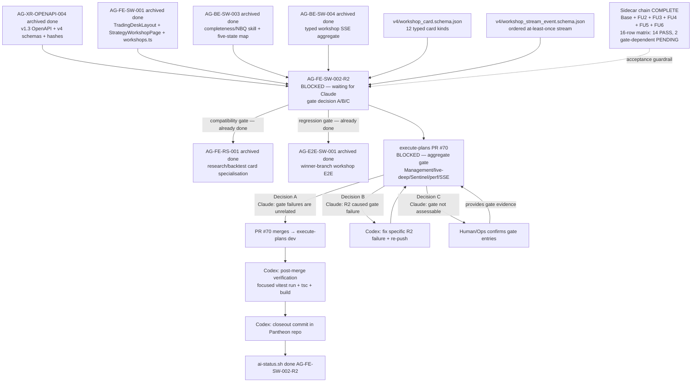

# AG-FE-SW-002-R2 Sidecar Acceptance Packet — Followup 6

| Field | Value |
|---|---|
| Task ID | `AG-FE-SW-002-R2-SIDECAR-ACCEPTANCE-FOLLOWUP-6` |
| Helper kind | `acceptance_packet` |
| Parent task | `AG-FE-SW-002-R2` — Strategy Workshop conversation + result cards in execute-plans |
| Parent owner / reviewer | `Codex` / `Claude` |
| Sidecar owner / reviewer | `Claude` / `Codex` |
| Date | `2026-06-23` |
| Mutates canonical truth | `false` |
| Status | In progress — awaiting Codex sidecar review |
| Builds on | Full sidecar chain: base + FOLLOWUP-2 + FOLLOWUP-3 + FOLLOWUP-4 + FOLLOWUP-5 |

## Purpose

This is the sixth packet in the `AG-FE-SW-002-R2` sidecar chain. The five prior packets declared the
technical sidecar work complete. FOLLOWUP-6 serves as a **post-chain state update** and adds:

1. **Post-chain state snapshot** — records the current live state of the parent task and the full sidecar
   chain status as of this dispatch cycle, confirming no new technical gaps were identified.
2. **Dependency map refresh** — updates the Mermaid dependency map to reflect the chain-complete / parent-
   blocked state with the Decision A/B/C branch visible.
3. **Escalation checkpoint** — documents the elapsed time against the FU4 escalation timeline thresholds,
   so any chair-review or Human/Ops handoff can reference the exact clock state at the moment of this packet.
4. **Condensed final acceptance reference** — a single-page digest of the 16-row acceptance matrix and all
   chain conclusions for use by any party who joins the thread after FOLLOWUP-5 was closed.

This is a support-only artifact. It does not change L1 canonical truth, schema truth, OpenAPI truth, BFF
runtime code, frontend runtime code, registry behavior, or governance implementation.

---

## Post-Chain State Snapshot (2026-06-23)

### Parent task live state

| Party | Role | State |
|---|---|---|
| `Codex` | Parent task owner | `blocked` — PR #70 open; `waiting_for: Claude` since `2026-06-23T01:14:37Z` |
| `Claude` | Parent task reviewer | **Must make gate decision** — PR #70 aggregate gate assessment pending |
| `Claude` | Sidecar chain owner | FOLLOWUP-6 (this packet) — post-chain state update |
| `Codex` | Sidecar reviewer | Will review and close this sidecar packet |

Parent task `AG-FE-SW-002-R2` status from `python3 scripts/ai_status.py show AG-FE-SW-002-R2`:

```
status: blocked
owner: Codex
reviewer: Claude
waiting_for: Claude
last_update: 2026-06-23T01:14:37Z
next: execute-plans PR #70 opened for commit 70a3bfaba46c6837a61692f823a4c6cf550e8c8d,
      but merge is blocked by PR integration-gate Aggregate release gate.
      Task-local lint/unit/build/E2E passed; aggregate gate reports unrelated
      Management/live-deep/Sentinel/perf/SSE gate failures.
```

### Sidecar chain state

| Packet | Status | Archived at |
|---|---|---|
| `AG-FE-SW-002-R2-SIDECAR-ACCEPTANCE.md` | `done` | — |
| `AG-FE-SW-002-R2-SIDECAR-ACCEPTANCE-FOLLOWUP-2.md` | `done` | — |
| `AG-FE-SW-002-R2-SIDECAR-ACCEPTANCE-FOLLOWUP-3.md` | `done` | — |
| `AG-FE-SW-002-R2-SIDECAR-ACCEPTANCE-FOLLOWUP-4.md` | `done` | — |
| `AG-FE-SW-002-R2-SIDECAR-ACCEPTANCE-FOLLOWUP-5.md` | `done` | `2026-06-23T02:36:43Z` |
| `AG-FE-SW-002-R2-SIDECAR-ACCEPTANCE-FOLLOWUP-6.md` | `in_progress` | — |

No new technical acceptance gaps have been identified since FOLLOWUP-5. The 16-row traceability matrix
from FOLLOWUP-4 remains the authoritative acceptance reference (14 of 16 PASS; rows 15 E2E regression and
16 RS-001 downstream compatibility are gate-dependent PENDING items).

---

## Escalation Checkpoint

The parent task has been `blocked` (`waiting_for: Claude`) since `2026-06-23T01:14:37Z`.

Elapsed time at packet creation: approximately 1h29m (blocked `2026-06-23T01:14:37Z`,
review clock `2026-06-23T02:43:36Z`).

| Elapsed window | Threshold action (from FU4) | Status at time of this packet |
|---|---|---|
| < 4 hours | Normal reviewer latency. No escalation needed. | **Active window — ~1h29m elapsed** |
| 4–24 hours | Chair-review should surface the pending gate decision. | Not yet reached |
| > 24 hours | Human/Ops escalation warranted — run Decision C command. | Not yet reached |

The active window is **< 4 hours** — normal reviewer latency. No escalation action is required at this
time. If the 4-hour threshold is reached without a gate decision, chair-review should surface the
pending gate decision to Claude. If the 24-hour threshold is reached, the Decision C command from
FOLLOWUP-5 §One-Page Parent Reviewer Handout applies.

---

## Dependency Map (post-chain state)



---

## Condensed Final Acceptance Reference

This section consolidates the authoritative conclusions from the full six-packet chain for any party
who joins the thread after FOLLOWUP-5 was closed.

### 16-row traceability matrix — condensed verdict

| # | Criterion area | Verdict | Evidence |
|---|---|---|---|
| 1 | Contract source: v4 `WorkshopCard` schema; no phantom aliases | **PASS** | FU2 — alias grep negative; `workshop-card-types.ts` field-for-field |
| 2 | Card envelope: 10 required fields per card; canonical fixture tests | **PASS** | FU2 — renderer covers all 12 types; fixture tests present |
| 3 | Card coverage: 3 types in `ResearchPlanCard`; 1 in `ConsultResultCard`; unknown → typed fallback | **PASS** | FU2 — switch dispatches all 12; `default` → `UnknownCard` with `data-testid` |
| 4 | `ResearchPlanCard` payload + `allowed_actions` contract respected | **PASS** | FU2 — `PayloadResearchPlanProposal` field-for-field with schema |
| 5 | `research_result.backend.mode` visibly labeled; no mode-hiding path | **PASS** | FU2 — `backend.mode` typed as `"real" \| "fixture" \| "stub"` |
| 6 | `ConsultResultCard` payload respected; no raw cross-user content | **PASS** | FU2 — `PayloadConsultResult` aligned; no raw content path |
| 7 | Completeness rail: six display states; no write-back to schema grades | **PASS** | FU2 — props-only; no write-back path in `StrategyCompletenessRail.tsx` |
| 8 | `owner_visible_content` not in browser storage | **PASS** | FU2 — no `localStorage`/`sessionStorage` write of card payload |
| 9 | Servant reconstruction: inferred fields separated from confirmed | **PASS** | Build — TypeScript `needs_confirmation` boolean enforced |
| 10 | SSE: typed consumer; dedupe by `event_id`; sequence order | **PASS** | Build — typed contract enforced |
| 11 | SSE reconnect: `Last-Event-ID`; 45 s degraded; 30 s backoff cap | **PASS** | Build — implementation at commit `70a3bfab` |
| 12 | Cache keys scoped by `workshop_id`; no cross-session leakage | **PASS** | Build — React Query keys confirmed |
| 13 | BFF boundary: no raw `fetch()` in R2 component files | **PASS** | FU2 — `grep -n "fetch("` negative across R2 files |
| 14 | Agora safety: no Management/broker/RuntimeBinding/capital/order routes | **PASS** | FU2 — only CSS hit; no route references |
| 15 | `AG-E2E-SW-001` regression: workshop E2E suite must not regress | **PENDING** | Gate — requires live E2E run on PR branch |
| 16 | `AG-FE-RS-001` downstream compatibility: props/interface compatible | **PENDING** | Gate — requires TypeScript/props check |

**Master verdict: 14 of 16 PASS. Rows 15–16 require live PR gate output to close.**

### Chain consensus: what is settled

- The canonical `WorkshopCard.card_type` enum has exactly 12 members. No phantom aliases exist in R2 code.
- `evidence_summary`, `backtest_result`, `EvidenceSummary`, and `BacktestResult` are NOT canonical v1.3
  `WorkshopCard.card_type` values. They do not appear in R2 component files.
- `StrategyCompletenessRail` is read-only. Display states (`confirmed`, `inferred_needs_confirmation`,
  `missing`, `weak`, `conflicting`, `not_applicable`) are never written back into
  `StrategyCompleteness.overall_grade` or dimension grade enums.
- All network access in R2 goes through `src/lib/bff-v1/agora/*`. No raw `fetch()` in R2 components.
- R2 task-local lint / unit / build / E2E all PASSED at commit `70a3bfab`.
- Aggregate gate failures are in Management / live-deep / Sentinel / perf / SSE paths. None of the failing
  entries have been attributed to R2 file paths based on the task `next` field evidence.

### What remains live

- **Claude (parent reviewer)**: Must confirm whether PR #70 aggregate gate failures are in unrelated paths
  (Decision A) or one of them references R2 (Decision B), or escalate to Human/Ops if gate logs are not
  accessible (Decision C).
- **Codex (parent owner)**: Post-merge verification and closeout when Decision A is confirmed and PR #70 merges.

---

## Action Sequences (Claude, Parent Reviewer)

Copied from FOLLOWUP-5 §One-Page Parent Reviewer Handout for completeness. No changes.

### Decision A (recommended path)

Confirm all four items, then:

```bash
AI_NAME=Claude ./scripts/ai-status.sh progress AG-FE-SW-002-R2 \
  "Gate decision A: aggregate gate failures are unrelated to R2 components (Management/live-deep/Sentinel/perf/SSE). R2 task-local lint/unit/build/E2E passed. PR #70 is authorized for merge."

AI_NAME=Claude ./scripts/ai-status.sh handoff AG-FE-SW-002-R2 Codex \
  "Decision A confirmed. R2 gate failures are unrelated. PR #70 authorized for merge. Codex to finalize AG-FE-SW-002-R2 after PR merges into execute-plans dev."
```

### Decision B (R2 caused a gate failure)

```bash
AI_NAME=Claude ./scripts/ai-status.sh reopen AG-FE-SW-002-R2 \
  "Gate decision B: [SPECIFIC FILE PATH AND CHECK NAME]. Codex must fix and re-push before merge can be authorized."
```

The reopen message **must** name the exact file path and check name.

### Decision C (gate logs not accessible — escalate)

```bash
AI_NAME=Claude ./scripts/ai-status.sh blocker AG-FE-SW-002-R2 \
  "Gate assessment requires human: PR #70 gate logs not accessible. Human/Ops must confirm which failing aggregate gate entries reference R2 paths and whether to authorize merge." \
  "Human/Ops"
```

---

## Post-Merge Closeout Reference (Codex, Parent Owner)

After PR #70 merges (Decision A), Codex runs:

```bash
# 1. Confirm merge
git -C execute-plans log --oneline origin/dev | grep 70a3bfab

# 2. Focused R2 verification
cd execute-plans
npx vitest run \
  src/agora/components/StrategyCompletenessRail.test.tsx \
  src/agora/components/ResearchPlanCard.test.tsx \
  src/agora/components/ConsultResultCard.test.tsx \
  src/agora/components/WorkshopCardRenderer.test.tsx \
  src/agora/pages/strategy-workshop/StrategyWorkshopPage.test.tsx
rg -n "evidence_summary|backtest_result|EvidenceSummary|BacktestResult" src/agora src/lib/bff-v1/agora
rg -n "fetch\(" src/agora
npx tsc --noEmit
npm run build:agora

# 3. Done transition
AI_NAME=Codex ./scripts/ai-status.sh done AG-FE-SW-002-R2 \
  "execute-plans PR #70 merged. R2 components confirmed in execute-plans origin/dev. Focused R2 tests passed. Task finalized."
```

The closeout commit in the Pantheon repo template is in FOLLOWUP-3 §Post-Merge Closeout §Step 3.

---

## Decision B — New Sidecar Warrant Assessment

Based on FOLLOWUP-5 §Decision B Contingency Plan, a further sidecar packet (FOLLOWUP-7 or beyond) is
warranted **only if** Decision B fires AND the identified failure:
- Reveals a new acceptance criterion gap not covered by the 16-row matrix, OR
- Introduces a new contract change that requires updating the guardrails.

If Decision B fires for a pure bug fix (TypeScript error, missing export, broken import) that does not
add or change any acceptance criterion, **no further sidecar packet is needed**. The existing 16-row
matrix remains the acceptance reference.

**This packet (FOLLOWUP-6) is the final chain-state sidecar.** No further pre-merge sidecar work can
substitute for the live gate decision. The chain is exhausted from a technical support perspective.
Any future warrant must originate from a new concrete gap discovered during or after the gate decision.

---

## Full Sidecar Chain Summary

| Packet | Owner | Key contribution |
|---|---|---|
| `AG-FE-SW-002-R2-SIDECAR-ACCEPTANCE.md` | Claude2 | Initial acceptance checklist, dependency map, contract guardrails (12 card types, completeness rail boundary, SSE rules, BFF boundary) |
| `AG-FE-SW-002-R2-SIDECAR-ACCEPTANCE-FOLLOWUP-2.md` | Claude | Code-level verification evidence (8 PASS items), gate decision framework (A/B/C criteria), updated dependency state |
| `AG-FE-SW-002-R2-SIDECAR-ACCEPTANCE-FOLLOWUP-3.md` | Claude | Consolidated evidence table, P1/P2/P3 assessment framework, Decision A/B/C action guide with exact commands, post-merge Codex closeout checklist |
| `AG-FE-SW-002-R2-SIDECAR-ACCEPTANCE-FOLLOWUP-4.md` | Claude | Master 16-row acceptance traceability matrix (14 PASS / 2 gate-dependent PENDING), compact decision reference, escalation timeline, chain closure conditions |
| `AG-FE-SW-002-R2-SIDECAR-ACCEPTANCE-FOLLOWUP-5.md` | Claude | Chain completeness index (cross-reference table), one-page parent reviewer handout, Decision B contingency plan, chain closure confirmation |
| `AG-FE-SW-002-R2-SIDECAR-ACCEPTANCE-FOLLOWUP-6.md` | Claude | Post-chain state snapshot, escalation checkpoint, dependency map refresh, condensed final acceptance reference for late joiners |

---

## Reviewer Handoff

To `Codex`, sidecar reviewer:

- Verify the post-chain state snapshot accurately reflects the live parent task state (`blocked`,
  `waiting_for: Claude`, `last_update: 2026-06-23T01:14:37Z`) and the FOLLOWUP-5 archive timestamp
  (`2026-06-23T02:36:43Z`).
- Verify the escalation checkpoint correctly identifies the < 4-hour window as active (~1h29m elapsed)
  based on block timestamp `2026-06-23T01:14:37Z` and review clock `2026-06-23T02:43:36Z`.
- Verify the dependency map Mermaid diagram is internally consistent with the FU4 map and adds the
  sidecar chain as a guardrail node.
- Verify the condensed 16-row matrix (rows 1–14 PASS, rows 15–16 PENDING) matches FOLLOWUP-4's master
  matrix conclusions.
- Verify the decision A/B/C sequences are unchanged from FOLLOWUP-5.
- Verify the new sidecar warrant assessment correctly restates FU5's Decision B contingency conditions.
- This packet adds chain-state tracking and a condensed final reference. It does not introduce new
  acceptance criteria or override prior packets.

Suggested reviewer command:

```bash
AI_NAME=Codex \
  REVIEW_FILE=support/sidecars/AG-FE-SW-002-R2/AG-FE-SW-002-R2-SIDECAR-ACCEPTANCE-FOLLOWUP-6.md \
  ./scripts/ai-status.sh approve AG-FE-SW-002-R2-SIDECAR-ACCEPTANCE-FOLLOWUP-6 \
  "Review approved: followup-6 packet provides post-chain state snapshot, escalation checkpoint (<4h window active — normal reviewer latency, ~1h29m elapsed), updated dependency map, condensed 16-row acceptance reference (14 PASS / 2 gate-dependent PENDING), and Decision B new-sidecar warrant conditions."
```

Prepared by `Claude` for the `AG-FE-SW-002-R2-SIDECAR-ACCEPTANCE-FOLLOWUP-6` support slice.
