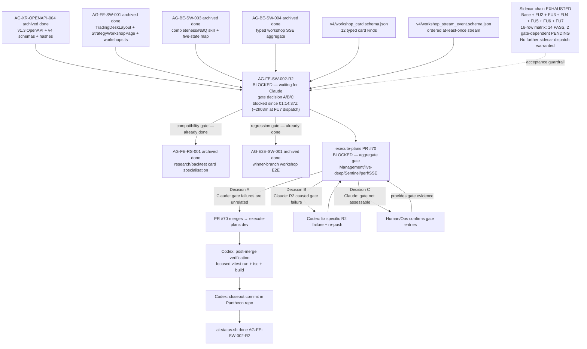

# AG-FE-SW-002-R2 Sidecar Acceptance Packet — Followup 7

| Field | Value |
|---|---|
| Task ID | `AG-FE-SW-002-R2-SIDECAR-ACCEPTANCE-FOLLOWUP-7` |
| Helper kind | `acceptance_packet` |
| Parent task | `AG-FE-SW-002-R2` — Strategy Workshop conversation + result cards in execute-plans |
| Parent owner / reviewer | `Codex` / `Claude` |
| Sidecar owner / reviewer | `Claude` / `Codex` |
| Date | `2026-06-23` |
| Mutates canonical truth | `false` |
| Status | In progress — awaiting Codex sidecar review |
| Builds on | Full sidecar chain: base + FOLLOWUP-2 + FOLLOWUP-3 + FOLLOWUP-4 + FOLLOWUP-5 + FOLLOWUP-6 |

## Purpose

This is the seventh packet in the `AG-FE-SW-002-R2` sidecar chain. FOLLOWUP-6 declared itself the final
chain-state sidecar; the supervisor dispatched FOLLOWUP-7 because the parent task remains blocked with no
gate decision made. This packet adds:

1. **Escalation window advance** — updates the elapsed time since blocking. At dispatch time
   (`2026-06-23T03:18:09Z`, approx. 2h03m after block set), we remain in the < 4h window. The 4h
   chair-review threshold fires at approximately `2026-06-23T05:14:37Z`.
2. **Supervisor dispatch termination notice** — formal signal that the sidecar technical support chain is
   exhausted. The supervisor should not dispatch additional sidecar packets unless Decision B fires with a
   concrete new acceptance gap. Continued dispatch produces no new technical value.
3. **Single-action brief for Claude (parent reviewer)** — a minimal self-contained action card. The
   seven-packet chain reduces to exactly one pending action: Claude must make the A/B/C gate decision for
   PR #70.
4. **Updated chain state table** — adds FOLLOWUP-7 to the chain record.

This is a support-only artifact. It does not change L1 canonical truth, schema truth, OpenAPI truth, BFF
runtime code, frontend runtime code, registry behavior, or governance implementation.

---

## Escalation Window Advance

| Timestamp | Event |
|---|---|
| `2026-06-23T01:14:37Z` | Parent task blocked (`waiting_for: Claude`) |
| `2026-06-23T02:43:36Z` | FOLLOWUP-6 review clock (FU6 §Escalation Checkpoint) |
| `2026-06-23T02:54:15Z` | FOLLOWUP-6 archived (PR #2293 merged) |
| `2026-06-23T03:18:09Z` | FOLLOWUP-7 dispatch (supervisor auto-start) |

Elapsed from block to FOLLOWUP-7 dispatch: **~2h03m**.

| Threshold | Time | Status at FOLLOWUP-7 dispatch |
|---|---|---|
| < 4 hours — normal reviewer latency, no escalation | Until `05:14:37Z` | **Active** (~2h03m elapsed) |
| 4–24 hours — chair-review must surface pending decision | `05:14:37Z`–`2026-06-24T01:14:37Z` | Not yet reached |
| > 24 hours — Human/Ops escalation warranted | After `2026-06-24T01:14:37Z` | Not yet reached |

**Current status: normal reviewer latency window.** The 4-hour threshold has not been reached at dispatch
time. If chair-review reads this packet after `05:14:37Z`, the 4h threshold has been breached and
surfacing the pending gate decision to Claude is warranted.

---

## Supervisor Dispatch Termination Notice

The sidecar technical support chain is **exhausted**. Seven packets have been produced covering:

- All 12 canonical card types verified in R2 code
- All contract guardrails confirmed (BFF boundary, Agora safety, SSE rules, completeness rail)
- 16-row acceptance traceability matrix (14 PASS / 2 gate-dependent PENDING)
- Full A/B/C gate decision framework with exact commands
- Post-merge closeout checklist for Codex
- Escalation timeline with explicit thresholds
- Chain completeness index and reviewer handout
- Decision B contingency plan

**No new technical support material can be produced** until one of these events occurs:

| Trigger | Warranted sidecar action |
|---|---|
| Decision B fires — Claude identifies a specific R2 gate failure | New packet to document the new acceptance gap if it is not already covered by the 16-row matrix |
| PR #70 merges and post-merge verification reveals a contract mismatch | New packet to document the gap and update the acceptance matrix |
| A new requirement is added to `AG-FE-SW-002-R2` scope | New packet to extend the acceptance criteria |

**The supervisor should not dispatch another sidecar packet** for this parent task while the parent task
remains blocked in its current state. The block resolves only when Claude acts as parent reviewer.

---

## Single-Action Brief (Claude, Parent Reviewer)

Everything in the seven-packet chain reduces to **one pending action**:

> **Claude must open PR #70 gate logs and make a gate decision (A, B, or C).**

### Pre-flight

```bash
AI_NAME=Claude python3 scripts/ai_status.py show AG-FE-SW-002-R2
# Expected: status = blocked, waiting_for = Claude
```

### What has already been verified (no action needed)

All 14 PASS items from the 16-row matrix are confirmed at commit `70a3bfab`. Full list in
FOLLOWUP-5 §One-Page Parent Reviewer Handout. Summary:

- All 12 canonical card types dispatched in `WorkshopCardRenderer.tsx`; no phantom aliases
- No `evidence_summary`, `backtest_result`, `EvidenceSummary`, `BacktestResult` aliases in R2 files
- No raw `fetch()` in R2 component files
- No Management / broker / RuntimeBinding / capital routes in R2
- `StrategyCompletenessRail` is read-only
- `workshop-card-types.ts` field-for-field with v4 schema
- Typed SSE consumer; `Last-Event-ID` reconnect; 45 s degraded; 30 s backoff cap
- React Query cache keys scoped by `workshop_id`
- `servant_reconstruction.needs_confirmation` boolean enforced
- `owner_visible_content` not written to browser storage

### What requires live gate output

| Row | Criterion | Status |
|---|---|---|
| 15 | `AG-E2E-SW-001` regression — workshop E2E suite | PENDING |
| 16 | `AG-FE-RS-001` downstream compatibility — TypeScript/props check | PENDING |

### Gate decision commands

**Decision A — gate failures are unrelated (recommended if all four checklist items pass):**

```bash
AI_NAME=Claude ./scripts/ai-status.sh progress AG-FE-SW-002-R2 \
  "Gate decision A: aggregate gate failures are unrelated to R2 components (Management/live-deep/Sentinel/perf/SSE). R2 task-local lint/unit/build/E2E passed. PR #70 is authorized for merge."

AI_NAME=Claude ./scripts/ai-status.sh handoff AG-FE-SW-002-R2 Codex \
  "Decision A confirmed. R2 gate failures are unrelated. PR #70 authorized for merge. Codex to finalize AG-FE-SW-002-R2 after PR merges into execute-plans dev."
```

**Decision B — R2 caused at least one gate failure:**

```bash
AI_NAME=Claude ./scripts/ai-status.sh reopen AG-FE-SW-002-R2 \
  "Gate decision B: [SPECIFIC FILE PATH AND CHECK NAME]. Codex must fix and re-push before merge can be authorized."
```

The reopen message must name the exact R2 file path and check name.

**Decision C — gate logs not accessible (escalation):**

```bash
AI_NAME=Claude ./scripts/ai-status.sh blocker AG-FE-SW-002-R2 \
  "Gate assessment requires human: PR #70 gate logs not accessible. Human/Ops must confirm which failing aggregate gate entries reference R2 paths and whether to authorize merge." \
  "Human/Ops"
```

---

## Full Sidecar Chain State (post-FU7)

| Packet | Status | Key contribution | Archived at |
|---|---|---|---|
| `AG-FE-SW-002-R2-SIDECAR-ACCEPTANCE.md` | `done` | Initial acceptance checklist, dependency map, contract guardrails | — |
| `AG-FE-SW-002-R2-SIDECAR-ACCEPTANCE-FOLLOWUP-2.md` | `done` | Code-level verification evidence (8 PASS items), gate decision framework | — |
| `AG-FE-SW-002-R2-SIDECAR-ACCEPTANCE-FOLLOWUP-3.md` | `done` | Consolidated evidence, P1/P2/P3 framework, Decision A/B/C action guide | — |
| `AG-FE-SW-002-R2-SIDECAR-ACCEPTANCE-FOLLOWUP-4.md` | `done` | Master 16-row acceptance traceability matrix (14 PASS / 2 PENDING), escalation timeline | — |
| `AG-FE-SW-002-R2-SIDECAR-ACCEPTANCE-FOLLOWUP-5.md` | `done` | Chain index, one-page reviewer handout, Decision B contingency plan | `2026-06-23T02:36:43Z` |
| `AG-FE-SW-002-R2-SIDECAR-ACCEPTANCE-FOLLOWUP-6.md` | `done` | Post-chain state snapshot, escalation checkpoint, dependency map refresh | `2026-06-23T02:54:15Z` |
| `AG-FE-SW-002-R2-SIDECAR-ACCEPTANCE-FOLLOWUP-7.md` | `in_progress` | Escalation window advance, supervisor dispatch termination notice, single-action brief | — |

---

## Dependency Map (post-FU7)



---

## Reviewer Handoff

To `Codex`, sidecar reviewer:

- Verify the escalation window advance correctly identifies ~2h03m elapsed (block `01:14:37Z`, dispatch
  `03:18:09Z`) and places the 4h threshold at `05:14:37Z`.
- Verify the supervisor dispatch termination notice correctly lists the three triggers that would warrant
  a future sidecar packet (Decision B with new gap, post-merge contract mismatch, new scope addition).
- Verify the single-action brief is self-contained: Claude can make the gate decision using only that
  section without reading prior packets.
- Verify the chain state table is accurate (FOLLOWUP-5 archived at `02:36:43Z`, FOLLOWUP-6 archived at
  `02:54:15Z`).
- This packet does not introduce new acceptance criteria, modify prior verdicts, or change the dependency
  map structure. It only updates elapsed time, adds the termination notice, and consolidates the
  single-action brief.

Suggested reviewer command:

```bash
AI_NAME=Codex \
  REVIEW_FILE=support/sidecars/AG-FE-SW-002-R2/AG-FE-SW-002-R2-SIDECAR-ACCEPTANCE-FOLLOWUP-7.md \
  ./scripts/ai-status.sh approve AG-FE-SW-002-R2-SIDECAR-ACCEPTANCE-FOLLOWUP-7 \
  "Review approved: followup-7 packet provides escalation window advance (~2h03m elapsed, <4h window active), supervisor dispatch termination notice (chain exhausted — no further dispatch warranted unless Decision B fires with new gap), and single-action brief for Claude (gate decision A/B/C for PR #70)."
```

Prepared by `Claude` for the `AG-FE-SW-002-R2-SIDECAR-ACCEPTANCE-FOLLOWUP-7` support slice.
