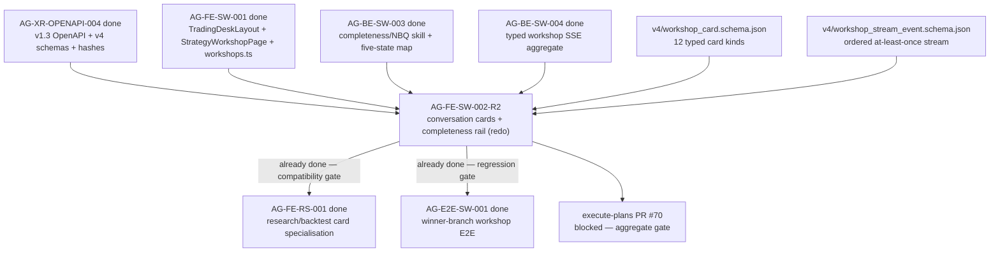

# AG-FE-SW-002-R2 Sidecar Acceptance Packet

| Field | Value |
|---|---|
| Task ID | `AG-FE-SW-002-R2-SIDECAR-ACCEPTANCE` |
| Helper kind | `acceptance_packet` |
| Parent task | `AG-FE-SW-002-R2` — Strategy Workshop conversation + result cards in execute-plans |
| Parent owner / reviewer | `Codex` / `Claude` |
| Sidecar owner / reviewer | `Claude2` / `Codex` |
| Date | `2026-06-23` |
| Mutates canonical truth | `false` |
| Status | Draft — pending reviewer acceptance |

## Purpose

This packet supports `AG-FE-SW-002-R2` (the post-pathfix redo of the original phantom `AG-FE-SW-002`) by
specifying the acceptance checklist, dependency state, card-contract guardrails, SSE stream guardrails,
and handoff notes for the Strategy Workshop conversation cards and completeness rail implementation.

It is support-only. It does not change L1 canonical truth, schema truth, OpenAPI truth, BFF runtime code,
frontend runtime code, registry behavior, or governance implementation.

## Parent Task Context

`AG-FE-SW-002-R2` implements three components in the `execute-plans` frontend repository:

- `execute-plans/src/agora/components/StrategyCompletenessRail.tsx`
- `execute-plans/src/agora/components/ResearchPlanCard.tsx`
- `execute-plans/src/agora/components/ConsultResultCard.tsx`

As of `2026-06-23`, the parent task is **blocked**: PR #70 is open in the execute-plans repository but
merge is blocked by the aggregate release gate. Task-local lint/unit/build/E2E passed. The failing gate
entries are in unrelated Management/live-deep/Sentinel/perf/SSE gate paths; they do not reflect failures
in the card/rail components under review.

The parent task is `waiting_for: Claude` — the reviewer must either confirm the gate failures are
unrelated and allow merge, or clarify which failures require fixes in this task slice.

## Sources Used

| Source | Relevance |
|---|---|
| `AI_NAME=Claude2 python3 scripts/ai_status.py show AG-FE-SW-002-R2` | Parent task title, owner/reviewer, block state, PR reference, and artifact scope. |
| `AI_NAME=Claude2 python3 scripts/ai_status.py show AG-FE-SW-002-R2-SIDECAR-ACCEPTANCE` | Sidecar task identity, support-only boundary, and reviewer. |
| `AI_NAME=Claude2 python3 scripts/ai_status.py show AG-FE-SW-001` | Confirms TradingDeskShell, StrategyWorkshopPage, and workshops BFF client are merged/done. |
| `AI_NAME=Claude2 python3 scripts/ai_status.py show AG-XR-OPENAPI-004` | Confirms additive Agora v1.3 OpenAPI/capability/schema bundle is merged/done. |
| `AI_NAME=Claude2 python3 scripts/ai_status.py show AG-BE-SW-003` | Confirms completeness/NBQ skill and five-state map are merged/done. |
| `AI_NAME=Claude2 python3 scripts/ai_status.py show AG-BE-SW-004` | Confirms workshop SSE aggregate stream is merged/done. |
| `AI_NAME=Claude2 python3 scripts/ai_status.py show AG-FE-RS-001` | Confirms research/backtest card specialisation layer is archived done (downstream). |
| `AI_NAME=Claude2 python3 scripts/ai_status.py show AG-E2E-SW-001` | Confirms winner-branch workshop E2E acceptance is archived done (downstream). |
| `docs/04/pantheon_agora_cross_repo_2026-06-20/design-closure-round2/03_workshop_sse_contract.md` | Typed SSE envelope, event catalogue, replay, heartbeat, sequence, and privacy rules. |
| `docs/04/pantheon_agora_cross_repo_2026-06-20/design-closure-round2/05_workshop_card_contracts.md` | Field-level workshop card envelope and payload contracts for all 12 card types. |
| `services/control-plane/openapi/agora_v1_3.openapi.yaml` | Canonical v1.3 route and schema references for cards/readiness/research/stream surfaces. |
| `services/control-plane/specs/agora/v4/workshop_card.schema.json` | Canonical `WorkshopCard` enum, required envelope fields, and typed payload definitions. |
| `services/control-plane/specs/agora/v4/workshop_stream_event.schema.json` | Canonical stream event envelope and event type enum. |
| `services/control-plane/specs/agora/v4/strategy_readiness.schema.json` | Canonical readiness gate projection fields. |
| `services/control-plane/specs/agora/strategy_completeness.schema.json` | Existing completeness assessment schema for grade/dimensions/research readiness. |
| `execute-plans/src/lib/bff-v1/agora/workshops.ts` | Current frontend BFF helper for workshops/completeness/readiness/cards. |
| `execute-plans/src/agora/pages/strategy-workshop/StrategyWorkshopPage.tsx` | Current shell skeleton to compose conversation and rail components into. |

## Current Dependency State

| Dependency | Current state | Acceptance consequence for `AG-FE-SW-002-R2` |
|---|---|---|
| `AG-FE-SW-001` | Archived `done`; `TradingDeskLayout`, `StrategyWorkshopPage`, and `workshops.ts` are merged. | Parent must extend the existing workshop page and BFF helper. Must not create a parallel route tree or call raw `fetch()` from page/components. |
| `AG-XR-OPENAPI-004` | Archived `done`; v1.3 OpenAPI, v4 schemas, capability manifest, and bundle hashes are merged. | Parent must use the v1.3 `WorkshopCard`, `WorkshopStreamEvent`, `StrategyReadinessAssessment`, and research projection contracts. No local enum/route drift is allowed. |
| `AG-BE-SW-003` | Archived `done`; completeness/NBQ skill implements `confirmed`, `inferred_needs_confirmation`, `missing`, `weak`, `conflicting`, `not_applicable`. | `StrategyCompletenessRail` may display the five active states plus `not_applicable`, but must not write those display states back into `StrategyCompleteness.overall_grade` or dimension grade enums. |
| `AG-BE-SW-004` | Archived `done`; workshop SSE aggregate stream is implemented. | Parent can consume `/bff/agora/workshops/{workshop_id}/stream`, but must handle duplicate/gap/out-of-order events and avoid persisting raw private content in browser storage. |
| `AG-FE-RS-001` | Archived `done`; research plan/run/consult/backtest card specialisation is merged. | `ResearchPlanCard.tsx` and `ConsultResultCard.tsx` delivered by `AG-FE-SW-002-R2` must establish the typed skeleton that `AG-FE-RS-001` extended. Verify that the R2 implementations are compositionally compatible with the already-merged specialisation layer. If conflicts exist, open a blocker; do not silently diverge. |
| `AG-E2E-SW-001` | Archived `done`; winner-branch workshop E2E is merged. | E2E tests already exist for the workshop path. R2 implementation must not regress those tests. The E2E suite is a backward-compatibility gate, not a forward-permission. |

## Contract Mismatches To Guard

### 1. No invented card types

The canonical `WorkshopCard.card_type` enum has exactly 12 members:

```text
user_strategy_description
servant_reconstruction
completeness_update
missing_definition
next_question
research_plan_proposal
research_progress
research_result
consult_result
version_patch_proposal
version_compare
readiness_gate
```

Acceptance rule: `AG-FE-SW-002-R2` must not add local card type aliases, ad hoc extensions for
`evidence_summary`, `backtest_result`, `EvidenceSummary`, `BacktestResult`, or any variant. Those
two names appeared in earlier phantom briefs and are **not** canonical v1.3 `WorkshopCard.card_type`
values. Evidence and backtest output must be represented through `research_result` payload fields
(`metrics`, `findings`, `artifact_refs`, `evidence_refs`, `backend`, `data_cutoff`).

### 2. Completeness rail display-state vs schema-grade separation

The `StrategyCompletenessRail` displays the NBQ skill's five projection states:

```text
confirmed
inferred_needs_confirmation
missing
weak
conflicting
```

plus `not_applicable` and provisional treatment. These **display states** must not be written back
into `StrategyCompleteness.overall_grade` (`complete`, `mostly_complete`, `partial`, `incomplete`)
or dimension grade (`complete`, `partial`, `missing`). The rail is read-only with respect to
completeness schema truth.

### 3. BFF boundary enforcement

All network access must go through `src/lib/bff-v1/agora/*`. Cards and rail components must not
call `fetch()` directly. Regression check:

```bash
rg -n "fetch\\(" execute-plans/src/agora
```

No new raw `fetch()` calls should appear.

### 4. Agora safety boundary

Cards and rail must not place broker orders, bind capital, write `RuntimeBinding`, or call
Management routes. No `/management`, broker, `RuntimeBinding`, capital, or order route may appear
in this slice.

### 5. SSE consumer correctness

The SSE stream consumer added in this task must:
- Deduplicate by `event_id`
- Apply events in `sequence_no` order
- Trigger a snapshot refresh on a sequence gap
- Treat 45 seconds without event/heartbeat as degraded
- Use exponential backoff capped at 30 seconds on reconnect
- Send `Last-Event-ID` on reconnect
- Not assume global ordering across workshops

## Parent Acceptance Checklist

| Area | Acceptance rule | Reviewer check |
|---|---|---|
| Contract source | Use `WorkshopCard` semantics from `services/control-plane/specs/agora/v4/workshop_card.schema.json` and v1.3 route `/bff/agora/workshops/{workshop_id}/cards`. | No local card enum with `evidence_summary`, `backtest_result`, camelCase aliases, or fields absent from the schema. |
| Card envelope | Every rendered card respects `spec_version`, `card_id`, `card_type`, `workshop_id`, `sequence_no`, `status`, `title`, `payload`, `created_at`, plus optional `source_event_ids`, `workshop_version_id`, `strategy_spec_registry_id`, `summary`, `evidence_refs`, `allowed_actions`, `updated_at`. | Tests include at least one canonical envelope fixture and fail if required fields are ignored or renamed. |
| Card coverage | `ResearchPlanCard` renders `research_plan_proposal`, `research_progress`, and `research_result` from typed payload fields. `ConsultResultCard` renders `consult_result` from typed payload fields. Unknown `card_type` values must fall through to a typed error/fallback, not be treated as trusted LLM markdown. | Renderer switches on `card_type`; unknown values display a contract-error fallback. |
| `ResearchPlanCard` payload | Renders `plan_id`, `objectives`, `data_requirements`, `stages` (with `stage_id`, `stage_type`, `purpose`, `preferred_backend`, `dependencies`), `evaluation_criteria`, `budget`, `assumptions`, `warnings`, `approval_requirement`. Actions `approve`, `edit`, `reject/cancel`, `request_explanation` are shown only when present in `allowed_actions`. | No invented approval flow outside `allowed_actions` contract. |
| `research_result` labeling | When `research_result` payload includes `backend.mode`, the card visibly labels whether the result is from a real, fixture, or stub backend. | `mode` value is displayed; no mode-hiding display path. |
| `ConsultResultCard` payload | Renders `consultation_id`, `consultation_type`, `participant_persona_refs`, `status`, `consensus_summary`, `disagreements`, `risk_notes`, `conditions`, `evidence_refs`, `freshness`. | Central persona outputs do not imply access to unrelated raw user content. |
| `StrategyCompletenessRail` state map | Displays `confirmed`, `inferred_needs_confirmation`, `missing`, `weak`, `conflicting`, and `not_applicable` projection states from completeness skill output. Surfaces the next high-value decision. | Rail distinguishes display-state map from `StrategyCompleteness.overall_grade` and dimension grade enums. No write-back to schema grades. |
| User description privacy | `user_strategy_description.payload.owner_visible_content` is owner-visible only and never placed in `localStorage`, `sessionStorage`, URL params, trace text, or cross-user cache keys. | Code search shows no browser storage write of card payload or raw message text. |
| Servant reconstruction fidelity | `servant_reconstruction` visibly separates trader-stated facts, servant inferences that need confirmation, uncertainties, contradictions, and proposed next actions. | UI does not present inferred fields (`servant_inferences[].needs_confirmation = true`) as confirmed facts. |
| SSE application | Stream consumer accepts only `WorkshopStreamEvent` event types, dedupes by `event_id`, applies per-workshop `sequence_no` in order, refreshes snapshot on gaps, and ignores duplicates. | Tests cover duplicate event, gap event, and snapshot refresh path. |
| SSE replay/heartbeat | Client uses `Last-Event-ID` on reconnect, treats 45 seconds without event/heartbeat as degraded, and applies exponential backoff capped at 30 seconds. | No code assumes global ordering or keeps POST requests open for long-running work. |
| Cache key isolation | React Query/store/cache keys include tenant/user/workshop where available, or avoid cross-workshop shared card state if tenant/user is not exposed. | A guessed workshop ID must not let data leak across sessions in local client state. |
| BFF boundary | Pages/components use `src/lib/bff-v1/agora/*`; no component calls raw `fetch()` directly. | `rg -n "fetch\\(" execute-plans/src/agora` shows no new component/page fetches. |
| Agora safety boundary | Cards and rail never place broker orders, bind capital, write RuntimeBinding, or call Management routes. | No `/management`, broker, RuntimeBinding, capital, or order route appears in this slice. |
| `AG-E2E-SW-001` regression | Implementation must not regress existing workshop E2E tests. | E2E test run passes (or failures are documented as pre-existing/unrelated). |
| Downstream compatibility | `ResearchPlanCard.tsx` and `ConsultResultCard.tsx` must be compositionally compatible with `AG-FE-RS-001`'s specialisation layer (already merged). | No interface or props collision between R2 skeletons and RS-001 extensions. |

## PR Unblock Notes

As of `2026-06-23`, execute-plans PR #70 is blocked by the aggregate release gate. The gate reports
failures in Management/live-deep/Sentinel/perf/SSE paths that are **unrelated** to the
`StrategyCompletenessRail`, `ResearchPlanCard`, and `ConsultResultCard` components.

Reviewer (`Claude`) must decide one of:

1. **Gate failures are unrelated and pre-existing** — confirm this explicitly and authorize merge;
   do not require R2 owner to fix unrelated Management/Sentinel paths.
2. **One or more gate failures are caused by R2 changes** — identify the specific failure and
   return with concrete required changes; do not keep the task blocked on ambiguous "aggregate gate
   failed" without specifying which failure belongs to this slice.

The parent task is `waiting_for: Claude`. This packet provides the acceptance guardrails to support
that review decision.

## Suggested Component Boundary For Parent Owner

The current `StrategyWorkshopPage` (AG-FE-SW-001) already fetches workshop, completeness, readiness,
and cards through `execute-plans/src/lib/bff-v1/agora/workshops.ts` and renders a skeleton
conversation/rail inline.

Recommended parent R2 shape:

```text
execute-plans/src/agora/components/StrategyCompletenessRail.tsx   ← new in R2
execute-plans/src/agora/components/ResearchPlanCard.tsx           ← new in R2
execute-plans/src/agora/components/ConsultResultCard.tsx          ← new in R2
execute-plans/src/agora/pages/strategy-workshop/StrategyWorkshopPage.tsx  ← updated in R2
execute-plans/src/lib/bff-v1/agora/workshops.ts                  ← extended in R2 if needed
```

This is a suggested composition boundary, not a new canonical artifact list. Any additional small
card components should remain under `execute-plans/src/agora/components/` and keep all network
logic in the BFF helper layer.

## Dependency Map



## Suggested Parent Verification

Focused checks once PR #70 merge is unblocked:

```bash
cd execute-plans
npx vitest run src/agora/components/StrategyCompletenessRail.test.tsx \
                src/agora/components/ResearchPlanCard.test.tsx \
                src/agora/components/ConsultResultCard.test.tsx \
                src/agora/pages/strategy-workshop/StrategyWorkshopPage.test.tsx

rg -n "evidence_summary|backtest_result|EvidenceSummary|BacktestResult" \
   src/agora src/lib/bff-v1/agora

rg -n "fetch\\(" src/agora
```

Repository-level checks that should remain part of parent closeout:

```bash
git diff --check
cd execute-plans
npx tsc --noEmit
npm run build:agora
PANTHEON_CONTRACT_ROOT=.. npm run test:contract
```

If repo-wide TypeScript, build, or contract tests have unrelated failures, parent closeout should
record the exact focused tests that passed and the unrelated failure signature.

## Reviewer Handoff

To `Codex`, sidecar reviewer:

- Verify this packet accurately reflects the v1.3 workshop card enum (12 types), typed card payloads,
  SSE event contract, completeness/NBQ state-map display-vs-schema-grade distinction, and
  support-only boundary.
- Pay particular attention to the `EvidenceSummary` / `BacktestResult` mismatch warning — this is
  the same guardrail as in the original `AG-FE-SW-002-SIDECAR-ACCEPTANCE` and remains relevant
  for the R2 redo.
- Note the `AG-FE-RS-001` compatibility gate: the R2 components must be compositionally compatible
  with the already-merged research card specialisation layer.
- Note the PR #70 aggregate gate block: the packet documents the unblocking decision criteria
  for the parent reviewer (Claude).
- If accepted, approve this sidecar and let the parent owner use it as the `AG-FE-SW-002-R2`
  acceptance guardrail during the PR #70 review.

Suggested reviewer command:

```bash
AI_NAME=Codex REVIEW_FILE=support/sidecars/AG-FE-SW-002-R2/AG-FE-SW-002-R2-SIDECAR-ACCEPTANCE.md \
  ./scripts/ai-status.sh approve AG-FE-SW-002-R2-SIDECAR-ACCEPTANCE \
  "Review approved: AG-FE-SW-002-R2 acceptance packet captures v1.3 card/SSE contracts, dependency state, completeness rail state-map boundary, no invented card enums, AG-FE-RS-001 compatibility gate, PR #70 unblock criteria, and support-only scope."
```

Prepared by `Claude2` for the `AG-FE-SW-002-R2-SIDECAR-ACCEPTANCE` support slice.
